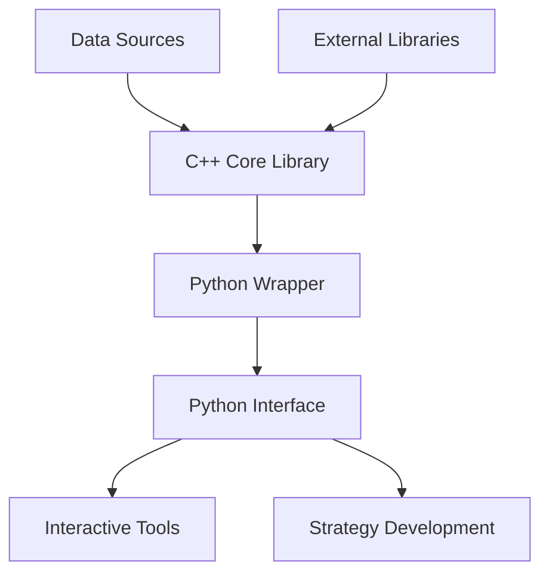
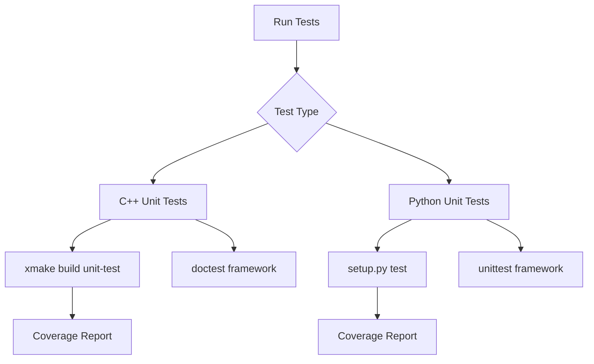
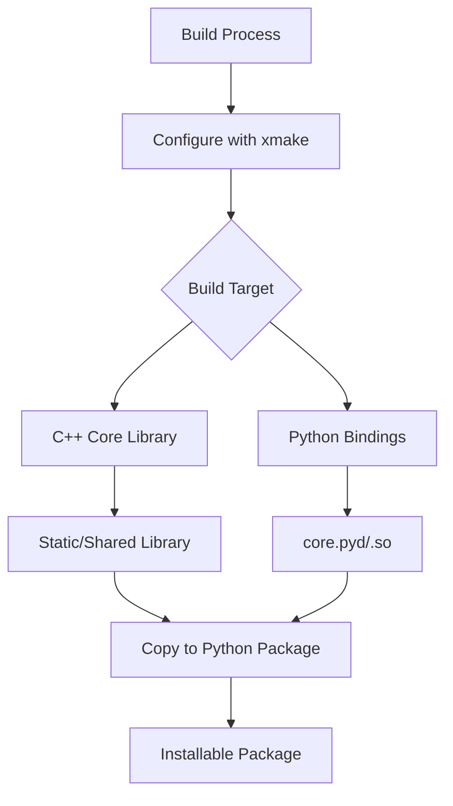

# Development Guide

<cite>
**Referenced Files in This Document**   
- [readme.md](file://readme.md)
- [setup.py](file://setup.py)
- [xmake.lua](file://xmake.lua)
- [sub_setup.py](file://sub_setup.py)
- [hikyuu/__init__.py](file://hikyuu/__init__.py)
- [hikyuu_cpp/hikyuu/xmake.lua](file://hikyuu_cpp/hikyuu/xmake.lua)
- [hikyuu_cpp/unit_test/xmake.lua](file://hikyuu_cpp/unit_test/xmake.lua)
- [hikyuu_pywrap/xmake.lua](file://hikyuu_pywrap/xmake.lua)
- [docs/source/release.md](file://docs/source/release.md)
- [hikyuu/test/test.py](file://hikyuu/test/test.py)
- [hikyuu/test/test_init.py](file://hikyuu/test/test_init.py)
- [requirements.txt](file://requirements.txt)
</cite>

## Table of Contents
1. [Introduction](#introduction)
2. [Setting Up the Development Environment](#setting-up-the-development-environment)
3. [Code Structure and Organization](#code-structure-and-organization)
4. [Testing Framework](#testing-framework)
5. [Building from Source](#building-from-source)
6. [Coding Standards and Style Guidelines](#coding-standards-and-style-guidelines)
7. [Versioning and Release Process](#versioning-and-release-process)
8. [Documentation Guidelines](#documentation-guidelines)
9. [Contribution Process](#contribution-process)
10. [Code Review and Quality Expectations](#code-review-and-quality-expectations)

## Introduction

Hikyuu Quant Framework is an open-source quantitative trading research framework based on C++/Python, designed for strategy analysis and backtesting (currently primarily focused on the domestic A-share market). The framework emphasizes building core technologies in quantitative trading, encompassing **trading model development, high-speed computing engines, efficient backtesting frameworks, and real-trading extension capabilities**.

This development guide provides comprehensive documentation for contributors to Hikyuu, covering the contribution process, code structure, testing framework, building process, coding standards, release process, and documentation guidelines. The goal is to enable new contributors to start working on the project with minimal friction.

**Section sources**
- [readme.md](file://readme.md)

## Setting Up the Development Environment

To set up a development environment for Hikyuu, you need to install the required dependencies and build tools. The project uses xmake as its build system and Python for the wrapper and interactive components.

First, ensure you have Python installed (version 3.10 or higher as specified in the setup configuration). Install the Python dependencies using pip:

```bash
pip install -r requirements.txt
```

The project requires xmake as its build tool. You can install xmake from https://xmake.io. The project's xmake.lua files configure the build process for both the C++ core and Python wrapper components.

For development, you'll also need the following key dependencies:
- boost
- fmt
- spdlog
- sqlite3
- flatbuffers
- nng
- nlohmann_json
- pybind11
- ta-lib

These dependencies are managed through xmake's package management system as specified in the xmake.lua files. The project also supports optional features with MySQL, HDF5, and TDX data engines, which can be enabled or disabled during configuration.

**Section sources**
- [requirements.txt](file://requirements.txt)
- [xmake.lua](file://xmake.lua)
- [hikyuu_cpp/hikyuu/xmake.lua](file://hikyuu_cpp/hikyuu/xmake.lua)

## Code Structure and Organization

The Hikyuu project follows a modular structure with clear separation between the C++ core, Python wrapper, and application components. The main directories are:

- **hikyuu/**: Python package containing the main interface, organized into submodules:
  - analysis/: Strategy analysis components
  - config/: Configuration files and block definitions
  - data/: Data handling and import utilities
  - draw/: Visualization components with multiple backends
  - examples/: Example notebooks and scripts
  - fetcher/: Data fetchers for various sources
  - indicator/: Technical indicator implementations
  - strategy/: Example strategies
  - test/: Unit tests for Python components
  - trade_manage/: Trade management components
  - trade_sys/: Trading system components
  - util/: Utility functions

- **hikyuu_cpp/**: C++ core library with performance-critical components:
  - analysis/: Analysis system implementations
  - data_driver/: Data drivers for various storage formats
  - global/: Global components and schedulers
  - indicator/: Indicator implementations
  - plugin/: Plugin interfaces and implementations
  - serialization/: Serialization components
  - strategy/: Strategy implementations
  - trade_manage/: Trade management implementations
  - trade_sys/: Trading system implementations
  - utilities/: Utility components
  - unit_test/: Unit tests for C++ components

- **hikyuu_pywrap/**: Python bindings using pybind11 to expose C++ functionality to Python

- **docker/**: Docker configurations for development environments

- **test_data/**: Test data for unit tests

The architecture follows a layered approach where the C++ core provides high-performance implementations of quantitative trading components, while the Python layer provides a user-friendly interface and integration with the Python data science ecosystem (numpy, pandas, etc.).



**Diagram sources **
- [hikyuu/__init__.py](file://hikyuu/__init__.py)
- [hikyuu_cpp/hikyuu/xmake.lua](file://hikyuu_cpp/hikyuu/xmake.lua)

**Section sources**
- [hikyuu/__init__.py](file://hikyuu/__init__.py)
- [project_structure](file://project_structure)

## Testing Framework

Hikyuu employs a comprehensive testing framework with both C++ and Python unit tests to ensure code quality and reliability. The testing infrastructure is organized as follows:

The C++ unit tests are located in the hikyuu_cpp/unit_test directory and use the doctest framework. The tests are organized by component (analysis, indicator, serialization, trade_manage, etc.) and can be built and run using xmake commands. The unit_test/xmake.lua file configures the test targets, including "unit-test" for full testing and "small-test" for minimal testing.

The Python tests are located in the hikyuu/test directory and use Python's unittest framework. Each component has its own test file (e.g., Datetime.py, Indicator.py, KData.py) that contains test cases for that component. The main test.py file aggregates all test suites and runs them together.

The test initialization is handled by test_init.py, which sets up the test environment by loading configuration files (hikyuu_win.ini for Windows, hikyuu_linux.ini for Linux) and initializing the StockManager instance. The test framework uses cached configuration and provides utilities for testing with real TDX data.

To run the tests, use the setup.py script with the test command:
```bash
python setup.py test
```

This will build the necessary components and run the tests. For full testing, use the --all flag:
```bash
python setup.py test --all
```

The testing framework also supports coverage analysis when built in coverage mode, generating lcov reports for code coverage metrics.



**Diagram sources **
- [hikyuu_cpp/unit_test/xmake.lua](file://hikyuu_cpp/unit_test/xmake.lua)
- [hikyuu/test/test.py](file://hikyuu/test/test.py)
- [hikyuu/test/test_init.py](file://hikyuu/test/test_init.py)

**Section sources**
- [hikyuu_cpp/unit_test/xmake.lua](file://hikyuu_cpp/unit_test/xmake.lua)
- [hikyuu/test/test.py](file://hikyuu/test/test.py)
- [hikyuu/test/test_init.py](file://hikyuu/test/test_init.py)

## Building from Source

Hikyuu uses xmake as its build system, with Python setup.py scripts providing a convenient interface for building and installing the package. The build process involves compiling the C++ core library and creating Python bindings using pybind11.

The main build configuration is defined in the root xmake.lua file, which sets project-wide options such as:
- C++ standard (C++17)
- Build modes (debug, release, coverage, etc.)
- Optional features (MySQL, HDF5, SQLite, TDX data engines)
- Logging and performance options
- Serialization support

The build process can be initiated using the setup.py script, which provides several commands:

- **build**: Compile the core library
- **test**: Build and run tests
- **install**: Compile and install the Python package
- **wheel**: Generate a Python wheel package
- **clear**: Clean build artifacts
- **uninstall**: Remove installed package

To build the project, run:
```bash
python setup.py build
```

To generate a distributable wheel package:
```bash
python setup.py wheel
```

The hikyuu_pywrap/xmake.lua file configures the Python extension module build, setting the output filename to core.pyd on Windows and core.so on Unix-like systems. It also handles platform-specific linking and library copying.

The sub_setup.py script is used for generating the final package metadata and configuration, reading the version from xmake.lua and setting up package data files.



**Diagram sources **
- [setup.py](file://setup.py)
- [xmake.lua](file://xmake.lua)
- [hikyuu_pywrap/xmake.lua](file://hikyuu_pywrap/xmake.lua)
- [sub_setup.py](file://sub_setup.py)

**Section sources**
- [setup.py](file://setup.py)
- [xmake.lua](file://xmake.lua)
- [hikyuu_pywrap/xmake.lua](file://hikyuu_pywrap/xmake.lua)
- [sub_setup.py](file://sub_setup.py)

## Coding Standards and Style Guidelines

Hikyuu follows consistent coding standards across its C++ and Python codebases to maintain code quality and readability.

For C++ code:
- C++17 standard is used
- Google C++ style guide principles are followed
- Header files are properly guarded
- const correctness is enforced
- Smart pointers are used for memory management
- Exception safety is considered
- Doxygen-style comments are used for API documentation

For Python code:
- PEP 8 style guide is followed
- Type hints are used where appropriate
- Comprehensive docstrings are provided for all public functions and classes
- Consistent naming conventions are used
- Error handling is implemented with appropriate exceptions

The project uses xmake for build configuration, with consistent patterns across the various xmake.lua files. The build system uses unity builds to improve compilation speed by combining multiple source files into single compilation units.

The code organization follows a modular structure with clear separation of concerns. Each component is implemented in its own directory with appropriate header and source file organization. The C++ core library uses a namespace hierarchy (hikyuu::) to organize functionality.

The project also maintains consistency in logging and error reporting, using the spdlog library for C++ logging and Python's logging module for Python components. Error messages are descriptive and provide sufficient context for debugging.

**Section sources**
- [hikyuu_cpp/hikyuu/xmake.lua](file://hikyuu_cpp/hikyuu/xmake.lua)
- [hikyuu/__init__.py](file://hikyuu/__init__.py)

## Versioning and Release Process

Hikyuu follows a semantic versioning scheme (MAJOR.MINOR.PATCH) as evidenced by the version declarations in the xmake.lua files and release notes. The current version is 2.7.0, with regular updates that include new features, optimizations, and bug fixes.

The version is defined in the root xmake.lua file:
```lua
set_version("2.7.0", {build = "%Y%m%d%H%M"})
```

The release process is documented in the release.md file, which provides detailed release notes for each version. Releases include:
- New features (🚀)
- Optimizations and improvements (⚡️)
- Bug fixes (🐞)

The release notes provide specific examples and code snippets to demonstrate new functionality. For example, version 2.7.0 introduced new slippage algorithms and optimized data loading logic.

The project uses GitHub Actions for continuous integration, with build workflows for both Windows and Ubuntu platforms. The CI system ensures that builds are successful across different platforms before releases.

The wheel command in setup.py is used to generate distributable packages for PyPI. The upload command is reserved for maintainers to publish releases to PyPI.

Release planning appears to be regular, with versions 2.6.8, 2.6.9, and 2.7.0 released in quick succession in late 2025, suggesting an active development and release cycle.

**Section sources**
- [xmake.lua](file://xmake.lua)
- [docs/source/release.md](file://docs/source/release.md)
- [setup.py](file://setup.py)

## Documentation Guidelines

Hikyuu maintains comprehensive documentation to support both users and developers. The documentation is organized into several categories:

1. **User Documentation**: Located in the docs/source directory, this includes tutorials, user guides, and API documentation. The documentation is built using Sphinx and hosted on Read the Docs.

2. **Development Documentation**: This guide serves as the primary development documentation, covering contribution processes, code structure, and development workflows.

3. **Inline Documentation**: Both C++ and Python code contain extensive comments and docstrings. C++ code uses Doxygen-style comments, while Python code follows PEP 257 docstring conventions.

4. **Example Documentation**: The examples/notebook directory contains Jupyter notebooks that serve as both examples and documentation. These notebooks demonstrate various features of the framework with executable code and explanations.

When contributing new features, contributors should:
1. Add appropriate docstrings to all new functions and classes
2. Update relevant documentation files in the docs/source directory
3. Add or update example notebooks to demonstrate the new functionality
4. Include usage examples in the docstrings
5. Ensure all documentation is clear, accurate, and up-to-date

The project also maintains a help documentation site at https://hikyuu.readthedocs.io/ with comprehensive guides and API references.

**Section sources**
- [docs/source/release.md](file://docs/source/release.md)
- [hikyuu/examples/notebook](file://hikyuu/examples/notebook)
- [readme.md](file://readme.md)

## Contribution Process

Contributors to Hikyuu should follow this process to make changes and submit pull requests:

1. **Fork the Repository**: Create a fork of the Hikyuu repository on GitHub or Gitee.

2. **Create a Feature Branch**: Create a new branch for your changes with a descriptive name.

3. **Make Changes**: Implement your changes following the coding standards and style guidelines.

4. **Write Tests**: Add appropriate unit tests for new functionality or bug fixes.

5. **Update Documentation**: Update documentation to reflect your changes.

6. **Build and Test**: Build the project and run tests to ensure your changes don't break existing functionality.

7. **Commit Changes**: Commit your changes with clear, descriptive commit messages.

8. **Push to Your Fork**: Push your branch to your forked repository.

9. **Submit Pull Request**: Create a pull request to the main repository with a detailed description of your changes.

The project uses GitHub Actions for continuous integration, so your pull request will be automatically tested on Windows and Ubuntu platforms. Address any issues identified by the CI system.

For significant changes, it's recommended to open an issue first to discuss the proposed changes with the maintainers.

When submitting a pull request, include:
- A clear description of the problem being solved
- An explanation of your solution
- Any relevant screenshots or examples
- References to related issues or discussions

**Section sources**
- [readme.md](file://readme.md)
- [setup.py](file://setup.py)

## Code Review and Quality Expectations

The Hikyuu project maintains high standards for code quality, and contributions are expected to meet the following expectations:

1. **Code Quality**:
   - Code must be clean, well-organized, and follow the project's coding standards
   - Functions and classes should have single responsibilities
   - Code should be efficient and avoid unnecessary complexity
   - Memory management must be correct, especially in C++ code
   - Error handling should be comprehensive and appropriate

2. **Testing**:
   - All new functionality must be accompanied by unit tests
   - Tests should cover both normal operation and edge cases
   - Tests should be reliable and not depend on external factors when possible
   - Code coverage should be maintained or improved

3. **Documentation**:
   - All public APIs must be properly documented
   - Comments should explain why code exists, not what it does
   - Documentation should be clear and accurate
   - Examples should be provided when appropriate

4. **Performance**:
   - The framework prioritizes performance, especially in the C++ core
   - Changes should not introduce significant performance regressions
   - Optimizations should be justified and measured

5. **Compatibility**:
   - Changes should maintain backward compatibility when possible
   - Breaking changes should be clearly documented and justified
   - Changes should work across supported platforms (Windows, Linux, macOS)

During code review, maintainers will evaluate contributions based on these criteria. Contributors should be prepared to make revisions based on feedback. The review process may include requests for:
- Additional tests
- Improved documentation
- Code refactoring for better design
- Performance optimizations
- Better error handling

The goal of the review process is to maintain the high quality and reliability of the Hikyuu framework while welcoming contributions from the community.

**Section sources**
- [readme.md](file://readme.md)
- [hikyuu/test/test.py](file://hikyuu/test/test.py)
- [hikyuu/__init__.py](file://hikyuu/__init__.py)