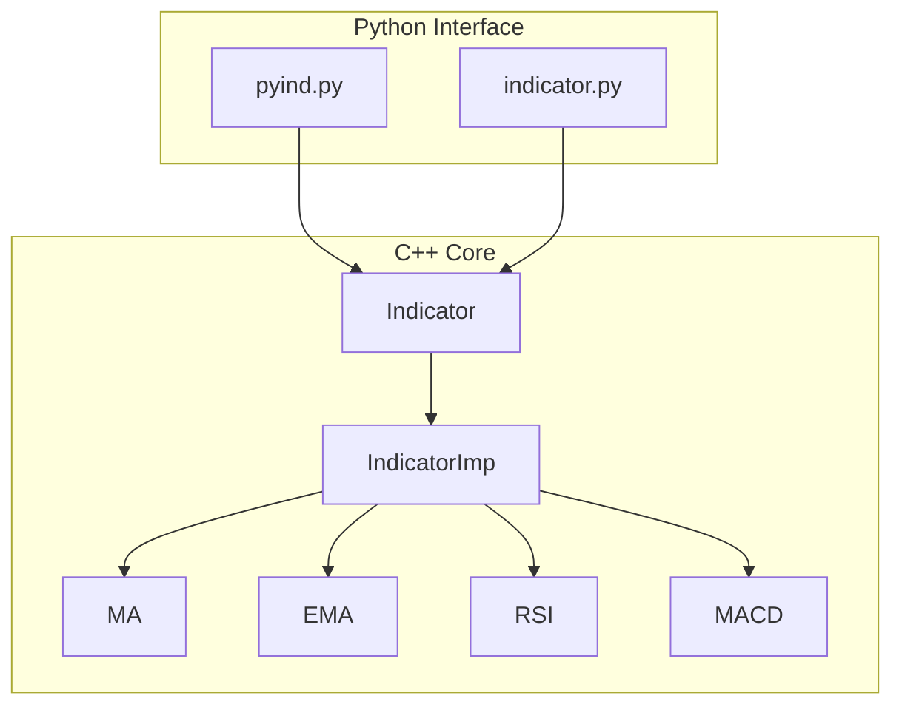
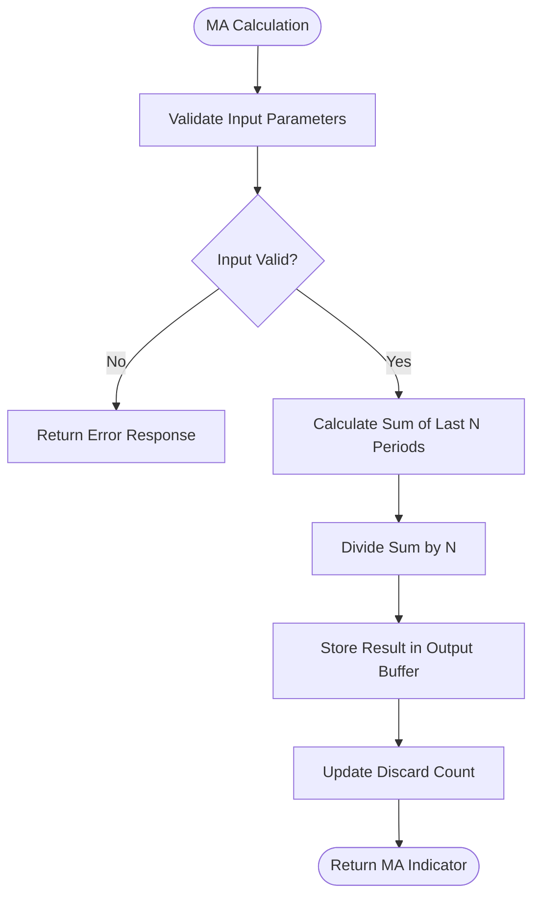
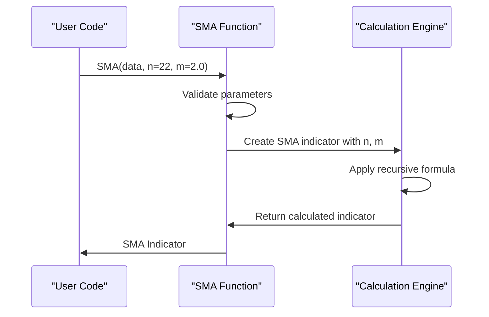
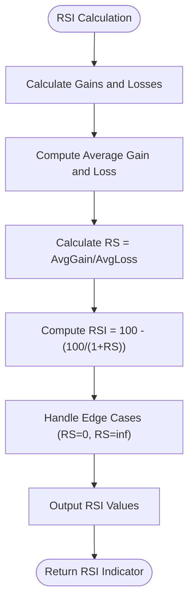
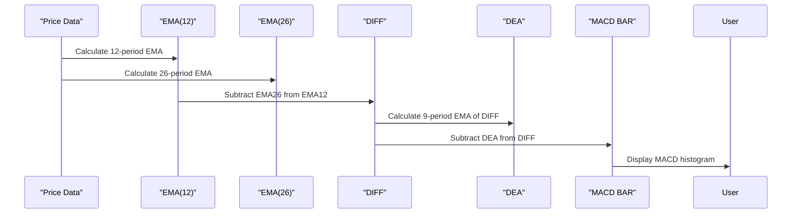
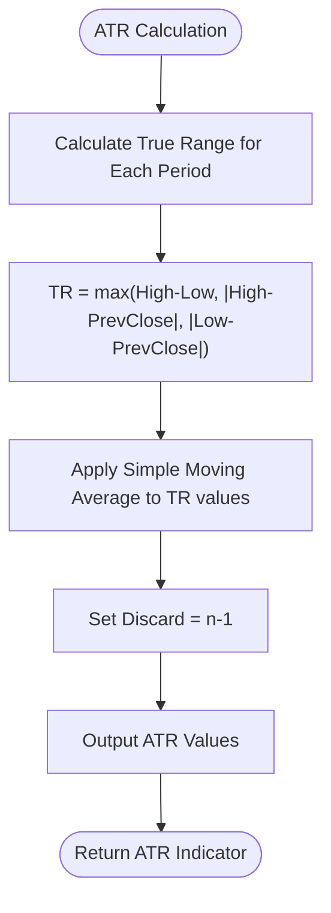
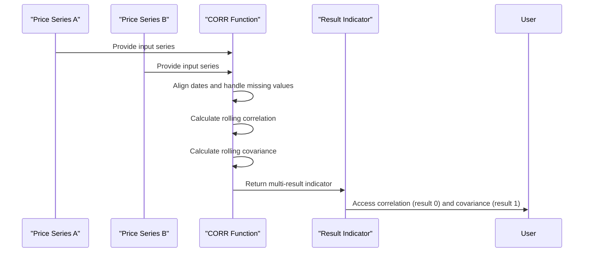
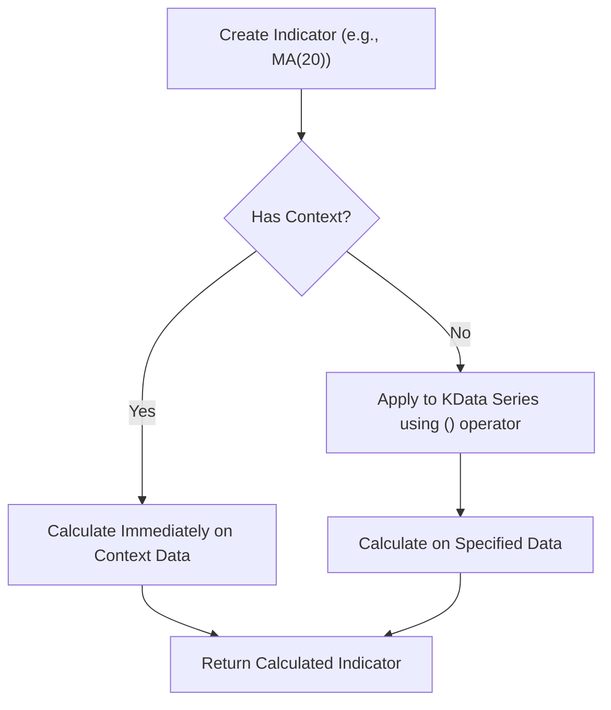

# Built-in Indicators

<cite>
**Referenced Files in This Document**   
- [indicator.py](file://hikyuu/indicator/indicator.py)
- [pyind.py](file://hikyuu/indicator/pyind.py)
- [Indicator.h](file://hikyuu_cpp/hikyuu/indicator/Indicator.h)
- [Indicator.cpp](file://hikyuu_cpp/hikyuu/indicator/Indicator.cpp)
- [MA.h](file://hikyuu_cpp/hikyuu/indicator/crt/MA.h)
- [EMA.h](file://hikyuu_cpp/hikyuu/indicator/crt/EMA.h)
- [SMA.h](file://hikyuu_cpp/hikyuu/indicator/crt/SMA.h)
- [WMA.h](file://hikyuu_cpp/hikyuu/indicator/crt/WMA.h)
- [RSI.h](file://hikyuu_cpp/hikyuu/indicator/crt/RSI.h)
- [MACD.h](file://hikyuu_cpp/hikyuu/indicator/crt/MACD.h)
- [ROC.h](file://hikyuu_cpp/hikyuu/indicator/crt/ROC.h)
- [ATR.h](file://hikyuu_cpp/hikyuu/indicator/crt/ATR.h)
- [STDEV.h](file://hikyuu_cpp/hikyuu/indicator/crt/STDEV.h)
- [CORR.h](file://hikyuu_cpp/hikyuu/indicator/crt/CORR.h)
- [SPEARMAN.h](file://hikyuu_cpp/hikyuu/indicator/crt/SPEARMAN.h)
- [build_in.h](file://hikyuu_cpp/hikyuu/indicator/build_in.h)
- [_build_in.cpp](file://hikyuu_pywrap/indicator/_build_in.cpp)
</cite>

## Table of Contents
1. [Introduction](#introduction)
2. [Architecture Overview](#architecture-overview)
3. [Moving Averages](#moving-averages)
4. [Momentum Oscillators](#momentum-oscillators)
5. [Volatility Measures](#volatility-measures)
6. [Statistical Functions](#statistical-functions)
7. [Python Bindings and Usage](#python-bindings-and-usage)
8. [Performance Considerations](#performance-considerations)
9. [Common Issues and Best Practices](#common-issues-and-best-practices)

## Introduction

Hikyuu provides a comprehensive suite of built-in technical indicators implemented in C++ for high performance and exposed through Python bindings for ease of use. The indicator system is designed with a modular architecture that separates the computational core from the interface layer, allowing for efficient calculation of financial metrics on KData series. This document details the implementation of core technical indicators including moving averages, momentum oscillators, volatility measures, and statistical functions, explaining their parameters, return values, and usage patterns in trading strategies.

**Section sources**
- [indicator.py](file://hikyuu/indicator/indicator.py#L1-L120)
- [pyind.py](file://hikyuu/indicator/pyind.py#L1-L47)

## Architecture Overview

The indicator system in Hikyuu follows a two-layer architecture with C++ implementations for computational efficiency and Python bindings for accessibility. The core functionality is defined in the Indicator class hierarchy, where each indicator inherits from IndicatorImp and implements specific calculation logic. The system supports both direct parameter inputs and dynamic parameter passing through IndParam, enabling flexible indicator composition.

**Diagram sources **
- [Indicator.h](file://hikyuu_cpp/hikyuu/indicator/Indicator.h#L1-L488)
- [build_in.h](file://hikyuu_cpp/hikyuu/indicator/build_in.h#L1-L135)

**Section sources**
- [Indicator.h](file://hikyuu_cpp/hikyuu/indicator/Indicator.h#L1-L488)
- [Indicator.cpp](file://hikyuu_cpp/hikyuu/indicator/Indicator.cpp#L1-L345)

## Moving Averages

Hikyuu implements several types of moving averages, each serving different analytical purposes in technical analysis. These indicators are fundamental for identifying trends and potential support/resistance levels.

### Simple Moving Average (MA)

The Simple Moving Average (MA) calculates the arithmetic mean of price data over a specified period. It smooths price data to form a trend-following indicator. The implementation provides two signatures: one with a fixed period and another that accepts dynamic parameters.

**Diagram sources **
- [MA.h](file://hikyuu_cpp/hikyuu/indicator/crt/MA.h#L1-L45)

**Section sources**
- [MA.h](file://hikyuu_cpp/hikyuu/indicator/crt/MA.h#L1-L45)

### Exponential Moving Average (EMA)

The Exponential Moving Average (EMA) gives more weight to recent prices, making it more responsive to new information compared to the simple moving average. The EMA implementation requires a period greater than zero and applies exponential smoothing to the price data.

**Section sources**
- [EMA.h](file://hikyuu_cpp/hikyuu/indicator/crt/EMA.h#L1-L45)

### Smoothed Moving Average (SMA)

The Smoothed Moving Average (SMA) uses a recursive formula where the current value depends on the previous SMA value and the current price. The formula Y=[M*X+(N-M)*Y']/N, where Y' is the previous period's value, creates a smoothing effect that reduces volatility in the indicator output.

**Diagram sources **
- [SMA.h](file://hikyuu_cpp/hikyuu/indicator/crt/SMA.h#L1-L73)

**Section sources**
- [SMA.h](file://hikyuu_cpp/hikyuu/indicator/crt/SMA.h#L1-L73)

### Weighted Moving Average (WMA)

The Weighted Moving Average (WMA) assigns linearly decreasing weights to historical data points, with more recent data receiving higher weights. The algorithm computes Yn=(1*X1+2*X2+...+n*Xn)/(1+2+...+n), creating a weighted sum where the denominator is the triangular number of the period.

**Section sources**
- [WMA.h](file://hikyuu_cpp/hikyuu/indicator/crt/WMA.h#L1-L47)

## Momentum Oscillators

Momentum oscillators in Hikyuu measure the speed and change of price movements, helping traders identify overbought or oversold conditions and potential trend reversals.

### Relative Strength Index (RSI)

The Relative Strength Index (RSI) measures the magnitude of recent price changes to evaluate overbought or oversold conditions. The implementation with a default 14-period window compares the average gains and losses over the specified period, normalizing the result to a 0-100 scale.

**Diagram sources **
- [RSI.h](file://hikyuu_cpp/hikyuu/indicator/crt/RSI.h#L1-L28)

**Section sources**
- [RSI.h](file://hikyuu_cpp/hikyuu/indicator/crt/RSI.h#L1-L28)

### Moving Average Convergence Divergence (MACD)

The MACD indicator consists of three components: the MACD line (DIFF), the signal line (DEA), and the MACD histogram (BAR). The implementation uses two EMAs (typically 12 and 26 periods) to calculate the MACD line, then applies a 9-period EMA to create the signal line.

**Diagram sources **
- [MACD.h](file://hikyuu_cpp/hikyuu/indicator/crt/MACD.h#L1-L63)

**Section sources**
- [MACD.h](file://hikyuu_cpp/hikyuu/indicator/crt/MACD.h#L1-L63)

### Rate of Change (ROC)

The Rate of Change (ROC) indicator measures the percentage change in price between the current price and the price a specified number of periods ago. The formula ((price / prevPrice)-1)*100 creates a momentum oscillator that fluctuates around zero.

**Section sources**
- [ROC.h](file://hikyuu_cpp/hikyuu/indicator/crt/ROC.h#L1-L40)

## Volatility Measures

Volatility indicators in Hikyuu quantify the degree of price variation over time, helping traders assess market risk and potential breakout opportunities.

### Average True Range (ATR)

The Average True Range (ATR) measures market volatility by decomposing the entire range of an asset price for a given period. It calculates the true range (TR) for each period, which considers the current high-low range and price gaps from the previous period, then takes the simple average of these values.

**Diagram sources **
- [ATR.h](file://hikyuu_cpp/hikyuu/indicator/crt/ATR.h#L1-L34)

**Section sources**
- [ATR.h](file://hikyuu_cpp/hikyuu/indicator/crt/ATR.h#L1-L34)

### Standard Deviation (STDEV)

The Standard Deviation (STDEV) indicator calculates the statistical standard deviation of price data over a specified period, measuring the dispersion of prices from their mean. This volatility measure helps identify periods of high or low market volatility.

**Section sources**
- [STDEV.h](file://hikyuu_cpp/hikyuu/indicator/crt/STDEV.h#L1-L45)

## Statistical Functions

Hikyuu provides advanced statistical functions for analyzing relationships between different financial instruments and identifying correlation patterns.

### Pearson Correlation (CORR)

The Pearson Correlation coefficient (CORR) measures the linear relationship between two price series. The implementation returns both the correlation coefficient and covariance in a multi-result indicator, with options for rolling window calculation and null value handling.

**Diagram sources **
- [CORR.h](file://hikyuu_cpp/hikyuu/indicator/crt/CORR.h#L1-L26)

**Section sources**
- [CORR.h](file://hikyuu_cpp/hikyuu/indicator/crt/CORR.h#L1-L26)

### Spearman Rank Correlation (SPEARMAN)

The Spearman Rank Correlation coefficient measures the monotonic relationship between two variables by assessing how well the relationship can be described using a monotonic function. Unlike Pearson correlation, it works with ranked data and can detect non-linear relationships.

**Section sources**
- [SPEARMAN.h](file://hikyuu_cpp/hikyuu/indicator/crt/SPEARMAN.h#L1-L25)

## Python Bindings and Usage

The Python interface to Hikyuu's indicators provides a user-friendly API that exposes the high-performance C++ implementations. The bindings allow for intuitive indicator composition and calculation on KData series.

### Indicator Creation and Context

Indicators can be created with or without a context. When created with a KData context, the indicator is automatically calculated on that data series. The context system allows indicators to be reused across different financial instruments.

**Section sources**
- [indicator.py](file://hikyuu/indicator/indicator.py#L107-L119)
- [_build_in.cpp](file://hikyuu_pywrap/indicator/_build_in.cpp)

### Common Usage Patterns

The most common usage pattern involves applying indicators to KData series obtained from stock objects. The system supports both direct function calls and method chaining for complex indicator compositions.

**Section sources**
- [pyind.py](file://hikyuu/indicator/pyind.py#L30-L47)
- [indicator.py](file://hikyuu/indicator/indicator.py#L39-L81)

## Performance Considerations

The C++ implementation of indicators ensures high computational efficiency, but certain usage patterns can impact performance, especially with large datasets or complex indicator combinations.

### Memory Management

The indicator system uses shared pointers and efficient memory buffers to minimize memory allocation overhead. However, chaining multiple indicators can create intermediate data structures that consume memory.

**Section sources**
- [Indicator.h](file://hikyuu_cpp/hikyuu/indicator/Indicator.h#L249)
- [Indicator.cpp](file://hikyuu_cpp/hikyuu/indicator/Indicator.cpp#L23-L28)

### Calculation Efficiency

The system optimizes calculations by caching results and using efficient algorithms for common operations. However, indicators with large lookback periods or complex mathematical operations should be used judiciously in real-time applications.

**Section sources**
- [Indicator.cpp](file://hikyuu_cpp/hikyuu/indicator/Indicator.cpp#L121-L314)

## Common Issues and Best Practices

### Lookback Period Requirements

Most indicators require a minimum number of data points to produce valid results. The system handles this through the discard property, which specifies how many initial values should be ignored due to insufficient lookback data.

**Section sources**
- [Indicator.h](file://hikyuu_cpp/hikyuu/indicator/Indicator.h#L85-L89)

### Boundary Conditions

Indicators may produce unexpected results at data boundaries, especially when dealing with incomplete periods or missing data. The system provides options for handling these cases through alignment and null value policies.

**Section sources**
- [CORR.h](file://hikyuu_cpp/hikyuu/indicator/crt/CORR.h#L19)
- [SPEARMAN.h](file://hikyuu_cpp/hikyuu/indicator/crt/SPEARMAN.h#L18)

### Best Practices

1. Always check the discard value when using indicators to ensure sufficient data is available
2. Use appropriate lookback periods based on the analysis timeframe
3. Consider the computational cost of complex indicator combinations
4. Validate indicator results against known test cases
5. Use the context system efficiently to avoid redundant calculations

**Section sources**
- [Indicator.h](file://hikyuu_cpp/hikyuu/indicator/Indicator.h#L75-L78)
- [indicator.py](file://hikyuu/indicator/indicator.py#L39-L81)