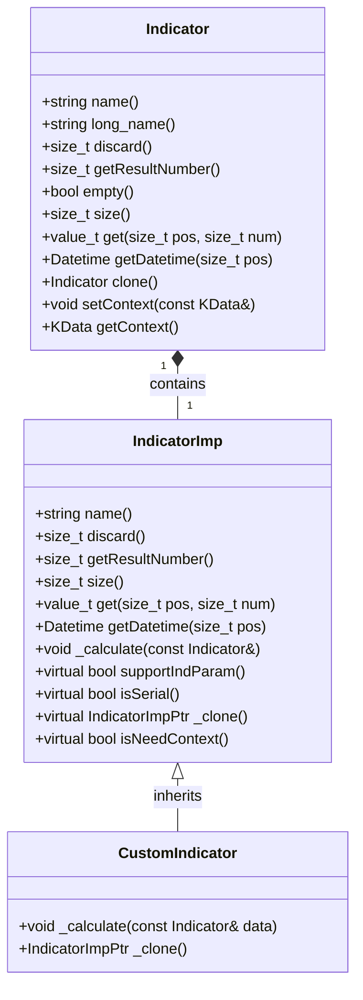
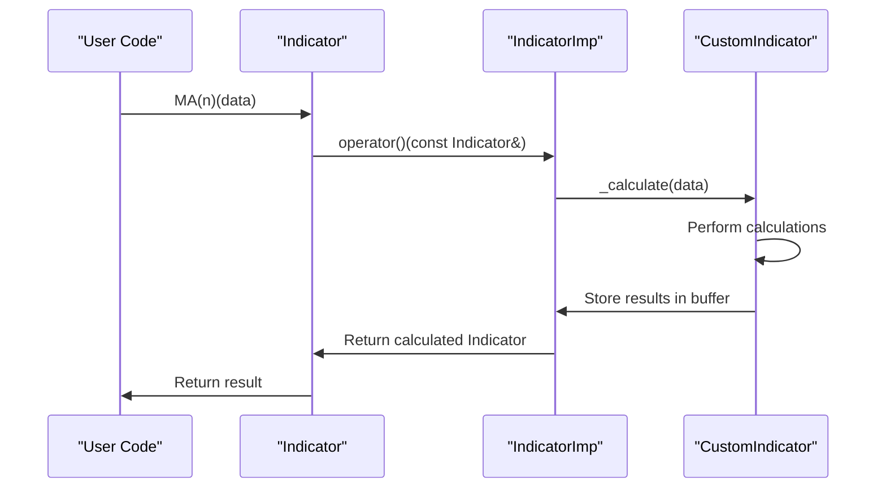
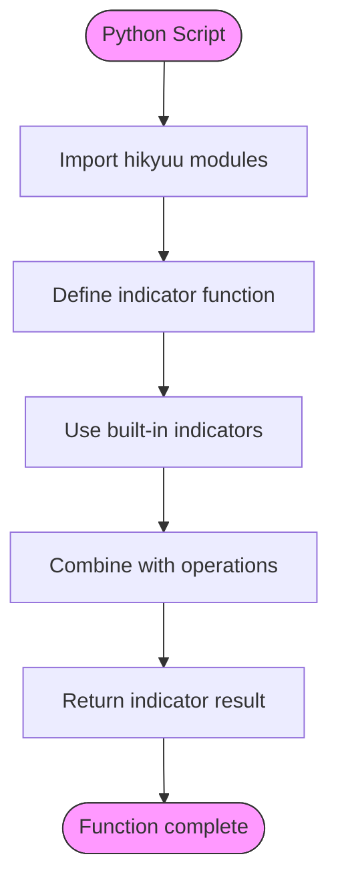
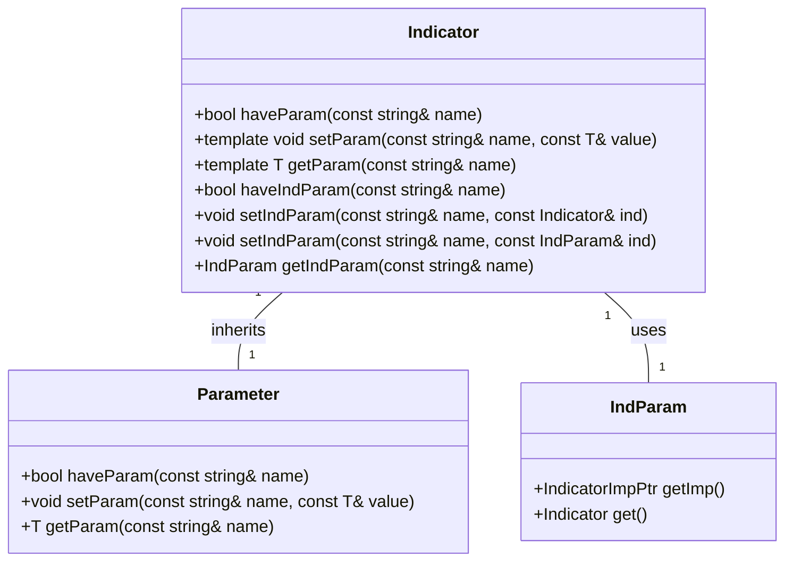

# Custom Indicator Development

<cite>
**Referenced Files in This Document**   
- [indicator.py](file://hikyuu/indicator/indicator.py)
- [pyind.py](file://hikyuu/indicator/pyind.py)
- [Indicator.h](file://hikyuu_cpp/hikyuu/indicator/Indicator.h)
- [Indicator.cpp](file://hikyuu_cpp/hikyuu/indicator/Indicator.cpp)
- [IndicatorImp.h](file://hikyuu_cpp/hikyuu/indicator/IndicatorImp.h)
- [IndParam.h](file://hikyuu_cpp/hikyuu/indicator/IndParam.h)
- [MA.h](file://hikyuu_cpp/hikyuu/indicator/crt/MA.h)
- [RSI.cpp](file://hikyuu_cpp/hikyuu/indicator/crt/RSI.cpp)
- [CVAL.h](file://hikyuu_cpp/hikyuu/indicator/crt/CVAL.h)
- [REF.h](file://hikyuu_cpp/hikyuu/indicator/crt/REF.h)
- [EMA.h](file://hikyuu_cpp/hikyuu/indicator/crt/EMA.h)
</cite>

## Table of Contents
1. [Introduction](#introduction)
2. [Indicator Class Hierarchy](#indicator-class-hierarchy)
3. [C++ Extension Interface](#c-extension-interface)
4. [Python Wrapper Functions](#python-wrapper-functions)
5. [Domain Model of Indicator Parameters](#domain-model-of-indicator-parameters)
6. [Integration with KData System](#integration-with-kdata-system)
7. [Memory Management and Performance](#memory-management-and-performance)
8. [Debugging and Troubleshooting](#debugging-and-troubleshooting)
9. [Conclusion](#conclusion)

## Introduction

Hikyuu provides a comprehensive framework for developing custom technical indicators through both C++ extension interfaces and Python wrapper functions. The system is designed to allow users to create sophisticated financial indicators that can be seamlessly integrated into trading strategies. The architecture separates the interface from implementation, with the core logic implemented in C++ for performance and exposed to Python for ease of use. This document details the implementation patterns, inheritance hierarchy, and integration points necessary for developing custom indicators in the Hikyuu ecosystem.

**Section sources**
- [Indicator.h](file://hikyuu_cpp/hikyuu/indicator/Indicator.h#L1-L50)
- [IndicatorImp.h](file://hikyuu_cpp/hikyuu/indicator/IndicatorImp.h#L1-L50)

## Indicator Class Hierarchy

The indicator system in Hikyuu follows a clear inheritance hierarchy with well-defined responsibilities. At the core is the `Indicator` class, which serves as the public interface, and the `IndicatorImp` class, which provides the base implementation that custom indicators should inherit from.



**Diagram sources**
- [Indicator.h](file://hikyuu_cpp/hikyuu/indicator/Indicator.h#L40-L259)
- [IndicatorImp.h](file://hikyuu_cpp/hikyuu/indicator/IndicatorImp.h#L28-L365)

The `Indicator` class acts as a wrapper around the implementation pointer (`IndicatorImpPtr`), providing a stable interface while allowing for polymorphic behavior. The `IndicatorImp` class is the abstract base class that all custom indicators must inherit from, requiring the implementation of the `_calculate` method and providing default implementations for other methods.

Custom indicators follow the pattern shown in the documentation comments of `Indicator.h`, where a new indicator class inherits from `IndicatorImp` and implements the required virtual methods. The indicator creation functions (like `MA`, `RSI`) return an `Indicator` object that wraps an instance of the corresponding implementation class.

**Section sources**
- [Indicator.h](file://hikyuu_cpp/hikyuu/indicator/Indicator.h#L19-L38)
- [IndicatorImp.h](file://hikyuu_cpp/hikyuu/indicator/IndicatorImp.h#L28-L365)

## C++ Extension Interface

Developing custom indicators in C++ requires inheriting from the `IndicatorImp` class and implementing specific methods. The primary method that must be overridden is `_calculate`, which contains the core logic for computing indicator values.



**Diagram sources**
- [Indicator.cpp](file://hikyuu_cpp/hikyuu/indicator/Indicator.cpp#L103-L119)
- [IndicatorImp.h](file://hikyuu_cpp/hikyuu/indicator/IndicatorImp.h#L152-L153)

The process for creating a custom indicator in C++ involves several key steps:

1. **Create a new class** that inherits from `IndicatorImp`
2. **Implement the `_calculate` method** with the indicator logic
3. **Override the `_clone` method** to support copying
4. **Set the indicator name** using the `name()` method
5. **Define a factory function** that returns an `Indicator` wrapping the implementation

The RSI indicator implementation demonstrates this pattern:

```cpp
Indicator HKU_API RSI(int n) {
    Indicator diff = REF(0) - REF(1);
    Indicator u = IF(diff > 0, diff, 0);
    Indicator d = IF(diff < 0, (-1) * diff, 0);
    Indicator ema_u = EMA(u, n);
    Indicator ema_d = EMA(d, n);
    ema_d = IF(ema_d == 0.0, 1, ema_d);
    Indicator rs = ema_u / ema_d;
    Indicator _1 = CVAL(1);
    Indicator rsi = (_1 - _1 / (_1 + rs)) * CVAL(100);
    rsi.name("RSI");
    rsi.setParam<int>("n", n);
    return rsi;
}
```

This implementation uses existing indicators (REF, EMA, CVAL) to build the RSI calculation, demonstrating the compositional nature of the indicator system. The `setParam` method is used to store configuration parameters that can be accessed later.

**Section sources**
- [RSI.cpp](file://hikyuu_cpp/hikyuu/indicator/crt/RSI.cpp#L17-L32)
- [IndicatorImp.h](file://hikyuu_cpp/hikyuu/indicator/IndicatorImp.h#L152-L153)

## Python Wrapper Functions

The Python interface for custom indicators provides a more accessible way to develop and use indicators without writing C++ code. The system exposes the core C++ functionality through pybind11 wrappers, allowing Python functions to create and manipulate indicators.



**Diagram sources**
- [pyind.py](file://hikyuu/indicator/pyind.py#L30-L47)

The KDJ indicator implementation in Python demonstrates this approach:

```python
def KDJ(kdata=None, n=9, m1=3, m2=3):
    rsv = (CLOSE() - LLV(LOW(), n)) / (HHV(HIGH(), n) - LLV(LOW(), n)) * 100
    k = SMA(rsv, m1, 1)
    d = SMA(k, m2, 1)
    j = 3 * k - 2 * d
    if kdata is not None:
        k.set_context(kdata)
        j.set_context(kdata)
        d.set_context(kdata)
    return k, d, j
```

This Python function uses the same building blocks as the C++ implementation but in a more concise and readable format. The built-in indicator functions (CLOSE, LLV, HHV, SMA) are imported and made available at the module level, allowing for a domain-specific language approach to indicator development.

The Python wrapper also provides utility functions like `concat_to_df` and `df_to_ind` that facilitate integration with pandas DataFrames, making it easier to work with external data sources and perform analysis.

**Section sources**
- [pyind.py](file://hikyuu/indicator/pyind.py#L30-L47)
- [indicator.py](file://hikyuu/indicator/indicator.py#L39-L81)

## Domain Model of Indicator Parameters

The indicator system in Hikyuu has a well-defined domain model for parameters, inputs, and outputs. Understanding this model is crucial for developing robust custom indicators.

### Parameter System

Indicators can have both simple parameters (int, double, string) and complex indicator parameters (IndParam). The `IndParam` class allows indicators to accept other indicators as parameters, enabling dynamic and composable indicator designs.



**Diagram sources**
- [IndParam.h](file://hikyuu_cpp/hikyuu/indicator/IndParam.h#L21-L37)
- [Indicator.h](file://hikyuu_cpp/hikyuu/indicator/Indicator.h#L155-L179)

### Input Requirements

Indicators can operate on different types of input data:
- **KData**: Price/volume data for a security
- **Other indicators**: For composite indicators
- **Constant values**: Using CVAL for fixed values

The input system is designed to be flexible, allowing indicators to be chained together in complex ways. The `operator()` overloads in the `Indicator` class handle the application of indicators to data sources.

### Output Specifications

Indicators can produce multiple output series (up to MAX_RESULT_NUM, which is 6). Each result series is a time series of values aligned with the input data. The output can be accessed through various methods:

- `get(pos, num)`: Get value at position pos in result series num
- `getResult(num)`: Get the entire result series as an Indicator
- `getResultAsPriceList(num)`: Get result as a PriceList

The discard value indicates how many initial values should be ignored due to insufficient data for calculation.

**Section sources**
- [Indicator.h](file://hikyuu_cpp/hikyuu/indicator/Indicator.h#L91-L137)
- [IndicatorImp.h](file://hikyuu_cpp/hikyuu/indicator/IndicatorImp.h#L71-L97)

## Integration with KData System

Custom indicators are tightly integrated with the KData system, which manages the underlying market data. This integration ensures proper time series alignment and data type handling.

```mermaid
erDiagram
KData ||--o{ Indicator : "contains"
Indicator ||--o{ DatetimeList : "has dates"
Indicator ||--o{ PriceList : "has values"
Stock ||--o{ KData : "has data"
Query ||--o{ KData : "retrieves"
KData {
Stock stock
KQuery query
DatetimeList dates
PriceList open
PriceList high
PriceList low
PriceList close
PriceList volume
PriceList amount
}
Indicator {
string name
size_t discard
size_t result_num
vector<value_t>* buffers
KData context
}
DatetimeList {
vector<Datetime> datetimes
}
PriceList {
vector<value_t> values
}
```

**Diagram sources**
- [Indicator.h](file://hikyuu_cpp/hikyuu/indicator/Indicator.h#L76-L81)
- [IndicatorImp.h](file://hikyuu_cpp/hikyuu/indicator/IndicatorImp.h#L128-L132)

The context system ensures that indicators maintain a reference to their source data through the `setContext` and `getContext` methods. When an indicator is applied to a KData object, it creates a new instance with the same calculation logic but bound to the new data context.

Time series alignment is handled automatically by the system. When indicators are combined using arithmetic operations, the system ensures that the dates are properly aligned and that calculations are performed on corresponding data points. The `getPos` method allows for efficient lookup of data by date, and the `getDatetime` method provides the date for a given position.

Data type handling is consistent across the system, with the `value_t` typedef defining the numeric type used for calculations (double by default, or float if HKU_USE_LOW_PRECISION is defined). This ensures consistent precision and performance characteristics across all indicators.

**Section sources**
- [Indicator.h](file://hikyuu_cpp/hikyuu/indicator/Indicator.h#L76-L81)
- [IndicatorImp.h](file://hikyuu_cpp/hikyuu/indicator/IndicatorImp.h#L128-L132)

## Memory Management and Performance

The indicator system in Hikyuu is designed with performance and memory efficiency in mind, especially important for backtesting and real-time trading applications.

### Memory Management in C++ Extensions

The C++ implementation uses smart pointers (`shared_ptr`) to manage the lifetime of indicator objects, preventing memory leaks and simplifying resource management. The `IndicatorImp` class inherits from `enable_shared_from_this` to support shared ownership.

The buffer management system is optimized for performance:
- Fixed-size result buffers (up to MAX_RESULT_NUM)
- Pre-allocated memory via `_readyBuffer`
- Direct access to raw data pointers via `data()` method

```mermaid
classDiagram
class IndicatorImp {
-string m_name
-size_t m_discard
-size_t m_result_num
-vector<value_t>* m_pBuffer[MAX_RESULT_NUM]
-bool m_need_calculate
-OPType m_optype
-IndicatorImpPtr m_left
-IndicatorImpPtr m_right
-IndicatorImpPtr m_three
-ind_param_map_t m_ind_params
-IndicatorImp* m_parent
}
class vector<value_t> {
-size_t size
-size_t capacity
-value_t* data
}
IndicatorImp "1" --> "6" vector<value_t> : m_pBuffer
```

**Diagram sources**
- [IndicatorImp.h](file://hikyuu_cpp/hikyuu/indicator/IndicatorImp.h#L261-L274)

### Python Callback Integration

The Python-C++ integration is handled through pybind11, which provides efficient conversion between Python objects and C++ types. The wrapper functions in `hikyuu_pywrap/indicator` handle the translation between Python callables and C++ function objects.

For performance-critical code, it's recommended to implement the core logic in C++ and expose it through a Python wrapper, rather than implementing the entire indicator in Python. This approach leverages the speed of C++ while maintaining the convenience of Python for configuration and composition.

### Performance Optimization

Several techniques can be used to optimize custom indicator performance:

1. **Minimize memory allocations**: Reuse buffers when possible
2. **Use efficient algorithms**: Prefer O(n) over O(n²) where possible
3. **Leverage built-in indicators**: Use optimized C++ implementations
4. **Avoid unnecessary calculations**: Use the discard value appropriately
5. **Consider parallel execution**: For independent calculations

The system also provides a thread pool (`IndicatorImp::ms_tg`) for parallel execution of independent indicator calculations, which can significantly improve performance on multi-core systems.

**Section sources**
- [IndicatorImp.h](file://hikyuu_cpp/hikyuu/indicator/IndicatorImp.h#L261-L281)
- [Indicator.cpp](file://hikyuu_cpp/hikyuu/indicator/Indicator.cpp#L121-L314)

## Debugging and Troubleshooting

Developing custom indicators can present various challenges. This section provides guidance on debugging and troubleshooting common issues.

### Common Issues and Solutions

1. **Incorrect results**: Verify the calculation logic and parameter values
2. **Memory leaks**: Ensure proper use of smart pointers and RAII
3. **Performance bottlenecks**: Profile the code and optimize critical sections
4. **Serialization issues**: Ensure proper implementation of serialization methods
5. **Thread safety**: Be aware of shared state in multi-threaded environments

### Debugging Tools

The system provides several tools for debugging indicators:

- `printTree()`: Visualize the indicator expression tree
- `printAllSubTrees()`: Show all subtrees in the expression
- `printLeaves()`: Display the leaf nodes of the expression tree
- `str()`: Get a string representation of the indicator
- `formula()`: Display the indicator formula

These methods can be invaluable for understanding how complex indicator expressions are structured and for identifying issues in the calculation chain.

### Integration Testing

When integrating custom indicators with trading systems, it's important to:
1. Test with historical data to verify correctness
2. Validate against known benchmarks or alternative implementations
3. Check edge cases and boundary conditions
4. Verify proper handling of missing data (NaN values)
5. Test performance with realistic data volumes

The example in the `indicator.py` file demonstrates how to test indicators by combining them and converting to pandas DataFrames for analysis:

```python
query = Query(-200)
k_list = [stk.get_kdata(query) for stk in [sm['sz000001'], sm['sz000002']]]
ma_list = [MA(CLOSE(k)) for k in k_list]
concat_to_df(sm.get_trading_calendar(query), ma_list, head_stock_code=True, head_ind_name=False)
```

This pattern allows for easy visualization and validation of indicator outputs.

**Section sources**
- [IndicatorImp.h](file://hikyuu_cpp/hikyuu/indicator/IndicatorImp.h#L191-L197)
- [indicator.py](file://hikyuu/indicator/indicator.py#L49-L67)

## Conclusion

The Hikyuu framework provides a robust and flexible system for developing custom technical indicators through both C++ extension interfaces and Python wrapper functions. The architecture separates the interface from implementation, allowing for high-performance C++ code to be easily accessed from Python.

Key takeaways for custom indicator development:
- Inherit from `IndicatorImp` for C++ extensions
- Implement the `_calculate` method with your indicator logic
- Use the provided building blocks (REF, EMA, CVAL, etc.) for common operations
- Leverage the Python wrapper for rapid prototyping and composition
- Pay attention to memory management and performance considerations
- Use the debugging tools to validate your implementations

The system's design enables the creation of sophisticated financial indicators that can be seamlessly integrated into trading strategies, with proper handling of data alignment, parameter management, and performance optimization.

**Section sources**
- [Indicator.h](file://hikyuu_cpp/hikyuu/indicator/Indicator.h#L19-L38)
- [IndicatorImp.h](file://hikyuu_cpp/hikyuu/indicator/IndicatorImp.h#L28-L365)
- [pyind.py](file://hikyuu/indicator/pyind.py#L30-L47)