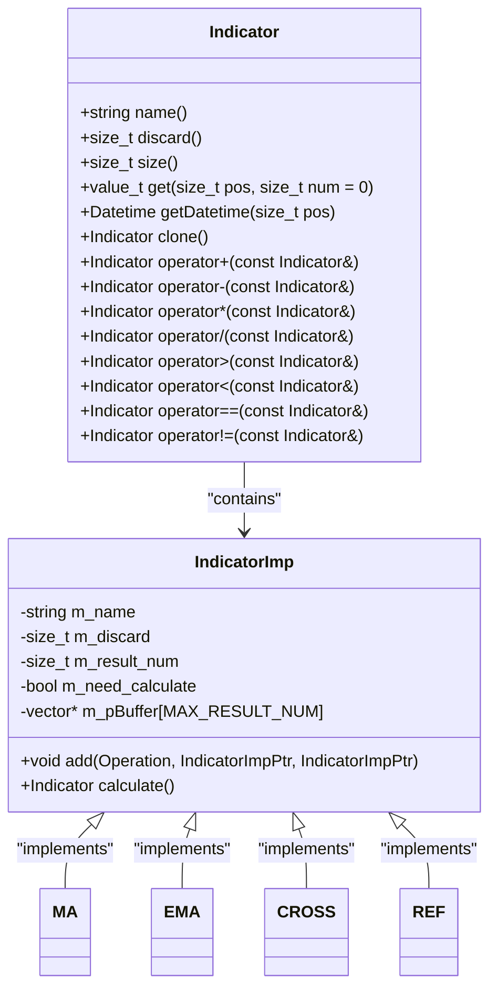
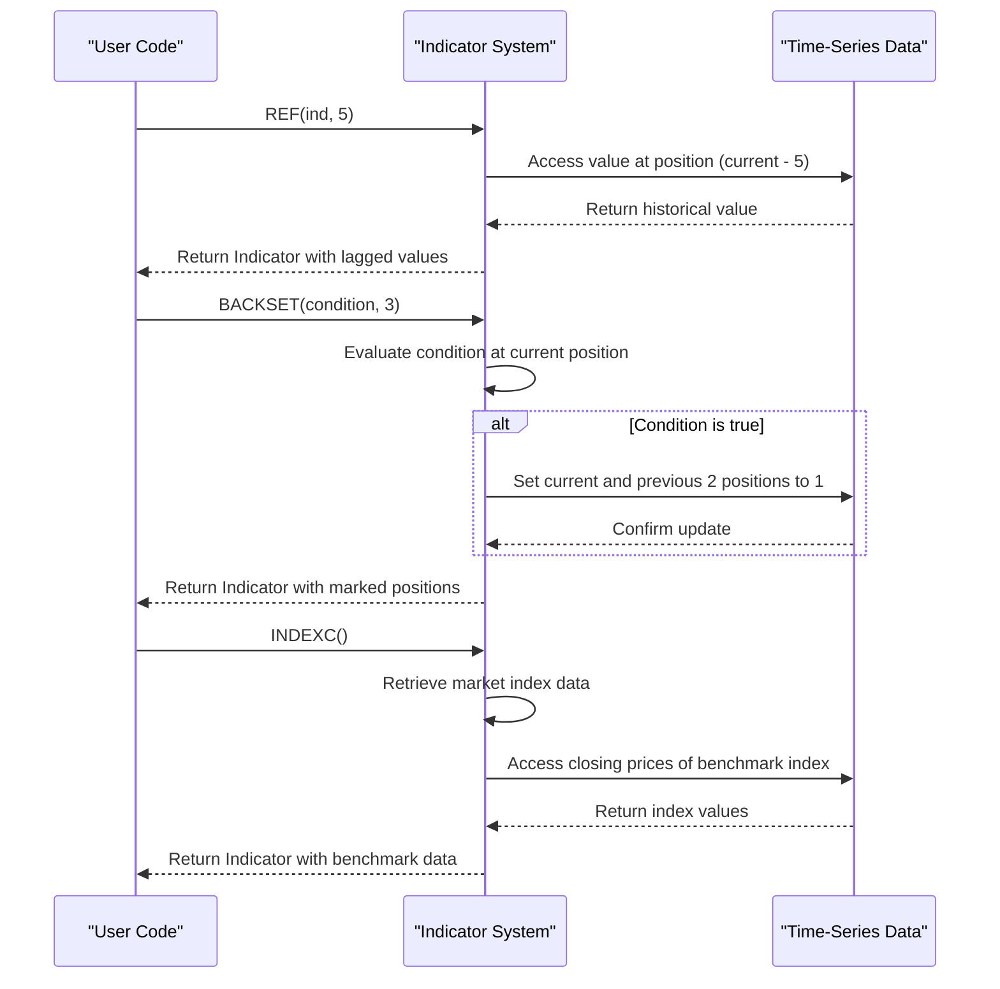
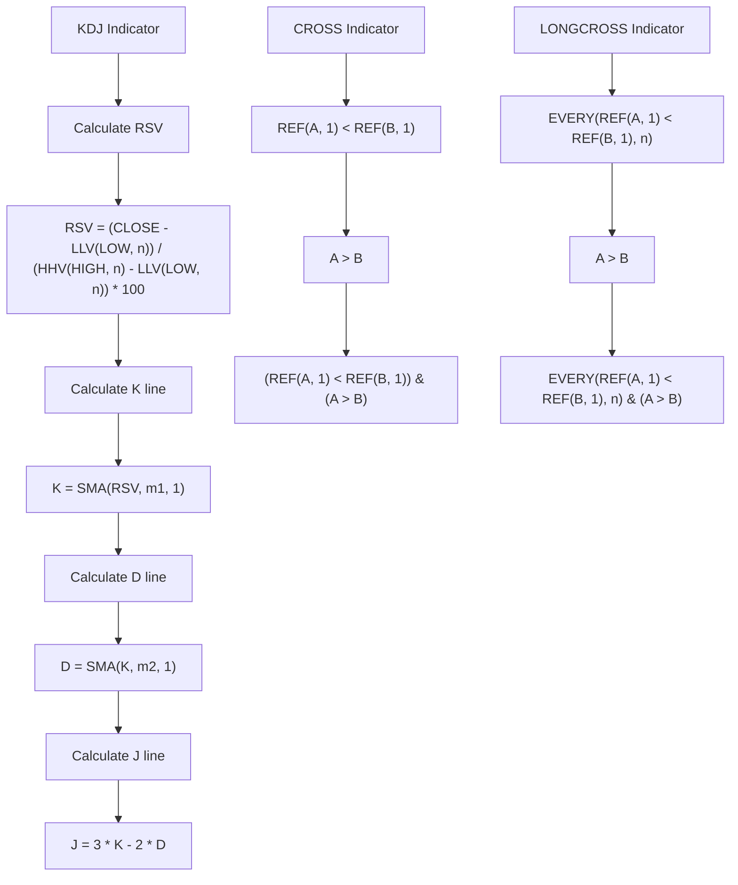
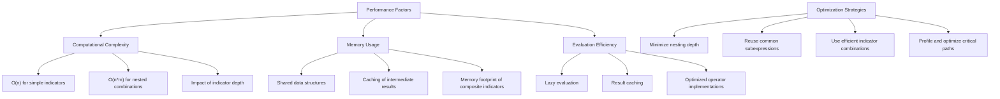

# Indicator Combination

<cite>
**Referenced Files in This Document**   
- [indicator.py](file://hikyuu/indicator/indicator.py)
- [pyind.py](file://hikyuu/indicator/pyind.py)
- [Indicator.h](file://hikyuu_cpp/hikyuu/indicator/Indicator.h)
- [Indicator.cpp](file://hikyuu_cpp/hikyuu/indicator/Indicator.cpp)
- [REF.h](file://hikyuu_cpp/hikyuu/indicator/crt/REF.h)
- [BACKSET.h](file://hikyuu_cpp/hikyuu/indicator/crt/BACKSET.h)
- [INDEX.h](file://hikyuu_cpp/hikyuu/indicator/crt/INDEX.h)
- [CROSS.h](file://hikyuu_cpp/hikyuu/indicator/crt/CROSS.h)
- [LONGCROSS.h](file://hikyuu_cpp/hikyuu/indicator/crt/LONGCROSS.h)
- [MA.h](file://hikyuu_cpp/hikyuu/indicator/crt/MA.h)
- [EMA.h](file://hikyuu_cpp/hikyuu/indicator/crt/EMA.h)
- [004-IndicatorOverview.ipynb](file://hikyuu/examples/notebook/004-IndicatorOverview.ipynb)
</cite>

## Table of Contents
1. [Introduction](#introduction)
2. [Domain Model of Indicator Expressions](#domain-model-of-indicator-expressions)
3. [Arithmetic and Logical Operations](#arithmetic-and-logical-operations)
4. [Temporal Reference Functions](#temporal-reference-functions)
5. [Composite Indicator Examples](#composite-indicator-examples)
6. [Performance Considerations](#performance-considerations)
7. [Common Issues and Solutions](#common-issues-and-solutions)
8. [Conclusion](#conclusion)

## Introduction
Indicator combination in Hikyuu enables the creation of sophisticated trading strategies by combining simple technical indicators through arithmetic operations, logical conditions, and temporal references. This document provides a comprehensive analysis of the indicator combination techniques available in the Hikyuu framework, detailing the implementation of composite indicators, their invocation relationships, and performance implications. The system supports complex trading signal generation through functions like REF, BACKSET, and INDEX for time-series manipulation, allowing users to create advanced trading strategies such as crossover signals and envelope bands.

**Section sources**
- [indicator.py](file://hikyuu/indicator/indicator.py#L1-L120)
- [pyind.py](file://hikyuu/indicator/pyind.py#L1-L47)

## Domain Model of Indicator Expressions

The domain model of indicator expressions in Hikyuu is built around the Indicator class, which serves as the fundamental building block for all technical analysis calculations. The Indicator class encapsulates time-series data and provides methods for arithmetic operations, logical comparisons, and temporal manipulations. Each indicator maintains metadata including its name, discard count (number of initial values to ignore), and result number (number of output series). The implementation follows an object-oriented design where complex indicators are constructed by combining simpler ones through operator overloading and specialized functions.

The core architecture is implemented in C++ with Python bindings, providing high-performance calculations while maintaining ease of use. The Indicator class supports various operations through overloaded operators, allowing intuitive expression of complex formulas. The system handles both scalar and vector operations, where scalar values are automatically broadcast to match the dimensionality of indicator series. This design enables the creation of composite indicators that can be evaluated efficiently across multiple time periods.

**Diagram sources**
- [Indicator.h](file://hikyuu_cpp/hikyuu/indicator/Indicator.h#L1-L488)
- [Indicator.cpp](file://hikyuu_cpp/hikyuu/indicator/Indicator.cpp#L1-L345)

**Section sources**
- [Indicator.h](file://hikyuu_cpp/hikyuu/indicator/Indicator.h#L1-L488)
- [Indicator.cpp](file://hikyuu_cpp/hikyuu/indicator/Indicator.cpp#L1-L345)

## Arithmetic and Logical Operations

Hikyuu supports a comprehensive set of arithmetic and logical operations for combining indicators. The framework implements operator overloading for basic arithmetic operations (addition, subtraction, multiplication, division, and modulo) as well as comparison operators (equality, inequality, greater than, less than, etc.). These operations are implemented at the C++ level for optimal performance, with each operation creating a new Indicator instance that represents the composite calculation.

The arithmetic operations follow standard mathematical precedence rules, with multiplication and division taking precedence over addition and subtraction. Parentheses can be used to explicitly control the order of evaluation. Logical operations are implemented using bitwise operators (& for AND, | for OR), which evaluate to 1 (true) or 0 (false) based on the conditions. The framework also provides specialized functions like IF for conditional expressions, allowing the selection of different values based on boolean conditions.

```mermaid
flowchart TD
A["Arithmetic Operations"] --> A1["Addition (+)"]
A --> A2["Subtraction (-)"]
A --> A3["Multiplication (*)"]
A --> A4["Division (/)"]
A --> A5["Modulo (%)"]
B["Logical Operations"] --> B1["Equality (==)"]
B --> B2["Inequality (!=)"]
B --> B3["Greater Than (>)"]
B --> B4["Less Than (<)"]
B --> B5["AND (&)"]
B --> B6["OR (|)"]
C["Special Functions"] --> C1["IF(condition, a, b)"]
C --> C2["WEAVE(ind1, ind2)"]
D["Evaluation Order"] --> D1["Parentheses"]
D --> D2["Multiplication/Division"]
D --> D3["Addition/Subtraction"]
D --> D4["Comparison"]
D --> D5["Logical AND/OR"]
```

**Diagram sources**
- [Indicator.h](file://hikyuu_cpp/hikyuu/indicator/Indicator.h#L379-L430)
- [Indicator.cpp](file://hikyuu_cpp/hikyuu/indicator/Indicator.cpp#L121-L314)

**Section sources**
- [Indicator.h](file://hikyuu_cpp/hikyuu/indicator/Indicator.h#L379-L430)
- [Indicator.cpp](file://hikyuu_cpp/hikyuu/indicator/Indicator.cpp#L121-L314)

## Temporal Reference Functions

Temporal reference functions in Hikyuu provide powerful capabilities for time-series manipulation, enabling the creation of lagged indicators and historical comparisons. The REF function implements forward referencing (right-shifting) by accessing values from previous periods, allowing comparisons between current and past values. The BACKSET function sets a specified number of previous periods to 1 when a condition is met, useful for marking entry points in trading strategies. The INDEX functions provide access to market benchmark data, enabling relative performance analysis.

These functions are essential for implementing classic technical analysis patterns that rely on historical comparisons. For example, the REF function can be used to compare current prices with prices from N periods ago, while BACKSET can mark the beginning of a trend by setting previous periods to 1. The INDEX functions allow comparison of individual securities against market indices, providing context for relative strength analysis. These temporal functions can be combined with arithmetic and logical operations to create sophisticated time-dependent trading rules.

**Diagram sources**
- [REF.h](file://hikyuu_cpp/hikyuu/indicator/crt/REF.h#L1-L49)
- [BACKSET.h](file://hikyuu_cpp/hikyuu/indicator/crt/BACKSET.h#L1-L45)
- [INDEX.h](file://hikyuu_cpp/hikyuu/indicator/crt/INDEX.h#L1-L60)

**Section sources**
- [REF.h](file://hikyuu_cpp/hikyuu/indicator/crt/REF.h#L1-L49)
- [BACKSET.h](file://hikyuu_cpp/hikyuu/indicator/crt/BACKSET.h#L1-L45)
- [INDEX.h](file://hikyuu_cpp/hikyuu/indicator/crt/INDEX.h#L1-L60)

## Composite Indicator Examples

Hikyuu provides numerous examples of composite indicators that demonstrate the framework's capabilities for creating complex trading signals. The KDJ indicator, implemented in pyind.py, combines multiple simple indicators through arithmetic operations to create a stochastic oscillator. It calculates the Relative Strength Index (RSI) by comparing the current closing price to the high-low range over a specified period, then applies moving averages to create the K, D, and J lines. This composite indicator identifies overbought and oversold conditions through the interaction of its component lines.

Another example is the CROSS indicator, which detects when one line crosses another by combining REF, comparison, and logical operations. The implementation checks if the first indicator was below the second in the previous period and above in the current period, returning 1 when this crossover condition is met. Similarly, the LONGCROSS indicator extends this concept by requiring the crossover to occur after a sustained period of one line being below the other, adding a duration requirement to the basic crossover pattern. These composite indicators demonstrate how simple building blocks can be combined to create sophisticated technical analysis tools.

**Diagram sources**
- [pyind.py](file://hikyuu/indicator/pyind.py#L30-L47)
- [CROSS.h](file://hikyuu_cpp/hikyuu/indicator/crt/CROSS.h#L1-L49)
- [LONGCROSS.h](file://hikyuu_cpp/hikyuu/indicator/crt/LONGCROSS.h#L1-L69)

**Section sources**
- [pyind.py](file://hikyuu/indicator/pyind.py#L30-L47)
- [CROSS.h](file://hikyuu_cpp/hikyuu/indicator/crt/CROSS.h#L1-L49)
- [LONGCROSS.h](file://hikyuu_cpp/hikyuu/indicator/crt/LONGCROSS.h#L1-L69)

## Performance Considerations

The performance of composite indicators in Hikyuu is influenced by several factors, including computational complexity, memory usage, and evaluation efficiency. The framework employs lazy evaluation and caching mechanisms to optimize performance, calculating indicator values only when needed and storing results to avoid redundant calculations. However, deeply nested expressions can still impact performance due to the overhead of function calls and memory allocation for intermediate results.

Computational complexity increases with the depth and breadth of indicator combinations, as each operation requires iterating through the time-series data. The system's efficiency is particularly important when backtesting strategies over long historical periods or when analyzing large portfolios. Memory usage is optimized through the use of shared data structures and efficient storage of time-series values, but complex combinations can still consume significant memory, especially when multiple intermediate indicators are retained.

**Diagram sources**
- [Indicator.h](file://hikyuu_cpp/hikyuu/indicator/Indicator.h#L1-L488)
- [Indicator.cpp](file://hikyuu_cpp/hikyuu/indicator/Indicator.cpp#L1-L345)

**Section sources**
- [Indicator.h](file://hikyuu_cpp/hikyuu/indicator/Indicator.h#L1-L488)
- [Indicator.cpp](file://hikyuu_cpp/hikyuu/indicator/Indicator.cpp#L1-L345)

## Common Issues and Solutions

Several common issues arise when working with composite indicators in Hikyuu, particularly related to indicator synchronization, NaN value handling, and expression optimization. Indicator synchronization across different time frames requires careful consideration of data alignment and temporal resolution. When combining indicators with different calculation periods, proper alignment of time-series data is essential to ensure accurate comparisons and calculations.

Handling NaN (Not a Number) values is critical in composite calculations, as operations involving NaN typically propagate the NaN result. The framework provides functions to detect and handle NaN values, but users must be aware of their impact on composite indicators. For optimization, deeply nested expressions should be simplified where possible, and common subexpressions should be factored out to improve both performance and readability. Additionally, users should validate that their composite indicators produce meaningful results across different market conditions and time periods.

**Section sources**
- [indicator.py](file://hikyuu/indicator/indicator.py#L1-L120)
- [Indicator.h](file://hikyuu_cpp/hikyuu/indicator/Indicator.h#L1-L488)

## Conclusion
Hikyuu's indicator combination framework provides a powerful and flexible system for creating sophisticated trading strategies through the composition of simple technical indicators. The architecture supports arithmetic operations, logical conditions, and temporal references, enabling the implementation of complex trading signals like crossovers and envelope bands. The system's design emphasizes both performance and usability, with efficient C++ implementations accessible through intuitive Python interfaces. By understanding the domain model, operator precedence, and performance characteristics, users can effectively leverage the framework to develop and test advanced trading strategies.