# Indicator System

<cite>
**Referenced Files in This Document**   
- [__init__.py](file://hikyuu/indicator/__init__.py)
- [indicator.py](file://hikyuu/indicator/indicator.py)
- [pyind.py](file://hikyuu/indicator/pyind.py)
- [Indicator.h](file://hikyuu_cpp/hikyuu/indicator/Indicator.h)
- [Indicator.cpp](file://hikyuu_cpp/hikyuu/indicator/Indicator.cpp)
- [build_in.h](file://hikyuu_cpp/hikyuu/indicator/build_in.h)
- [IndicatorImp.h](file://hikyuu_cpp/hikyuu/indicator/IndicatorImp.h)
- [IndParam.h](file://hikyuu_cpp/hikyuu/indicator/IndParam.h)
- [MA.h](file://hikyuu_cpp/hikyuu/indicator/crt/MA.h)
- [EMA.h](file://hikyuu_cpp/hikyuu/indicator/crt/EMA.h)
- [MACD.h](file://hikyuu_cpp/hikyuu/indicator/crt/MACD.h)
- [RSI.h](file://hikyuu_cpp/hikyuu/indicator/crt/RSI.h)
- [ta_crt.h](file://hikyuu_cpp/hikyuu/indicator_talib/ta_crt.h)
</cite>

## Table of Contents
1. [Introduction](#introduction)
2. [Core Architecture](#core-architecture)
3. [Built-in Indicator Library](#built-in-indicator-library)
4. [Native C++ and TA-Lib Integration](#native-c++-and-ta-lib-integration)
5. [Custom Indicator Development](#custom-indicator-development)
6. [Indicator Combination Techniques](#indicator-combination-techniques)
7. [KData Time Series Operations](#kdata-time-series-operations)
8. [Public Interfaces and Parameters](#public-interfaces-and-parameters)
9. [Practical Examples](#practical-examples)

## Introduction

The indicator system in Hikyuu serves as the foundation for quantitative trading strategies, providing a comprehensive framework for technical analysis. Technical indicators are mathematical calculations based on historical price, volume, or open interest data that help traders identify potential market trends, momentum, volatility, and trading signals. In algorithmic trading, these indicators form the basis for systematic decision-making, enabling automated entry and exit points based on predefined rules.

Hikyuu's indicator system is designed to be both powerful and flexible, offering an extensive library of built-in indicators while supporting custom indicator development. The system operates on KData time series, which represent historical market data for securities, and provides mechanisms for combining multiple indicators to create sophisticated trading strategies. The architecture supports both native C++ implementations for performance-critical operations and integration with the widely-used TA-Lib library, giving users access to industry-standard technical analysis functions.

This documentation will explore the indicator system in depth, covering both conceptual overviews for beginners and technical details for experienced developers. We'll examine how indicators are implemented, how they can be combined and customized, and how they integrate with the broader trading strategy framework in Hikyuu.

## Core Architecture

The indicator system in Hikyuu is built on a robust C++ foundation with Python bindings, designed for both performance and flexibility. At the core of the system is the `Indicator` class, which serves as the primary interface for all indicator operations. This class acts as a wrapper around the actual implementation provided by the `IndicatorImp` class, following a bridge pattern that separates the interface from the implementation.

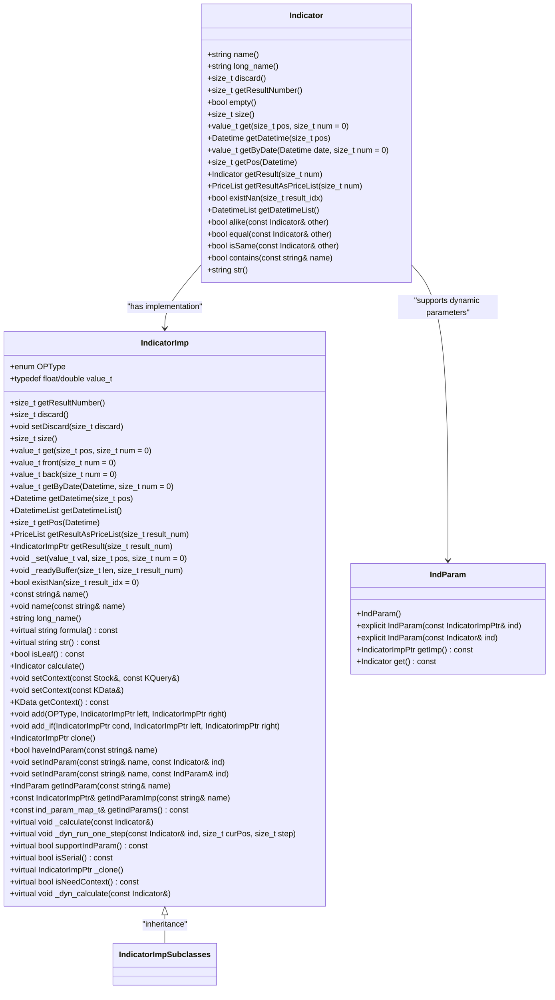

**Diagram sources**
- [Indicator.h](file://hikyuu_cpp/hikyuu/indicator/Indicator.h)
- [IndicatorImp.h](file://hikyuu_cpp/hikyuu/indicator/IndicatorImp.h)
- [IndParam.h](file://hikyuu_cpp/hikyuu/indicator/IndParam.h)

**Section sources**
- [Indicator.h](file://hikyuu_cpp/hikyuu/indicator/Indicator.h)
- [IndicatorImp.h](file://hikyuu_cpp/hikyuu/indicator/IndicatorImp.h)

The architecture follows a hierarchical structure where the `Indicator` class provides the public interface, while the `IndicatorImp` class handles the actual computation and state management. This separation allows for multiple implementations of the same interface, enabling features like dynamic indicator parameters and context management.

Key architectural components include:

- **Indicator**: The main interface class that users interact with, providing methods for accessing indicator values, metadata, and performing operations.
- **IndicatorImp**: The implementation base class that contains the actual calculation logic and data storage. New indicators are created by inheriting from this class.
- **IndParam**: A wrapper class that allows indicators to be used as parameters for other indicators, enabling dynamic and conditional calculations.
- **OPType**: An enumeration that defines the various operations that can be performed between indicators, including arithmetic operations, comparisons, and special operations like WEAVE and IF.

The system uses a tree-based computation model where complex indicators are built by combining simpler ones through operations. Each operation creates a new node in the computation tree, with the final result being calculated through a traversal of this tree. This approach enables efficient computation and optimization, as common subexpressions can be identified and reused.

## Built-in Indicator Library

Hikyuu provides an extensive library of built-in technical indicators, categorized into several major groups: moving averages, oscillators, volatility measures, and statistical functions. These indicators are implemented in C++ for optimal performance and are accessible through a consistent Python interface.

### Moving Averages

Moving averages are trend-following indicators that smooth price data to identify the direction of the trend. Hikyuu includes several types of moving averages:

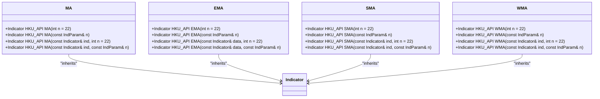

**Diagram sources**
- [MA.h](file://hikyuu_cpp/hikyuu/indicator/crt/MA.h)
- [EMA.h](file://hikyuu_cpp/hikyuu/indicator/crt/EMA.h)

**Section sources**
- [MA.h](file://hikyuu_cpp/hikyuu/indicator/crt/MA.h)
- [EMA.h](file://hikyuu_cpp/hikyuu/indicator/crt/EMA.h)

The Simple Moving Average (MA) calculates the arithmetic mean of prices over a specified period, while the Exponential Moving Average (EMA) gives more weight to recent prices, making it more responsive to new information. The Weighted Moving Average (WMA) assigns linearly decreasing weights to older prices.

### Oscillators

Oscillators are momentum indicators that fluctuate above and below a centerline or between set levels, helping to identify overbought and oversold conditions:

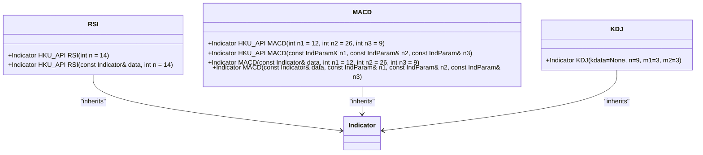

**Diagram sources**
- [RSI.h](file://hikyuu_cpp/hikyuu/indicator/crt/RSI.h)
- [MACD.h](file://hikyuu_cpp/hikyuu/indicator/crt/MACD.h)
- [pyind.py](file://hikyuu/indicator/pyind.py)

**Section sources**
- [RSI.h](file://hikyuu_cpp/hikyuu/indicator/crt/RSI.h)
- [MACD.h](file://hikyuu_cpp/hikyuu/indicator/crt/MACD.h)
- [pyind.py](file://hikyuu/indicator/pyind.py)

The Relative Strength Index (RSI) measures the speed and change of price movements, typically on a scale of 0 to 100, with values above 70 indicating overbought conditions and values below 30 indicating oversold conditions. The Moving Average Convergence Divergence (MACD) shows the relationship between two moving averages of prices, consisting of the MACD line (the difference between short-term and long-term EMAs), the signal line (an EMA of the MACD line), and the MACD histogram (the difference between the MACD line and signal line).

### Volatility Measures

Volatility indicators measure the rate of price movements, helping traders assess market risk and potential breakouts:

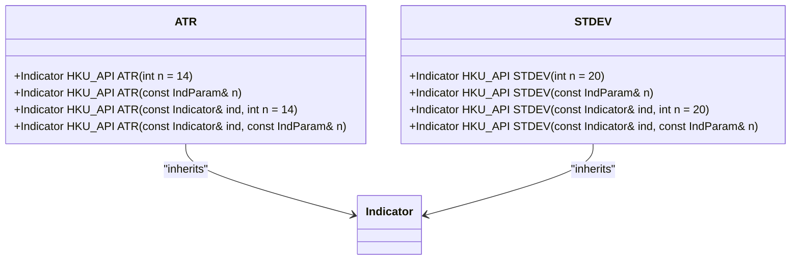

**Diagram sources**
- [ATR.h](file://hikyuu_cpp/hikyuu/indicator/crt/ATR.h)
- [STDEV.h](file://hikyuu_cpp/hikyuu/indicator/crt/STDEV.h)

**Section sources**
- [ATR.h](file://hikyuu_cpp/hikyuu/indicator/crt/ATR.h)
- [STDEV.h](file://hikyuu_cpp/hikyuu/indicator/crt/STDEV.h)

The Average True Range (ATR) measures market volatility by decomposing the entire range of an asset price for a given period, while the Standard Deviation (STDEV) measures how much prices deviate from their average value.

### Statistical Functions

The library also includes various statistical functions for data analysis and transformation:

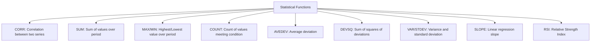

These functions enable sophisticated analysis of price and volume data, allowing traders to identify patterns and relationships that may not be apparent from raw price movements alone.

## Native C++ and TA-Lib Integration

Hikyuu's indicator system features a dual architecture that combines native C++ implementations with integration of the TA-Lib library, providing both performance optimization and access to industry-standard technical analysis functions.

### Native C++ Implementation Architecture

The native indicator implementation follows a modular design pattern where each indicator is implemented as a separate class inheriting from `IndicatorImp`. This design enables:

- **Performance optimization**: C++ implementation ensures minimal overhead for computationally intensive operations
- **Memory efficiency**: Direct memory management and optimized data structures
- **Extensibility**: Easy addition of new indicators through inheritance
- **Consistency**: Uniform interface across all indicators

The implementation uses a factory pattern for indicator creation, with each indicator function (e.g., `MA()`, `EMA()`, `RSI()`) returning a new `Indicator` instance. The actual computation is deferred until the indicator is applied to data, enabling efficient composition of complex indicator expressions.

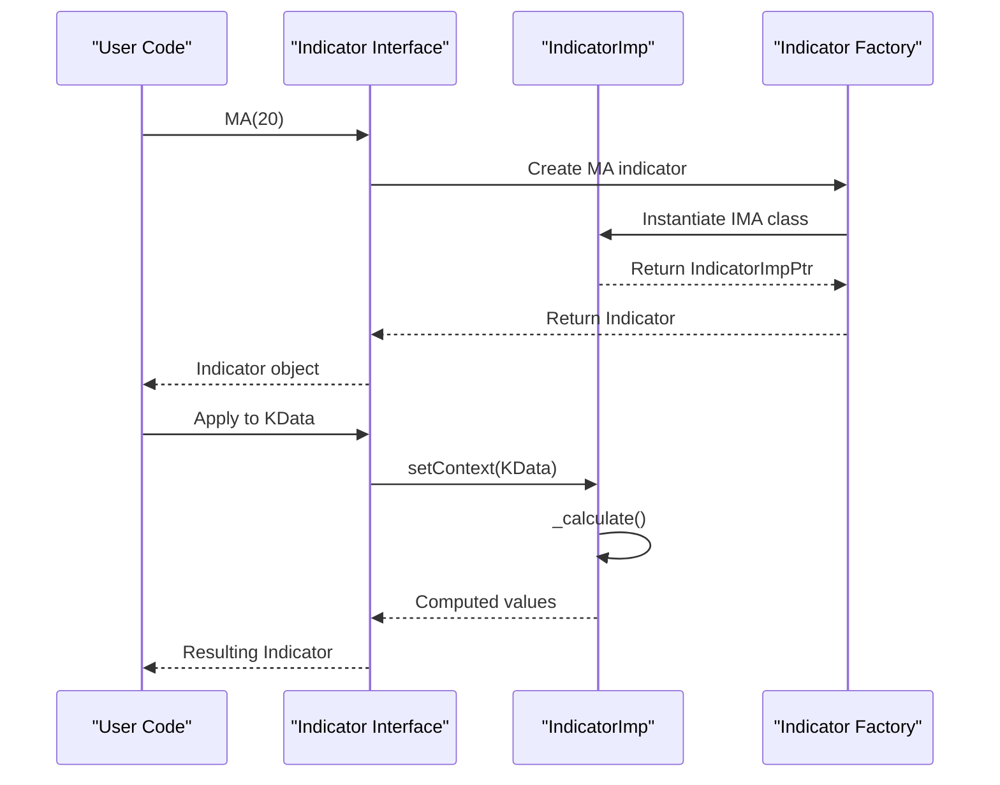

**Diagram sources**
- [Indicator.h](file://hikyuu_cpp/hikyuu/indicator/Indicator.h)
- [IndicatorImp.h](file://hikyuu_cpp/hikyuu/indicator/IndicatorImp.h)
- [MA.h](file://hikyuu_cpp/hikyuu/indicator/crt/MA.h)

**Section sources**
- [Indicator.h](file://hikyuu_cpp/hikyuu/indicator/Indicator.h)
- [IndicatorImp.h](file://hikyuu_cpp/hikyuu/indicator/IndicatorImp.h)

### TA-Lib Integration

For compatibility with existing trading systems and access to a wider range of technical indicators, Hikyuu integrates with TA-Lib through the `indicator_talib` module. This integration is implemented in the `ta_crt.h` header file, which provides a consistent interface to TA-Lib functions:

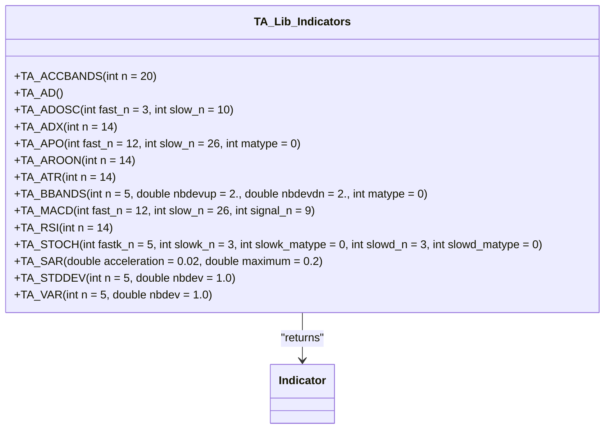

**Diagram sources**
- [ta_crt.h](file://hikyuu_cpp/hikyuu/indicator_talib/ta_crt.h)

**Section sources**
- [ta_crt.h](file://hikyuu_cpp/hikyuu/indicator_talib/ta_crt.h)

The integration uses a set of macros (`TA_IN1_OUT_CRT`, `TA_IN1_OUT_N_CRT`, etc.) to generate consistent wrapper functions for TA-Lib indicators, ensuring a uniform interface across both native and TA-Lib indicators. This approach allows users to seamlessly combine indicators from both sources in their trading strategies.

Key benefits of this dual architecture include:

- **Performance**: Native C++ indicators provide optimal performance for frequently used functions
- **Compatibility**: TA-Lib integration ensures compatibility with existing trading systems and strategies
- **Completeness**: Access to over 150 technical indicators from TA-Lib
- **Consistency**: Uniform interface regardless of implementation source
- **Flexibility**: Ability to choose the most appropriate implementation for specific use cases

The system automatically handles the compilation and linking of TA-Lib when enabled (controlled by the `HKU_ENABLE_TA_LIB` flag), making it easy to include or exclude based on project requirements.

## Custom Indicator Development

Hikyuu provides a comprehensive framework for creating custom indicators, allowing users to implement proprietary trading algorithms or specialized technical analysis functions. The framework supports both C++ and Python development, with Python being the preferred approach for rapid prototyping and algorithm development.

### Python Custom Indicators

The simplest way to create custom indicators is through Python, using the existing indicator functions as building blocks. The `pyind.py` file demonstrates this approach with the KDJ indicator implementation:

```python
def KDJ(kdata=None, n=9, m1=3, m2=3):
    """ Classic KDJ stochastic indicator
    
    :param KData kdata: Associated K-line data
    :param int n: 
    :param int m1: 
    :param int m2: 
    :return: k, d, j
    """
    rsv = (CLOSE() - LLV(LOW(), n)) / (HHV(HIGH(), n) - LLV(LOW(), n)) * 100
    k = SMA(rsv, m1, 1)
    d = SMA(k, m2, 1)
    j = 3 * k - 2 * d
    if kdata is not None:
        k.set_context(kdata)
        j.set_context(kdata)
        d.set_context(kdata)
    return k, d, j
```

This example shows how complex indicators can be constructed by combining simpler ones using arithmetic operations and built-in functions. The key components of Python custom indicator development include:

- **Indicator composition**: Using existing indicators as building blocks
- **Arithmetic operations**: +, -, *, /, % between indicators
- **Logical operations**: >, <, ==, !=, &, | for conditional logic
- **Context management**: Setting the KData context for proper date alignment
- **Parameterization**: Using function parameters to control indicator behavior

### C++ Custom Indicators

For performance-critical applications, indicators can be implemented directly in C++. This requires creating a new class that inherits from `IndicatorImp` and implementing the required virtual methods. The process involves:

1. Creating a new header file in the `hikyuu/indicator/crt/` directory
2. Defining the indicator function signatures
3. Implementing the indicator class in the `hikyuu/indicator/imp/` directory
4. Registering the indicator in the build system

The framework provides several macros and methods to simplify this process:

- `INDICATOR_IMP(classname)`: Base macro for indicator implementation
- `INDICATOR_IMP_SUPPORT_DYNAMIC_STEP(classname)`: For indicators that support dynamic step calculation

### Development Guidelines

When creating custom indicators, consider the following best practices:

1. **Follow naming conventions**: Use uppercase for indicator names (e.g., MA, EMA, RSI)
2. **Provide comprehensive documentation**: Include parameter descriptions and usage examples
3. **Handle edge cases**: Properly manage NaN values and insufficient data
4. **Optimize performance**: Minimize redundant calculations and memory allocations
5. **Ensure thread safety**: Indicators should be safe for concurrent execution
6. **Test thoroughly**: Include unit tests for various market conditions

The framework supports dynamic parameters through the `IndParam` class, allowing indicators to adapt their behavior based on market conditions or other indicators. This enables sophisticated adaptive strategies where indicator parameters are themselves the output of other calculations.

## Indicator Combination Techniques

Hikyuu provides powerful mechanisms for combining indicators to create sophisticated trading signals and complex analytical tools. These combination techniques enable the creation of multi-dimensional analysis systems that can capture various aspects of market behavior simultaneously.

### Arithmetic and Logical Operations

Indicators can be combined using standard arithmetic and logical operations, creating new indicators that represent mathematical relationships between existing ones:

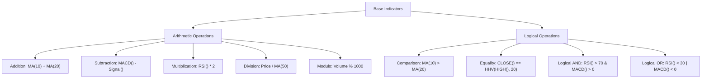

These operations follow standard mathematical precedence rules and are implemented through operator overloading in the `Indicator` class. The result of these operations is a new indicator that can be further combined or used directly in trading strategies.

### Conditional Indicators

The `IF` function provides conditional logic for indicator combinations, allowing different calculations based on specified conditions:

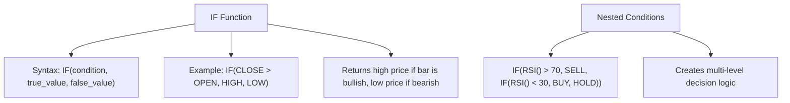

This enables the creation of adaptive indicators that change their behavior based on market conditions, forming the basis for rule-based trading systems.

### Indicator Weaving

The `WEAVE` function combines multiple indicators into a single indicator with multiple result sets:

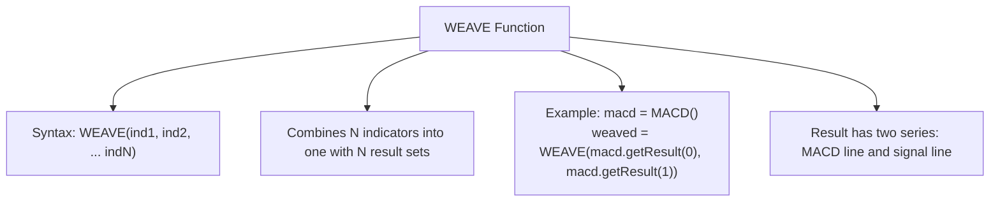

This is particularly useful for indicators that naturally produce multiple outputs (like MACD with its line, signal, and histogram) or when combining related indicators for comparative analysis.

### Advanced Combination Patterns

Several advanced patterns emerge from these basic combination techniques:

1. **Confluence Analysis**: Combining multiple indicators that measure different aspects of the market (trend, momentum, volatility) to identify high-probability trading opportunities.

2. **Filtering**: Using one indicator to filter signals from another, such as only taking RSI overbought signals when the price is above a long-term moving average.

3. **Normalization**: Combining indicators to create normalized values, such as expressing price relative to its moving average as a percentage.

4. **Composite Indicators**: Creating entirely new indicators by combining multiple components, like a custom momentum indicator that combines price rate of change, volume, and volatility.

These combination techniques form the foundation for developing sophisticated quantitative trading strategies, allowing traders to express complex market hypotheses in code.

## KData Time Series Operations

The indicator system in Hikyuu operates on KData time series, which represent historical market data for securities. Understanding how indicators interact with KData is crucial for effective technical analysis and strategy development.

### KData Structure

KData objects contain time-series data for a specific security and time frame, typically including:

- Open, High, Low, Close prices
- Volume and turnover
- Date/time information
- Additional financial metrics

Indicators are calculated on this data, producing new time series that represent various technical analysis measures.

### Context Management

Indicators maintain context information that links them to their source KData, ensuring proper date alignment and enabling operations across different time series:

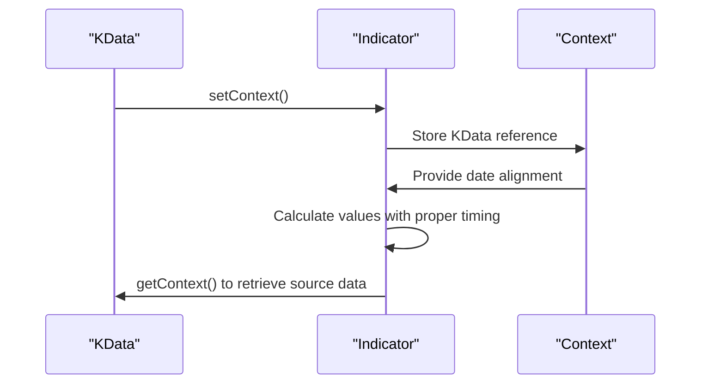

The context management system ensures that when indicators are combined or compared, their values are properly aligned by date, preventing errors from mismatched time series.

### Data Alignment and Synchronization

When combining indicators from different sources or with different calculation periods, the system automatically handles data alignment:

1. **Date alignment**: Values are matched by date/time
2. **Missing data handling**: NaN values are used where data is unavailable
3. **Discard period management**: Initial values that cannot be calculated due to insufficient history are properly handled

The `discard()` method returns the number of initial values that should be ignored due to insufficient data for calculation, which is particularly important for indicators with long lookback periods.

### Performance Considerations

The system is optimized for efficient operation on large time series:

- **Vectorized operations**: Calculations are performed on entire arrays rather than individual values
- **Memory efficiency**: Data is stored in contiguous arrays for cache-friendly access
- **Lazy evaluation**: Complex indicator expressions are only calculated when needed
- **Result caching**: Previously calculated values are cached to avoid redundant computation

These optimizations ensure that even complex indicator combinations can be calculated efficiently on large datasets, making the system suitable for both backtesting and real-time trading applications.

## Public Interfaces and Parameters

The indicator system provides a comprehensive set of public interfaces and parameters that enable flexible and powerful technical analysis. These interfaces are designed to be intuitive for beginners while offering advanced capabilities for experienced developers.

### Core Indicator Interface

The `Indicator` class provides the primary interface for all indicator operations:

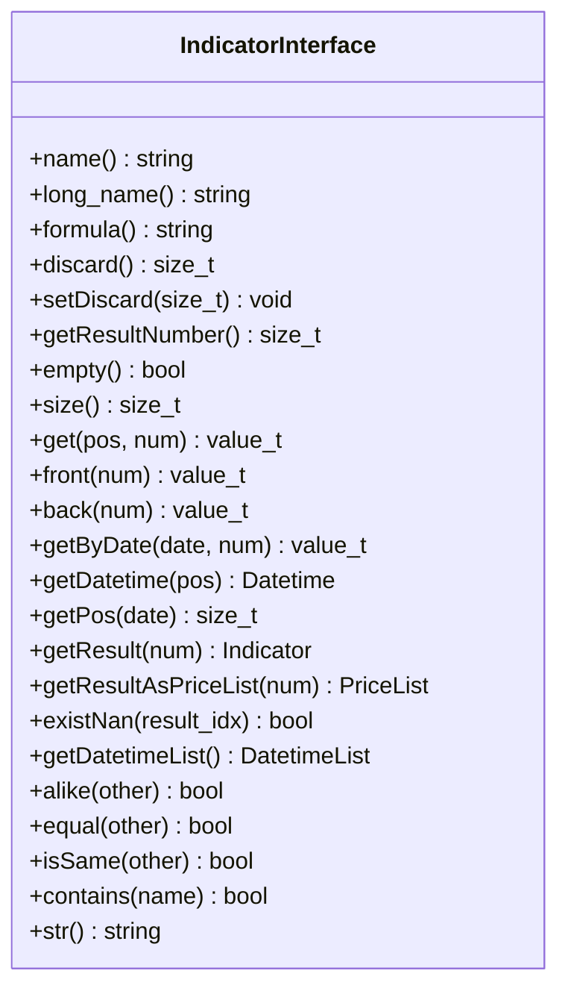

**Diagram sources**
- [Indicator.h](file://hikyuu_cpp/hikyuu/indicator/Indicator.h)

**Section sources**
- [Indicator.h](file://hikyuu_cpp/hikyuu/indicator/Indicator.h)

Key methods include:
- **Access methods**: `get()`, `front()`, `back()`, `getByDate()` for retrieving indicator values
- **Metadata methods**: `name()`, `long_name()`, `formula()` for identifying the indicator
- **Structural methods**: `getResultNumber()`, `getResult()` for handling multi-series indicators
- **Utility methods**: `discard()`, `size()`, `empty()` for managing the indicator state

### Parameter System

The system supports flexible parameterization through several mechanisms:

1. **Fixed parameters**: Numeric values passed directly to indicator functions
2. **Dynamic parameters**: Indicators used as parameters to other indicators via `IndParam`
3. **Context parameters**: Values derived from the KData context

The parameter system enables adaptive indicators where calculation parameters can change based on market conditions.

### Data Conversion Interfaces

For integration with data analysis tools, the system provides interfaces for converting indicator data to standard formats:

```python
# Convert to pandas DataFrame
df = indicator.to_df()

# Convert to numpy array  
arr = indicator.to_np()

# Convert from pandas DataFrame
indicator = df_to_ind(df, 'column_name', 'date_column')
```

These interfaces facilitate the use of Hikyuu indicators with popular data science libraries like pandas and numpy, enabling advanced analysis and visualization.

### Utility Functions

The system includes several utility functions for common operations:

- `concat_to_df()`: Combine multiple indicators into a single DataFrame
- `df_to_ind()`: Convert a pandas DataFrame column to an indicator
- Arithmetic and logical operators: For combining indicators

These interfaces and parameters provide a comprehensive toolkit for technical analysis, balancing ease of use with powerful functionality.

## Practical Examples

This section provides practical examples demonstrating how to use the indicator system in real-world scenarios, from basic calculations to complex strategy development.

### Basic Indicator Calculation

```python
# Calculate simple moving average
ma = MA(CLOSE(), 20)

# Calculate exponential moving average  
ema = EMA(CLOSE(), 12)

# Calculate RSI
rsi = RSI(CLOSE(), 14)

# Calculate MACD
macd = MACD(CLOSE(), 12, 26, 9)
```

### Indicator Combination

```python
# Create a trading signal using multiple indicators
bullish = (MA(CLOSE(), 10) > MA(CLOSE(), 50)) & (RSI(CLOSE(), 14) < 30)
bearish = (MA(CLOSE(), 10) < MA(CLOSE(), 50)) & (RSI(CLOSE(), 14) > 70)

# Use conditional logic
signal = IF(bullish, 1, IF(bearish, -1, 0))
```

### Custom Indicator Implementation

```python
def volatility_ratio(high, low, close, n=20):
    """Calculate volatility ratio indicator"""
    tr = MAX(high - low, ABS(high - close.shift(1)), ABS(low - close.shift(1)))
    atr = MA(tr, n)
    price_range = high - low
    return price_range / atr
```

### Data Analysis Integration

```python
# Combine indicators from multiple stocks
dates = sm.get_trading_calendar(query)
k_list = [stk.get_kdata(query) for stk in [sm['sz000001'], sm['sz000002']]]
ma_list = [MA(CLOSE(k)) for k in k_list]
combined_df = concat_to_df(dates, ma_list, head_stock_code=True)
```

These examples illustrate the practical application of the indicator system, showing how to perform common technical analysis tasks and build trading strategies.

**Section sources**
- [indicator.py](file://hikyuu/indicator/indicator.py)
- [pyind.py](file://hikyuu/indicator/pyind.py)
- [MA.h](file://hikyuu_cpp/hikyuu/indicator/crt/MA.h)
- [EMA.h](file://hikyuu_cpp/hikyuu/indicator/crt/EMA.h)
- [MACD.h](file://hikyuu_cpp/hikyuu/indicator/crt/MACD.h)
- [RSI.h](file://hikyuu_cpp/hikyuu/indicator/crt/RSI.h)