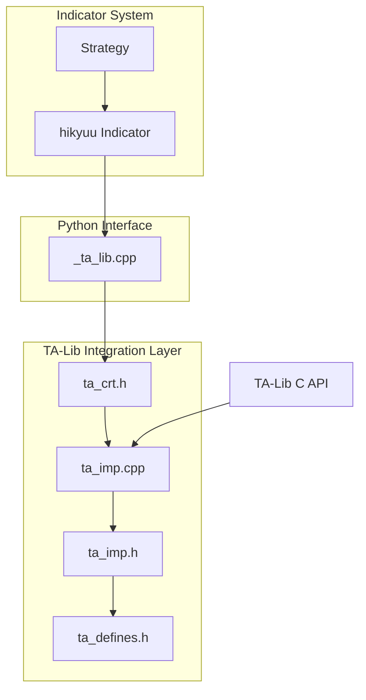
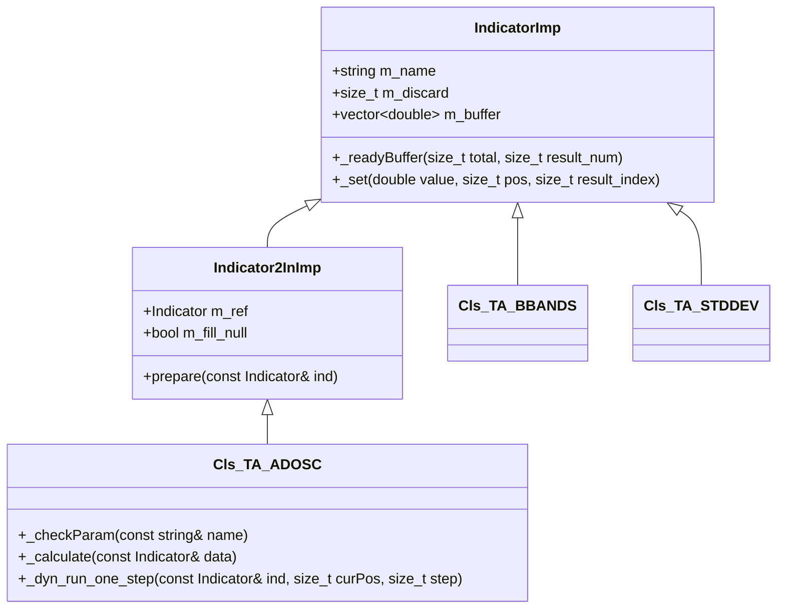

# TA-Lib Integration

<cite>
**Referenced Files in This Document**   
- [ta_crt.h](file://hikyuu_cpp/hikyuu/indicator_talib/ta_crt.h)
- [ta_imp.cpp](file://hikyuu_cpp/hikyuu/indicator_talib/imp/ta_imp.cpp)
- [ta_imp.h](file://hikyuu_cpp/hikyuu/indicator_talib/imp/ta_imp.h)
- [TaAdosc.cpp](file://hikyuu_cpp/hikyuu/indicator_talib/imp/TaAdosc.cpp)
- [TaBbands.cpp](file://hikyuu_cpp/hikyuu/indicator_talib/imp/TaBbands.cpp)
- [TaStddev.cpp](file://hikyuu_cpp/hikyuu/indicator_talib/imp/TaStddev.cpp)
- [ta_defines.h](file://hikyuu_cpp/hikyuu/indicator_talib/imp/ta_defines.h)
- [_ta_lib.cpp](file://hikyuu_pywrap/indicator/_ta_lib.cpp)
- [Turtle_SG.py](file://hikyuu/examples/Turtle_SG.py)
</cite>

## Table of Contents
1. [Introduction](#introduction)
2. [Architecture Overview](#architecture-overview)
3. [Core Components](#core-components)
4. [Domain Model and Parameter Mapping](#domain-model-and-parameter-mapping)
5. [Usage Examples](#usage-examples)
6. [Performance and Memory Management](#performance-and-memory-management)
7. [Common Issues and Solutions](#common-issues-and-solutions)
8. [Conclusion](#conclusion)

## Introduction
The TA-Lib integration in hikyuu provides access to over 150 technical indicators through a comprehensive wrapper system that bridges hikyuu's native data structures with the TA-Lib C API. This integration enables users to leverage the extensive collection of technical analysis functions from TA-Lib within the hikyuu quantitative trading framework. The wrapper system is designed to seamlessly integrate with hikyuu's indicator system, allowing for the creation of sophisticated trading strategies that combine both native hikyuu indicators and TA-Lib indicators. The implementation supports various indicator types including price-based indicators, momentum indicators, volatility indicators, and pattern recognition functions.

## Architecture Overview

**Diagram sources**
- [ta_crt.h](file://hikyuu_cpp/hikyuu/indicator_talib/ta_crt.h)
- [ta_imp.cpp](file://hikyuu_cpp/hikyuu/indicator_talib/imp/ta_imp.cpp)
- [ta_imp.h](file://hikyuu_cpp/hikyuu/indicator_talib/imp/ta_imp.h)
- [ta_defines.h](file://hikyuu_cpp/hikyuu/indicator_talib/imp/ta_defines.h)
- [_ta_lib.cpp](file://hikyuu_pywrap/indicator/_ta_lib.cpp)

## Core Components

The TA-Lib integration in hikyuu consists of several core components that work together to provide access to technical indicators. The implementation is centered around the `imp/ta_imp.cpp` module which serves as the bridge between hikyuu's native data structures and the TA-Lib C API. This module contains the implementation of various macro-based templates that generate the necessary code for each TA-Lib function. The `ta_crt.h` header file defines the interface for all TA-Lib indicators, providing function declarations and macro definitions that enable the creation of indicator functions with appropriate parameter handling. The `ta_defines.h` file contains the macro definitions that define the structure of indicator classes and their behavior.

The integration follows a pattern where each TA-Lib function is wrapped in a corresponding C++ class that inherits from hikyuu's `IndicatorImp` base class. These wrapper classes handle parameter validation, data conversion, and error handling when calling the underlying TA-Lib functions. The system supports different types of indicators based on their input requirements and output characteristics, with specific macro templates for indicators that take single inputs, multiple inputs, or KData objects as input.

**Section sources**
- [ta_crt.h](file://hikyuu_cpp/hikyuu/indicator_talib/ta_crt.h)
- [ta_imp.cpp](file://hikyuu_cpp/hikyuu/indicator_talib/imp/ta_imp.cpp)
- [ta_imp.h](file://hikyuu_cpp/hikyuu/indicator_talib/imp/ta_imp.h)
- [ta_defines.h](file://hikyuu_cpp/hikyuu/indicator_talib/imp/ta_defines.h)

## Domain Model and Parameter Mapping

The domain model for TA-Lib integration in hikyuu revolves around the mapping between hikyuu's indicator system and TA-Lib's function interface. The parameter mapping system ensures that parameters passed to TA-Lib functions are properly validated and converted to the expected format. Each indicator wrapper class implements parameter validation through the `_checkParam` method, which verifies that parameter values fall within acceptable ranges as defined by TA-Lib's requirements.

For indicators that require KData as input, such as ADOSC and AROON, the system extracts the necessary price and volume data from the KData object and converts it to the format expected by TA-Lib functions. The mapping includes handling for various data types including integers, doubles, and boolean flags. The system also manages the discard count, which represents the number of initial data points that cannot be calculated due to insufficient historical data, ensuring that the output aligns correctly with the input data series.

**Diagram sources**
- [ta_imp.h](file://hikyuu_cpp/hikyuu/indicator_talib/imp/ta_imp.h)
- [TaAdosc.cpp](file://hikyuu_cpp/hikyuu/indicator_talib/imp/TaAdosc.cpp)
- [TaBbands.cpp](file://hikyuu_cpp/hikyuu/indicator_talib/imp/TaBbands.cpp)
- [TaStddev.cpp](file://hikyuu_cpp/hikyuu/indicator_talib/imp/TaStddev.cpp)

## Usage Examples

The TA-Lib integration in hikyuu provides several examples of how to use technical indicators in trading strategies. For the ADOSC indicator, users can call the `TA_ADOSC` function with parameters for fast and slow moving average periods, which returns an indicator object that can be used in further calculations or strategy logic. The AROON indicator can be used by calling `TA_AROON` with a period parameter, producing two output series representing the Aroon up and Aroon down values. The HT_TRENDLINE indicator, which implements Hilbert Transform for trendline calculation, can be accessed by calling `TA_HT_TRENDLINE` with a price series as input.

These indicators can be combined with hikyuu's native indicator functions to create complex trading strategies. For example, a strategy might use the Bollinger Bands indicator (`TA_BBANDS`) to identify volatility levels and combine it with the RSI indicator (`TA_RSI`) to detect overbought or oversold conditions. The integration allows for seamless composition of indicators, where the output of one indicator can be used as input to another, enabling the creation of sophisticated technical analysis systems.

**Section sources**
- [ta_crt.h](file://hikyuu_cpp/hikyuu/indicator_talib/ta_crt.h)
- [Turtle_SG.py](file://hikyuu/examples/Turtle_SG.py)

## Performance and Memory Management

The TA-Lib integration in hikyuu is designed with performance and memory efficiency in mind. The wrapper system minimizes data copying by using direct pointers to data buffers when calling TA-Lib functions. The implementation uses smart pointers and efficient memory allocation strategies to manage temporary buffers required by TA-Lib functions. For indicators that support dynamic calculation, the system implements incremental computation to avoid recalculating the entire series when new data points are added.

Memory management considerations include proper handling of the indicator buffer lifecycle and efficient reuse of allocated memory. The system also addresses the relationship between TA-Lib indicators and hikyuu's native indicator system by ensuring consistent memory layout and data alignment. Performance differences between TA-Lib indicators and native hikyuu indicators are primarily related to function call overhead and data conversion, but these differences are generally negligible for most trading applications.

## Common Issues and Solutions

Common issues when using the TA-Lib integration in hikyuu include version compatibility between TA-Lib and hikyuu, handling of TA-Lib return codes, and thread-safety concerns in multi-threaded backtesting scenarios. Version compatibility can be addressed by ensuring that the TA-Lib version used to compile hikyuu matches the version expected by the wrapper system. The integration handles TA-Lib return codes by checking the return values of TA-Lib functions and converting them to appropriate error conditions within hikyuu.

For thread-safety concerns, the current implementation should be used with caution in multi-threaded environments, as TA-Lib itself may not be fully thread-safe. Solutions include using thread-local storage for TA-Lib contexts or synchronizing access to TA-Lib functions through mutexes. Input validation and error handling are implemented through the parameter checking system, which validates all input parameters before calling TA-Lib functions, preventing invalid inputs from causing runtime errors.

## Conclusion

The TA-Lib integration in hikyuu provides a robust and comprehensive system for accessing over 150 technical indicators through a well-designed wrapper that bridges hikyuu's native data structures with the TA-Lib C API. The architecture effectively handles parameter mapping, input validation, and error handling while maintaining performance and memory efficiency. The system enables the creation of sophisticated trading strategies by allowing seamless integration of TA-Lib indicators with hikyuu's native indicator system. With proper attention to version compatibility and thread-safety considerations, this integration provides a powerful tool for technical analysis and algorithmic trading development.