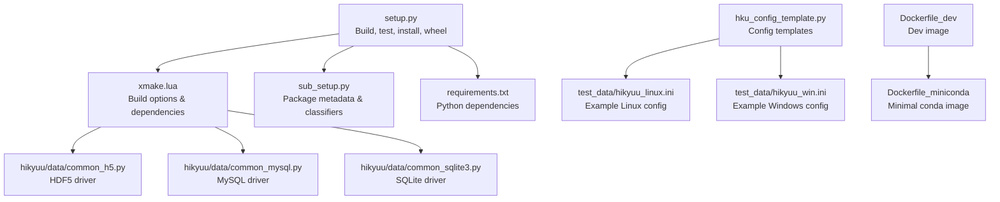
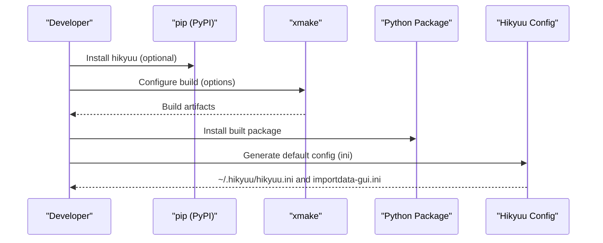
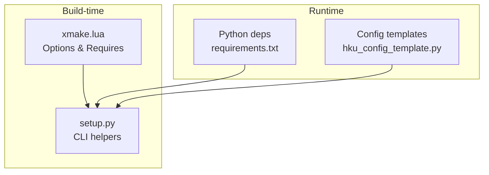

# Installation and Setup

<cite>
**Referenced Files in This Document**
- [setup.py](file://setup.py)
- [sub_setup.py](file://sub_setup.py)
- [requirements.txt](file://requirements.txt)
- [xmake.lua](file://xmake.lua)
- [hku_config_template.py](file://hikyuu/data/hku_config_template.py)
- [hikyuu_linux.ini](file://test_data/hikyuu_linux.ini)
- [hikyuu_win.ini](file://test_data/hikyuu_win.ini)
- [Dockerfile_dev](file://docker/Dockerfile_dev)
- [Dockerfile_miniconda](file://docker/Dockerfile_miniconda)
- [common_mysql.py](file://hikyuu/data/common_mysql.py)
- [common_sqlite3.py](file://hikyuu/data/common_sqlite3.py)
- [common_h5.py](file://hikyuu/data/common_h5.py)
- [readme.md](file://readme.md)
</cite>

## Table of Contents
1. [Introduction](#introduction)
2. [Project Structure](#project-structure)
3. [Core Components](#core-components)
4. [Architecture Overview](#architecture-overview)
5. [Detailed Component Analysis](#detailed-component-analysis)
6. [Dependency Analysis](#dependency-analysis)
7. [Performance Considerations](#performance-considerations)
8. [Troubleshooting Guide](#troubleshooting-guide)
9. [Conclusion](#conclusion)
10. [Appendices](#appendices)

## Introduction
This section explains how to install and configure the Hikyuu quant framework across multiple environments. It covers system requirements, installation methods (pip, building from source with xmake, and Docker), configuration of the Hikyuu configuration file, database connections, and data storage options. It also includes verification steps, environment setup for Linux and Windows, and troubleshooting common issues.

## Project Structure
Hikyuu’s installation and configuration touch several areas:
- Python packaging and CLI helpers for building, testing, and packaging wheels
- Build configuration via xmake with options for enabling/disabling engines (HDF5, MySQL, SQLite, TA-Lib)
- Configuration templates and example configuration files for different storage backends
- Dockerfiles for development and minimal conda-based environments
- Data layer utilities for MySQL, SQLite, and HDF5

**Diagram sources**
- [setup.py](file://setup.py#L1-L437)
- [xmake.lua](file://xmake.lua#L1-L247)
- [sub_setup.py](file://sub_setup.py#L1-L136)
- [requirements.txt](file://requirements.txt#L1-L22)
- [hku_config_template.py](file://hikyuu/data/hku_config_template.py#L1-L339)
- [hikyuu_linux.ini](file://test_data/hikyuu_linux.ini#L1-L56)
- [hikyuu_win.ini](file://test_data/hikyuu_win.ini#L1-L56)
- [Dockerfile_dev](file://docker/Dockerfile_dev#L1-L79)
- [Dockerfile_miniconda](file://docker/Dockerfile_miniconda#L1-L86)
- [common_h5.py](file://hikyuu/data/common_h5.py#L1-L200)
- [common_mysql.py](file://hikyuu/data/common_mysql.py#L1-L200)
- [common_sqlite3.py](file://hikyuu/data/common_sqlite3.py#L1-L142)

**Section sources**
- [setup.py](file://setup.py#L1-L437)
- [xmake.lua](file://xmake.lua#L1-L247)
- [sub_setup.py](file://sub_setup.py#L1-L136)
- [requirements.txt](file://requirements.txt#L1-L22)
- [hku_config_template.py](file://hikyuu/data/hku_config_template.py#L1-L339)
- [hikyuu_linux.ini](file://test_data/hikyuu_linux.ini#L1-L56)
- [hikyuu_win.ini](file://test_data/hikyuu_win.ini#L1-L56)
- [Dockerfile_dev](file://docker/Dockerfile_dev#L1-L79)
- [Dockerfile_miniconda](file://docker/Dockerfile_miniconda#L1-L86)
- [common_h5.py](file://hikyuu/data/common_h5.py#L1-L200)
- [common_mysql.py](file://hikyuu/data/common_mysql.py#L1-L200)
- [common_sqlite3.py](file://hikyuu/data/common_sqlite3.py#L1-L142)

## Core Components
- Python packaging and CLI:
  - setup.py orchestrates building, testing, clearing, installing, and packaging wheels via xmake, and exposes console scripts.
  - sub_setup.py defines package metadata, classifiers, and entry points.
- Build system:
  - xmake.lua defines C++17 requirement, build modes, and toggles for engines (HDF5, MySQL, SQLite, TDX, TA-Lib), logging, serialization, and HTTP client features.
- Configuration:
  - hku_config_template.py provides templates for HDF5, MySQL, ClickHouse, and import settings; it also generates default configuration files under the user’s home directory.
- Data drivers:
  - common_h5.py, common_mysql.py, common_sqlite3.py implement data layer logic for HDF5, MySQL, and SQLite respectively.
- Example configs:
  - test_data/hikyuu_linux.ini and test_data/hikyuu_win.ini show typical configuration layouts for Linux and Windows.

**Section sources**
- [setup.py](file://setup.py#L1-L437)
- [sub_setup.py](file://sub_setup.py#L1-L136)
- [xmake.lua](file://xmake.lua#L1-L247)
- [hku_config_template.py](file://hikyuu/data/hku_config_template.py#L1-L339)
- [hikyuu_linux.ini](file://test_data/hikyuu_linux.ini#L1-L56)
- [hikyuu_win.ini](file://test_data/hikyuu_win.ini#L1-L56)
- [common_h5.py](file://hikyuu/data/common_h5.py#L1-L200)
- [common_mysql.py](file://hikyuu/data/common_mysql.py#L1-L200)
- [common_sqlite3.py](file://hikyuu/data/common_sqlite3.py#L1-L142)

## Architecture Overview
The installation pipeline integrates Python packaging, xmake-based C++ builds, and runtime configuration.

**Diagram sources**
- [setup.py](file://setup.py#L1-L437)
- [xmake.lua](file://xmake.lua#L1-L247)
- [hku_config_template.py](file://hikyuu/data/hku_config_template.py#L1-L339)

## Detailed Component Analysis

### System Requirements
- Python version support:
  - The package declares support for Python 3.10–3.13 via classifiers.
- C++ compiler and toolchain:
  - C++17 standard is required.
  - xmake is required for building from source.
- Core dependencies (selected):
  - HDF5, MySQL (client), SQLite, Boost, FlatBuffers, nng, nlohmann_json, Eigen, xxhash, utf8proc, TA-Lib (optional), ClickHouse (optional), spdlog, fmt.
- Python runtime dependencies:
  - See requirements.txt for NumPy, pandas, matplotlib, SQLAlchemy, MySQL connector, HDF5, ClickHouse client, and others.

Practical verification:
- Confirm xmake presence and version before building.
- Verify Python version satisfies classifiers.

**Section sources**
- [sub_setup.py](file://sub_setup.py#L110-L123)
- [xmake.lua](file://xmake.lua#L1-L247)
- [requirements.txt](file://requirements.txt#L1-L22)
- [readme.md](file://readme.md#L89-L115)

### Installation Methods

#### Method 1: Install from PyPI (pip)
- Install the published package using pip.
- Post-install, Hikyuu will generate default configuration files under the user’s home directory.

Steps:
- Install the package via pip.
- Run the initialization routine to create default configuration files and directories.

Verification:
- Check that default configuration files are created under the user’s home directory.

**Section sources**
- [hku_config_template.py](file://hikyuu/data/hku_config_template.py#L303-L339)

#### Method 2: Build from source with xmake
- Prerequisites:
  - xmake installed and discoverable.
  - Python 3.10–3.13 installed.
  - System-level dependencies for HDF5, MySQL, SQLite, and compilers as required by your OS.
- Build commands:
  - Use the CLI helpers to build, test, clear, install, or package wheels.
  - Build options include mode selection (release/debug/coverage/asan/etc.), parallel jobs, low precision, and arrow compatibility toggle.

Key CLI commands (from setup.py):
- build: configure and compile core library.
- test: build and run unit tests.
- clear: remove build artifacts and cached metadata.
- install: compile and install into site-packages.
- wheel: build a wheel distribution.

Build options (from xmake.lua):
- Engines: enable/disable HDF5, MySQL, SQLite, TDX.
- TA-Lib: optional; when low precision is enabled, TA-Lib is automatically disabled.
- Logging and serialization: configurable.
- HTTP client: SSL and gzip support toggles.

Notes:
- On Windows shared builds, runtime must be MD.
- Hidden symbols are enabled for release on Windows to avoid linking failures.

**Section sources**
- [setup.py](file://setup.py#L108-L146)
- [setup.py](file://setup.py#L158-L231)
- [setup.py](file://setup.py#L233-L282)
- [setup.py](file://setup.py#L313-L407)
- [xmake.lua](file://xmake.lua#L1-L247)

#### Method 3: Use Docker containers
- Development image:
  - Provides a full build environment with xmake, compilers, and Miniconda preinstalled.
  - Installs Python dependencies from requirements.txt and sets environment variables for libraries.
- Minimal conda image:
  - Single-stage image with Miniconda and a preinstalled hikyuu package via pip.
  - Includes basic system libraries and environment setup.

Usage:
- Use the dev image to build and develop.
- Use the minimal image to run Hikyuu quickly with a prebuilt package.

**Section sources**
- [Dockerfile_dev](file://docker/Dockerfile_dev#L1-L79)
- [Dockerfile_miniconda](file://docker/Dockerfile_miniconda#L1-L86)

### Configuration Process
Hikyuu reads configuration from INI files located under the user’s home directory. The configuration file generator creates:
- ~/.hikyuu/hikyuu.ini (default template for HDF5)
- ~/.hikyuu/importdata-gui.ini (import settings)

Configuration categories:
- hikyuu: temporary directory, data directory, reload time, and quotation server.
- block: block information source (sqlite3, mysql, clickhouse, or qianlong).
- preload: cache sizes for different kdata frequencies.
- baseinfo: base stock information source (sqlite3, mysql, clickhouse).
- kdata: kdata storage backend (hdf5, mysql, clickhouse, tdx).

Templates and defaults:
- hku_config_template.py provides templates for HDF5, MySQL, and ClickHouse, and generates default files during initialization.
- Example configs in test_data demonstrate Linux and Windows paths and settings.

Runtime behavior:
- The data layer utilities connect to the configured backend and manage schema creation and upgrades.

**Section sources**
- [hku_config_template.py](file://hikyuu/data/hku_config_template.py#L1-L339)
- [hikyuu_linux.ini](file://test_data/hikyuu_linux.ini#L1-L56)
- [hikyuu_win.ini](file://test_data/hikyuu_win.ini#L1-L56)
- [common_mysql.py](file://hikyuu/data/common_mysql.py#L1-L200)
- [common_sqlite3.py](file://hikyuu/data/common_sqlite3.py#L1-L142)
- [common_h5.py](file://hikyuu/data/common_h5.py#L1-L200)

### Environment Setup by Operating System

#### Linux
- Install system dependencies for HDF5, MySQL, SQLite, and compilers.
- Install xmake and Python 3.10–3.13.
- Use the dev Docker image to simplify environment setup.
- Verify installation by checking generated configuration files and running basic imports.

#### Windows
- Install xmake and Python 3.10–3.13.
- Ensure MSVC toolchain and required libraries are available.
- Use the dev Docker image for a reproducible build environment.
- Verify installation similarly.

#### macOS
- Install xmake and Python 3.10–3.13.
- Use the dev Docker image if preferred.
- On macOS, static libraries are supported for hub usage; shared libraries have limitations.

**Section sources**
- [Dockerfile_dev](file://docker/Dockerfile_dev#L1-L79)
- [Dockerfile_miniconda](file://docker/Dockerfile_miniconda#L1-L86)
- [xmake.lua](file://xmake.lua#L197-L201)

### Verification
After installation:
- Confirm Python imports succeed.
- Verify that default configuration files exist under the user’s home directory.
- Test connectivity to the chosen data backend (HDF5, MySQL, or ClickHouse) using the data layer utilities.

**Section sources**
- [hku_config_template.py](file://hikyuu/data/hku_config_template.py#L303-L339)
- [common_mysql.py](file://hikyuu/data/common_mysql.py#L1-L200)
- [common_sqlite3.py](file://hikyuu/data/common_sqlite3.py#L1-L142)
- [common_h5.py](file://hikyuu/data/common_h5.py#L1-L200)

## Dependency Analysis
Hikyuu’s build-time and runtime dependencies are declared and managed as follows:

**Diagram sources**
- [xmake.lua](file://xmake.lua#L1-L247)
- [setup.py](file://setup.py#L1-L437)
- [requirements.txt](file://requirements.txt#L1-L22)
- [hku_config_template.py](file://hikyuu/data/hku_config_template.py#L1-L339)

**Section sources**
- [xmake.lua](file://xmake.lua#L1-L247)
- [setup.py](file://setup.py#L1-L437)
- [requirements.txt](file://requirements.txt#L1-L22)
- [hku_config_template.py](file://hikyuu/data/hku_config_template.py#L1-L339)

## Performance Considerations
- Engine selection:
  - HDF5 is the default and recommended for speed and compactness.
  - MySQL and ClickHouse offer scalable alternatives for larger datasets.
- Build mode:
  - Release mode enables hidden symbols on Windows to avoid linking failures.
- Serialization:
  - Serialization support is configurable; on Windows shared builds, runtime must be MD when serialization is enabled.
- Logging:
  - Log level and async logging can be tuned via build options.

**Section sources**
- [xmake.lua](file://xmake.lua#L197-L201)
- [xmake.lua](file://xmake.lua#L70-L115)
- [readme.md](file://readme.md#L52-L58)

## Troubleshooting Guide

Common issues and resolutions:
- Missing xmake:
  - Ensure xmake is installed and discoverable in PATH before invoking build commands.
- Python version mismatch:
  - Rebuild when switching Python versions; the build system clears previous artifacts accordingly.
- Missing system dependencies:
  - Install system-level libraries for HDF5, MySQL, SQLite, and compilers appropriate to your OS.
- Windows shared library serialization:
  - Use runtime MD when enabling serialization on Windows shared builds.
- TA-Lib conflicts:
  - Low precision mode disables TA-Lib; otherwise TA-Lib is optional and disabled by default.
- MySQL version compatibility:
  - The data layer adapts to newer MySQL versions; ensure the server and connector versions are compatible.
- HDF5 compression and tables:
  - The data layer uses compression and table formats; ensure the underlying HDF5 library is correctly linked.

**Section sources**
- [setup.py](file://setup.py#L108-L146)
- [setup.py](file://setup.py#L170-L218)
- [xmake.lua](file://xmake.lua#L41-L67)
- [xmake.lua](file://xmake.lua#L197-L201)
- [common_mysql.py](file://hikyuu/data/common_mysql.py#L1-L200)
- [common_h5.py](file://hikyuu/data/common_h5.py#L1-L200)

## Conclusion
Hikyuu supports flexible installation paths—pip, building from source with xmake, or using Docker. Configuration is centralized in INI files under the user’s home directory, with templates for HDF5, MySQL, and ClickHouse. Choose the installation method that best fits your environment, verify the installation, and configure the data backend according to your needs.

## Appendices

### Quick Reference: Build Options and Defaults
- Engines:
  - HDF5: enabled by default
  - MySQL: enabled by default
  - SQLite: enabled by default
  - TDX: enabled by default
  - TA-Lib: enabled by default (disabled when low precision is enabled)
- Logging:
  - Log level configurable via build options
  - Async logging optional
- Serialization:
  - Enabled by default; affects shared library runtime on Windows
- HTTP client:
  - SSL and gzip support optional

**Section sources**
- [xmake.lua](file://xmake.lua#L1-L247)