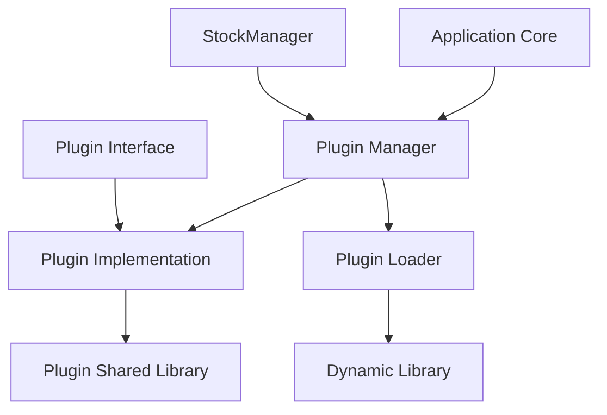
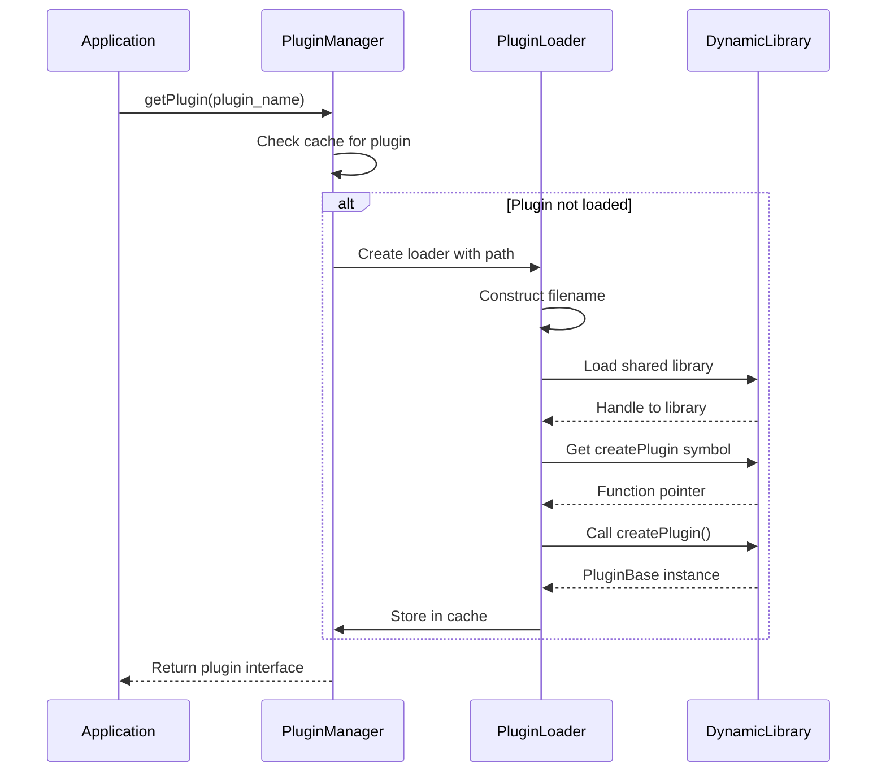
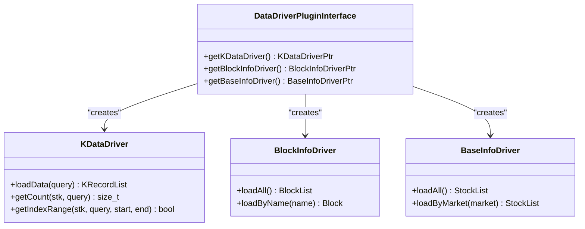
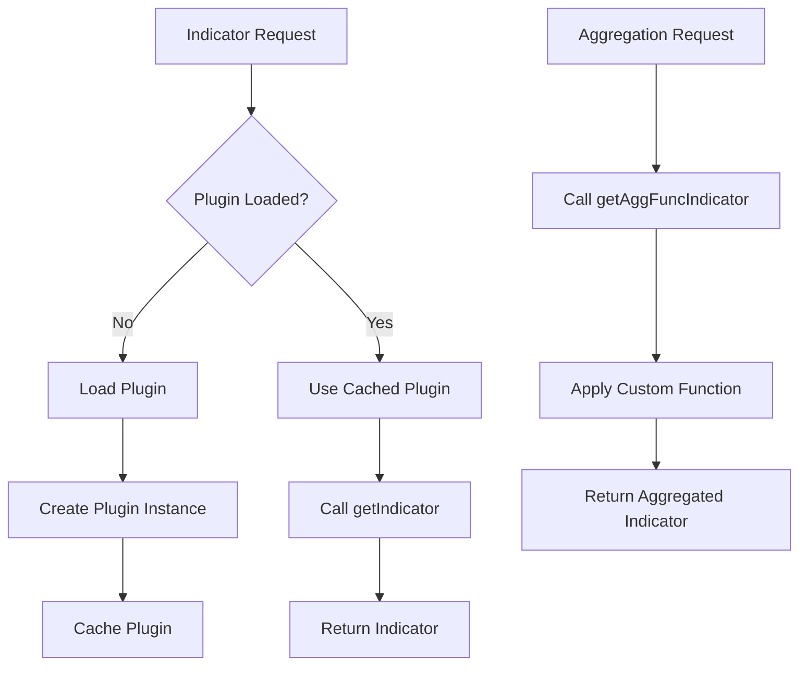
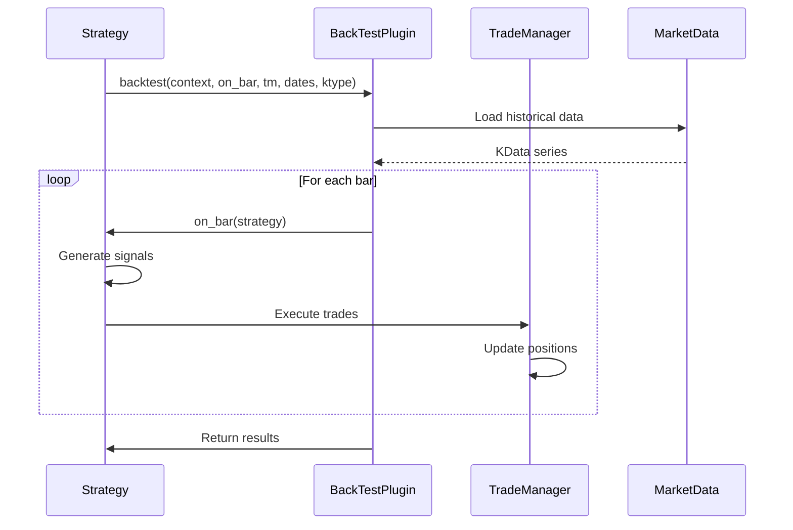
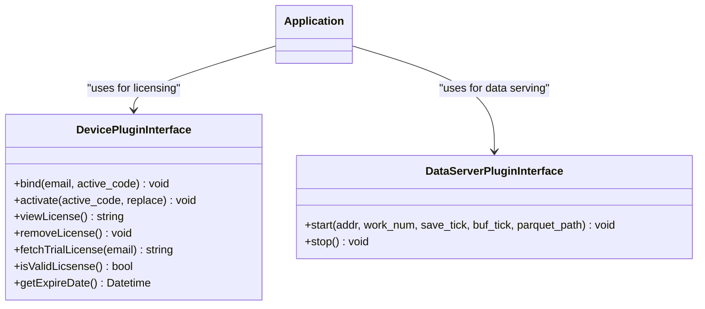
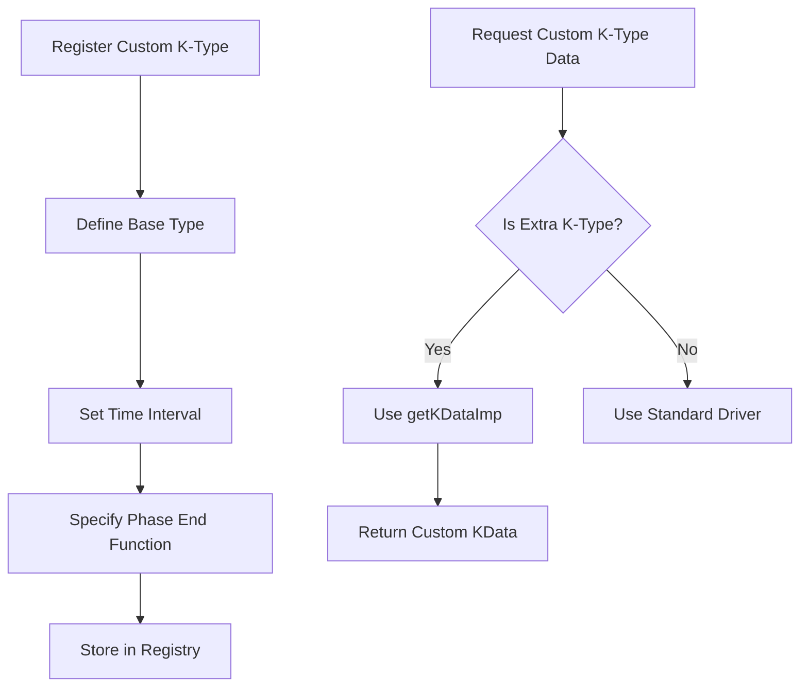

# Plugin System and Extensions

<cite>
**Referenced Files in This Document**   
- [PluginManager.h](file://hikyuu_cpp/hikyuu/utilities/plugin/PluginManager.h)
- [PluginLoader.h](file://hikyuu_cpp/hikyuu/utilities/plugin/PluginLoader.h)
- [PluginBase.h](file://hikyuu_cpp/hikyuu/utilities/plugin/PluginBase.h)
- [plugins.h](file://hikyuu_cpp/hikyuu/plugin/interface/plugins.h)
- [ExtendIndicatorsPluginInterface.h](file://hikyuu_cpp/hikyuu/plugin/interface/ExtendIndicatorsPluginInterface.h)
- [DataDriverPluginInterface.h](file://hikyuu_cpp/hikyuu/plugin/interface/DataDriverPluginInterface.h)
- [BackTestPluginInterface.h](file://hikyuu_cpp/hikyuu/plugin/interface/BackTestPluginInterface.h)
- [DevicePluginInterface.h](file://hikyuu_cpp/hikyuu/plugin/interface/DevicePluginInterface.h)
- [HkuExtraPluginInterface.h](file://hikyuu_cpp/hikyuu/plugin/interface/HkuExtraPluginInterface.h)
- [DataServerPluginInterface.h](file://hikyuu_cpp/hikyuu/plugin/interface/DataServerPluginInterface.h)
- [ImportKDataToHdf5PluginInterface.h](file://hikyuu_cpp/hikyuu/plugin/interface/ImportKDataToHdf5PluginInterface.h)
- [backtest.cpp](file://hikyuu_cpp/hikyuu/plugin/backtest.cpp)
- [extind.cpp](file://hikyuu_cpp/hikyuu/plugin/extind.cpp)
- [device.cpp](file://hikyuu_cpp/hikyuu/plugin/device.cpp)
- [dataserver.cpp](file://hikyuu_cpp/hikyuu/plugin/dataserver.cpp)
- [hkuextra.cpp](file://hikyuu_cpp/hikyuu/plugin/hkuextra.cpp)
- [KDataToHdf5Importer.cpp](file://hikyuu_cpp/hikyuu/plugin/KDataToHdf5Importer.cpp)
</cite>

## Table of Contents
1. [Introduction](#introduction)
2. [Plugin Architecture Overview](#plugin-architecture-overview)
3. [Core Plugin Interfaces](#core-plugin-interfaces)
4. [Plugin Loading Mechanism](#plugin-loading-mechanism)
5. [Data Driver Plugins](#data-driver-plugins)
6. [Indicator Extension Plugins](#indicator-extension-plugins)
7. [Trading and Backtest Plugins](#trading-and-backtest-plugins)
8. [Runtime Integration and Services](#runtime-integration-and-services)
9. [Custom K-Type Extensions](#custom-k-type-extensions)
10. [Plugin Development Best Practices](#plugin-development-best-practices)
11. [Conclusion](#conclusion)

## Introduction

The Hikyuu plugin system provides a flexible architecture that allows users to extend the framework's functionality without modifying the core codebase. This modular approach enables developers to add new features, integrate with external data sources, and customize trading strategies while maintaining the stability and integrity of the core system. The plugin architecture supports various extension types including data drivers, technical indicators, trading components, and runtime services. This document explains the design principles, implementation details, and development guidelines for creating custom plugins in the Hikyuu ecosystem.

## Plugin Architecture Overview

The Hikyuu plugin system follows a well-defined architecture that separates interface definitions from implementations, enabling dynamic loading and runtime integration of extension modules. The core components of the plugin architecture include:

**Diagram sources**
- [PluginManager.h](file://hikyuu_cpp/hikyuu/utilities/plugin/PluginManager.h)
- [PluginLoader.h](file://hikyuu_cpp/hikyuu/utilities/plugin/PluginLoader.h)
- [PluginBase.h](file://hikyuu_cpp/hikyuu/utilities/plugin/PluginBase.h)

The architecture is built around several key principles:
- **Interface Segregation**: Each plugin type has a dedicated interface class that defines its contract
- **Dynamic Loading**: Plugins are loaded at runtime from shared libraries using platform-specific mechanisms
- **Dependency Injection**: The core system obtains plugin instances through the PluginManager
- **Version Compatibility**: Plugin interfaces are designed to maintain backward compatibility

**Section sources**
- [PluginManager.h](file://hikyuu_cpp/hikyuu/utilities/plugin/PluginManager.h)
- [PluginBase.h](file://hikyuu_cpp/hikyuu/utilities/plugin/PluginBase.h)

## Core Plugin Interfaces

Hikyuu defines several plugin interfaces for different extension types, each serving a specific purpose in the trading system. These interfaces are located in the `hikyuu/plugin/interface/` directory and are included through the central `plugins.h` header file.

```mermaid
classDiagram
class PluginBase {
+info() string
}
class ExtendIndicatorsPluginInterface {
+getIndicator(name, params) Indicator
+getIndicator(name, ref_ind, params) Indicator
+getAggFuncIndicator(ref_ind, agg_func, params) Indicator
+getGroupFuncIndicator(ref_ind, group_func, params) Indicator
}
class DataDriverPluginInterface {
+getKDataDriver() KDataDriverPtr
+getBlockInfoDriver() BlockInfoDriverPtr
+getBaseInfoDriver() BaseInfoDriverPtr
}
class BackTestPluginInterface {
+backtest(context, on_bar, tm, start_date, end_date, ktype, ref_market, mode, support_short, slip) void
}
class DevicePluginInterface {
+bind(email, active_code) void
+activate(active_code, replace) void
+viewLicense() string
+removeLicense() void
+fetchTrialLicense(email) string
+isValidLicsense() bool
+getExpireDate() Datetime
}
class HkuExtraPluginInterface {
+registerKTypeExtra(ktype, basetype, minutes, getPhaseEnd) void
+releaseKExtra() void
+isExtraKType(ktype) bool
+getExtraKTypeList() vector~string~
+getKTypeExtraMinutes(ktype) int32_t
+getExtraKRecordList(stk, query) KRecordList
+getStockExtraCount(stk, ktype) size_t
+getStockExtraIndexRange(stk, query, out_start, out_end) bool
+getKDataImp(stk, query) KDataImpPtr
}
class DataServerPluginInterface {
+start(addr, work_num, save_tick, buf_tick, parquet_path) void
+stop() void
}
class ImportKDataToHdf5PluginInterface {
+setConfig(datapath, markets, ktypes) bool
+getLastDatetime(market, code, ktype) Datetime
+addKRecordList(market, code, krecords, ktype) void
+updateIndex(market, code, ktype) void
+remove(market, code, ktype, start) void
+addTimeLineList(market, code, timeline) void
+addTransList(market, code, translist) void
}
PluginBase <|-- ExtendIndicatorsPluginInterface
PluginBase <|-- DataDriverPluginInterface
PluginBase <|-- BackTestPluginInterface
PluginBase <|-- DevicePluginInterface
PluginBase <|-- HkuExtraPluginInterface
PluginBase <|-- DataServerPluginInterface
PluginBase <|-- ImportKDataToHdf5PluginInterface
```

**Diagram sources**
- [ExtendIndicatorsPluginInterface.h](file://hikyuu_cpp/hikyuu/plugin/interface/ExtendIndicatorsPluginInterface.h)
- [DataDriverPluginInterface.h](file://hikyuu_cpp/hikyuu/plugin/interface/DataDriverPluginInterface.h)
- [BackTestPluginInterface.h](file://hikyuu_cpp/hikyuu/plugin/interface/BackTestPluginInterface.h)
- [DevicePluginInterface.h](file://hikyuu_cpp/hikyuu/plugin/interface/DevicePluginInterface.h)
- [HkuExtraPluginInterface.h](file://hikyuu_cpp/hikyuu/plugin/interface/HkuExtraPluginInterface.h)
- [DataServerPluginInterface.h](file://hikyuu_cpp/hikyuu/plugin/interface/DataServerPluginInterface.h)
- [ImportKDataToHdf5PluginInterface.h](file://hikyuu_cpp/hikyuu/plugin/interface/ImportKDataToHdf5PluginInterface.h)

The base `PluginBase` class defines the fundamental contract for all plugins, requiring them to implement an `info()` method that returns plugin metadata in JSON format. This metadata includes the plugin name, version, description, and author information. Each specific plugin interface extends this base class to provide functionality relevant to its domain.

**Section sources**
- [PluginBase.h](file://hikyuu_cpp/hikyuu/utilities/plugin/PluginBase.h)
- [plugins.h](file://hikyuu_cpp/hikyuu/plugin/interface/plugins.h)

## Plugin Loading Mechanism

The plugin loading mechanism in Hikyuu is implemented through the `PluginManager` and `PluginLoader` classes, which handle the dynamic loading of shared libraries and instantiation of plugin objects. The system supports different file extensions based on the operating system: `.dll` for Windows, `.so` for Linux, and `.dylib` for macOS.

**Diagram sources**
- [PluginManager.h](file://hikyuu_cpp/hikyuu/utilities/plugin/PluginManager.h)
- [PluginLoader.h](file://hikyuu_cpp/hikyuu/utilities/plugin/PluginLoader.h)

The loading process follows these steps:
1. The application requests a plugin through the `PluginManager::getPlugin<T>()` template method
2. The manager checks if the plugin is already loaded in its internal cache
3. If not found, it creates a `PluginLoader` instance with the configured plugin path
4. The loader constructs the appropriate filename based on the operating system
5. It loads the shared library using platform-specific APIs (LoadLibrary on Windows, dlopen on Unix-like systems)
6. It retrieves the `createPlugin` symbol, which is the entry point for plugin instantiation
7. It calls `createPlugin()` to obtain a `PluginBase` instance
8. The instance is cast to the requested interface type and returned to the caller

The `HKU_PLUGIN_DEFINE` macro simplifies plugin implementation by automatically generating the required `createPlugin` export function. This ensures that all plugins follow a consistent instantiation pattern while hiding the platform-specific details of dynamic library exports.

**Section sources**
- [PluginManager.h](file://hikyuu_cpp/hikyuu/utilities/plugin/PluginManager.h)
- [PluginLoader.h](file://hikyuu_cpp/hikyuu/utilities/plugin/PluginLoader.h)

## Data Driver Plugins

Data driver plugins enable Hikyuu to connect with various data sources and storage systems. The `DataDriverPluginInterface` provides a unified way to access different types of market data through three main driver components: KDataDriver for price data, BlockInfoDriver for group information, and BaseInfoDriver for fundamental data.

**Diagram sources**
- [DataDriverPluginInterface.h](file://hikyuu_cpp/hikyuu/plugin/interface/DataDriverPluginInterface.h)

These plugins allow Hikyuu to support multiple data backends such as MySQL, SQLite, ClickHouse, and HDF5 without requiring changes to the core code. The plugin system abstracts the underlying storage details, providing a consistent interface for data access regardless of the source. This enables users to switch between different data storage solutions or add support for new ones by implementing the appropriate driver interfaces.

The data driver architecture follows the factory pattern, where the plugin returns configured driver instances that handle the actual data operations. This separation of concerns allows the core system to work with data in a uniform way while delegating storage-specific logic to the plugin implementation.

**Section sources**
- [DataDriverPluginInterface.h](file://hikyuu_cpp/hikyuu/plugin/interface/DataDriverPluginInterface.h)

## Indicator Extension Plugins

Indicator extension plugins provide a mechanism to add custom technical indicators and aggregation functions to the Hikyuu system. The `ExtendIndicatorsPluginInterface` serves as the foundation for extending the framework's analytical capabilities with user-defined calculations.

**Diagram sources**
- [ExtendIndicatorsPluginInterface.h](file://hikyuu_cpp/hikyuu/plugin/interface/ExtendIndicatorsPluginInterface.h)
- [extind.cpp](file://hikyuu_cpp/hikyuu/plugin/extind.cpp)

The interface supports two main types of indicator creation:
1. **Named indicators**: Created by name with optional parameters, allowing for configuration-driven indicator instantiation
2. **Functional indicators**: Created by applying aggregation or grouping functions to existing indicators

This design enables both simple configuration-based extensions and complex programmatic calculations. The plugin system supports various aggregation operations such as mean, sum, count, min, max, standard deviation, and quantile calculations across different time frames.

The `extind.cpp` implementation provides a set of convenience functions like `WITHKTYPE`, `RANK`, `AGG_MEAN`, and `GROUP_SUM` that wrap the plugin interface, making it easier for users to access extended functionality without directly interacting with the plugin system.

**Section sources**
- [ExtendIndicatorsPluginInterface.h](file://hikyuu_cpp/hikyuu/plugin/interface/ExtendIndicatorsPluginInterface.h)
- [extind.cpp](file://hikyuu_cpp/hikyuu/plugin/extind.cpp)

## Trading and Backtest Plugins

Trading and backtest plugins extend Hikyuu's capabilities in executing trading strategies and analyzing their performance. The `BackTestPluginInterface` provides a standardized way to implement different backtesting methodologies, while other plugins support real-time trading and portfolio management.

**Diagram sources**
- [BackTestPluginInterface.h](file://hikyuu_cpp/hikyuu/plugin/interface/BackTestPluginInterface.h)
- [backtest.cpp](file://hikyuu_cpp/hikyuu/plugin/backtest.cpp)

The backtesting plugin interface allows for different backtesting approaches, such as event-driven, vectorized, or machine learning-based simulations. This flexibility enables users to implement sophisticated testing methodologies that account for various market conditions, slippage models, and risk management rules.

The `backtest.cpp` file provides the public API functions that applications use to initiate backtesting. These functions serve as a bridge between the core system and the plugin implementation, handling error checking and parameter validation before delegating to the actual plugin.

Additionally, the `TMReportPluginInterface` (not shown in detail) supports the generation of trading performance reports, allowing for customizable analysis and visualization of trading results.

**Section sources**
- [BackTestPluginInterface.h](file://hikyuu_cpp/hikyuu/plugin/interface/BackTestPluginInterface.h)
- [backtest.cpp](file://hikyuu_cpp/hikyuu/plugin/backtest.cpp)

## Runtime Integration and Services

Runtime integration plugins enhance Hikyuu's capabilities during execution by providing additional services and connectivity options. These plugins operate at the system level, enabling features like license management, data serving, and real-time market connectivity.

**Diagram sources**
- [DevicePluginInterface.h](file://hikyuu_cpp/hikyuu/plugin/interface/DevicePluginInterface.h)
- [DataServerPluginInterface.h](file://hikyuu_cpp/hikyuu/plugin/interface/DataServerPluginInterface.h)
- [device.cpp](file://hikyuu_cpp/hikyuu/plugin/device.cpp)
- [dataserver.cpp](file://hikyuu_cpp/hikyuu/plugin/dataserver.cpp)

The `DevicePluginInterface` handles license management and activation, providing methods for binding to user accounts, activating licenses, and checking validity. This plugin enables commercial distribution of Hikyuu extensions while maintaining a clear separation between the open-source core and proprietary components.

The `DataServerPluginInterface` supports real-time data serving capabilities, allowing Hikyuu to act as a market data server for other applications. The implementation in `dataserver.cpp` provides functions to start and stop the server, as well as to retrieve data from remote buffer servers.

These runtime services demonstrate how plugins can extend Hikyuu beyond its primary function as a trading framework, transforming it into a comprehensive financial analysis platform with network connectivity and user management features.

**Section sources**
- [DevicePluginInterface.h](file://hikyuu_cpp/hikyuu/plugin/interface/DevicePluginInterface.h)
- [DataServerPluginInterface.h](file://hikyuu_cpp/hikyuu/plugin/interface/DataServerPluginInterface.h)
- [device.cpp](file://hikyuu_cpp/hikyuu/plugin/device.cpp)
- [dataserver.cpp](file://hikyuu_cpp/hikyuu/plugin/dataserver.cpp)

## Custom K-Type Extensions

Custom K-type extensions allow users to define new time frames and data aggregations beyond the standard options provided by Hikyuu. The `HkuExtraPluginInterface` enables the registration of custom K-types with specific characteristics and data retrieval methods.

**Diagram sources**
- [HkuExtraPluginInterface.h](file://hikyuu_cpp/hikyuu/plugin/interface/HkuExtraPluginInterface.h)
- [hkuextra.cpp](file://hikyuu_cpp/hikyuu/plugin/hkuextra.cpp)

The interface provides several key capabilities:
- **Registration**: The `registerKTypeExtra` method allows defining new K-types based on existing ones with custom time intervals
- **Validation**: The `isExtraKType` method checks if a given K-type is a custom extension
- **Metadata**: Methods like `getKTypeExtraMinutes` and `getExtraKTypeList` provide information about registered custom types
- **Data Retrieval**: The `getKDataImp` method returns a custom implementation for handling data requests for the extended K-type

This system enables sophisticated time frame manipulations, such as creating K-lines based on volume thresholds, tick counts, or custom business logic. The ability to define phase end functions allows for specialized time aggregations that align with specific market sessions or trading strategies.

The implementation in `hkuextra.cpp` provides a comprehensive API for interacting with these custom K-types, including functions to release registered types and query their properties.

**Section sources**
- [HkuExtraPluginInterface.h](file://hikyuu_cpp/hikyuu/plugin/interface/HkuExtraPluginInterface.h)
- [hkuextra.cpp](file://hikyuu_cpp/hikyuu/plugin/hkuextra.cpp)

## Plugin Development Best Practices

Developing effective plugins for Hikyuu requires adherence to several best practices that ensure compatibility, performance, and maintainability. These guidelines apply to both C++ plugin implementations and any language bindings.

### Version Compatibility
Maintain backward compatibility by following semantic versioning principles and avoiding breaking changes to plugin interfaces. When modifications are necessary, consider adding new methods rather than changing existing ones.

### Error Handling
Implement robust error handling that provides meaningful diagnostic information without crashing the host application. Use the logging system provided by Hikyuu to report issues and status information.

### Performance Considerations
Optimize plugin code for performance, especially for operations that are called frequently such as indicator calculations or data retrieval. Consider using parallel processing where appropriate, but ensure thread safety when accessing shared resources.

### Resource Management
Properly manage system resources such as memory, file handles, and network connections. Implement cleanup routines in destructors or dedicated methods to prevent resource leaks.

### Testing
Thoroughly test plugins in isolation and within the complete Hikyuu environment. Verify that they work correctly with different data sets and under various operating conditions.

### Documentation
Provide comprehensive documentation for plugin functionality, configuration options, and usage examples. Include metadata in the `info()` method that accurately describes the plugin's capabilities and requirements.

The `KDataToHdf5Importer.cpp` file demonstrates several of these best practices, particularly in its handling of optional plugin availability and graceful degradation when the plugin is not found.

**Section sources**
- [KDataToHdf5Importer.cpp](file://hikyuu_cpp/hikyuu/plugin/KDataToHdf5Importer.cpp)

## Conclusion

The Hikyuu plugin system provides a powerful and flexible architecture for extending the framework's capabilities without modifying the core codebase. By leveraging well-defined interfaces and a robust loading mechanism, the system enables users to customize and enhance Hikyuu for their specific trading and analysis needs. The plugin architecture supports various extension types including data drivers, technical indicators, trading components, and runtime services, making it possible to adapt the framework to diverse market data sources, analytical methods, and trading strategies. Developers can create custom plugins following the provided patterns and best practices, ensuring compatibility, performance, and maintainability. This extensibility is a key factor in Hikyuu's adaptability and longevity as a comprehensive quantitative trading framework.