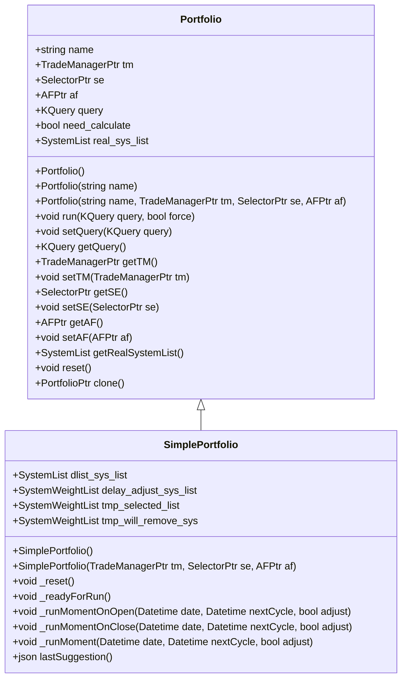
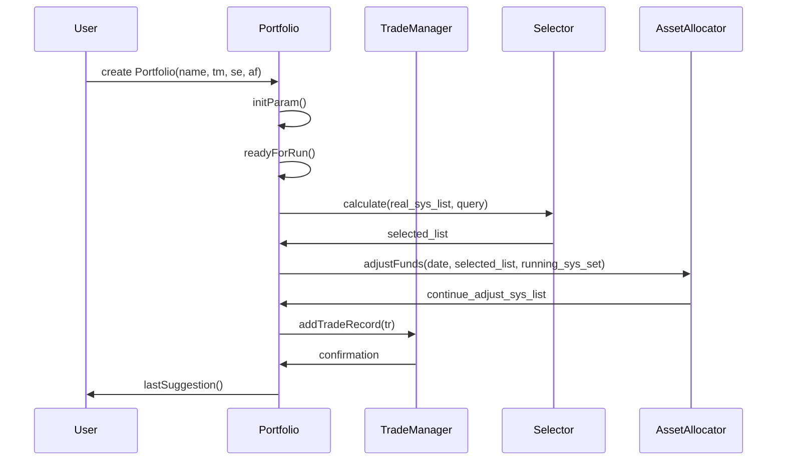

# Portfolio Management

<cite>
**Referenced Files in This Document**   
- [Portfolio.h](file://hikyuu_cpp/hikyuu/trade_sys/portfolio/Portfolio.h)
- [Portfolio.cpp](file://hikyuu_cpp/hikyuu/trade_sys/portfolio/Portfolio.cpp)
- [SimplePortfolio.h](file://hikyuu_cpp/hikyuu/trade_sys/portfolio/imp/SimplePortfolio.h)
- [SimplePortfolio.cpp](file://hikyuu_cpp/hikyuu/trade_sys/portfolio/imp/SimplePortfolio.cpp)
- [PF_Simple.h](file://hikyuu_cpp/hikyuu/trade_sys/portfolio/crt/PF_Simple.h)
- [010-Portfolio.ipynb](file://hikyuu/examples/notebook/010-Portfolio.ipynb)
</cite>

## Table of Contents
1. [Introduction](#introduction)
2. [Portfolio Construction](#portfolio-construction)
3. [Risk Management](#risk-management)
4. [Multi-System Strategies](#multi-system-strategies)
5. [Performance Attribution](#performance-attribution)
6. [Public Interfaces](#public-interfaces)
7. [Conclusion](#conclusion)

## Introduction
Portfolio management in Hikyuu enables the coordinated management of multiple trading systems or assets as a unified portfolio. This approach allows investors to diversify their investments, manage risk at the portfolio level, and optimize returns through strategic allocation of capital across different assets or trading strategies. The framework provides comprehensive tools for constructing portfolios, managing risk, implementing multi-system strategies, analyzing performance attribution, and accessing public interfaces for portfolio operations.

**Section sources**
- [010-Portfolio.ipynb](file://hikyuu/examples/notebook/010-Portfolio.ipynb)

## Portfolio Construction
Hikyuu supports various portfolio construction capabilities, including different allocation strategies such as equal weighting and multi-factor models. The `PF_Simple` function creates a portfolio with specified parameters including the trade manager, selector, asset allocation algorithm, adjustment cycle, adjustment mode, and whether to delay to the next trading day. The portfolio can be configured to follow different adjustment modes like "query", "day", "week", "month", "quarter", or "year", each with specific cycle constraints.

**Diagram sources**
- [Portfolio.h](file://hikyuu_cpp/hikyuu/trade_sys/portfolio/Portfolio.h)
- [SimplePortfolio.h](file://hikyuu_cpp/hikyuu/trade_sys/portfolio/imp/SimplePortfolio.h)

**Section sources**
- [Portfolio.h](file://hikyuu_cpp/hikyuu/trade_sys/portfolio/Portfolio.h)
- [Portfolio.cpp](file://hikyuu_cpp/hikyuu/trade_sys/portfolio/Portfolio.cpp)
- [SimplePortfolio.h](file://hikyuu_cpp/hikyuu/trade_sys/portfolio/imp/SimplePortfolio.h)
- [SimplePortfolio.cpp](file://hikyuu_cpp/hikyuu/trade_sys/portfolio/imp/SimplePortfolio.cpp)
- [PF_Simple.h](file://hikyuu_cpp/hikyuu/trade_sys/portfolio/crt/PF_Simple.h)

## Risk Management
Risk management techniques at the portfolio level include position correlation analysis and overall exposure control. The framework ensures that the portfolio's risk is managed by checking parameters such as the adjustment mode and cycle, ensuring they fall within valid ranges. For example, when the adjustment mode is "week", the cycle must be between 1 and 5; for "month", it must be between 1 and 31; for "quarter", between 1 and 92; and for "year", between 1 and 366. Additionally, the system checks if tracing is enabled in a Jupyter environment, which is not allowed, to prevent potential issues during execution.

**Section sources**
- [Portfolio.cpp](file://hikyuu_cpp/hikyuu/trade_sys/portfolio/Portfolio.cpp)

## Multi-System Strategies
The framework supports multi-system strategies where different trading systems operate on different assets or time frames. The `SimplePortfolio` class manages the lifecycle of these systems, including their initialization, execution, and cleanup. It handles the creation of sub-accounts for each system, updates their weights, and processes any delayed buy or sell requests. The portfolio runs each system at the close of the trading day, ensuring that all systems are executed regardless of whether they have delayed actions or not.

**Section sources**
- [SimplePortfolio.cpp](file://hikyuu_cpp/hikyuu/trade_sys/portfolio/imp/SimplePortfolio.cpp)

## Performance Attribution
Performance attribution analysis helps understand the contributions from individual components within the portfolio. The `lastSuggestion` method in the `SimplePortfolio` class returns a JSON object containing the names and suggestions of all running systems, providing insights into the current state of the portfolio. This information can be used to evaluate the performance of each component and make informed decisions about future allocations.

**Section sources**
- [SimplePortfolio.cpp](file://hikyuu_cpp/hikyuu/trade_sys/portfolio/imp/SimplePortfolio.cpp)

## Public Interfaces
The public interfaces for portfolio operations include methods for setting and getting the portfolio's name, trade manager, selector, asset allocation algorithm, and query conditions. The `run` method executes the portfolio based on the specified query and adjustment settings. The `reset` method clears the portfolio's state, and the `clone` method creates a copy of the portfolio. These interfaces provide a flexible and powerful way to manage and interact with the portfolio.

**Diagram sources**
- [Portfolio.h](file://hikyuu_cpp/hikyuu/trade_sys/portfolio/Portfolio.h)
- [SimplePortfolio.h](file://hikyuu_cpp/hikyuu/trade_sys/portfolio/imp/SimplePortfolio.h)
- [SimplePortfolio.cpp](file://hikyuu_cpp/hikyuu/trade_sys/portfolio/imp/SimplePortfolio.cpp)

**Section sources**
- [Portfolio.h](file://hikyuu_cpp/hikyuu/trade_sys/portfolio/Portfolio.h)
- [Portfolio.cpp](file://hikyuu_cpp/hikyuu/trade_sys/portfolio/Portfolio.cpp)
- [SimplePortfolio.h](file://hikyuu_cpp/hikyuu/trade_sys/portfolio/imp/SimplePortfolio.h)
- [SimplePortfolio.cpp](file://hikyuu_cpp/hikyuu/trade_sys/portfolio/imp/SimplePortfolio.cpp)

## Conclusion
Hikyuu's portfolio management framework provides a robust and flexible solution for managing multiple trading systems or assets. By supporting various allocation strategies, risk management techniques, multi-system strategies, and performance attribution analysis, it enables users to construct and manage sophisticated portfolios. The public interfaces offer a comprehensive set of tools for interacting with the portfolio, making it accessible to both beginners and experienced developers.

**Section sources**
- [010-Portfolio.ipynb](file://hikyuu/examples/notebook/010-Portfolio.ipynb)