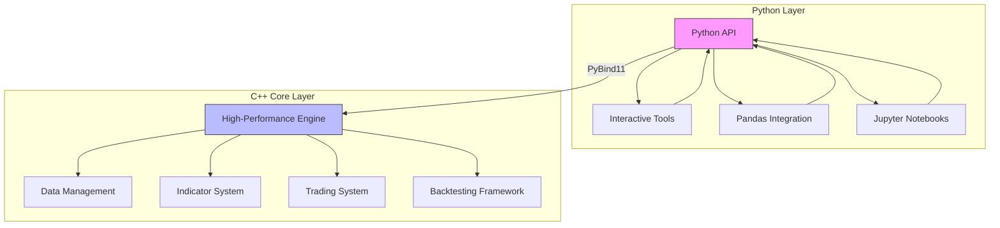
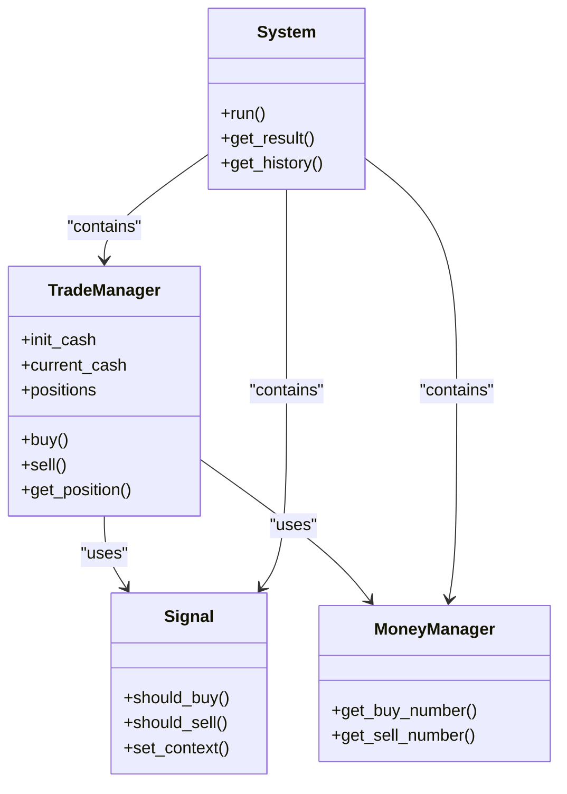
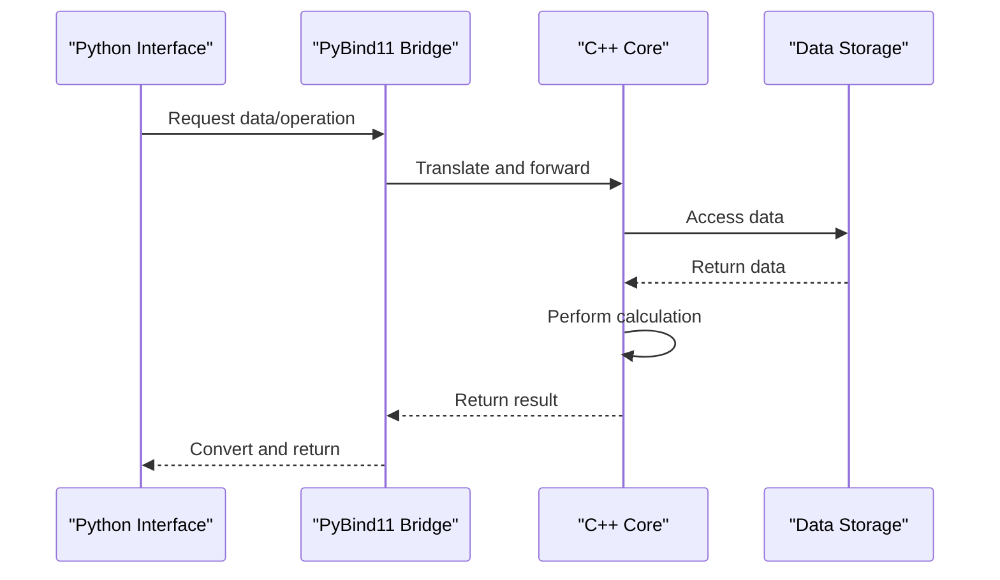
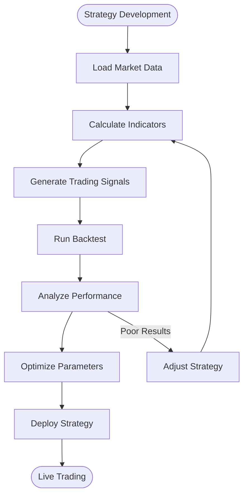

# Project Overview

<cite>
**Referenced Files in This Document**   
- [readme.md](file://readme.md)
- [hikyuu/__init__.py](file://hikyuu/__init__.py)
- [hikyuu/core.py](file://hikyuu/core.py)
- [hikyuu/interactive.py](file://hikyuu/interactive.py)
- [hikyuu/indicator/__init__.py](file://hikyuu/indicator/__init__.py)
- [hikyuu/trade_manage/__init__.py](file://hikyuu/trade_manage/__init__.py)
- [hikyuu/trade_sys/__init__.py](file://hikyuu/trade_sys/__init__.py)
- [hikyuu/analysis/__init__.py](file://hikyuu/analysis/__init__.py)
- [hikyuu_cpp/hikyuu/hikyuu.h](file://hikyuu_cpp/hikyuu/hikyuu.h)
- [hikyuu_cpp/hikyuu/DataType.h](file://hikyuu_cpp/hikyuu/DataType.h)
- [hikyuu/examples/Turtle_SG.py](file://hikyuu/examples/Turtle_SG.py)
- [hikyuu/examples/quick_crtsg.py](file://hikyuu/examples/quick_crtsg.py)
- [hikyuu/examples/notebook/000-Index.ipynb](file://hikyuu/examples/notebook/000-Index.ipynb)
</cite>

## Table of Contents
1. [Introduction](#introduction)
2. [Framework Architecture](#framework-architecture)
3. [Core Components](#core-components)
4. [Quantitative Trading Concepts](#quantitative-trading-concepts)
5. [Technical Implementation](#technical-implementation)
6. [Practical Usage Examples](#practical-usage-examples)
7. [Python API Interfaces](#python-api-interfaces)

## Introduction

Hikyuu Quant Framework is an open-source quantitative trading research framework based on C++/Python, designed for strategy analysis and backtesting primarily for the Chinese A-share market. The framework focuses on building core technologies in the quantitative trading domain, encompassing **trading model development, high-speed computing engines, efficient backtesting frameworks, and real-time trading capabilities**. Its core philosophy is based on mature systematic trading methods, abstracting the entire systematic trading process into components such as market environment judgment strategies, system validity conditions, signal indicators, stop-loss/take-profit strategies, money management strategies, profit target strategies, and slippage algorithms. Users can build strategy asset libraries for these components and freely combine them in actual research to observe the effectiveness, stability, and performance of individual strategy types.

The framework enables quantitative trading research by providing high-speed computing, efficient backtesting, and real-time trading capabilities. It supports flexible strategy combinations and classification-based construction of strategy asset libraries, allowing researchers to focus on specific aspects of strategy performance and impact during exploration.

**Section sources**
- [readme.md](file://readme.md#L7-L59)
- [hikyuu/examples/notebook/000-Index.ipynb](file://hikyuu/examples/notebook/000-Index.ipynb#L14-L17)

## Framework Architecture

Hikyuu features a dual-layer architecture with a C++ core for performance-critical operations and a Python interface for ease of use. This hybrid architecture combines the high-performance capabilities of C++ with the accessibility and flexibility of Python, creating an optimal environment for quantitative trading research.

The architecture consists of three main components:
1. **C++ Core Library**: Provides the foundational strategy framework with optimized performance, considering multi-threading and multi-core processing support for future high-speed computing requirements. The C++ core can be used independently to build custom client tools.
2. **Python Wrapper (hikyuu)**: Wraps the C++ library and integrates with mature Python data analysis tools like numpy and pandas, enabling seamless data structure conversion and leveraging Python's extensive data science ecosystem.
3. **Interactive Tools**: Provides interactive exploration capabilities with basic plotting functions for K-lines, indicators, and system signals, facilitating strategy exploration and backtesting.

This architecture delivers exceptional performance, with benchmarks showing that on an AMD 7950x processor, the framework can load and calculate 20-day MA for the entire A-share market (19.13 million daily K-lines) in just 6 seconds on first execution (including data loading), and 166 milliseconds after data is loaded.

**Diagram sources **
- [hikyuu/core.py](file://hikyuu/core.py#L1-L30)
- [hikyuu_cpp/hikyuu/hikyuu.h](file://hikyuu_cpp/hikyuu/hikyuu.h#L1-L56)

**Section sources**
- [readme.md](file://readme.md#L51-L55)
- [hikyuu/__init__.py](file://hikyuu/__init__.py#L38-L51)

## Core Components

The Hikyuu framework is built around several interconnected core components that work together to enable comprehensive quantitative trading research:

### Data Management
The data management system handles market data storage and retrieval, supporting multiple storage formats including HDF5 (default), MySQL, ClickHouse, and SQLite. The framework provides efficient data drivers for various data sources and includes tools for data import, conversion, and maintenance.

### Indicator System
The indicator system provides a comprehensive collection of technical indicators implemented in C++ for optimal performance. It includes both built-in indicators and integration with TA-Lib, allowing users to create complex technical analysis strategies. The system supports indicator composition and parameterization for flexible strategy development.

### Trading System Components
The trading system is modular and extensible, consisting of several key components:
- **Signal Indicators**: Generate buy/sell signals based on technical analysis
- **Money Management**: Determine position sizing and risk allocation
- **Stop-Loss/Take-Profit**: Implement risk management rules
- **Transaction Costs**: Model trading fees and slippage
- **Environment Judgment**: Assess market conditions for strategy validity

### Backtesting Framework
The backtesting framework provides high-performance simulation capabilities with realistic modeling of trading constraints, transaction costs, and market impact. It supports both single-asset and portfolio-level backtesting with detailed performance analysis and visualization.

**Diagram sources **
- [hikyuu/trade_manage/__init__.py](file://hikyuu/trade_manage/__init__.py#L27-L31)
- [hikyuu/trade_sys/__init__.py](file://hikyuu/trade_sys/__init__.py#L28-L43)
- [hikyuu/indicator/__init__.py](file://hikyuu/indicator/__init__.py#L27-L29)

**Section sources**
- [readme.md](file://readme.md#L49-L50)
- [hikyuu_cpp/hikyuu/DataType.h](file://hikyuu_cpp/hikyuu/DataType.h#L87-L165)

## Quantitative Trading Concepts

Quantitative trading involves using mathematical models and algorithms to identify and execute trading opportunities. Hikyuu facilitates this process by providing a structured framework for strategy development that breaks down complex trading systems into manageable components.

### Strategy Component Abstraction
Hikyuu abstracts systematic trading into seven key components:
1. **Market Environment Judgment**: Determines whether current market conditions are favorable for trading
2. **System Validity Conditions**: Specifies when the trading system should be active
3. **Signal Indicators**: Generates buy and sell signals based on technical analysis
4. **Stop-Loss/Stop-Profit Strategies**: Manages risk by automatically closing positions at predetermined levels
5. **Money Management**: Controls position sizing and risk allocation
6. **Profit Goals**: Defines objectives for trade profitability
7. **Slippage Algorithms**: Models the difference between expected and actual execution prices

This component-based approach allows researchers to build strategy asset libraries and test different combinations to evaluate system effectiveness, stability, and the impact of individual strategy types.

### Strategy Development Workflow
The framework supports a systematic workflow for strategy development:
1. **Data Acquisition**: Load historical market data for analysis
2. **Indicator Calculation**: Compute technical indicators on price data
3. **Signal Generation**: Create trading signals based on indicator values
4. **Backtesting**: Simulate trading performance using historical data
5. **Performance Analysis**: Evaluate strategy metrics and risk characteristics
6. **Optimization**: Refine strategy parameters for improved performance
7. **Real-time Trading**: Deploy validated strategies to live markets

This structured approach enables researchers to methodically develop and validate trading strategies while maintaining rigorous risk management practices.

**Section sources**
- [readme.md](file://readme.md#L7-L8)
- [hikyuu/examples/notebook/000-Index.ipynb](file://hikyuu/examples/notebook/000-Index.ipynb#L14-L17)

## Technical Implementation

The technical implementation of Hikyuu leverages the strengths of both C++ and Python to create a high-performance yet accessible quantitative trading framework. The hybrid C++/Python integration is achieved through pybind11, which enables seamless interoperability between the two languages.

### C++ Core Implementation
The C++ core provides the performance-critical components of the framework, including:
- High-speed data processing and indicator calculations
- Memory-efficient data structures for market data storage
- Optimized algorithms for backtesting and strategy execution
- Thread-safe operations for concurrent processing

The core is designed with extensibility in mind, allowing for the addition of new data sources, indicators, and trading components. It includes comprehensive serialization capabilities for saving and loading strategy components and historical data.

### Python Integration
The Python interface provides a user-friendly layer that exposes the C++ core functionality through intuitive APIs. Key aspects of the integration include:
- Automatic conversion between C++ and Python data structures
- Integration with numpy and pandas for data analysis
- Support for Jupyter notebooks for interactive exploration
- Pickle support for serialization of Python objects

The integration allows users to leverage the full power of Python's data science ecosystem while benefiting from the performance of the C++ core.

### Performance Optimization
The framework employs several optimization techniques to ensure high performance:
- Efficient memory management with shared data buffers
- Vectorized operations for indicator calculations
- Caching mechanisms for frequently accessed data
- Parallel processing capabilities for multi-core systems

These optimizations enable the framework to handle large datasets and complex calculations efficiently, making it suitable for high-frequency trading research and large-scale backtesting.

**Diagram sources **
- [hikyuu/core.py](file://hikyuu/core.py#L9-L27)
- [hikyuu_cpp/hikyuu/hikyuu.h](file://hikyuu_cpp/hikyuu/hikyuu.h#L12-L20)

**Section sources**
- [hikyuu/__init__.py](file://hikyuu/__init__.py#L53-L71)
- [hikyuu_cpp/hikyuu/DataType.h](file://hikyuu_cpp/hikyuu/DataType.h#L137-L143)

## Practical Usage Examples

Hikyuu provides several practical examples that demonstrate its capabilities for quantitative trading research. These examples range from basic usage patterns to complete trading strategies, illustrating how to leverage the framework's features for real-world applications.

### Interactive Mode
The framework includes an interactive mode that allows users to explore data and test strategies in real-time. By running the interactive.py script, users can immediately access a pre-configured environment with common variables and functions loaded, enabling rapid prototyping and exploration.

### Example Notebooks
The framework includes Jupyter notebooks that provide step-by-step tutorials on various aspects of quantitative trading:
- Getting stock data and K-line information
- Calculating and visualizing technical indicators
- Creating and testing trading strategies
- Portfolio management and asset allocation
- Real-time data integration

These notebooks serve as both learning resources and templates for developing custom strategies.

### Strategy Implementation Examples
The framework includes several example strategies that demonstrate different approaches to quantitative trading:

**Diagram sources **
- [hikyuu/interactive.py](file://hikyuu/interactive.py#L27-L69)
- [hikyuu/examples/notebook/000-Index.ipynb](file://hikyuu/examples/notebook/000-Index.ipynb#L25-L34)

**Section sources**
- [hikyuu/examples/Turtle_SG.py](file://hikyuu/examples/Turtle_SG.py#L13-L31)
- [hikyuu/examples/quick_crtsg.py](file://hikyuu/examples/quick_crtsg.py#L13-L23)
- [hikyuu/examples/notebook/000-Index.ipynb](file://hikyuu/examples/notebook/000-Index.ipynb#L25-L34)

## Python API Interfaces

The Hikyuu framework provides a comprehensive Python API that exposes the full functionality of the C++ core through intuitive interfaces. These public interfaces enable users to develop quantitative trading strategies using Python's expressive syntax while benefiting from the performance of the underlying C++ implementation.

### Key API Components
The main API components include:

**Stock and Market Data Interface**
- `sm`: StockManager instance for accessing market data
- `load_hikyuu()`: Function to initialize the framework and load data
- `get_kdata()`: Method to retrieve historical price data

**Indicator System Interface**
- `CLOSE()`, `OPEN()`, `HIGH()`, `LOW()`: Price-based indicators
- `MA()`, `EMA()`, `RSI()`: Technical indicators
- Custom indicator creation through inheritance or functional programming

**Trading System Interface**
- `crtTM()`: Create trading manager with initial capital
- `crtSG()`: Create signal generator
- `crtMM()`: Create money manager
- `SYS_Simple()`: Create trading system from components

**Utility Functions**
- `hku_save()` and `hku_load()`: Serialization functions
- `select()`: Stock screening function
- `realtime_update()`: Real-time data update function

### Primary Use Cases
The Python API supports several primary use cases:

1. **Strategy Research**: Rapid prototyping of trading ideas using interactive Python environments
2. **Backtesting**: Comprehensive testing of strategies against historical data
3. **Performance Analysis**: Evaluation of strategy metrics and risk characteristics
4. **Real-time Trading**: Deployment of validated strategies to live markets
5. **Portfolio Management**: Multi-asset strategy development and optimization

The API design emphasizes simplicity and consistency, allowing users to focus on strategy development rather than framework mechanics. The combination of high-level abstractions for common tasks and low-level access for custom implementations makes the framework suitable for both beginners and experienced developers.

**Section sources**
- [hikyuu/__init__.py](file://hikyuu/__init__.py#L150-L170)
- [hikyuu/__init__.py](file://hikyuu/__init__.py#L445-L478)
- [hikyuu/__init__.py](file://hikyuu/__init__.py#L538-L594)
- [readme.md](file://readme.md#L29-L42)