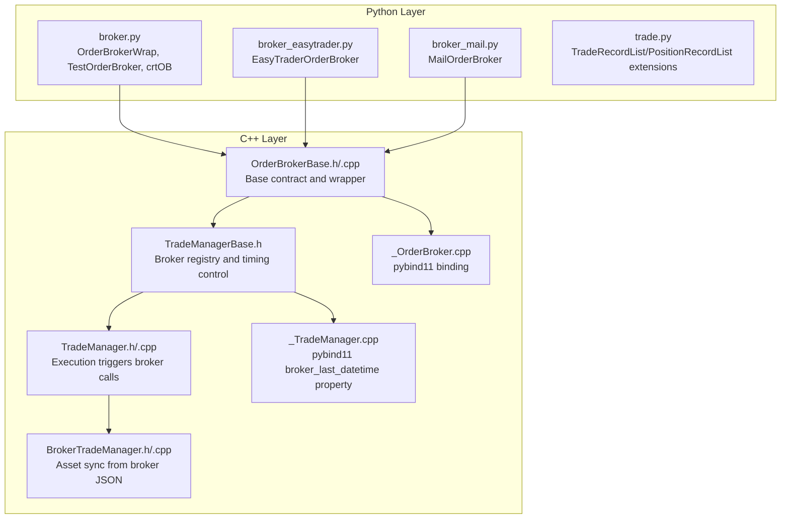
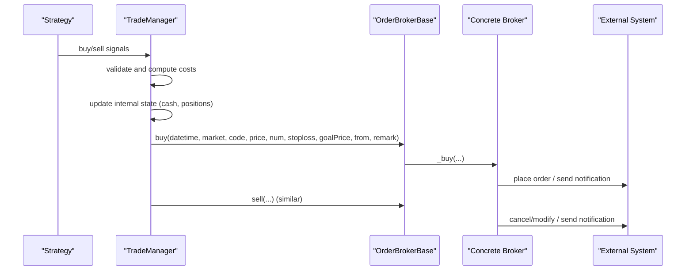
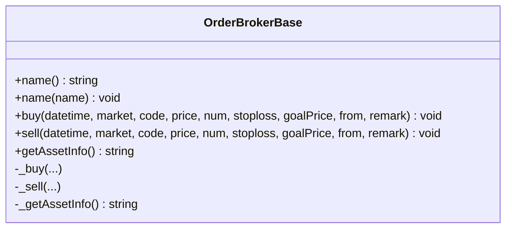
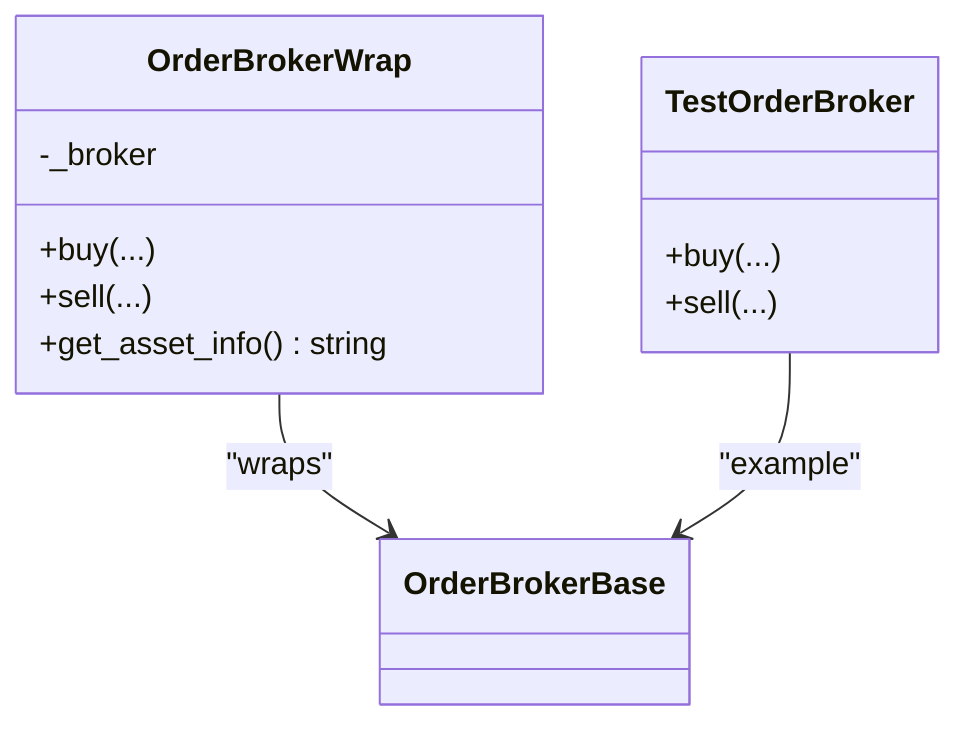
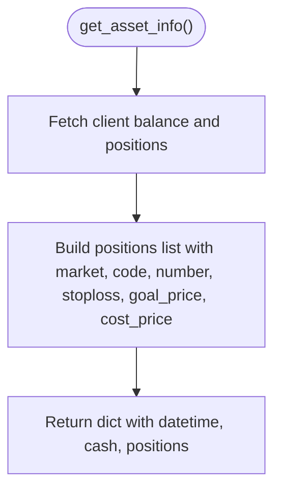
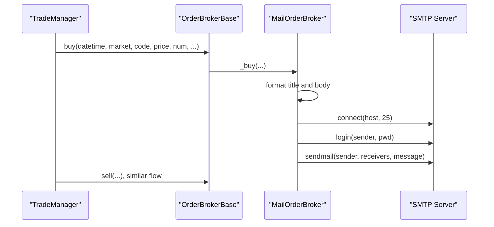
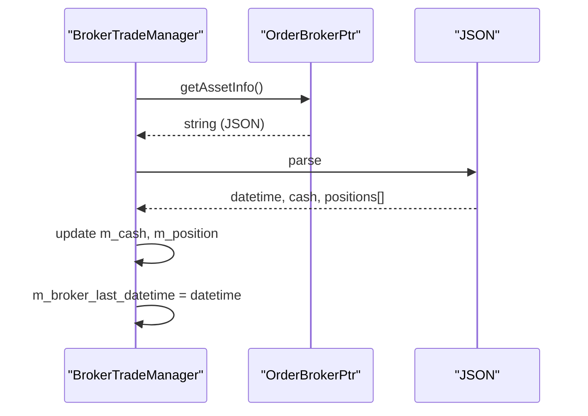
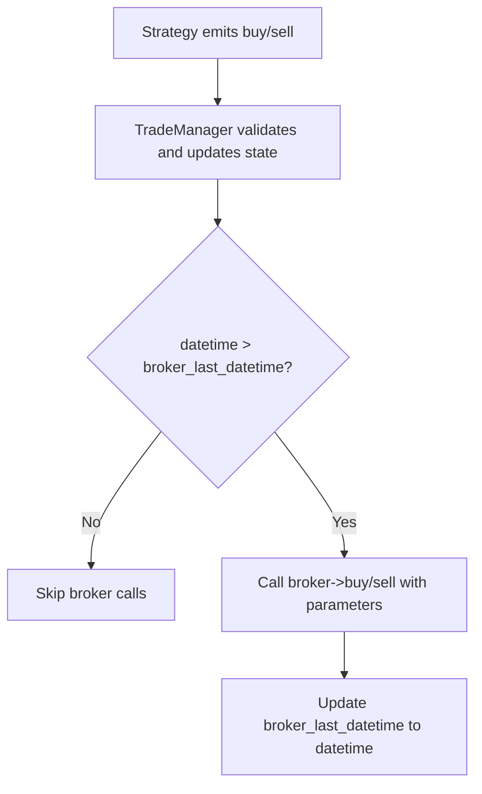
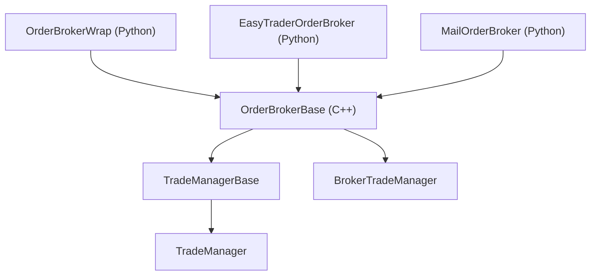

# Broker Integration

<cite>
**Referenced Files in This Document**
- [broker.py](file://hikyuu/trade_manage/broker.py)
- [broker_easytrader.py](file://hikyuu/trade_manage/broker_easytrader.py)
- [broker_mail.py](file://hikyuu/trade_manage/broker_mail.py)
- [trade.py](file://hikyuu/trade_manage/trade.py)
- [OrderBrokerBase.h](file://hikyuu_cpp/hikyuu/trade_manage/OrderBrokerBase.h)
- [OrderBrokerBase.cpp](file://hikyuu_cpp/hikyuu/trade_manage/OrderBrokerBase.cpp)
- [TradeManagerBase.h](file://hikyuu_cpp/hikyuu/trade_manage/TradeManagerBase.h)
- [TradeManager.h](file://hikyuu_cpp/hikyuu/trade_manage/TradeManager.h)
- [TradeManager.cpp](file://hikyuu_cpp/hikyuu/trade_manage/TradeManager.cpp)
- [BrokerTradeManager.h](file://hikyuu_cpp/hikyuu/strategy/BrokerTradeManager.h)
- [BrokerTradeManager.cpp](file://hikyuu_cpp/hikyuu/strategy/BrokerTradeManager.cpp)
- [_OrderBroker.cpp](file://hikyuu_pywrap/trade_manage/_OrderBroker.cpp)
- [_TradeManager.cpp](file://hikyuu_pywrap/trade_manage/_TradeManager.cpp)
</cite>

## Table of Contents
1. [Introduction](#introduction)
2. [Project Structure](#project-structure)
3. [Core Components](#core-components)
4. [Architecture Overview](#architecture-overview)
5. [Detailed Component Analysis](#detailed-component-analysis)
6. [Dependency Analysis](#dependency-analysis)
7. [Performance Considerations](#performance-considerations)
8. [Troubleshooting Guide](#troubleshooting-guide)
9. [Conclusion](#conclusion)

## Introduction
This document explains the broker integration capabilities in Hikyuu, focusing on how order execution is routed through different broker interfaces. It covers the Python-side broker wrappers and the C++-side OrderBrokerBase contract, and demonstrates how two concrete implementations—easytrader-based and mail-based—translate trade instructions into broker-specific actions. It also describes how asset information is synchronized from a broker, the message format and delivery mechanism for mail-based execution, and operational considerations for reliability, error recovery, and security.

## Project Structure
Hikyuu’s broker integration spans both Python and C++ layers:
- Python broker abstractions and examples live under hikyuu/trade_manage.
- The core broker contract and execution orchestration are defined in C++ and exposed to Python via pybind11 bindings.
- Broker-specific implementations demonstrate how to integrate with external systems (e.g., easytrader client) and asynchronous channels (email).

**Diagram sources**
- [broker.py](file://hikyuu/trade_manage/broker.py#L1-L96)
- [broker_easytrader.py](file://hikyuu/trade_manage/broker_easytrader.py#L1-L64)
- [broker_mail.py](file://hikyuu/trade_manage/broker_mail.py#L1-L102)
- [trade.py](file://hikyuu/trade_manage/trade.py#L1-L55)
- [OrderBrokerBase.h](file://hikyuu_cpp/hikyuu/trade_manage/OrderBrokerBase.h#L36-L118)
- [OrderBrokerBase.cpp](file://hikyuu_cpp/hikyuu/trade_manage/OrderBrokerBase.cpp#L55-L98)
- [TradeManagerBase.h](file://hikyuu_cpp/hikyuu/trade_manage/TradeManagerBase.h#L147-L196)
- [TradeManager.h](file://hikyuu_cpp/hikyuu/trade_manage/TradeManager.h#L218-L290)
- [TradeManager.cpp](file://hikyuu_cpp/hikyuu/trade_manage/TradeManager.cpp#L860-L960)
- [BrokerTradeManager.h](file://hikyuu_cpp/hikyuu/strategy/BrokerTradeManager.h#L26-L40)
- [BrokerTradeManager.cpp](file://hikyuu_cpp/hikyuu/strategy/BrokerTradeManager.cpp#L36-L92)
- [_OrderBroker.cpp](file://hikyuu_pywrap/trade_manage/_OrderBroker.cpp#L32-L118)
- [_TradeManager.cpp](file://hikyuu_pywrap/trade_manage/_TradeManager.cpp#L279-L293)

**Section sources**
- [broker.py](file://hikyuu/trade_manage/broker.py#L1-L96)
- [broker_easytrader.py](file://hikyuu/trade_manage/broker_easytrader.py#L1-L64)
- [broker_mail.py](file://hikyuu/trade_manage/broker_mail.py#L1-L102)
- [trade.py](file://hikyuu/trade_manage/trade.py#L1-L55)
- [OrderBrokerBase.h](file://hikyuu_cpp/hikyuu/trade_manage/OrderBrokerBase.h#L36-L118)
- [OrderBrokerBase.cpp](file://hikyuu_cpp/hikyuu/trade_manage/OrderBrokerBase.cpp#L55-L98)
- [TradeManagerBase.h](file://hikyuu_cpp/hikyuu/trade_manage/TradeManagerBase.h#L147-L196)
- [TradeManager.h](file://hikyuu_cpp/hikyuu/trade_manage/TradeManager.h#L218-L290)
- [TradeManager.cpp](file://hikyuu_cpp/hikyuu/trade_manage/TradeManager.cpp#L860-L960)
- [BrokerTradeManager.h](file://hikyuu_cpp/hikyuu/strategy/BrokerTradeManager.h#L26-L40)
- [BrokerTradeManager.cpp](file://hikyuu_cpp/hikyuu/strategy/BrokerTradeManager.cpp#L36-L92)
- [_OrderBroker.cpp](file://hikyuu_pywrap/trade_manage/_OrderBroker.cpp#L32-L118)
- [_TradeManager.cpp](file://hikyuu_pywrap/trade_manage/_TradeManager.cpp#L279-L293)

## Core Components
- OrderBrokerBase (C++): Defines the broker contract with buy/sell/getAssetInfo and protected virtual hooks for subclasses. It wraps exceptions and ensures robustness.
- Python OrderBrokerWrap: A thin adapter that forwards Python broker instances to the C++ OrderBrokerBase interface, enabling Python-only implementations to participate in the execution pipeline.
- EasyTraderOrderBroker (Python): A sample broker that buffers orders and exposes a get_asset_info method returning a structured asset snapshot compatible with the JSON contract.
- MailOrderBroker (Python): A sample broker that sends email notifications for buy/sell actions using SMTP.
- TradeManager: Orchestrates execution and invokes registered brokers’ buy/sell when the execution time is later than the broker activation threshold.
- BrokerTradeManager: A specialized manager that synchronizes internal state from a broker’s asset info JSON, enabling real-time alignment with external accounts.

Key interfaces and responsibilities:
- OrderBrokerBase::buy/sell: Subclasses implement _buy/_sell to perform actual execution.
- OrderBrokerBase::getAssetInfo: Subclasses implement _getAssetInfo to return a JSON string conforming to the documented schema.
- TradeManager registers brokers and triggers execution at appropriate times.
- BrokerTradeManager parses broker JSON to populate cash and positions.

**Section sources**
- [OrderBrokerBase.h](file://hikyuu_cpp/hikyuu/trade_manage/OrderBrokerBase.h#L36-L118)
- [OrderBrokerBase.cpp](file://hikyuu_cpp/hikyuu/trade_manage/OrderBrokerBase.cpp#L55-L98)
- [broker.py](file://hikyuu/trade_manage/broker.py#L37-L96)
- [broker_easytrader.py](file://hikyuu/trade_manage/broker_easytrader.py#L10-L64)
- [broker_mail.py](file://hikyuu/trade_manage/broker_mail.py#L37-L102)
- [TradeManagerBase.h](file://hikyuu_cpp/hikyuu/trade_manage/TradeManagerBase.h#L147-L196)
- [TradeManager.cpp](file://hikyuu_cpp/hikyuu/trade_manage/TradeManager.cpp#L860-L960)
- [BrokerTradeManager.cpp](file://hikyuu_cpp/hikyuu/strategy/BrokerTradeManager.cpp#L36-L92)

## Architecture Overview
The broker integration architecture connects strategy execution with external systems through a unified contract. Execution flows are controlled by a broker activation timestamp to prevent unintended historical orders from triggering real actions.

**Diagram sources**
- [TradeManager.cpp](file://hikyuu_cpp/hikyuu/trade_manage/TradeManager.cpp#L860-L960)
- [OrderBrokerBase.h](file://hikyuu_cpp/hikyuu/trade_manage/OrderBrokerBase.h#L76-L118)
- [OrderBrokerBase.cpp](file://hikyuu_cpp/hikyuu/trade_manage/OrderBrokerBase.cpp#L55-L98)
- [TradeManagerBase.h](file://hikyuu_cpp/hikyuu/trade_manage/TradeManagerBase.h#L147-L196)

## Detailed Component Analysis

### OrderBrokerBase Contract
OrderBrokerBase defines the broker contract:
- Public methods buy/sell accept strategy timestamps, market/code, prices, quantities, stoploss/goal, source, and remarks.
- Protected pure virtuals _buy/_sell must be implemented by subclasses.
- getAssetInfo returns a JSON string conforming to a documented schema.

**Diagram sources**
- [OrderBrokerBase.h](file://hikyuu_cpp/hikyuu/trade_manage/OrderBrokerBase.h#L36-L118)
- [OrderBrokerBase.cpp](file://hikyuu_cpp/hikyuu/trade_manage/OrderBrokerBase.cpp#L55-L98)

**Section sources**
- [OrderBrokerBase.h](file://hikyuu_cpp/hikyuu/trade_manage/OrderBrokerBase.h#L36-L118)
- [OrderBrokerBase.cpp](file://hikyuu_cpp/hikyuu/trade_manage/OrderBrokerBase.cpp#L55-L98)

### Python Broker Adapter: OrderBrokerWrap
OrderBrokerWrap adapts Python broker instances to the OrderBrokerBase interface. It forwards buy/sell calls and safely converts asset info to JSON if the underlying broker provides a dict.

**Diagram sources**
- [broker.py](file://hikyuu/trade_manage/broker.py#L37-L96)
- [_OrderBroker.cpp](file://hikyuu_pywrap/trade_manage/_OrderBroker.cpp#L32-L59)

**Section sources**
- [broker.py](file://hikyuu/trade_manage/broker.py#L37-L96)
- [_OrderBroker.cpp](file://hikyuu_pywrap/trade_manage/_OrderBroker.cpp#L32-L59)

### EasyTrader-Based Broker: EasyTraderOrderBroker
This Python broker buffers orders locally and provides get_asset_info returning a JSON structure aligned with the contract. It demonstrates how to integrate with a third-party trading client.

Implementation highlights:
- buy/sell buffer orders and update an internal buffer keyed by market+code.
- get_asset_info reads balances and positions from the client, maps market categories, and constructs a positions list with stoploss/goal_price and cost_price.

**Diagram sources**
- [broker_easytrader.py](file://hikyuu/trade_manage/broker_easytrader.py#L37-L64)

**Section sources**
- [broker_easytrader.py](file://hikyuu/trade_manage/broker_easytrader.py#L10-L64)

### Mail-Based Broker: MailOrderBroker
This Python broker sends email notifications for buy/sell actions. It encapsulates SMTP configuration and constructs subject/body messages.

Key behaviors:
- Initialization accepts SMTP host, sender credentials, and receiver list.
- buy/sell construct messages and call a private _sendmail routine.
- _sendmail builds MIMEText, sets headers, connects to SMTP server, logs in, and sends.

**Diagram sources**
- [broker_mail.py](file://hikyuu/trade_manage/broker_mail.py#L37-L102)
- [TradeManager.cpp](file://hikyuu_cpp/hikyuu/trade_manage/TradeManager.cpp#L860-L960)

**Section sources**
- [broker_mail.py](file://hikyuu/trade_manage/broker_mail.py#L37-L102)
- [TradeManager.cpp](file://hikyuu_cpp/hikyuu/trade_manage/TradeManager.cpp#L860-L960)

### Asset Synchronization: BrokerTradeManager
BrokerTradeManager fetches asset info from a broker and reconstructs internal state:
- Calls broker->getAssetInfo() and expects a JSON string.
- Parses datetime, cash, and positions.
- Converts positions into PositionRecord entries and updates internal cash/positions.
- Updates broker_last_datetime to the parsed timestamp.

**Diagram sources**
- [BrokerTradeManager.cpp](file://hikyuu_cpp/hikyuu/strategy/BrokerTradeManager.cpp#L36-L92)

**Section sources**
- [BrokerTradeManager.h](file://hikyuu_cpp/hikyuu/strategy/BrokerTradeManager.h#L26-L40)
- [BrokerTradeManager.cpp](file://hikyuu_cpp/hikyuu/strategy/BrokerTradeManager.cpp#L36-L92)

### Execution Flow and Timing Control
TradeManager triggers broker buy/sell calls only when the execution datetime is later than the broker activation threshold (broker_last_datetime). This prevents historical signals from causing real trades during backtesting.

**Diagram sources**
- [TradeManager.cpp](file://hikyuu_cpp/hikyuu/trade_manage/TradeManager.cpp#L860-L960)
- [TradeManagerBase.h](file://hikyuu_cpp/hikyuu/trade_manage/TradeManagerBase.h#L147-L196)

**Section sources**
- [TradeManager.cpp](file://hikyuu_cpp/hikyuu/trade_manage/TradeManager.cpp#L860-L960)
- [TradeManagerBase.h](file://hikyuu_cpp/hikyuu/trade_manage/TradeManagerBase.h#L147-L196)

## Dependency Analysis
- Python broker implementations depend on OrderBrokerBase semantics via OrderBrokerWrap and rely on the C++ contract for execution.
- TradeManager depends on OrderBrokerBase for broker invocation and uses broker_last_datetime to gate real-world actions.
- BrokerTradeManager depends on OrderBrokerBase::getAssetInfo and JSON parsing to synchronize state.

**Diagram sources**
- [broker.py](file://hikyuu/trade_manage/broker.py#L37-L96)
- [broker_easytrader.py](file://hikyuu/trade_manage/broker_easytrader.py#L10-L64)
- [broker_mail.py](file://hikyuu/trade_manage/broker_mail.py#L37-L102)
- [OrderBrokerBase.h](file://hikyuu_cpp/hikyuu/trade_manage/OrderBrokerBase.h#L36-L118)
- [TradeManagerBase.h](file://hikyuu_cpp/hikyuu/trade_manage/TradeManagerBase.h#L147-L196)
- [TradeManager.cpp](file://hikyuu_cpp/hikyuu/trade_manage/TradeManager.cpp#L860-L960)
- [BrokerTradeManager.cpp](file://hikyuu_cpp/hikyuu/strategy/BrokerTradeManager.cpp#L36-L92)

**Section sources**
- [broker.py](file://hikyuu/trade_manage/broker.py#L37-L96)
- [broker_easytrader.py](file://hikyuu/trade_manage/broker_easytrader.py#L10-L64)
- [broker_mail.py](file://hikyuu/trade_manage/broker_mail.py#L37-L102)
- [OrderBrokerBase.h](file://hikyuu_cpp/hikyuu/trade_manage/OrderBrokerBase.h#L36-L118)
- [TradeManagerBase.h](file://hikyuu_cpp/hikyuu/trade_manage/TradeManagerBase.h#L147-L196)
- [TradeManager.cpp](file://hikyuu_cpp/hikyuu/trade_manage/TradeManager.cpp#L860-L960)
- [BrokerTradeManager.cpp](file://hikyuu_cpp/hikyuu/strategy/BrokerTradeManager.cpp#L36-L92)

## Performance Considerations
- Broker invocation overhead: Each buy/sell triggers broker calls; minimize unnecessary brokers and ensure lightweight implementations.
- JSON parsing cost: BrokerTradeManager parses JSON for asset synchronization; keep payload minimal and avoid frequent polling.
- Timing gating: Use broker_last_datetime to avoid redundant broker calls during backtesting, reducing network and I/O overhead.
- Buffering strategies: EasyTraderOrderBroker buffers orders; batching reduces repeated client interactions.

[No sources needed since this section provides general guidance]

## Troubleshooting Guide
Common issues and remedies:
- Connection failures (mail broker):
  - Verify SMTP host/port and credentials; ensure firewall allows outbound SMTP.
  - Check sender/receiver configuration and recipient addresses.
  - Review authentication errors and TLS/SSL settings if required by the SMTP provider.
  - Reference: [broker_mail.py](file://hikyuu/trade_manage/broker_mail.py#L57-L102)

- Order rejection or mismatch:
  - Validate market code and quantity against exchange constraints.
  - Ensure broker_last_datetime is set appropriately to avoid historical orders triggering real actions.
  - Confirm that broker.getAssetInfo returns valid JSON with required fields.
  - Reference: [TradeManagerBase.h](file://hikyuu_cpp/hikyuu/trade_manage/TradeManagerBase.h#L147-L196), [BrokerTradeManager.cpp](file://hikyuu_cpp/hikyuu/strategy/BrokerTradeManager.cpp#L36-L92)

- Asset synchronization errors:
  - If getAssetInfo returns empty or malformed JSON, BrokerTradeManager resets cash and positions; re-check broker implementation and connectivity.
  - Reference: [BrokerTradeManager.cpp](file://hikyuu_cpp/hikyuu/strategy/BrokerTradeManager.cpp#L36-L92)

- Security aspects:
  - Protect SMTP credentials and avoid hardcoding secrets; prefer environment variables or secure vaults.
  - Limit broker privileges and restrict broker_last_datetime to prevent accidental real trades during testing.
  - Validate and sanitize inputs to prevent injection or malformed JSON.

**Section sources**
- [broker_mail.py](file://hikyuu/trade_manage/broker_mail.py#L57-L102)
- [TradeManagerBase.h](file://hikyuu_cpp/hikyuu/trade_manage/TradeManagerBase.h#L147-L196)
- [BrokerTradeManager.cpp](file://hikyuu_cpp/hikyuu/strategy/BrokerTradeManager.cpp#L36-L92)

## Conclusion
Hikyuu’s broker integration provides a clean separation between strategy execution and external systems. The OrderBrokerBase contract ensures consistent behavior across broker implementations, while TradeManager coordinates execution with safety gates. Python wrappers and concrete implementations (easytrader and mail) illustrate how to translate trade instructions into broker-specific commands and how to synchronize account state via JSON. Robust error handling, timing controls, and security practices are essential for reliable operation.