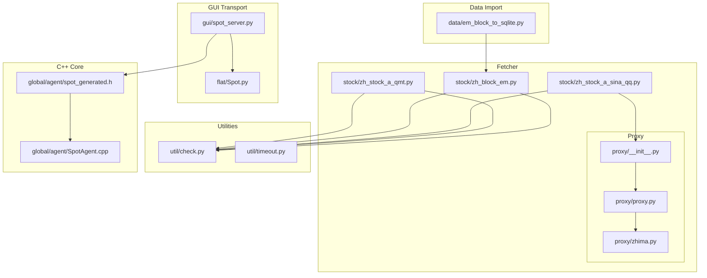
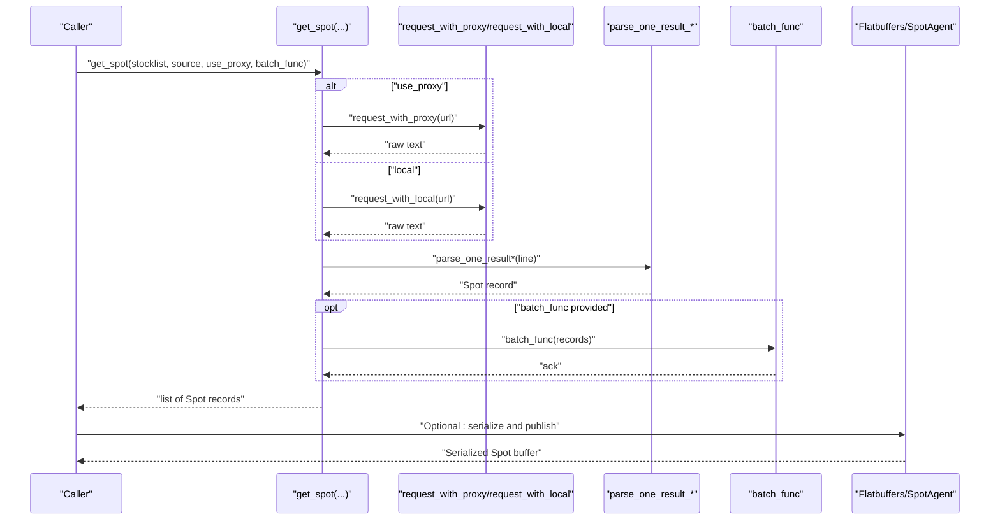
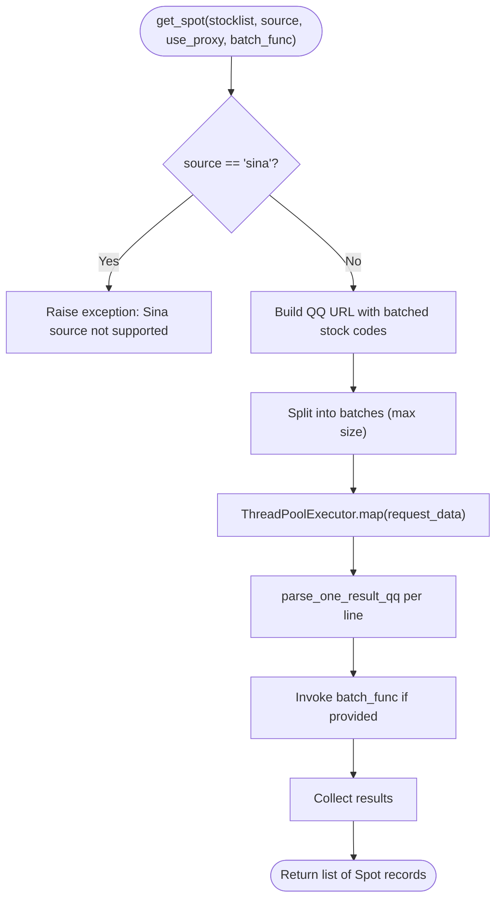
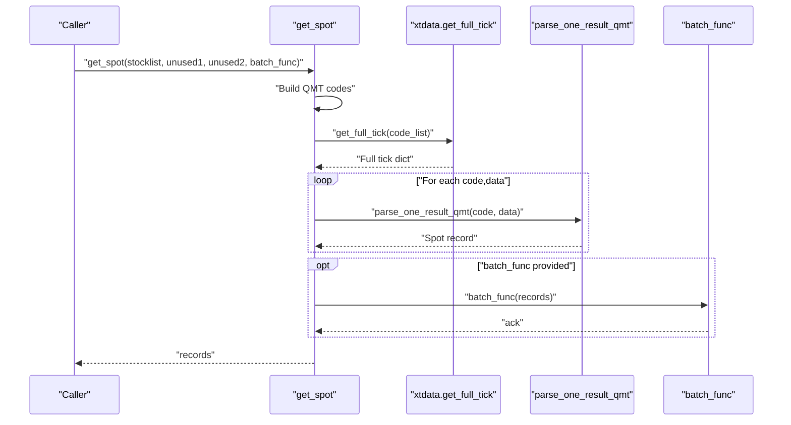
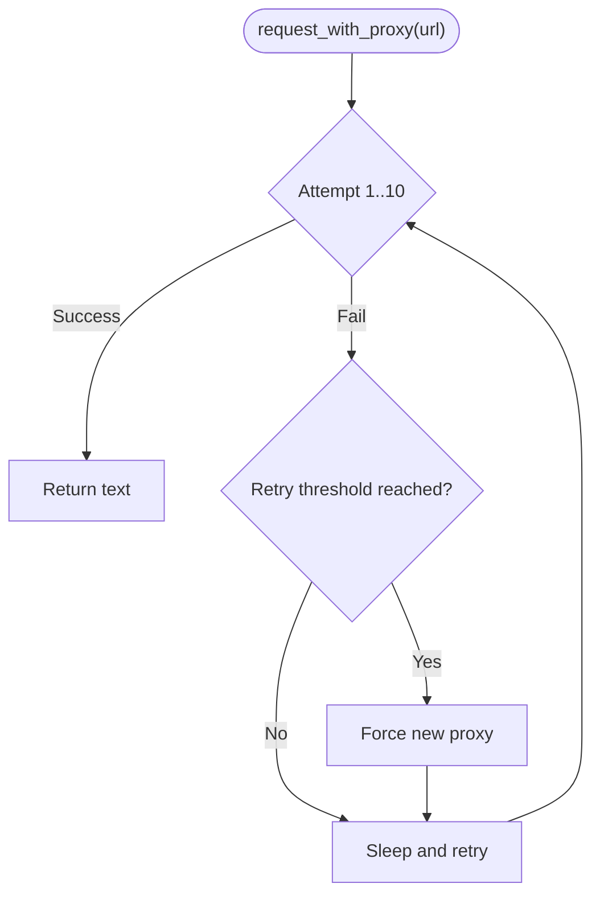
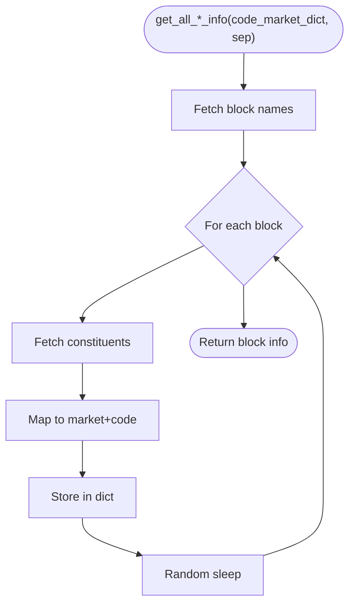
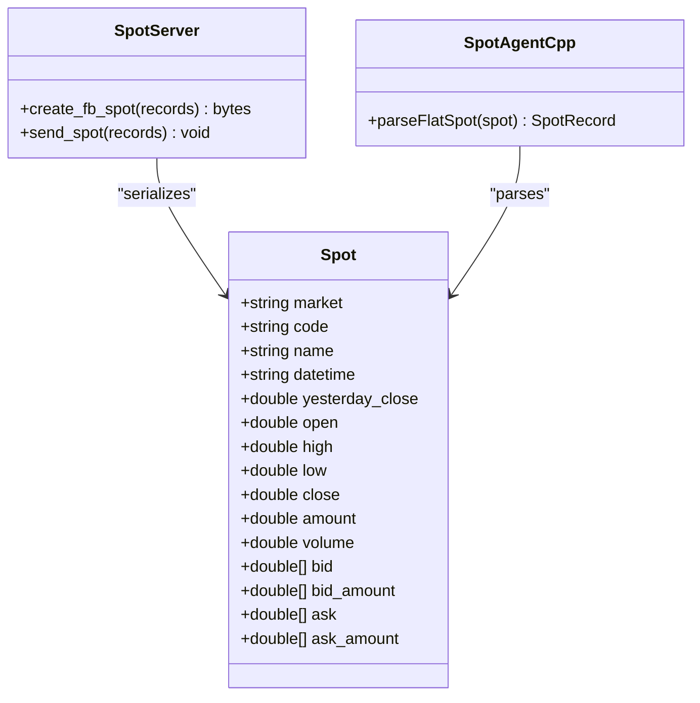
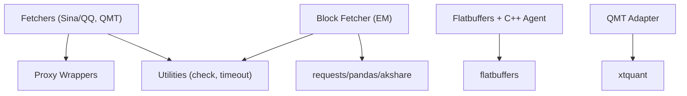

# Live Data Fetching

<cite>
**Referenced Files in This Document**
- [zh_stock_a_sina_qq.py](file://hikyuu/fetcher/stock/zh_stock_a_sina_qq.py)
- [zh_stock_a_qmt.py](file://hikyuu/fetcher/stock/zh_stock_a_qmt.py)
- [zh_block_em.py](file://hikyuu/fetcher/stock/zh_block_em.py)
- [proxy.py](file://hikyuu/fetcher/proxy/proxy.py)
- [zhima.py](file://hikyuu/fetcher/proxy/zhima.py)
- [check.py](file://hikyuu/util/check.py)
- [timeout.py](file://hikyuu/util/timeout.py)
- [__init__.py (proxy)](file://hikyuu/fetcher/proxy/__init__.py)
- [Spot.py (flatbuffers)](file://hikyuu/flat/Spot.py)
- [spot_server.py](file://hikyuu/gui/spot_server.py)
- [SpotAgent.cpp (C++)](file://hikyuu_cpp/hikyuu/global/agent/SpotAgent.cpp)
- [spot_generated.h (C++)](file://hikyuu_cpp/hikyuu/global/agent/spot_generated.h)
- [em_block_to_sqlite.py](file://hikyuu/data/em_block_to_sqlite.py)
</cite>

## Table of Contents
1. [Introduction](#introduction)
2. [Project Structure](#project-structure)
3. [Core Components](#core-components)
4. [Architecture Overview](#architecture-overview)
5. [Detailed Component Analysis](#detailed-component-analysis)
6. [Dependency Analysis](#dependency-analysis)
7. [Performance Considerations](#performance-considerations)
8. [Troubleshooting Guide](#troubleshooting-guide)
9. [Conclusion](#conclusion)
10. [Appendices](#appendices)

## Introduction
This document describes the live data fetching subsystem in Hikyuu, focusing on real-time market data acquisition from multiple sources and the block data fetching pipeline. It explains the fetcher module architecture, how proxy services (zhima.py) are integrated for reliability, and the interfaces and usage patterns for each data source adapter. It also covers block data fetching via zh_block_em.py for sector/index information, common issues such as network timeouts, data consistency, and rate limiting, and provides guidance on extending the system with new data sources and optimizing data retrieval performance.

## Project Structure
The live data fetching subsystem resides under hikyuu/fetcher and integrates with utilities and GUI components for data transport and persistence.

**Diagram sources**
- [zh_stock_a_sina_qq.py](file://hikyuu/fetcher/stock/zh_stock_a_sina_qq.py#L1-L186)
- [zh_stock_a_qmt.py](file://hikyuu/fetcher/stock/zh_stock_a_qmt.py#L1-L58)
- [zh_block_em.py](file://hikyuu/fetcher/stock/zh_block_em.py#L1-L535)
- [proxy.py](file://hikyuu/fetcher/proxy/proxy.py#L1-L39)
- [zhima.py](file://hikyuu/fetcher/proxy/zhima.py#L1-L64)
- [check.py](file://hikyuu/util/check.py#L1-L162)
- [timeout.py](file://hikyuu/util/timeout.py#L1-L83)
- [Spot.py (flatbuffers)](file://hikyuu/flat/Spot.py#L48-L129)
- [spot_server.py](file://hikyuu/gui/spot_server.py#L47-L133)
- [SpotAgent.cpp (C++)](file://hikyuu_cpp/hikyuu/global/agent/SpotAgent.cpp#L84-L123)
- [spot_generated.h (C++)](file://hikyuu_cpp/hikyuu/global/agent/spot_generated.h#L118-L212)
- [em_block_to_sqlite.py](file://hikyuu/data/em_block_to_sqlite.py#L1-L71)

**Section sources**
- [zh_stock_a_sina_qq.py](file://hikyuu/fetcher/stock/zh_stock_a_sina_qq.py#L1-L186)
- [zh_stock_a_qmt.py](file://hikyuu/fetcher/stock/zh_stock_a_qmt.py#L1-L58)
- [zh_block_em.py](file://hikyuu/fetcher/stock/zh_block_em.py#L1-L535)
- [proxy.py](file://hikyuu/fetcher/proxy/proxy.py#L1-L39)
- [zhima.py](file://hikyuu/fetcher/proxy/zhima.py#L1-L64)
- [check.py](file://hikyuu/util/check.py#L1-L162)
- [timeout.py](file://hikyuu/util/timeout.py#L1-L83)
- [Spot.py (flatbuffers)](file://hikyuu/flat/Spot.py#L48-L129)
- [spot_server.py](file://hikyuu/gui/spot_server.py#L47-L133)
- [SpotAgent.cpp (C++)](file://hikyuu_cpp/hikyuu/global/agent/SpotAgent.cpp#L84-L123)
- [spot_generated.h (C++)](file://hikyuu_cpp/hikyuu/global/agent/spot_generated.h#L118-L212)
- [em_block_to_sqlite.py](file://hikyuu/data/em_block_to_sqlite.py#L1-L71)

## Core Components
- Real-time stock fetchers:
  - Sina/QQ fetcher: [zh_stock_a_sina_qq.py](file://hikyuu/fetcher/stock/zh_stock_a_sina_qq.py#L1-L186)
  - QMT fetcher: [zh_stock_a_qmt.py](file://hikyuu/fetcher/stock/zh_stock_a_qmt.py#L1-L58)
- Proxy service integration:
  - Proxy request wrapper: [proxy.py](file://hikyuu/fetcher/proxy/proxy.py#L1-L39)
  - Proxy provider (Zhima): [zhima.py](file://hikyuu/fetcher/proxy/zhima.py#L1-L64)
- Block data fetcher (Eastmoney):
  - [zh_block_em.py](file://hikyuu/fetcher/stock/zh_block_em.py#L1-L535)
- Utilities:
  - Error handling and decorators: [check.py](file://hikyuu/util/check.py#L1-L162)
  - Timeout utilities: [timeout.py](file://hikyuu/util/timeout.py#L1-L83)
- Data transport and persistence:
  - Flatbuffers Spot schema: [Spot.py (flatbuffers)](file://hikyuu/flat/Spot.py#L48-L129)
  - GUI transport and C++ parsing: [spot_server.py](file://hikyuu/gui/spot_server.py#L47-L133), [SpotAgent.cpp (C++)](file://hikyuu_cpp/hikyuu/global/agent/SpotAgent.cpp#L84-L123), [spot_generated.h (C++)](file://hikyuu_cpp/hikyuu/global/agent/spot_generated.h#L118-L212)
  - Block import to SQLite: [em_block_to_sqlite.py](file://hikyuu/data/em_block_to_sqlite.py#L1-L71)

**Section sources**
- [zh_stock_a_sina_qq.py](file://hikyuu/fetcher/stock/zh_stock_a_sina_qq.py#L1-L186)
- [zh_stock_a_qmt.py](file://hikyuu/fetcher/stock/zh_stock_a_qmt.py#L1-L58)
- [zh_block_em.py](file://hikyuu/fetcher/stock/zh_block_em.py#L1-L535)
- [proxy.py](file://hikyuu/fetcher/proxy/proxy.py#L1-L39)
- [zhima.py](file://hikyuu/fetcher/proxy/zhima.py#L1-L64)
- [check.py](file://hikyuu/util/check.py#L1-L162)
- [timeout.py](file://hikyuu/util/timeout.py#L1-L83)
- [Spot.py (flatbuffers)](file://hikyuu/flat/Spot.py#L48-L129)
- [spot_server.py](file://hikyuu/gui/spot_server.py#L47-L133)
- [SpotAgent.cpp (C++)](file://hikyuu_cpp/hikyuu/global/agent/SpotAgent.cpp#L84-L123)
- [spot_generated.h (C++)](file://hikyuu_cpp/hikyuu/global/agent/spot_generated.h#L118-L212)
- [em_block_to_sqlite.py](file://hikyuu/data/em_block_to_sqlite.py#L1-L71)

## Architecture Overview
The live data fetching architecture comprises:
- Data source adapters that fetch raw market data and parse it into a unified Spot record format.
- A proxy layer that provides resilient network access with fallback and rotation.
- A transport layer that serializes Spot records for internal consumption and GUI display.
- A block data pipeline that retrieves sector/index information from Eastmoney and persists it.

**Diagram sources**
- [zh_stock_a_sina_qq.py](file://hikyuu/fetcher/stock/zh_stock_a_sina_qq.py#L124-L181)
- [proxy.py](file://hikyuu/fetcher/proxy/proxy.py#L17-L39)
- [spot_server.py](file://hikyuu/gui/spot_server.py#L47-L133)
- [SpotAgent.cpp (C++)](file://hikyuu_cpp/hikyuu/global/agent/SpotAgent.cpp#L84-L123)

## Detailed Component Analysis

### Sina/QQ Real-Time Fetcher (zh_stock_a_sina_qq.py)
- Purpose: Fetch spot data from Sina or QQ APIs, parse into Spot records, and support batching and proxy usage.
- Key functions:
  - parse_one_result_sina: Parses Sina API response lines into Spot fields.
  - parse_one_result_qq: Parses QQ API response lines into Spot fields.
  - request_data: Executes a single request (via proxy or local) and parses each line.
  - get_spot: Builds batches, executes concurrently, and invokes batch_func for each batch.
- Parameters and behavior:
  - stocklist: List of stock identifiers (e.g., sh000001, sz000001).
  - source: 'sina' or 'qq'. Note: Sina is marked unsupported in current implementation.
  - use_proxy: Boolean to route requests through proxy.
  - batch_func: Optional callback invoked with each batch result.
- Return format: List of Spot records (dictionary-like structure).
- Error handling:
  - Uses decorators and checks to log warnings and ignore invalid lines.
  - Network failures propagate exceptions; proxy failures retry with fallback.

**Diagram sources**
- [zh_stock_a_sina_qq.py](file://hikyuu/fetcher/stock/zh_stock_a_sina_qq.py#L124-L181)

**Section sources**
- [zh_stock_a_sina_qq.py](file://hikyuu/fetcher/stock/zh_stock_a_sina_qq.py#L1-L186)

### QMT Real-Time Fetcher (zh_stock_a_qmt.py)
- Purpose: Fetch full-tick data from QMT (xtquant) and convert to Spot records.
- Key functions:
  - parse_one_result_qmt: Converts QMT tick data to Spot fields.
  - get_spot: Builds QMT-style codes, fetches full ticks, parses, and optionally batches.
- Parameters and behavior:
  - stocklist: List of stock objects with code/market attributes.
  - unused1/unused2: Placeholder parameters for interface compatibility.
  - batch_func: Optional callback invoked with parsed records.
- Return format: List of Spot records.
- Error handling:
  - Graceful fallback when xtquant is unavailable; logs errors and returns empty results.

**Diagram sources**
- [zh_stock_a_qmt.py](file://hikyuu/fetcher/stock/zh_stock_a_qmt.py#L1-L58)

**Section sources**
- [zh_stock_a_qmt.py](file://hikyuu/fetcher/stock/zh_stock_a_qmt.py#L1-L58)

### Proxy Integration (proxy.py and zhima.py)
- Purpose: Provide resilient HTTP access with rotating proxies and fallback.
- request_with_proxy:
  - Attempts up to 10 times to obtain a working proxy from zhima and issue the request.
  - Retries with forced refresh after a threshold to recover from stale proxies.
- request_with_local:
  - Direct HTTP request without proxy.
- get_proxy (zhima.py):
  - Acquires a proxy from Zhima API, caches it, and refreshes when expired.
  - Uses a lock to ensure thread-safe updates.

**Diagram sources**
- [proxy.py](file://hikyuu/fetcher/proxy/proxy.py#L17-L39)
- [zhima.py](file://hikyuu/fetcher/proxy/zhima.py#L1-L64)

**Section sources**
- [proxy.py](file://hikyuu/fetcher/proxy/proxy.py#L1-L39)
- [zhima.py](file://hikyuu/fetcher/proxy/zhima.py#L1-L64)

### Block Data Fetcher (zh_block_em.py)
- Purpose: Retrieve sector/index information from Eastmoney APIs and assemble block membership lists.
- Key functions:
  - get_hybk_names: Industry (HYBK) block names.
  - get_hybk_cons_code: Constituents of a given industry block.
  - get_all_hybk_info: Assemble all industry blocks with mapped codes.
  - stock_board_concept_name_em and stock_board_concept_cons_em: Concept block metadata and constituents.
  - get_dybk_names and get_all_dybk_info: Regional (DYBK) block names and constituents.
  - fetch_paginated_data: Generic paginated fetcher with rate-limiting sleep and LRU caching.
- Return formats:
  - Lists/dictionaries of block names and constituent codes.
  - DataFrames for concept block metadata.
- Persistence:
  - em_block_to_sqlite.py imports block info into SQLite for downstream use.

**Diagram sources**
- [zh_block_em.py](file://hikyuu/fetcher/stock/zh_block_em.py#L1-L535)
- [em_block_to_sqlite.py](file://hikyuu/data/em_block_to_sqlite.py#L1-L71)

**Section sources**
- [zh_block_em.py](file://hikyuu/fetcher/stock/zh_block_em.py#L1-L535)
- [em_block_to_sqlite.py](file://hikyuu/data/em_block_to_sqlite.py#L1-L71)

### Data Transport and Parsing (Flatbuffers and C++)
- Spot schema:
  - Spot fields include market, code, name, datetime, OHLC, amount, volume, bid/ask arrays, and amounts.
- GUI transport:
  - spot_server.py builds Spot buffers and publishes them.
  - SpotAgent.cpp parses Spot buffers into internal SpotRecord structures.
- C++ generated bindings:
  - spot_generated.h defines Spot creation and field accessors.

**Diagram sources**
- [Spot.py (flatbuffers)](file://hikyuu/flat/Spot.py#L48-L129)
- [spot_server.py](file://hikyuu/gui/spot_server.py#L47-L133)
- [SpotAgent.cpp (C++)](file://hikyuu_cpp/hikyuu/global/agent/SpotAgent.cpp#L84-L123)
- [spot_generated.h (C++)](file://hikyuu_cpp/hikyuu/global/agent/spot_generated.h#L118-L212)

**Section sources**
- [Spot.py (flatbuffers)](file://hikyuu/flat/Spot.py#L48-L129)
- [spot_server.py](file://hikyuu/gui/spot_server.py#L47-L133)
- [SpotAgent.cpp (C++)](file://hikyuu_cpp/hikyuu/global/agent/SpotAgent.cpp#L84-L123)
- [spot_generated.h (C++)](file://hikyuu_cpp/hikyuu/global/agent/spot_generated.h#L118-L212)

## Dependency Analysis
- Coupling:
  - Fetchers depend on proxy wrappers and utility decorators for robustness.
  - Block fetcher depends on requests, pandas, and akshare for data retrieval.
  - Transport depends on flatbuffers and C++ agents for structured data handling.
- Cohesion:
  - Each adapter encapsulates a single data source and parsing logic.
  - Proxy and logging utilities are centralized for consistent behavior.
- External dependencies:
  - Requests for HTTP.
  - Pandas for data manipulation.
  - akshare for Eastmoney data.
  - xtquant for QMT integration.
  - flatbuffers for efficient serialization.

**Diagram sources**
- [zh_stock_a_sina_qq.py](file://hikyuu/fetcher/stock/zh_stock_a_sina_qq.py#L1-L186)
- [zh_stock_a_qmt.py](file://hikyuu/fetcher/stock/zh_stock_a_qmt.py#L1-L58)
- [zh_block_em.py](file://hikyuu/fetcher/stock/zh_block_em.py#L1-L535)
- [proxy.py](file://hikyuu/fetcher/proxy/proxy.py#L1-L39)
- [check.py](file://hikyuu/util/check.py#L1-L162)
- [SpotAgent.cpp (C++)](file://hikyuu_cpp/hikyuu/global/agent/SpotAgent.cpp#L84-L123)

**Section sources**
- [zh_stock_a_sina_qq.py](file://hikyuu/fetcher/stock/zh_stock_a_sina_qq.py#L1-L186)
- [zh_stock_a_qmt.py](file://hikyuu/fetcher/stock/zh_stock_a_qmt.py#L1-L58)
- [zh_block_em.py](file://hikyuu/fetcher/stock/zh_block_em.py#L1-L535)
- [proxy.py](file://hikyuu/fetcher/proxy/proxy.py#L1-L39)
- [check.py](file://hikyuu/util/check.py#L1-L162)
- [SpotAgent.cpp (C++)](file://hikyuu_cpp/hikyuu/global/agent/SpotAgent.cpp#L84-L123)

## Performance Considerations
- Concurrency:
  - ThreadPoolExecutor is used to parallelize batch requests in the Sina/QQ fetcher. Tune max_workers according to network capacity and provider limits.
- Rate limiting:
  - QQ batch size is constrained; Sina is disabled in current code. Respect provider rate limits to avoid IP bans.
  - Eastmoney block fetcher introduces random sleeps between pages to reduce throttling risk.
- Proxy resilience:
  - Up to 10 attempts with fallback refresh improve reliability under transient proxy failures.
- Serialization overhead:
  - Flatbuffers minimizes transport cost; ensure batch_func writes efficiently to avoid backpressure.
- Memory footprint:
  - Large batch sizes increase memory usage. Consider streaming batches to disk or database.

[No sources needed since this section provides general guidance]

## Troubleshooting Guide
- Network timeouts and failures:
  - Proxy wrapper retries with fallback; adjust retry thresholds and timeouts as needed.
  - Eastmoney paginated fetcher sets timeouts and sleeps; verify connectivity and rate limits.
- Data parsing errors:
  - Invalid lines are ignored with logging; ensure the correct parser is selected for the chosen source.
- QMT availability:
  - If xtquant is missing, the adapter gracefully falls back and logs errors. Install xtquant to enable QMT mode.
- Data consistency:
  - Use batch_func to persist records immediately upon receipt to minimize inconsistency risks.
  - For Eastmoney block data, verify that downloaded block info aligns with the current market code mapping.

**Section sources**
- [proxy.py](file://hikyuu/fetcher/proxy/proxy.py#L17-L39)
- [zh_block_em.py](file://hikyuu/fetcher/stock/zh_block_em.py#L1-L535)
- [zh_stock_a_sina_qq.py](file://hikyuu/fetcher/stock/zh_stock_a_sina_qq.py#L1-L186)
- [zh_stock_a_qmt.py](file://hikyuu/fetcher/stock/zh_stock_a_qmt.py#L1-L58)

## Conclusion
The live data fetching subsystem in Hikyuu provides robust, extensible adapters for multiple real-time data sources, integrated proxy services for reliability, and a standardized Spot record format for transport and persistence. The Eastmoney block fetcher enables comprehensive sector/index coverage. By following the usage patterns and best practices outlined here, developers can integrate new data sources, optimize performance, and maintain data quality.

[No sources needed since this section summarizes without analyzing specific files]

## Appendices

### Interfaces and Usage Patterns
- Sina/QQ fetcher:
  - Initialize and use: See [zh_stock_a_sina_qq.py](file://hikyuu/fetcher/stock/zh_stock_a_sina_qq.py#L124-L181)
  - Parameters: stocklist, source ('qq' supported), use_proxy (Boolean), batch_func (optional)
  - Return: List of Spot records
- QMT fetcher:
  - Initialize and use: See [zh_stock_a_qmt.py](file://hikyuu/fetcher/stock/zh_stock_a_qmt.py#L1-L58)
  - Parameters: stocklist, unused1, unused2, batch_func (optional)
  - Return: List of Spot records
- Block fetcher:
  - Initialize and use: See [zh_block_em.py](file://hikyuu/fetcher/stock/zh_block_em.py#L1-L535)
  - Example import: [em_block_to_sqlite.py](file://hikyuu/data/em_block_to_sqlite.py#L1-L71)

**Section sources**
- [zh_stock_a_sina_qq.py](file://hikyuu/fetcher/stock/zh_stock_a_sina_qq.py#L124-L181)
- [zh_stock_a_qmt.py](file://hikyuu/fetcher/stock/zh_stock_a_qmt.py#L1-L58)
- [zh_block_em.py](file://hikyuu/fetcher/stock/zh_block_em.py#L1-L535)
- [em_block_to_sqlite.py](file://hikyuu/data/em_block_to_sqlite.py#L1-L71)