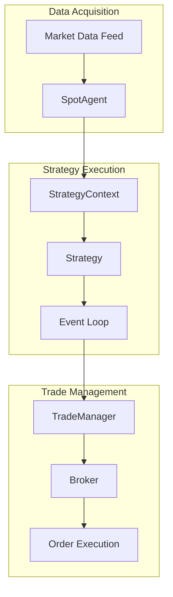
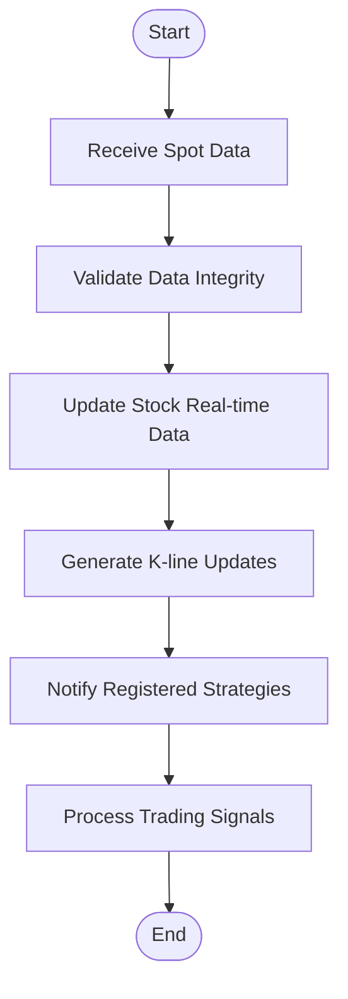
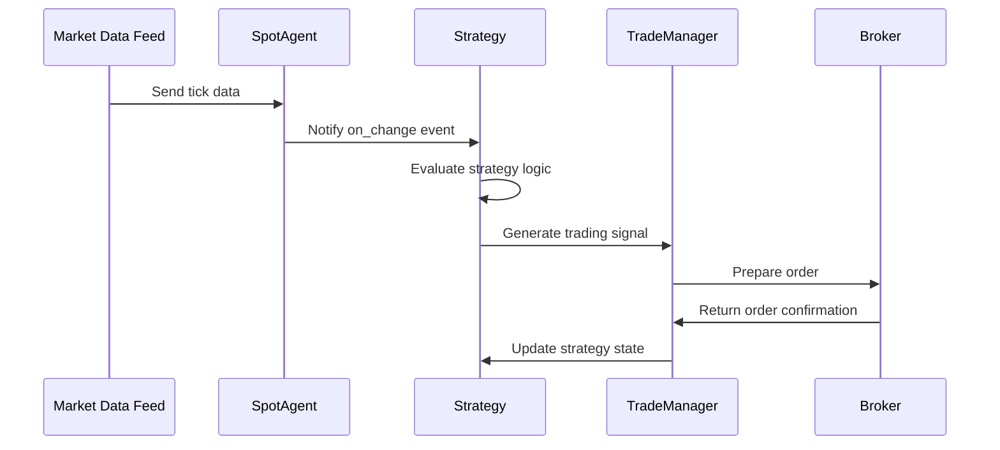
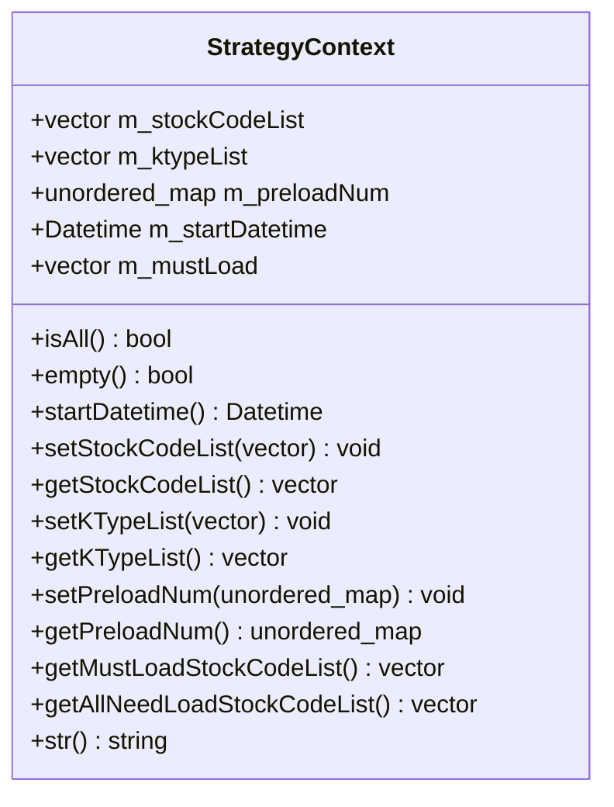
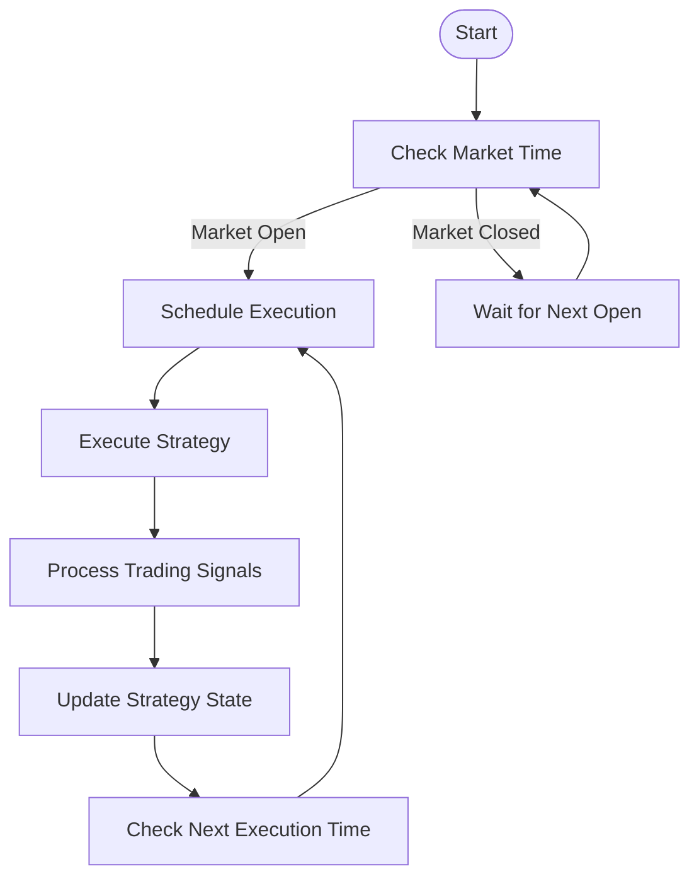
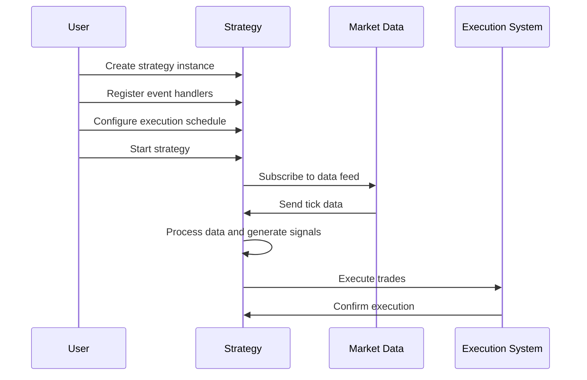

# Real-time Strategy Execution

<cite>
**Referenced Files in This Document**   
- [trade.py](file://hikyuu/trade_manage/trade.py)
- [strategy_demo1.py](file://hikyuu/strategy/strategy_demo1.py)
- [strategy_demo2.py](file://hikyuu/strategy/strategy_demo2.py)
- [strategy_demo3.py](file://hikyuu/strategy/strategy_demo3.py)
- [trade_sys.py](file://hikyuu/trade_sys/trade_sys.py)
- [StrategyContext.h](file://hikyuu_cpp/hikyuu/StrategyContext.h)
- [StrategyContext.cpp](file://hikyuu_cpp/hikyuu/StrategyContext.cpp)
- [scheduler.h](file://hikyuu_cpp/hikyuu/global/schedule/scheduler.h)
- [scheduler.cpp](file://hikyuu_cpp/hikyuu/global/schedule/scheduler.cpp)
- [SpotAgent.h](file://hikyuu_cpp/hikyuu/global/agent/SpotAgent.h)
- [SpotAgent.cpp](file://hikyuu_cpp/hikyuu/global/agent/SpotAgent.cpp)
- [GlobalSpotAgent.cpp](file://hikyuu_cpp/hikyuu/global/GlobalSpotAgent.cpp)
- [start_qmt.py](file://hikyuu/gui/start_qmt.py)
</cite>

## Table of Contents
1. [Introduction](#introduction)
2. [Core Architecture](#core-architecture)
3. [Real-time Data Processing](#real-time-data-processing)
4. [Strategy Execution Workflow](#strategy-execution-workflow)
5. [State Management and Context](#state-management-and-context)
6. [Timing and Event Loop Integration](#timing-and-event-loop-integration)
7. [Configuration and Execution Examples](#configuration-and-execution-examples)
8. [Performance Optimization](#performance-optimization)
9. [Common Challenges](#common-challenges)
10. [Troubleshooting Guide](#troubleshooting-guide)

## Introduction
The Hikyuu real-time strategy execution engine provides a comprehensive framework for processing incoming tick data, executing trading strategies, and generating trading signals. This document details the system's architecture and operation, focusing on how it handles real-time market data to trigger strategy logic and coordinate execution through the trade.py module. The engine is designed to support both high-frequency trading scenarios and longer-term investment strategies, with careful attention to latency-sensitive operations and event ordering.

**Section sources**
- [strategy_demo1.py](file://hikyuu/strategy/strategy_demo1.py#L1-L54)
- [strategy_demo2.py](file://hikyuu/strategy/strategy_demo2.py#L1-L48)

## Core Architecture
The real-time strategy execution engine in Hikyuu is built around a modular architecture that separates concerns between data acquisition, strategy processing, and trade execution. At its core, the system uses a strategy context to manage execution state and coordinate between different components. The architecture is designed to be both flexible and performant, allowing for various trading strategies to be implemented while maintaining low-latency response to market events.

**Diagram sources**
- [StrategyContext.h](file://hikyuu_cpp/hikyuu/StrategyContext.h#L1-L116)
- [SpotAgent.h](file://hikyuu_cpp/hikyuu/global/agent/SpotAgent.h#L67-L103)

## Real-time Data Processing
The system processes incoming tick data through a dedicated spot agent that receives market data and distributes it to registered strategy components. The SpotAgent class handles the reception of real-time market data, managing connections to data sources and ensuring timely delivery of tick information to strategies. When tick data arrives, it triggers the update of relevant stock records and notifies registered strategy components.

The data processing pipeline begins with the reception of flatbuffer-encoded spot data from market data sources. The GlobalSpotAgent manages a thread pool for processing incoming data, ensuring that high-frequency tick updates can be handled efficiently without blocking the main execution thread. For each received spot record, the system updates the corresponding stock's real-time data and generates appropriate K-line updates based on the configured timeframes.

**Diagram sources**
- [GlobalSpotAgent.cpp](file://hikyuu_cpp/hikyuu/global/GlobalSpotAgent.cpp#L161-L192)
- [SpotAgent.cpp](file://hikyuu_cpp/hikyuu/global/agent/SpotAgent.cpp#L1-L47)

## Strategy Execution Workflow
The execution workflow from signal detection to order preparation follows a well-defined sequence of operations. When market data triggers a strategy condition, the system evaluates the strategy logic and generates trading signals. These signals are then processed by the trade management system to prepare orders for execution.

The process begins with the detection of a trading signal, typically triggered by incoming tick data or a scheduled event. The strategy evaluates its current state and market conditions, determining whether to generate a buy or sell signal. Once a signal is generated, it is passed to the trade manager, which coordinates with the broker interface to prepare the order.

**Diagram sources**
- [strategy_demo1.py](file://hikyuu/strategy/strategy_demo1.py#L13-L14)
- [trade.py](file://hikyuu/trade_manage/trade.py#L37-L46)

## State Management and Context
State management in the real-time strategy execution engine is handled through the StrategyContext class, which maintains the execution context for each strategy. The StrategyContext stores information about the securities being traded, the K-line timeframes being monitored, and any preloaded data required for strategy calculations.

The context also manages the lifecycle of the strategy, including startup, execution, and shutdown. It maintains references to the stock code list, K-type list, and preload parameters, ensuring that the strategy has access to all necessary data throughout its execution. The context is designed to be thread-safe, allowing multiple strategies to run concurrently without interfering with each other's state.

**Diagram sources**
- [StrategyContext.h](file://hikyuu_cpp/hikyuu/StrategyContext.h#L20-L116)
- [StrategyContext.cpp](file://hikyuu_cpp/hikyuu/StrategyContext.cpp#L1-L122)

## Timing and Event Loop Integration
The timing system in Hikyuu is built around a global scheduler that manages the execution of scheduled tasks. The scheduler is implemented as a TimerManager singleton, ensuring that all timing operations are coordinated through a single instance. This design prevents timing conflicts and ensures consistent execution of scheduled events across multiple strategies.

Scheduled tasks can be executed at specific times of day or at regular intervals. The system takes into account market opening and closing times, ensuring that trading activities occur only during valid trading hours. For high-frequency strategies, the system supports sub-minute execution intervals, allowing for precise control over trading operations.

**Diagram sources**
- [scheduler.h](file://hikyuu_cpp/hikyuu/global/schedule/scheduler.h#L1-L24)
- [scheduler.cpp](file://hikyuu_cpp/hikyuu/global/schedule/scheduler.cpp#L1-L31)

## Configuration and Execution Examples
Configuring and running real-time strategies in Hikyuu involves several key steps. First, a strategy instance is created with the desired stock codes and K-line timeframes. Then, event handlers are registered to respond to market data updates and other events. Finally, the strategy is started, beginning the real-time execution loop.

The system provides multiple approaches for configuring strategies, from simple function-based handlers to more complex object-oriented implementations. The examples demonstrate how to set up different types of trading strategies, from simple periodic execution to event-driven trading based on market data changes.

**Section sources**
- [strategy_demo1.py](file://hikyuu/strategy/strategy_demo1.py#L35-L54)
- [strategy_demo2.py](file://hikyuu/strategy/strategy_demo2.py#L37-L48)
- [strategy_demo3.py](file://hikyuu/strategy/strategy_demo3.py#L9-L25)

## Performance Optimization
For high-frequency trading scenarios, several performance optimization techniques can be applied. These include minimizing data copying, using efficient data structures, and optimizing the event processing pipeline. The system is designed to handle high volumes of tick data with minimal latency, but careful configuration is required to achieve optimal performance.

Key optimization strategies include preloading necessary data, minimizing the number of registered event handlers, and using appropriate data types for calculations. The system also supports multi-threaded execution, allowing computationally intensive strategies to be processed in parallel without affecting the responsiveness of the main execution loop.

**Section sources**
- [trade_sys.py](file://hikyuu/trade_sys/trade_sys.py#L1-L300)
- [start_qmt.py](file://hikyuu/gui/start_qmt.py#L89-L139)

## Common Challenges
Several common challenges arise when implementing real-time trading strategies. These include event ordering, clock synchronization, and handling missed ticks. The system provides mechanisms to address these challenges, but understanding their implications is crucial for developing robust trading strategies.

Event ordering is particularly important in high-frequency trading, where the sequence of market data updates can significantly impact trading decisions. The system ensures that events are processed in the order they are received, but network latency and other factors can still affect the actual order of events. Clock synchronization between the trading system and market data sources is also critical, as time discrepancies can lead to incorrect trading decisions.

**Section sources**
- [SpotAgent.h](file://hikyuu_cpp/hikyuu/global/agent/SpotAgent.h#L133-L148)
- [GlobalSpotAgent.cpp](file://hikyuu_cpp/hikyuu/global/GlobalSpotAgent.cpp#L80-L102)

## Troubleshooting Guide
When debugging real-time execution issues, several key areas should be examined. First, verify that the market data connection is stable and that tick data is being received consistently. Check the system logs for any error messages related to data reception or processing.

Next, ensure that event handlers are properly registered and that the execution schedule is correctly configured. Test the strategy with historical data to verify that it behaves as expected before deploying it in a live trading environment. Monitor system performance metrics to identify any bottlenecks or resource constraints that could affect execution quality.

**Section sources**
- [strategy_demo1.py](file://hikyuu/strategy/strategy_demo1.py#L13-L19)
- [strategy_demo2.py](file://hikyuu/strategy/strategy_demo2.py#L12-L17)