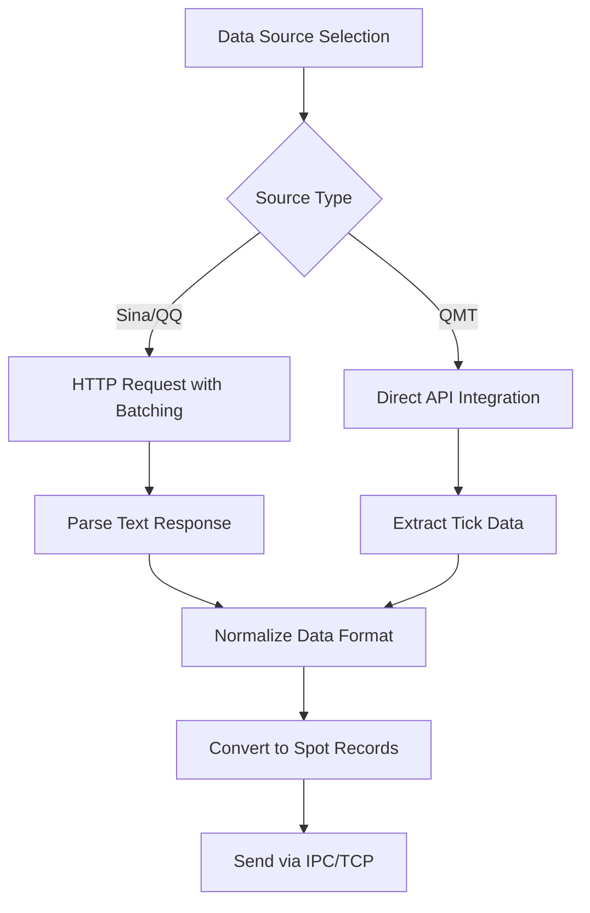
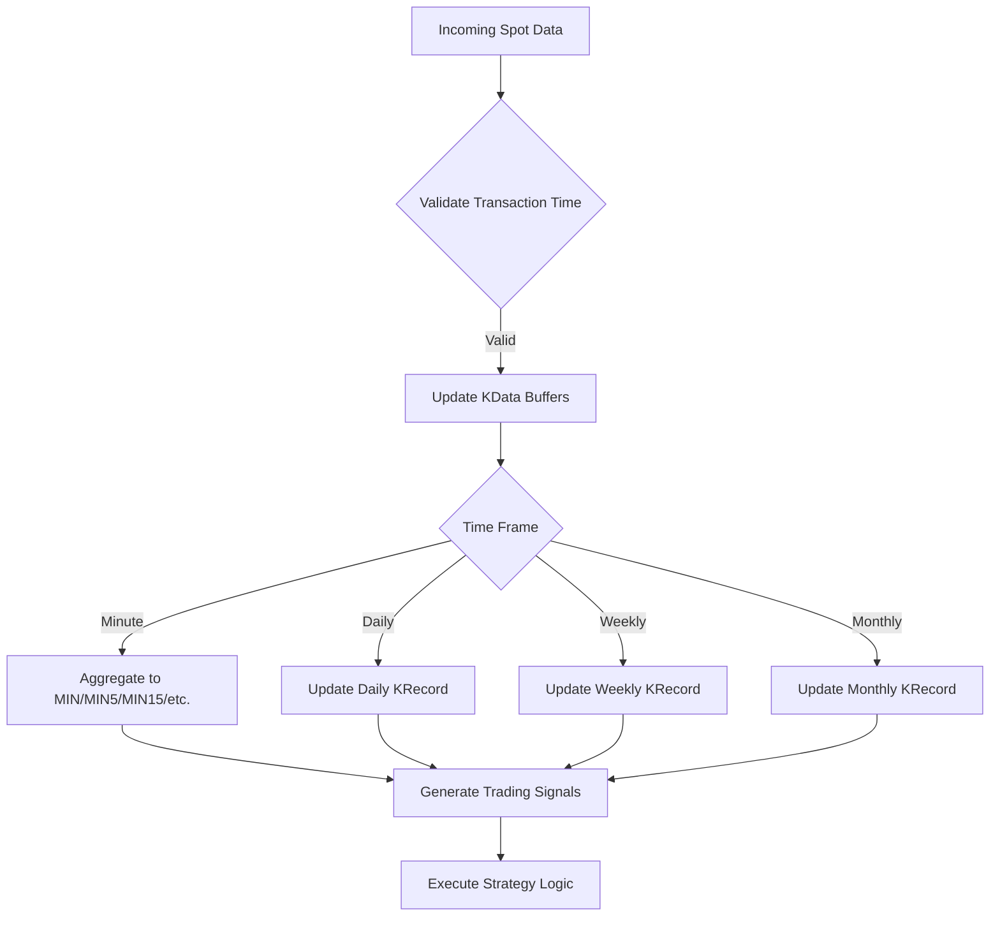
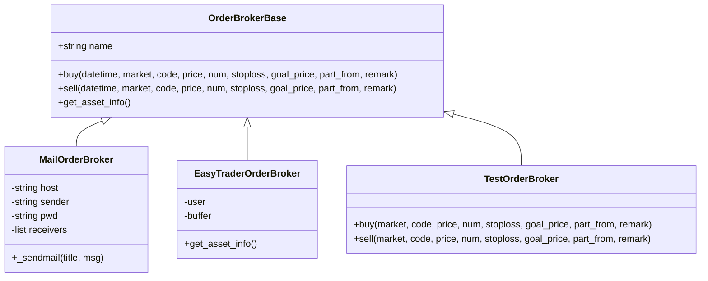
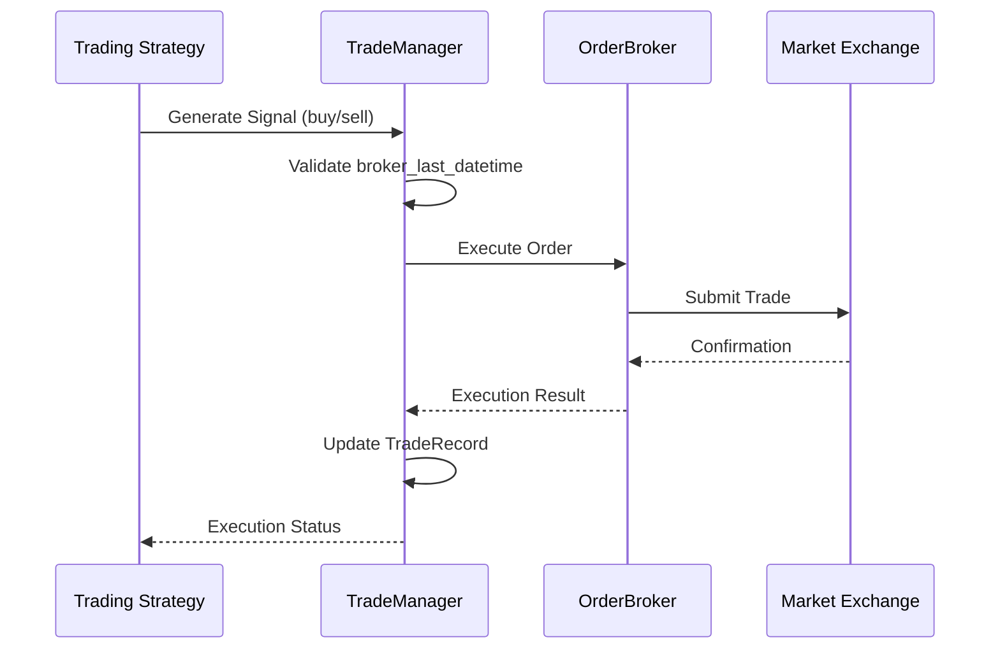
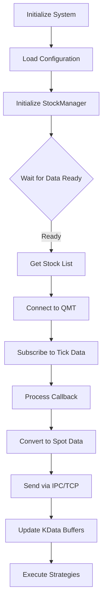

# Real-time Trading

<cite>
**Referenced Files in This Document**   
- [broker.py](file://hikyuu/trade_manage/broker.py)
- [broker_easytrader.py](file://hikyuu/trade_manage/broker_easytrader.py)
- [broker_mail.py](file://hikyuu/trade_manage/broker_mail.py)
- [zh_stock_a_sina_qq.py](file://hikyuu/fetcher/stock/zh_stock_a_sina_qq.py)
- [zh_stock_a_qmt.py](file://hikyuu/fetcher/stock/zh_stock_a_qmt.py)
- [spot_server.py](file://hikyuu/gui/spot_server.py)
- [start_qmt.py](file://hikyuu/gui/start_qmt.py)
- [trade.py](file://hikyuu/trade_manage/trade.py)
- [dataserver.cpp](file://hikyuu_cpp/hikyuu/plugin/dataserver.cpp)
- [GlobalSpotAgent.cpp](file://hikyuu_cpp/hikyuu/global/GlobalSpotAgent.cpp)
- [OrderBrokerBase.h](file://hikyuu_cpp/hikyuu/trade_manage/OrderBrokerBase.h)
- [OrderBrokerBase.cpp](file://hikyuu_cpp/hikyuu/trade_manage/OrderBrokerBase.cpp)
- [009-RealData.ipynb](file://hikyuu/examples/notebook/009-RealData.ipynb)
</cite>

## Table of Contents
1. [Introduction](#introduction)
2. [Real-time Data Fetching System](#real-time-data-fetching-system)
3. [Real-time Strategy Execution Engine](#real-time-strategy-execution-engine)
4. [Broker Integration Options](#broker-integration-options)
5. [Order Management Functionality](#order-management-functionality)
6. [Public Interfaces for Real-time Trading](#public-interfaces-for-real-time-trading)
7. [Practical Implementation Examples](#practical-implementation-examples)
8. [Latency Considerations and Reliability Patterns](#latency-considerations-and-reliability-patterns)

## Introduction
Hikyuu provides a comprehensive real-time trading system that enables automated execution of trading strategies based on live market data. The system integrates multiple data sources, supports various broker execution methods, and offers robust order management capabilities. This document explains the architecture and functionality of Hikyuu's real-time trading capabilities, covering the data fetching system, strategy execution engine, broker integrations, and order management features. The system is designed to support both beginners who need conceptual understanding and experienced developers who require technical details about implementation, latency considerations, and reliability patterns.

## Real-time Data Fetching System
Hikyuu's real-time data fetching system supports multiple market data sources including Sina, QQ, and QMT (Quantitative Trading Platform). The system is implemented in the `fetcher/stock` module, with separate files for each data source: `zh_stock_a_sina_qq.py` for Sina and QQ data, and `zh_stock_a_qmt.py` for QMT data. The system uses concurrent programming with Python's `concurrent.futures` module to efficiently fetch data for multiple stocks simultaneously, batching requests to optimize network usage. For Sina and QQ sources, the system parses text-based responses containing comma-separated or tilde-separated values, extracting comprehensive market data including price information, volume, bid/ask depths, and additional metrics like PE ratio and market value. The QMT integration uses the `xtquant` library to access tick data directly from the trading platform, providing low-latency market data. The system handles data normalization, converting raw responses into a consistent spot data format with standardized field names and units.

**Diagram sources**
- [zh_stock_a_sina_qq.py](file://hikyuu/fetcher/stock/zh_stock_a_sina_qq.py)
- [zh_stock_a_qmt.py](file://hikyuu/fetcher/stock/zh_stock_a_qmt.py)
- [spot_server.py](file://hikyuu/gui/spot_server.py)

**Section sources**
- [zh_stock_a_sina_qq.py](file://hikyuu/fetcher/stock/zh_stock_a_sina_qq.py#L1-L186)
- [zh_stock_a_qmt.py](file://hikyuu/fetcher/stock/zh_stock_a_qmt.py#L1-L58)

## Real-time Strategy Execution Engine
The real-time strategy execution engine in Hikyuu processes incoming market data to generate trading signals and execute strategies. The engine is built around the `GlobalSpotAgent` class, which manages the processing of real-time spot data and updates various time frame K-data (minute, day, week, etc.) accordingly. When spot data is received, the agent triggers appropriate update functions based on the preloaded time frames specified in the configuration. For minute data, the system aggregates spot data into K-line bars of various durations (1min, 5min, 15min, etc.), calculating OHLC values and volume/amount for each period. For daily and higher time frames, the system similarly aggregates data while respecting market session boundaries. The engine ensures data consistency by validating transaction times and handling special cases like market closures. The processed data is then made available to trading strategies, which can analyze the updated K-lines to generate buy/sell signals based on their programmed logic.

**Diagram sources**
- [GlobalSpotAgent.cpp](file://hikyuu_cpp/hikyuu/global/GlobalSpotAgent.cpp#L38-L166)
- [dataserver.cpp](file://hikyuu_cpp/hikyuu/plugin/dataserver.cpp#L77-L82)

**Section sources**
- [GlobalSpotAgent.cpp](file://hikyuu_cpp/hikyuu/global/GlobalSpotAgent.cpp#L1-L264)
- [dataserver.cpp](file://hikyuu_cpp/hikyuu/plugin/dataserver.cpp#L1-L168)

## Broker Integration Options
Hikyuu supports multiple broker integration options for executing trades, including easytrader and mail-based execution. The system uses an abstract `OrderBrokerBase` class as the foundation for all broker implementations, defining the interface for buy, sell, and asset information retrieval operations. The `broker_mail.py` module implements a mail-based order broker that sends email notifications when trading signals are generated, allowing users to manually execute trades based on these alerts. This implementation uses Python's `smtplib` and email modules to send formatted messages to configured recipients. The `broker_easytrader.py` module provides integration with the easytrader library, enabling direct execution of trades through supported brokerage platforms like Hua Tai. This broker maintains a buffer of pending orders and can retrieve current asset information including cash balance and position details. Additionally, Hikyuu includes a `TestOrderBroker` for simulation purposes that simply prints trade information without executing actual orders.

**Diagram sources**
- [broker.py](file://hikyuu/trade_manage/broker.py#L37-L95)
- [broker_mail.py](file://hikyuu/trade_manage/broker_mail.py#L37-L102)
- [broker_easytrader.py](file://hikyuu/trade_manage/broker_easytrader.py#L10-L64)

**Section sources**
- [broker.py](file://hikyuu/trade_manage/broker.py#L1-L96)
- [broker_easytrader.py](file://hikyuu/trade_manage/broker_easytrader.py#L1-L64)
- [broker_mail.py](file://hikyuu/trade_manage/broker_mail.py#L1-L102)

## Order Management Functionality
Hikyuu provides comprehensive order management functionality for submitting, monitoring, and canceling trades through its `TradeManager` and associated components. The system uses the `OrderBrokerBase` class hierarchy to handle order execution, with the `buy` and `sell` methods providing the primary interface for trade submission. The system includes safeguards to prevent erroneous order execution during backtesting by using the `broker_last_datetime` property, which specifies the earliest time when actual broker operations should be allowed. This prevents historical signals from triggering real trades. The `TradeRecord` and `PositionRecord` classes track executed trades and current positions, with methods to convert this data to numpy arrays or pandas DataFrames for analysis. The system supports multiple order brokers simultaneously, allowing different brokers to receive the same trading signals for redundancy or different execution strategies. Error handling is implemented at multiple levels, with try-catch blocks in the C++ implementation ensuring that broker failures don't crash the entire trading system.

**Diagram sources**
- [OrderBrokerBase.cpp](file://hikyuu_cpp/hikyuu/trade_manage/OrderBrokerBase.cpp#L55-L97)
- [trade.py](file://hikyuu/trade_manage/trade.py#L37-L46)
- [OrderBrokerBase.h](file://hikyuu_cpp/hikyuu/trade_manage/OrderBrokerBase.h#L31-L59)

**Section sources**
- [OrderBrokerBase.cpp](file://hikyuu_cpp/hikyuu/trade_manage/OrderBrokerBase.cpp#L1-L97)
- [OrderBrokerBase.h](file://hikyuu_cpp/hikyuu/trade_manage/OrderBrokerBase.h#L1-L214)
- [trade.py](file://hikyuu/trade_manage/trade.py#L1-L55)

## Public Interfaces for Real-time Trading
Hikyuu exposes several public interfaces for real-time trading operations, primarily through the `OrderBrokerBase` class and its derived implementations. The core interface methods include `buy` and `sell`, which accept parameters such as market identifier, security code, price, quantity, stop-loss price, goal price, signal source, and remarks. The `get_asset_info` method provides a standardized way to retrieve current account information including cash balance and position details. The `crtOB` function serves as a factory method to create order broker wrapper instances, simplifying the instantiation process. For data fetching, the `get_spot` function is the primary interface, accepting a stock list, data source specification, proxy usage flag, and optional batch processing function. The system also provides configuration interfaces through the `startSpotAgent` and `stopSpotAgent` functions, allowing programmatic control of the real-time data collection process. These interfaces are designed to be both Pythonic and consistent with the underlying C++ implementation, providing a seamless experience for users.

**Table of Public Interfaces**

| Interface | Parameters | Return Type | Description |
|---------|-----------|------------|-------------|
| buy | datetime, market, code, price, num, stoploss, goal_price, part_from, remark | None | Execute buy order with specified parameters |
| sell | datetime, market, code, price, num, stoploss, goal_price, part_from, remark | None | Execute sell order with specified parameters |
| get_asset_info | None | string (JSON) | Retrieve current asset information including positions and cash |
| get_spot | stocklist, source, use_proxy, batch_func | list of spot records | Fetch real-time market data for specified stocks from given source |
| crtOB | broker, name | OrderBrokerWrap | Create order broker wrapper instance |
| startSpotAgent | print, worker_num, addr | None | Start the real-time spot data collection agent |
| stopSpotAgent | None | None | Stop the real-time spot data collection agent |

**Section sources**
- [broker.py](file://hikyuu/trade_manage/broker.py#L49-L61)
- [zh_stock_a_sina_qq.py](file://hikyuu/fetcher/stock/zh_stock_a_sina_qq.py#L137-L180)
- [zh_stock_a_qmt.py](file://hikyuu/fetcher/stock/zh_stock_a_qmt.py#L42-L48)
- [GlobalSpotAgent.cpp](file://hikyuu_cpp/hikyuu/global/GlobalSpotAgent.cpp#L168-L264)

## Practical Implementation Examples
Practical implementation of real-time trading in Hikyuu involves setting up data feeds and connecting to broker APIs as demonstrated in the provided code examples. The `start_qmt.py` script shows how to initialize the system with configuration parameters, load stock data, and establish a connection to the QMT platform for real-time data streaming. The script configures the system to subscribe to tick data for all valid stocks, processing updates through a callback function that converts QMT tick data to Hikyuu's spot format and broadcasts it via IPC/TCP. The `spot_server.py` module demonstrates how to collect and distribute real-time data using the pynng library for message passing, with configurable collection intervals and trading phases. The example notebook `009-RealData.ipynb` illustrates the use of the `realtime_update` function to refresh market data from Sina or QQ sources, highlighting the importance of respecting API rate limits to avoid IP blocking. These examples provide templates for implementing custom real-time trading systems, showing how to integrate data collection, strategy execution, and order management components.

**Diagram sources**
- [start_qmt.py](file://hikyuu/gui/start_qmt.py#L22-L140)
- [spot_server.py](file://hikyuu/gui/spot_server.py#L228-L307)

**Section sources**
- [start_qmt.py](file://hikyuu/gui/start_qmt.py#L1-L140)
- [spot_server.py](file://hikyuu/gui/spot_server.py#L1-L327)
- [009-RealData.ipynb](file://hikyuu/examples/notebook/009-RealData.ipynb#L1-L111)

## Latency Considerations and Reliability Patterns
Hikyuu's real-time trading system incorporates several latency considerations and reliability patterns to ensure robust operation. The system uses FlatBuffers for efficient serialization of spot data, minimizing serialization overhead when broadcasting market updates. The pynng library provides high-performance message passing with IPC and TCP transports, allowing low-latency communication between data collection and strategy execution components. The system implements error handling at multiple levels, with try-catch blocks in C++ code and exception handling in Python wrappers to prevent crashes from transient issues. For reliability, the system includes a `broker_last_datetime` mechanism that prevents historical signals from triggering real trades, a critical safeguard during strategy development and testing. The data fetching system implements batching and rate limiting to avoid overwhelming data sources, with configurable intervals between requests. The architecture separates data collection from strategy execution, allowing each component to operate independently and be scaled or restarted without affecting the other. Additionally, the system supports multiple data sources and broker integrations, providing redundancy options to maintain operation if one source or broker becomes unavailable.

**Section sources**
- [spot_server.py](file://hikyuu/gui/spot_server.py#L1-L327)
- [GlobalSpotAgent.cpp](file://hikyuu_cpp/hikyuu/global/GlobalSpotAgent.cpp#L1-L264)
- [OrderBrokerBase.cpp](file://hikyuu_cpp/hikyuu/trade_manage/OrderBrokerBase.cpp#L1-L97)
- [dataserver.cpp](file://hikyuu_cpp/hikyuu/plugin/dataserver.cpp#L1-L168)