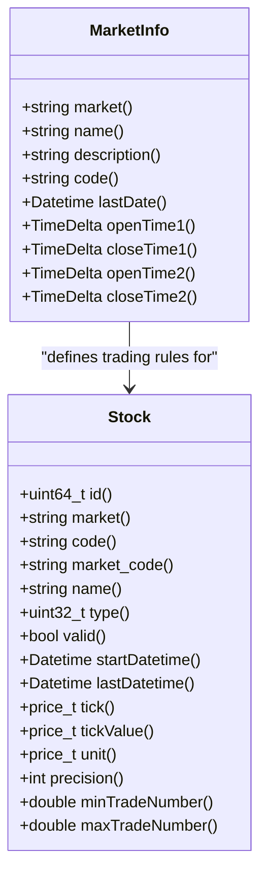

# Stock and Market Data

<cite>
**Referenced Files in This Document**   
- [Stock.h](file://hikyuu_cpp/hikyuu/Stock.h)
- [MarketInfo.h](file://hikyuu_cpp/hikyuu/MarketInfo.h)
- [KData.h](file://hikyuu_cpp/hikyuu/KData.h)
- [StockManager.h](file://hikyuu_cpp/hikyuu/StockManager.h)
- [KQuery.h](file://hikyuu_cpp/hikyuu/KQuery.h)
- [KRecord.h](file://hikyuu_cpp/hikyuu/KRecord.h)
- [Stock.cpp](file://hikyuu_cpp/hikyuu/Stock.cpp)
- [KData.cpp](file://hikyuu_cpp/hikyuu/KData.cpp)
- [_Stock.cpp](file://hikyuu_pywrap/_Stock.cpp)
- [_KData.cpp](file://hikyuu_pywrap/_KData.cpp)
- [002-HowToGetStock.ipynb](file://hikyuu/examples/notebook/002-HowToGetStock.ipynb)
- [003-HowToGetKDataAndDraw.ipynb](file://hikyuu/examples/notebook/003-HowToGetKDataAndDraw.ipynb)
</cite>

## Table of Contents
1. [Introduction](#introduction)
2. [Stock Class and Financial Instrument Representation](#stock-class-and-financial-instrument-representation)
3. [MarketInfo and Exchange-Specific Details](#marketinfo-and-exchange-specific-details)
4. [KData System for Time Series Management](#kdata-system-for-time-series-management)
5. [Data Structures for Market Metrics](#data-structures-for-market-metrics)
6. [Market Sessions, Trading Days, and Holiday Calendars](#market-sessions-trading-days-and-holiday-calendars)
7. [Relationship Between StockManager, Stock, and KData](#relationship-between-stockmanager-stock-and-kdata)
8. [Public Interfaces for Stock and KData Operations](#public-interfaces-for-stock-and-kdata-operations)
9. [Practical Examples and Usage Patterns](#practical-examples-and-usage-patterns)
10. [Performance Optimizations and Memory Layout](#performance-optimizations-and-memory-layout)

## Introduction
The hikyuu framework provides a comprehensive system for handling stock and market data, designed to support quantitative analysis, algorithmic trading, and financial research. At its core, the system revolves around three fundamental components: Stock, MarketInfo, and KData, which work together through the StockManager to provide efficient access to financial instrument data. This documentation explains the architecture and functionality of this data handling system, covering both conceptual overviews for beginners and technical details for experienced developers. The system is designed to efficiently manage various types of market data including daily, minute, and tick-level information, while providing sophisticated mechanisms for data retrieval, caching, and performance optimization.

## Stock Class and Financial Instrument Representation

The Stock class serves as the central representation of financial instruments within the hikyuu framework, encapsulating all essential information about a security. Each Stock instance contains comprehensive metadata including market identifier, security code, name, type, validity status, and temporal boundaries (start and end dates). The class also maintains critical trading parameters such as tick size, tick value, price precision, and minimum/maximum trade quantities, which are essential for accurate trading simulations and risk calculations.

Stock objects are designed to be lightweight handles that reference underlying data through shared pointers, enabling efficient memory usage when multiple components need to access the same security. The class provides methods to retrieve various types of historical data, including K-line data, time series, transaction records, and financial information. It also supports the concept of "weight" information (dividends, splits, and other corporate actions) which is crucial for proper historical data adjustment.

The Stock class implements comparison operators and hash functions, allowing instances to be used as keys in associative containers. This design facilitates efficient lookups and indexing within the larger data management system. Additionally, the class supports both direct property access and method-based operations, providing flexibility in how developers interact with security data.

**Section sources**
- [Stock.h](file://hikyuu_cpp/hikyuu/Stock.h#L38-L380)
- [Stock.cpp](file://hikyuu_cpp/hikyuu/Stock.cpp#L1-L200)

## MarketInfo and Exchange-Specific Details

The MarketInfo class encapsulates exchange-specific details for financial markets, providing essential information that governs trading behavior and data interpretation. Each MarketInfo instance contains the market identifier, name, description, and crucially, the trading schedule defined by two time periods (morning and afternoon sessions). This information is vital for determining valid trading times and processing time-series data correctly.

The class also specifies a representative index code for each market, which is used to determine the market's trading calendar. This design allows the system to accurately identify trading days by referencing the trading activity of the primary market index. The MarketInfo structure includes the market's last update date, which helps in determining data freshness and synchronization status.

MarketInfo objects are managed centrally by the StockManager and can be retrieved by market identifier. This centralized approach ensures consistency across the system and prevents duplication of market configuration data. The trading time information stored in MarketInfo is used by various components, including data loaders, trading simulators, and real-time processing systems, to validate timestamps and determine market state.



**Diagram sources**
- [MarketInfo.h](file://hikyuu_cpp/hikyuu/MarketInfo.h#L20-L139)
- [Stock.h](file://hikyuu_cpp/hikyuu/Stock.h#L38-L380)

## KData System for Time Series Management

The KData system in hikyuu provides a sophisticated framework for managing time series data across multiple frequencies, including daily, minute, and tick-level data. The system supports various K-line types such as MIN, MIN5, MIN15, MIN30, MIN60, HOUR2, DAY, WEEK, MONTH, QUARTER, HALFYEAR, and YEAR, allowing for comprehensive analysis across different timeframes. The KQuery class serves as the primary mechanism for specifying data retrieval parameters, supporting both index-based and date-based queries with configurable复权 (recovery) types.

The KData implementation uses a strategy pattern with different implementation classes (KDataImp) to handle various data access scenarios efficiently. When data is cached and no复权 is required, the system uses KDataSharedBufferImp to provide direct access to the underlying data buffer, minimizing memory overhead. For other cases, appropriate implementation classes are instantiated to handle data retrieval,复权 calculations, and filtering.

The system supports multiple复权 types including NO_RECOVER (no adjustment), FORWARD (forward复权), BACKWARD (backward复权), EQUAL_FORWARD (proportional forward复权), and EQUAL_BACKWARD (proportional backward复权), enabling accurate historical price analysis that accounts for corporate actions. The KData class provides convenient access to price components through Indicator objects (open, high, low, close, vol, amo), facilitating technical analysis and indicator calculations.

```mermaid
classDiagram
class KQuery {
+enum QueryType { INDEX, DATE }
+enum RecoverType { NO_RECOVER, FORWARD, BACKWARD, EQUAL_FORWARD, EQUAL_BACKWARD }
+static const string MIN
+static const string MIN5
+static const string MIN15
+static const string MIN30
+static const string MIN60
+static const string HOUR2
+static const string DAY
+static const string WEEK
+static const string MONTH
+static const string QUARTER
+static const string HALFYEAR
+static const string YEAR
+KQuery(int64_t start, int64_t end, const KType& dataType, RecoverType recoverType, QueryType queryType)
+KQuery(Datetime start, Datetime end, const KType& ktype, RecoverType recoverType)
+int64_t start()
+int64_t end()
+Datetime startDatetime()
+Datetime endDatetime()
+QueryType queryType()
+const string& kType()
+RecoverType recoverType()
}
class KData {
+size_t size()
+bool empty()
+DatetimeList getDatetimeList()
+const KRecord& getKRecord(size_t pos)
+const KRecord& getKRecord(Datetime datetime)
+const KRecord& operator[](size_t pos)
+const KRecord& operator[](Datetime datetime)
+const KRecord& front()
+const KRecord& back()
+KData getKData(const Datetime& start, const Datetime& end)
+KData getKData(const KQuery : : KType& ktype)
+KData getKData(int64_t start, int64_t end)
+size_t getPos(const Datetime& datetime)
+size_t getPosInStock(Datetime datetime)
+const KQuery& getQuery()
+const Stock& getStock()
+size_t startPos()
+size_t lastPos()
+size_t endPos()
+void tocsv(const string& filename)
+Indicator open()
+Indicator high()
+Indicator close()
+Indicator low()
+Indicator vol()
+Indicator amo()
}
class KRecord {
+Datetime datetime
+price_t openPrice
+price_t highPrice
+price_t lowPrice
+price_t closePrice
+price_t transAmount
+price_t transCount
}
KQuery --> KData : "specifies retrieval parameters"
KData --> KRecord : "contains collection of"
Stock --> KData : "provides access to via getKData()"
```

**Diagram sources**
- [KQuery.h](file://hikyuu_cpp/hikyuu/KQuery.h#L20-L290)
- [KData.h](file://hikyuu_cpp/hikyuu/KData.h#L22-L346)
- [KRecord.h](file://hikyuu_cpp/hikyuu/KRecord.h#L20-L98)

## Data Structures for Market Metrics

The hikyuu framework employs carefully designed data structures to efficiently store and access market metrics. The fundamental unit is the KRecord structure, which represents a single K-line bar containing timestamp, open, high, low, close prices, transaction amount, and transaction count. This compact structure enables efficient memory usage while providing all essential information for technical analysis.

For time series data, the system uses KRecordList (a vector of KRecord objects) as the primary container, allowing for sequential access and efficient iteration. The KData class wraps this container with additional metadata and access methods, providing a high-level interface for data manipulation. The system distinguishes between raw KRecord data and the higher-level KData representation, which includes query context and stock association.

Price values are stored as double-precision floating-point numbers (price_t) to maintain accuracy across calculations, while timestamps use a specialized Datetime class that supports high-resolution time operations. The system also employs specialized containers like DatetimeList, PriceList, and StringList for homogeneous data collections, optimizing memory layout and access patterns for each data type.

The Stock class maintains separate data structures for different K-line types through a map (pKData) that associates KType strings with KRecordList pointers, enabling efficient access to specific timeframes. This design allows the system to load and cache different frequencies independently, optimizing memory usage based on application requirements.

**Section sources**
- [KRecord.h](file://hikyuu_cpp/hikyuu/KRecord.h#L20-L98)
- [DataType.h](file://hikyuu_cpp/hikyuu/DataType.h#L135-L152)
- [Stock.h](file://hikyuu_cpp/hikyuu/Stock.h#L314-L316)

## Market Sessions, Trading Days, and Holiday Calendars

The hikyuu system provides comprehensive support for market sessions, trading days, and holiday calendars through integrated functionality in the StockManager class. Market sessions are defined in the MarketInfo structure, which specifies two trading periods (morning and afternoon) for each market. This information is used by the isTransactionTime method in the Stock class to determine if a given timestamp falls within valid trading hours.

Trading day calendars are managed through the getTradingCalendar method, which returns a list of valid trading dates within a specified range. The system uses market-specific index data to determine the trading calendar, ensuring accuracy across different exchanges. The isHoliday method provides direct holiday detection, returning true for dates that are non-trading days (including weekends and market-specific holidays).

The system maintains a centralized collection of holidays (m_holidays) within the StockManager, which is loaded during initialization. This design ensures consistent holiday handling across all components of the framework. The trading calendar functionality supports various query types through KQuery objects, allowing applications to retrieve trading days by index range or date range.

These features are essential for accurate backtesting and trading simulations, as they ensure that trading activities are only processed during valid market hours and on trading days. The system's design allows for easy extension to support additional markets by simply adding new MarketInfo configurations and holiday calendars.

**Section sources**
- [MarketInfo.h](file://hikyuu_cpp/hikyuu/MarketInfo.h#L71-L89)
- [StockManager.h](file://hikyuu_cpp/hikyuu/StockManager.h#L176-L200)
- [Stock.h](file://hikyuu_cpp/hikyuu/Stock.h#L223-L224)

## Relationship Between StockManager, Stock, and KData

The relationship between StockManager, Stock, and KData forms the core data model of the hikyuu framework, creating a hierarchical structure for efficient data access and management. The StockManager acts as a singleton container and factory for all Stock objects, maintaining a central registry (m_stockDict) that maps market-code identifiers to Stock instances. This design ensures that each security is represented by a single Stock object throughout the application, promoting consistency and reducing memory overhead.

Stock objects serve as the primary interface for accessing market data, providing methods to retrieve KData instances through the getKData method. Each Stock maintains references to its associated K-line data through internal data structures (pKData map) and can manage data caching through methods like loadKDataToBuffer and releaseKDataBuffer. The Stock class also maintains a reference to its KData driver (m_kdataDriver), which handles the actual data retrieval from underlying storage.

KData objects represent specific time series datasets, created based on queries issued through Stock objects. They maintain references back to their parent Stock and the original query parameters, enabling context-aware operations and efficient data slicing. The system uses shared pointers and implementation patterns to minimize memory duplication, with KDataSharedBufferImp allowing multiple KData instances to share the same underlying data buffer when appropriate.

This three-tier architecture (StockManager → Stock → KData) provides a clean separation of concerns: StockManager handles object lifecycle and global state, Stock manages security-specific metadata and data access, and KData encapsulates time series data and operations.

```mermaid
classDiagram
class StockManager {
+static StockManager& instance()
+void init(const Parameter&, const Parameter&, const Parameter&, const Parameter&, const Parameter&, const StrategyContext&)
+void reload()
+size_t size()
+bool dataReady()
+Stock getStock(const string& querystr)
+Stock operator[](const string&)
+StockList getStockList(function<bool(const Stock&)>&&)
+MarketInfo getMarketInfo(const string& market)
+Stock getMarketStock(const string& market)
+StockTypeInfo getStockTypeInfo(uint32_t type)
+vector<StockTypeInfo> getStockTypeInfoList()
+StringList getAllMarket()
+StringList getAllCategory()
+Block getBlock(const string& category, const string& name)
+void saveBlock(const Block& blk)
+void removeBlock(const string& category, const string& name)
+BlockList getBlockList(const string& category)
+BlockList getBlockList()
+BlockList getStockBelongs(const Stock& stk, const string& category)
+DatetimeList getTradingCalendar(const KQuery& query, const string& market)
+const ZhBond10List& getZhBond10()
+bool isHoliday(const Datetime& d)
+bool isTradingHours(const Datetime& d, const string& market)
+const string& getHistoryFinanceFieldName(size_t ix)
+size_t getHistoryFinanceFieldIndex(const string& name)
+vector<pair<size_t, string>> getHistoryFinanceAllFields()
+vector<HistoryFinanceInfo> getHistoryFinance(const Stock& stk, Datetime start, Datetime end)
+bool addStock(const Stock& stock)
+void removeStock(const string& market_code)
+Stock addTempCsvStock(const string& code, const string& day_filename, const string& min_filename, price_t tick, price_t tickValue, int precision, size_t minTradeNumber, size_t maxTradeNumber)
+void removeTempCsvStock(const string& code)
+thread : : id thread_id()
+ThreadPool* getLoadTaskGroup()
+void setPluginPath(const string& path)
+const string& getPluginPath()
+template <typename PluginInterfaceT> PluginInterfaceT* getPlugin(const string& pluginname)
+void setLanguagePath(const string& path)
+void cancelLoad()
}
class Stock {
+uint64_t id()
+string market()
+string code()
+string market_code()
+string name()
+uint32_t type()
+bool valid()
+Datetime startDatetime()
+Datetime lastDatetime()
+price_t tick()
+price_t tickValue()
+price_t unit()
+int precision()
+double minTradeNumber()
+double maxTradeNumber()
+double maxTradeNumber()
+StockWeightList getWeight(const Datetime& start, const Datetime& end)
+size_t getCount(KQuery : : KType dataType)
+price_t getMarketValue(const Datetime&, KQuery : : KType)
+bool getIndexRange(const KQuery& query, size_t& out_start, size_t& out_end)
+KRecord getKRecord(size_t pos, const KQuery : : KType& dataType)
+KRecord getKRecord(const Datetime&, const KQuery : : KType& ktype)
+KData getKData(const KQuery&)
+KRecordList getKRecordList(const KQuery& query)
+DatetimeList getDatetimeList(const KQuery& query)
+TimeLineList getTimeLineList(const KQuery& query)
+TransList getTransList(const KQuery& query)
+Parameter getFinanceInfo()
+vector<Block> getBelongToBlockList(const string& category)
+const vector<HistoryFinanceInfo>& getHistoryFinance()
+DatetimeList getTradingCalendar(const KQuery& query)
+void setWeightList(const StockWeightList&)
+bool isTransactionTime(Datetime time)
+void setKDataDriver(const KDataDriverConnectPoolPtr& kdataDriver)
+KDataDriverConnectPoolPtr getKDataDirver()
+void loadKDataToBuffer(KQuery : : KType) const
+void releaseKDataBuffer(KQuery : : KType) const
+bool isBuffer(KQuery : : KType) const
+bool isPreload(KQuery : : KType ktype) const
+bool isNull() const
+void realtimeUpdate(KRecord, const KQuery : : KType& ktype)
+Datetime getLastUpdateTime(const KQuery : : KType& ktype)
+void setKRecordList(const KRecordList& ks, const KQuery : : KType& ktype)
+void setKRecordList(KRecordList&& ks, const KQuery : : KType& ktype)
+string toString() const
}
class KData {
+size_t size()
+bool empty()
+DatetimeList getDatetimeList()
+const KRecord& getKRecord(size_t pos)
+const KRecord& getKRecord(Datetime datetime)
+const KRecord& operator[](size_t pos)
+const KRecord& operator[](Datetime datetime)
+const KRecord& front()
+const KRecord& back()
+KData getKData(const Datetime& start, const Datetime& end)
+KData getKData(const KQuery : : KType& ktype)
+KData getKData(int64_t start, int64_t end)
+size_t getPos(const Datetime& datetime)
+size_t getPosInStock(Datetime datetime)
+const KQuery& getQuery()
+const Stock& getStock()
+size_t startPos()
+size_t lastPos()
+size_t endPos()
+void tocsv(const string& filename)
+Indicator open()
+Indicator high()
+Indicator close()
+Indicator low()
+Indicator vol()
+Indicator amo()
}
StockManager "1" --> "*" Stock : "manages and provides access to"
Stock "1" --> "*" KData : "provides access to via getKData()"
```



**Diagram sources**
- [StockManager.h](file://hikyuu_cpp/hikyuu/StockManager.h#L29-L429)
- [Stock.h](file://hikyuu_cpp/hikyuu/Stock.h#L38-L380)
- [KData.h](file://hikyuu_cpp/hikyuu/KData.h#L22-L346)

## Public Interfaces for Stock and KData Operations

The hikyuu framework exposes a comprehensive set of public interfaces for stock and KData operations through both C++ and Python APIs. The Stock class provides methods for retrieving various types of market data, including getKData for K-line data, getTimeLineList for tick-level time series, and getTransList for transaction records. These methods accept KQuery objects that specify the desired data range, frequency, and复权 type.

For KData operations, the interface includes methods for data access (getKRecord, operator[]), position lookup (getPos, getPosInStock), and data slicing (getKData with date or index parameters). The class also provides convenient access to price components through properties (open, high, low, close, vol, amo) that return Indicator objects for technical analysis.

The Python wrapper (_Stock.cpp and _KData.cpp) exposes these interfaces with Python-friendly naming conventions and documentation. Methods are exposed with appropriate argument types and return value policies, ensuring seamless integration with Python code. The wrapper also implements Python special methods (__str__, __repr__, __len__, __getitem__) to provide a natural Pythonic interface.

Additional utility functions like getKData (free function) provide alternative access patterns, allowing developers to retrieve KData directly with a market-code string and query parameters. The system also supports direct CSV export through the tocsv method, facilitating data sharing and external analysis.

**Section sources**
- [Stock.h](file://hikyuu_cpp/hikyuu/Stock.h#L173-L190)
- [KData.h](file://hikyuu_cpp/hikyuu/KData.h#L42-L130)
- [_Stock.cpp](file://hikyuu_pywrap/_Stock.cpp#L21-L200)
- [_KData.cpp](file://hikyuu_pywrap/_KData.cpp#L18-L200)

## Practical Examples and Usage Patterns

Practical usage of the hikyuu stock and market data system follows several common patterns demonstrated in the example notebooks. To retrieve a stock object, developers can use either the StockManager instance (sm['sh000001']) or the getStock function. Once a Stock object is obtained, K-line data can be retrieved using the getKData method with a KQuery object specifying the desired parameters.

For example, to retrieve daily data for a specific date range:
```python
s = sm['sh000001']
query = KQueryByDate(Datetime(20200101), Datetime(20201231), KQuery.DAY)
kdata = s.getKData(query)
```

Alternatively, the convenience function getKData can be used directly:
```python
kdata = getKData('sh000001', Datetime(20200101), Datetime(20201231), KQuery.DAY)
```

The system supports various query patterns, including index-based queries, date-based queries, and right-open intervals (unspecified end date). KData objects can be sliced using index ranges or date ranges, and individual records can be accessed by position or datetime. The framework also supports iteration over KData objects, enabling processing of time series data in a streaming fashion.

For performance-critical applications, developers can preload data into memory using the loadKDataToBuffer method, which caches K-line data for faster subsequent access. Temporary stocks can be created from CSV files using addTempCsvStock, facilitating testing with custom datasets.

**Section sources**
- [002-HowToGetStock.ipynb](file://hikyuu/examples/notebook/002-HowToGetStock.ipynb#L1-L200)
- [003-HowToGetKDataAndDraw.ipynb](file://hikyuu/examples/notebook/003-HowToGetKDataAndDraw.ipynb)
- [KData.cpp](file://hikyuu_cpp/hikyuu/KData.cpp#L47-L64)

## Performance Optimizations and Memory Layout

The hikyuu framework incorporates several performance optimizations and efficient memory layout strategies to handle large volumes of market data. The system uses shared pointers and copy-on-write semantics to minimize memory duplication, with Stock objects sharing a common Data structure through m_data. This design reduces memory overhead when multiple components reference the same security.

For K-line data, the system employs a hybrid caching strategy with both shared and private buffers. When data is cached and no复权 is required, KDataSharedBufferImp provides direct access to the underlying KRecordList, eliminating data copying. For other cases, KDataPrivatedBufferImp creates private copies only when necessary, optimizing memory usage.

The framework uses unordered_map and vector containers for optimal cache performance, with KRecordList (vector<KRecord>) providing contiguous memory layout for efficient iteration. The system also implements lazy loading and asynchronous data loading through ThreadPool, preventing blocking operations during initialization.

Memory layout is optimized through careful struct design, with the KRecord structure packed to minimize padding and maximize cache efficiency. The system also uses atomic operations and shared_mutex for thread-safe access to shared data structures, enabling concurrent access from multiple threads without excessive locking overhead.

Additional optimizations include precomputed复权 calculations, efficient date arithmetic, and specialized algorithms for common operations like position lookup and range queries. The system's design allows for further optimization through custom data drivers and plugins, enabling integration with high-performance storage systems.

**Section sources**
- [Stock.h](file://hikyuu_cpp/hikyuu/Stock.h#L284-L286)
- [KData.h](file://hikyuu_cpp/hikyuu/KData.h#L200-L201)
- [Stock.cpp](file://hikyuu_cpp/hikyuu/Stock.cpp#L52-L133)
- [KData.cpp](file://hikyuu_cpp/hikyuu/KData.cpp#L47-L64)
- [StockManager.h](file://hikyuu_cpp/hikyuu/StockManager.h#L354-L355)