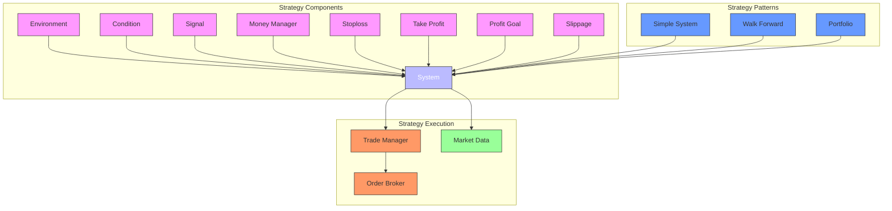
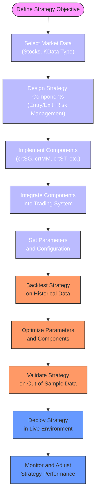
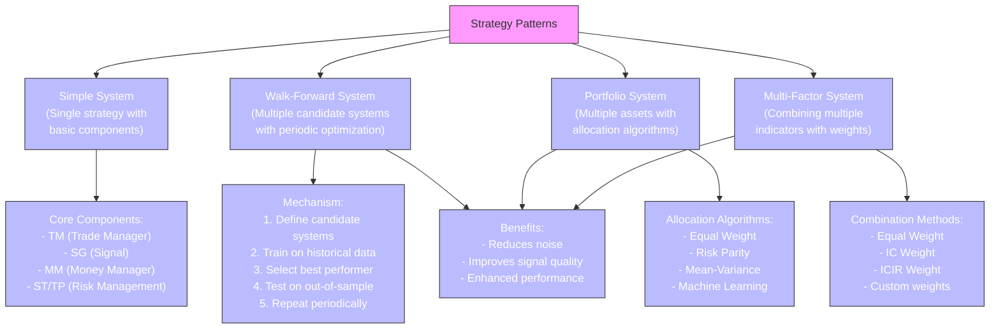

# Strategy Development

<cite>
**Referenced Files in This Document**   
- [strategy_demo1.py](file://hikyuu/strategy/strategy_demo1.py)
- [strategy_demo2.py](file://hikyuu/strategy/strategy_demo2.py)
- [strategy_demo3.py](file://hikyuu/strategy/strategy_demo3.py)
- [trade_sys.py](file://hikyuu/trade_sys/trade_sys.py)
- [Turtle_SG.py](file://hikyuu/examples/Turtle_SG.py)
- [SystemPart.h](file://hikyuu_cpp/hikyuu/trade_sys/system/SystemPart.h)
- [SystemPart.cpp](file://hikyuu_cpp/hikyuu/trade_sys/system/SystemPart.cpp)
- [_System.cpp](file://hikyuu_pywrap/trade_sys/_System.cpp)
- [WalkForwardSystem.cpp](file://hikyuu_cpp/hikyuu/trade_sys/system/imp/WalkForwardSystem.cpp)
- [OptimalSelectorBase.h](file://hikyuu_cpp/hikyuu/trade_sys/selector/imp/optimal/OptimalSelectorBase.h)
</cite>

## Table of Contents
1. [Introduction](#introduction)
2. [Strategy Architecture Overview](#strategy-architecture-overview)
3. [Core Strategy Components](#core-strategy-components)
4. [Strategy Creation Workflow](#strategy-creation-workflow)
5. [Indicator Integration and Signal Generation](#indicator-integration-and-signal-generation)
6. [Risk Management and Position Sizing](#risk-management-and-position-sizing)
7. [Parameter Management and Optimization](#parameter-management-and-optimization)
8. [Advanced Strategy Patterns](#advanced-strategy-patterns)
9. [Practical Implementation Examples](#practical-implementation-examples)
10. [Public Interfaces for Strategy Configuration](#public-interfaces-for-strategy-configuration)

## Introduction
Hikyuu provides a comprehensive framework for developing algorithmic trading strategies through a modular component-based architecture. The framework enables users to compose sophisticated trading systems by combining various strategy components such as entry/exit conditions, risk management rules, and position sizing algorithms. This document explains the strategy development process in Hikyuu, covering both conceptual foundations for beginners and technical details for experienced developers. The framework supports multiple strategy patterns and provides extensive tools for parameter optimization and performance evaluation.

**Section sources**
- [strategy_demo1.py](file://hikyuu/strategy/strategy_demo1.py#L1-L54)
- [strategy_demo2.py](file://hikyuu/strategy/strategy_demo2.py#L1-L48)

## Strategy Architecture Overview



**Diagram sources**
- [SystemPart.h](file://hikyuu_cpp/hikyuu/trade_sys/system/SystemPart.h#L1-L54)
- [trade_sys.py](file://hikyuu/trade_sys/trade_sys.py#L1-L300)

**Section sources**
- [SystemPart.h](file://hikyuu_cpp/hikyuu/trade_sys/system/SystemPart.h#L1-L54)
- [SystemPart.cpp](file://hikyuu_cpp/hikyuu/trade_sys/system/SystemPart.cpp#L1-L56)

## Core Strategy Components

Hikyuu's strategy framework is built around a modular architecture where each trading system consists of several interconnected components. These components work together to define the complete trading logic, from market analysis to execution. The framework follows a systematic approach to strategy development, allowing users to compose complex trading systems from simpler, reusable components.

The core components include Environment (EV), Condition (CN), Signal (SG), Money Manager (MM), Stoploss (ST), Take Profit (TP), Profit Goal (PG), and Slippage (SP). Each component serves a specific purpose in the trading system, and they can be combined in various ways to create different strategy patterns. This modular design enables users to easily experiment with different combinations of components and parameters to optimize strategy performance.

**Section sources**
- [SystemPart.h](file://hikyuu_cpp/hikyuu/trade_sys/system/SystemPart.h#L1-L54)
- [trade_sys.py](file://hikyuu/trade_sys/trade_sys.py#L1-L300)

## Strategy Creation Workflow



**Diagram sources**
- [strategy_demo1.py](file://hikyuu/strategy/strategy_demo1.py#L1-L54)
- [strategy_demo2.py](file://hikyuu/strategy/strategy_demo2.py#L1-L48)

**Section sources**
- [strategy_demo1.py](file://hikyuu/strategy/strategy_demo1.py#L1-L54)
- [strategy_demo2.py](file://hikyuu/strategy/strategy_demo2.py#L1-L48)

## Indicator Integration and Signal Generation

```mermaid
classDiagram
class SignalBase {
+string name
+dict params
+set_param(key, value)
+get_param(key)
+_calculate(kdata)
+_add_buy_signal(datetime)
+_add_sell_signal(datetime)
+should_buy(datetime)
+should_sell(datetime)
}
class TurtleSignal {
+int n
+_calculate(kdata)
}
class Indicator {
+string name
+int discard
+value[i]
+datetime[i]
}
class KData {
+DatetimeList datetime
+PriceList open
+PriceList high
+PriceList low
+PriceList close
+PriceList volume
+PriceList amount
}
SignalBase <|-- TurtleSignal
TurtleSignal --> Indicator : "uses CLOSE, HHV, LLV"
Indicator --> KData : "derived from"
KData --> Stock : "belongs to"
note right of TurtleSignal
Turtle trading system signal generator
Entry : Price >= REF(HHV(CLOSE, n), 1)
Exit : Price <= REF(LLV(CLOSE, n), 1)
end note
```

**Diagram sources**
- [Turtle_SG.py](file://hikyuu/examples/Turtle_SG.py#L1-L48)
- [indicator.py](file://hikyuu/indicator/indicator.py#L1-L120)

**Section sources**
- [Turtle_SG.py](file://hikyuu/examples/Turtle_SG.py#L1-L48)
- [indicator.py](file://hikyuu/indicator/indicator.py#L1-L120)

## Risk Management and Position Sizing

Hikyuu provides comprehensive risk management capabilities through its modular component system. The framework includes dedicated components for stoploss (ST), take profit (TP), and money management (MM), allowing users to implement sophisticated risk control strategies. These components work together to protect capital and optimize position sizing based on market conditions and portfolio objectives.

The money management component (MM) determines position size based on various criteria such as fixed count, fixed percentage of capital, or risk-based approaches. The stoploss component (ST) defines exit rules to limit losses, while the take profit component (TP) specifies profit-taking levels. These components can be combined with other strategy elements to create robust risk management frameworks that adapt to changing market conditions.

**Section sources**
- [trade_sys.py](file://hikyuu/trade_sys/trade_sys.py#L1-L300)
- [SystemPart.h](file://hikyuu_cpp/hikyuu/trade_sys/system/SystemPart.h#L1-L54)

## Parameter Management and Optimization

```mermaid
flowchart TD
Params[Strategy Parameters] --> Types["Parameter Types"]
Types --> Fixed["Fixed Parameters\n(e.g., lookback period)"]
Types --> Dynamic["Dynamic Parameters\n(e.g., volatility-based)"]
Types --> Adaptive["Adaptive Parameters\n(e.g., machine learning)"]
Params --> Management["Parameter Management"]
Management --> Set["set_param(key, value)"]
Management --> Get["get_param(key)"]
Management --> Default["Default Values"]
Params --> Optimization["Parameter Optimization"]
Optimization --> Grid["Grid Search"]
Optimization --> Random["Random Search"]
Optimization --> WalkForward["Walk-Forward Analysis"]
Optimization --> Genetic["Genetic Algorithms"]
WalkForward --> Train["Training Period"]
WalkForward --> Test["Testing Period"]
WalkForward --> Select["Select Best Parameters"]
WalkForward --> Validate["Validate on Out-of-Sample"]
style Params fill:#f9f,stroke:#333
style Types fill:#bbf,stroke:#333,color:#fff
style Fixed fill:#bbf,stroke:#333,color:#fff
style Dynamic fill:#bbf,stroke:#333,color:#fff
style Adaptive fill:#bbf,stroke:#333,color:#fff
style Management fill:#bbf,stroke:#333,color:#fff
style Set fill:#bbf,stroke:#333,color:#fff
style Get fill:#bbf,stroke:#333,color:#fff
style Default fill:#bbf,stroke:#333,color:#fff
style Optimization fill:#f96,stroke:#333
style Grid fill:#f96,stroke:#333
style Random fill:#f96,stroke:#333
style WalkForward fill:#f96,stroke:#333
style Genetic fill:#f96,stroke:#333
style Train fill:#f96,stroke:#333
style Test fill:#f96,stroke:#333
style Select fill:#f96,stroke:#333
style Validate fill:#f96,stroke:#333
```



**Diagram sources**
- [OptimalSelectorBase.h](file://hikyuu_cpp/hikyuu/trade_sys/selector/imp/optimal/OptimalSelectorBase.h#L1-L49)
- [WalkForwardSystem.cpp](file://hikyuu_cpp/hikyuu/trade_sys/system/imp/WalkForwardSystem.cpp#L1-L69)

**Section sources**
- [OptimalSelectorBase.h](file://hikyuu_cpp/hikyuu/trade_sys/selector/imp/optimal/OptimalSelectorBase.h#L1-L49)
- [WalkForwardSystem.cpp](file://hikyuu_cpp/hikyuu/trade_sys/system/imp/WalkForwardSystem.cpp#L1-L69)

## Advanced Strategy Patterns



**Diagram sources**
- [WalkForwardSystem.cpp](file://hikyuu_cpp/hikyuu/trade_sys/system/imp/WalkForwardSystem.cpp#L1-L69)
- [OptimalSelectorBase.h](file://hikyuu_cpp/hikyuu/trade_sys/selector/imp/optimal/OptimalSelectorBase.h#L1-L49)
- [trade_sys.py](file://hikyuu/trade_sys/trade_sys.py#L1-L300)

**Section sources**
- [WalkForwardSystem.cpp](file://hikyuu_cpp/hikyuu/trade_sys/system/imp/WalkForwardSystem.cpp#L1-L69)
- [OptimalSelectorBase.h](file://hikyuu_cpp/hikyuu/trade_sys/selector/imp/optimal/OptimalSelectorBase.h#L1-L49)

## Practical Implementation Examples

The Hikyuu framework provides several practical examples demonstrating strategy implementation. The Turtle trading system example shows how to create a classic trend-following strategy using breakouts from recent price highs and lows. This example illustrates the process of defining a custom signal generator by inheriting from the SignalBase class and implementing the _calculate method.

Another example demonstrates the use of the strategy runtime system for executing trading strategies. This includes setting up event handlers for market data updates, scheduling periodic tasks, and integrating with order brokers for live trading. These examples provide a foundation for developing more complex strategies and show how to combine various components to create complete trading systems.

**Section sources**
- [Turtle_SG.py](file://hikyuu/examples/Turtle_SG.py#L1-L48)
- [strategy_demo1.py](file://hikyuu/strategy/strategy_demo1.py#L1-L54)
- [strategy_demo2.py](file://hikyuu/strategy/strategy_demo2.py#L1-L48)

## Public Interfaces for Strategy Configuration

```mermaid
classDiagram
class System {
+string name
+set_param(key, value)
+get_param(key)
+setTM(tm)
+setMM(mm)
+setSG(sg)
+setST(st)
+setTP(tp)
+setPG(pg)
+setSP(sp)
+run(stock, query)
+getTradeList()
+getPerformance()
}
class TradeManager {
+Datetime initDatetime
+double initCash
+string name
+currentCash()
+currentAsset()
+getTradeList()
}
class SignalBase {
+string name
+set_param(key, value)
+get_param(key)
+_calculate(kdata)
}
class MoneyManagerBase {
+string name
+set_param(key, value)
+get_param(key)
+_get_buy_num(sys, datetime)
+_get_sell_num(sys, datetime)
}
class StoplossBase {
+string name
+set_param(key, value)
+get_param(key)
+_calculate(sys, datetime)
}
System --> TradeManager : "has"
System --> SignalBase : "has"
System --> MoneyManagerBase : "has"
System --> StoplossBase : "has"
note right of System
Main system class that coordinates
all strategy components and execution
end note
note right of TradeManager
Manages account state, cash,
positions, and trade records
end note
note right of SignalBase
Generates buy/sell signals
based on market data analysis
end note
note right of MoneyManagerBase
Determines position size
for entries and exits
end note
note right of StoplossBase
Defines exit rules to limit
losses and protect profits
end note
```

**Diagram sources**
- [_System.cpp](file://hikyuu_pywrap/trade_sys/_System.cpp#L72-L89)
- [trade_sys.py](file://hikyuu/trade_sys/trade_sys.py#L1-L300)
- [SystemPart.h](file://hikyuu_cpp/hikyuu/trade_sys/system/SystemPart.h#L1-L54)

**Section sources**
- [_System.cpp](file://hikyuu_pywrap/trade_sys/_System.cpp#L72-L89)
- [trade_sys.py](file://hikyuu/trade_sys/trade_sys.py#L1-L300)