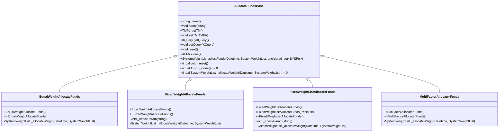
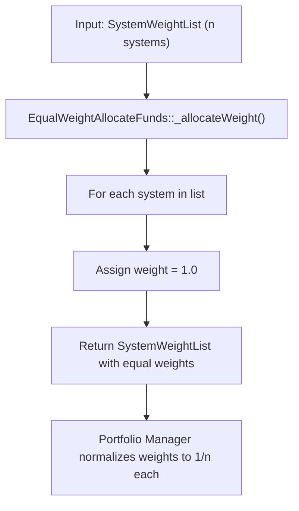
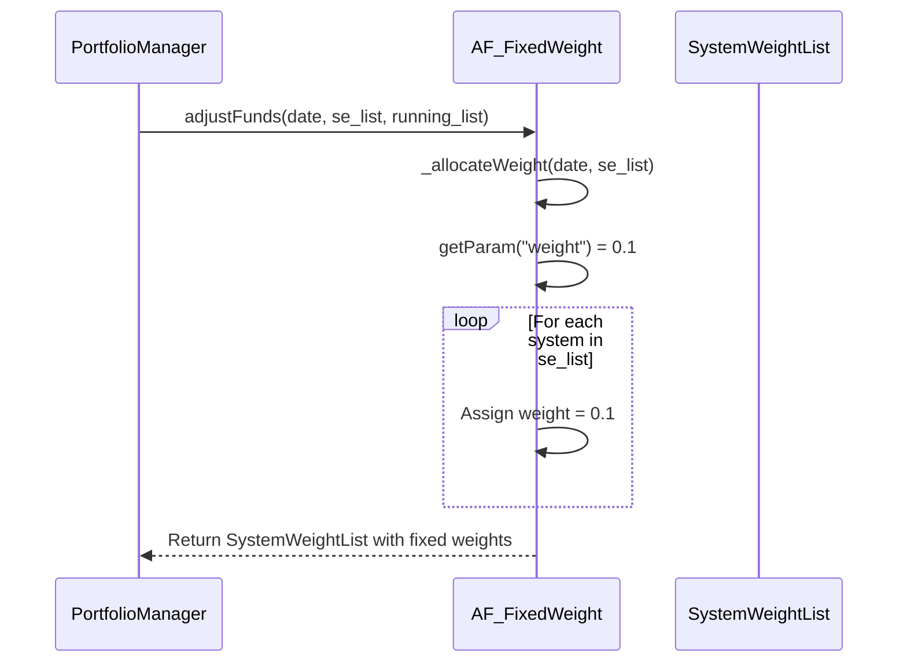
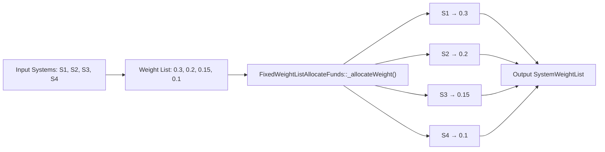
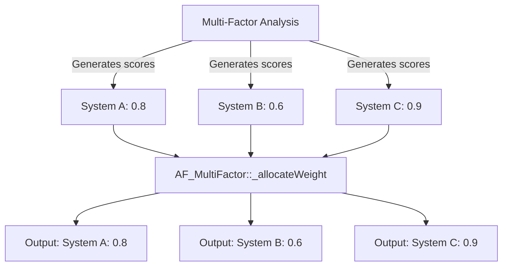
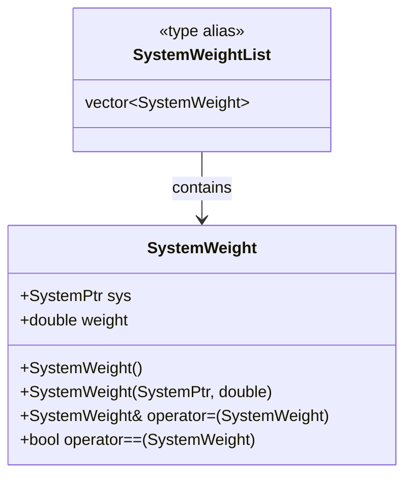

# Asset Allocation

<cite>
**Referenced Files in This Document**   
- [AllocateFundsBase.h](file://hikyuu_cpp/hikyuu/trade_sys/allocatefunds/AllocateFundsBase.h)
- [AllocateFundsBase.cpp](file://hikyuu_cpp/hikyuu/trade_sys/allocatefunds/AllocateFundsBase.cpp)
- [EqualWeightAllocateFunds.cpp](file://hikyuu_cpp/hikyuu/trade_sys/allocatefunds/imp/EqualWeightAllocateFunds.cpp)
- [FixedWeightAllocateFunds.cpp](file://hikyuu_cpp/hikyuu/trade_sys/allocatefunds/imp/FixedWeightAllocateFunds.cpp)
- [FixedWeightListAllocateFunds.cpp](file://hikyuu_cpp/hikyuu/trade_sys/allocatefunds/imp/FixedWeightListAllocateFunds.cpp)
- [MultiFactorAllocaterFunds.cpp](file://hikyuu_cpp/hikyuu/trade_sys/allocatefunds/imp/MultiFactorAllocaterFunds.cpp)
- [SystemWeight.h](file://hikyuu_cpp/hikyuu/trade_sys/selector/SystemWeight.h)
- [MultiFactorBase.h](file://hikyuu_cpp/hikyuu/trade_sys/multifactor/MultiFactorBase.h)
</cite>

## Table of Contents
- [Asset Allocation](#asset-allocation)
  - [Table of Contents](#table-of-contents)
  - [Introduction](#introduction)
  - [Core Allocation Methods](#core-allocation-methods)
  - [AllocateFundsBase Class Interface](#allocatefundsbase-class-interface)
  - [Equal Weight Allocation](#equal-weight-allocation)
  - [Fixed Weight Allocation](#fixed-weight-allocation)
  - [Fixed Weight List Allocation](#fixed-weight-list-allocation)
  - [Multi-Factor Allocation](#multi-factor-allocation)
  - [System Weight Data Structure](#system-weight-data-structure)
  - [Integration with Portfolio Management](#integration-with-portfolio-management)
  - [Practical Configuration Examples](#practical-configuration-examples)
  - [Performance and Rebalancing Considerations](#performance-and-rebalancing-considerations)

## Introduction
Asset allocation in Hikyuu refers to the systematic distribution of capital across multiple trading systems or assets within a portfolio. This process is critical for risk diversification, position sizing, and optimizing returns based on predefined strategies. The framework provides several built-in allocation algorithms that can be customized or extended to meet specific investment objectives. These allocation methods operate by determining the relative weight each selected system should receive in the overall portfolio, based on various criteria such as equal distribution, fixed percentages, or multi-factor scoring models.

The asset allocation mechanism works in conjunction with other components of the trading system, including system selection, money management, and portfolio execution. It receives input from system selectors that determine which trading systems are active, then applies the chosen allocation strategy to assign weights. These weights are subsequently used by the portfolio manager to execute trades proportionally across systems.

**Section sources**
- [AllocateFundsBase.h](file://hikyuu_cpp/hikyuu/trade_sys/allocatefunds/AllocateFundsBase.h#L17-L20)

## Core Allocation Methods
Hikyuu implements four primary asset allocation strategies through dedicated classes, each designed for different portfolio management requirements:

- **AF_EqualWeight**: Distributes capital equally among all selected systems
- **AF_FixedWeight**: Assigns a fixed percentage weight to each system
- **AF_FixedWeightList**: Applies a predefined list of weights sequentially to selected systems
- **AF_MultiFactor**: Uses scores from multi-factor analysis as allocation weights
- **AF_FixedAmount**: Assigns fixed amount to each system

These methods inherit from the base `AllocateFundsBase` class and implement the `_allocateWeight` virtual function to define their specific behavior. Each allocation method can be instantiated through factory functions (e.g., `AF_EqualWeight()`, `AF_FixedWeight()`) that return shared pointers to the respective implementation.

The allocation process occurs during portfolio rebalancing events, where the algorithm receives a list of active systems from the selector component and returns a `SystemWeightList` containing each system paired with its assigned weight. The weights are normalized and adjusted according to portfolio constraints before final execution.

**Section sources**
- [AllocateFundsBase.h](file://hikyuu_cpp/hikyuu/trade_sys/allocatefunds/AllocateFundsBase.h#L52-L53)
- [SystemWeight.h](file://hikyuu_cpp/hikyuu/trade_sys/selector/SystemWeight.h#L21-L24)

## AllocateFundsBase Class Interface
The `AllocateFundsBase` class serves as the abstract base class for all asset allocation strategies in Hikyuu. It defines the core interface and common functionality that all concrete allocation implementations must follow. Key aspects of this base class include:

- **Virtual Interface**: Declares the pure virtual method `_allocateWeight` that derived classes must implement
- **Parameter Management**: Inherits parameter support for configurable behavior
- **Serialization Support**: Includes Boost serialization capabilities for persistence
- **Cloning Mechanism**: Provides a `clone()` method for creating copies of allocation instances
- **Runtime Configuration**: Manages references to trading accounts and query conditions

The class exposes several public methods for configuration and operation:
- `adjustFunds()`: Main entry point called by the portfolio manager
- `setTM()`/`getTM()`: Manages the trading account reference
- `setQuery()`: Sets the KData query parameters for analysis
- `name()`: Gets or sets the algorithm name

Derived classes implement the `ALLOCATEFUNDS_IMP` macro to automatically provide the `_clone()` implementation and override the `_allocateWeight` method with their specific logic.



**Diagram sources**
- [AllocateFundsBase.h](file://hikyuu_cpp/hikyuu/trade_sys/allocatefunds/AllocateFundsBase.h#L22-L187)
- [EqualWeightAllocateFunds.h](file://hikyuu_cpp/hikyuu/trade_sys/allocatefunds/imp/EqualWeightAllocateFunds.h#L16-L23)
- [FixedWeightAllocateFunds.h](file://hikyuu_cpp/hikyuu/trade_sys/allocatefunds/imp/FixedWeightAllocateFunds.h#L16-L24)
- [FixedWeightListAllocateFunds.h](file://hikyuu_cpp/hikyuu/trade_sys/allocatefunds/imp/FixedWeightListAllocateFunds.h#L14-L23)
- [MultiFactorAllocaterFunds.h](file://hikyuu_cpp/hikyuu/trade_sys/allocatefunds/imp/MultiFactorAllocaterFunds.h#L14-L25)

**Section sources**
- [AllocateFundsBase.h](file://hikyuu_cpp/hikyuu/trade_sys/allocatefunds/AllocateFundsBase.h#L22-L187)

## Equal Weight Allocation
The Equal Weight allocation strategy (`AF_EqualWeight`) assigns identical weights to all selected systems in the portfolio. This approach embodies the principle of diversification by ensuring no single system dominates the portfolio allocation. Despite returning a weight of 1.0 for each system in its implementation, the actual effective weight becomes 1/n where n is the number of systems, as the portfolio manager normalizes the weights.

This method is particularly useful for:
- Testing multiple uncorrelated strategies with equal conviction
- Implementing naive diversification approaches
- Serving as a baseline for performance comparison
- Situations where no clear outperformance expectations exist among systems

The implementation is straightforward, iterating through the input `SystemWeightList` and assigning a weight of 1.0 to each system. The simplicity of this approach makes it computationally efficient and easy to understand, making it ideal for beginners in portfolio management.



**Diagram sources**
- [EqualWeightAllocateFunds.cpp](file://hikyuu_cpp/hikyuu/trade_sys/allocatefunds/imp/EqualWeightAllocateFunds.cpp#L20-L28)
- [EqualWeightAllocateFunds.h](file://hikyuu_cpp/hikyuu/trade_sys/allocatefunds/imp/EqualWeightAllocateFunds.h#L16-L23)

**Section sources**
- [EqualWeightAllocateFunds.cpp](file://hikyuu_cpp/hikyuu/trade_sys/allocatefunds/imp/EqualWeightAllocateFunds.cpp#L16-L28)

## Fixed Weight Allocation
The Fixed Weight allocation strategy (`AF_FixedWeight`) assigns a predetermined, identical weight to each selected system. Unlike the equal weight approach, this method allows users to specify an exact weight value (between 0.0 and 1.0) that will be applied uniformly across all systems. This is useful when implementing position sizing rules that require specific maximum allocations per system.

Key characteristics of this method include:
- Configurable weight parameter with validation (0.0 < weight ≤ 1.0)
- Automatic prevention of weight adjustment through parameter constraints
- Consistent allocation regardless of the number of active systems
- Potential for portfolio constraint violations if too many systems are active

The implementation retrieves the configured weight parameter and applies it uniformly to all systems in the input list. The method includes parameter validation to ensure the weight remains within acceptable bounds, throwing assertions if invalid values are detected.



**Diagram sources**
- [FixedWeightAllocateFunds.cpp](file://hikyuu_cpp/hikyuu/trade_sys/allocatefunds/imp/FixedWeightAllocateFunds.cpp#L35-L44)
- [FixedWeightAllocateFunds.h](file://hikyuu_cpp/hikyuu/trade_sys/allocatefunds/imp/FixedWeightAllocateFunds.h#L16-L24)

**Section sources**
- [FixedWeightAllocateFunds.cpp](file://hikyuu_cpp/hikyuu/trade_sys/allocatefunds/imp/FixedWeightAllocateFunds.cpp#L16-L44)

## Fixed Weight List Allocation
The Fixed Weight List allocation strategy (`AF_FixedWeightList`) applies a predefined sequence of weights to selected systems in order. This method is particularly useful when different systems have varying levels of confidence or risk profiles, allowing for customized allocation based on prior analysis.

Key features of this approach:
- Accepts a `PriceList` of weights as input
- Applies weights sequentially to systems in the order they appear
- Stops when either the system list or weight list is exhausted
- Prevents automatic weight adjustment to maintain intended allocation

The constructor accepts either an empty weight list (to be configured later) or a pre-populated list. The implementation iterates through both the system list and weight list simultaneously, assigning each system the corresponding weight from the list. This allows for sophisticated allocation patterns where certain systems consistently receive higher allocations based on their historical performance or risk-return characteristics.



**Diagram sources**
- [FixedWeightListAllocateFunds.cpp](file://hikyuu_cpp/hikyuu/trade_sys/allocatefunds/imp/FixedWeightListAllocateFunds.cpp#L39-L49)
- [FixedWeightListAllocateFunds.h](file://hikyuu_cpp/hikyuu/trade_sys/allocatefunds/imp/FixedWeightListAllocateFunds.h#L14-L23)

**Section sources**
- [FixedWeightListAllocateFunds.cpp](file://hikyuu_cpp/hikyuu/trade_sys/allocatefunds/imp/FixedWeightListAllocateFunds.cpp#L16-L49)

## Multi-Factor Allocation
The Multi-Factor allocation strategy (`AF_MultiFactor`) uses scores generated by multi-factor analysis directly as allocation weights. This approach represents a sophisticated, data-driven method where capital allocation is proportional to the综合 score of each system, reflecting its expected performance based on multiple quantitative factors.

This method works in conjunction with the multi-factor framework in Hikyuu, which can incorporate various weighting schemes:
- Equal weighting of factors
- IC (Information Coefficient) based weighting
- ICIR (IC Information Ratio) based weighting
- Custom normalized scores

The implementation is minimal, simply returning the input `SystemWeightList` unchanged, as the weights have already been assigned by the multi-factor selector. This design follows the principle of separation of concerns, where the multi-factor analysis component calculates scores and the allocation component applies them directly.



**Diagram sources**
- [MultiFactorAllocaterFunds.cpp](file://hikyuu_cpp/hikyuu/trade_sys/allocatefunds/imp/MultiFactorAllocaterFunds.cpp#L16-L18)
- [MultiFactorBase.h](file://hikyuu_cpp/hikyuu/trade_sys/multifactor/MultiFactorBase.h)
- [MultiFactorAllocaterFunds.h](file://hikyuu_cpp/hikyuu/trade_sys/allocatefunds/imp/MultiFactorAllocaterFunds.h#L14-L25)

**Section sources**
- [MultiFactorAllocaterFunds.cpp](file://hikyuu_cpp/hikyuu/trade_sys/allocatefunds/imp/MultiFactorAllocaterFunds.cpp#L12-L18)

## System Weight Data Structure
The `SystemWeight` structure is a fundamental component in Hikyuu's asset allocation system, serving as the container for pairing a trading system with its allocated weight. Defined in `SystemWeight.h`, this struct contains two primary members:

- **sys**: A shared pointer to the `System` object representing the trading strategy
- **weight**: A double-precision floating-point value representing the allocation weight (typically in the range [0.0, 1.0])

The structure supports basic operations including construction, assignment, and equality comparison (with tolerance for floating-point precision). It also includes serialization support through Boost.Serialization, enabling persistence of allocation states.

The `SystemWeightList` type alias defines a vector of `SystemWeight` objects, which is the standard container used for passing allocation results between components. This list represents the complete allocation decision for a portfolio at a given point in time.



**Diagram sources**
- [SystemWeight.h](file://hikyuu_cpp/hikyuu/trade_sys/selector/SystemWeight.h#L21-L53)
- [SystemWeight.h](file://hikyuu_cpp/hikyuu/trade_sys/selector/SystemWeight.h#L55)

**Section sources**
- [SystemWeight.h](file://hikyuu_cpp/hikyuu/trade_sys/selector/SystemWeight.h#L21-L71)

## Integration with Portfolio Management
Asset allocation in Hikyuu is tightly integrated with the portfolio management system, forming a critical link between system selection and trade execution. The allocation process fits into the following workflow:

1. **System Selection**: A selector component identifies active trading systems
2. **Allocation**: The allocation algorithm assigns weights to selected systems
3. **Money Management**: Money management rules adjust position sizes based on risk
4. **Execution**: The portfolio manager executes trades according to final allocations

The `adjustFunds()` method in `AllocateFundsBase` serves as the main interface between the portfolio manager and the allocation strategy. This method handles both the allocation calculation and coordination with running systems, either adjusting existing positions or leaving them unchanged based on configuration.

The integration also considers practical constraints such as:
- Transaction costs and their impact on rebalancing frequency
- Market impact and liquidity considerations
- Correlation between systems and overall portfolio risk
- Cash reserve requirements (via the `reserve_percent` parameter)

**Section sources**
- [AllocateFundsBase.h](file://hikyuu_cpp/hikyuu/trade_sys/allocatefunds/AllocateFundsBase.h#L52-L53)
- [AllocateFundsBase.cpp](file://hikyuu_cpp/hikyuu/trade_sys/allocatefunds/AllocateFundsBase.cpp#L71-L108)

## Practical Configuration Examples
The following examples demonstrate how to configure different allocation strategies in Hikyuu:

**Equal Weight Configuration**
```cpp
AFPtr allocator = AF_EqualWeight();
// All systems receive equal allocation
```

**Fixed Weight Configuration**
```cpp
AFPtr allocator = AF_FixedWeight(0.1);  // 10% per system
// Each system receives exactly 10% allocation
```

**Fixed Weight List Configuration**
```cpp
PriceList weights = {0.3, 0.2, 0.15, 0.1};
AFPtr allocator = AF_FixedWeightList(weights);
// Systems receive weights in sequence: 30%, 20%, 15%, 10%
```

**Multi-Factor Configuration**
```cpp
AFPtr allocator = AF_MultiFactor();
// Weights determined by multi-factor scoring model
```

These configurations can be combined with other portfolio parameters such as rebalancing frequency, cash reserves, and risk limits to create comprehensive portfolio management strategies.

**Section sources**
- [EqualWeightAllocateFunds.cpp](file://hikyuu_cpp/hikyuu/trade_sys/allocatefunds/imp/EqualWeightAllocateFunds.cpp#L30-L32)
- [FixedWeightAllocateFunds.cpp](file://hikyuu_cpp/hikyuu/trade_sys/allocatefunds/imp/FixedWeightAllocateFunds.cpp#L46-L49)
- [FixedWeightListAllocateFunds.cpp](file://hikyuu_cpp/hikyuu/trade_sys/allocatefunds/imp/FixedWeightListAllocateFunds.cpp#L52-L56)
- [MultiFactorAllocaterFunds.cpp](file://hikyuu_cpp/hikyuu/trade_sys/allocatefunds/imp/MultiFactorAllocaterFunds.cpp#L21-L22)

## Performance and Rebalancing Considerations
When implementing asset allocation strategies in Hikyuu, several practical considerations affect performance and effectiveness:

**Rebalancing Frequency**: Too frequent rebalancing can lead to excessive transaction costs, while infrequent rebalancing may result in portfolio drift from target allocations. The optimal frequency depends on strategy turnover, transaction costs, and market conditions.

**Transaction Cost Impact**: Each allocation change may trigger trades to adjust positions. Fixed weight strategies with many systems can generate significant trading volume, while equal weight strategies may require more frequent adjustments as system performance diverges.

**Correlation Considerations**: Allocating to highly correlated systems reduces the benefits of diversification. Multi-factor approaches can help mitigate this by incorporating correlation-aware factors in the scoring model.

**Parameter Sensitivity**: Fixed weight strategies are sensitive to the chosen weight value, as inappropriate values can lead to over-concentration or under-utilization of capital. The `reserve_percent` parameter helps manage cash levels to accommodate new opportunities.

**Implementation Efficiency**: The allocation methods are designed to be computationally lightweight, with O(n) complexity where n is the number of systems. This ensures minimal impact on overall system performance during rebalancing events.

**Section sources**
- [AllocateFundsBase.h](file://hikyuu_cpp/hikyuu/trade_sys/allocatefunds/AllocateFundsBase.h#L101-L102)
- [FixedWeightAllocateFunds.cpp](file://hikyuu_cpp/hikyuu/trade_sys/allocatefunds/imp/FixedWeightAllocateFunds.cpp#L25-L33)