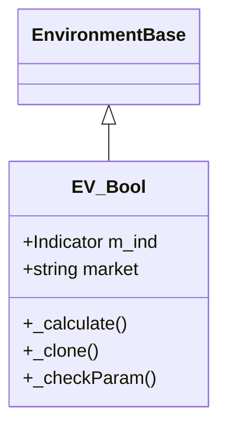
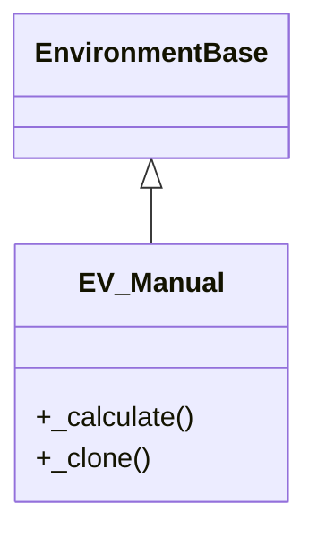
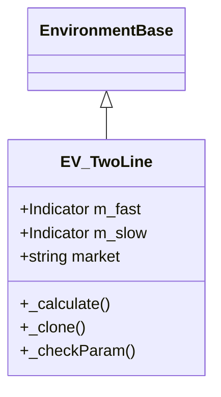
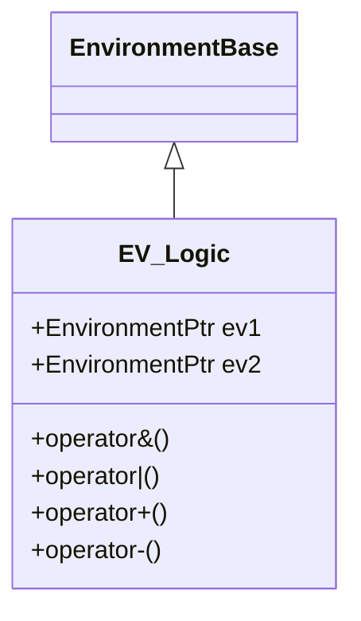
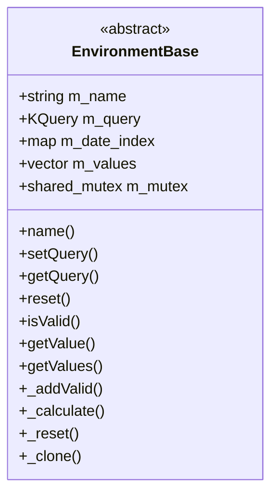
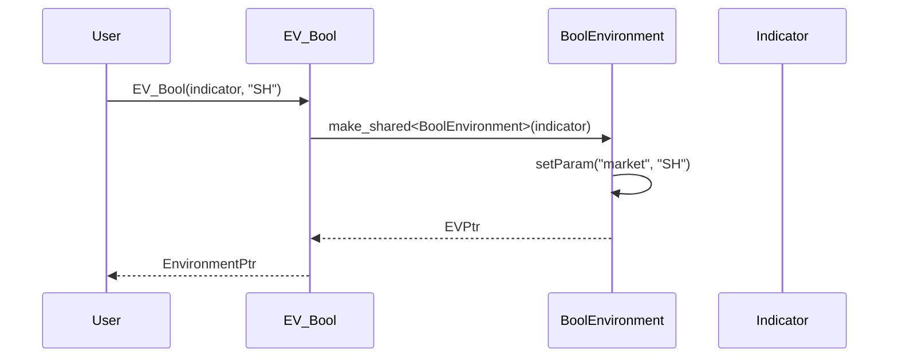
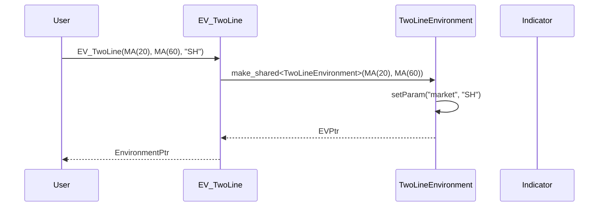
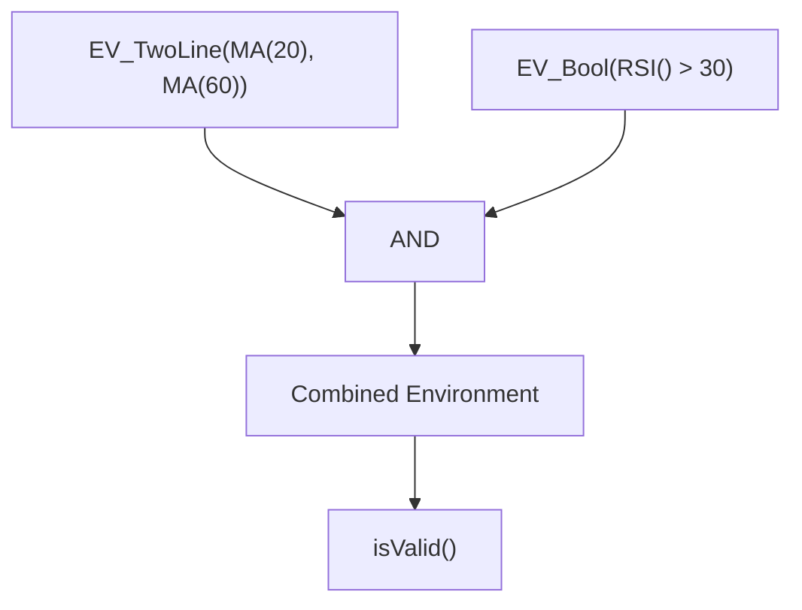
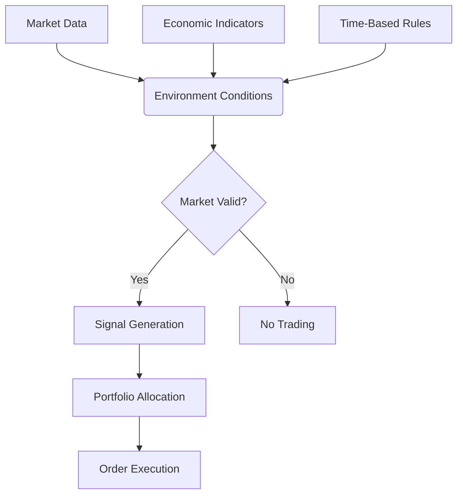
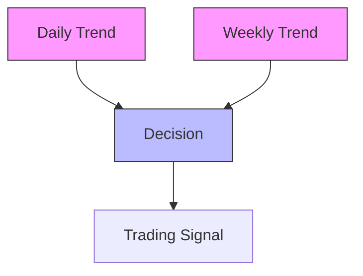

# Environment Conditions

<cite>
**Referenced Files in This Document**   
- [EnvironmentBase.h](file://hikyuu_cpp/hikyuu/trade_sys/environment/EnvironmentBase.h)
- [EnvironmentBase.cpp](file://hikyuu_cpp/hikyuu/trade_sys/environment/EnvironmentBase.cpp)
- [EV_Bool.h](file://hikyuu_cpp/hikyuu/trade_sys/environment/crt/EV_Bool.h)
- [BoolEnvironment.h](file://hikyuu_cpp/hikyuu/trade_sys/environment/imp/BoolEnvironment.h)
- [BoolEnvironment.cpp](file://hikyuu_cpp/hikyuu/trade_sys/environment/imp/BoolEnvironment.cpp)
- [EV_Manual.h](file://hikyuu_cpp/hikyuu/trade_sys/environment/crt/EV_Manual.h)
- [ManualEnvironment.h](file://hikyuu_cpp/hikyuu/trade_sys/environment/imp/ManualEnvironment.h)
- [ManualEnvironment.cpp](file://hikyuu_cpp/hikyuu/trade_sys/environment/imp/ManualEnvironment.cpp)
- [EV_TwoLine.h](file://hikyuu_cpp/hikyuu/trade_sys/environment/crt/EV_TwoLine.h)
- [TwoLineEnvironment.h](file://hikyuu_cpp/hikyuu/trade_sys/environment/imp/TwoLineEnvironment.h)
- [TwoLineEnvironment.cpp](file://hikyuu_cpp/hikyuu/trade_sys/environment/imp/TwoLineEnvironment.cpp)
- [EV_Logic.h](file://hikyuu_cpp/hikyuu/trade_sys/environment/crt/EV_Logic.h)
- [AndEnvironment.h](file://hikyuu_cpp/hikyuu/trade_sys/environment/imp/logic/AndEnvironment.h)
- [OrEnvironment.h](file://hikyuu_cpp/hikyuu/trade_sys/environment/imp/logic/OrEnvironment.h)
</cite>

## Table of Contents
1. [Introduction](#introduction)
2. [Core Components](#core-components)
3. [Environment Types](#environment-types)
4. [Domain Model and Interfaces](#domain-model-and-interfaces)
5. [Configuration Examples](#configuration-examples)
6. [Integration with Trading System](#integration-with-trading-system)
7. [Common Issues and Solutions](#common-issues-and-solutions)
8. [Conclusion](#conclusion)

## Introduction
Environment Conditions in Hikyuu represent a critical component of the trading system that determines market regime validity. These conditions act as filters that assess whether market conditions are favorable for trading based on various criteria such as technical indicators, economic factors, or time-based conditions. The environment system allows traders to implement regime-switching strategies that adapt to changing market conditions, improving risk management and performance. This documentation provides comprehensive details about the implementation of market regime filters, their interfaces, and practical applications within the Hikyuu framework.

## Core Components

The Environment Conditions system in Hikyuu is built around a well-defined class hierarchy and interface contract. The core functionality revolves around the EnvironmentBase class, which serves as the foundation for all market condition implementations. This base class provides essential services such as parameter management, date indexing, value storage, and thread-safe operations. The system is designed to be both flexible for custom implementations and efficient for real-time regime detection.

**Section sources**
- [EnvironmentBase.h](file://hikyuu_cpp/hikyuu/trade_sys/environment/EnvironmentBase.h#L1-L198)
- [EnvironmentBase.cpp](file://hikyuu_cpp/hikyuu/trade_sys/environment/EnvironmentBase.cpp#L1-L125)

## Environment Types

Hikyuu provides several built-in environment types that cater to different market regime detection needs. These include EV_Bool for boolean signal-based conditions, EV_Logic for combining multiple conditions, EV_Manual for manual regime specification, and EV_TwoLine for trend-following strategies based on indicator crossovers.

### EV_Bool
The EV_Bool environment type allows users to define market conditions based on a boolean indicator. This implementation takes an indicator as input and considers the market valid when the indicator value is greater than zero. It's particularly useful for implementing conditions based on technical indicators, fundamental factors, or custom signals.

**Diagram sources**
- [EV_Bool.h](file://hikyuu_cpp/hikyuu/trade_sys/environment/crt/EV_Bool.h#L1-L23)
- [BoolEnvironment.h](file://hikyuu_cpp/hikyuu/trade_sys/environment/imp/BoolEnvironment.h#L1-L42)
- [BoolEnvironment.cpp](file://hikyuu_cpp/hikyuu/trade_sys/environment/imp/BoolEnvironment.cpp#L1-L65)

### EV_Manual
The EV_Manual environment type provides a mechanism for manually specifying market conditions. This is particularly useful for backtesting specific market regimes or for implementing discretionary trading rules. The manual environment allows users to explicitly add valid dates, making it ideal for testing and research purposes.

**Diagram sources**
- [EV_Manual.h](file://hikyuu_cpp/hikyuu/trade_sys/environment/crt/EV_Manual.h#L1-L21)
- [ManualEnvironment.h](file://hikyuu_cpp/hikyuu/trade_sys/environment/imp/ManualEnvironment.h#L1-L23)
- [ManualEnvironment.cpp](file://hikyuu_cpp/hikyuu/trade_sys/environment/imp/ManualEnvironment.cpp#L1-L24)

### EV_TwoLine
The EV_TwoLine environment implements a classic trend-following strategy based on the crossover of two moving averages or other indicators. The market is considered valid when the fast line is above the slow line, indicating a bullish regime. This approach is widely used in technical analysis and provides a simple yet effective way to identify market trends.

**Diagram sources**
- [EV_TwoLine.h](file://hikyuu_cpp/hikyuu/trade_sys/environment/crt/EV_TwoLine.h#L1-L29)
- [TwoLineEnvironment.h](file://hikyuu_cpp/hikyuu/trade_sys/environment/imp/TwoLineEnvironment.h#L1-L48)
- [TwoLineEnvironment.cpp](file://hikyuu_cpp/hikyuu/trade_sys/environment/imp/TwoLineEnvironment.cpp#L1-L75)

### EV_Logic
The EV_Logic environment type enables the combination of multiple market conditions using logical operators. This allows for sophisticated regime detection by combining different signals through AND, OR, and other logical operations. The logic environment is essential for creating comprehensive market filters that consider multiple factors simultaneously.

**Diagram sources**
- [EV_Logic.h](file://hikyuu_cpp/hikyuu/trade_sys/environment/crt/EV_Logic.h#L1-L35)
- [AndEnvironment.h](file://hikyuu_cpp/hikyuu/trade_sys/environment/imp/logic/AndEnvironment.h)
- [OrEnvironment.h](file://hikyuu_cpp/hikyuu/trade_sys/environment/imp/logic/OrEnvironment.h)

## Domain Model and Interfaces

The Environment Conditions system in Hikyuu follows a clear domain model centered around the EnvironmentBase abstract class. This class defines the contract that all concrete environment implementations must adhere to, ensuring consistency across different regime detection strategies.

### EnvironmentBase Class
The EnvironmentBase class serves as the foundation for all market condition implementations. It provides essential functionality including parameter management, date indexing, value storage, and thread-safe operations. The class is designed to be inherited by concrete implementations that provide specific regime detection logic.

**Diagram sources**
- [EnvironmentBase.h](file://hikyuu_cpp/hikyuu/trade_sys/environment/EnvironmentBase.h#L1-L198)
- [EnvironmentBase.cpp](file://hikyuu_cpp/hikyuu/trade_sys/environment/EnvironmentBase.cpp#L1-L125)

### Key Methods
The EnvironmentBase class exposes several key methods that form the interface for market condition evaluation:

- **isValid()**: Determines whether the market is valid for a given date
- **getValues()**: Returns an indicator containing the validity status for all dates
- **_calculate()**: Abstract method that must be implemented by subclasses to perform the actual regime detection
- **_clone()**: Creates a copy of the environment instance
- **setQuery()**: Sets the query parameters for data retrieval

These methods provide a consistent interface for all environment types, allowing them to be used interchangeably within the trading system.

**Section sources**
- [EnvironmentBase.h](file://hikyuu_cpp/hikyuu/trade_sys/environment/EnvironmentBase.h#L1-L198)

## Configuration Examples

The Hikyuu environment system provides several factory functions for creating different types of market conditions. These functions simplify the configuration process and ensure proper initialization of the environment instances.

### Creating a Boolean Environment
To create a market condition based on a boolean indicator:

**Diagram sources**
- [EV_Bool.h](file://hikyuu_cpp/hikyuu/trade_sys/environment/crt/EV_Bool.h#L1-L23)
- [BoolEnvironment.cpp](file://hikyuu_cpp/hikyuu/trade_sys/environment/imp/BoolEnvironment.cpp#L1-L65)

### Creating a Two-Line Environment
To implement a trend-following strategy using moving average crossovers:

**Diagram sources**
- [EV_TwoLine.h](file://hikyuu_cpp/hikyuu/trade_sys/environment/crt/EV_TwoLine.h#L1-L29)
- [TwoLineEnvironment.cpp](file://hikyuu_cpp/hikyuu/trade_sys/environment/imp/TwoLineEnvironment.cpp#L1-L75)

### Combining Multiple Conditions
To create a composite market condition using logical operators:

**Diagram sources**
- [EV_Logic.h](file://hikyuu_cpp/hikyuu/trade_sys/environment/crt/EV_Logic.h#L1-L35)

## Integration with Trading System

Environment conditions are tightly integrated with other components of the Hikyuu trading system, forming a critical part of the decision-making pipeline. They interact with signal generators, portfolio allocation strategies, and risk management components to create a comprehensive trading framework.

**Diagram sources**
- [EnvironmentBase.h](file://hikyuu_cpp/hikyuu/trade_sys/environment/EnvironmentBase.h#L1-L198)
- [trade_sys.py](file://hikyuu/trade_sys/trade_sys.py)

## Common Issues and Solutions

### Regime Detection Lag
One common issue with market regime detection is lag, particularly with trend-following indicators like moving averages. This can result in delayed entry and exit signals. To mitigate this:

- Use faster indicators for regime detection
- Implement multi-timeframe analysis
- Combine with leading indicators
- Apply smoothing techniques

### False Regime Signals
False signals can occur due to market noise or whipsaws in sideways markets. Solutions include:

- Adding confirmation filters
- Using volatility-based thresholds
- Implementing minimum holding periods
- Combining multiple independent signals

### Multi-Timeframe Analysis
For more robust regime detection, consider analyzing multiple timeframes:

**Diagram sources**
- [EnvironmentBase.h](file://hikyuu_cpp/hikyuu/trade_sys/environment/EnvironmentBase.h#L1-L198)

## Conclusion
The Environment Conditions system in Hikyuu provides a powerful and flexible framework for market regime detection. By implementing various environment types such as EV_Bool, EV_Logic, EV_Manual, and EV_TwoLine, traders can create sophisticated regime-switching strategies that adapt to changing market conditions. The well-defined interface through the EnvironmentBase class ensures consistency across implementations while allowing for customization and extension. When properly configured and integrated with other trading system components, these environment conditions can significantly improve risk-adjusted returns by ensuring trading only occurs under favorable market conditions.