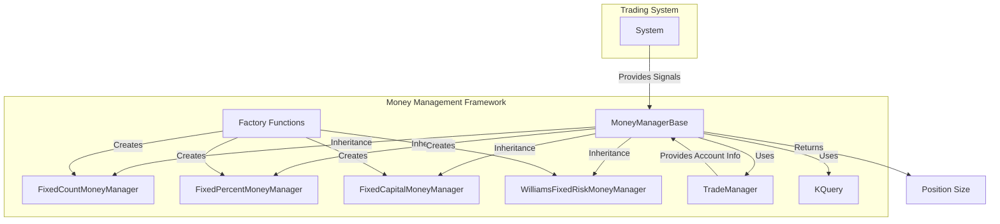
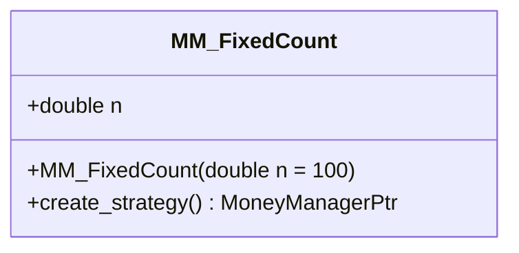
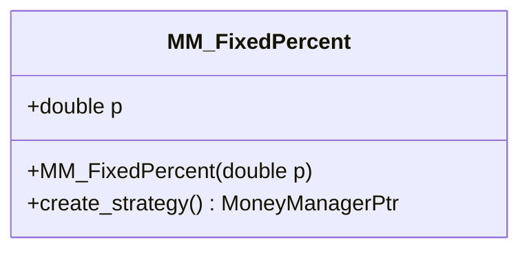
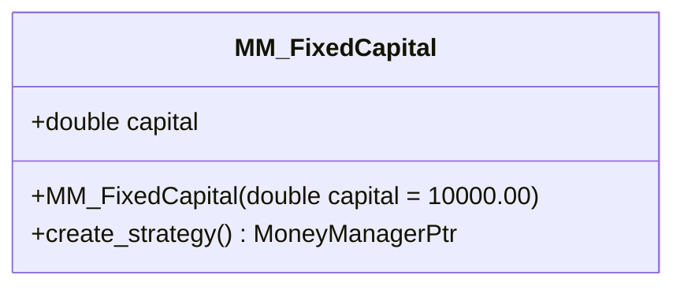
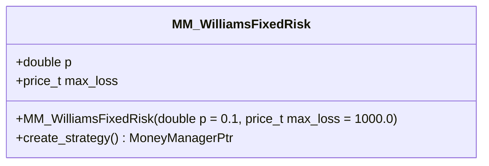
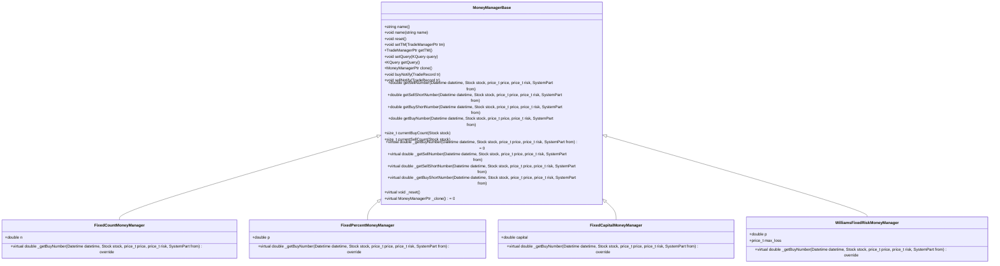
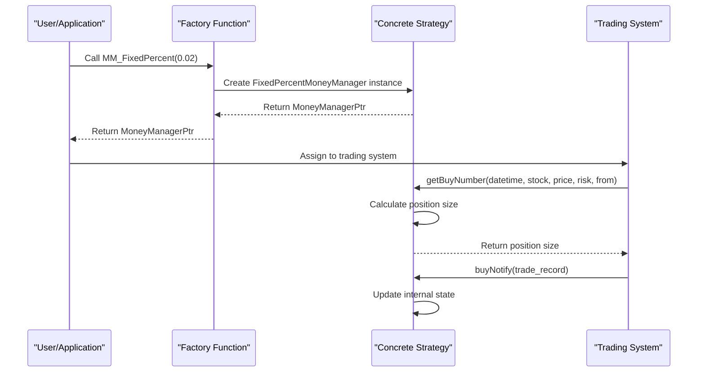
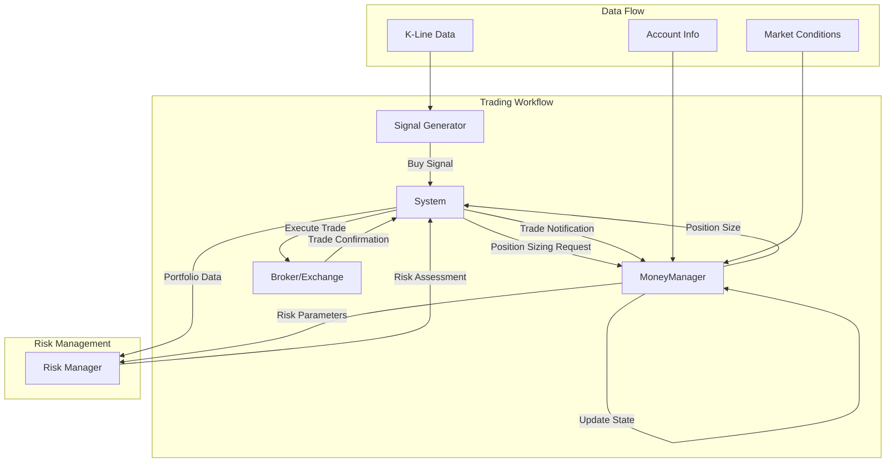
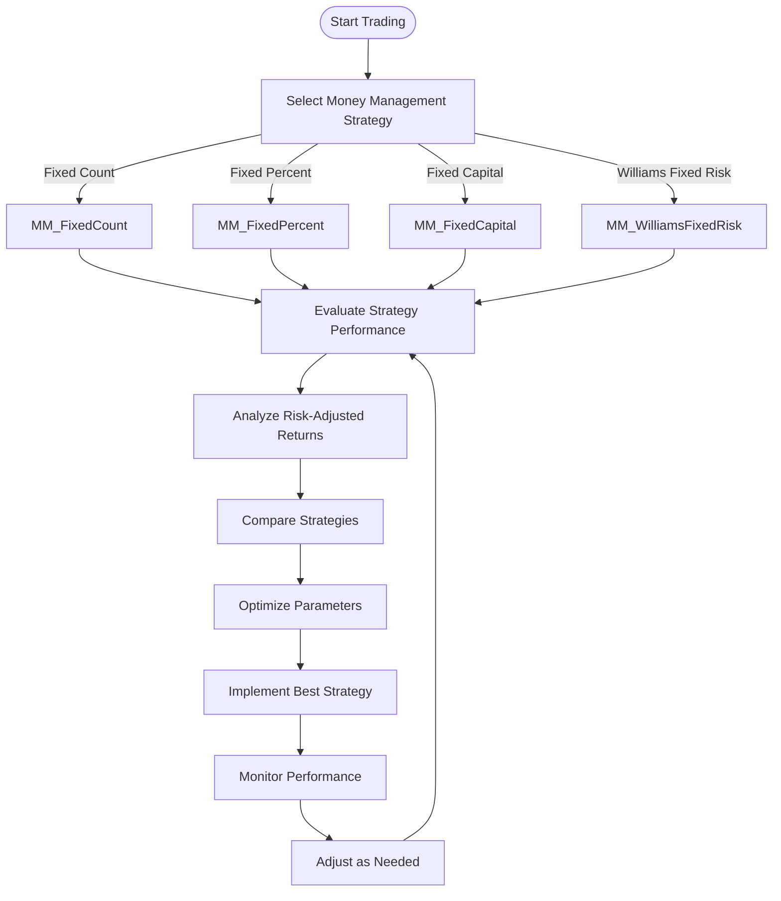

# Money Management

<cite>
**Referenced Files in This Document**   
- [MoneyManagerBase.h](file://hikyuu_cpp/hikyuu/trade_sys/moneymanager/MoneyManagerBase.h)
- [MM_FixedCount.h](file://hikyuu_cpp/hikyuu/trade_sys/moneymanager/crt/MM_FixedCount.h)
- [MM_FixedPercent.h](file://hikyuu_cpp/hikyuu/trade_sys/moneymanager/crt/MM_FixedPercent.h)
- [MM_FixedCapital.h](file://hikyuu_cpp/hikyuu/trade_sys/moneymanager/crt/MM_FixedCapital.h)
- [MM_WilliamsFixedRisk.h](file://hikyuu_cpp/hikyuu/trade_sys/moneymanager/crt/MM_WilliamsFixedRisk.h)
- [FixedCountMoneyManager.h](file://hikyuu_cpp/hikyuu/trade_sys/moneymanager/imp/FixedCountMoneyManager.h)
- [FixedPercentMoneyManager.h](file://hikyuu_cpp/hikyuu/trade_sys/moneymanager/imp/FixedPercentMoneyManager.h)
- [FixedCapitalMoneyManager.h](file://hikyuu_cpp/hikyuu/trade_sys/moneymanager/imp/FixedCapitalMoneyManager.h)
- [WilliamsFixedRiskMoneyManager.h](file://hikyuu_cpp/hikyuu/trade_sys/moneymanager/imp/WilliamsFixedRiskMoneyManager.h)
- [build_in.h](file://hikyuu_cpp/hikyuu/trade_sys/moneymanager/build_in.h)
- [MoneyManager.py](file://hikyuu/test/MoneyManager.py)
</cite>

## Table of Contents
1. [Introduction](#introduction)
2. [Core Components](#core-components)
3. [Position Sizing Strategies](#position-sizing-strategies)
4. [MoneyManagerBase Class Interface](#moneymanagerbase-class-interface)
5. [Strategy Implementation Details](#strategy-implementation-details)
6. [Integration with Trading System](#integration-with-trading-system)
7. [Risk Management and Performance Optimization](#risk-management-and-performance-optimization)
8. [Conclusion](#conclusion)

## Introduction
Money Management in Hikyuu provides a comprehensive framework for position sizing strategies that determine how much capital to allocate to each trade. This system is critical for risk control and portfolio management, allowing traders to implement various money management approaches from simple fixed quantity methods to sophisticated risk-based models. The framework is designed to be extensible, enabling users to create custom strategies while providing several built-in implementations for common position sizing techniques.

**Section sources**
- [MoneyManagerBase.h](file://hikyuu_cpp/hikyuu/trade_sys/moneymanager/MoneyManagerBase.h#L1-L249)

## Core Components

The money management system in Hikyuu consists of a base class `MoneyManagerBase` that defines the interface for all position sizing strategies, with various concrete implementations for different approaches. The system is organized into two main directories: `crt` contains the factory functions that create money management instances, while `imp` contains the actual implementation classes. This separation allows for a clean interface between strategy creation and execution.

The core components include the base class that defines the contract for all money management strategies, specific implementations for different position sizing methods, and factory functions that simplify the creation of these strategies. The system integrates with the broader trading framework through the `TradeManager` and `System` components, receiving signals and providing position sizing recommendations based on the configured strategy.

**Diagram sources**
- [MoneyManagerBase.h](file://hikyuu_cpp/hikyuu/trade_sys/moneymanager/MoneyManagerBase.h#L1-L249)
- [build_in.h](file://hikyuu_cpp/hikyuu/trade_sys/moneymanager/build_in.h#L1-L23)

**Section sources**
- [MoneyManagerBase.h](file://hikyuu_cpp/hikyuu/trade_sys/moneymanager/MoneyManagerBase.h#L1-L249)
- [build_in.h](file://hikyuu_cpp/hikyuu/trade_sys/moneymanager/build_in.h#L1-L23)

## Position Sizing Strategies

Hikyuu implements several position sizing strategies through dedicated factory functions and corresponding implementation classes. Each strategy addresses different risk management approaches and trading philosophies.

### MM_FixedCount
The Fixed Count strategy allocates a fixed number of shares/units for each trade, regardless of account size or risk parameters. This approach is primarily used for testing and comparison purposes rather than real-world trading, as it doesn't consider capital constraints or risk management principles.

**Diagram sources**
- [MM_FixedCount.h](file://hikyuu_cpp/hikyuu/trade_sys/moneymanager/crt/MM_FixedCount.h#L1-L29)
- [FixedCountMoneyManager.h](file://hikyuu_cpp/hikyuu/trade_sys/moneymanager/imp/FixedCountMoneyManager.h#L1-L39)

### MM_FixedPercent
The Fixed Percent strategy implements the percentage risk model described in Van K. Tharp's "Trade Your Way to Financial Freedom." It calculates position size based on a fixed percentage of total capital at risk, using the formula: Position Size = (Total Risk) / (Risk per Share).

**Diagram sources**
- [MM_FixedPercent.h](file://hikyuu_cpp/hikyuu/trade_sys/moneymanager/crt/MM_FixedPercent.h#L1-L28)
- [FixedPercentMoneyManager.h](file://hikyuu_cpp/hikyuu/trade_sys/moneymanager/imp/FixedPercentMoneyManager.h#L1-L35)

### MM_FixedCapital
The Fixed Capital strategy determines position size by dividing available cash by a fixed capital amount. This approach creates positions of varying size based on current account equity, with the formula: Buy Quantity = Current Cash / Capital.

**Diagram sources**
- [MM_FixedCapital.h](file://hikyuu_cpp/hikyuu/trade_sys/moneymanager/crt/MM_FixedCapital.h#L1-L27)
- [FixedCapitalMoneyManager.h](file://hikyuu_cpp/hikyuu/trade_sys/moneymanager/imp/FixedCapitalMoneyManager.h#L1-L29)

### MM_WilliamsFixedRisk
The Williams Fixed Risk strategy calculates position size based on a percentage of account balance and a maximum loss parameter, using the formula: Buy Quantity = (Account Balance × Risk Percentage) / Maximum Loss. This approach explicitly incorporates risk parameters into position sizing decisions.

**Diagram sources**
- [MM_WilliamsFixedRisk.h](file://hikyuu_cpp/hikyuu/trade_sys/moneymanager/crt/MM_WilliamsFixedRisk.h#L1-L28)
- [WilliamsFixedRiskMoneyManager.h](file://hikyuu_cpp/hikyuu/trade_sys/moneymanager/imp/WilliamsFixedRiskMoneyManager.h#L1-L29)

**Section sources**
- [MM_FixedCount.h](file://hikyuu_cpp/hikyuu/trade_sys/moneymanager/crt/MM_FixedCount.h#L1-L29)
- [MM_FixedPercent.h](file://hikyuu_cpp/hikyuu/trade_sys/moneymanager/crt/MM_FixedPercent.h#L1-L28)
- [MM_FixedCapital.h](file://hikyuu_cpp/hikyuu/trade_sys/moneymanager/crt/MM_FixedCapital.h#L1-L27)
- [MM_WilliamsFixedRisk.h](file://hikyuu_cpp/hikyuu/trade_sys/moneymanager/crt/MM_WilliamsFixedRisk.h#L1-L28)

## MoneyManagerBase Class Interface

The `MoneyManagerBase` class serves as the foundation for all money management strategies in Hikyuu, defining a common interface that ensures consistency across different position sizing approaches. This abstract base class implements the template method pattern, with concrete strategies required to implement the core position sizing logic while inheriting common functionality.

Key methods in the interface include:
- `getBuyNumber()`: Calculates the number of units to buy based on current market conditions and risk parameters
- `getSellNumber()`: Determines the number of units to sell
- `setTM()`: Associates the money manager with a specific trade account
- `getQuery()`: Retrieves the K-line query parameters for market data access
- `_clone()`: Enables duplication of money management instances

The class also maintains important state information such as transaction counts and integrates with the system's parameter framework for configuration. The design follows the strategy pattern, allowing different position sizing algorithms to be interchanged at runtime without affecting the overall trading system architecture.

**Diagram sources**
- [MoneyManagerBase.h](file://hikyuu_cpp/hikyuu/trade_sys/moneymanager/MoneyManagerBase.h#L1-L249)
- [FixedCountMoneyManager.h](file://hikyuu_cpp/hikyuu/trade_sys/moneymanager/imp/FixedCountMoneyManager.h#L1-L39)
- [FixedPercentMoneyManager.h](file://hikyuu_cpp/hikyuu/trade_sys/moneymanager/imp/FixedPercentMoneyManager.h#L1-L35)
- [FixedCapitalMoneyManager.h](file://hikyuu_cpp/hikyuu/trade_sys/moneymanager/imp/FixedCapitalMoneyManager.h#L1-L29)
- [WilliamsFixedRiskMoneyManager.h](file://hikyuu_cpp/hikyuu/trade_sys/moneymanager/imp/WilliamsFixedRiskMoneyManager.h#L1-L29)

**Section sources**
- [MoneyManagerBase.h](file://hikyuu_cpp/hikyuu/trade_sys/moneymanager/MoneyManagerBase.h#L1-L249)

## Strategy Implementation Details

Each money management strategy in Hikyuu follows a consistent implementation pattern, inheriting from `MoneyManagerBase` and implementing the required virtual methods. The implementations are located in the `imp` directory and use the `MONEY_MANAGER_IMP` macro to standardize the cloning interface.

The factory functions in the `crt` directory provide a clean API for creating instances of these strategies, hiding the complexity of the underlying implementation. For example, `MM_FixedCount(double n = 100)` creates a new instance of `FixedCountMoneyManager` with the specified quantity, while `MM_FixedPercent(double p)` creates a `FixedPercentMoneyManager` with the specified risk percentage.

All implementations include parameter validation through the `_checkParam` method to ensure that configuration values are within acceptable ranges. The strategies also integrate with Hikyuu's serialization framework through the `MONEY_MANAGER_NO_PRIVATE_MEMBER_SERIALIZATION` macro, allowing money management configurations to be saved and restored.

The system supports both long and short positions, with separate methods for calculating buy/sell quantities for long positions and sell-short/buy-short quantities for short positions. This allows for sophisticated position sizing in both bullish and bearish market conditions.

**Diagram sources**
- [MM_FixedPercent.h](file://hikyuu_cpp/hikyuu/trade_sys/moneymanager/crt/MM_FixedPercent.h#L1-L28)
- [FixedPercentMoneyManager.h](file://hikyuu_cpp/hikyuu/trade_sys/moneymanager/imp/FixedPercentMoneyManager.h#L1-L35)
- [MoneyManagerBase.h](file://hikyuu_cpp/hikyuu/trade_sys/moneymanager/MoneyManagerBase.h#L1-L249)

**Section sources**
- [FixedCountMoneyManager.h](file://hikyuu_cpp/hikyuu/trade_sys/moneymanager/imp/FixedCountMoneyManager.h#L1-L39)
- [FixedPercentMoneyManager.h](file://hikyuu_cpp/hikyuu/trade_sys/moneymanager/imp/FixedPercentMoneyManager.h#L1-L35)
- [FixedCapitalMoneyManager.h](file://hikyuu_cpp/hikyuu/trade_sys/moneymanager/imp/FixedCapitalMoneyManager.h#L1-L29)
- [WilliamsFixedRiskMoneyManager.h](file://hikyuu_cpp/hikyuu/trade_sys/moneymanager/imp/WilliamsFixedRiskMoneyManager.h#L1-L29)

## Integration with Trading System

The money management component integrates seamlessly with Hikyuu's broader trading system architecture, working in conjunction with signal generators, portfolio managers, and risk control modules. When a trading signal is generated by a strategy, the system consults the assigned money manager to determine the appropriate position size before executing the trade.

The integration occurs through well-defined interfaces, with the money manager receiving information about the trading context including the current date/time, stock information, price, and risk parameters. After trade execution, the money manager receives notifications through `buyNotify` and `sellNotify` methods to update its internal state, which is particularly important for strategies that track consecutive buy/sell counts.

This modular design allows traders to mix and match different signal generation strategies with various money management approaches, facilitating systematic testing and optimization of different combinations. The system also supports portfolio-level money management, where position sizing decisions consider the overall portfolio risk rather than individual trade risk in isolation.

**Diagram sources**
- [MoneyManagerBase.h](file://hikyuu_cpp/hikyuu/trade_sys/moneymanager/MoneyManagerBase.h#L1-L249)
- [MoneyManager.py](file://hikyuu/test/MoneyManager.py#L1-L100)

**Section sources**
- [MoneyManagerBase.h](file://hikyuu_cpp/hikyuu/trade_sys/moneymanager/MoneyManagerBase.h#L1-L249)
- [MoneyManager.py](file://hikyuu/test/MoneyManager.py#L1-L100)

## Risk Management and Performance Optimization

Effective money management is fundamental to risk control in trading systems. Hikyuu's framework provides several strategies that incorporate explicit risk parameters into position sizing decisions, helping traders maintain consistent risk exposure across different market conditions.

The MM_FixedPercent and MM_WilliamsFixedRisk strategies are particularly effective for risk management, as they directly link position size to the amount of capital at risk. These approaches help prevent over-leveraging and ensure that no single trade can cause catastrophic losses to the portfolio.

For performance optimization, traders can backtest different money management strategies against historical data to identify the approach that provides the best risk-adjusted returns for their specific trading style and market conditions. The framework's modular design makes it easy to conduct such comparative analysis, allowing systematic evaluation of different position sizing methods.

Best practices for capital allocation include:
- Using risk-based strategies rather than fixed quantity approaches
- Regularly reviewing and adjusting risk parameters based on changing market volatility
- Considering portfolio-level risk rather than individual trade risk
- Implementing position sizing constraints to prevent excessive concentration

**Diagram sources**
- [MM_FixedCount.h](file://hikyuu_cpp/hikyuu/trade_sys/moneymanager/crt/MM_FixedCount.h#L1-L29)
- [MM_FixedPercent.h](file://hikyuu_cpp/hikyuu/trade_sys/moneymanager/crt/MM_FixedPercent.h#L1-L28)
- [MM_FixedCapital.h](file://hikyuu_cpp/hikyuu/trade_sys/moneymanager/crt/MM_FixedCapital.h#L1-L27)
- [MM_WilliamsFixedRisk.h](file://hikyuu_cpp/hikyuu/trade_sys/moneymanager/crt/MM_WilliamsFixedRisk.h#L1-L28)

**Section sources**
- [MoneyManagerBase.h](file://hikyuu_cpp/hikyuu/trade_sys/moneymanager/MoneyManagerBase.h#L1-L249)
- [MoneyManager.py](file://hikyuu/test/MoneyManager.py#L1-L100)

## Conclusion
Hikyuu's money management framework provides a robust and extensible system for position sizing that is essential for effective risk control in algorithmic trading. The architecture, centered around the `MoneyManagerBase` class, supports multiple strategies from simple fixed quantity approaches to sophisticated risk-based models like the percentage risk and Williams fixed risk methods.

The system's design enables easy comparison of different money management techniques through standardized interfaces and factory functions. By integrating position sizing decisions with the broader trading system, Hikyuu allows traders to implement comprehensive risk management that considers both individual trade risk and overall portfolio exposure.

For developers, the framework provides a clear pattern for creating custom money management strategies by extending the base class and implementing the required virtual methods. For traders, the available strategies offer a range of options for controlling risk and optimizing capital allocation based on their specific risk tolerance and trading objectives.

[No sources needed since this section summarizes without analyzing specific files]