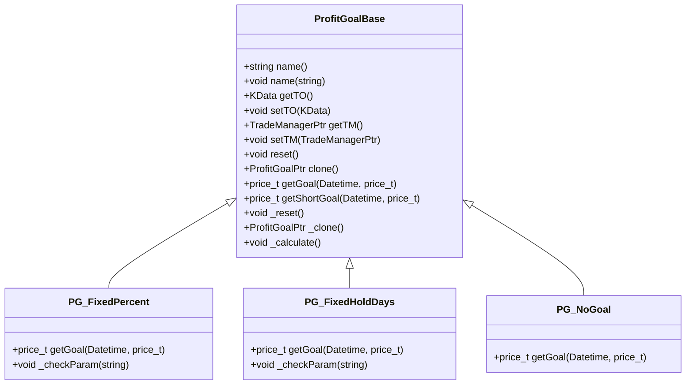
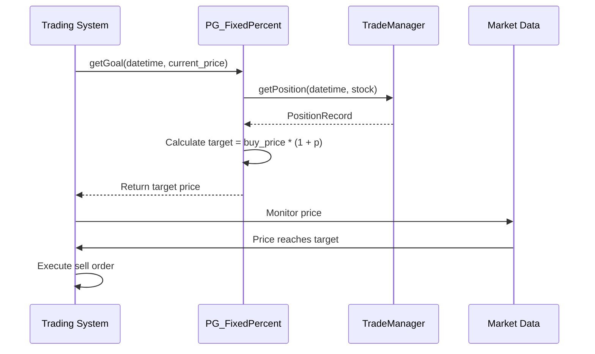
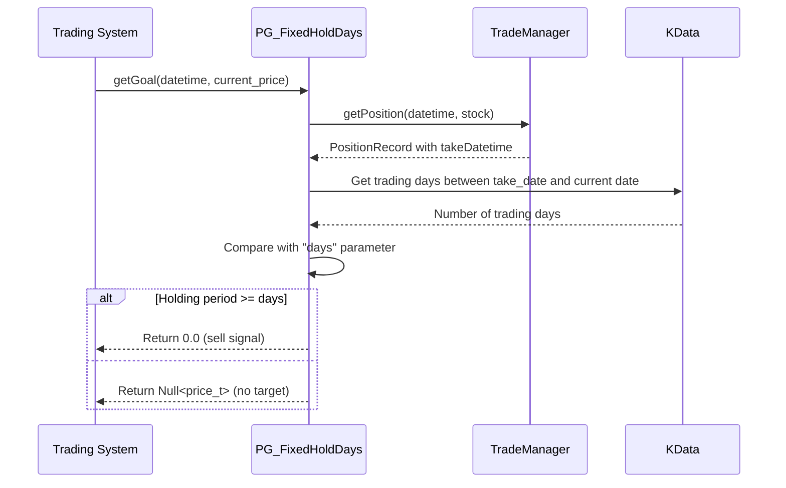
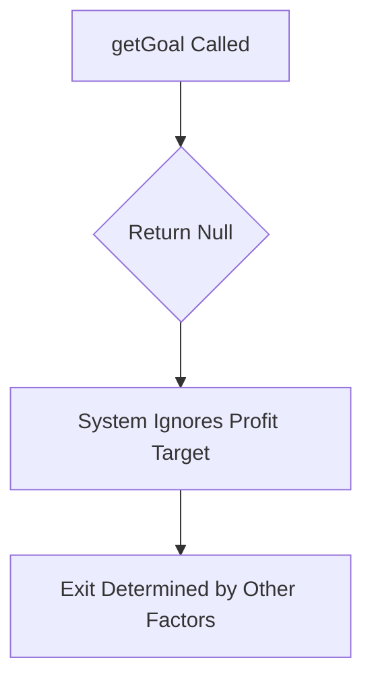
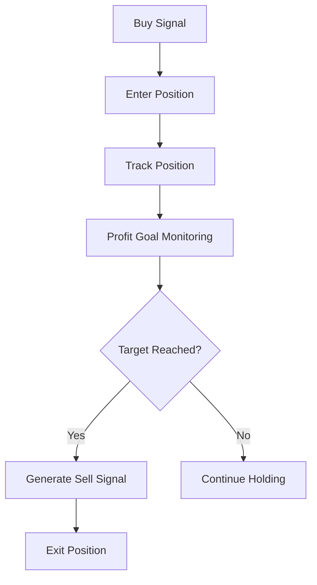
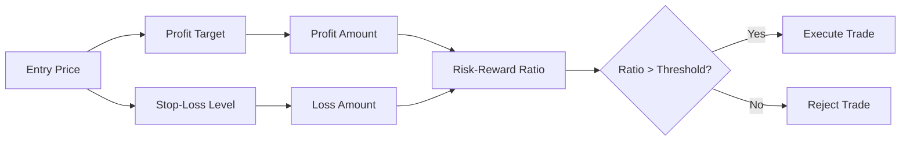

# Profit Goals

<cite>
**Referenced Files in This Document**   
- [ProfitGoalBase.h](file://hikyuu_cpp/hikyuu/trade_sys/profitgoal/ProfitGoalBase.h)
- [ProfitGoalBase.cpp](file://hikyuu_cpp/hikyuu/trade_sys/profitgoal/ProfitGoalBase.cpp)
- [PG_FixedPercent.h](file://hikyuu_cpp/hikyuu/trade_sys/profitgoal/crt/PG_FixedPercent.h)
- [FixedPercentProfitGoal.cpp](file://hikyuu_cpp/hikyuu/trade_sys/profitgoal/imp/FixedPercentProfitGoal.cpp)
- [PG_FixedHoldDays.h](file://hikyuu_cpp/hikyuu/trade_sys/profitgoal/crt/PG_FixedHoldDays.h)
- [FixedHoldDays.cpp](file://hikyuu_cpp/hikyuu/trade_sys/profitgoal/imp/FixedHoldDays.cpp)
- [PG_NoGoal.h](file://hikyuu_cpp/hikyuu/trade_sys/profitgoal/crt/PG_NoGoal.h)
- [NoGoalProfitGoal.cpp](file://hikyuu_cpp/hikyuu/trade_sys/profitgoal/imp/NoGoalProfitGoal.cpp)
- [_ProfitGoal.cpp](file://hikyuu_pywrap/trade_sys/_ProfitGoal.cpp)
- [profitgoal.rst](file://docs/source/trade_sys/profitgoal.rst)
- [ProfitGoal.py](file://hikyuu/test/ProfitGoal.py)
</cite>

## Table of Contents
1. [Introduction](#introduction)
2. [Core Components](#core-components)
3. [Built-in Profit Goal Types](#built-in-profit-goal-types)
4. [Profit Goal Base Class and Interface](#profit-goal-base-class-and-interface)
5. [Creating Custom Profit Goals](#creating-custom-profit-goals)
6. [Integration with Trading System](#integration-with-trading-system)
7. [Advanced Strategies and Optimization](#advanced-strategies-and-optimization)
8. [Common Issues and Solutions](#common-issues-and-solutions)

## Introduction
Profit Goals in Hikyuu represent a crucial component of the trading system that determines when to exit a position based on predefined profit objectives. This system enables traders to implement various profit-taking strategies that can be tailored to different market conditions and risk-reward profiles. The Profit Goal system works in conjunction with other trading components like position management, risk control, and signal generation to create a comprehensive trading framework. By defining clear profit objectives, traders can remove emotional decision-making from their trading process and maintain consistent performance across different market environments.

**Section sources**
- [profitgoal.rst](file://docs/source/trade_sys/profitgoal.rst#L1-L118)

## Core Components

The Profit Goal system in Hikyuu consists of several key components that work together to implement profit-taking strategies. At the core is the `ProfitGoalBase` class, which serves as the foundation for all profit goal implementations. This base class defines the essential interface and functionality that all profit goals must adhere to. Built upon this foundation are specific implementations like `PG_FixedPercent`, `PG_FixedHoldDays`, and `PG_NoGoal`, each representing different profit-taking approaches. The system is designed with extensibility in mind, allowing users to create custom profit goals by inheriting from the base class and implementing the required methods. The profit goal system integrates with the broader trading framework through the `TradeManager` and `KData` components, enabling it to access position information and market data when calculating profit targets.



**Diagram sources**
- [ProfitGoalBase.h](file://hikyuu_cpp/hikyuu/trade_sys/profitgoal/ProfitGoalBase.h#L18-L194)
- [PG_FixedPercent.h](file://hikyuu_cpp/hikyuu/trade_sys/profitgoal/crt/PG_FixedPercent.h#L16-L26)
- [PG_FixedHoldDays.h](file://hikyuu_cpp/hikyuu/trade_sys/profitgoal/crt/PG_FixedHoldDays.h#L17-L27)
- [PG_NoGoal.h](file://hikyuu_cpp/hikyuu/trade_sys/profitgoal/crt/PG_NoGoal.h#L16-L25)

**Section sources**
- [ProfitGoalBase.h](file://hikyuu_cpp/hikyuu/trade_sys/profitgoal/ProfitGoalBase.h#L18-L194)
- [ProfitGoalBase.cpp](file://hikyuu_cpp/hikyuu/trade_sys/profitgoal/ProfitGoalBase.cpp#L1-L71)

## Built-in Profit Goal Types

Hikyuu provides several built-in profit goal types that cover common profit-taking strategies used in trading systems. These implementations serve as both practical tools and examples for creating custom profit goals.

### PG_FixedPercent
The `PG_FixedPercent` profit goal implements a fixed percentage profit target strategy. This approach sets a profit target based on a percentage increase from the entry price. When the market price reaches this target level, the system triggers a sell signal. This strategy is particularly useful for maintaining consistent risk-reward ratios across trades and is commonly used in trend-following systems.



**Diagram sources**
- [PG_FixedPercent.h](file://hikyuu_cpp/hikyuu/trade_sys/profitgoal/crt/PG_FixedPercent.h#L16-L26)
- [FixedPercentProfitGoal.cpp](file://hikyuu_cpp/hikyuu/trade_sys/profitgoal/imp/FixedPercentProfitGoal.cpp#L1-L51)

### PG_FixedHoldDays
The `PG_FixedHoldDays` profit goal implements a time-based profit strategy that limits the maximum holding period for a position. This approach forces the system to exit a position after a predetermined number of trading days, regardless of whether a profit target has been reached. This strategy helps prevent positions from being held indefinitely and can be particularly effective in range-bound markets.



**Diagram sources**
- [PG_FixedHoldDays.h](file://hikyuu_cpp/hikyuu/trade_sys/profitgoal/crt/PG_FixedHoldDays.h#L17-L27)
- [FixedHoldDays.cpp](file://hikyuu_cpp/hikyuu/trade_sys/profitgoal/imp/FixedHoldDays.cpp#L1-L54)

### PG_NoGoal
The `PG_NoGoal` profit goal represents a strategy with no predefined profit target. This implementation returns a null value for the profit goal, effectively disabling profit-based exit signals. This approach is typically used for testing purposes or in conjunction with other exit strategies like stop-loss or technical indicators.



**Diagram sources**
- [PG_NoGoal.h](file://hikyuu_cpp/hikyuu/trade_sys/profitgoal/crt/PG_NoGoal.h#L16-L25)
- [NoGoalProfitGoal.cpp](file://hikyuu_cpp/hikyuu/trade_sys/profitgoal/imp/NoGoalProfitGoal.cpp#L1-L29)

**Section sources**
- [PG_FixedPercent.h](file://hikyuu_cpp/hikyuu/trade_sys/profitgoal/crt/PG_FixedPercent.h#L16-L26)
- [FixedPercentProfitGoal.cpp](file://hikyuu_cpp/hikyuu/trade_sys/profitgoal/imp/FixedPercentProfitGoal.cpp#L1-L51)
- [PG_FixedHoldDays.h](file://hikyuu_cpp/hikyuu/trade_sys/profitgoal/crt/PG_FixedHoldDays.h#L17-L27)
- [FixedHoldDays.cpp](file://hikyuu_cpp/hikyuu/trade_sys/profitgoal/imp/FixedHoldDays.cpp#L1-L54)
- [PG_NoGoal.h](file://hikyuu_cpp/hikyuu/trade_sys/profitgoal/crt/PG_NoGoal.h#L16-L25)
- [NoGoalProfitGoal.cpp](file://hikyuu_cpp/hikyuu/trade_sys/profitgoal/imp/NoGoalProfitGoal.cpp#L1-L29)

## Profit Goal Base Class and Interface

The `ProfitGoalBase` class serves as the foundation for all profit goal implementations in Hikyuu. It defines the essential interface and provides common functionality that all profit goals inherit.

### Key Methods and Properties
The base class exposes several important methods and properties that enable integration with the trading system:

- **name**: Gets or sets the name of the profit goal strategy
- **to**: Gets or sets the transaction object (KData) containing market data
- **tm**: Gets or sets the trade manager responsible for position tracking
- **getGoal**: Abstract method that must be implemented to calculate the profit target
- **clone**: Creates a copy of the profit goal instance
- **reset**: Resets the internal state of the profit goal

### Required Interface Implementation
All derived classes must implement the following methods:

- **getGoal**: Calculates and returns the profit target price based on current market conditions
- **_clone**: Creates and returns a new instance of the profit goal with the same parameters
- **_calculate**: Performs any necessary calculations when new market data is available

Optional methods that can be overridden include:

- **_reset**: Resets any internal state variables
- **buyNotify**: Receives notifications when a buy transaction occurs
- **sellNotify**: Receives notifications when a sell transaction occurs

```mermaid
classDiagram
class ProfitGoalBase {
<<abstract>>
+string name()
+void name(string)
+KData getTO()
+void setTO(KData)
+TradeManagerPtr getTM()
+void setTM(TradeManagerPtr)
+void reset()
+ProfitGoalPtr clone()
+price_t getGoal(Datetime, price_t)
+price_t getShortGoal(Datetime, price_t)
+void _reset()
+ProfitGoalPtr _clone()
+void _calculate()
}
note right of ProfitGoalBase
Abstract base class for all profit goals
Must implement getGoal, _clone, _calculate
Can optionally override _reset, buyNotify, sellNotify
end note
```

**Diagram sources**
- [ProfitGoalBase.h](file://hikyuu_cpp/hikyuu/trade_sys/profitgoal/ProfitGoalBase.h#L18-L194)
- [_ProfitGoal.cpp](file://hikyuu_pywrap/trade_sys/_ProfitGoal.cpp#L14-L45)

**Section sources**
- [ProfitGoalBase.h](file://hikyuu_cpp/hikyuu/trade_sys/profitgoal/ProfitGoalBase.h#L18-L194)
- [ProfitGoalBase.cpp](file://hikyuu_cpp/hikyuu/trade_sys/profitgoal/ProfitGoalBase.cpp#L1-L71)
- [_ProfitGoal.cpp](file://hikyuu_pywrap/trade_sys/_ProfitGoal.cpp#L1-L145)

## Creating Custom Profit Goals

Hikyuu provides a flexible framework for creating custom profit goals that can implement sophisticated profit-taking strategies beyond the built-in options.

### Python Implementation
Users can create custom profit goals in Python by inheriting from the `ProfitGoalBase` class and implementing the required methods:

```python
class CustomProfitGoal(ProfitGoalBase):
    def __init__(self):
        super(CustomProfitGoal, self).__init__("CustomProfitGoal")
        self._state = 0
    
    def get_goal(self, datetime, price):
        # Custom logic to calculate profit target
        if self._state < 5:
            return 0.0
        return price * 1.1  # 10% profit target
    
    def _reset(self):
        self._state = 0
    
    def _clone(self):
        p = CustomProfitGoal()
        p._state = self._state
        return p
    
    def _calculate(self):
        # Perform calculations based on market data
        pass
```

### C++ Implementation
For performance-critical applications, custom profit goals can be implemented in C++:

```cpp
class CustomProfitGoal : public ProfitGoalBase {
    PROFITGOAL_IMP(CustomProfitGoal)
    PROFIT_GOAL_NO_PRIVATE_MEMBER_SERIALIZATION

public:
    CustomProfitGoal() : ProfitGoalBase("CustomProfitGoal"), m_state(0) {}
    
    virtual price_t getGoal(const Datetime& datetime, price_t price) override {
        if (m_state < 5) {
            return 0.0;
        }
        return price * 1.1; // 10% profit target
    }
    
    virtual void _reset() override {
        m_state = 0;
    }
    
    virtual ProfitGoalPtr _clone() override {
        auto p = make_shared<CustomProfitGoal>();
        p->m_state = m_state;
        return p;
    }
    
    virtual void _calculate() override {
        // Perform calculations based on market data
    }

private:
    int m_state;
};
```

### Parameterized Strategies
Custom profit goals can accept parameters to make them more flexible and reusable:

```python
def create_dynamic_profit_goal(percent=0.1, min_days=3):
    def get_goal(self, datetime, price):
        position = self.tm.getPosition(datetime, self.to.getStock())
        days_held = calculate_trading_days(position.takeDatetime, datetime)
        
        if days_held >= min_days:
            return position.buyMoney / position.number * (1 + percent)
        return Null<price_t>()
    
    pg = crtPG(lambda self: None, params={'percent': percent, 'min_days': min_days})
    pg.get_goal = get_goal
    pg.name = f"DynamicProfitGoal({percent*100}%,{min_days}d)"
    return pg
```

**Section sources**
- [ProfitGoal.py](file://hikyuu/test/ProfitGoal.py#L15-L35)
- [_ProfitGoal.cpp](file://hikyuu_pywrap/trade_sys/_ProfitGoal.cpp#L47-L144)
- [profitgoal.rst](file://docs/source/trade_sys/profitgoal.rst#L34-L42)

## Integration with Trading System

The profit goal system integrates seamlessly with other components of the Hikyuu trading framework to create a cohesive trading strategy.

### Position Management Integration
Profit goals work closely with the position management system to determine exit points based on current holdings:



The `TradeManager` provides position information to the profit goal, including entry price, quantity, and entry date, which are essential for calculating profit targets.

### Risk-Reward Optimization
Profit goals can be combined with stop-loss strategies to optimize the risk-reward profile of a trading system:



By setting appropriate profit targets and stop-loss levels, traders can ensure that their potential rewards justify the risks taken on each trade.

**Section sources**
- [FixedPercentProfitGoal.cpp](file://hikyuu_cpp/hikyuu/trade_sys/profitgoal/imp/FixedPercentProfitGoal.cpp#L36-L41)
- [FixedHoldDays.cpp](file://hikyuu_cpp/hikyuu/trade_sys/profitgoal/imp/FixedHoldDays.cpp#L30-L42)
- [ProfitGoalBase.h](file://hikyuu_cpp/hikyuu/trade_sys/profitgoal/ProfitGoalBase.h#L32-L42)

## Advanced Strategies and Optimization

Beyond the basic implementations, Hikyuu supports advanced profit goal strategies that can adapt to changing market conditions.

### Adaptive Profit Goals
Dynamic profit goals can adjust their targets based on market volatility, trend strength, or other technical indicators:

```python
class AdaptiveProfitGoal(ProfitGoalBase):
    def __init__(self):
        super().__init__("AdaptiveProfitGoal")
        self.volatility_factor = 1.0
    
    def _calculate(self):
        # Update volatility factor based on recent price movements
        kdata = self.to
        if len(kdata) > 20:
            prices = [r.close for r in kdata]
            returns = [prices[i]/prices[i-1]-1 for i in range(1, len(prices))]
            std_dev = statistics.stdev(returns)
            self.volatility_factor = max(0.5, min(2.0, std_dev * 10))
    
    def get_goal(self, datetime, price):
        base_target = price * 1.05  # 5% base target
        adaptive_target = base_target * self.volatility_factor
        return adaptive_target
```

### Partial Profit Taking
Strategies can implement partial profit taking to lock in gains while maintaining exposure to further upside:

```python
class PartialTakeProfit(ProfitGoalBase):
    def __init__(self):
        super().__init__("PartialTakeProfit")
        self.first_target_hit = False
    
    def get_goal(self, datetime, price):
        position = self.tm.getPosition(datetime, self.to.getStock())
        
        if not self.first_target_hit and price >= position.buyPrice * 1.05:
            self.first_target_hit = True
            return position.buyPrice * 1.05  # Sell 50% at 5% profit
        
        if self.first_target_hit and price >= position.buyPrice * 1.10:
            return position.buyPrice * 1.10  # Sell remaining 50% at 10% profit
        
        return Null<price_t>()
```

### Machine Learning Integration
Profit goals can incorporate machine learning models to predict optimal exit points:

```python
class MLProfitGoal(ProfitGoalBase):
    def __init__(self, model_path):
        super().__init__("MLProfitGoal")
        self.model = load_model(model_path)
        self.feature_buffer = []
    
    def _calculate(self):
        # Extract features from market data
        features = extract_features(self.to)
        self.feature_buffer.append(features)
        if len(self.feature_buffer) > 10:
            self.feature_buffer.pop(0)
    
    def get_goal(self, datetime, price):
        if len(self.feature_buffer) < 10:
            return Null<price_t>()
        
        # Predict optimal exit point
        prediction = self.model.predict([self.feature_buffer])
        return price * (1 + prediction[0])
```

**Section sources**
- [FixedPercentProfitGoal.cpp](file://hikyuu_cpp/hikyuu/trade_sys/profitgoal/imp/FixedPercentProfitGoal.cpp#L36-L41)
- [FixedHoldDays.cpp](file://hikyuu_cpp/hikyuu/trade_sys/profitgoal/imp/FixedHoldDays.cpp#L29-L44)
- [ProfitGoal.py](file://hikyuu/test/ProfitGoal.py#L15-L35)

## Common Issues and Solutions

When working with profit goals in Hikyuu, several common issues may arise that require specific solutions.

### Profit Target Optimization
Finding the optimal profit target parameters can be challenging. A systematic approach involves:

1. Backtesting different profit target levels across various market conditions
2. Analyzing the risk-reward ratio for each configuration
3. Considering the win rate and average profit per trade
4. Using optimization algorithms to find the best parameter combination

```python
def optimize_profit_target(strategy, min_percent=0.01, max_percent=0.3, step=0.01):
    best_score = -float('inf')
    best_target = min_percent
    
    for target in np.arange(min_percent, max_percent, step):
        pg = PG_FixedPercent(target)
        strategy.profit_goal = pg
        result = backtest(strategy)
        score = result.total_return / result.max_drawdown  # Sharpe-like ratio
        
        if score > best_score:
            best_score = score
            best_target = target
    
    return best_target
```

### Handling Multiple Positions
When dealing with multiple positions in the same security, profit goals need to account for the average cost basis:

```cpp
price_t FixedPercentProfitGoal::getGoal(const Datetime& datetime, price_t price) {
    Stock stock = getTO().getStock();
    PositionRecord position = getTM()->getPosition(datetime, stock);
    
    // Use average cost for multiple positions
    price_t avg_cost = position.buyMoney / position.number;
    return avg_cost * (1 + getParam<double>("p"));
}
```

### Adaptive Goal Setting
Markets change over time, requiring profit goals to adapt to current conditions:

```python
class AdaptiveProfitGoal(ProfitGoalBase):
    def __init__(self):
        super().__init__("AdaptiveProfitGoal")
        self.market_regime = "normal"
    
    def _calculate(self):
        # Detect market regime (trending, ranging, volatile)
        kdata = self.to
        if len(kdata) > 50:
            # Calculate ADX to detect trend strength
            adx = calculate_adx(kdata)
            if adx > 25:
                self.market_regime = "trending"
            elif adx < 15:
                self.market_regime = "ranging"
            else:
                self.market_regime = "volatile"
    
    def get_goal(self, datetime, price):
        if self.market_regime == "trending":
            return price * 1.10  # Higher target in trending markets
        elif self.market_regime == "ranging":
            return price * 1.03  # Lower target in ranging markets
        else:
            return price * 1.06  # Medium target in volatile markets
```

**Section sources**
- [FixedPercentProfitGoal.cpp](file://hikyuu_cpp/hikyuu/trade_sys/profitgoal/imp/FixedPercentProfitGoal.cpp#L36-L41)
- [FixedHoldDays.cpp](file://hikyuu_cpp/hikyuu/trade_sys/profitgoal/imp/FixedHoldDays.cpp#L29-L44)
- [ProfitGoalBase.h](file://hikyuu_cpp/hikyuu/trade_sys/profitgoal/ProfitGoalBase.h#L56-L105)