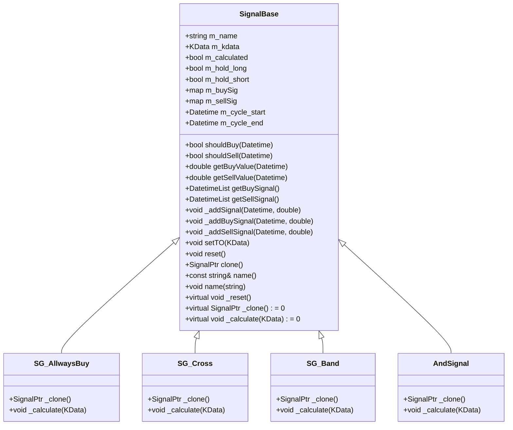
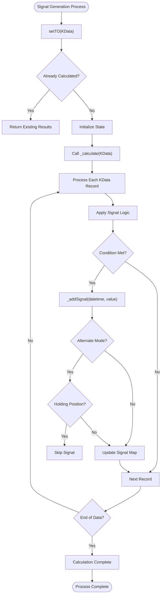
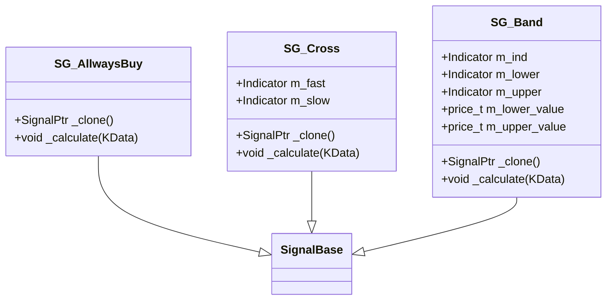
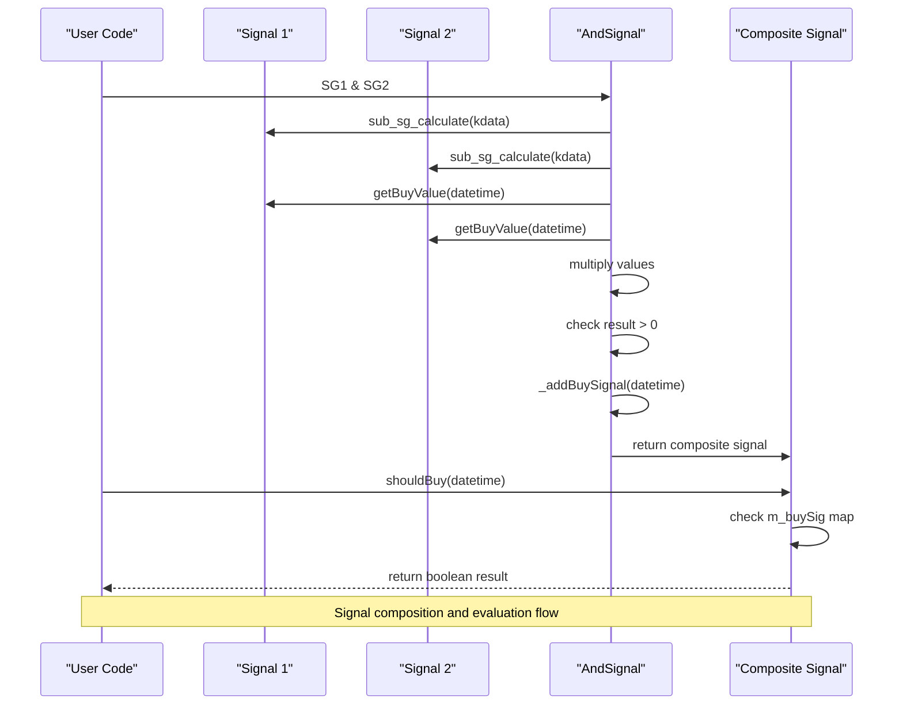

# Signal Indicators

<cite>
**Referenced Files in This Document**   
- [SignalBase.h](file://hikyuu_cpp/hikyuu/trade_sys/signal/SignalBase.h)
- [SignalBase.cpp](file://hikyuu_cpp/hikyuu/trade_sys/signal/SignalBase.cpp)
- [SG_AllwaysBuy.h](file://hikyuu_cpp/hikyuu/trade_sys/signal/crt/SG_AllwaysBuy.h)
- [SG_Cross.h](file://hikyuu_cpp/hikyuu/trade_sys/signal/crt/SG_Cross.h)
- [SG_Band.h](file://hikyuu_cpp/hikyuu/trade_sys/signal/crt/SG_Band.h)
- [SG_Logic.h](file://hikyuu_cpp/hikyuu/trade_sys/signal/crt/SG_Logic.h)
- [AndSignal.cpp](file://hikyuu_cpp/hikyuu/trade_sys/signal/imp/logic/AndSignal.cpp)
- [_Signal.cpp](file://hikyuu_pywrap/trade_sys/_Signal.cpp)
</cite>

## Table of Contents
1. [Introduction](#introduction)
2. [Core Architecture](#core-architecture)
3. [Signal Generation Mechanism](#signal-generation-mechanism)
4. [Available Signal Types](#available-signal-types)
5. [Signal Composition and Logical Operators](#signal-composition-and-logical-operators)
6. [Relationship with Other Trading Components](#relationship-with-other-trading-components)
7. [Common Issues and Optimization Techniques](#common-issues-and-optimization-techniques)
8. [Conclusion](#conclusion)

## Introduction

Signal Indicators in Hikyuu are fundamental components of the trading system that generate entry and exit signals based on technical analysis. These signals drive trading decisions by determining when to buy or sell financial instruments. The system provides a flexible framework for creating both simple and complex signal strategies, allowing users to implement various trading logic from basic always-buy signals to sophisticated multi-indicator combinations. This document provides a comprehensive overview of the signal indicator system, focusing on implementation details, available signal types, and advanced composition patterns.

**Section sources**
- [SignalBase.h](file://hikyuu_cpp/hikyuu/trade_sys/signal/SignalBase.h#L20-L23)
- [SignalBase.cpp](file://hikyuu_cpp/hikyuu/trade_sys/signal/SignalBase.cpp#L1-L217)

## Core Architecture

The signal indicator system in Hikyuu is built around the `SignalBase` class, which serves as the foundation for all signal implementations. This base class provides essential functionality for signal generation, management, and evaluation. The architecture follows an object-oriented design with inheritance and polymorphism principles, allowing for extensibility and customization.

The `SignalBase` class maintains state information including buy and sell signals, position status (long or short), and calculation parameters. It uses a map-based storage system to preserve chronological order of signals, with separate maps for buy and sell indications. The class implements the Template Method pattern, where the base class defines the algorithm structure while derived classes implement specific calculation logic through the `_calculate` method.

Key architectural features include parameter management through the `Parameter` system, support for serialization via Boost.Serialization, and thread-safe operations. The design emphasizes performance with efficient data structures and minimal overhead in signal evaluation.



**Diagram sources**
- [SignalBase.h](file://hikyuu_cpp/hikyuu/trade_sys/signal/SignalBase.h#L24-L294)
- [SG_AllwaysBuy.h](file://hikyuu_cpp/hikyuu/trade_sys/signal/crt/SG_AllwaysBuy.h#L18)
- [SG_Cross.h](file://hikyuu_cpp/hikyuu/trade_sys/signal/crt/SG_Cross.h#L24)
- [SG_Band.h](file://hikyuu_cpp/hikyuu/trade_sys/signal/crt/SG_Band.h#L24-L33)
- [AndSignal.cpp](file://hikyuu_cpp/hikyuu/trade_sys/signal/imp/logic/AndSignal.cpp#L16-L35)

**Section sources**
- [SignalBase.h](file://hikyuu_cpp/hikyuu/trade_sys/signal/SignalBase.h#L24-L294)
- [SignalBase.cpp](file://hikyuu_cpp/hikyuu/trade_sys/signal/SignalBase.cpp#L27-L72)

## Signal Generation Mechanism

The signal generation process in Hikyuu follows a systematic approach that begins with setting the trading object (KData) and culminates in the evaluation of buy and sell conditions. The core mechanism revolves around the `_calculate` method, which is implemented by each specific signal type to define its unique logic.

When a signal indicator is assigned to a KData series through the `setTO` method, the system triggers the calculation process. The base implementation in `SignalBase` handles common setup tasks, including parameter validation and state initialization, before delegating to the derived class's `_calculate` method. This method iterates through the KData records, applying the specific signal logic at each time point.

The `_addSignal` method plays a crucial role in signal generation by managing the addition of buy and sell indications while respecting the alternating signal constraint. When `alternate` parameter is set to true (default), the system ensures that buy and sell signals alternate, preventing consecutive buy or sell signals. This behavior can be modified by setting the `alternate` parameter to false, allowing for multiple signals of the same type in sequence.

Signal values are stored as positive numbers for buy signals and negative numbers for sell signals, with the magnitude potentially representing signal strength. The system maintains separate maps for buy and sell signals, enabling efficient lookup and chronological ordering.



**Diagram sources**
- [SignalBase.cpp](file://hikyuu_cpp/hikyuu/trade_sys/signal/SignalBase.cpp#L75-L88)
- [SignalBase.cpp](file://hikyuu_cpp/hikyuu/trade_sys/signal/SignalBase.cpp#L143-L201)
- [SignalBase.h](file://hikyuu_cpp/hikyuu/trade_sys/signal/SignalBase.h#L131)

**Section sources**
- [SignalBase.cpp](file://hikyuu_cpp/hikyuu/trade_sys/signal/SignalBase.cpp#L75-L88)
- [SignalBase.cpp](file://hikyuu_cpp/hikyuu/trade_sys/signal/SignalBase.cpp#L143-L201)

## Available Signal Types

Hikyuu provides several built-in signal types that cater to different trading strategies and analytical approaches. These signal types are implemented as derived classes of `SignalBase` and exposed through factory functions for easy instantiation.

The `SG_AllwaysBuy` signal is a special case that generates a buy signal at every time point. This signal is primarily used in portfolio management contexts, particularly with MultiFactor systems where it serves as a matching mechanism for stock selection without imposing timing constraints.

The `SG_Cross` signal implements the classic moving average crossover strategy, generating buy signals when a faster indicator crosses above a slower one, and sell signals when it crosses below. This signal type is widely used in trend-following strategies and can be applied to various indicator combinations beyond simple moving averages.

The `SG_Band` signal operates on the principle of overbought/oversold conditions, generating buy signals when an indicator falls below a lower threshold and sell signals when it exceeds an upper threshold. This signal is particularly effective for oscillators like RSI and Stochastic, where values naturally fluctuate within defined ranges.

Additional signal types include logical operators that allow for the combination of multiple signals, as well as specialized signals like `SG_CrossGold` for golden/death cross detection and `SG_Cycle` for periodic rebalancing strategies.



**Diagram sources**
- [SG_AllwaysBuy.h](file://hikyuu_cpp/hikyuu/trade_sys/signal/crt/SG_AllwaysBuy.h#L18)
- [SG_Cross.h](file://hikyuu_cpp/hikyuu/trade_sys/signal/crt/SG_Cross.h#L24)
- [SG_Band.h](file://hikyuu_cpp/hikyuu/trade_sys/signal/crt/SG_Band.h#L24-L33)

**Section sources**
- [SG_AllwaysBuy.h](file://hikyuu_cpp/hikyuu/trade_sys/signal/crt/SG_AllwaysBuy.h#L13-L20)
- [SG_Cross.h](file://hikyuu_cpp/hikyuu/trade_sys/signal/crt/SG_Cross.h#L17-L28)
- [SG_Band.h](file://hikyuu_cpp/hikyuu/trade_sys/signal/crt/SG_Band.h#L16-L37)

## Signal Composition and Logical Operators

Hikyuu enables sophisticated signal strategies through a comprehensive system of logical operators that allow the combination of multiple signal indicators. These operators are implemented as overloaded arithmetic and logical operators on the `SignalPtr` type, providing an intuitive syntax for signal composition.

The system supports four primary arithmetic operators: addition (+), subtraction (-), multiplication (*), and division (/). These operators combine signal values numerically, with the resulting signal's value being the arithmetic combination of the input signals. For example, adding two signals creates a composite signal where the strength of the indication is the sum of the individual signal strengths.

Logical operators include AND (&) and OR (|), which provide boolean-style combination of signals. The AND operator generates a buy signal only when both input signals generate buy signals, while the OR operator generates a buy signal when either input signal generates a buy signal. These operators are particularly useful for creating confirmation systems that require multiple conditions to be met.

To address the complexity of signal alternation in composed signals, Hikyuu provides explicit composition functions such as `SG_Add`, `SG_Sub`, `SG_And`, and `SG_Or`. These functions allow explicit control over the `alternate` parameter, preventing unexpected behavior when combining multiple signals. This is particularly important because the default `alternate` parameter is true, which can lead to counterintuitive results in complex signal compositions.



**Diagram sources**
- [SG_Logic.h](file://hikyuu_cpp/hikyuu/trade_sys/signal/crt/SG_Logic.h#L14-L31)
- [AndSignal.cpp](file://hikyuu_cpp/hikyuu/trade_sys/signal/imp/logic/AndSignal.cpp#L16-L35)
- [_Signal.cpp](file://hikyuu_pywrap/trade_sys/_Signal.cpp#L246-L313)

**Section sources**
- [SG_Logic.h](file://hikyuu_cpp/hikyuu/trade_sys/signal/crt/SG_Logic.h#L37-L127)
- [AndSignal.cpp](file://hikyuu_cpp/hikyuu/trade_sys/signal/imp/logic/AndSignal.cpp#L16-L35)

## Relationship with Other Trading Components

Signal indicators in Hikyuu are integral components of a larger trading system architecture, interacting closely with indicators, KData, and other system parts. The relationship between these components forms a cohesive framework for algorithmic trading strategy implementation.

Signal indicators depend directly on indicators for their calculations, using indicator values as input for signal generation logic. For example, the `SG_Cross` signal requires two indicator inputs (fast and slow), while `SG_Band` requires an indicator and upper/lower bounds. This dependency creates a clear separation of concerns, where indicators handle mathematical calculations and signal indicators handle trading logic based on those calculations.

The KData component serves as the data source for both indicators and signal indicators. When a signal indicator is assigned to a KData series via `setTO`, it triggers the calculation process that uses the KData's price and volume information. This relationship ensures that all signal calculations are synchronized with the same market data timeline.

Signal indicators are typically used within a System context, where they are combined with other components like MoneyManager, Stoploss, and ProfitGoal. The system evaluates the signal indicator's output to determine when to execute trades, making the signal indicator the primary driver of entry and exit decisions. This integration allows for sophisticated trading strategies that combine multiple analytical approaches.

```mermaid
graph TB
subgraph "Data Layer"
KData[(KData)]
end
subgraph "Analysis Layer"
Indicator[Indicator]
Signal[Signal Indicator]
end
subgraph "Trading System"
System[System]
MM[MoneyManager]
SL[Stoploss]
PG[ProfitGoal]
end
KData --> Indicator
KData --> Signal
Indicator --> Signal
Signal --> System
MM --> System
SL --> System
PG --> System
style KData fill:#f9f,stroke:#333
style Indicator fill:#bbf,stroke:#333
style Signal fill:#f96,stroke:#333
style System fill:#6f9,stroke:#333
style MM fill:#69f,stroke:#333
style SL fill:#69f,stroke:#333
style PG fill:#69f,stroke:#333
Note: "Component relationships in Hikyuu trading system"
```

**Diagram sources**
- [SignalBase.h](file://hikyuu_cpp/hikyuu/trade_sys/signal/SignalBase.h#L13)
- [indicator.py](file://hikyuu/indicator/indicator.py)
- [trade_sys.py](file://hikyuu/trade_sys/trade_sys.py)

**Section sources**
- [SignalBase.h](file://hikyuu_cpp/hikyuu/trade_sys/signal/SignalBase.h#L99-L105)
- [indicator.py](file://hikyuu/indicator/indicator.py)
- [trade_sys.py](file://hikyuu/trade_sys/trade_sys.py)

## Common Issues and Optimization Techniques

Implementing signal indicators in Hikyuu presents several common challenges that traders and developers must address to create effective trading strategies. Understanding these issues and applying appropriate optimization techniques is crucial for developing robust and profitable systems.

One of the most prevalent issues is signal timing, where the generated signals may not align perfectly with optimal entry and exit points due to data frequency limitations or calculation delays. This can be mitigated by using higher frequency data when available and carefully considering the lookback period of indicators used in signal generation.

False positives represent another significant challenge, where signals are generated based on temporary market noise rather than genuine trend changes. This issue can be addressed through signal confirmation techniques, such as requiring multiple indicators to agree before generating a signal, or implementing filters based on volume or volatility.

The alternating signal constraint (controlled by the `alternate` parameter) can lead to unexpected behavior in complex signal compositions. When combining multiple signals, developers should explicitly manage the `alternate` parameter using the `SG_Add`, `SG_And`, and other composition functions to ensure predictable behavior. Setting `alternate` to false may be appropriate for certain strategies that allow consecutive signals of the same type.

Optimization techniques include parameter tuning through backtesting, where different parameter values are tested to find optimal settings. However, care must be taken to avoid overfitting, where a strategy performs well on historical data but fails on new data. Walk-forward optimization, where the strategy is periodically re-optimized using a rolling window of data, can help maintain performance across changing market conditions.

Performance optimization is also important, particularly for complex signal compositions. Caching indicator calculations and minimizing redundant computations can significantly improve execution speed. The use of efficient data structures and algorithms in custom signal implementations can further enhance performance.

**Section sources**
- [SignalBase.cpp](file://hikyuu_cpp/hikyuu/trade_sys/signal/SignalBase.cpp#L38-L41)
- [SG_Logic.h](file://hikyuu_cpp/hikyuu/trade_sys/signal/crt/SG_Logic.h#L33-L35)
- [SignalBase.h](file://hikyuu_cpp/hikyuu/trade_sys/signal/SignalBase.h#L39-L45)

## Conclusion

Signal Indicators in Hikyuu provide a powerful and flexible framework for implementing trading strategies based on technical analysis. The system's object-oriented architecture, centered around the `SignalBase` class, enables both simple and complex signal implementations while maintaining consistency and extensibility. With built-in signal types like `SG_AllwaysBuy`, `SG_Cross`, and `SG_Band`, users can quickly implement common trading strategies, while the logical operator system allows for sophisticated signal composition.

The integration of signal indicators with other trading components creates a comprehensive ecosystem for algorithmic trading, where signals drive trading decisions within a larger system context. By understanding the nuances of signal generation, particularly the alternating signal behavior and composition rules, developers can create robust and effective trading strategies.

For beginners, the system provides accessible entry points with straightforward signal types and intuitive composition syntax. For experienced developers, the extensible architecture allows for the creation of custom signal indicators and advanced optimization techniques. The balance between simplicity and power makes Hikyuu's signal indicator system suitable for a wide range of trading applications, from basic trend-following strategies to complex multi-factor models.