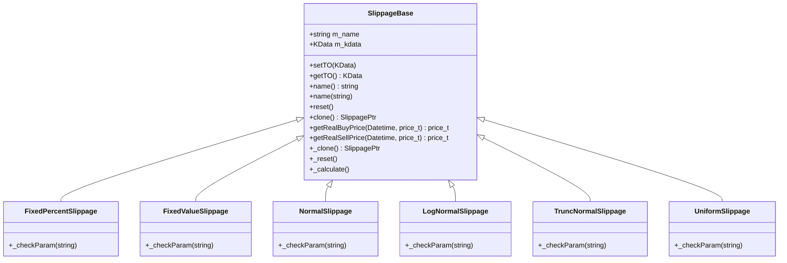

# Slippage Algorithms

<cite>
**Referenced Files in This Document**   
- [SlippageBase.h](file://hikyuu_cpp/hikyuu/trade_sys/slippage/SlippageBase.h)
- [SP_FixedPercent.h](file://hikyuu_cpp/hikyuu/trade_sys/slippage/crt/SP_FixedPercent.h)
- [SP_FixedValue.h](file://hikyuu_cpp/hikyuu/trade_sys/slippage/crt/SP_FixedValue.h)
- [SP_Normal.h](file://hikyuu_cpp/hikyuu/trade_sys/slippage/crt/SP_Normal.h)
- [SP_LogNormal.h](file://hikyuu_cpp/hikyuu/trade_sys/slippage/crt/SP_LogNormal.h)
- [SP_TruncNormal.h](file://hikyuu_cpp/hikyuu/trade_sys/slippage/crt/SP_TruncNormal.h)
- [SP_Uniform.h](file://hikyuu_cpp/hikyuu/trade_sys/slippage/crt/SP_Uniform.h)
- [FixedPercentSlippage.h](file://hikyuu_cpp/hikyuu/trade_sys/slippage/imp/FixedPercentSlippage.h)
- [FixedValueSlippage.h](file://hikyuu_cpp/hikyuu/trade_sys/slippage/imp/FixedValueSlippage.h)
- [NormalSlippage.h](file://hikyuu_cpp/hikyuu/trade_sys/slippage/imp/NormalSlippage.h)
- [LogNormalSlippage.h](file://hikyuu_cpp/hikyuu/trade_sys/slippage/imp/LogNormalSlippage.h)
- [TruncNormalSlippage.h](file://hikyuu_cpp/hikyuu/trade_sys/slippage/imp/TruncNormalSlippage.h)
- [UniformSlippage.h](file://hikyuu_cpp/hikyuu/trade_sys/slippage/imp/UniformSlippage.h)
</cite>

## Table of Contents
1. [Introduction](#introduction)
2. [Core Components](#core-components)
3. [Slippage Types](#slippage-types)
4. [Domain Model and Interfaces](#domain-model-and-interfaces)
5. [Configuration and Usage](#configuration-and-usage)
6. [Relationship with Trading System](#relationship-with-trading-system)
7. [Advanced Modeling Considerations](#advanced-modeling-considerations)
8. [Conclusion](#conclusion)

## Introduction

Slippage modeling is a critical component in algorithmic trading systems, as it directly impacts the accuracy of backtesting results and the realism of simulated trading performance. In the Hikyuu quantitative trading framework, slippage algorithms are designed to simulate the difference between expected trade prices and actual execution prices due to market dynamics, liquidity constraints, and order book depth. This document provides a comprehensive overview of the slippage algorithms implemented in Hikyuu, detailing their mathematical foundations, implementation architecture, and practical applications in trading simulations.

**Section sources**
- [SlippageBase.h](file://hikyuu_cpp/hikyuu/trade_sys/slippage/SlippageBase.h#L1-L176)

## Core Components

The slippage system in Hikyuu is built around a modular, extensible architecture that allows for both simple and sophisticated transaction cost modeling. At its core is the `SlippageBase` abstract class, which defines the interface for all slippage implementations. This base class provides essential functionality including parameter management, object cloning, and price calculation methods for both buy and sell operations. The system supports multiple slippage models, ranging from deterministic fixed-value approaches to stochastic models based on statistical distributions.

The implementation separates the interface definition from the concrete implementations, with factory functions in the `crt` directory providing convenient constructors for each slippage type. The actual algorithm logic resides in the `imp` directory, where each slippage model inherits from `SlippageBase` and implements the required virtual methods. This design enables users to easily extend the system with custom slippage models while maintaining compatibility with the existing trading infrastructure.

**Section sources**
- [SlippageBase.h](file://hikyuu_cpp/hikyuu/trade_sys/slippage/SlippageBase.h#L1-L176)
- [FixedPercentSlippage.h](file://hikyuu_cpp/hikyuu/trade_sys/slippage/imp/FixedPercentSlippage.h#L1-L29)
- [FixedValueSlippage.h](file://hikyuu_cpp/hikyuu/trade_sys/slippage/imp/FixedValueSlippage.h#L1-L29)

## Slippage Types

Hikyuu provides several built-in slippage models to accommodate different trading scenarios and market conditions:

### SP_FixedPercent
This model applies a fixed percentage offset to the planned trade price. For buy orders, the actual price is calculated as `planPrice * (1 + p)`, while for sell orders it is `planPrice * (1 - p)`, where `p` is the specified percentage parameter. This simple model is useful for quick simulations where proportional transaction costs need to be accounted for.

**Section sources**
- [SP_FixedPercent.h](file://hikyuu_cpp/hikyuu/trade_sys/slippage/crt/SP_FixedPercent.h#L1-L27)

### SP_FixedValue
The fixed value model adds or subtracts a constant amount from the planned price. Buy orders execute at `planPrice + value` and sell orders at `planPrice - value`. This model is appropriate when transaction costs are relatively constant regardless of asset price levels.

**Section sources**
- [SP_FixedValue.h](file://hikyuu_cpp/hikyuu/trade_sys/slippage/crt/SP_FixedValue.h#L1-L27)

### SP_Normal
This stochastic model uses a normal distribution to simulate price slippage. It takes mean and standard deviation parameters to define the distribution from which random offsets are drawn. This approach captures the random nature of market microstructure effects and execution uncertainty.

**Section sources**
- [SP_Normal.h](file://hikyuu_cpp/hikyuu/trade_sys/slippage/crt/SP_Normal.h#L1-L22)

### SP_LogNormal
Based on the log-normal distribution, this model is particularly suitable for modeling percentage-based slippage where the distribution of relative price changes is assumed to be log-normal. It accepts mean and standard deviation parameters that define the underlying normal distribution of log returns.

**Section sources**
- [SP_LogNormal.h](file://hikyuu_cpp/hikyuu/trade_sys/slippage/crt/SP_LogNormal.h#L1-L22)

### SP_TruncNormal
The truncated normal model combines the statistical properties of the normal distribution with bounded outcomes. It uses mean and standard deviation parameters like the normal model but also specifies minimum and maximum values to constrain the generated slippage. This prevents unrealistic extreme values while maintaining the desired statistical properties.

**Section sources**
- [SP_TruncNormal.h](file://hikyuu_cpp/hikyuu/trade_sys/slippage/crt/SP_TruncNormal.h#L1-L25)

### SP_Uniform
This model generates slippage values from a uniform distribution within a specified range [min_value, max_value]. It assumes that all values within the range are equally likely, making it a simple yet effective model for scenarios where limited information about slippage distribution is available.

**Section sources**
- [SP_Uniform.h](file://hikyuu_cpp/hikyuu/trade_sys/slippage/crt/SP_Uniform.h#L1-L24)

## Domain Model and Interfaces

The slippage system in Hikyuu follows a clean object-oriented design centered around the `SlippageBase` abstract base class. This class defines the contract that all slippage implementations must adhere to, ensuring consistency across different models. The key interface methods are `getRealBuyPrice` and `getRealSellPrice`, which calculate the actual execution price given a planned price and timestamp.

**Diagram sources**
- [SlippageBase.h](file://hikyuu_cpp/hikyuu/trade_sys/slippage/SlippageBase.h#L15-L176)
- [FixedPercentSlippage.h](file://hikyuu_cpp/hikyuu/trade_sys/slippage/imp/FixedPercentSlippage.h#L16-L24)
- [FixedValueSlippage.h](file://hikyuu_cpp/hikyuu/trade_sys/slippage/imp/FixedValueSlippage.h#L16-L24)

The system uses smart pointers (`shared_ptr`) for memory management, with the `SPPtr` typedef providing a convenient alias for `shared_ptr<SlippageBase>`. This enables safe sharing of slippage objects across different components of the trading system. The framework also supports serialization through Boost.Serialization, allowing slippage configurations to be saved and restored.

**Section sources**
- [SlippageBase.h](file://hikyuu_cpp/hikyuu/trade_sys/slippage/SlippageBase.h#L1-L176)

## Configuration and Usage

Configuring slippage models in Hikyuu is accomplished through factory functions that return properly initialized slippage objects. Each slippage type provides a corresponding factory function (e.g., `SP_FixedPercent`, `SP_Normal`) that accepts the necessary parameters and returns a `SlippagePtr`. These functions serve as the primary interface for creating slippage instances in both C++ and Python environments.

The parameter system allows for dynamic configuration of slippage models, enabling users to adjust parameters based on market conditions, asset characteristics, or portfolio requirements. For example, a strategy might use higher slippage values during periods of high volatility or for assets with known liquidity constraints. The `setTO` method allows the slippage model to access historical market data, which can be used by more sophisticated models to adapt their behavior based on current market conditions.

**Section sources**
- [SP_FixedPercent.h](file://hikyuu_cpp/hikyuu/trade_sys/slippage/crt/SP_FixedPercent.h#L22-L23)
- [SP_FixedValue.h](file://hikyuu_cpp/hikyuu/trade_sys/slippage/crt/SP_FixedValue.h#L22-L23)
- [SP_Normal.h](file://hikyuu_cpp/hikyuu/trade_sys/slippage/crt/SP_Normal.h#L20-L21)

## Relationship with Trading System

Slippage models are tightly integrated with other components of the Hikyuu trading system, particularly the backtesting engine and execution simulator. During backtesting, the slippage model is consulted for every simulated trade to determine the actual execution price, which directly affects the calculated returns and performance metrics. This integration ensures that backtest results reflect realistic transaction costs rather than idealized executions.

The relationship between slippage and other trading system elements is crucial for accurate performance evaluation. A well-configured slippage model can help prevent over-optimistic backtest results by accounting for market impact, liquidity constraints, and execution delays. When combined with commission models and other transaction cost components, slippage contributes to a comprehensive transaction cost model that enhances the realism of trading simulations.

**Section sources**
- [SlippageBase.h](file://hikyuu_cpp/hikyuu/trade_sys/slippage/SlippageBase.h#L55-L63)

## Advanced Modeling Considerations

When implementing realistic slippage models, several factors must be considered beyond the basic algorithm selection. Market impact modeling requires understanding how trade size affects execution prices, with larger orders typically experiencing greater slippage due to their effect on supply and demand. Liquidity considerations are also important, as assets with low trading volume or narrow order books are more susceptible to price movement from trading activity.

For advanced users, the Hikyuu framework provides the foundation for developing custom slippage models that incorporate additional market data or sophisticated statistical techniques. By inheriting from `SlippageBase` and implementing the required virtual methods, developers can create models that respond to volatility indicators, order book depth, or other market microstructure features. The parameter system supports complex configurations, allowing models to adapt their behavior based on changing market conditions.

**Section sources**
- [SlippageBase.h](file://hikyuu_cpp/hikyuu/trade_sys/slippage/SlippageBase.h#L21-L176)

## Conclusion

The slippage algorithms in Hikyuu provide a comprehensive framework for modeling transaction costs in algorithmic trading systems. From simple fixed-value approaches to sophisticated stochastic models, the system offers flexibility to match different trading strategies and market environments. The well-defined interface and extensible architecture make it easy to configure existing models or develop new ones tailored to specific requirements. By accurately simulating execution prices, these slippage models contribute significantly to the realism and reliability of backtesting results, helping traders make more informed decisions about strategy performance and risk management.