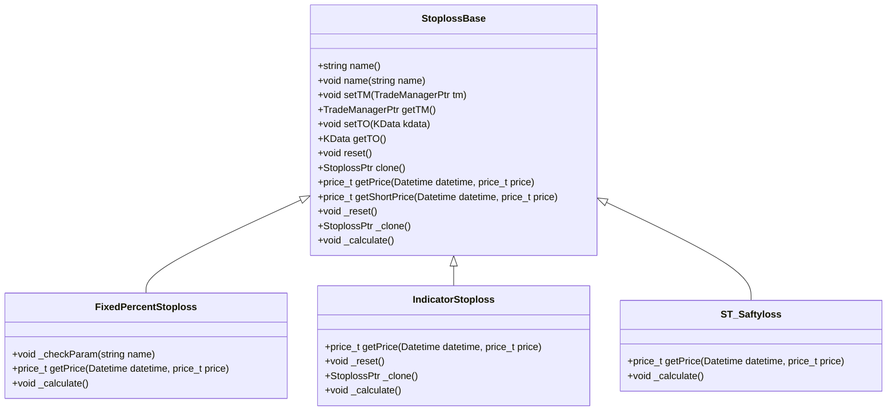
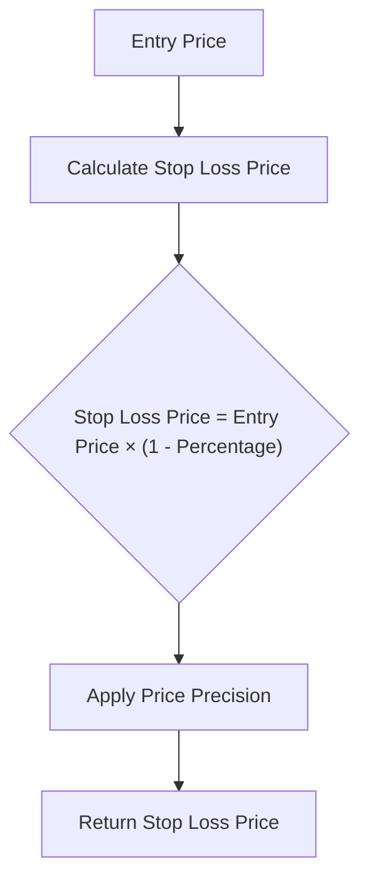
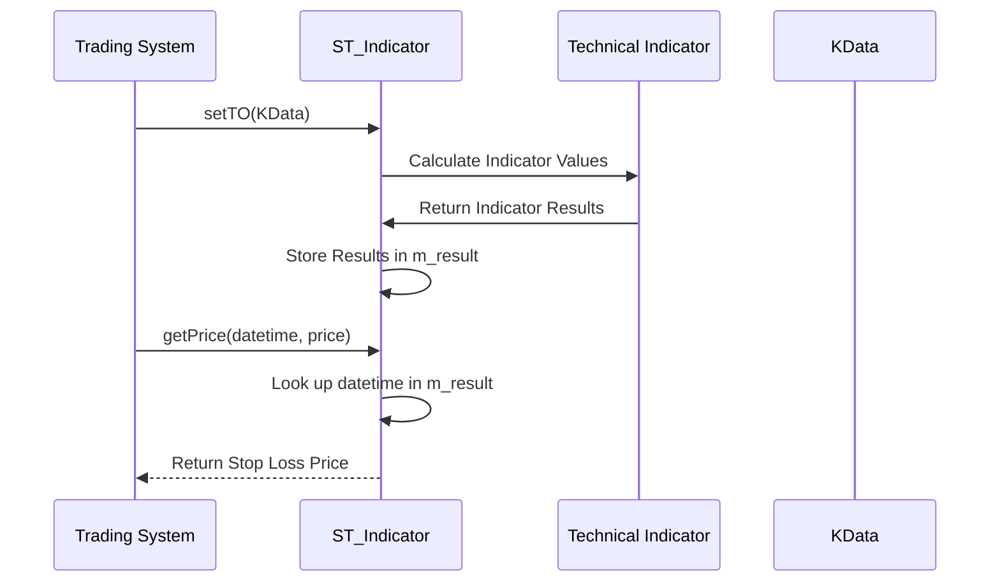
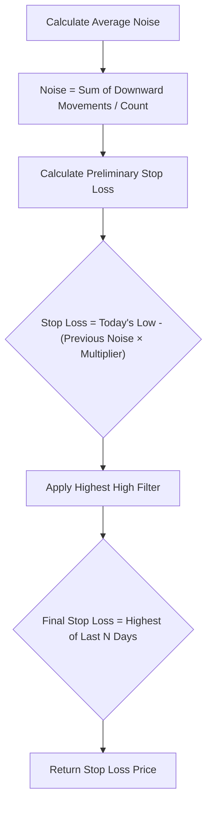
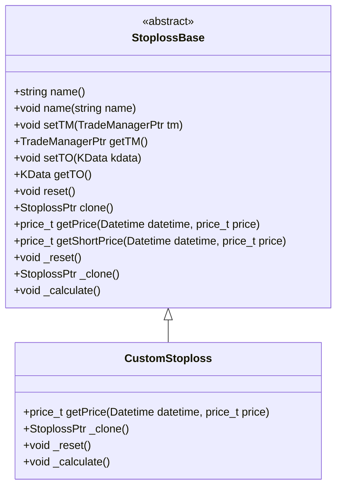
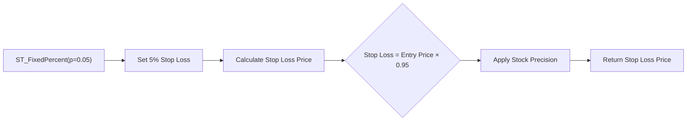
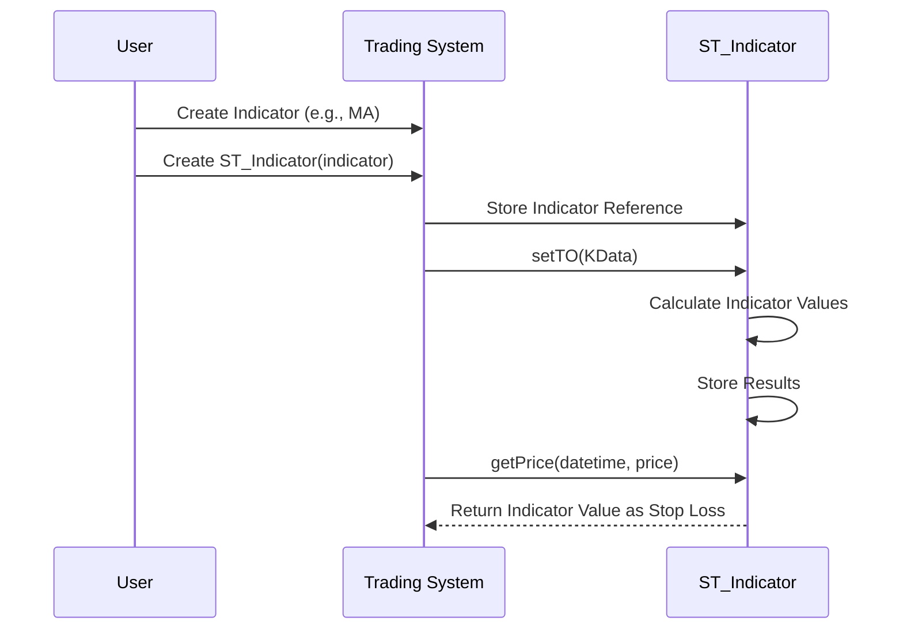
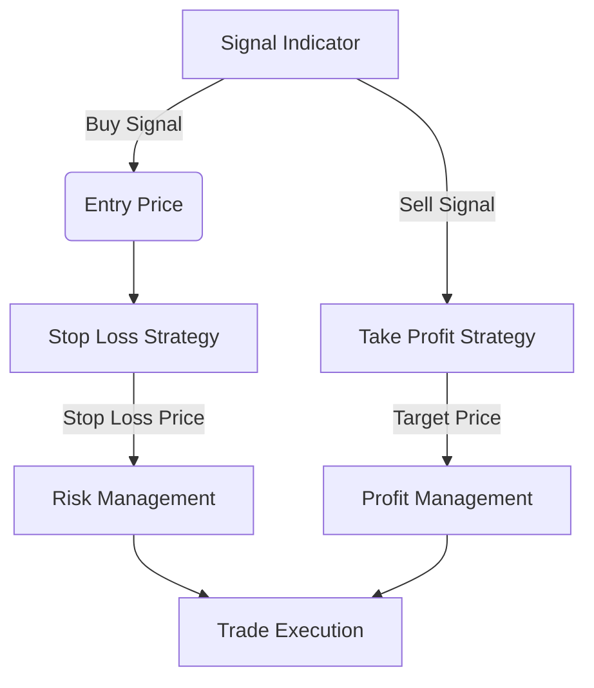

# Stop Loss and Take Profit

<cite>
**Referenced Files in This Document**   
- [StoplossBase.h](file://hikyuu_cpp/hikyuu/trade_sys/stoploss/StoplossBase.h)
- [StoplossBase.cpp](file://hikyuu_cpp/hikyuu/trade_sys/stoploss/StoplossBase.cpp)
- [ST_FixedPercent.h](file://hikyuu_cpp/hikyuu/trade_sys/stoploss/crt/ST_FixedPercent.h)
- [FixedPercentStoploss.cpp](file://hikyuu_cpp/hikyuu/trade_sys/stoploss/imp/FixedPercentStoploss.cpp)
- [ST_Indicator.h](file://hikyuu_cpp/hikyuu/trade_sys/stoploss/crt/ST_Indicator.h)
- [IndicatorStoploss.cpp](file://hikyuu_cpp/hikyuu/trade_sys/stoploss/imp/IndicatorStoploss.cpp)
- [ST_Saftyloss.h](file://hikyuu_cpp/hikyuu/trade_sys/stoploss/crt/ST_Saftyloss.h)
- [Stoploss.py](file://hikyuu/test/Stoploss.py)
</cite>

## Table of Contents
1. [Introduction](#introduction)
2. [Core Components](#core-components)
3. [Stop Loss Types](#stop-loss-types)
4. [Custom Risk Control Implementation](#custom-risk-control-implementation)
5. [Configuration Examples](#configuration-examples)
6. [System Integration](#system-integration)
7. [Advanced Strategies](#advanced-strategies)
8. [Common Issues and Solutions](#common-issues-and-solutions)

## Introduction

Stop Loss and Take Profit mechanisms are critical components of risk management in algorithmic trading systems. In Hikyuu, these mechanisms are implemented as part of the trade system framework, providing systematic approaches to protect capital and lock in profits. The system offers multiple stop loss strategies including fixed percentage, indicator-based, and volatility-adjusted approaches. These mechanisms work in conjunction with signal indicators and position management to create a comprehensive risk control framework that helps traders manage exposure and optimize returns.

**Section sources**
- [StoplossBase.h](file://hikyuu_cpp/hikyuu/trade_sys/stoploss/StoplossBase.h#L1-L205)

## Core Components

The Stop Loss and Take Profit system in Hikyuu is built around the StoplossBase class, which serves as the foundation for all risk control strategies. This base class defines the essential interface and functionality that all stop loss implementations must follow. The system is designed with extensibility in mind, allowing users to create custom risk control mechanisms while maintaining compatibility with the broader trading framework.

The StoplossBase class provides methods for setting and retrieving the trading manager instance, managing the trading object (KData), and handling the lifecycle operations such as reset and clone. It also defines the core getPrice method that calculates the stop loss price based on the current market conditions and strategy parameters.

**Diagram sources**
- [StoplossBase.h](file://hikyuu_cpp/hikyuu/trade_sys/stoploss/StoplossBase.h#L18-L205)
- [FixedPercentStoploss.h](file://hikyuu_cpp/hikyuu/trade_sys/stoploss/imp/FixedPercentStoploss.h#L19-L31)
- [IndicatorStoploss.h](file://hikyuu_cpp/hikyuu/trade_sys/stoploss/imp/IndicatorStoploss.h#L17-L49)

**Section sources**
- [StoplossBase.h](file://hikyuu_cpp/hikyuu/trade_sys/stoploss/StoplossBase.h#L18-L205)
- [StoplossBase.cpp](file://hikyuu_cpp/hikyuu/trade_sys/stoploss/StoplossBase.cpp#L1-L70)

## Stop Loss Types

Hikyuu provides several built-in stop loss strategies to address different risk management needs. These strategies can be categorized into three main types: fixed percentage, indicator-based, and volatility-adjusted approaches.

### ST_FixedPercent

The ST_FixedPercent strategy implements a simple percentage-based stop loss mechanism. This approach sets the stop loss price at a fixed percentage below the entry price, making it one of the most straightforward risk control methods. The strategy is particularly useful for traders who want to maintain consistent risk exposure across different positions.

**Diagram sources**
- [ST_FixedPercent.h](file://hikyuu_cpp/hikyuu/trade_sys/stoploss/crt/ST_FixedPercent.h#L16-L21)
- [FixedPercentStoploss.cpp](file://hikyuu_cpp/hikyuu/trade_sys/stoploss/imp/FixedPercentStoploss.cpp#L29-L33)

### ST_Indicator

The ST_Indicator strategy allows users to define stop loss levels based on technical indicators. This approach provides greater flexibility by enabling the use of various technical analysis tools to determine optimal exit points. The strategy can incorporate any indicator available in the Hikyuu system, making it highly adaptable to different trading styles and market conditions.

**Diagram sources**
- [ST_Indicator.h](file://hikyuu_cpp/hikyuu/trade_sys/stoploss/crt/ST_Indicator.h#L17-L18)
- [IndicatorStoploss.cpp](file://hikyuu_cpp/hikyuu/trade_sys/stoploss/imp/IndicatorStoploss.cpp#L39-L47)

### ST_Saftyloss

The ST_Saftyloss strategy implements Alexander Elder's safety zone stop loss method. This volatility-based approach calculates stop loss levels by analyzing historical price noise and adjusting for market volatility. The strategy aims to provide a more dynamic and adaptive stop loss mechanism that accounts for changing market conditions.

**Diagram sources**
- [ST_Saftyloss.h](file://hikyuu_cpp/hikyuu/trade_sys/stoploss/crt/ST_Saftyloss.h#L16-L33)

## Custom Risk Control Implementation

Hikyuu provides a robust framework for creating custom risk control mechanisms through the StoplossBase class. Developers can extend this base class to implement specialized stop loss strategies tailored to specific trading requirements.

### StoplossBase Interface

The StoplossBase class defines the essential methods that all stop loss implementations must override:

- **getPrice**: Calculates the stop loss price for a given datetime and entry price
- **_clone**: Creates a copy of the stop loss instance
- **_reset**: Resets the internal state of the stop loss strategy
- **_calculate**: Performs any necessary calculations when new data is available

**Diagram sources**
- [StoplossBase.h](file://hikyuu_cpp/hikyuu/trade_sys/stoploss/StoplossBase.h#L23-L169)
- [Stoploss.py](file://hikyuu/test/Stoploss.py#L15-L38)

### Creating Custom Strategies

To create a custom stop loss strategy, developers need to:

1. Create a new class that inherits from StoplossBase
2. Implement the required virtual methods (getPrice, _clone, _reset, _calculate)
3. Define any additional parameters specific to the strategy
4. Register the strategy with the system

The framework supports both C++ and Python implementations, allowing for maximum flexibility in strategy development.

**Section sources**
- [Stoploss.py](file://hikyuu/test/Stoploss.py#L15-L38)
- [StoplossBase.h](file://hikyuu_cpp/hikyuu/trade_sys/stoploss/StoplossBase.h#L67-L87)

## Configuration Examples

### Fixed Percentage Configuration

The ST_FixedPercent strategy can be configured with a specific percentage value:

**Diagram sources**
- [ST_FixedPercent.h](file://hikyuu_cpp/hikyuu/trade_sys/stoploss/crt/ST_FixedPercent.h#L21)
- [FixedPercentStoploss.cpp](file://hikyuu_cpp/hikyuu/trade_sys/stoploss/imp/FixedPercentStoploss.cpp#L37-L40)

### Indicator-Based Configuration

The ST_Indicator strategy can be configured with any technical indicator:

**Diagram sources**
- [ST_Indicator.h](file://hikyuu_cpp/hikyuu/trade_sys/stoploss/crt/ST_Indicator.h#L17)
- [IndicatorStoploss.cpp](file://hikyuu_cpp/hikyuu/trade_sys/stoploss/imp/IndicatorStoploss.cpp#L49-L50)

## System Integration

The stop loss and take profit mechanisms in Hikyuu are tightly integrated with other components of the trading system, creating a cohesive risk management framework.

### Relationship with Signal Indicators

Stop loss strategies work in conjunction with signal indicators to provide comprehensive trade management. While signal indicators determine entry points, stop loss mechanisms define exit points, creating a complete trading system.

**Diagram sources**
- [StoplossBase.h](file://hikyuu_cpp/hikyuu/trade_sys/stoploss/StoplossBase.h#L57-L67)
- [StoplossBase.h](file://hikyuu_cpp/hikyuu/trade_sys/stoploss/StoplossBase.h#L69-L78)

### Position Management Integration

The stop loss system integrates with position management to ensure proper risk allocation and position sizing. The trading manager component coordinates between these systems to maintain overall portfolio risk within acceptable limits.

**Section sources**
- [StoplossBase.h](file://hikyuu_cpp/hikyuu/trade_sys/stoploss/StoplossBase.h#L38-L48)

## Advanced Strategies

### Volatility-Based Stop Mechanisms

The ST_Saftyloss strategy represents an advanced volatility-based approach to stop loss management. By analyzing historical price noise, this strategy adapts to changing market conditions and provides more intelligent stop loss levels.

The algorithm works by:
1. Calculating the average noise over a specified lookback period
2. Multiplying the noise by a volatility coefficient
3. Subtracting this value from the current price
4. Applying a filter to ensure the stop loss level moves upward over time

This approach helps avoid being stopped out by normal market fluctuations while still providing protection against significant adverse moves.

**Section sources**
- [ST_Saftyloss.h](file://hikyuu_cpp/hikyuu/trade_sys/stoploss/crt/ST_Saftyloss.h#L16-L33)

### Trailing Stop Strategies

While not explicitly implemented as a separate strategy, the framework supports trailing stop functionality through custom implementations. Trailing stops automatically adjust the stop loss level as the price moves in the trader's favor, helping to lock in profits while still providing downside protection.

Developers can create trailing stop strategies by extending the StoplossBase class and implementing logic that updates the stop loss level based on price movement.

## Common Issues and Solutions

### Stop Hunting

Stop hunting occurs when the market briefly moves through a stop loss level before reversing direction. This can result in unnecessary losses. The ST_Saftyloss strategy helps mitigate this issue by using a volatility-based approach that accounts for normal market noise.

### Optimal Placement

Determining the optimal stop loss placement involves balancing risk protection with the likelihood of being stopped out by normal market fluctuations. The fixed percentage approach provides consistency, while indicator-based and volatility-adjusted methods offer more dynamic placement based on market conditions.

### Strategy Selection

Choosing the appropriate stop loss strategy depends on the trading style, time frame, and market conditions. Short-term traders may prefer fixed percentage stops for their simplicity, while longer-term traders might benefit from volatility-adjusted approaches that adapt to changing market conditions.