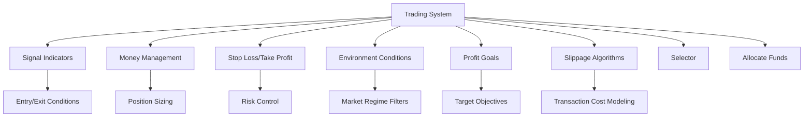
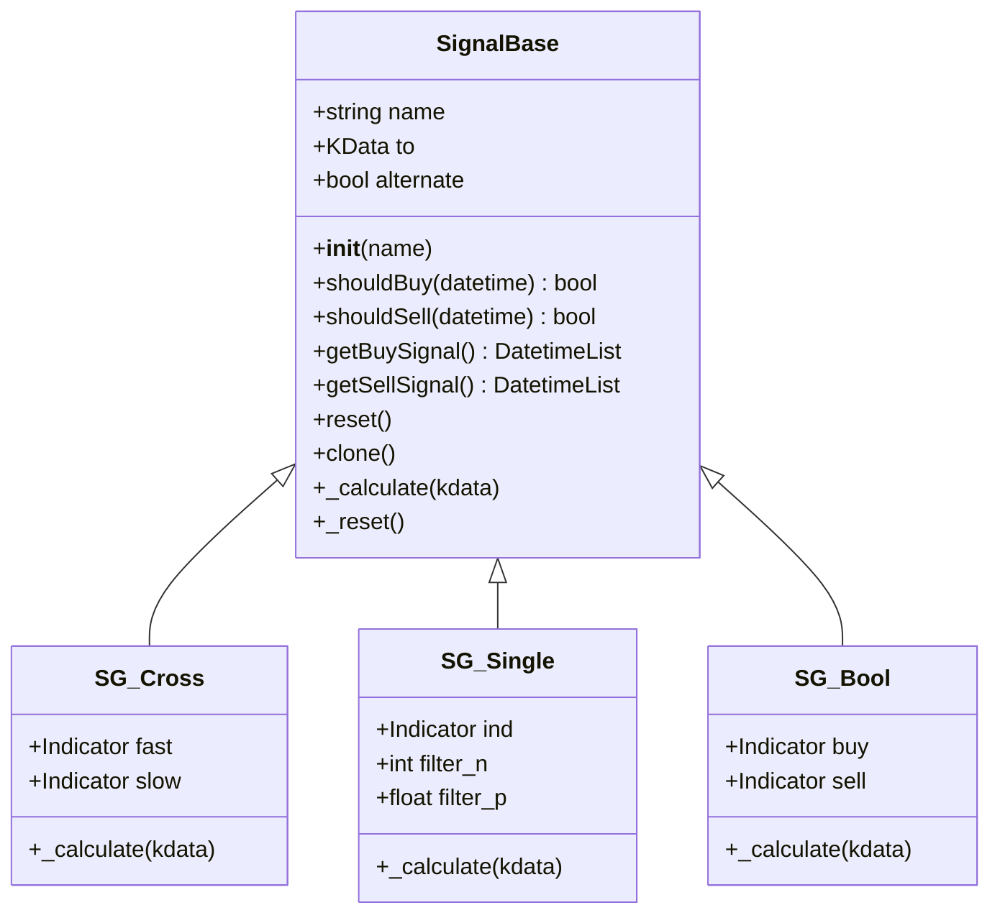
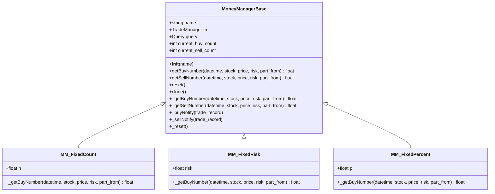
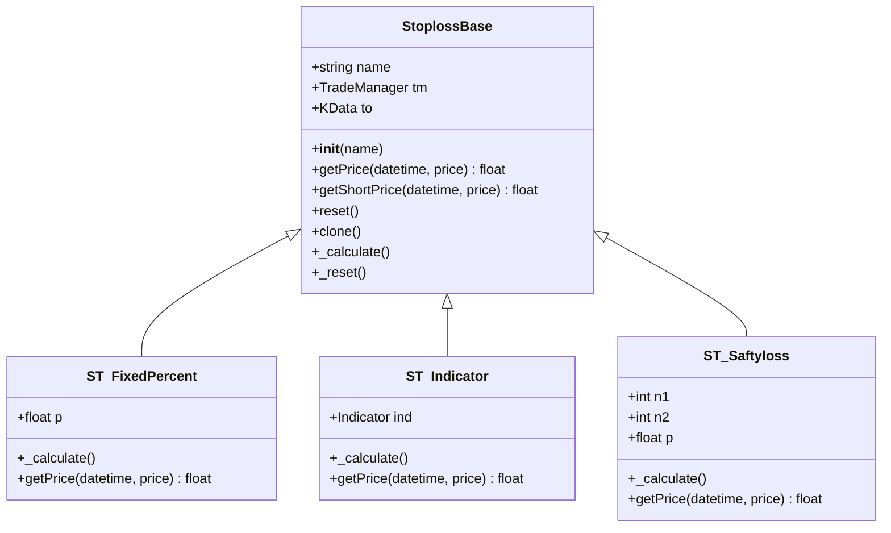
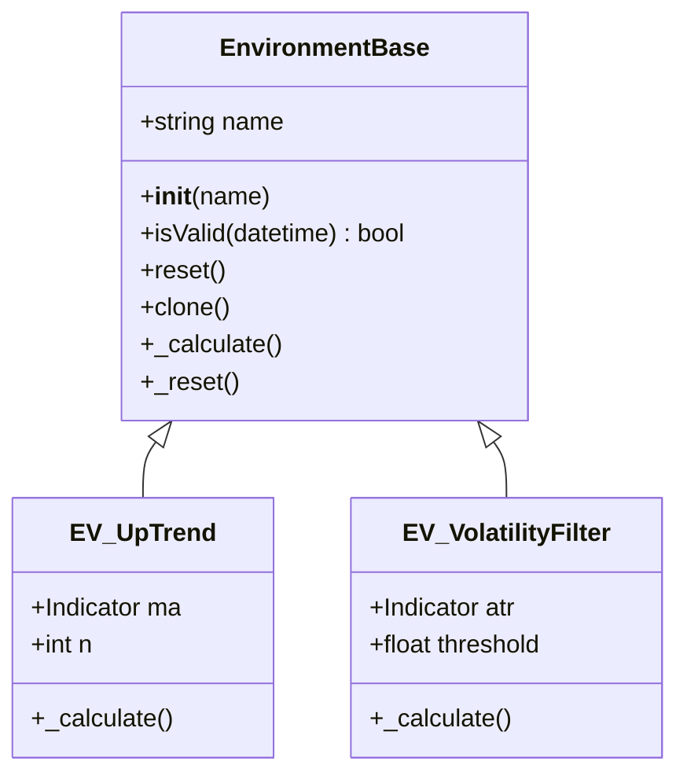
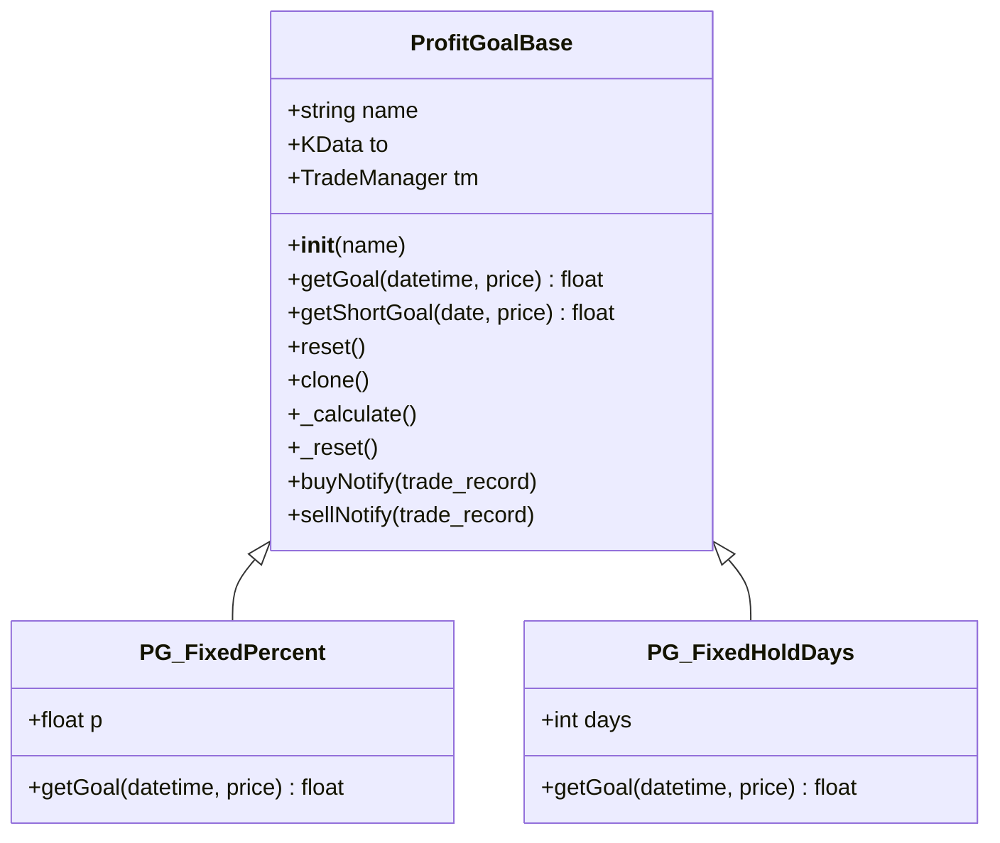
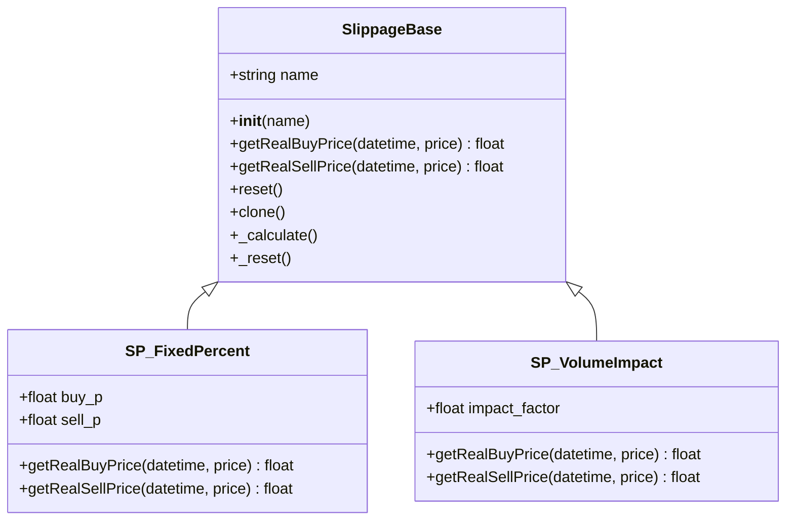
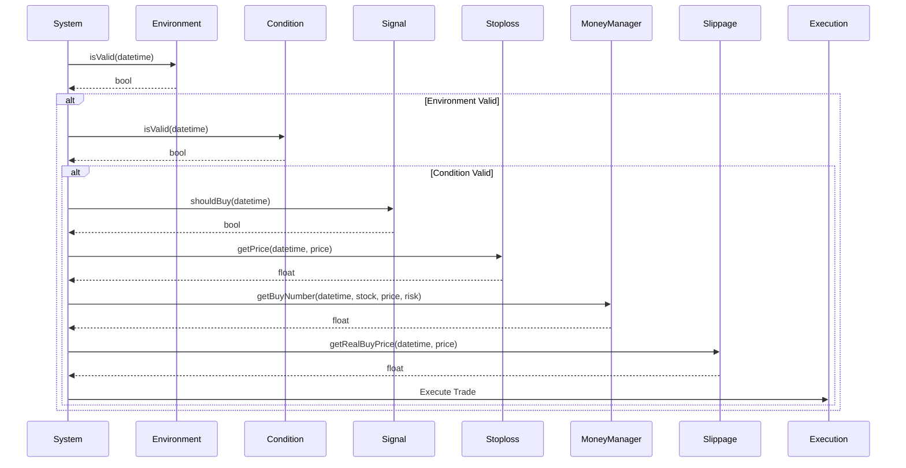

# Trading System Components

<cite>
**Referenced Files in This Document**   
- [trade_sys.py](file://hikyuu/trade_sys/trade_sys.py)
- [_System.cpp](file://hikyuu_pywrap/trade_sys/_System.cpp)
- [_Signal.cpp](file://hikyuu_pywrap/trade_sys/_Signal.cpp)
- [_MoneyManager.cpp](file://hikyuu_pywrap/trade_sys/_MoneyManager.cpp)
- [_Stoploss.cpp](file://hikyuu_pywrap/trade_sys/_Stoploss.cpp)
- [_ProfitGoal.cpp](file://hikyuu_pywrap/trade_sys/_ProfitGoal.cpp)
- [_Slippage.cpp](file://hikyuu_pywrap/trade_sys/_Slippage.cpp)
- [all.h](file://hikyuu_cpp/hikyuu/trade_sys/all.h)
</cite>

## Table of Contents
1. [Introduction](#introduction)
2. [Component Architecture Overview](#component-architecture-overview)
3. [Signal Indicators](#signal-indicators)
4. [Money Management](#money-management)
5. [Stop Loss/Take Profit](#stop-losstake-profit)
6. [Environment Conditions](#environment-conditions)
7. [Profit Goals](#profit-goals)
8. [Slippage Algorithms](#slippage-algorithms)
9. [Component Composition and System Integration](#component-composition-and-system-integration)
10. [Design Philosophy and Reusability](#design-philosophy-and-reusability)

## Introduction

Hikyuu's trading system is built on a modular architecture that decomposes trading strategies into reusable, composable components. This design allows users to create sophisticated trading systems by combining different components that handle specific aspects of trading logic. Each component type serves a distinct purpose in the trading process, from generating entry/exit signals to managing risk and position sizing. The system's architecture promotes reusability and flexibility, enabling traders to mix and match components to create customized strategies. This document provides a comprehensive overview of the various component types, their interfaces, and how they can be combined to form complete trading systems.

**Section sources**
- [trade_sys.py](file://hikyuu/trade_sys/trade_sys.py#L1-L300)
- [_System.cpp](file://hikyuu_pywrap/trade_sys/_System.cpp#L1-L305)

## Component Architecture Overview

The Hikyuu trading system follows a component-based architecture where each trading strategy is composed of specialized components that handle specific aspects of trading logic. The core components include Signal Indicators (entry/exit conditions), Money Management (position sizing), Stop Loss/Take Profit (risk control), Environment Conditions (market regime filters), Profit Goals (target objectives), and Slippage Algorithms (transaction cost modeling). These components are designed to be highly reusable and composable, allowing users to create complex trading systems by combining different components.

The architecture is implemented through a set of base classes in C++ that are exposed to Python through pybind11 wrappers. Each component type inherits from a base class that defines the required interfaces and provides common functionality. The system uses a factory pattern with helper functions (e.g., crtSG, crtMM, crtST) to create custom components by dynamically generating classes that inherit from the appropriate base class. This approach allows users to create custom components by simply providing the necessary calculation functions without having to define full classes.

**Diagram sources**
- [all.h](file://hikyuu_cpp/hikyuu/trade_sys/all.h#L1-L25)
- [trade_sys.py](file://hikyuu/trade_sys/trade_sys.py#L1-L300)

**Section sources**
- [all.h](file://hikyuu_cpp/hikyuu/trade_sys/all.h#L1-L25)
- [trade_sys.py](file://hikyuu/trade_sys/trade_sys.py#L1-L300)

## Signal Indicators

Signal Indicators in Hikyuu are responsible for generating entry and exit signals for trading strategies. These components analyze market data and produce buy/sell signals based on predefined conditions. The SignalBase class defines the interface for all signal indicators, requiring the implementation of a _calculate method that processes KData (candlestick data) and generates signals.

Hikyuu provides several built-in signal indicators, including:
- SG_Cross: Generates signals when a fast line crosses above/below a slow line
- SG_Single: Generates signals based on single-line inflection points
- SG_Bool: Uses boolean indicators to generate buy/sell signals
- SG_Flex: Uses an indicator's EMA as the slow line for crossover signals

Signal indicators can be customized using the crtSG helper function, which allows users to define their own signal generation logic by providing a calculation function. The system supports both single-line signals (based on inflection points or threshold crossings) and dual-line signals (based on crossovers). Signal indicators can also be combined using arithmetic operations (+, -, *, /) and logical operations (&, |) to create more complex signal logic.

**Diagram sources**
- [_Signal.cpp](file://hikyuu_pywrap/trade_sys/_Signal.cpp#L1-L395)
- [trade_sys.py](file://hikyuu/trade_sys/trade_sys.py#L146-L158)

**Section sources**
- [_Signal.cpp](file://hikyuu_pywrap/trade_sys/_Signal.cpp#L1-L395)
- [trade_sys.py](file://hikyuu/trade_sys/trade_sys.py#L146-L158)

## Money Management

Money Management components in Hikyuu handle position sizing and capital allocation for trading strategies. These components determine how much capital to allocate to each trade based on various risk management principles. The MoneyManagerBase class defines the interface for all money management strategies, requiring the implementation of a _getBuyNumber method that calculates the number of units to buy.

Hikyuu provides several built-in money management strategies:
- MM_FixedCount: Buys a fixed number of units per trade
- MM_FixedRisk: Allocates a fixed dollar amount of risk per trade
- MM_FixedPercent: Allocates a fixed percentage of account equity per trade
- MM_FixedCapital: Buys units based on a fixed capital amount
- MM_WilliamsFixedRisk: Williams fixed fractional risk model

Money management strategies can be customized using the crtMM helper function, which allows users to define their own position sizing logic by providing get_buy_num and get_sell_num functions. The system also supports notifications for buy/sell operations through buy_notify and sell_notify parameters, which can be used to implement more sophisticated position management strategies that consider previous trades.

**Diagram sources**
- [_MoneyManager.cpp](file://hikyuu_pywrap/trade_sys/_MoneyManager.cpp#L1-L262)
- [trade_sys.py](file://hikyuu/trade_sys/trade_sys.py#L90-L113)

**Section sources**
- [_MoneyManager.cpp](file://hikyuu_pywrap/trade_sys/_MoneyManager.cpp#L1-L262)
- [trade_sys.py](file://hikyuu/trade_sys/trade_sys.py#L90-L113)

## Stop Loss/Take Profit

Stop Loss and Take Profit components in Hikyuu implement risk control mechanisms for trading strategies. These components determine when to exit a position to limit losses or lock in profits. The StoplossBase class defines the interface for both stop loss and take profit strategies, with the same base class used for both purposes.

Hikyuu provides several built-in stop loss/take profit strategies:
- ST_FixedPercent: Exits when price moves a fixed percentage from entry price
- ST_Indicator: Uses a technical indicator value as the exit price
- ST_Saftyloss: Elder's safety zone stop based on average noise

Stop loss/take profit strategies can be customized using the crtST helper function, which allows users to define their own exit logic by providing a calculation function. The system queries the stop loss strategy before each trade to determine the planned exit price. The get_price method returns the stop price for a potential buy trade, while get_short_price returns the stop price for a short trade. The system supports both fixed and dynamic stop levels, allowing for trailing stops and other adaptive exit strategies.

**Diagram sources**
- [_Stoploss.cpp](file://hikyuu_pywrap/trade_sys/_Stoploss.cpp#L1-L132)
- [trade_sys.py](file://hikyuu/trade_sys/trade_sys.py#L248-L261)

**Section sources**
- [_Stoploss.cpp](file://hikyuu_pywrap/trade_sys/_Stoploss.cpp#L1-L132)
- [trade_sys.py](file://hikyuu/trade_sys/trade_sys.py#L248-L261)

## Environment Conditions

Environment Conditions in Hikyuu serve as market regime filters that determine whether a trading system should be active. These components evaluate broader market conditions and can prevent trading when market conditions are unfavorable. The EnvironmentBase class defines the interface for all environment conditions, requiring the implementation of a _calculate method that returns a boolean indicating whether the market environment is suitable for trading.

Environment conditions can be customized using the crtEV helper function, which allows users to define their own market assessment logic by providing a calculation function. These components are typically used to implement trend filters, volatility filters, or other market state assessments that can improve strategy performance by avoiding trades during unfavorable market conditions.

The system can be configured to use environment conditions for initial position entry (ev_open_position parameter), allowing the strategy to only open new positions when the market environment is favorable. This provides an additional layer of risk management by ensuring that trades are only initiated when broader market conditions support the trading strategy.

**Diagram sources**
- [trade_sys.py](file://hikyuu/trade_sys/trade_sys.py#L71-L85)
- [_System.cpp](file://hikyuu_pywrap/trade_sys/_System.cpp#L1-L305)

**Section sources**
- [trade_sys.py](file://hikyuu/trade_sys/trade_sys.py#L71-L85)

## Profit Goals

Profit Goals in Hikyuu define target objectives for trading strategies, determining when to exit a position to lock in profits. The ProfitGoalBase class defines the interface for all profit goal strategies, requiring the implementation of a get_goal method that returns the target price for a position.

Hikyuu provides several built-in profit goal strategies:
- PG_FixedPercent: Exits when price reaches a fixed percentage above entry price
- PG_FixedHoldDays: Exits after holding for a fixed number of days
- PG_NoGoal: No specific profit target (exit based on other conditions)

Profit goal strategies can be customized using the crtPG helper function, which allows users to define their own profit target logic by providing a get_goal function. The system supports notifications for buy/sell operations through buy_notify and sell_notify parameters, which can be used to implement more sophisticated profit-taking strategies that consider the entire trade history.

The get_goal method returns the target price for closing a position, with special values having specific meanings: returning constant.null_price indicates no target (position remains open), while returning 0 indicates the position should be closed. This flexible design allows for both price-based and time-based profit targets, as well as more complex adaptive targets.

**Diagram sources**
- [_ProfitGoal.cpp](file://hikyuu_pywrap/trade_sys/_ProfitGoal.cpp#L1-L145)
- [trade_sys.py](file://hikyuu/trade_sys/trade_sys.py#L118-L141)

**Section sources**
- [_ProfitGoal.cpp](file://hikyuu_pywrap/trade_sys/_ProfitGoal.cpp#L1-L145)
- [trade_sys.py](file://hikyuu/trade_sys/trade_sys.py#L118-L141)

## Slippage Algorithms

Slippage Algorithms in Hikyuu model transaction costs and execution impact for trading strategies. These components calculate the actual execution price of trades, accounting for market impact, bid-ask spreads, and other factors that affect trade execution. The SlippageBase class defines the interface for all slippage algorithms, requiring the implementation of get_real_buy_price and get_real_sell_price methods.

Slippage algorithms can be customized using the crtSP helper function, which allows users to define their own price adjustment logic by providing get_real_buy_price and get_real_sell_price functions. These functions take the theoretical trade price and return the actual expected execution price, allowing for sophisticated modeling of market impact based on trade size, volatility, and other factors.

The system uses slippage algorithms to provide more realistic backtesting results by accounting for the difference between theoretical and actual execution prices. This is particularly important for high-frequency trading strategies or strategies that trade large position sizes relative to market liquidity. By accurately modeling slippage, traders can better assess the real-world performance of their strategies.

**Diagram sources**
- [trade_sys.py](file://hikyuu/trade_sys/trade_sys.py#L224-L242)
- [_System.cpp](file://hikyuu_pywrap/trade_sys/_System.cpp#L1-L305)

**Section sources**
- [trade_sys.py](file://hikyuu/trade_sys/trade_sys.py#L224-L242)

## Component Composition and System Integration

Hikyuu's trading components are designed to be combined into complete trading systems through a flexible composition model. The System class serves as the container for all components, allowing users to assemble a complete trading strategy by assigning instances of different component types. The system architecture supports both simple and complex system configurations, from basic strategies with minimal components to sophisticated multi-component systems.

Components are integrated into the trading system through property setters that assign component instances to the system. For example, a signal indicator is assigned using the sg property, while a money management strategy is assigned using the mm property. The system processes these components in a specific order during backtesting: first evaluating the environment condition, then the system validity condition, followed by signal generation, risk assessment (stop loss/take profit), position sizing (money management), and finally execution modeling (slippage).

The system supports two primary system types: SYS_Simple for basic strategies that don't support multiple entries/exits, and SYS_WalkForward for walk-forward optimization systems. Users can create custom systems by combining components in various ways, leveraging the reusability of individual components across different strategies. This compositional approach enables rapid strategy development and testing, as components can be easily swapped or modified without affecting the overall system structure.

**Diagram sources**
- [_System.cpp](file://hikyuu_pywrap/trade_sys/_System.cpp#L1-L305)
- [trade_sys.py](file://hikyuu/trade_sys/trade_sys.py#L36-L45)

**Section sources**
- [_System.cpp](file://hikyuu_pywrap/trade_sys/_System.cpp#L1-L305)
- [trade_sys.py](file://hikyuu/trade_sys/trade_sys.py#L36-L45)

## Design Philosophy and Reusability

The design philosophy behind Hikyuu's trading system components emphasizes reusability, composability, and extensibility. Each component is designed as a self-contained unit with a well-defined interface, allowing it to be used across multiple strategies without modification. This modular approach enables traders to build a library of proven components that can be mixed and matched to create new strategies.

The system leverages Python's dynamic class creation capabilities through the crt* helper functions (crtSG, crtMM, crtST, etc.) to simplify component creation. These functions use Python's type() function to dynamically create classes that inherit from the appropriate base class and implement the required methods. This eliminates the need for users to define full classes when creating custom components, lowering the barrier to entry for strategy development.

Component reusability is further enhanced by the system's parameterization model, where components can be configured through dictionaries of parameters. This allows the same component implementation to behave differently based on its configuration, increasing its versatility. The clone method implemented by all components ensures that components can be safely reused across multiple systems without unintended side effects.

The architecture also supports component sharing, where the same component instance can be used across multiple systems. This is particularly useful for components that maintain state or perform expensive calculations, as it reduces memory usage and computation time. The system provides methods like setNotSharedAll to control component sharing behavior, giving users fine-grained control over component lifecycle and state management.

This design philosophy enables a component-based approach to strategy development, where traders can focus on creating high-quality, reusable components rather than monolithic strategy implementations. Over time, this leads to a growing library of proven components that can be rapidly assembled into new strategies, accelerating the strategy development process and improving overall strategy quality.

**Section sources**
- [trade_sys.py](file://hikyuu/trade_sys/trade_sys.py#L1-L300)
- [_System.cpp](file://hikyuu_pywrap/trade_sys/_System.cpp#L1-L305)
- [_Signal.cpp](file://hikyuu_pywrap/trade_sys/_Signal.cpp#L1-L395)
- [_MoneyManager.cpp](file://hikyuu_pywrap/trade_sys/_MoneyManager.cpp#L1-L262)
- [_Stoploss.cpp](file://hikyuu_pywrap/trade_sys/_Stoploss.cpp#L1-L132)
- [_ProfitGoal.cpp](file://hikyuu_pywrap/trade_sys/_ProfitGoal.cpp#L1-L145)