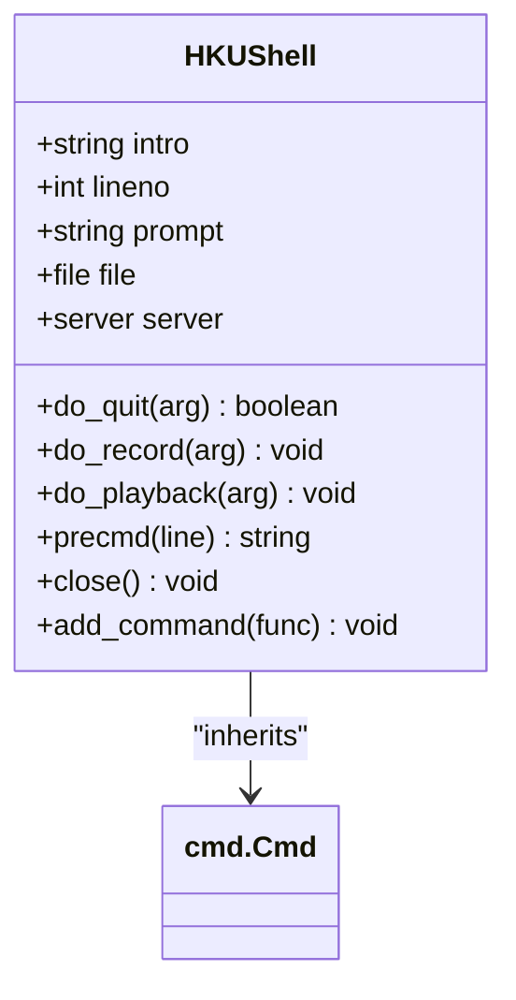
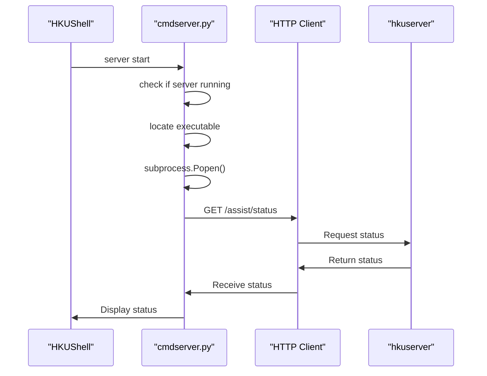
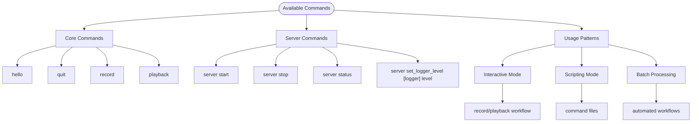
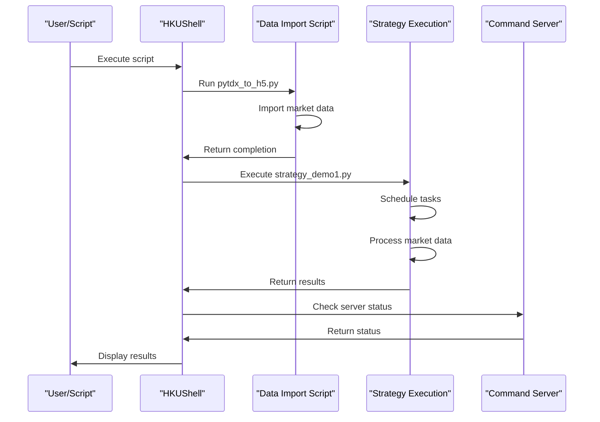
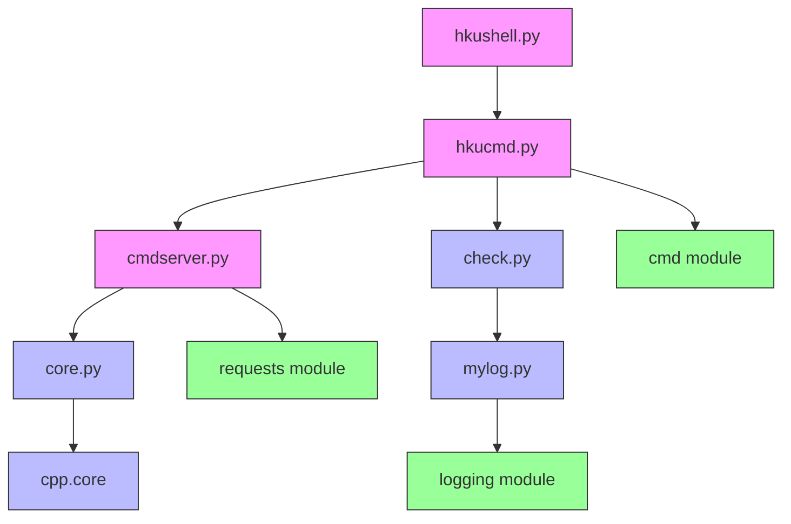
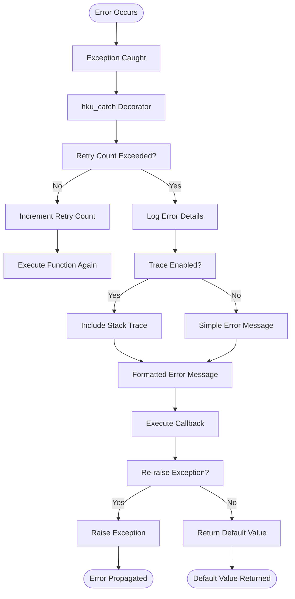

# Command Line Tools

<cite>
**Referenced Files in This Document**   
- [hkushell.py](file://hikyuu/shell/hkushell.py)
- [hkucmd.py](file://hikyuu/shell/hkucmd.py)
- [cmdserver.py](file://hikyuu/shell/cmdserver.py)
- [core.py](file://hikyuu/core.py)
- [check.py](file://hikyuu/util/check.py)
- [mylog.py](file://hikyuu/util/mylog.py)
- [pytdx_to_h5.py](file://hikyuu/data/pytdx_to_h5.py)
- [strategy_demo1.py](file://hikyuu/strategy/strategy_demo1.py)
</cite>

## Table of Contents
1. [Introduction](#introduction)
2. [Shell Interface Overview](#shell-interface-overview)
3. [Command Server Functionality](#command-server-functionality)
4. [Available Commands and Usage](#available-commands-and-usage)
5. [Automation and Scripting](#automation-and-scripting)
6. [Integration with Core Framework](#integration-with-core-framework)
7. [Error Handling and Troubleshooting](#error-handling-and-troubleshooting)
8. [Configuration Options](#configuration-options)
9. [Conclusion](#conclusion)

## Introduction

Hikyuu provides a comprehensive command line interface for automation and scripting tasks in quantitative finance. The command line tools offer a powerful shell environment and server functionality that enables users to automate data imports, execute trading strategies, and monitor system performance. This documentation provides a detailed explanation of the shell interface, command server functionality, available commands, and their parameters for batch processing and system administration.

The command line tools are designed to be accessible to beginners while providing technical depth for experienced developers. They integrate seamlessly with the core Hikyuu framework components, allowing for efficient automation of complex financial analysis and trading operations. The tools support various use cases including data import automation, strategy execution, and system monitoring through both interactive shell commands and scriptable interfaces.

**Section sources**
- [hkushell.py](file://hikyuu/shell/hkushell.py#L1-L20)
- [hkucmd.py](file://hikyuu/shell/hkucmd.py#L1-L111)

## Shell Interface Overview

The Hikyuu shell interface provides an interactive command-line environment for executing commands and automating tasks. The shell is implemented in the `hkushell.py` file and extends the standard Python `cmd` module to provide a customized command-line interface. When launched, the shell displays a welcome banner with the Hikyuu logo and introductory message, creating an engaging user experience.

The shell interface features a customizable prompt that displays the current command line number, allowing users to track their command history. Each command execution increments the line counter and updates the prompt accordingly. The interface supports command recording and playback functionality, enabling users to save command sequences to files and replay them later for automation purposes.

Key features of the shell interface include:
- Color-coded prompts for enhanced visibility
- Command history tracking with line numbering
- Support for command recording to files
- Playback of recorded command sequences
- Case-insensitive command processing
- Graceful shutdown with cleanup procedures

The shell implementation leverages the `colorama` library to provide colored output in terminal environments, improving readability and user experience. The interface is designed to be intuitive for new users while providing powerful automation capabilities for advanced users through scripting and batch processing.

**Diagram sources**
- [hkucmd.py](file://hikyuu/shell/hkucmd.py#L32-L111)
- [hkushell.py](file://hikyuu/shell/hkushell.py#L12-L13)

**Section sources**
- [hkucmd.py](file://hikyuu/shell/hkucmd.py#L32-L111)
- [hkushell.py](file://hikyuu/shell/hkushell.py#L1-L20)

## Command Server Functionality

The command server functionality in Hikyuu provides a robust mechanism for managing background processes and services. Implemented in the `cmdserver.py` file, the server component allows users to start, stop, and monitor a dedicated Hikyuu server process that can handle various computational tasks. This architecture enables separation of concerns between the interactive shell interface and the computational engine.

The server functionality includes several key operations:
- **Start**: Launches the Hikyuu server process, automatically detecting the appropriate executable based on the operating system
- **Stop**: Terminates the running server process gracefully
- **Status**: Checks the current status of the server and displays relevant information
- **Logger Level Configuration**: Allows dynamic adjustment of logging levels for different components

The server implementation uses HTTP requests to communicate with the backend service, with a default URL of `http://127.0.0.1:520/hku`. It handles authentication through token-based mechanisms, automatically obtaining and managing authentication tokens for API requests. The server can locate the executable file in multiple possible locations, including the current directory, build directories for different platforms, and installed package locations.

**Diagram sources**
- [cmdserver.py](file://hikyuu/shell/cmdserver.py#L12-L127)
- [hkushell.py](file://hikyuu/shell/hkushell.py#L15-L16)

**Section sources**
- [cmdserver.py](file://hikyuu/shell/cmdserver.py#L12-L127)

## Available Commands and Usage

The Hikyuu command line tools provide a comprehensive set of commands for various automation and administration tasks. These commands are organized into logical groups based on their functionality, making it easy for users to discover and utilize the appropriate commands for their needs.

### Core Shell Commands

The shell provides several built-in commands for basic operations and workflow management:

- **hello**: A simple command that echoes the provided argument, useful for testing and demonstration purposes
- **quit**: Exits the shell gracefully, displaying a farewell message and ensuring proper cleanup of resources
- **record**: Enables command recording to a specified file, allowing users to capture their workflow for later replay
- **playback**: Executes commands from a previously recorded file, enabling automation of repetitive tasks

### Server Management Commands

The server command provides comprehensive control over the Hikyuu server process:

- **start**: Initiates the server process (default action when no parameter is provided)
- **stop**: Terminates the running server process
- **status**: Displays the current status of the server
- **set_logger_level**: Configures the logging level for specific components or globally

### Parameter Usage

Commands accept parameters in a flexible format, with whitespace used to separate arguments. For example, the `set_logger_level` command accepts either one or two parameters:
- Single parameter: Sets the global logging level
- Two parameters: Specifies both the logger name and the desired logging level

The command processing system automatically converts input to lowercase and handles special cases like excluding recorded commands during playback operations. This design ensures consistent behavior across different usage scenarios while maintaining simplicity for end users.

**Diagram sources**
- [hkucmd.py](file://hikyuu/shell/hkucmd.py#L80-L110)
- [cmdserver.py](file://hikyuu/shell/cmdserver.py#L106-L127)

**Section sources**
- [hkucmd.py](file://hikyuu/shell/hkucmd.py#L80-L110)
- [cmdserver.py](file://hikyuu/shell/cmdserver.py#L106-L127)

## Automation and Scripting

The Hikyuu command line tools offer robust automation and scripting capabilities that enable users to create complex workflows for data processing, strategy execution, and system monitoring. The tools support various automation patterns, from simple command sequences to sophisticated batch processing pipelines.

### Data Import Automation

The framework includes specialized scripts for automating data imports from various sources. For example, the `pytdx_to_h5.py` script demonstrates how to automate the import of market data from TDX format to HDF5 storage. This script handles various aspects of data import including:

- Index and stock name updates
- Historical data import with progress tracking
- Error handling and retry mechanisms
- Database and file system operations

Users can create custom scripts that leverage these patterns to automate their specific data import requirements, ensuring consistent and reliable data processing workflows.

### Strategy Execution Automation

The command line tools integrate with Hikyuu's strategy execution framework, allowing users to automate trading strategy analysis and execution. The `strategy_demo1.py` example demonstrates how to create automated strategy workflows that can:

- Schedule functions to run at specific times
- Respond to market data updates
- Process real-time market data
- Execute periodic analysis tasks

These capabilities enable users to create sophisticated automated trading systems that can operate independently or as part of larger quantitative analysis workflows.

### Batch Processing Patterns

The tools support several batch processing patterns for handling large volumes of data or executing multiple tasks in sequence:

- **Command Recording and Playback**: Users can record interactive sessions and replay them as automated scripts
- **Parameterized Scripts**: Commands can accept parameters, allowing for flexible automation of repetitive tasks
- **Error-Resilient Workflows**: The framework includes error handling mechanisms that allow scripts to continue execution even when individual commands fail

These automation capabilities make it possible to create comprehensive workflows that handle complex financial analysis tasks with minimal manual intervention.

**Diagram sources**
- [pytdx_to_h5.py](file://hikyuu/data/pytdx_to_h5.py#L1-L200)
- [strategy_demo1.py](file://hikyuu/strategy/strategy_demo1.py#L1-L54)

**Section sources**
- [pytdx_to_h5.py](file://hikyuu/data/pytdx_to_h5.py#L1-L200)
- [strategy_demo1.py](file://hikyuu/strategy/strategy_demo1.py#L1-L54)

## Integration with Core Framework

The command line tools are tightly integrated with the core Hikyuu framework components, providing seamless access to the underlying quantitative analysis and trading capabilities. This integration is achieved through a well-defined architecture that connects the command line interface with the core computational engine.

### Core Module Integration

The `core.py` file serves as the entry point to the Hikyuu framework, dynamically importing the appropriate core module based on the Python version. This design ensures compatibility across different Python environments while providing access to the full range of Hikyuu's computational capabilities. The command line tools leverage this integration to access advanced features such as:

- Technical indicator calculations
- Strategy backtesting
- Portfolio optimization
- Risk management functions

### Error Handling Integration

The command line tools integrate with Hikyuu's comprehensive error handling system, implemented in the `check.py` and `mylog.py` files. This integration provides robust error detection and reporting capabilities, including:

- Exception handling with detailed error messages
- Stack trace information for debugging
- Configurable retry mechanisms
- Callback functions for error recovery

The `hku_catch` decorator, defined in `check.py`, is used throughout the command line tools to wrap functions and provide consistent error handling. This decorator supports various parameters for controlling error behavior, including retry counts, error tracing, and callback execution.

### Logging Integration

The tools leverage Hikyuu's logging framework to provide detailed operational feedback and debugging information. The `mylog.py` file implements a comprehensive logging system that supports:

- Multiple log levels (debug, info, warning, error, critical)
- Rotating file handlers to manage log file size
- Thread-safe logging operations
- Custom log formatting with source information

This logging integration enables users to monitor command execution, troubleshoot issues, and analyze system performance through detailed log records.

**Diagram sources**
- [core.py](file://hikyuu/core.py#L1-L30)
- [check.py](file://hikyuu/util/check.py#L1-L162)
- [mylog.py](file://hikyuu/util/mylog.py#L1-L200)

**Section sources**
- [core.py](file://hikyuu/core.py#L1-L30)
- [check.py](file://hikyuu/util/check.py#L1-L162)
- [mylog.py](file://hikyuu/util/mylog.py#L1-L200)

## Error Handling and Troubleshooting

The Hikyuu command line tools incorporate comprehensive error handling and troubleshooting mechanisms to ensure reliable operation and facilitate issue resolution. These mechanisms are designed to handle various failure scenarios gracefully while providing users with actionable information for diagnosing and resolving problems.

### Common Command Execution Issues

Several common issues may occur during command execution, including:

- **Server Startup Failures**: The server process may fail to start due to missing executable files, permission issues, or port conflicts. The system attempts to locate the server executable in multiple predefined locations and provides clear error messages when the executable cannot be found.

- **Authentication Problems**: Issues with token-based authentication may occur if the login process fails or tokens expire. The system automatically handles token acquisition and renewal, with detailed error reporting when authentication fails.

- **Network Connectivity Issues**: HTTP communication with the server may fail due to network problems or server unavailability. The tools provide timeout handling and retry mechanisms to address transient connectivity issues.

### Error Recovery Strategies

The framework implements several error recovery strategies to maintain system stability:

- **Retry Mechanisms**: Critical operations include configurable retry counts, allowing transient failures to be overcome through repeated attempts.

- **Graceful Degradation**: When certain features are unavailable, the system attempts to continue operation with reduced functionality rather than failing completely.

- **Resource Cleanup**: Proper cleanup procedures ensure that resources are released even when errors occur, preventing resource leaks and system instability.

### Troubleshooting Guide

When encountering issues with the command line tools, users should follow these troubleshooting steps:

1. **Check Server Status**: Use the `server status` command to verify if the server process is running correctly.

2. **Review Log Files**: Examine the log files in the user's home directory (`~/.hikyuu/hikyuu_py.log`) for detailed error information and stack traces.

3. **Verify Executable Location**: Ensure that the server executable (`hkuserver` or `hkuserver.exe`) is available in one of the expected locations.

4. **Check Network Configuration**: Verify that the server URL (`http://127.0.0.1:520/hku`) is accessible and that no firewall rules are blocking the connection.

5. **Validate Python Environment**: Ensure that all required dependencies are installed and that the Python environment is correctly configured.

The error handling system provides detailed error messages that include the source file and line number where the error occurred, facilitating rapid diagnosis and resolution of issues.

**Diagram sources**
- [check.py](file://hikyuu/util/check.py#L97-L141)
- [mylog.py](file://hikyuu/util/mylog.py#L144-L152)

**Section sources**
- [check.py](file://hikyuu/util/check.py#L97-L141)
- [mylog.py](file://hikyuu/util/mylog.py#L144-L152)

## Configuration Options

The Hikyuu command line tools offer various configuration options that allow users to customize the behavior of the system according to their specific requirements. These configuration options are designed to provide flexibility while maintaining ease of use for common scenarios.

### Server Configuration

The command server functionality includes several configurable parameters:

- **Server URL**: The base URL for server communication can be modified by changing the `g_server_url` variable in `cmdserver.py`. The default value is `http://127.0.0.1:520/hku`.

- **API Version**: The API version used for server communication is configurable through the `g_api_version` variable, currently set to "v1".

- **Executable Locations**: The system searches for the server executable in multiple predefined locations, including the current directory, platform-specific build directories, and installed package locations.

### Logging Configuration

The logging system provides several configuration options:

- **Log File Location**: Log files are stored in the user's home directory under `~/.hikyuu/hikyuu_py.log` by default, but this location can be customized.

- **Log Level**: The logging level can be adjusted globally or for specific components using the `set_logger_level` command.

- **Log Rotation**: The system uses rotating file handlers with a maximum size of 10KB and up to 3 backup files, which can be modified as needed.

### Environment Variables

While not explicitly defined in the provided code, the system architecture supports configuration through environment variables and configuration files. Users can extend the functionality by creating custom configuration files that define parameters such as:

- Data source locations
- Database connection strings
- Strategy parameters
- Trading account information

These configuration options enable users to adapt the command line tools to different environments and use cases, from development and testing to production deployment.

**Section sources**
- [cmdserver.py](file://hikyuu/shell/cmdserver.py#L17-L20)
- [mylog.py](file://hikyuu/util/mylog.py#L61-L68)

## Conclusion

The Hikyuu command line tools provide a comprehensive and powerful interface for automation and scripting in quantitative finance. Through the integration of an interactive shell environment and a robust command server, users can efficiently automate data imports, execute trading strategies, and monitor system performance.

The tools are designed with a clear architecture that separates the user interface from the computational engine, enabling scalable and maintainable workflows. The integration with the core Hikyuu framework provides access to advanced quantitative analysis capabilities, while the comprehensive error handling and logging systems ensure reliable operation and facilitate troubleshooting.

For beginners, the intuitive command structure and comprehensive documentation make it easy to get started with basic automation tasks. For experienced developers, the extensible architecture and access to low-level framework components provide the flexibility needed for complex custom workflows.

By leveraging the command line tools, users can create sophisticated automation pipelines that handle various aspects of quantitative finance, from data processing and strategy development to execution and monitoring. The tools support various automation patterns, including interactive sessions, scripted workflows, and batch processing, making them suitable for a wide range of use cases in financial analysis and algorithmic trading.