# Data Import Tools

<cite>
**Referenced Files in This Document**   
- [ImportBlockInfoTask.py](file://hikyuu/gui/data/ImportBlockInfoTask.py)
- [ImportHistoryFinanceTask.py](file://hikyuu/gui/data/ImportHistoryFinanceTask.py)
- [ImportPytdxToH5Task.py](file://hikyuu/gui/data/ImportPytdxToH5Task.py)
- [ImportPytdxTransToH5Task.py](file://hikyuu/gui/data/ImportPytdxTransToH5Task.py)
- [ImportZhBond10Task.py](file://hikyuu/gui/data/ImportZhBond10Task.py)
- [UsePytdxImportToH5Thread.py](file://hikyuu/gui/data/UsePytdxImportToH5Thread.py)
- [UseTdxImportToH5Thread.py](file://hikyuu/gui/data/UseTdxImportToH5Thread.py)
- [SchedImportThread.py](file://hikyuu/gui/data/SchedImportThread.py)
- [importdata.py](file://hikyuu/gui/importdata.py)
- [common_h5.py](file://hikyuu/data/common_h5.py)
- [common_mysql.py](file://hikyuu/data/common_mysql.py)
- [common_sqlite3.py](file://hikyuu/data/common_sqlite3.py)
- [hku_config_template.py](file://hikyuu/data/hku_config_template.py)
- [pytdx_to_h5.py](file://hikyuu/data/pytdx_to_h5.py)
- [tdx_to_h5.py](file://hikyuu/data/tdx_to_h5.py)
</cite>

## Table of Contents
1. [Introduction](#introduction)
2. [Core Import Tasks](#core-import-tasks)
3. [Thread-Based Architecture](#thread-based-architecture)
4. [Configuration and Parameters](#configuration-and-parameters)
5. [Progress Tracking and Error Handling](#progress-tracking-and-error-handling)
6. [Data Driver Integration](#data-driver-integration)
7. [Common Issues and Troubleshooting](#common-issues-and-troubleshooting)
8. [Customization and Extension](#customization-and-extension)
9. [Conclusion](#conclusion)

## Introduction
The hikyuu GUI provides comprehensive data import tools for financial analysis, supporting various data types including block information, historical finance data, transaction data, and bond data. These tools are designed with a thread-based architecture to ensure asynchronous operations that prevent UI blocking during data import processes. The system supports multiple data storage backends including HDF5, MySQL, and SQLite, allowing users to choose the most suitable storage solution for their needs. This documentation provides detailed information about the implementation, usage, and customization of these data import tools, making them accessible to both beginners and advanced developers.

## Core Import Tasks

The data import functionality in hikyuu is organized into specialized task classes, each responsible for importing a specific type of financial data. These tasks follow a consistent design pattern with initialization parameters and a callable interface that executes the import operation.

### Block Information Import
The `ImportBlockInfoTask` class handles the import of block information such as industry sectors, regional blocks, and concept blocks. This task connects to the configured database backend (HDF5, MySQL, or ClickHouse) and imports block data from external sources.

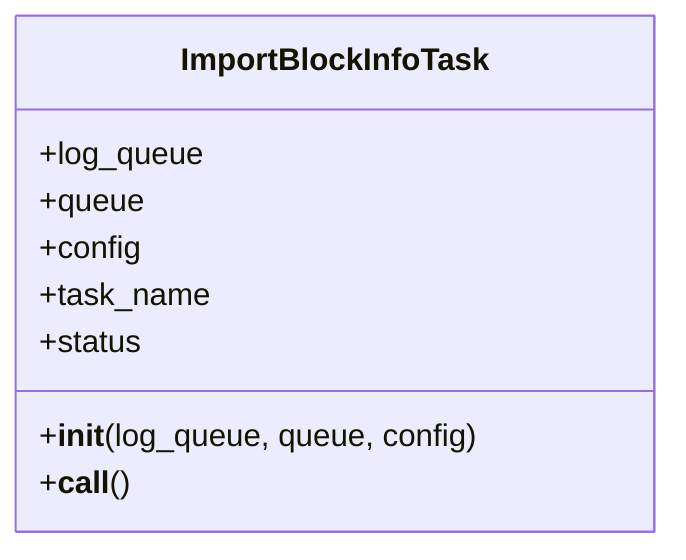
```mermaid
classDiagram
class ImportBlockInfoTask {
+log_queue
+queue
+config
+task_name
+status
+__init__(log_queue, queue, config)
+__call__()
}
```

**Diagram sources**
- [ImportBlockInfoTask.py](file://hikyuu/gui/data/ImportBlockInfoTask.py#L15-L61)

### Historical Finance Data Import
The `ImportHistoryFinanceTask` class manages the import of historical financial data from TDX servers. This task downloads financial reports, verifies their integrity using MD5 hashes, and imports the data into the configured database.

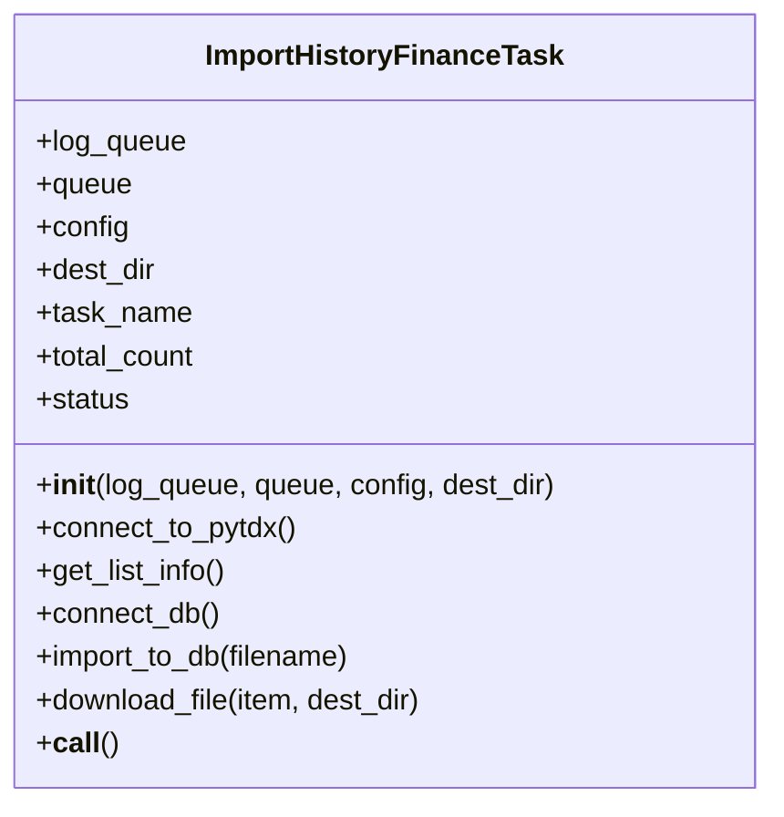
```mermaid
classDiagram
class ImportHistoryFinanceTask {
+log_queue
+queue
+config
+dest_dir
+task_name
+total_count
+status
+__init__(log_queue, queue, config, dest_dir)
+connect_to_pytdx()
+get_list_info()
+connect_db()
+import_to_db(filename)
+download_file(item, dest_dir)
+__call__()
}
```

**Diagram sources**
- [ImportHistoryFinanceTask.py](file://hikyuu/gui/data/ImportHistoryFinanceTask.py#L38-L162)

### K-Line Data Import
The `ImportPytdxToH5` class handles the import of K-line data (daily, 5-minute, and 1-minute) from TDX servers. This task supports progress tracking and can resume from a specified start date.

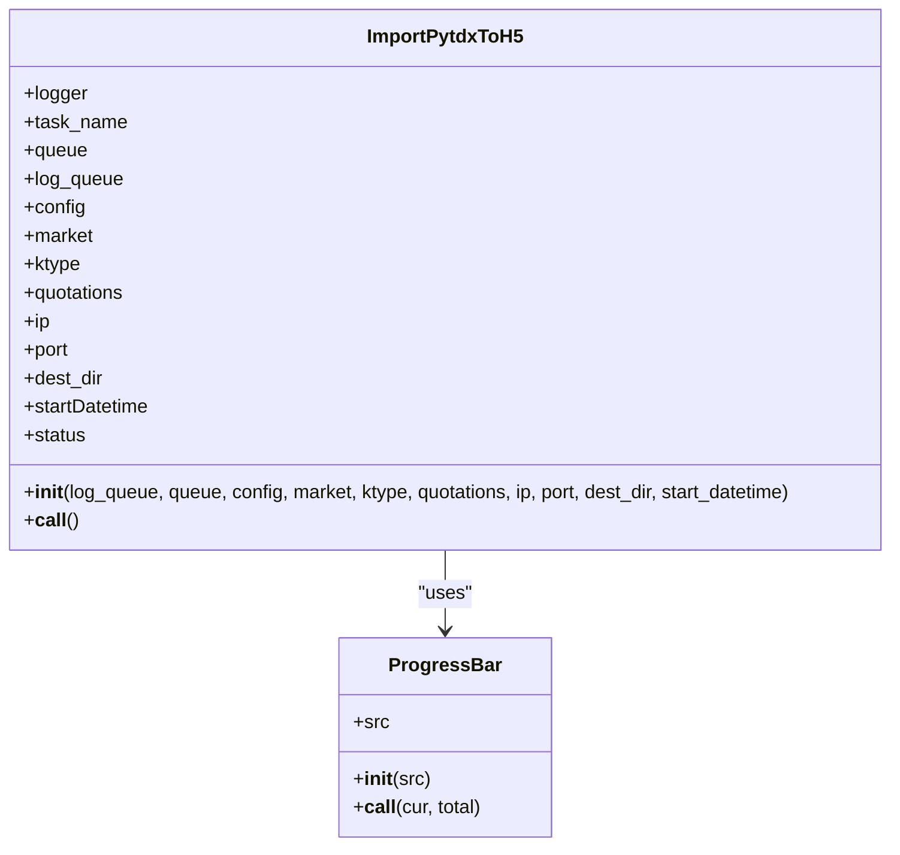
```mermaid
classDiagram
class ImportPytdxToH5 {
+logger
+task_name
+queue
+log_queue
+config
+market
+ktype
+quotations
+ip
+port
+dest_dir
+startDatetime
+status
+__init__(log_queue, queue, config, market, ktype, quotations, ip, port, dest_dir, start_datetime)
+__call__()
}
class ProgressBar {
+src
+__init__(src)
+__call__(cur, total)
}
ImportPytdxToH5 --> ProgressBar : "uses"
```

**Diagram sources**
- [ImportPytdxToH5Task.py](file://hikyuu/gui/data/ImportPytdxToH5Task.py#L45-L113)

### Transaction Data Import
The `ImportPytdxTransToH5` class manages the import of transaction data (tick data) from TDX servers. This task supports importing data for a specified maximum number of days.

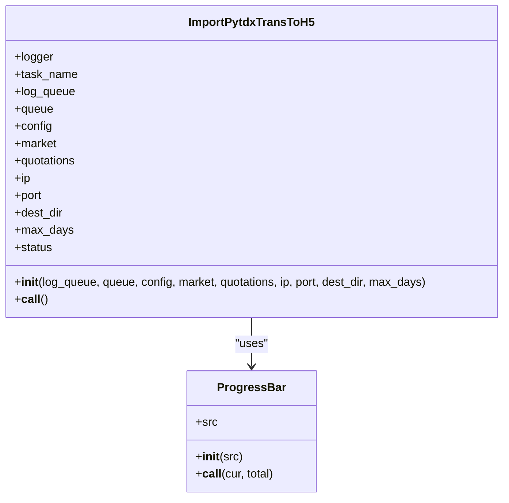
```mermaid
classDiagram
class ImportPytdxTransToH5 {
+logger
+task_name
+log_queue
+queue
+config
+market
+quotations
+ip
+port
+dest_dir
+max_days
+status
+__init__(log_queue, queue, config, market, quotations, ip, port, dest_dir, max_days)
+__call__()
}
class ProgressBar {
+src
+__init__(src)
+__call__(cur, total)
}
ImportPytdxTransToH5 --> ProgressBar : "uses"
```

**Diagram sources**
- [ImportPytdxTransToH5Task.py](file://hikyuu/gui/data/ImportPytdxTransToH5Task.py#L45-L107)

### Bond Data Import
The `ImportZhBond10Task` class handles the import of 10-year Chinese government bond yield data. This task connects to the configured database backend and imports bond data from external sources.

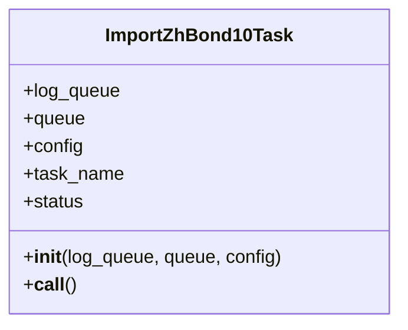
```mermaid
classDiagram
class ImportZhBond10Task {
+log_queue
+queue
+config
+task_name
+status
+__init__(log_queue, queue, config)
+__call__()
}
```

**Diagram sources**
- [ImportZhBond10Task.py](file://hikyuu/gui/data/ImportZhBond10Task.py#L16-L60)

## Thread-Based Architecture

The data import system in hikyuu employs a sophisticated thread-based architecture to ensure responsive UI performance while handling potentially long-running import operations. This architecture uses Qt's QThread class in combination with Python's multiprocessing module to achieve true parallelism.

### Main Import Thread
The `UsePytdxImportToH5Thread` class serves as the main orchestrator for data import operations. It manages multiple import tasks that run in separate processes, preventing the UI from becoming unresponsive.

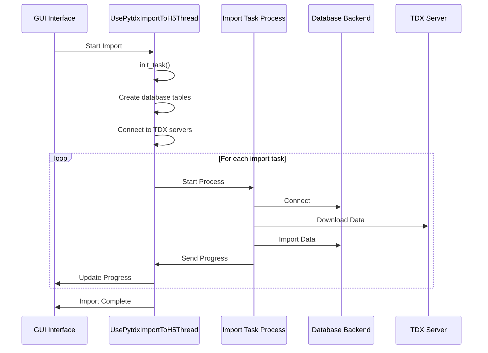
```mermaid
sequenceDiagram
participant UI as GUI Interface
participant MainThread as UsePytdxImportToH5Thread
participant TaskProcess as Import Task Process
participant Database as Database Backend
UI->>MainThread : Start Import
MainThread->>MainThread : init_task()
MainThread->>MainThread : Create database tables
MainThread->>MainThread : Connect to TDX servers
loop For each import task
MainThread->>TaskProcess : Start Process
TaskProcess->>Database : Connect
TaskProcess->>TDX Server : Download Data
TaskProcess->>Database : Import Data
TaskProcess->>MainThread : Send Progress
MainThread->>UI : Update Progress
end
MainThread->>UI : Import Complete
```

**Diagram sources**
- [UsePytdxImportToH5Thread.py](file://hikyuu/gui/data/UsePytdxImportToH5Thread.py#L60-L395)

### Task Execution Flow
The thread-based architecture follows a specific execution flow to ensure efficient and reliable data import:

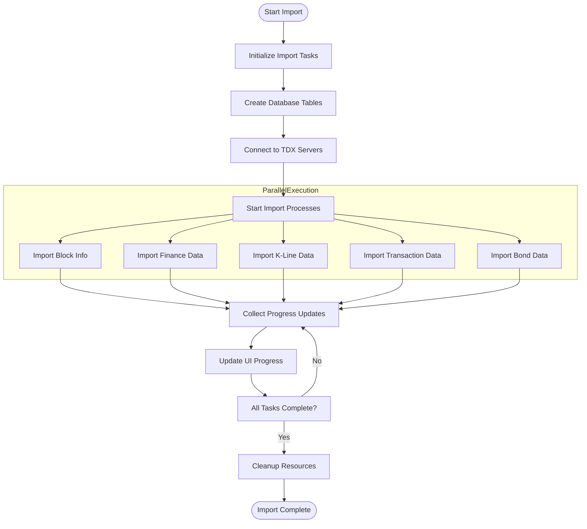
```mermaid
flowchart TD
Start([Start Import]) --> InitTask["Initialize Import Tasks"]
InitTask --> CreateDB["Create Database Tables"]
CreateDB --> ConnectTDX["Connect to TDX Servers"]
ConnectTDX --> StartProcesses["Start Import Processes"]
subgraph ParallelExecution
StartProcesses --> Task1["Import Block Info"]
StartProcesses --> Task2["Import Finance Data"]
StartProcesses --> Task3["Import K-Line Data"]
StartProcesses --> Task4["Import Transaction Data"]
StartProcesses --> Task5["Import Bond Data"]
end
Task1 --> CollectProgress["Collect Progress Updates"]
Task2 --> CollectProgress
Task3 --> CollectProgress
Task4 --> CollectProgress
Task5 --> CollectProgress
CollectProgress --> UpdateUI["Update UI Progress"]
UpdateUI --> CheckCompletion["All Tasks Complete?"]
CheckCompletion --> |No| CollectProgress
CheckCompletion --> |Yes| Cleanup["Cleanup Resources"]
Cleanup --> End([Import Complete])
```

**Diagram sources**
- [UsePytdxImportToH5Thread.py](file://hikyuu/gui/data/UsePytdxImportToH5Thread.py#L230-L395)
- [UseTdxImportToH5Thread.py](file://hikyuu/gui/data/UseTdxImportToH5Thread.py#L193-L358)

### Scheduling Thread
The `SchedImportThread` class provides scheduled import functionality, allowing users to configure automatic data imports at specific times.

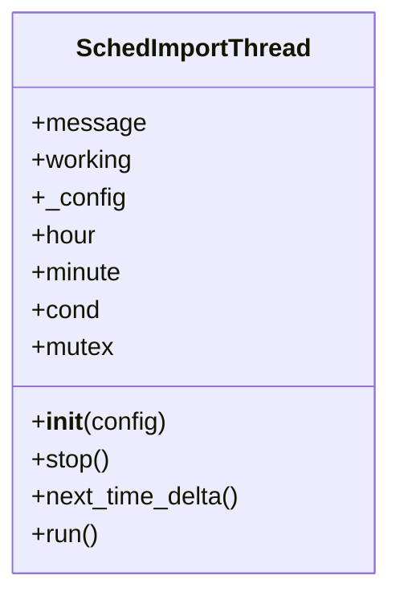
```mermaid
classDiagram
class SchedImportThread {
+message
+working
+_config
+hour
+minute
+cond
+mutex
+__init__(config)
+stop()
+next_time_delta()
+run()
}
```

**Diagram sources**
- [SchedImportThread.py](file://hikyuu/gui/data/SchedImportThread.py#L15-L62)

## Configuration and Parameters

The data import tools in hikyuu are highly configurable through INI configuration files. These configurations control various aspects of the import process, including data sources, storage locations, and import parameters.

### Configuration Structure
The configuration system uses a hierarchical structure with multiple sections that control different aspects of the import process:

```mermaid
erDiagram
CONFIGURATION {
string section PK
string parameter PK
string value
}
CONFIGURATION ||--o{ QUOTATION : "contains"
CONFIGURATION ||--o{ KTYPE : "contains"
CONFIGURATION ||--o{ WEIGHT : "contains"
CONFIGURATION ||--o{ FINANCE : "contains"
CONFIGURATION ||--o{ BLOCK : "contains"
CONFIGURATION ||--o{ TDX : "contains"
CONFIGURATION ||--o{ PYTDX : "contains"
CONFIGURATION ||--o{ HDF5 : "contains"
CONFIGURATION ||--o{ MYSQL : "contains"
CONFIGURATION ||--o{ CLICKHOUSE : "contains"
CONFIGURATION ||--o{ SCHED : "contains"
CONFIGURATION ||--o{ COLLECT : "contains"
CONFIGURATION ||--o{ PRELOAD : "contains"
}
QUOTATION {
boolean stock
boolean fund
boolean future
}
KTYPE {
boolean day
boolean min
boolean min5
boolean trans
boolean time
string day_start_date
string min_start_date
string min5_start_date
string trans_start_date
string time_start_date
}
WEIGHT {
boolean enable
}
FINANCE {
boolean enable
}
BLOCK {
boolean enable
}
TDX {
boolean enable
string dir
}
PYTDX {
boolean enable
int use_tdx_number
}
HDF5 {
boolean enable
string dir
}
MYSQL {
boolean enable
string tmpdir
string host
int port
string usr
string pwd
}
CLICKHOUSE {
boolean enable
string tmpdir
string host
int http_port
int port
string usr
string pwd
}
SCHED {
string time
}
COLLECT {
string quotation_server
int interval
string source
boolean use_zhima_proxy
string phase1_start
string phase1_end
string phase2_start
string phase2_end
}
PRELOAD {
boolean day
boolean week
boolean month
boolean quarter
boolean halfyear
boolean year
boolean min
boolean min5
boolean min15
boolean min30
boolean min60
boolean hour2
int day_max
int week_max
int month_max
int quarter_max
int halfyear_max
int year_max
int min_max
int min5_max
int min15_max
int min30_max
int min60_max
int hour2_max
}
```

**Diagram sources**
- [hku_config_template.py](file://hikyuu/data/hku_config_template.py#L206-L300)

### Default Configuration Template
The system provides a default configuration template that can be generated automatically:

```ini
[quotation]
stock = True
fund = True
future = False

[ktype]
day = True
min = True
min5 = True
trans = False
time = False
day_start_date = 1990-12-19
min_start_date = 2023-09-19
min5_start_date = 2023-09-19
trans_start_date = 2023-12-11
time_start_date = 2023-12-11

[weight]
enable = True

[finance]
enable = True

[block]
enable = True

[tdx]
enable = False
;dir = d:/TdxW_HuaTai

[pytdx]
enable = False
use_tdx_number = 10

[hdf5]
enable = True
dir = {dir}

[mysql]
enable = False
;tmpdir = D:/stock/
;host = 127.0.0.1
;port = 3306
;usr = root
;pwd = 

[clickhouse]
enable = False
;tmpdir = D:/stock
;host = 127.0.0.1
;http_port = 8123
;port = 9000
;usr = root
;pwd = 

[sched]
time = 18:00:00

[collect]
quotation_server = ipc:///tmp/hikyuu_real.ipc
interval = 305
source = qq
use_zhima_proxy = False
phase1_start = 00:00:00
phase1_end = 11:35:00
phase2_start = 12:00:00
phase2_end = 15:05:00

[preload]
day = True
week = True
month = True
quarter = False
halfyear = False
year = False
min = False
min5 = False
min15 = False
min30 = False
min60 = False
hour2 = False
day_max = 100000
week_max = 100000
month_max = 100000
quarter_max = 100000
halfyear_max = 100000
year_max = 100000
min_max = 5120
min5_max = 5120
min15_max = 5120
min30_max = 5120
min60_max = 5120
hour2_max = 5120
```

**Section sources**
- [hku_config_template.py](file://hikyuu/data/hku_config_template.py#L206-L300)

## Progress Tracking and Error Handling

The data import system includes comprehensive progress tracking and error handling mechanisms to ensure reliable operation and provide users with clear feedback on import status.

### Progress Tracking Mechanism
The system uses a message queue to communicate progress updates from background processes to the main UI thread:

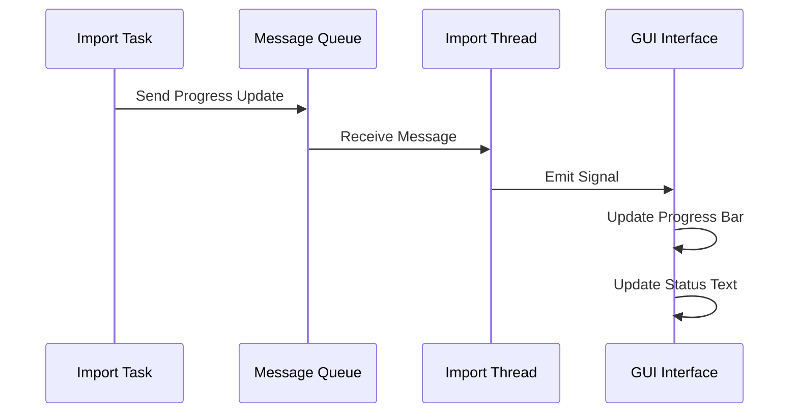
```mermaid
sequenceDiagram
participant Task as Import Task
participant Queue as Message Queue
participant Thread as Import Thread
participant UI as GUI Interface
Task->>Queue : Send Progress Update
Queue->>Thread : Receive Message
Thread->>UI : Emit Signal
UI->>UI : Update Progress Bar
UI->>UI : Update Status Text
```

**Diagram sources**
- [UsePytdxImportToH5Thread.py](file://hikyuu/gui/data/UsePytdxImportToH5Thread.py#L320-L369)

### Error Handling Strategy
The import tasks implement robust error handling to manage various failure scenarios:

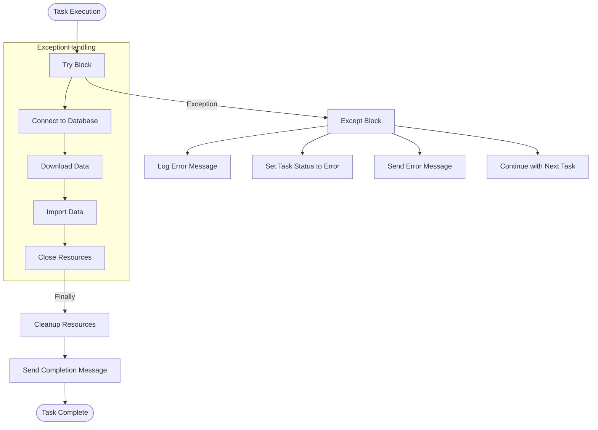
```mermaid
flowchart TD
Start([Task Execution]) --> TryBlock["Try Block"]
subgraph ExceptionHandling
TryBlock --> ConnectDB["Connect to Database"]
ConnectDB --> DownloadData["Download Data"]
DownloadData --> ImportData["Import Data"]
ImportData --> CloseResources["Close Resources"]
end
TryBlock --> |Exception| ExceptBlock["Except Block"]
ExceptBlock --> LogError["Log Error Message"]
ExceptBlock --> SetStatus["Set Task Status to Error"]
ExceptBlock --> SendError["Send Error Message"]
ExceptBlock --> Continue["Continue with Next Task"]
CloseResources --> |Finally| Cleanup["Cleanup Resources"]
Cleanup --> SendComplete["Send Completion Message"]
SendComplete --> End([Task Complete])
```

**Diagram sources**
- [ImportHistoryFinanceTask.py](file://hikyuu/gui/data/ImportHistoryFinanceTask.py#L126-L150)
- [ImportPytdxToH5Task.py](file://hikyuu/gui/data/ImportPytdxToH5Task.py#L61-L113)

### Message Format
The system uses a standardized message format for communication between components:

```python
# Message format: [task_name, market, ktype, progress, total]
# Examples:
["IMPORT_KDATA", "SH", "DAY", 50, 1000]  # 50% complete, 1000 total records
["IMPORT_FINANCE", None, None, 75, None]  # 75% complete
["IMPORT_BLOCKINFO", "BLOCKINFO", "板块信息更新完毕: 123", None, None]  # Complete
["IMPORT_ZH_BOND10", "ZH_BOND10", "10年期中国国债收益率下载完毕", None, None]  # Complete
["THREAD", "FINISHED"]  # All tasks complete
["THREAD", "FAILURE", "Connection error"]  # System failure
```

**Section sources**
- [UsePytdxImportToH5Thread.py](file://hikyuu/gui/data/UsePytdxImportToH5Thread.py#L322-L337)

## Data Driver Integration

The data import tools integrate with various data drivers to support different storage backends. This section explains how the import tasks interact with the underlying data drivers for HDF5, MySQL, and SQLite.

### HDF5 Data Driver
The HDF5 driver provides efficient storage for large datasets using the PyTables library:

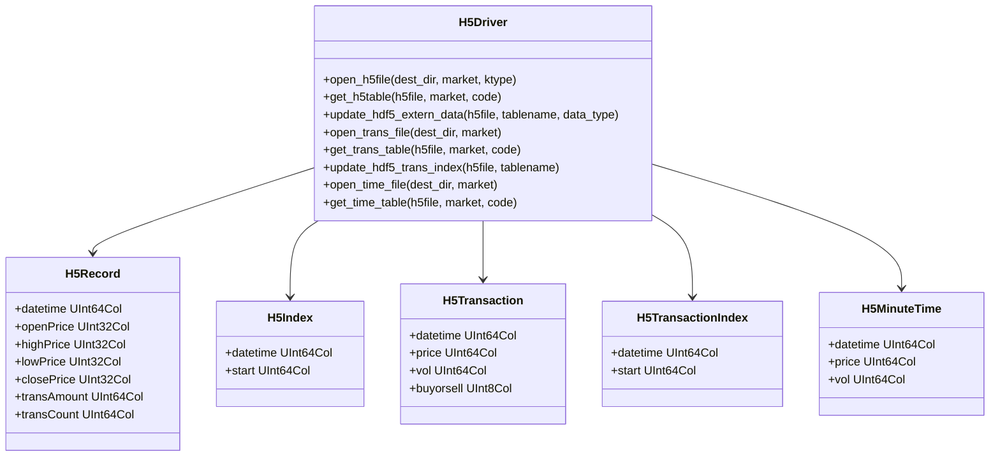
```mermaid
classDiagram
class H5Record {
+datetime UInt64Col
+openPrice UInt32Col
+highPrice UInt32Col
+lowPrice UInt32Col
+closePrice UInt32Col
+transAmount UInt64Col
+transCount UInt64Col
}
class H5Index {
+datetime UInt64Col
+start UInt64Col
}
class H5Transaction {
+datetime UInt64Col
+price UInt64Col
+vol UInt64Col
+buyorsell UInt8Col
}
class H5TransactionIndex {
+datetime UInt64Col
+start UInt64Col
}
class H5MinuteTime {
+datetime UInt64Col
+price UInt64Col
+vol UInt64Col
}
class H5Driver {
+open_h5file(dest_dir, market, ktype)
+get_h5table(h5file, market, code)
+update_hdf5_extern_data(h5file, tablename, data_type)
+open_trans_file(dest_dir, market)
+get_trans_table(h5file, market, code)
+update_hdf5_trans_index(h5file, tablename)
+open_time_file(dest_dir, market)
+get_time_table(h5file, market, code)
}
H5Driver --> H5Record
H5Driver --> H5Index
H5Driver --> H5Transaction
H5Driver --> H5TransactionIndex
H5Driver --> H5MinuteTime
```

**Diagram sources**
- [common_h5.py](file://hikyuu/data/common_h5.py#L34-L398)

### MySQL Data Driver
The MySQL driver provides integration with MySQL databases for data storage:

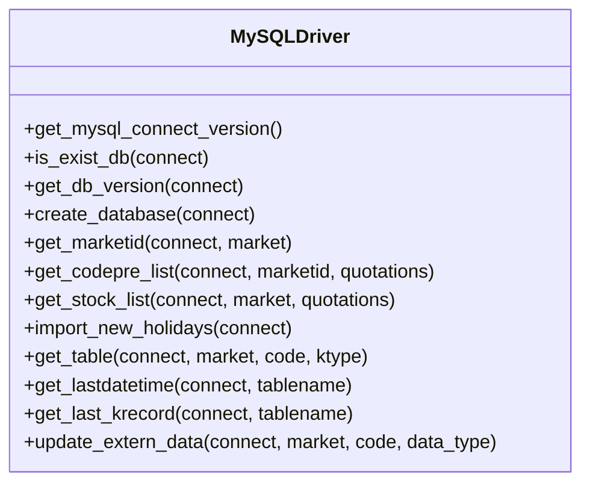
```mermaid
classDiagram
class MySQLDriver {
+get_mysql_connect_version()
+is_exist_db(connect)
+get_db_version(connect)
+create_database(connect)
+get_marketid(connect, market)
+get_codepre_list(connect, marketid, quotations)
+get_stock_list(connect, market, quotations)
+import_new_holidays(connect)
+get_table(connect, market, code, ktype)
+get_lastdatetime(connect, tablename)
+get_last_krecord(connect, tablename)
+update_extern_data(connect, market, code, data_type)
}
```

**Diagram sources**
- [common_mysql.py](file://hikyuu/data/common_mysql.py#L35-L522)

### SQLite Data Driver
The SQLite driver provides lightweight database storage using SQLite:

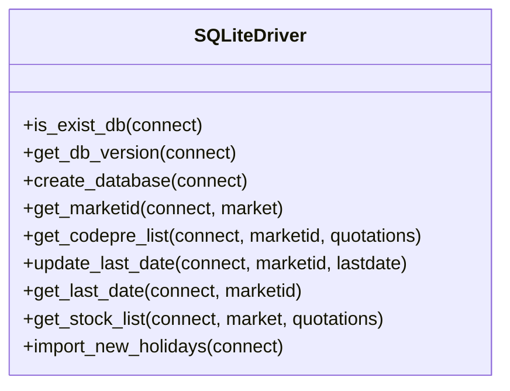
```mermaid
classDiagram
class SQLiteDriver {
+is_exist_db(connect)
+get_db_version(connect)
+create_database(connect)
+get_marketid(connect, market)
+get_codepre_list(connect, marketid, quotations)
+update_last_date(connect, marketid, lastdate)
+get_last_date(connect, marketid)
+get_stock_list(connect, market, quotations)
+import_new_holidays(connect)
}
```

**Diagram sources**
- [common_sqlite3.py](file://hikyuu/data/common_sqlite3.py#L33-L142)

### Driver Selection Logic
The import tasks dynamically select the appropriate data driver based on configuration:

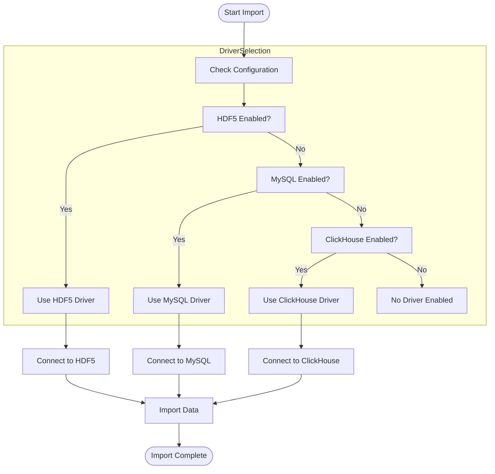
```mermaid
flowchart TD
Start([Start Import]) --> CheckConfig["Check Configuration"]
subgraph DriverSelection
CheckConfig --> HDF5Enabled["HDF5 Enabled?"]
HDF5Enabled --> |Yes| UseHDF5["Use HDF5 Driver"]
HDF5Enabled --> |No| MySQLEnabled["MySQL Enabled?"]
MySQLEnabled --> |Yes| UseMySQL["Use MySQL Driver"]
MySQLEnabled --> |No| ClickHouseEnabled["ClickHouse Enabled?"]
ClickHouseEnabled --> |Yes| UseClickHouse["Use ClickHouse Driver"]
ClickHouseEnabled --> |No| Error["No Driver Enabled"]
end
UseHDF5 --> ConnectHDF5["Connect to HDF5"]
UseMySQL --> ConnectMySQL["Connect to MySQL"]
UseClickHouse --> ConnectClickHouse["Connect to ClickHouse"]
ConnectHDF5 --> ImportData["Import Data"]
ConnectMySQL --> ImportData
ConnectClickHouse --> ImportData
ImportData --> End([Import Complete])
```

**Section sources**
- [ImportBlockInfoTask.py](file://hikyuu/gui/data/ImportBlockInfoTask.py#L27-L50)
- [ImportHistoryFinanceTask.py](file://hikyuu/gui/data/ImportHistoryFinanceTask.py#L67-L91)
- [ImportPytdxToH5Task.py](file://hikyuu/gui/data/ImportPytdxToH5Task.py#L65-L91)

## Common Issues and Troubleshooting

This section addresses common issues that users may encounter when using the data import tools and provides troubleshooting solutions.

### Network Connectivity Issues
When the system cannot connect to TDX servers, users may encounter connectivity issues:

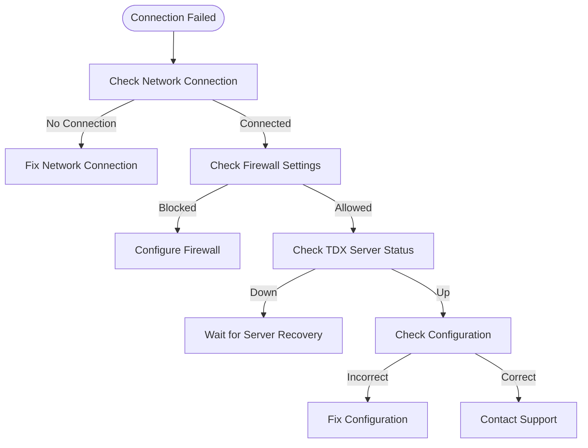
```mermaid
flowchart TD
Start([Connection Failed]) --> CheckNetwork["Check Network Connection"]
CheckNetwork --> |No Connection| FixNetwork["Fix Network Connection"]
CheckNetwork --> |Connected| CheckFirewall["Check Firewall Settings"]
CheckFirewall --> |Blocked| ConfigureFirewall["Configure Firewall"]
CheckFirewall --> |Allowed| CheckServer["Check TDX Server Status"]
CheckServer --> |Down| WaitServer["Wait for Server Recovery"]
CheckServer --> |Up| CheckConfig["Check Configuration"]
CheckConfig --> |Incorrect| FixConfig["Fix Configuration"]
CheckConfig --> |Correct| ContactSupport["Contact Support"]
```

**Troubleshooting Steps:**
1. Verify internet connectivity
2. Check firewall settings to ensure TDX ports are not blocked
3. Verify TDX server configuration in importdata-gui.ini
4. Try alternative TDX servers if available
5. Check if TDX servers are temporarily down

**Section sources**
- [UsePytdxImportToH5Thread.py](file://hikyuu/gui/data/UsePytdxImportToH5Thread.py#L123-L126)
- [UseTdxImportToH5Thread.py](file://hikyuu/gui/data/UseTdxImportToH5Thread.py#L120-L123)

### Incomplete Imports
Incomplete imports can occur due to various reasons such as interrupted connections or insufficient disk space:

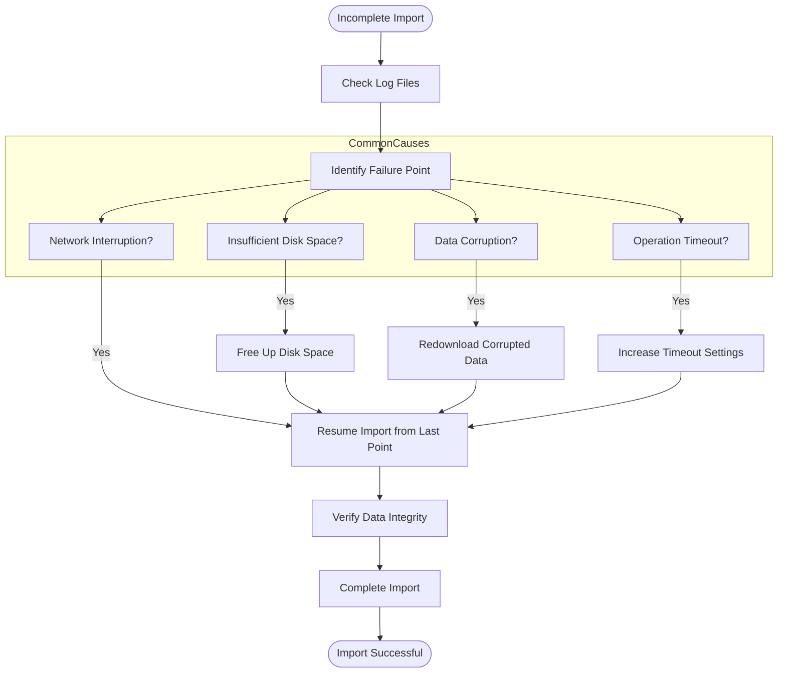
```mermaid
flowchart TD
Start([Incomplete Import]) --> CheckLog["Check Log Files"]
CheckLog --> IdentifyIssue["Identify Failure Point"]
subgraph CommonCauses
IdentifyIssue --> NetworkIssue["Network Interruption?"]
IdentifyIssue --> DiskSpace["Insufficient Disk Space?"]
IdentifyIssue --> DataCorruption["Data Corruption?"]
IdentifyIssue --> Timeout["Operation Timeout?"]
end
NetworkIssue --> |Yes| ResumeImport["Resume Import from Last Point"]
DiskSpace --> |Yes| FreeSpace["Free Up Disk Space"]
DataCorruption --> |Yes| Redownload["Redownload Corrupted Data"]
Timeout --> |Yes| IncreaseTimeout["Increase Timeout Settings"]
ResumeImport --> VerifyData["Verify Data Integrity"]
FreeSpace --> ResumeImport
Redownload --> ResumeImport
IncreaseTimeout --> ResumeImport
VerifyData --> CompleteImport["Complete Import"]
CompleteImport --> End([Import Successful])
```

**Prevention and Recovery:**
- Regularly monitor disk space
- Use stable network connections
- Enable automatic resume functionality
- Verify data integrity after import
- Keep backup copies of critical data

**Section sources**
- [ImportHistoryFinanceTask.py](file://hikyuu/gui/data/ImportHistoryFinanceTask.py#L102-L112)
- [ImportPytdxToH5Task.py](file://hikyuu/gui/data/ImportPytdxToH5Task.py#L94-L104)

### Data Corruption
Data corruption can occur during transmission or storage:

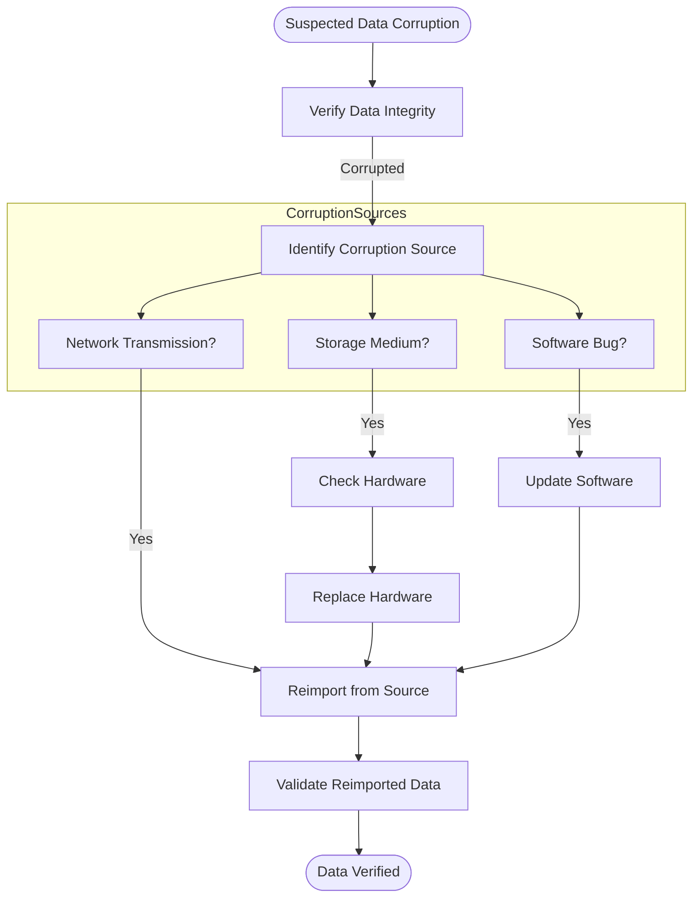
```mermaid
flowchart TD
Start([Suspected Data Corruption]) --> VerifyIntegrity["Verify Data Integrity"]
VerifyIntegrity --> |Corrupted| IdentifySource["Identify Corruption Source"]
subgraph CorruptionSources
IdentifySource --> Network["Network Transmission?"]
IdentifySource --> Storage["Storage Medium?"]
IdentifySource --> Software["Software Bug?"]
end
Network --> |Yes| Reimport["Reimport from Source"]
Storage --> |Yes| CheckHardware["Check Hardware"]
Software --> |Yes| UpdateSoftware["Update Software"]
Reimport --> ValidateData["Validate Reimported Data"]
CheckHardware --> ReplaceHardware["Replace Hardware"]
ReplaceHardware --> Reimport
UpdateSoftware --> Reimport
ValidateData --> End([Data Verified])
```

**Data Integrity Measures:**
- Use MD5 checksums for downloaded files
- Implement transactional operations where possible
- Regularly verify data integrity
- Use reliable storage media
- Maintain backup copies

**Section sources**
- [ImportHistoryFinanceTask.py](file://hikyuu/gui/data/ImportHistoryFinanceTask.py#L106-L110)

## Customization and Extension

The data import system is designed to be extensible, allowing users to customize and extend functionality to support new data sources and import requirements.

### Adding New Data Sources
To add support for a new data source, follow these steps:

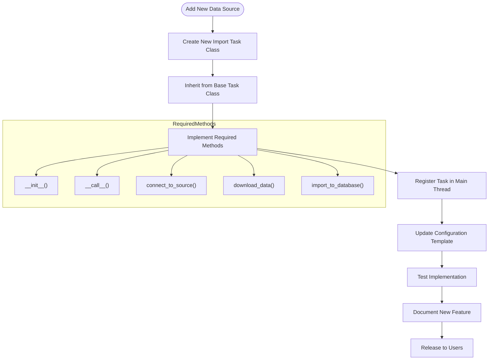
```mermaid
flowchart TD
Start([Add New Data Source]) --> CreateTask["Create New Import Task Class"]
CreateTask --> InheritBase["Inherit from Base Task Class"]
InheritBase --> ImplementMethods["Implement Required Methods"]
subgraph RequiredMethods
ImplementMethods --> __init__["__init__()"]
ImplementMethods --> __call__["__call__()"]
ImplementMethods --> connect_source["connect_to_source()"]
ImplementMethods --> download_data["download_data()"]
ImplementMethods --> import_data["import_to_database()"]
end
ImplementMethods --> RegisterTask["Register Task in Main Thread"]
RegisterTask --> UpdateConfig["Update Configuration Template"]
UpdateConfig --> TestImplementation["Test Implementation"]
TestImplementation --> Document["Document New Feature"]
Document --> Release["Release to Users"]
```

**Section sources**
- [ImportBlockInfoTask.py](file://hikyuu/gui/data/ImportBlockInfoTask.py#L15-L61)
- [ImportHistoryFinanceTask.py](file://hikyuu/gui/data/ImportHistoryFinanceTask.py#L38-L162)

### Custom Configuration Options
Users can extend the configuration system to support custom options:

```python
# Example: Adding support for a new data source
[mydatasource]
enable = True
api_key = your_api_key_here
base_url = https://api.mydatasource.com
update_interval = 3600
```

**Section sources**
- [hku_config_template.py](file://hikyuu/data/hku_config_template.py#L206-L300)

### Extending Data Drivers
To support additional database backends, extend the data driver system:

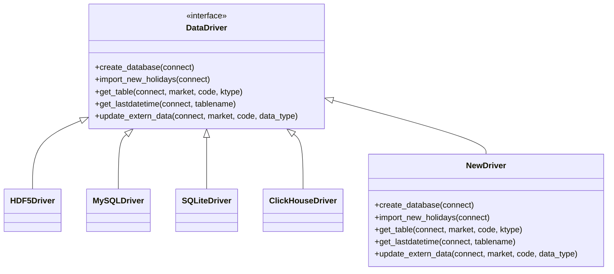
```mermaid
classDiagram
class DataDriver {
<<interface>>
+create_database(connect)
+import_new_holidays(connect)
+get_table(connect, market, code, ktype)
+get_lastdatetime(connect, tablename)
+update_extern_data(connect, market, code, data_type)
}
DataDriver <|-- HDF5Driver
DataDriver <|-- MySQLDriver
DataDriver <|-- SQLiteDriver
DataDriver <|-- ClickHouseDriver
DataDriver <|-- NewDriver
class NewDriver {
+create_database(connect)
+import_new_holidays(connect)
+get_table(connect, market, code, ktype)
+get_lastdatetime(connect, tablename)
+update_extern_data(connect, market, code, data_type)
}
```

**Section sources**
- [common_h5.py](file://hikyuu/data/common_h5.py#L77-L291)
- [common_mysql.py](file://hikyuu/data/common_mysql.py#L150-L510)
- [common_sqlite3.py](file://hikyuu/data/common_sqlite3.py#L56-L76)

## Conclusion
The data import tools in hikyuu provide a comprehensive and flexible solution for importing financial data from various sources. The thread-based architecture ensures responsive UI performance while handling potentially long-running import operations. The system supports multiple data storage backends including HDF5, MySQL, and SQLite, allowing users to choose the most suitable storage solution for their needs. With robust progress tracking, error handling, and extensibility features, the import tools can be customized to support new data sources and requirements. By following the guidelines and best practices outlined in this documentation, users can effectively utilize the data import tools for their financial analysis needs.