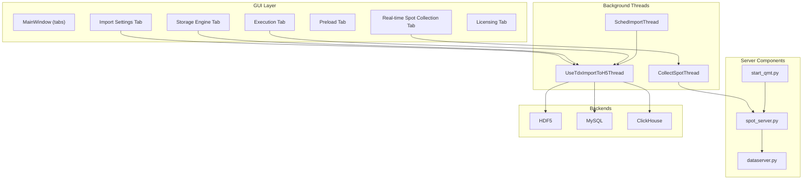
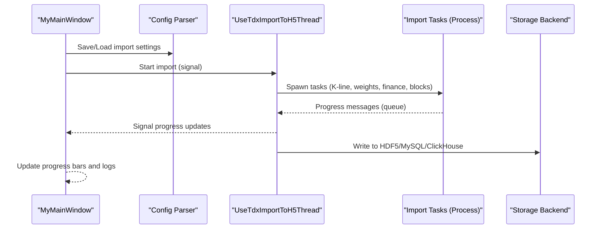
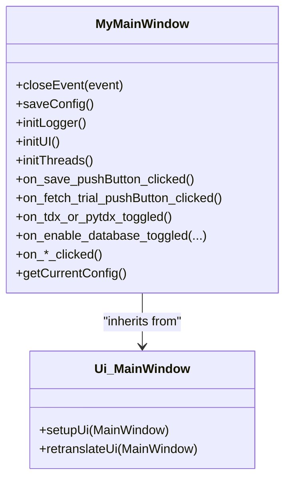
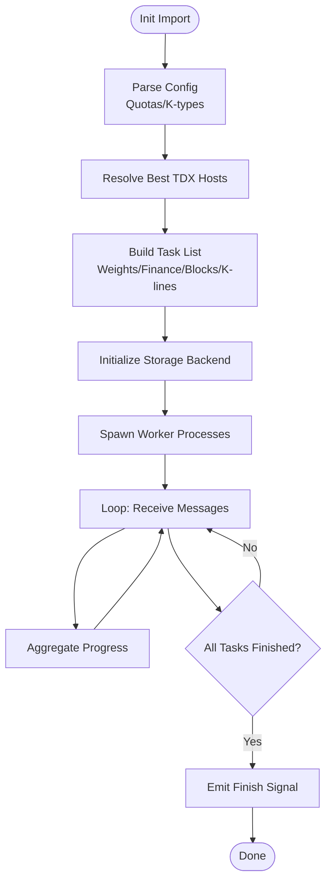
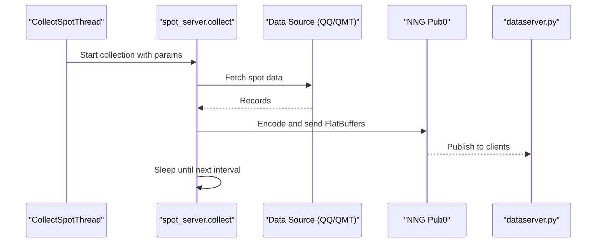
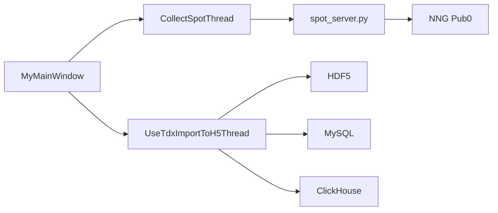

# GUI Components

<cite>
**Referenced Files in This Document**
- [HikyuuTDX.py](file://hikyuu/gui/HikyuuTDX.py)
- [MainWindow.py](file://hikyuu/gui/data/MainWindow.py)
- [UseTdxImportToH5Thread.py](file://hikyuu/gui/data/UseTdxImportToH5Thread.py)
- [CollectSpotThread.py](file://hikyuu/gui/data/CollectSpotThread.py)
- [SchedImportThread.py](file://hikyuu/gui/data/SchedImportThread.py)
- [importdata.py](file://hikyuu/gui/importdata.py)
- [dataserver.py](file://hikyuu/gui/dataserver.py)
- [spot_server.py](file://hikyuu/gui/spot_server.py)
- [start_qmt.py](file://hikyuu/gui/start_qmt.py)
- [tool.py](file://hikyuu/gui/data/tool.py)
</cite>

## Table of Contents
1. [Introduction](#introduction)
2. [Project Structure](#project-structure)
3. [Core Components](#core-components)
4. [Architecture Overview](#architecture-overview)
5. [Detailed Component Analysis](#detailed-component-analysis)
6. [Dependency Analysis](#dependency-analysis)
7. [Performance Considerations](#performance-considerations)
8. [Troubleshooting Guide](#troubleshooting-guide)
9. [Conclusion](#conclusion)
10. [Appendices](#appendices)

## Introduction
This document explains the GUI components of Hikyuu’s data management, strategy monitoring, and system control subsystems. It focuses on the main application window, data import tools, and server components enabling real-time interaction. Concrete examples are drawn from HikyuuTDX.py and MainWindow.py to illustrate the architecture and user workflow. We also describe how GUI components integrate with backend systems such as data drivers and trade managers, address common issues like connection problems and data import failures, and outline customization and extension points for developers.

## Project Structure
The GUI layer is organized around a main window with multiple tabs:
- Import Settings: configure data sources (Pytdx/Tdx/QMT), quotas, and K-line types
- Storage Engine Setup: select HDF5, MySQL, or ClickHouse storage backends
- Execution: start manual imports and monitor progress
- Preload: configure runtime data preload settings
- Real-time Spot Collection: schedule and run live quote collection
- Licensing: trial license acquisition and display

**Diagram sources**
- [MainWindow.py](file://hikyuu/gui/data/MainWindow.py#L26-L51)
- [UseTdxImportToH5Thread.py](file://hikyuu/gui/data/UseTdxImportToH5Thread.py#L57-L120)
- [CollectSpotThread.py](file://hikyuu/gui/data/CollectSpotThread.py#L15-L41)
- [SchedImportThread.py](file://hikyuu/gui/data/SchedImportThread.py#L15-L62)
- [spot_server.py](file://hikyuu/gui/spot_server.py#L207-L307)
- [dataserver.py](file://hikyuu/gui/dataserver.py#L13-L36)
- [start_qmt.py](file://hikyuu/gui/start_qmt.py#L1-L140)

**Section sources**
- [MainWindow.py](file://hikyuu/gui/data/MainWindow.py#L26-L51)
- [HikyuuTDX.py](file://hikyuu/gui/HikyuuTDX.py#L318-L349)

## Core Components
- Main Window (Ui_MainWindow): Defines the tabbed interface and widgets for configuring import settings, storage engines, execution, preload, real-time collection, and licensing.
- MyMainWindow (HikyuuTDX.py): Implements the main application logic, including configuration persistence, logging redirection, thread lifecycle, and UI state management.
- Import Threads:
  - UseTdxImportToH5Thread: Orchestrates multi-process import tasks (K-line, weights, finance, blocks) and emits progress signals.
  - CollectSpotThread: Runs the spot collection loop with configurable intervals and trading phases.
  - SchedImportThread: Schedules periodic import runs at configured times.
- Server Components:
  - spot_server.py: Publishes live spot data via NNG IPC/TCP using FlatBuffers.
  - dataserver.py: Starts/stops a data server for receiving and buffering ticks.
  - start_qmt.py: Subscribes to QMT real-time quotes and publishes via NNG.

**Section sources**
- [MainWindow.py](file://hikyuu/gui/data/MainWindow.py#L26-L51)
- [HikyuuTDX.py](file://hikyuu/gui/HikyuuTDX.py#L55-L120)
- [UseTdxImportToH5Thread.py](file://hikyuu/gui/data/UseTdxImportToH5Thread.py#L57-L120)
- [CollectSpotThread.py](file://hikyuu/gui/data/CollectSpotThread.py#L15-L41)
- [SchedImportThread.py](file://hikyuu/gui/data/SchedImportThread.py#L15-L62)
- [spot_server.py](file://hikyuu/gui/spot_server.py#L207-L307)
- [dataserver.py](file://hikyuu/gui/dataserver.py#L13-L36)
- [start_qmt.py](file://hikyuu/gui/start_qmt.py#L1-L140)

## Architecture Overview
The GUI integrates with backend systems through:
- Configuration persistence: MyMainWindow saves/import reads configuration to/from INI files and generates Hikyuu runtime config templates.
- Multi-process import pipeline: UseTdxImportToH5Thread spawns tasks and aggregates progress via a queue and signals.
- Real-time data streaming: spot_server.py publishes structured spot records; dataserver.py receives and buffers ticks; start_qmt.py subscribes to QMT and forwards quotes.
- Thread orchestration: CollectSpotThread and SchedImportThread coordinate background operations and UI updates.

**Diagram sources**
- [HikyuuTDX.py](file://hikyuu/gui/HikyuuTDX.py#L98-L120)
- [UseTdxImportToH5Thread.py](file://hikyuu/gui/data/UseTdxImportToH5Thread.py#L193-L358)

## Detailed Component Analysis

### Main Application Window (MyMainWindow)
- Responsibilities:
  - Initialize UI from Ui_MainWindow, load saved preferences, and wire up logging redirection.
  - Persist configuration to importdata-gui.ini and generate Hikyuu runtime config (hikyuu.ini) tailored to selected engine (HDF5/MySQL/ClickHouse).
  - Manage thread lifecycle for import, collection, and scheduling.
  - Provide UI controls for toggling data sources, storage engines, and real-time collection parameters.

- Key behaviors:
  - Logging redirection to a rich-text log widget with colored severity tags.
  - Conditional enable/disable of storage engine options based on license and mutual exclusivity.
  - Date/time defaults for initial import windows and real-time collection phases.

**Diagram sources**
- [HikyuuTDX.py](file://hikyuu/gui/HikyuuTDX.py#L55-L120)
- [MainWindow.py](file://hikyuu/gui/data/MainWindow.py#L26-L51)

**Section sources**
- [HikyuuTDX.py](file://hikyuu/gui/HikyuuTDX.py#L98-L120)
- [HikyuuTDX.py](file://hikyuu/gui/HikyuuTDX.py#L120-L200)
- [HikyuuTDX.py](file://hikyuu/gui/HikyuuTDX.py#L200-L317)
- [HikyuuTDX.py](file://hikyuu/gui/HikyuuTDX.py#L318-L349)

### Data Import Pipeline (UseTdxImportToH5Thread)
- Responsibilities:
  - Build a task list based on selected quotas and K-line types.
  - Resolve best TDX servers and distribute tasks across processes.
  - Create/initialize storage backends (SQLite/MySQL/ClickHouse) and import stock lists.
  - Aggregate progress from worker processes and emit signals to the UI.

- Processing logic:
  - Task creation for weights, finance, blocks, and K-line data per market.
  - Multi-process execution with a shared queue for progress reporting.
  - Aggregation of progress across markets and K-line types.

**Diagram sources**
- [UseTdxImportToH5Thread.py](file://hikyuu/gui/data/UseTdxImportToH5Thread.py#L87-L171)
- [UseTdxImportToH5Thread.py](file://hikyuu/gui/data/UseTdxImportToH5Thread.py#L193-L358)

**Section sources**
- [UseTdxImportToH5Thread.py](file://hikyuu/gui/data/UseTdxImportToH5Thread.py#L57-L120)
- [UseTdxImportToH5Thread.py](file://hikyuu/gui/data/UseTdxImportToH5Thread.py#L193-L358)

### Real-time Spot Collection (CollectSpotThread + spot_server.py)
- Responsibilities:
  - Run a scheduled loop to fetch live spot quotes and publish via NNG IPC/TCP.
  - Respect configurable intervals and trading session phases.
  - Support multiple data sources (QQ, QMT) and optional proxy usage.

- Workflow:
  - CollectSpotThread reads configuration and invokes spot_server.collect.
  - spot_server initializes Hikyuu runtime, resolves senders, and periodically fetches quotes.
  - FlatBuffers encodes spot records and publishes topic-prefixed frames.

**Diagram sources**
- [CollectSpotThread.py](file://hikyuu/gui/data/CollectSpotThread.py#L15-L41)
- [spot_server.py](file://hikyuu/gui/spot_server.py#L207-L307)
- [dataserver.py](file://hikyuu/gui/dataserver.py#L13-L36)

**Section sources**
- [CollectSpotThread.py](file://hikyuu/gui/data/CollectSpotThread.py#L15-L41)
- [spot_server.py](file://hikyuu/gui/spot_server.py#L207-L307)
- [dataserver.py](file://hikyuu/gui/dataserver.py#L13-L36)

### Scheduled Imports (SchedImportThread)
- Responsibilities:
  - Compute next import time based on configured time-of-day and weekday adjustments.
  - Emit a signal to trigger import execution at the scheduled moment.

**Section sources**
- [SchedImportThread.py](file://hikyuu/gui/data/SchedImportThread.py#L15-L62)

### Command-line Import Runner (importdata.py)
- Responsibilities:
  - Load saved GUI configuration and start the import pipeline without the GUI.
  - Route progress messages to stdout and aggregate details for completion summary.

**Section sources**
- [importdata.py](file://hikyuu/gui/importdata.py#L1-L171)

### QMT Real-time Integration (start_qmt.py)
- Responsibilities:
  - Subscribe to QMT real-time quotes and publish via NNG, mirroring the spot_server behavior.
  - Initialize Hikyuu context and wait for data readiness before publishing.

**Section sources**
- [start_qmt.py](file://hikyuu/gui/start_qmt.py#L1-L140)

## Dependency Analysis
- UI-to-Logic Coupling:
  - MyMainWindow depends on Ui_MainWindow for layout and widget IDs.
  - Import and collection actions are wired through slots that construct and start threads.
- Thread-to-Backend Coupling:
  - UseTdxImportToH5Thread depends on backend-specific import modules and storage initialization routines.
  - CollectSpotThread delegates to spot_server.collect, which depends on Hikyuu runtime and external quote providers.
- External Dependencies:
  - NNG for real-time messaging, FlatBuffers for binary encoding, and optional MySQL/ClickHouse connectors.

**Diagram sources**
- [HikyuuTDX.py](file://hikyuu/gui/HikyuuTDX.py#L55-L120)
- [UseTdxImportToH5Thread.py](file://hikyuu/gui/data/UseTdxImportToH5Thread.py#L214-L273)
- [CollectSpotThread.py](file://hikyuu/gui/data/CollectSpotThread.py#L15-L41)
- [spot_server.py](file://hikyuu/gui/spot_server.py#L207-L307)

**Section sources**
- [HikyuuTDX.py](file://hikyuu/gui/HikyuuTDX.py#L55-L120)
- [UseTdxImportToH5Thread.py](file://hikyuu/gui/data/UseTdxImportToH5Thread.py#L214-L273)
- [CollectSpotThread.py](file://hikyuu/gui/data/CollectSpotThread.py#L15-L41)
- [spot_server.py](file://hikyuu/gui/spot_server.py#L207-L307)

## Performance Considerations
- Multi-process import scaling:
  - UseTdxImportToH5Thread distributes tasks across available TDX hosts and worker processes to improve throughput.
- Real-time collection cadence:
  - Adjust interval and trading phases to balance resource usage and data freshness.
- Storage backend choice:
  - HDF5 is recommended for local development; MySQL/ClickHouse offer scalability and remote access.
- UI responsiveness:
  - Progress aggregation and signal emission keep the UI responsive during long-running imports.

[No sources needed since this section provides general guidance]

## Troubleshooting Guide
- Connection Problems
  - MySQL/ClickHouse connectivity: Use the “Test Connection” buttons in the Storage Engine tab to validate credentials and network reachability.
  - Proxy usage: Enable the proxy option in the Real-time Spot Collection tab when required by your network policy.
  - License restrictions: ClickHouse engine requires a valid license; trial licenses can be fetched from the Licensing tab.

- Data Import Failures
  - Verify storage directories exist and are writable; the import runner creates temporary directories as needed.
  - Ensure TDX installation path is correct when using TDX disk data.
  - Check that the selected quotas and K-line types match available data sources.

- Real-time Data Issues
  - Confirm NNG listeners are reachable (IPC and TCP addresses are configured in spot_server).
  - Validate datasource selection (QQ vs QMT) and credentials for QMT.
  - Ensure the Hikyuu runtime configuration points to the correct quotation server.

- UI Freezes or Stalls
  - Close the app only after imports finish; MyMainWindow prevents closing while imports are running.
  - If threads appear stuck, terminate and restart the application; threads handle cleanup on exit.

**Section sources**
- [HikyuuTDX.py](file://hikyuu/gui/HikyuuTDX.py#L72-L91)
- [HikyuuTDX.py](file://hikyuu/gui/HikyuuTDX.py#L790-L800)
- [spot_server.py](file://hikyuu/gui/spot_server.py#L207-L307)
- [importdata.py](file://hikyuu/gui/importdata.py#L125-L171)

## Conclusion
The Hikyuu GUI provides a comprehensive interface for managing data ingestion, selecting storage backends, and operating real-time data collection. MyMainWindow orchestrates configuration persistence, logging, and thread lifecycle, while UseTdxImportToH5Thread and CollectSpotThread implement robust, scalable import and streaming pipelines. Developers can extend the GUI by adding new tabs, integrating additional data sources, or customizing storage backends, leveraging the existing signal-slot and multi-threading patterns.

[No sources needed since this section summarizes without analyzing specific files]

## Appendices

### Customization and Extension Points
- Add new tabs:
  - Extend Ui_MainWindow by adding new tab widgets and controls in MainWindow.ui, then regenerate MainWindow.py using the tool script.
- Integrate new data sources:
  - Implement a new Import*Task and spawn it in UseTdxImportToH5Thread.init_task.
- Customize real-time collection:
  - Add new data sources in spot_server.collect and update CollectSpotThread configuration.
- Modify storage backends:
  - Add backend-specific initialization and import routines in UseTdxImportToH5Thread and update MyMainWindow configuration UI.

**Section sources**
- [tool.py](file://hikyuu/gui/data/tool.py#L1-L51)
- [UseTdxImportToH5Thread.py](file://hikyuu/gui/data/UseTdxImportToH5Thread.py#L214-L273)
- [spot_server.py](file://hikyuu/gui/spot_server.py#L207-L307)
- [HikyuuTDX.py](file://hikyuu/gui/HikyuuTDX.py#L318-L349)