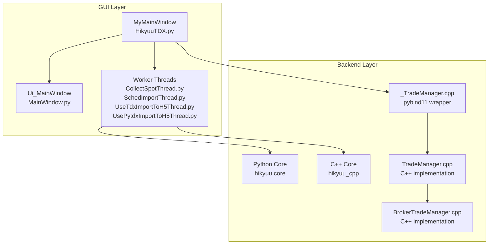
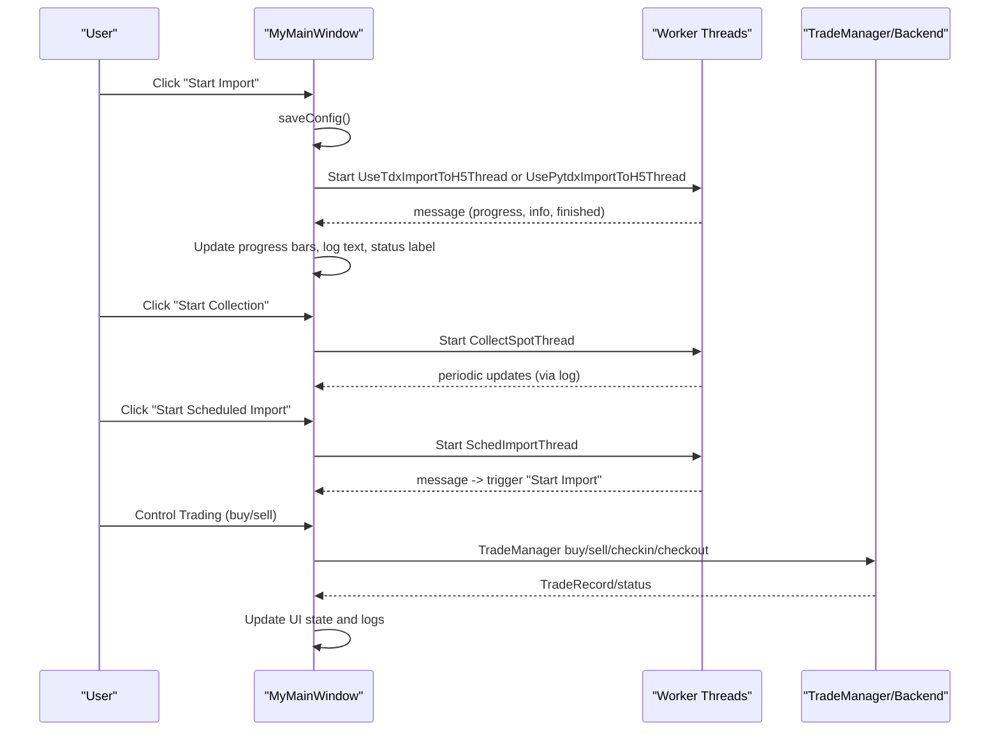
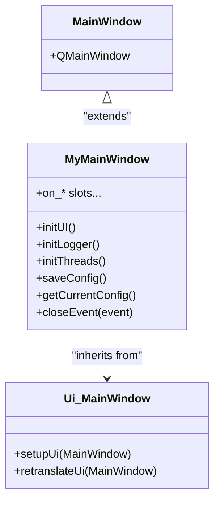
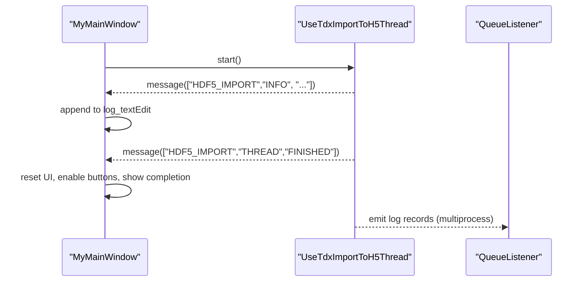
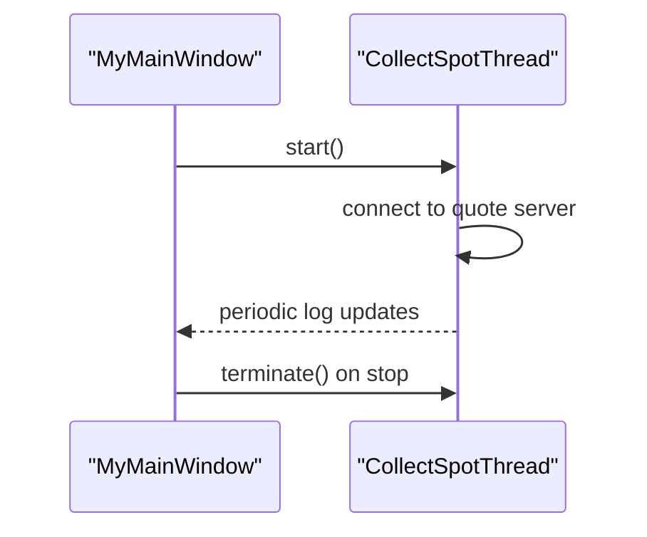
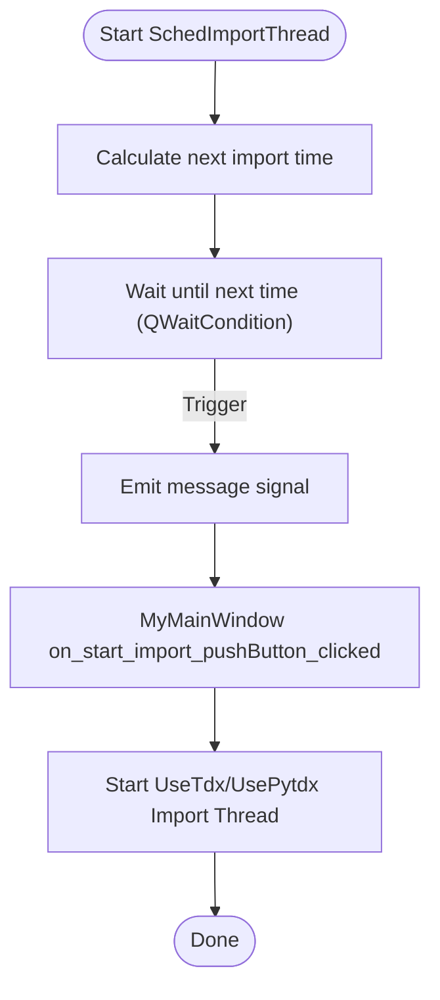
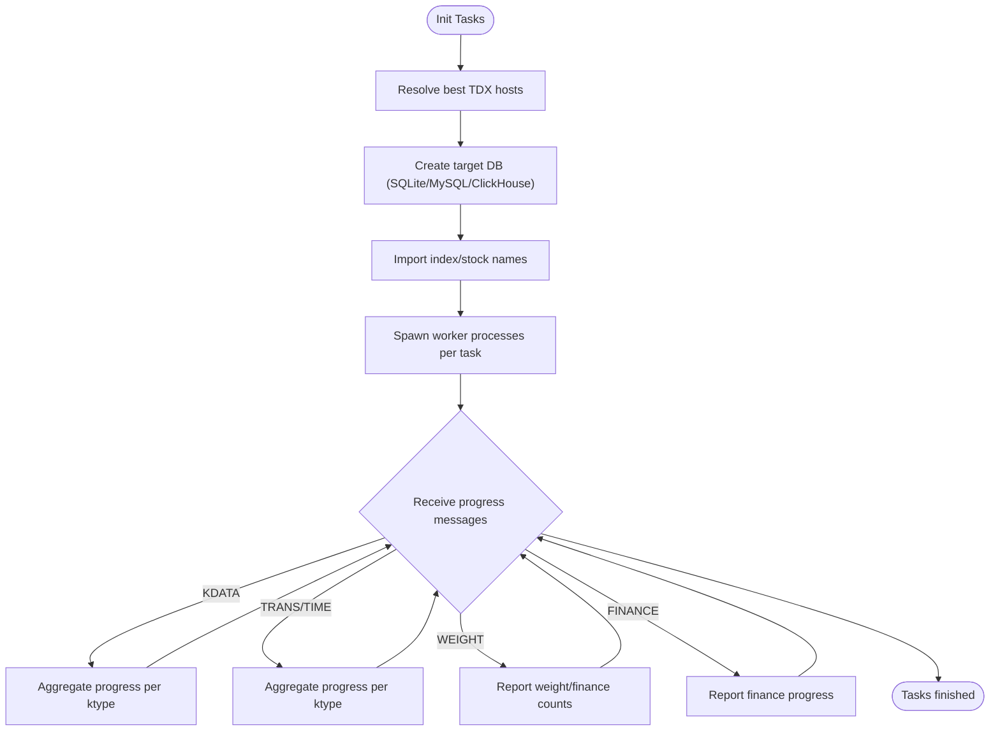
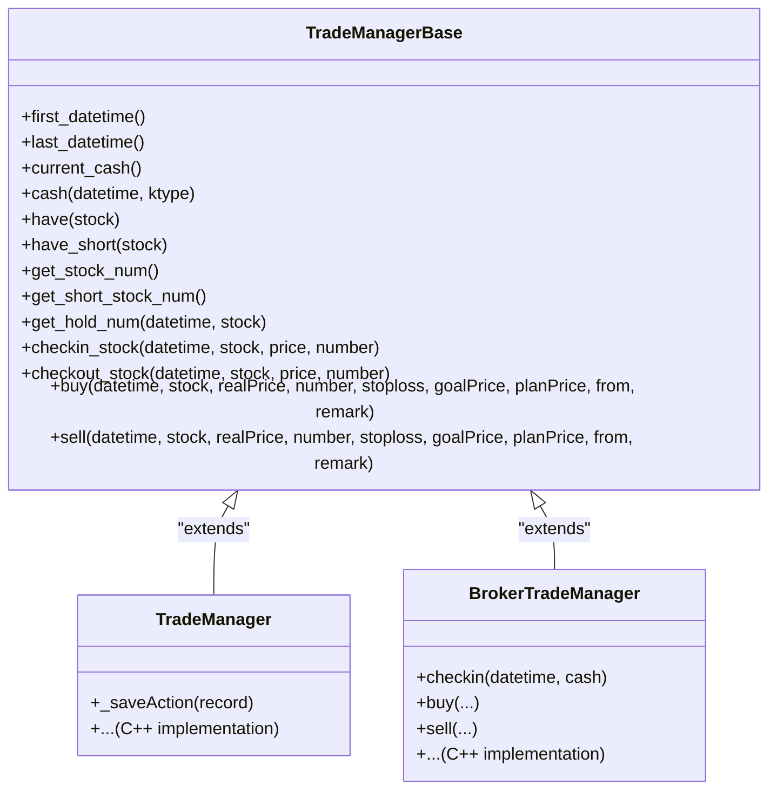
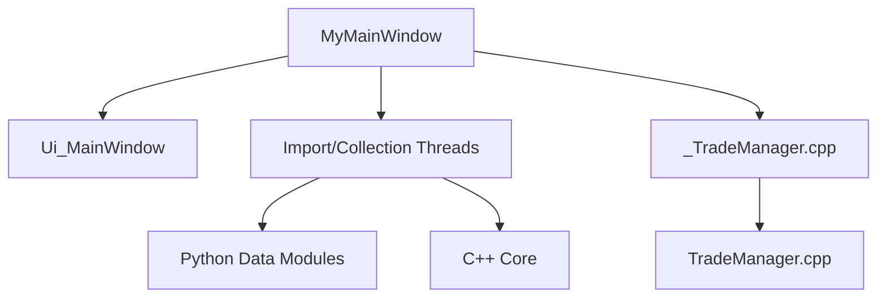

# Main GUI Application

<cite>
**Referenced Files in This Document**
- [HikyuuTDX.py](file://hikyuu/gui/HikyuuTDX.py)
- [MainWindow.py](file://hikyuu/gui/data/MainWindow.py)
- [CollectSpotThread.py](file://hikyuu/gui/data/CollectSpotThread.py)
- [SchedImportThread.py](file://hikyuu/gui/data/SchedImportThread.py)
- [UseTdxImportToH5Thread.py](file://hikyuu/gui/data/UseTdxImportToH5Thread.py)
- [UsePytdxImportToH5Thread.py](file://hikyuu/gui/data/UsePytdxImportToH5Thread.py)
- [_TradeManager.cpp](file://hikyuu_pywrap/trade_manage/_TradeManager.cpp)
- [TradeManager.cpp](file://hikyuu_cpp/hikyuu/trade_manage/TradeManager.cpp)
- [BrokerTradeManager.cpp](file://hikyuu_cpp/hikyuu/strategy/BrokerTradeManager.cpp)
</cite>

## Table of Contents
1. [Introduction](#introduction)
2. [Project Structure](#project-structure)
3. [Core Components](#core-components)
4. [Architecture Overview](#architecture-overview)
5. [Detailed Component Analysis](#detailed-component-analysis)
6. [Dependency Analysis](#dependency-analysis)
7. [Performance Considerations](#performance-considerations)
8. [Troubleshooting Guide](#troubleshooting-guide)
9. [Conclusion](#conclusion)
10. [Appendices](#appendices)

## Introduction
This document describes the main GUI application of Hikyuu, focusing on the Qt-based desktop interface that orchestrates data import, real-time quote collection, and configuration persistence. It explains the main window layout, navigation structure, and core interaction patterns, and demonstrates how the GUI integrates with the underlying Python/C++ core for real-time data display and system control. The document also covers event handling, component initialization, state management, and the relationship between the main application window and backend components such as StockManager and TradeManager. Practical troubleshooting guidance is provided for common UI freezing and display inconsistencies, along with customization options for themes and layout adjustments.

## Project Structure
The GUI is organized around a Qt main window with tabbed navigation and a set of worker threads for long-running tasks. The main window is generated from a UI definition and extended with Python logic to manage configuration, threading, and UI updates.

**Diagram sources**
- [HikyuuTDX.py](file://hikyuu/gui/HikyuuTDX.py#L1-L120)
- [MainWindow.py](file://hikyuu/gui/data/MainWindow.py#L1-L120)
- [CollectSpotThread.py](file://hikyuu/gui/data/CollectSpotThread.py#L1-L44)
- [SchedImportThread.py](file://hikyuu/gui/data/SchedImportThread.py#L1-L62)
- [UseTdxImportToH5Thread.py](file://hikyuu/gui/data/UseTdxImportToH5Thread.py#L1-L120)
- [UsePytdxImportToH5Thread.py](file://hikyuu/gui/data/UsePytdxImportToH5Thread.py#L1-L120)
- [_TradeManager.cpp](file://hikyuu_pywrap/trade_manage/_TradeManager.cpp#L43-L79)
- [TradeManager.cpp](file://hikyuu_cpp/hikyuu/trade_manage/TradeManager.cpp#L1535-L1567)
- [BrokerTradeManager.cpp](file://hikyuu_cpp/hikyuu/strategy/BrokerTradeManager.cpp#L109-L130)

**Section sources**
- [HikyuuTDX.py](file://hikyuu/gui/HikyuuTDX.py#L1-L120)
- [MainWindow.py](file://hikyuu/gui/data/MainWindow.py#L1-L120)

## Core Components
- MyMainWindow (HikyuuTDX.py): The main Qt window class that initializes UI, configuration, logging, and threads; handles user actions and signals from worker threads; persists configuration to disk; manages real-time quote collection and scheduled imports.
- Ui_MainWindow (MainWindow.py): Generated UI definition providing the tabbed layout and widgets (tabs for data source selection, database configuration, import controls, log output).
- Worker Threads:
  - CollectSpotThread: Real-time quote collection loop using external quote server configuration.
  - SchedImportThread: Scheduled import trigger using wait conditions and mutexes.
  - UseTdxImportToH5Thread and UsePytdxImportToH5Thread: Multi-process import pipelines for historical data to HDF5/MySQL/ClickHouse, emitting progress messages.
- Backend Integration:
  - TradeManager pybind11 wrapper and C++ implementation for trading system control and order execution.
  - BrokerTradeManager for broker-side order handling and cash management.

**Section sources**
- [HikyuuTDX.py](file://hikyuu/gui/HikyuuTDX.py#L55-L120)
- [MainWindow.py](file://hikyuu/gui/data/MainWindow.py#L26-L120)
- [CollectSpotThread.py](file://hikyuu/gui/data/CollectSpotThread.py#L1-L44)
- [SchedImportThread.py](file://hikyuu/gui/data/SchedImportThread.py#L1-L62)
- [UseTdxImportToH5Thread.py](file://hikyuu/gui/data/UseTdxImportToH5Thread.py#L57-L120)
- [UsePytdxImportToH5Thread.py](file://hikyuu/gui/data/UsePytdxImportToH5Thread.py#L60-L120)
- [_TradeManager.cpp](file://hikyuu_pywrap/trade_manage/_TradeManager.cpp#L43-L79)
- [TradeManager.cpp](file://hikyuu_cpp/hikyuu/trade_manage/TradeManager.cpp#L1535-L1567)
- [BrokerTradeManager.cpp](file://hikyuu_cpp/hikyuu/strategy/BrokerTradeManager.cpp#L109-L130)

## Architecture Overview
The GUI follows a Qt event-driven model with asynchronous worker threads. The main window coordinates:
- UI initialization and widget wiring (tabbed layout, buttons, checkboxes, date editors, progress bars, log text).
- Configuration loading/saving to user config files and backend hikyuu.ini.
- Thread lifecycle management for import and real-time collection.
- Signal-slot connections to update UI state and logs.
- Backend integration for trading operations via TradeManager.

**Diagram sources**
- [HikyuuTDX.py](file://hikyuu/gui/HikyuuTDX.py#L936-L1064)
- [UseTdxImportToH5Thread.py](file://hikyuu/gui/data/UseTdxImportToH5Thread.py#L87-L120)
- [UsePytdxImportToH5Thread.py](file://hikyuu/gui/data/UsePytdxImportToH5Thread.py#L90-L120)
- [CollectSpotThread.py](file://hikyuu/gui/data/CollectSpotThread.py#L15-L44)
- [SchedImportThread.py](file://hikyuu/gui/data/SchedImportThread.py#L15-L62)
- [_TradeManager.cpp](file://hikyuu_pywrap/trade_manage/_TradeManager.cpp#L147-L171)

## Detailed Component Analysis

### Main Window Layout and Navigation
- Tabbed structure:
  - Data Source Selection: Choose between TDX, Pytdx, and QMT; configure directories and number of concurrent servers.
  - Database Configuration: Enable/disable HDF5, MySQL, ClickHouse; set connection parameters and temporary directories.
  - Import Controls: Start import, scheduled import, progress indicators, and detailed log output.
  - Preload Settings: Configure preloading of various K-line types and maximum counts.
- Centralized UI wiring is generated from the UI file and extended in the main window class.

**Diagram sources**
- [HikyuuTDX.py](file://hikyuu/gui/HikyuuTDX.py#L55-L120)
- [MainWindow.py](file://hikyuu/gui/data/MainWindow.py#L26-L120)

**Section sources**
- [MainWindow.py](file://hikyuu/gui/data/MainWindow.py#L26-L120)
- [HikyuuTDX.py](file://hikyuu/gui/HikyuuTDX.py#L318-L383)

### Event Handling and State Management
- Signals and Slots:
  - Worker threads emit messages to the main window via Qt signals.
  - Main window connects to these signals to update progress bars, status labels, and log text.
  - Buttons trigger slots that save configuration, validate directories, and start threads.
- State flags:
  - import_running, _is_sched_import_running, _is_collect_running track active operations.
  - UI toggles enable/disable buttons and update status labels accordingly.
- Logging:
  - Output redirection to a rich-text log widget with colored severity tags.
  - Multi-process logging via QueueListener.

**Diagram sources**
- [HikyuuTDX.py](file://hikyuu/gui/HikyuuTDX.py#L845-L935)
- [UseTdxImportToH5Thread.py](file://hikyuu/gui/data/UseTdxImportToH5Thread.py#L87-L120)
- [HikyuuTDX.py](file://hikyuu/gui/HikyuuTDX.py#L261-L317)

**Section sources**
- [HikyuuTDX.py](file://hikyuu/gui/HikyuuTDX.py#L261-L317)
- [HikyuuTDX.py](file://hikyuu/gui/HikyuuTDX.py#L845-L935)
- [UseTdxImportToH5Thread.py](file://hikyuu/gui/data/UseTdxImportToH5Thread.py#L87-L120)

### Real-Time Data Collection
- CollectSpotThread runs a continuous loop to collect real-time quotes using the configured quote server address and collection parameters.
- The main window starts/stops the thread and reflects status in the UI.

**Diagram sources**
- [HikyuuTDX.py](file://hikyuu/gui/HikyuuTDX.py#L1038-L1064)
- [CollectSpotThread.py](file://hikyuu/gui/data/CollectSpotThread.py#L15-L44)

**Section sources**
- [HikyuuTDX.py](file://hikyuu/gui/HikyuuTDX.py#L1038-L1064)
- [CollectSpotThread.py](file://hikyuu/gui/data/CollectSpotThread.py#L15-L44)

### Scheduled Imports
- SchedImportThread calculates the next import time and emits a signal to trigger import when due.
- The main window connects this signal to the import start slot.

**Diagram sources**
- [SchedImportThread.py](file://hikyuu/gui/data/SchedImportThread.py#L38-L62)
- [HikyuuTDX.py](file://hikyuu/gui/HikyuuTDX.py#L1011-L1037)

**Section sources**
- [SchedImportThread.py](file://hikyuu/gui/data/SchedImportThread.py#L38-L62)
- [HikyuuTDX.py](file://hikyuu/gui/HikyuuTDX.py#L1011-L1037)

### Import Pipelines and Progress Updates
- UseTdxImportToH5Thread and UsePytdxImportToH5Thread coordinate multi-process tasks for importing K-lines, weights, finance, block info, and bond data.
- They compute progress per market/ktype and aggregate totals to update progress bars and log details.

**Diagram sources**
- [UseTdxImportToH5Thread.py](file://hikyuu/gui/data/UseTdxImportToH5Thread.py#L193-L358)
- [UsePytdxImportToH5Thread.py](file://hikyuu/gui/data/UsePytdxImportToH5Thread.py#L230-L395)

**Section sources**
- [UseTdxImportToH5Thread.py](file://hikyuu/gui/data/UseTdxImportToH5Thread.py#L193-L358)
- [UsePytdxImportToH5Thread.py](file://hikyuu/gui/data/UsePytdxImportToH5Thread.py#L230-L395)

### Backend Integration: TradeManager and Trade Execution
- The GUI interacts with TradeManager via pybind11 wrappers to place buy/sell orders, check cash positions, and manage stock holdings.
- The C++ TradeManager implementation and BrokerTradeManager handle order execution and cash accounting.

**Diagram sources**
- [_TradeManager.cpp](file://hikyuu_pywrap/trade_manage/_TradeManager.cpp#L43-L79)
- [_TradeManager.cpp](file://hikyuu_pywrap/trade_manage/_TradeManager.cpp#L147-L171)
- [TradeManager.cpp](file://hikyuu_cpp/hikyuu/trade_manage/TradeManager.cpp#L1535-L1567)
- [BrokerTradeManager.cpp](file://hikyuu_cpp/hikyuu/strategy/BrokerTradeManager.cpp#L109-L130)

**Section sources**
- [_TradeManager.cpp](file://hikyuu_pywrap/trade_manage/_TradeManager.cpp#L43-L79)
- [_TradeManager.cpp](file://hikyuu_pywrap/trade_manage/_TradeManager.cpp#L147-L171)
- [TradeManager.cpp](file://hikyuu_cpp/hikyuu/trade_manage/TradeManager.cpp#L1535-L1567)
- [BrokerTradeManager.cpp](file://hikyuu_cpp/hikyuu/strategy/BrokerTradeManager.cpp#L109-L130)

## Dependency Analysis
- Coupling:
  - MyMainWindow depends on Ui_MainWindow for layout and on worker threads for background tasks.
  - Worker threads depend on Python data modules and external libraries (pytdx, mysql, clickhouse).
  - TradeManager integration relies on pybind11 bindings to C++ implementations.
- Cohesion:
  - UI logic is centralized in MyMainWindow; worker threads encapsulate import and collection concerns.
- External dependencies:
  - Qt (PySide6) for UI.
  - MySQL and ClickHouse connectors for database targets.
  - pytdx for historical data import.
  - multiprocessing and threading for concurrency.

**Diagram sources**
- [HikyuuTDX.py](file://hikyuu/gui/HikyuuTDX.py#L55-L120)
- [MainWindow.py](file://hikyuu/gui/data/MainWindow.py#L26-L120)
- [UseTdxImportToH5Thread.py](file://hikyuu/gui/data/UseTdxImportToH5Thread.py#L57-L120)
- [_TradeManager.cpp](file://hikyuu_pywrap/trade_manage/_TradeManager.cpp#L43-L79)

**Section sources**
- [HikyuuTDX.py](file://hikyuu/gui/HikyuuTDX.py#L55-L120)
- [UseTdxImportToH5Thread.py](file://hikyuu/gui/data/UseTdxImportToH5Thread.py#L57-L120)
- [_TradeManager.cpp](file://hikyuu_pywrap/trade_manage/_TradeManager.cpp#L43-L79)

## Performance Considerations
- Asynchronous UI updates:
  - Use signals to receive progress updates from worker threads and update UI without blocking the main thread.
  - Call QApplication.processEvents() sparingly during long-running operations to keep the UI responsive.
- Threading best practices:
  - Use QThread subclasses for long-running tasks; avoid heavy computation in the main thread.
  - Use multiprocessing for CPU-intensive tasks (e.g., importing K-lines) to leverage multiple cores.
- Logging overhead:
  - Limit log verbosity in production builds; use QueueListener for multiprocess logging to avoid UI stalls.
- Database operations:
  - Batch operations and minimize round-trips when importing to MySQL/ClickHouse.
  - Ensure proper indexing and connection pooling for large datasets.

[No sources needed since this section provides general guidance]

## Troubleshooting Guide
Common issues and resolutions:
- UI freezing during imports:
  - Ensure worker threads emit signals frequently and the main window processes events.
  - Avoid long-running operations on the main thread; delegate to threads/processes.
- Display inconsistencies:
  - Verify that progress bars and log text are updated via signals; ensure the log widget’s maximum block count is set appropriately.
- Real-time collection errors:
  - Confirm the quote server address is valid and reachable; adjust proxy settings if needed.
  - Check network connectivity and firewall rules for the quote server port.
- Database connection failures:
  - Test database connections using the built-in test buttons; verify credentials and network reachability.
- Scheduled import not triggering:
  - Verify the scheduled time and timezone; ensure the scheduler thread is running and emitting signals.
- Trade execution issues:
  - Validate TradeManager configuration and broker settings; confirm cash availability and order constraints.

**Section sources**
- [HikyuuTDX.py](file://hikyuu/gui/HikyuuTDX.py#L800-L831)
- [HikyuuTDX.py](file://hikyuu/gui/HikyuuTDX.py#L1011-L1037)
- [CollectSpotThread.py](file://hikyuu/gui/data/CollectSpotThread.py#L15-L44)

## Conclusion
The Hikyuu GUI provides a robust, Qt-based interface for managing data imports, real-time quote collection, and trading system control. Its architecture cleanly separates UI logic from background tasks using signals and threads, enabling responsive interactions and reliable backend integration. By following the event handling patterns and threading best practices outlined here, developers can extend the GUI while maintaining stability and performance.

[No sources needed since this section summarizes without analyzing specific files]

## Appendices

### Customization Options
- Themes and fonts:
  - The application sets a default font on Windows if available; otherwise falls back to a generic match.
- Layout adjustments:
  - The central widget uses a horizontal layout combining the tabbed interface and a log panel; resizing the window adjusts the tab and log areas proportionally.

**Section sources**
- [HikyuuTDX.py](file://hikyuu/gui/HikyuuTDX.py#L1078-L1111)
- [MainWindow.py](file://hikyuu/gui/data/MainWindow.py#L1282-L1311)