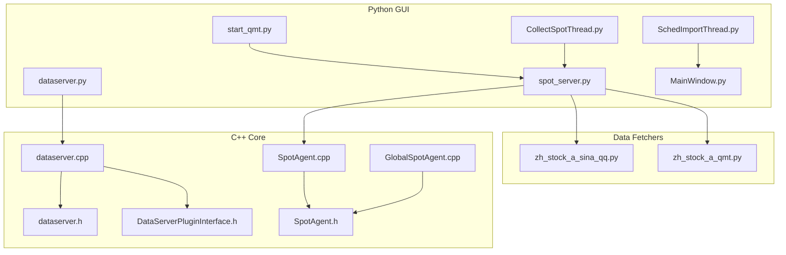
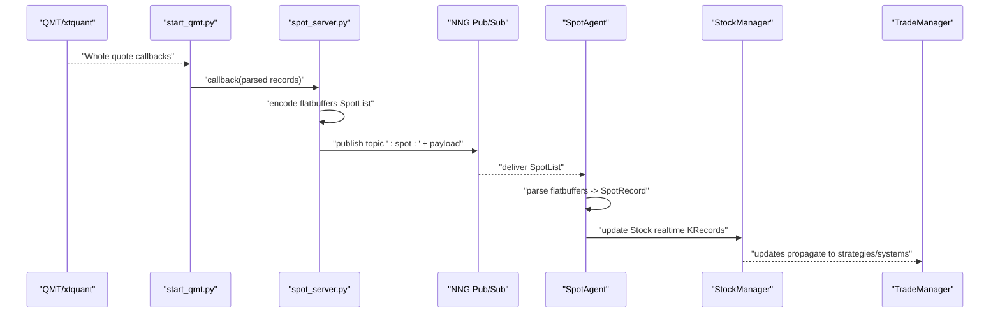
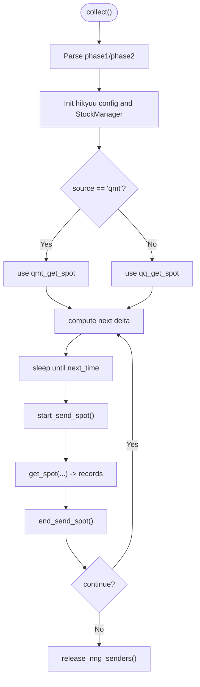
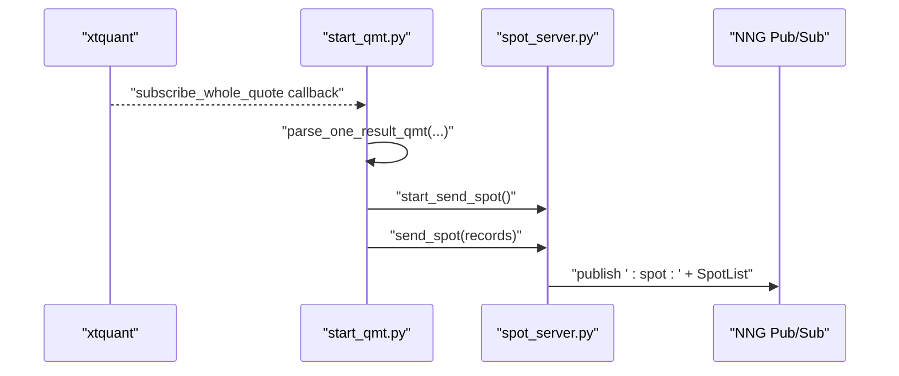
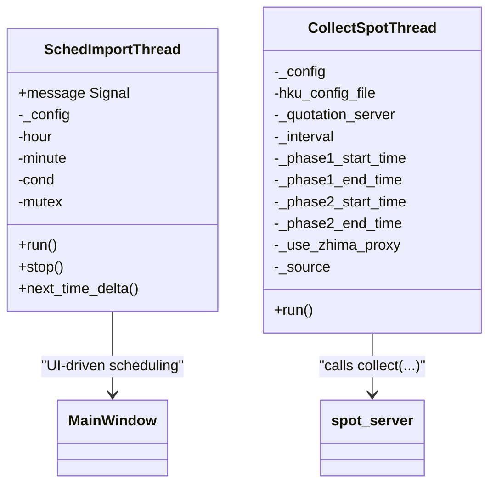
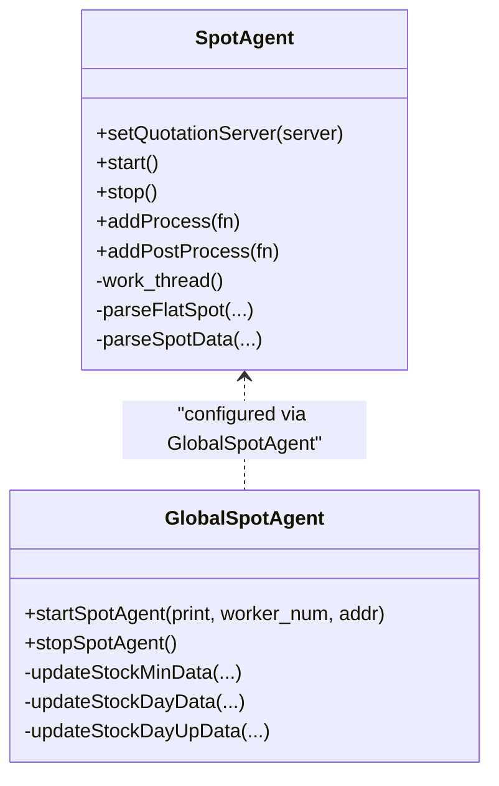
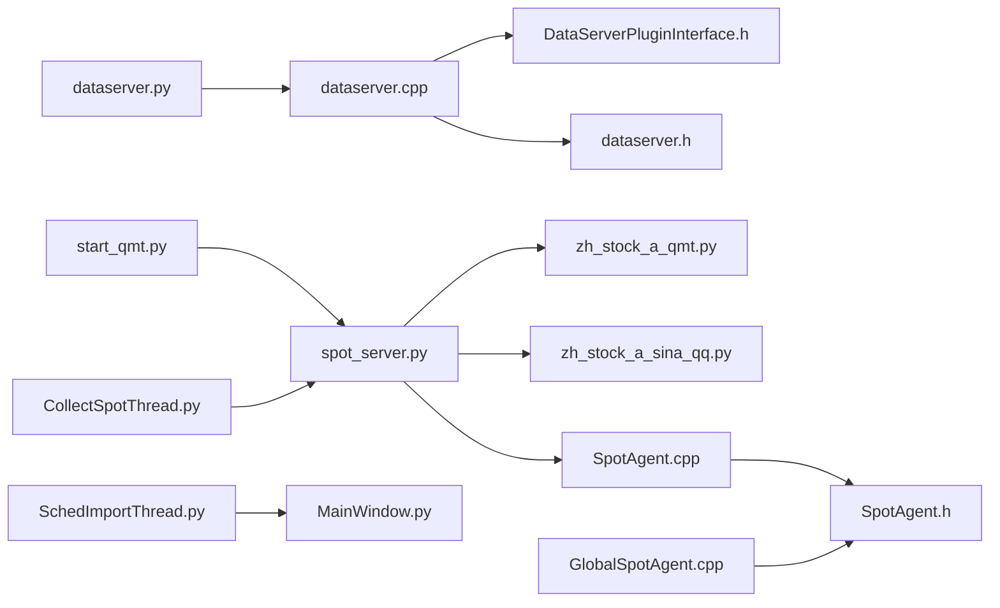

# Server Components

<cite>
**Referenced Files in This Document**
- [dataserver.py](file://hikyuu/gui/dataserver.py)
- [spot_server.py](file://hikyuu/gui/spot_server.py)
- [start_qmt.py](file://hikyuu/gui/start_qmt.py)
- [CollectSpotThread.py](file://hikyuu/gui/data/CollectSpotThread.py)
- [SchedImportThread.py](file://hikyuu/gui/data/SchedImportThread.py)
- [_dataserver.cpp](file://hikyuu_pywrap/plugin/_dataserver.cpp)
- [dataserver.cpp](file://hikyuu_cpp/hikyuu/plugin/dataserver.cpp)
- [DataServerPluginInterface.h](file://hikyuu_cpp/hikyuu/plugin/interface/DataServerPluginInterface.h)
- [dataserver.h](file://hikyuu_cpp/hikyuu/plugin/dataserver.h)
- [SpotAgent.h](file://hikyuu_cpp/hikyuu/global/agent/SpotAgent.h)
- [SpotAgent.cpp](file://hikyuu_cpp/hikyuu/global/agent/SpotAgent.cpp)
- [GlobalSpotAgent.cpp](file://hikyuu_cpp/hikyuu/global/GlobalSpotAgent.cpp)
- [zh_stock_a_qmt.py](file://hikyuu/fetcher/stock/zh_stock_a_qmt.py)
- [zh_stock_a_sina_qq.py](file://hikyuu/fetcher/stock/zh_stock_a_sina_qq.py)
- [MainWindow.py](file://hikyuu/gui/data/MainWindow.py)
</cite>

## Table of Contents
1. [Introduction](#introduction)
2. [Project Structure](#project-structure)
3. [Core Components](#core-components)
4. [Architecture Overview](#architecture-overview)
5. [Detailed Component Analysis](#detailed-component-analysis)
6. [Dependency Analysis](#dependency-analysis)
7. [Performance Considerations](#performance-considerations)
8. [Troubleshooting Guide](#troubleshooting-guide)
9. [Conclusion](#conclusion)

## Introduction
This document explains the server components powering Hikyuu’s GUI real-time data distribution and monitoring. It covers:
- The data server enabling buffered and persisted tick streaming
- The spot server broadcasting live quotes to subscribers
- QMT integration for real-time quotes
- Scheduling architecture for historical data import
- Real-time data collection threads
- How these servers integrate with the core trading system (TradeManager and Stock)
- Performance and scalability considerations
- Troubleshooting common issues

## Project Structure
The GUI server stack spans Python scripts and C++ plugins:
- Python CLI entry points for data server and spot server
- Qt-based data import scheduling and collection threads
- QMT integration script
- C++ plugin interfaces and agents that receive and transform spot data

**Diagram sources**
- [dataserver.py](file://hikyuu/gui/dataserver.py#L1-L36)
- [spot_server.py](file://hikyuu/gui/spot_server.py#L1-L327)
- [start_qmt.py](file://hikyuu/gui/start_qmt.py#L1-L140)
- [CollectSpotThread.py](file://hikyuu/gui/data/CollectSpotThread.py#L1-L44)
- [SchedImportThread.py](file://hikyuu/gui/data/SchedImportThread.py#L1-L62)
- [DataServerPluginInterface.h](file://hikyuu_cpp/hikyuu/plugin/interface/DataServerPluginInterface.h#L1-L24)
- [dataserver.cpp](file://hikyuu_cpp/hikyuu/plugin/dataserver.cpp#L1-L36)
- [dataserver.h](file://hikyuu_cpp/hikyuu/plugin/dataserver.h#L1-L44)
- [SpotAgent.h](file://hikyuu_cpp/hikyuu/global/agent/SpotAgent.h#L67-L131)
- [SpotAgent.cpp](file://hikyuu_cpp/hikyuu/global/agent/SpotAgent.cpp#L1-L200)
- [GlobalSpotAgent.cpp](file://hikyuu_cpp/hikyuu/global/GlobalSpotAgent.cpp#L150-L264)
- [zh_stock_a_qmt.py](file://hikyuu/fetcher/stock/zh_stock_a_qmt.py#L1-L58)
- [zh_stock_a_sina_qq.py](file://hikyuu/fetcher/stock/zh_stock_a_sina_qq.py#L1-L186)
- [MainWindow.py](file://hikyuu/gui/data/MainWindow.py#L1-L800)

**Section sources**
- [dataserver.py](file://hikyuu/gui/dataserver.py#L1-L36)
- [spot_server.py](file://hikyuu/gui/spot_server.py#L1-L327)
- [start_qmt.py](file://hikyuu/gui/start_qmt.py#L1-L140)
- [CollectSpotThread.py](file://hikyuu/gui/data/CollectSpotThread.py#L1-L44)
- [SchedImportThread.py](file://hikyuu/gui/data/SchedImportThread.py#L1-L62)
- [MainWindow.py](file://hikyuu/gui/data/MainWindow.py#L1-L800)

## Core Components
- Data Server (buffered/persisted tick streaming): Python CLI starts/stops a C++ plugin-backed data server that can buffer ticks and optionally persist to ClickHouse or Parquet.
- Spot Server (real-time quotes broadcast): Publishes flatbuffers-encoded spot records over NNG Pub/Sub to local IPC and TCP endpoints; collects quotes from QMT or QQ and batches them.
- QMT Integration: Subscribes to QMT whole-quote feeds and forwards parsed spot data to the spot server.
- Scheduling and Collection Threads: Qt threads schedule periodic imports and run spot collection loops with configurable intervals and trading-day phases.
- Core Integration: SpotAgent subscribes to the spot server and updates Stock/KData in memory; GlobalSpotAgent wires preloading hooks for minute/day aggregates.

**Section sources**
- [dataserver.py](file://hikyuu/gui/dataserver.py#L1-L36)
- [spot_server.py](file://hikyuu/gui/spot_server.py#L1-L327)
- [start_qmt.py](file://hikyuu/gui/start_qmt.py#L1-L140)
- [CollectSpotThread.py](file://hikyuu/gui/data/CollectSpotThread.py#L1-L44)
- [SchedImportThread.py](file://hikyuu/gui/data/SchedImportThread.py#L1-L62)
- [SpotAgent.h](file://hikyuu_cpp/hikyuu/global/agent/SpotAgent.h#L67-L131)
- [SpotAgent.cpp](file://hikyuu_cpp/hikyuu/global/agent/SpotAgent.cpp#L1-L200)
- [GlobalSpotAgent.cpp](file://hikyuu_cpp/hikyuu/global/GlobalSpotAgent.cpp#L150-L264)

## Architecture Overview
The real-time pipeline:
- Data Server: Exposes a buffered/persisted tick service via a C++ plugin interface.
- Spot Server: Collects spot quotes (QMT or QQ), encodes them with flatbuffers, and publishes over NNG Pub/Sub.
- Spot Agent: Subscribes to NNG Pub/Sub, decodes flatbuffers, and updates Stock/KData in memory.
- GUI Threads: Drive periodic imports and spot collection.
- QMT Integration: Bridges QMT subscriptions to the spot server.

**Diagram sources**
- [start_qmt.py](file://hikyuu/gui/start_qmt.py#L1-L140)
- [spot_server.py](file://hikyuu/gui/spot_server.py#L1-L327)
- [SpotAgent.cpp](file://hikyuu_cpp/hikyuu/global/agent/SpotAgent.cpp#L1-L200)
- [SpotAgent.h](file://hikyuu_cpp/hikyuu/global/agent/SpotAgent.h#L67-L131)
- [GlobalSpotAgent.cpp](file://hikyuu_cpp/hikyuu/global/GlobalSpotAgent.cpp#L150-L264)

## Detailed Component Analysis

### Data Server
- Purpose: Provide a buffered and optionally persisted tick service to clients.
- CLI: [dataserver.py](file://hikyuu/gui/dataserver.py#L1-L36) exposes address, worker count, save, buffer, and Parquet path options.
- Implementation: Delegates to C++ plugin interface [DataServerPluginInterface.h](file://hikyuu_cpp/hikyuu/plugin/interface/DataServerPluginInterface.h#L1-L24) and [dataserver.cpp](file://hikyuu_cpp/hikyuu/plugin/dataserver.cpp#L1-L36), exported to Python via [dataserver.h](file://hikyuu_cpp/hikyuu/plugin/dataserver.h#L1-L44) and [Dataserver plugin binding](file://hikyuu_pywrap/plugin/_dataserver.cpp#L1-L34).

Key behaviors:
- startDataServer(addr, work_num, save_tick, buf_tick, parquet_path)
- stopDataServer()
- Pull latest cached data via getDataFromBufferServer/getSpotFromBufferServer

Operational notes:
- save_tick and parquet_path determine persistence mode.
- Buffering reduces load on downstream consumers.

**Section sources**
- [dataserver.py](file://hikyuu/gui/dataserver.py#L1-L36)
- [DataServerPluginInterface.h](file://hikyuu_cpp/hikyuu/plugin/interface/DataServerPluginInterface.h#L1-L24)
- [dataserver.cpp](file://hikyuu_cpp/hikyuu/plugin/dataserver.cpp#L1-L36)
- [dataserver.h](file://hikyuu_cpp/hikyuu/plugin/dataserver.h#L1-L44)
- [_dataserver.cpp](file://hikyuu_pywrap/plugin/_dataserver.cpp#L1-L34)

### Spot Server
- Purpose: Collect spot quotes and publish them to NNG Pub/Sub for real-time consumption.
- Data sources: QMT or QQ via [zh_stock_a_qmt.py](file://hikyuu/fetcher/stock/zh_stock_a_qmt.py#L1-L58) and [zh_stock_a_sina_qq.py](file://hikyuu/fetcher/stock/zh_stock_a_sina_qq.py#L1-L186).
- Encoding: Uses flatbuffers to serialize SpotList in [spot_server.py](file://hikyuu/gui/spot_server.py#L1-L120).
- Publishing: NNG Pub0 sockets bound to IPC and TCP addresses; batching controlled by start/end markers in [spot_server.py](file://hikyuu/gui/spot_server.py#L160-L217).
- Scheduling: Configurable interval and trading-phase windows in [spot_server.py](file://hikyuu/gui/spot_server.py#L127-L156).

**Diagram sources**
- [spot_server.py](file://hikyuu/gui/spot_server.py#L127-L156)
- [spot_server.py](file://hikyuu/gui/spot_server.py#L228-L306)

**Section sources**
- [spot_server.py](file://hikyuu/gui/spot_server.py#L1-L327)
- [zh_stock_a_qmt.py](file://hikyuu/fetcher/stock/zh_stock_a_qmt.py#L1-L58)
- [zh_stock_a_sina_qq.py](file://hikyuu/fetcher/stock/zh_stock_a_sina_qq.py#L1-L186)

### QMT Integration
- Purpose: Bridge QMT whole-quote subscriptions to the spot server.
- Script: [start_qmt.py](file://hikyuu/gui/start_qmt.py#L1-L140) parses QMT callbacks, converts to spot records, and sends them via spot_server helpers.
- Data source: [zh_stock_a_qmt.py](file://hikyuu/fetcher/stock/zh_stock_a_qmt.py#L1-L58) provides parse_one_result_qmt and get_spot.

**Diagram sources**
- [start_qmt.py](file://hikyuu/gui/start_qmt.py#L1-L140)
- [spot_server.py](file://hikyuu/gui/spot_server.py#L1-L327)
- [zh_stock_a_qmt.py](file://hikyuu/fetcher/stock/zh_stock_a_qmt.py#L1-L58)

**Section sources**
- [start_qmt.py](file://hikyuu/gui/start_qmt.py#L1-L140)
- [zh_stock_a_qmt.py](file://hikyuu/fetcher/stock/zh_stock_a_qmt.py#L1-L58)

### Scheduling Architecture
- SchedImportThread: Periodic import scheduler emitting signals at configured time, skipping weekends/holidays.
- CollectSpotThread: Drives spot collection loop with configurable interval and trading-phase windows.

**Diagram sources**
- [SchedImportThread.py](file://hikyuu/gui/data/SchedImportThread.py#L1-L62)
- [CollectSpotThread.py](file://hikyuu/gui/data/CollectSpotThread.py#L1-L44)
- [MainWindow.py](file://hikyuu/gui/data/MainWindow.py#L540-L720)

**Section sources**
- [SchedImportThread.py](file://hikyuu/gui/data/SchedImportThread.py#L1-L62)
- [CollectSpotThread.py](file://hikyuu/gui/data/CollectSpotThread.py#L1-L44)
- [MainWindow.py](file://hikyuu/gui/data/MainWindow.py#L540-L720)

### Core Integration with TradeManager and Stock
- SpotAgent subscribes to NNG Pub/Sub and decodes flatbuffers SpotList payloads.
- It parses SpotRecord entries and invokes registered processing functions.
- GlobalSpotAgent wires preloading handlers to update Stock/KData for various KTypes (minutes, days, weeks, months, etc.) based on configuration.

**Diagram sources**
- [SpotAgent.h](file://hikyuu_cpp/hikyuu/global/agent/SpotAgent.h#L67-L131)
- [SpotAgent.cpp](file://hikyuu_cpp/hikyuu/global/agent/SpotAgent.cpp#L1-L200)
- [GlobalSpotAgent.cpp](file://hikyuu_cpp/hikyuu/global/GlobalSpotAgent.cpp#L150-L264)

**Section sources**
- [SpotAgent.h](file://hikyuu_cpp/hikyuu/global/agent/SpotAgent.h#L67-L131)
- [SpotAgent.cpp](file://hikyuu_cpp/hikyuu/global/agent/SpotAgent.cpp#L1-L200)
- [GlobalSpotAgent.cpp](file://hikyuu_cpp/hikyuu/global/GlobalSpotAgent.cpp#L150-L264)

## Dependency Analysis
- Python CLI depends on C++ plugin interface for data server operations.
- Spot server depends on data fetchers (QMT/QQ) and NNG Pub/Sub.
- SpotAgent depends on NNG and flatbuffers decoding; integrates with StockManager and TradeManager indirectly via Stock updates.
- GUI threads depend on spot_server configuration and parameters.

**Diagram sources**
- [dataserver.py](file://hikyuu/gui/dataserver.py#L1-L36)
- [dataserver.cpp](file://hikyuu_cpp/hikyuu/plugin/dataserver.cpp#L1-L36)
- [DataServerPluginInterface.h](file://hikyuu_cpp/hikyuu/plugin/interface/DataServerPluginInterface.h#L1-L24)
- [dataserver.h](file://hikyuu_cpp/hikyuu/plugin/dataserver.h#L1-L44)
- [spot_server.py](file://hikyuu/gui/spot_server.py#L1-L327)
- [zh_stock_a_qmt.py](file://hikyuu/fetcher/stock/zh_stock_a_qmt.py#L1-L58)
- [zh_stock_a_sina_qq.py](file://hikyuu/fetcher/stock/zh_stock_a_sina_qq.py#L1-L186)
- [SpotAgent.h](file://hikyuu_cpp/hikyuu/global/agent/SpotAgent.h#L67-L131)
- [SpotAgent.cpp](file://hikyuu_cpp/hikyuu/global/agent/SpotAgent.cpp#L1-L200)
- [GlobalSpotAgent.cpp](file://hikyuu_cpp/hikyuu/global/GlobalSpotAgent.cpp#L150-L264)
- [start_qmt.py](file://hikyuu/gui/start_qmt.py#L1-L140)
- [CollectSpotThread.py](file://hikyuu/gui/data/CollectSpotThread.py#L1-L44)
- [SchedImportThread.py](file://hikyuu/gui/data/SchedImportThread.py#L1-L62)
- [MainWindow.py](file://hikyuu/gui/data/MainWindow.py#L1-L800)

**Section sources**
- [spot_server.py](file://hikyuu/gui/spot_server.py#L1-L327)
- [start_qmt.py](file://hikyuu/gui/start_qmt.py#L1-L140)
- [CollectSpotThread.py](file://hikyuu/gui/data/CollectSpotThread.py#L1-L44)
- [SchedImportThread.py](file://hikyuu/gui/data/SchedImportThread.py#L1-L62)
- [SpotAgent.cpp](file://hikyuu_cpp/hikyuu/global/agent/SpotAgent.cpp#L1-L200)
- [GlobalSpotAgent.cpp](file://hikyuu_cpp/hikyuu/global/GlobalSpotAgent.cpp#L150-L264)

## Performance Considerations
- NNG Pub/Sub throughput: The spot server publishes batches with start/end markers; consumers should subscribe efficiently and process in parallel worker pools (SpotAgent).
- Flatbuffers encoding/decoding: Efficient binary serialization minimizes CPU overhead compared to JSON/XML.
- Concurrency:
  - Spot collection uses thread pools for parsing and dispatching to processing functions.
  - Data server worker threads can be tuned via CLI arguments.
- Persistence:
  - Data server supports buffering and optional persistent storage (ClickHouse or Parquet), reducing repeated network fetches.
- Network:
  - QMT/HTTP fetchers may throttle; batch sizes and proxies can mitigate latency spikes.
- Memory:
  - SpotAgent maintains minimal records and delegates updates to Stock/KData; ensure adequate memory for high-frequency updates.

[No sources needed since this section provides general guidance]

## Troubleshooting Guide
Common issues and resolutions:
- Connection timeouts
  - Verify NNG addresses and firewall rules for TCP endpoint.
  - Ensure SpotAgent is started with correct quotation_server address; defaults to IPC if not provided.
  - Check that spot_server is running and publishing start/end markers.
- Data synchronization problems
  - Confirm that SpotAgent is subscribed to the correct topic and that messages include the topic prefix.
  - Validate that flatbuffers payloads are intact and not truncated.
  - Ensure processing functions are registered before starting SpotAgent.
- QMT integration failures
  - Confirm xtquant availability and subscription success.
  - Check that parse_one_result_qmt receives expected keys and types.
- Scheduling not triggering
  - Validate SchedImportThread configuration and that the UI triggers the scheduler.
  - Ensure CollectSpotThread parameters (interval, phases) are reasonable and not overlapping incorrectly.
- Data server not serving
  - Confirm plugin availability and correct CLI parameters (address, worker count, save/buffer modes).
  - Use get_data_from_buffer_server to pull cached data for verification.

**Section sources**
- [spot_server.py](file://hikyuu/gui/spot_server.py#L1-L327)
- [start_qmt.py](file://hikyuu/gui/start_qmt.py#L1-L140)
- [SpotAgent.cpp](file://hikyuu_cpp/hikyuu/global/agent/SpotAgent.cpp#L1-L200)
- [GlobalSpotAgent.cpp](file://hikyuu_cpp/hikyuu/global/GlobalSpotAgent.cpp#L150-L264)
- [dataserver.py](file://hikyuu/gui/dataserver.py#L1-L36)
- [SchedImportThread.py](file://hikyuu/gui/data/SchedImportThread.py#L1-L62)
- [CollectSpotThread.py](file://hikyuu/gui/data/CollectSpotThread.py#L1-L44)

## Conclusion
Hikyuu’s GUI server components provide a robust, modular foundation for real-time data distribution:
- Data Server buffers and persists ticks for downstream consumers.
- Spot Server efficiently publishes flatbuffers-encoded spot data over NNG Pub/Sub.
- QMT integration bridges external real-time feeds into the internal stream.
- Scheduling threads coordinate periodic imports and spot collection.
- SpotAgent integrates with Stock/KData, enabling TradeManager-driven systems to react to live prices.

By tuning worker counts, persistence modes, and collection schedules, teams can scale to high-frequency scenarios while maintaining reliability.