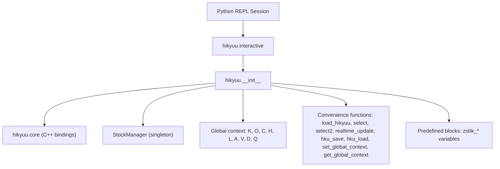
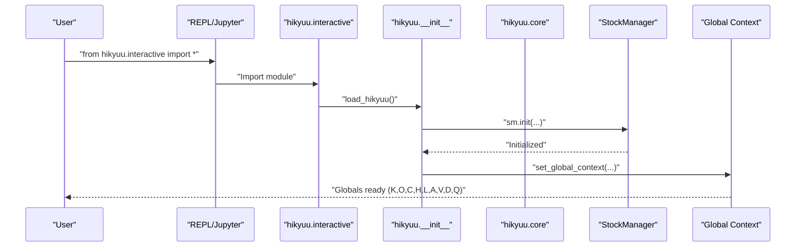
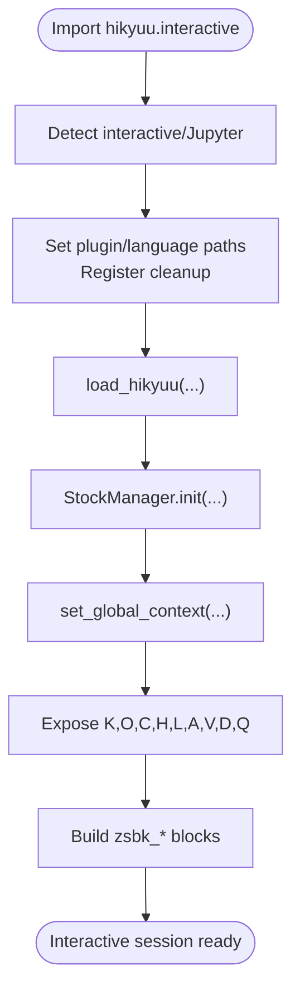
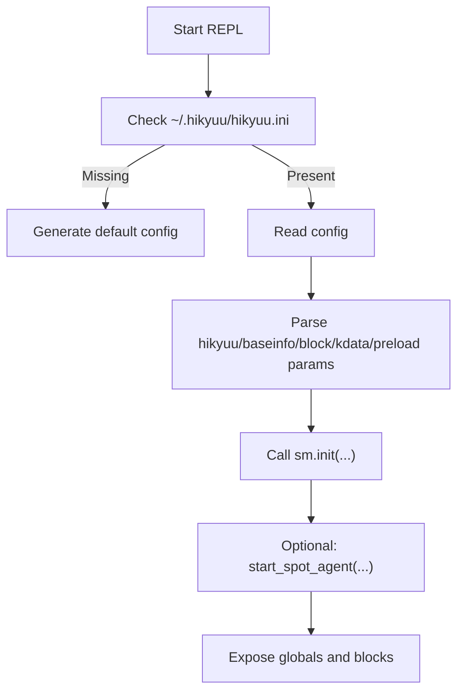
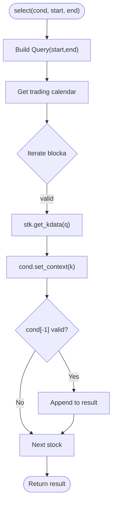
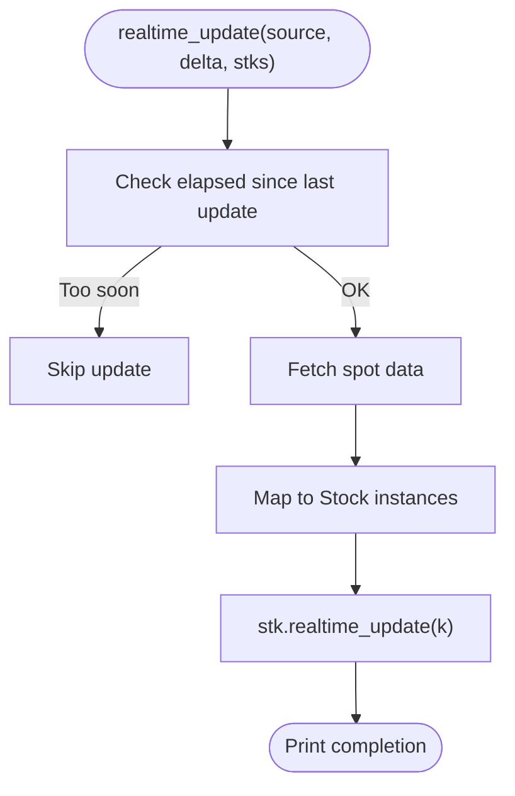
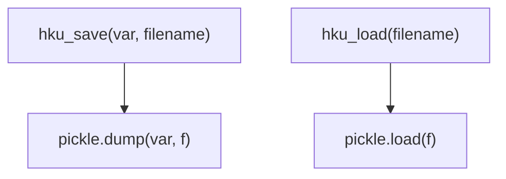
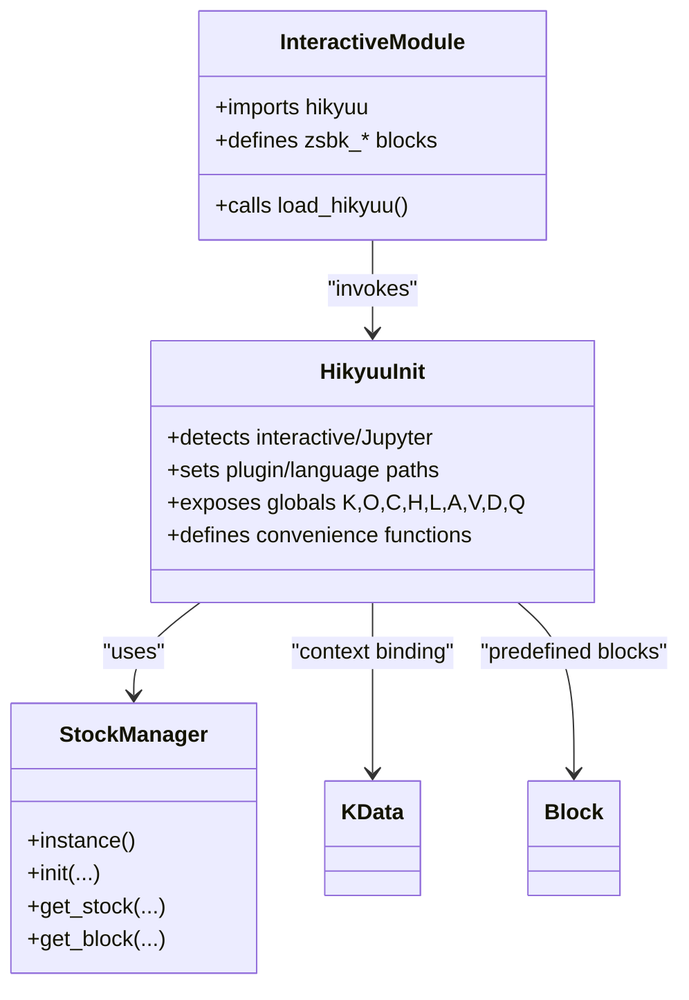
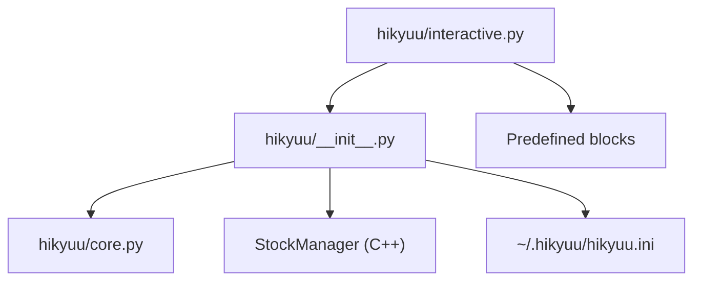

# Interactive Mode

<cite>
**Referenced Files in This Document**
- [interactive.py](file://hikyuu/interactive.py)
- [__init__.py](file://hikyuu/__init__.py)
- [core.py](file://hikyuu/core.py)
- [hku_config_template.py](file://hikyuu/data/hku_config_template.py)
- [001-overview.ipynb](file://hikyuu/examples/notebook/001-overview.ipynb)
- [examples_init.py](file://hikyuu/examples/examples_init.py)
- [test_init.py](file://hikyuu/test/test_init.py)
- [StockManager.h](file://hikyuu_cpp/hikyuu/StockManager.h)
- [KData.h](file://hikyuu_cpp/hikyuu/KData.h)
- [Block.h](file://hikyuu_cpp/hikyuu/Block.h)
</cite>

## Table of Contents
1. [Introduction](#introduction)
2. [Project Structure](#project-structure)
3. [Core Components](#core-components)
4. [Architecture Overview](#architecture-overview)
5. [Detailed Component Analysis](#detailed-component-analysis)
6. [Dependency Analysis](#dependency-analysis)
7. [Performance Considerations](#performance-considerations)
8. [Troubleshooting Guide](#troubleshooting-guide)
9. [Conclusion](#conclusion)
10. [Appendices](#appendices)

## Introduction
This document explains the interactive mode feature of Hikyuu, enabling rapid prototyping and exploratory analysis through a Python REPL environment. It covers initialization, available global objects and convenience functions, practical examples for loading data, creating indicators, and testing strategies, and the relationship between interactive.py and core components such as StockManager and KData. It also addresses common setup and session persistence issues with actionable solutions.

## Project Structure
Interactive mode is primarily provided by importing from the interactive module, which initializes the Hikyuu core, sets up global variables, and exposes convenience functions for interactive exploration.

**Diagram sources**
- [interactive.py](file://hikyuu/interactive.py#L1-L69)
- [__init__.py](file://hikyuu/__init__.py#L85-L117)
- [__init__.py](file://hikyuu/__init__.py#L149-L171)
- [__init__.py](file://hikyuu/__init__.py#L173-L188)
- [__init__.py](file://hikyuu/__init__.py#L190-L197)
- [__init__.py](file://hikyuu/__init__.py#L219-L422)
- [__init__.py](file://hikyuu/__init__.py#L428-L595)

**Section sources**
- [interactive.py](file://hikyuu/interactive.py#L1-L69)
- [__init__.py](file://hikyuu/__init__.py#L85-L117)
- [__init__.py](file://hikyuu/__init__.py#L149-L171)
- [__init__.py](file://hikyuu/__init__.py#L173-L188)
- [__init__.py](file://hikyuu/__init__.py#L190-L197)
- [__init__.py](file://hikyuu/__init__.py#L219-L422)
- [__init__.py](file://hikyuu/__init__.py#L428-L595)

## Core Components
- Initialization and environment detection:
  - Detects interactive sessions and Jupyter frontends, adjusts output redirection and console encoding.
  - Sets plugin and language paths and registers cleanup hooks.
- Global context:
  - Exposes K (KData), O (OPEN), C (CLOSE), H (HIGH), L (LOW), A (AMO), V (VOL), D (Datetime), Q (Query) as global variables for convenient access.
- Convenience functions:
  - load_hikyuu: Initializes Hikyuu with configurable parameters and starts optional spot agent.
  - set_global_context/get_global_context: Manage the current K-line context for indicators.
  - select/select2: Quick screening of stocks based on conditions or export of indicator values.
  - realtime_update: Periodic update of daily bars from external sources.
  - hku_save/hku_load: Pickle-based persistence for Hikyuu built-in types.
- Predefined blocks:
  - Interactive mode defines and exposes zsbk_* variables for common market segments and indices.

**Section sources**
- [__init__.py](file://hikyuu/__init__.py#L113-L163)
- [__init__.py](file://hikyuu/__init__.py#L149-L171)
- [__init__.py](file://hikyuu/__init__.py#L173-L188)
- [__init__.py](file://hikyuu/__init__.py#L190-L197)
- [__init__.py](file://hikyuu/__init__.py#L219-L422)
- [__init__.py](file://hikyuu/__init__.py#L428-L595)
- [interactive.py](file://hikyuu/interactive.py#L27-L69)

## Architecture Overview
The interactive mode orchestrates the initialization of Hikyuu’s core (C++), binds Python globals, and exposes convenience APIs for immediate analysis.

**Diagram sources**
- [interactive.py](file://hikyuu/interactive.py#L27-L30)
- [__init__.py](file://hikyuu/__init__.py#L219-L422)
- [__init__.py](file://hikyuu/__init__.py#L173-L188)
- [StockManager.h](file://hikyuu_cpp/hikyuu/StockManager.h#L28-L120)

## Detailed Component Analysis

### Interactive Initialization and Global Context
- Interactive detection:
  - Detects interactive sessions and Jupyter frontends, enabling output redirection and drawing engine selection.
- Global variables:
  - K, O, C, H, L, A, V, D, Q are defined globally for immediate use.
  - set_global_context binds indicator contexts to a specific KData.
  - get_global_context retrieves the current KData context.
- Predefined blocks:
  - Interactive mode builds and exposes zsbk_* variables for A-share segments and indices.

**Diagram sources**
- [__init__.py](file://hikyuu/__init__.py#L113-L163)
- [__init__.py](file://hikyuu/__init__.py#L219-L422)
- [__init__.py](file://hikyuu/__init__.py#L173-L188)
- [interactive.py](file://hikyuu/interactive.py#L27-L69)

**Section sources**
- [__init__.py](file://hikyuu/__init__.py#L113-L163)
- [__init__.py](file://hikyuu/__init__.py#L149-L171)
- [__init__.py](file://hikyuu/__init__.py#L173-L188)
- [__init__.py](file://hikyuu/__init__.py#L190-L197)
- [__init__.py](file://hikyuu/__init__.py#L219-L422)
- [interactive.py](file://hikyuu/interactive.py#L27-L69)

### Data Loading and Configuration
- Default configuration:
  - Generates a default hikyuu.ini under ~/.hikyuu if missing, and creates importdata-gui.ini and block configs.
- Environment variables:
  - Supports HKU_STOCK_LIST, HKU_KTYPE_LIST, HKU_LOAD_HISTORY_FINANCE, HKU_LOAD_STOCK_WEIGHT, HKU_START_SPOT, HKU_SPOT_WORKER_NUM for flexible initialization.
- Example usage:
  - Notebook demonstrates importing interactive and running a simple trading system.

**Diagram sources**
- [hku_config_template.py](file://hikyuu/data/hku_config_template.py#L303-L339)
- [__init__.py](file://hikyuu/__init__.py#L219-L356)
- [001-overview.ipynb](file://hikyuu/examples/notebook/001-overview.ipynb#L1-L40)

**Section sources**
- [hku_config_template.py](file://hikyuu/data/hku_config_template.py#L303-L339)
- [__init__.py](file://hikyuu/__init__.py#L219-L356)
- [001-overview.ipynb](file://hikyuu/examples/notebook/001-overview.ipynb#L1-L40)

### Indicator Selection and Export
- select:
  - Evaluates a condition indicator across a block (default A-shares) over a date range and prints selected stocks.
- select2:
  - Exports last-period indicator values for a list of stocks into a DataFrame.

**Diagram sources**
- [__init__.py](file://hikyuu/__init__.py#L445-L479)
- [__init__.py](file://hikyuu/__init__.py#L481-L529)

**Section sources**
- [__init__.py](file://hikyuu/__init__.py#L445-L479)
- [__init__.py](file://hikyuu/__init__.py#L481-L529)

### Real-time Data Update
- realtime_update:
  - Periodically updates daily bars for a subset of stocks from external sources (e.g., QQ or QMT), with throttling to avoid excessive updates.

**Diagram sources**
- [__init__.py](file://hikyuu/__init__.py#L538-L595)

**Section sources**
- [__init__.py](file://hikyuu/__init__.py#L538-L595)

### Persistence Utilities
- hku_save/hku_load:
  - Serialize/deserialize Hikyuu built-in types (e.g., TradeManager) using pickle.

**Diagram sources**
- [__init__.py](file://hikyuu/__init__.py#L149-L171)

**Section sources**
- [__init__.py](file://hikyuu/__init__.py#L149-L171)

### Relationship Between interactive.py and Core Components
- interactive.py:
  - Imports from hikyuu package, triggers load_hikyuu, and constructs predefined blocks.
- hikyuu.__init__.py:
  - Initializes StockManager, sets plugin/language paths, detects interactive/Jupyter, and defines globals and convenience functions.
- hikyuu.core:
  - Provides Python bindings to Hikyuu C++ core, exposing StockManager and other types.
- C++ core types:
  - StockManager, KData, Block are the foundational types used by interactive mode.

**Diagram sources**
- [interactive.py](file://hikyuu/interactive.py#L27-L69)
- [__init__.py](file://hikyuu/__init__.py#L85-L117)
- [__init__.py](file://hikyuu/__init__.py#L149-L171)
- [__init__.py](file://hikyuu/__init__.py#L173-L188)
- [__init__.py](file://hikyuu/__init__.py#L219-L422)
- [StockManager.h](file://hikyuu_cpp/hikyuu/StockManager.h#L28-L120)
- [KData.h](file://hikyuu_cpp/hikyuu/KData.h#L21-L200)
- [Block.h](file://hikyuu_cpp/hikyuu/Block.h#L19-L165)

**Section sources**
- [interactive.py](file://hikyuu/interactive.py#L27-L69)
- [__init__.py](file://hikyuu/__init__.py#L85-L117)
- [__init__.py](file://hikyuu/__init__.py#L149-L171)
- [__init__.py](file://hikyuu/__init__.py#L173-L188)
- [__init__.py](file://hikyuu/__init__.py#L219-L422)
- [StockManager.h](file://hikyuu_cpp/hikyuu/StockManager.h#L28-L120)
- [KData.h](file://hikyuu_cpp/hikyuu/KData.h#L21-L200)
- [Block.h](file://hikyuu_cpp/hikyuu/Block.h#L19-L165)

## Dependency Analysis
- Module coupling:
  - interactive.py depends on hikyuu.__init__ for initialization and convenience functions.
  - hikyuu.__init__ depends on hikyuu.core for C++ bindings and on StockManager for data management.
- External dependencies:
  - Configuration files (hikyuu.ini) and optional plugins influence initialization behavior.
  - Drawing engine selection affects visualization in interactive sessions.

**Diagram sources**
- [interactive.py](file://hikyuu/interactive.py#L27-L69)
- [__init__.py](file://hikyuu/__init__.py#L85-L117)
- [__init__.py](file://hikyuu/__init__.py#L219-L422)
- [core.py](file://hikyuu/core.py#L1-L30)

**Section sources**
- [interactive.py](file://hikyuu/interactive.py#L27-L69)
- [__init__.py](file://hikyuu/__init__.py#L85-L117)
- [__init__.py](file://hikyuu/__init__.py#L219-L422)
- [core.py](file://hikyuu/core.py#L1-L30)

## Performance Considerations
- Preloading:
  - Use preload_num to cap memory usage for large datasets; adjust per K-line type.
- K-line context:
  - set_global_context binds indicator contexts to a specific KData window; keep windows tight for responsiveness.
- Real-time updates:
  - Use realtime_update delta to throttle updates and reduce network overhead.
- Environment variables:
  - HKU_STOCK_LIST and HKU_KTYPE_LIST can limit initial load scope for faster startup.

[No sources needed since this section provides general guidance]

## Troubleshooting Guide
- Missing configuration:
  - Symptom: Initialization fails or defaults are generated.
  - Resolution: Ensure ~/.hikyuu/hikyuu.ini exists; the system can generate defaults automatically.
- Data not loaded:
  - Symptom: No stocks or empty KData.
  - Resolution: Verify baseinfo and kdata drivers in hikyuu.ini; confirm data directories exist and are readable.
- Chinese output on Windows:
  - Symptom: Console displays garbled text.
  - Resolution: The initializer switches console code page when in non-Jupyter interactive mode on Windows.
- Jupyter output:
  - Symptom: C++ logs not visible in notebook.
  - Resolution: The initializer enables output redirection to Python when in IPython frontend.
- Plugin path mismatch:
  - Symptom: Plugin not found or version mismatch warning.
  - Resolution: Ensure plugin path aligns with hikyuu version; the initializer warns on major version mismatches.
- Session persistence:
  - Symptom: Variables lost after restart.
  - Resolution: Use hku_save/hku_load to persist built-in types; note that interactive globals are reinitialized per session.

**Section sources**
- [hku_config_template.py](file://hikyuu/data/hku_config_template.py#L303-L339)
- [__init__.py](file://hikyuu/__init__.py#L113-L163)
- [__init__.py](file://hikyuu/__init__.py#L149-L171)
- [__init__.py](file://hikyuu/__init__.py#L219-L356)

## Conclusion
Interactive mode streamlines Hikyuu usage in a REPL environment by initializing the core, exposing convenient globals and functions, and providing quick utilities for data loading, indicator evaluation, and real-time updates. By leveraging configuration files and environment variables, users can tailor initialization to their needs. For persistent workflows, leverage hku_save/hku_load to preserve built-in types across sessions.

[No sources needed since this section summarizes without analyzing specific files]

## Appendices

### Practical Examples from the Codebase
- Notebook overview demonstrates importing interactive, creating a simple trading system, plotting signals, and generating reports.
- Example initialization scripts show how to initialize Hikyuu with a configuration file and obtain the StockManager instance.

**Section sources**
- [001-overview.ipynb](file://hikyuu/examples/notebook/001-overview.ipynb#L1-L40)
- [examples_init.py](file://hikyuu/examples/examples_init.py#L1-L33)
- [test_init.py](file://hikyuu/test/test_init.py#L1-L39)