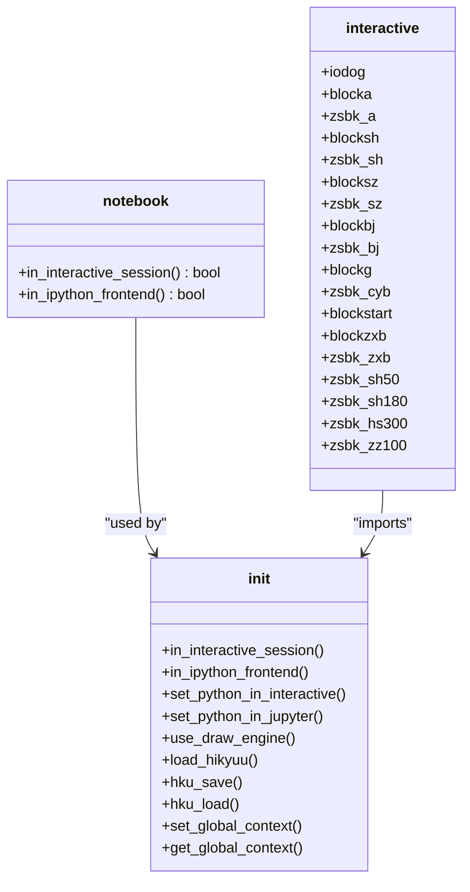
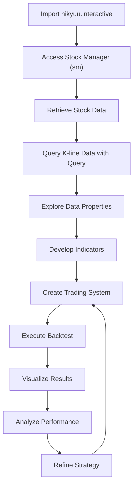
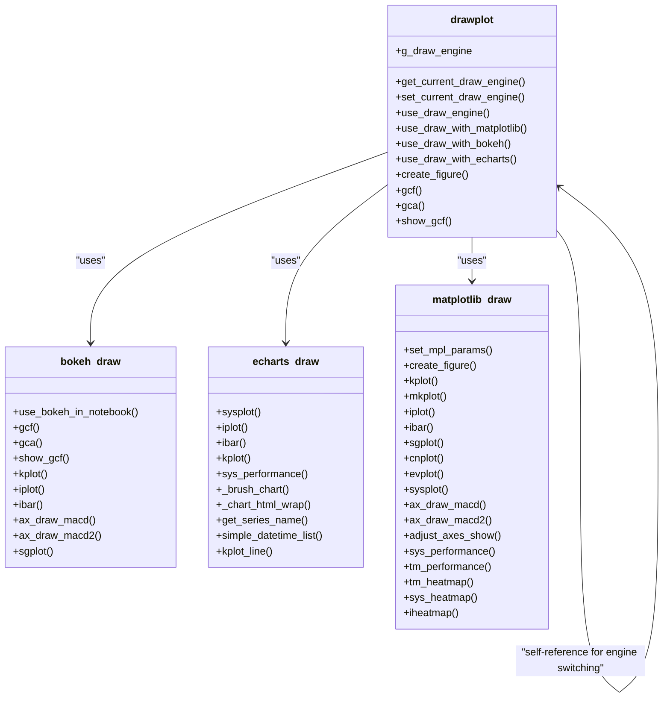

# Jupyter Integration

<cite>
**Referenced Files in This Document**   
- [notebook.py](file://hikyuu/util/notebook.py)
- [interactive.py](file://hikyuu/__init__.py)
- [__init__.py](file://hikyuu/draw/drawplot/__init__.py)
- [bokeh_draw.py](file://hikyuu/draw/drawplot/bokeh_draw.py)
- [echarts_draw.py](file://hikyuu/draw/drawplot/echarts_draw.py)
- [001-overview.ipynb](file://hikyuu/examples/notebook/001-overview.ipynb)
- [003-HowToGetKDataAndDraw.ipynb](file://hikyuu/examples/notebook/003-HowToGetKDataAndDraw.ipynb)
- [002-HowToGetStock.ipynb](file://hikyuu/examples/notebook/002-HowToGetStock.ipynb)
- [Demo1.ipynb](file://hikyuu/examples/notebook/Demo/Demo1.ipynb)
</cite>

## Table of Contents
1. [Introduction](#introduction)
2. [Jupyter Environment Detection](#jupyter-environment-detection)
3. [Setup Process](#setup-process)
4. [Magic Commands and Display Integration](#magic-commands-and-display-integration)
5. [Workflow Patterns](#workflow-patterns)
6. [Plotting Backend Selection](#plotting-backend-selection)
7. [Common Issues and Solutions](#common-issues-and-solutions)
8. [Conclusion](#conclusion)

## Introduction
The hikyuu framework provides comprehensive support for Jupyter notebooks, enabling interactive strategy development and visualization for quantitative trading analysis. This integration allows users to leverage the power of hikyuu's financial data processing and backtesting capabilities within the interactive Jupyter environment. The framework is designed to facilitate data exploration, indicator testing, and backtesting analysis through a series of well-structured examples in the examples/notebook/ directory. By combining Python's interactive capabilities with hikyuu's specialized financial functions, users can develop and test trading strategies in an intuitive and visual manner. The integration is particularly valuable for both beginners learning quantitative trading concepts and experienced developers implementing complex trading algorithms.

**Section sources**
- [001-overview.ipynb](file://hikyuu/examples/notebook/001-overview.ipynb#L1-L200)
- [003-HowToGetKDataAndDraw.ipynb](file://hikyuu/examples/notebook/003-HowToGetKDataAndDraw.ipynb#L1-L200)

## Jupyter Environment Detection
The hikyuu framework includes dedicated functionality for detecting when it is running within a Jupyter environment. This detection is implemented in the util/notebook.py module, which contains two key functions: in_interactive_session() and in_ipython_frontend(). The in_interactive_session() function checks whether the code is running in an interactive Python or IPython shell by examining the presence of the __main__ module and its __file__ attribute. The in_ipython_frontend() function specifically detects if the code is running within a Jupyter frontend by checking for the presence of the IPython kernel and examining the type of the IPython instance. These detection mechanisms are crucial for enabling environment-specific behaviors, such as redirecting C++ stdout/stderr output to Python when running in Jupyter. The framework automatically calls these detection functions during initialization in hikyuu/__init__.py, where it sets appropriate flags and enables Jupyter-specific features when the environment is detected.

**Diagram sources **
- [notebook.py](file://hikyuu/util/notebook.py#L1-L48)
- [interactive.py](file://hikyuu/__init__.py#L130-L138)

**Section sources**
- [notebook.py](file://hikyuu/util/notebook.py#L1-L48)
- [interactive.py](file://hikyuu/__init__.py#L130-L138)

## Setup Process
Setting up hikyuu for use within Jupyter environments involves a straightforward initialization process that automatically configures the framework for interactive use. The setup begins with importing the interactive components using "from hikyuu.interactive import *", which initializes the framework and detects the Jupyter environment. During initialization in hikyuu/__init__.py, the framework checks if it's running in an interactive session and sets the appropriate flags. When a Jupyter environment is detected via the in_ipython_frontend() function, the framework automatically redirects C++ stdout/stderr output to Python using iodog.open(), ensuring that all logging and output messages appear in the notebook cells. The initialization also preloads essential market data and creates predefined block variables (such as zsbk_a for all A-shares, zsbk_sh for Shanghai stocks, and zsbk_sz for Shenzhen stocks) that are immediately available for analysis. This automatic setup process eliminates the need for manual configuration, allowing users to immediately begin working with financial data upon importing the framework.

**Section sources**
- [interactive.py](file://hikyuu/__init__.py#L130-L139)
- [001-overview.ipynb](file://hikyuu/examples/notebook/001-overview.ipynb#L54-L57)

## Magic Commands and Display Integration
The hikyuu framework integrates seamlessly with Jupyter's magic commands and display system to enhance the interactive development experience. While the framework doesn't implement custom IPython magic commands, it leverages standard Python syntax and Jupyter's execution model to provide an intuitive interface. The %time magic command is commonly used in example notebooks to measure the execution time of the import statement, providing feedback on initialization performance. The framework's display integration is particularly sophisticated, automatically adapting its behavior based on the detected environment. When running in Jupyter, the framework redirects C++ stdout/stderr output to Python, ensuring that all framework messages, warnings, and logs appear directly in the notebook cells. This integration is handled by the iodog.open() function, which is automatically called when the Jupyter environment is detected. The framework also integrates with Jupyter's rich display system through its plotting backends, which can render interactive charts directly within notebook cells.

**Section sources**
- [001-overview.ipynb](file://hikyuu/examples/notebook/001-overview.ipynb#L54-L57)
- [interactive.py](file://hikyuu/__init__.py#L139-L140)

## Workflow Patterns
The hikyuu framework demonstrates several key workflow patterns for interactive strategy development in Jupyter notebooks, as illustrated in the examples/notebook/ directory. The primary workflow begins with importing the interactive components and immediately accessing financial data through the global stock manager (sm). Users can retrieve specific stocks using market-code identifiers (e.g., 'sh000001' for the Shanghai Composite Index) and query historical K-line data using the Query class. Data exploration typically involves examining KData objects, which can be treated like lists for iteration and value inspection. For strategy development, users create trading systems by combining signal generators (SG), money managers (MM), and trade managers (TM), then execute backtests and visualize results. The workflow emphasizes interactive exploration, allowing users to test indicators, analyze performance metrics, and refine strategies through iterative development. The examples demonstrate progressive complexity, starting with basic data retrieval and visualization, then advancing to complete strategy implementation and performance analysis.

**Diagram sources **
- [002-HowToGetStock.ipynb](file://hikyuu/examples/notebook/002-HowToGetStock.ipynb#L37-L39)
- [003-HowToGetKDataAndDraw.ipynb](file://hikyuu/examples/notebook/003-HowToGetKDataAndDraw.ipynb#L77-L79)
- [Demo1.ipynb](file://hikyuu/examples/notebook/Demo/Demo1.ipynb#L114-L158)

**Section sources**
- [002-HowToGetStock.ipynb](file://hikyuu/examples/notebook/002-HowToGetStock.ipynb#L37-L39)
- [003-HowToGetKDataAndDraw.ipynb](file://hikyuu/examples/notebook/003-HowToGetKDataAndDraw.ipynb#L77-L79)
- [Demo1.ipynb](file://hikyuu/examples/notebook/Demo/Demo1.ipynb#L114-L158)

## Plotting Backend Selection
The hikyuu framework provides flexible plotting backend selection through the use_draw_engine() function, allowing users to choose between matplotlib, bokeh, and echarts rendering engines. By default, the framework initializes with matplotlib as the plotting backend, as specified in hikyuu/__init__.py with the use_draw_engine('matplotlib') call. Users can switch between backends using the use_draw_engine() function, which dynamically reassigns plotting methods to the appropriate backend implementations. The drawplot/__init__.py module contains the engine switching logic, where use_draw_with_matplotlib(), use_draw_with_bokeh(), and use_draw_with_echarts() functions rebind plotting methods like KData.plot and Indicator.plot to their respective backend implementations. For Jupyter environments, the bokeh backend includes special handling through use_bokeh_in_notebook(True), which configures bokeh for notebook display. Each backend offers different capabilities: matplotlib provides traditional static plots, bokeh enables interactive web-based visualizations, and echarts offers rich, interactive charts with advanced features like data brushing and zooming.

**Diagram sources **
- [__init__.py](file://hikyuu/draw/drawplot/__init__.py#L90-L148)
- [bokeh_draw.py](file://hikyuu/draw/drawplot/bokeh_draw.py#L1-L62)
- [echarts_draw.py](file://hikyuu/draw/drawplot/echarts_draw.py#L1-L200)

**Section sources**
- [__init__.py](file://hikyuu/draw/drawplot/__init__.py#L90-L148)
- [bokeh_draw.py](file://hikyuu/draw/drawplot/bokeh_draw.py#L1-L62)
- [echarts_draw.py](file://hikyuu/draw/drawplot/echarts_draw.py#L1-L200)

## Common Issues and Solutions
Users may encounter several common issues when working with hikyuu in Jupyter environments, along with established solutions. One frequent issue involves plotting backend configuration, where users might experience display problems when switching between matplotlib, bokeh, and echarts. The solution is to ensure proper initialization of the selected backend using use_draw_engine() and, for bokeh, calling use_bokeh_in_notebook(True) when working in Jupyter. Another common issue relates to C++ output redirection, where framework messages might not appear in notebook cells. This is resolved by the automatic iodog.open() call when the Jupyter environment is detected, though users can manually call this function if needed. Performance issues during initialization can occur due to the automatic preloading of extensive market data; users can mitigate this by configuring selective data loading through the load_hikyuu() function parameters. Additionally, users working with Python versions above 3.12 might encounter matplotlib display issues, which can be addressed by commenting out the %matplotlib inline magic command as suggested in the Demo1.ipynb example.

**Section sources**
- [001-overview.ipynb](file://hikyuu/examples/notebook/001-overview.ipynb#L54-L57)
- [Demo1.ipynb](file://hikyuu/examples/notebook/Demo/Demo1.ipynb#L45-L48)
- [interactive.py](file://hikyuu/__init__.py#L135-L139)

## Conclusion
The hikyuu framework's Jupyter integration provides a powerful environment for interactive quantitative trading strategy development and visualization. Through automatic environment detection, seamless output redirection, and flexible plotting backend selection, the framework creates an intuitive workflow for financial data analysis. The integration enables users to efficiently explore market data, test technical indicators, and develop trading strategies through an iterative process supported by comprehensive examples in the notebook directory. The framework's design prioritizes ease of use while maintaining technical depth, making it accessible to beginners through predefined variables and simple import patterns, while offering advanced capabilities for experienced developers through customizable components and multiple visualization backends. By leveraging Jupyter's interactive capabilities, hikyuu transforms quantitative trading analysis into a dynamic and visual process, allowing users to rapidly prototype, test, and refine trading strategies with immediate feedback and comprehensive performance analysis.