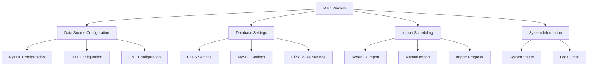
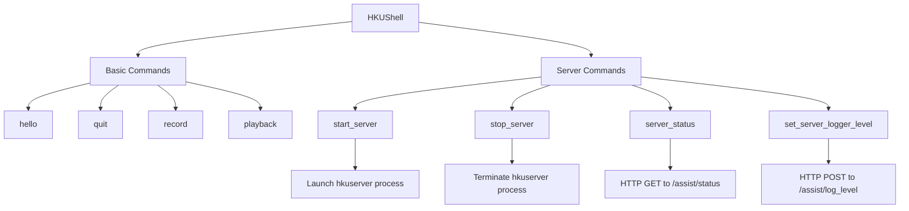

# User Interfaces

<cite>
**Referenced Files in This Document**   
- [__init__.py](file://hikyuu/__init__.py)
- [interactive.py](file://hikyuu/interactive.py)
- [notebook.py](file://hikyuu/util/notebook.py)
- [MainWindow.py](file://hikyuu/gui/data/MainWindow.py)
- [importdata.py](file://hikyuu/gui/importdata.py)
- [dataserver.py](file://hikyuu/gui/dataserver.py)
- [start_qmt.py](file://hikyuu/gui/start_qmt.py)
- [hkushell.py](file://hikyuu/shell/hkushell.py)
- [hkucmd.py](file://hikyuu/shell/hkucmd.py)
- [cmdserver.py](file://hikyuu/shell/cmdserver.py)
</cite>

## Table of Contents
1. [Introduction](#introduction)
2. [Interactive Mode](#interactive-mode)
3. [Jupyter Notebook Integration](#jupyter-notebook-integration)
4. [Graphical User Interface](#graphical-user-interface)
5. [Command Line Tools](#command-line-tools)
6. [Interface Configuration and Public APIs](#interface-configuration-and-public-apis)

## Introduction

Hikyuu provides multiple user interfaces to accommodate users with different technical expertise and use cases. The framework supports interactive Python REPL environments for exploratory analysis, Jupyter notebook integration for data visualization and strategy development, a graphical user interface (GUI) for data management and monitoring, and command-line tools for automation and scripting. These interfaces allow users to interact with the quantitative trading framework at different levels of complexity, from beginner-friendly graphical tools to advanced programmatic interfaces for experienced developers. The system is designed to provide seamless integration between these different interaction modes, allowing users to choose the most appropriate interface for their specific tasks while maintaining access to the full functionality of the framework.

## Interactive Mode

Hikyuu supports an interactive mode that allows users to work with the framework in a Python REPL (Read-Eval-Print Loop) environment. This mode is particularly useful for exploratory data analysis, quick testing of trading strategies, and learning the framework's capabilities. The interactive mode is automatically detected and configured when the framework is imported in an interactive Python session, as indicated by the `in_interactive_session()` function in the `notebook.py` module. When running in interactive mode, the framework sets appropriate flags and configurations to optimize the user experience, including redirecting C++ stdout/stderr output to Python for better visibility of system messages.

The `interactive.py` file serves as a convenient entry point for the interactive mode, automatically loading the Hikyuu environment and initializing commonly used stock blocks such as `blocka` (all A-shares), `blocksh` (Shanghai market), and `blocksz` (Shenzhen market). This pre-configuration allows users to immediately start working with market data without needing to set up the environment manually. The interactive mode also provides global variables for common indicators like `O` (OPEN), `C` (CLOSE), `H` (HIGH), `L` (LOW), `A` (AMO), and `V` (VOL), making it easier to perform technical analysis directly in the REPL.

**Section sources**
- [__init__.py](file://hikyuu/__init__.py#L130-L133)
- [interactive.py](file://hikyuu/interactive.py#L27-L69)
- [notebook.py](file://hikyuu/util/notebook.py#L9-L29)

## Jupyter Notebook Integration

Hikyuu provides seamless integration with Jupyter notebooks, enabling users to perform exploratory data analysis and strategy development in a web-based, interactive environment. The integration is facilitated by the `in_ipython_frontend()` function in the `notebook.py` module, which detects when the code is running in a Jupyter environment and configures the framework accordingly. When this condition is met, the framework automatically redirects C++ stdout/stderr output to Python, ensuring that all system messages and logging information are properly displayed in the notebook cells.

The framework includes a comprehensive set of example notebooks in the `examples/notebook` directory that demonstrate various aspects of quantitative analysis and strategy development. These notebooks cover topics such as retrieving stock data, visualizing K-line charts, exploring technical indicators, and implementing trading strategies. The Jupyter integration allows users to combine code, visualizations, and narrative text in a single document, making it ideal for research, education, and collaborative development. Users can leverage the full power of the Hikyuu framework within the familiar notebook interface, executing code cells incrementally and immediately seeing the results of their analysis.

**Section sources**
- [__init__.py](file://hikyuu/__init__.py#L136-L139)
- [notebook.py](file://hikyuu/util/notebook.py#L32-L47)
- [examples/notebook](file://hikyuu/examples/notebook)

## Graphical User Interface

Hikyuu features a comprehensive graphical user interface (GUI) built with PySide6 that provides a visual environment for data management and strategy monitoring. The GUI is organized into multiple tabs, each focusing on different aspects of the system configuration and operation. The main window, defined in `MainWindow.py`, includes tabs for data source configuration, database settings, import scheduling, and system information.

The data source tab allows users to configure different data sources such as PyTDX, TDX, and QMT, with options to specify the number of connections and directory paths. Users can also select which types of data to import, including daily, 5-minute, and 1-minute K-line data, as well as transaction and time-series data. The database tab provides configuration options for different storage backends, including HDF5, MySQL, and ClickHouse, allowing users to choose the most appropriate database system for their needs.

The import scheduling tab enables users to automate data import tasks, with options to set specific times for scheduled imports. The GUI also includes progress bars and status indicators to monitor the import process in real-time, along with a detailed log of import activities. This visual interface makes it easy for users to manage their data without needing to write code or use command-line tools, lowering the barrier to entry for non-technical users.

**Diagram sources **
- [MainWindow.py](file://hikyuu/gui/data/MainWindow.py#L26-L800)
- [importdata.py](file://hikyuu/gui/importdata.py#L18-L171)

**Section sources**
- [MainWindow.py](file://hikyuu/gui/data/MainWindow.py#L26-L800)
- [importdata.py](file://hikyuu/gui/importdata.py#L18-L171)
- [dataserver.py](file://hikyuu/gui/dataserver.py#L7-L36)
- [start_qmt.py](file://hikyuu/gui/start_qmt.py#L5-L140)

## Command Line Tools

Hikyuu provides a suite of command-line tools for automation and scripting, centered around the `HKUShell` class in the `hkushell.py` module. This interactive command-line interface offers a shell environment with a custom prompt and colorized output, providing a rich text-based interface for interacting with the framework. The shell supports basic commands like `hello`, `quit`, `record`, and `playback`, allowing users to save command sequences to files and replay them later.

The command-line interface is extensible through the `add_command` method, which allows additional functionality to be added to the shell. One such extension is the `server` command, implemented in `cmdserver.py`, which provides control over the Hikyuu data server. This command allows users to start, stop, and check the status of the server, as well as configure logging levels. The server functionality enables remote access to Hikyuu's capabilities through HTTP requests, making it possible to integrate the framework with other systems and automate complex workflows.

These command-line tools are particularly useful for system administrators and developers who need to automate routine tasks, integrate Hikyuu with other systems, or build custom workflows. The tools can be used in scripts and batch files, making them ideal for scheduled operations and continuous integration pipelines.

**Diagram sources **
- [hkushell.py](file://hikyuu/shell/hkushell.py#L12-L20)
- [hkucmd.py](file://hikyuu/shell/hkucmd.py#L32-L111)
- [cmdserver.py](file://hikyuu/shell/cmdserver.py#L51-L127)

**Section sources**
- [hkushell.py](file://hikyuu/shell/hkushell.py#L12-L20)
- [hkucmd.py](file://hikyuu/shell/hkucmd.py#L32-L111)
- [cmdserver.py](file://hikyuu/shell/cmdserver.py#L51-L127)

## Interface Configuration and Public APIs

Hikyuu's user interfaces expose a range of configuration options and public APIs that allow both beginners and experienced developers to customize and extend the system. The framework uses a hierarchical configuration system that can be controlled through environment variables, configuration files, and function parameters, with the `load_hikyuu()` function serving as the primary entry point for initializing the environment with custom settings.

For beginners, the system provides sensible defaults and high-level functions that abstract away complexity. For example, the `select()` and `select2()` functions in `__init__.py` provide simple interfaces for screening stocks based on technical conditions, returning results in an easy-to-understand format. These functions handle the underlying complexity of data retrieval and processing, allowing users to focus on their analysis.

For experienced developers, the framework exposes lower-level APIs that provide fine-grained control over system behavior. The GUI components, such as the import threads in `importdata.py`, can be used programmatically to automate data management tasks. Similarly, the command-line server interface exposes HTTP endpoints that can be accessed from external applications, enabling integration with other systems and the creation of custom front-ends.

The framework also provides extension points through its plugin system and event-driven architecture. For example, the `start_qmt.py` script demonstrates how to integrate with external data sources by subscribing to real-time market data from QMT and forwarding it to the Hikyuu system. This modular design allows developers to extend the framework's capabilities without modifying its core components.

**Section sources**
- [__init__.py](file://hikyuu/__init__.py#L219-L421)
- [load_hikyuu](file://hikyuu/__init__.py#L219-L421)
- [select](file://hikyuu/__init__.py#L445-L478)
- [select2](file://hikyuu/__init__.py#L481-L528)
- [start_qmt.py](file://hikyuu/gui/start_qmt.py#L1-L140)