# Visualization and Analysis

<cite>
**Referenced Files in This Document**   
- [__init__.py](file://hikyuu/draw/__init__.py)
- [drawplot/__init__.py](file://hikyuu/draw/drawplot/__init__.py)
- [drawplot/matplotlib_draw.py](file://hikyuu/draw/drawplot/matplotlib_draw.py)
- [drawplot/bokeh_draw.py](file://hikyuu/draw/drawplot/bokeh_draw.py)
- [drawplot/echarts_draw.py](file://hikyuu/draw/drawplot/echarts_draw.py)
- [analysis.py](file://hikyuu/analysis/analysis.py)
- [003-HowToGetKDataAndDraw.ipynb](file://hikyuu/examples/notebook/003-HowToGetKDataAndDraw.ipynb)
</cite>

## Table of Contents
1. [Introduction](#introduction)
2. [Visualization Capabilities](#visualization-capabilities)
3. [Charting Backends](#charting-backends)
4. [Financial Chart Types](#financial-chart-types)
5. [Analysis Tools Integration](#analysis-tools-integration)
6. [Backtesting Results Visualization](#backtesting-results-visualization)
7. [Public Interfaces](#public-interfaces)
8. [Conclusion](#conclusion)

## Introduction
The hikyuu library provides comprehensive visualization and analysis capabilities for financial data, trading signals, and strategy performance. This document explains the purpose of visualizing financial data, trading signals, and strategy performance. It documents the charting capabilities that support multiple plotting backends including matplotlib, bokeh, and echarts. The document describes how to create various types of financial charts such as candlestick plots, indicator overlays, and performance curves. It explains the integration with analysis tools for strategy debugging and result interpretation. The document covers the different visualization options for backtesting results including equity curves, drawdown charts, and trade distribution plots. It includes both conceptual overviews for beginners explaining basic chart types and technical details for experienced developers about customization options and performance considerations. Practical examples from the codebase show how to generate different types of visualizations. The document also covers the public interfaces for visualization operations and their parameters.

## Visualization Capabilities

The hikyuu library provides extensive visualization capabilities for financial data analysis, strategy development, and performance evaluation. These capabilities are designed to help users understand market dynamics, analyze trading strategies, and interpret backtesting results through various visual representations.

The visualization system in hikyuu serves multiple purposes:
- **Financial Data Visualization**: Displaying price movements, volume patterns, and technical indicators to identify market trends and patterns.
- **Trading Signal Visualization**: Plotting buy/sell signals on price charts to evaluate strategy entry and exit points.
- **Strategy Performance Analysis**: Visualizing equity curves, drawdowns, and other performance metrics to assess strategy effectiveness.
- **Indicator Analysis**: Creating charts that show technical indicators and their interactions with price data.

The system supports multiple visualization backends, allowing users to choose the most appropriate tool for their needs. The primary backends are matplotlib, bokeh, and echarts, each offering different advantages in terms of interactivity, rendering quality, and integration capabilities.

The visualization capabilities are tightly integrated with the analysis framework, enabling users to perform comprehensive strategy evaluation and debugging. This integration allows for the creation of complex visualizations that combine multiple data sources and analytical components.

**Section sources**
- [__init__.py](file://hikyuu/draw/__init__.py#L1-L66)
- [drawplot/__init__.py](file://hikyuu/draw/drawplot/__init__.py#L1-L310)

## Charting Backends

hikyuu supports multiple plotting backends to provide flexibility in visualization options. The three primary backends are matplotlib, bokeh, and echarts, each with its own strengths and use cases.

### Matplotlib Backend

The matplotlib backend is the default visualization engine in hikyuu. It provides static, publication-quality plots with extensive customization options. The matplotlib backend is implemented in the `matplotlib_draw.py` module and offers comprehensive support for financial charting.

Key features of the matplotlib backend include:
- **Static rendering**: Produces high-quality static images suitable for reports and publications.
- **Extensive customization**: Full access to matplotlib's styling and formatting options.
- **Wide compatibility**: Works well in various environments including Jupyter notebooks and standalone scripts.
- **Comprehensive financial chart support**: Implements candlestick plots, MACD indicators, volume charts, and more.

The matplotlib backend is activated by default and can be explicitly set using the `use_draw_engine('matplotlib')` function. It provides functions for creating various types of financial charts including K-line plots, indicator overlays, and signal plots.

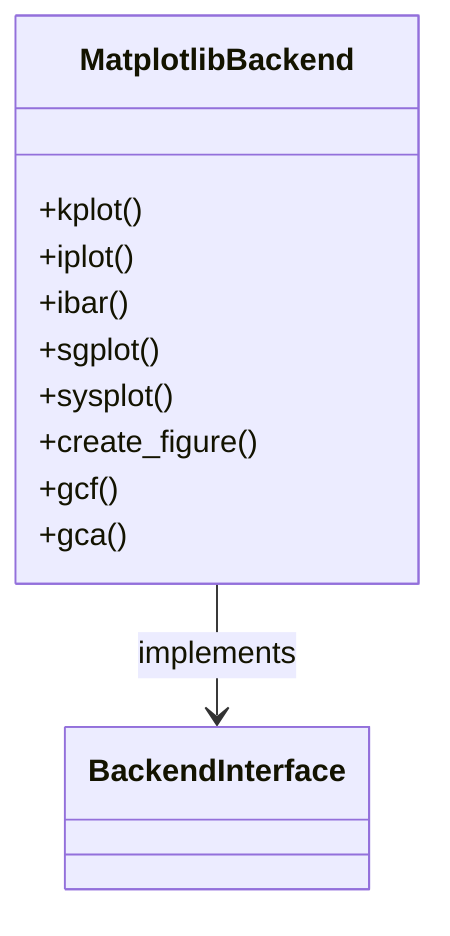

**Diagram sources**
- [drawplot/matplotlib_draw.py](file://hikyuu/draw/drawplot/matplotlib_draw.py#L1-L1551)
- [drawplot/__init__.py](file://hikyuu/draw/drawplot/__init__.py#L1-L310)

### Bokeh Backend

The bokeh backend provides interactive web-based visualizations with rich interactivity features. Implemented in the `bokeh_draw.py` module, this backend is particularly useful for creating interactive dashboards and web applications.

Key features of the bokeh backend include:
- **Interactive charts**: Supports hover tooltips, zooming, panning, and other interactive features.
- **Web integration**: Generates HTML output that can be embedded in web pages.
- **Real-time updates**: Capable of updating charts in real-time for live data monitoring.
- **Notebook integration**: Works well in Jupyter notebooks with interactive widgets.

The bokeh backend can be activated using the `use_draw_engine('bokeh')` function. It provides similar plotting functions to the matplotlib backend but with enhanced interactivity. For example, when plotting K-line data, the bokeh backend includes hover tooltips that display detailed information about each candlestick.

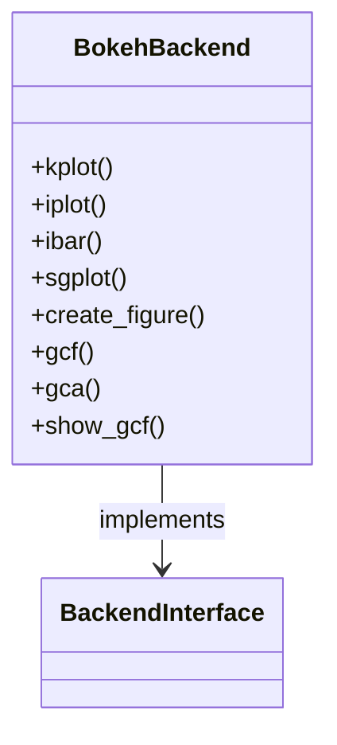

**Diagram sources**
- [drawplot/bokeh_draw.py](file://hikyuu/draw/drawplot/bokeh_draw.py#L1-L584)
- [drawplot/__init__.py](file://hikyuu/draw/drawplot/__init__.py#L1-L310)

### Echarts Backend

The echarts backend leverages the powerful ECharts JavaScript library to create highly interactive and visually appealing charts. Implemented in the `echarts_draw.py` module, this backend is ideal for creating modern, web-based financial dashboards.

Key features of the echarts backend include:
- **Advanced interactivity**: Rich interactive features including data zooming, brushing, and dynamic data updates.
- **Modern visual design**: Attractive, modern chart designs with smooth animations.
- **Responsive layouts**: Charts automatically adapt to different screen sizes and resolutions.
- **Comprehensive financial chart support**: Specialized support for financial charts including K-line plots with volume overlays.

The echarts backend can be activated using the `use_draw_engine('echarts')` function. It provides functions for creating complex financial visualizations that combine multiple data series and analytical components. The backend generates HTML output that can be easily embedded in web applications.

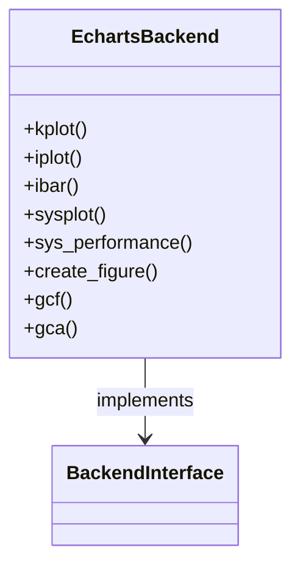

**Diagram sources**
- [drawplot/echarts_draw.py](file://hikyuu/draw/drawplot/echarts_draw.py#L1-L599)
- [drawplot/__init__.py](file://hikyuu/draw/drawplot/__init__.py#L1-L310)

### Backend Selection and Configuration

Users can switch between different visualization backends using the `use_draw_engine()` function. This function allows dynamic selection of the plotting backend at runtime, enabling users to choose the most appropriate engine for their specific use case.

The backend selection system is designed to provide a consistent interface across different backends. This means that the same plotting functions can be used regardless of the selected backend, making it easy to switch between different visualization options without changing the code.

```mermaid
flowchart TD
A[User Code] --> B{use_draw_engine()}
B --> C[Matplotlib]
B --> D[Bokeh]
B --> E[Echarts]
C --> F[Static Plots]
D --> G[Interactive Web Plots]
E --> H[Dynamic Web Dashboards]
```

**Diagram sources**
- [drawplot/__init__.py](file://hikyuu/draw/drawplot/__init__.py#L1-L310)

## Financial Chart Types

hikyuu supports various types of financial charts for analyzing market data and trading strategies. These chart types are designed to provide comprehensive insights into price movements, technical indicators, and trading signals.

### Candlestick Plots

Candlestick plots are fundamental for visualizing price movements in financial markets. hikyuu provides comprehensive support for creating candlestick charts through the `kplot()` function.

Key features of candlestick plots in hikyuu include:
- **Customizable colors**: Green for up candles and red for down candles by default, but customizable.
- **Volume overlay**: Option to display volume bars below the price chart.
- **Date formatting**: Automatic formatting of x-axis dates based on the time frame (daily, weekly, etc.).
- **Technical indicator overlay**: Ability to overlay technical indicators on the price chart.

The candlestick plot displays four key price points for each time period: open, high, low, and close. The body of the candle represents the range between the open and close prices, while the wicks (or shadows) represent the high and low prices.

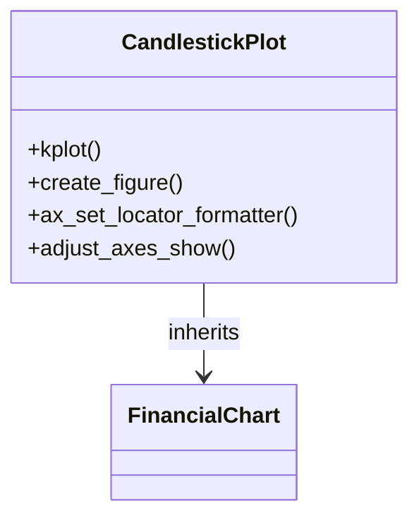

**Section sources**
- [drawplot/matplotlib_draw.py](file://hikyuu/draw/drawplot/matplotlib_draw.py#L1-L1551)
- [003-HowToGetKDataAndDraw.ipynb](file://hikyuu/examples/notebook/003-HowToGetKDataAndDraw.ipynb#L1-L315)

### Indicator Overlays

Indicator overlays allow technical indicators to be plotted on top of price charts or in separate subplots. hikyuu provides the `iplot()` and `ibar()` functions for creating indicator visualizations.

Supported indicator types include:
- **Line indicators**: Moving averages, MACD lines, etc.
- **Bar indicators**: Volume, MACD histogram, etc.
- **Area indicators**: Bollinger Bands, etc.

The indicator overlay system supports multiple indicators on the same chart, with automatic legend generation and color management. Users can customize the appearance of indicators including line styles, colors, and widths.

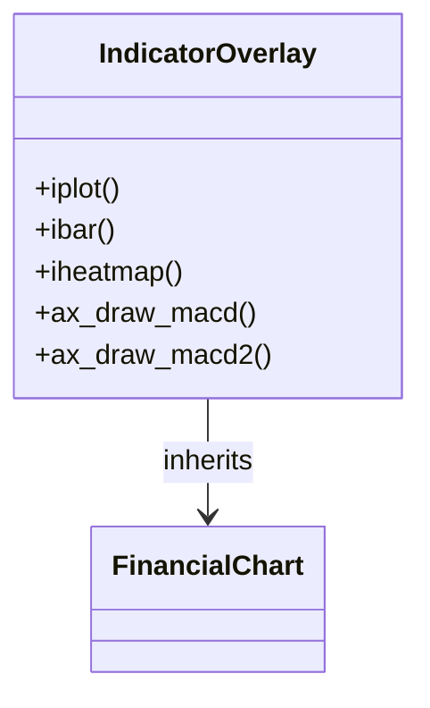

**Section sources**
- [drawplot/matplotlib_draw.py](file://hikyuu/draw/drawplot/matplotlib_draw.py#L1-L1551)

### Performance Curves

Performance curves visualize the performance of trading strategies over time. hikyuu provides specialized functions for creating equity curves, drawdown charts, and other performance metrics visualizations.

Key performance visualization features include:
- **Equity curves**: Plotting the cumulative performance of a trading strategy.
- **Drawdown charts**: Visualizing the peak-to-trough decline during a specific period.
- **Benchmark comparison**: Comparing strategy performance against benchmark indices.
- **Risk-adjusted metrics**: Displaying Sharpe ratio, maximum drawdown, and other risk metrics.

The performance curve system integrates with the backtesting framework to automatically generate comprehensive performance reports that combine multiple metrics in a single visualization.

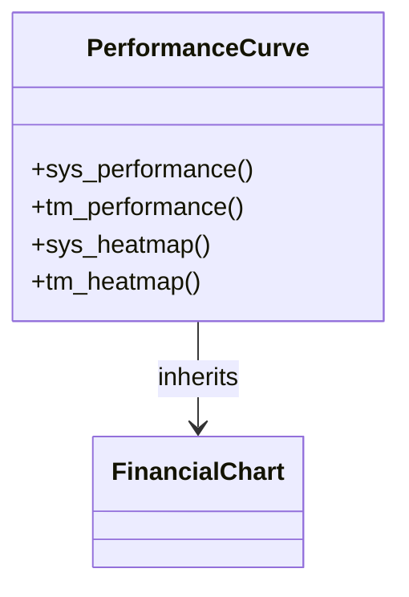

**Section sources**
- [drawplot/echarts_draw.py](file://hikyuu/draw/drawplot/echarts_draw.py#L1-L599)

## Analysis Tools Integration

hikyuu integrates visualization capabilities with analysis tools to support strategy debugging and result interpretation. This integration enables users to gain deeper insights into strategy behavior and performance.

### Strategy Debugging

The visualization system supports strategy debugging by providing tools to analyze trading signals, position changes, and performance metrics. Key debugging features include:

- **Signal plotting**: Visualizing buy/sell signals on price charts to understand entry and exit logic.
- **Position tracking**: Displaying position changes over time to analyze strategy behavior.
- **Trade history visualization**: Plotting individual trades to identify patterns and anomalies.

The `sgplot()` function is specifically designed for visualizing trading signals, allowing users to see exactly when and why trades were executed. This is particularly useful for debugging complex strategies with multiple entry and exit conditions.

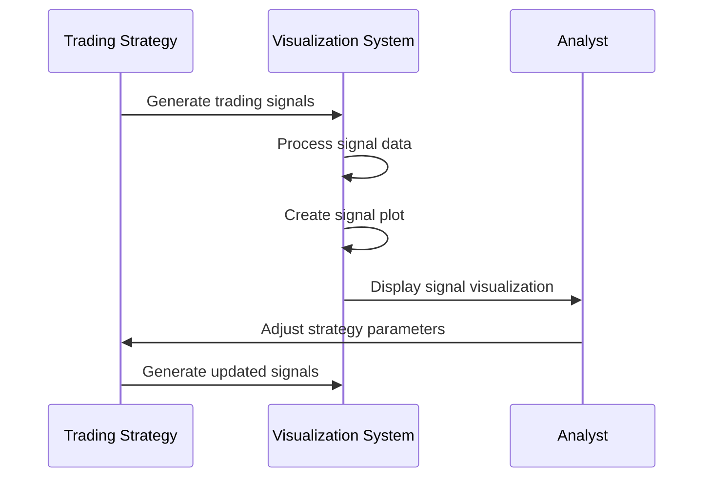

**Section sources**
- [drawplot/matplotlib_draw.py](file://hikyuu/draw/drawplot/matplotlib_draw.py#L1-L1551)

### Result Interpretation

The analysis tools provide comprehensive support for interpreting backtesting results through various visualizations. Key interpretation features include:

- **Performance attribution**: Breaking down performance by different factors or time periods.
- **Risk analysis**: Visualizing risk metrics such as volatility, drawdown, and value-at-risk.
- **Correlation analysis**: Displaying correlations between different assets or indicators.
- **Scenario analysis**: Visualizing performance under different market conditions.

The integration between visualization and analysis tools allows for interactive exploration of results, enabling users to drill down into specific aspects of performance and identify key drivers of returns.

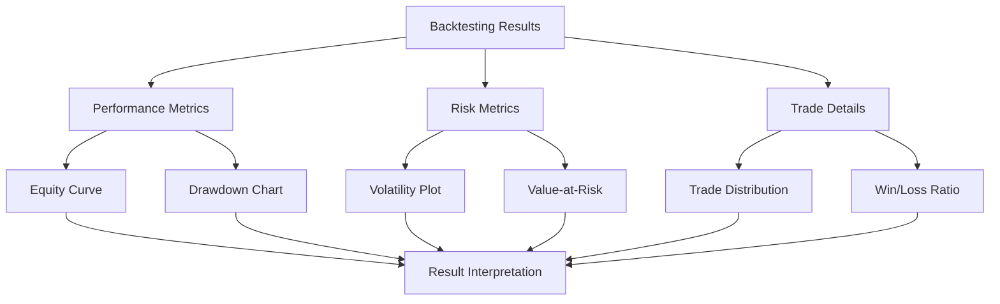

**Section sources**
- [analysis.py](file://hikyuu/analysis/analysis.py#L1-L152)

## Backtesting Results Visualization

hikyuu provides comprehensive visualization options for backtesting results, enabling users to evaluate strategy performance from multiple perspectives.

### Equity Curves

Equity curves are fundamental for visualizing the performance of trading strategies over time. hikyuu's equity curve visualizations show the cumulative growth of an investment account, allowing users to assess the overall profitability and consistency of a strategy.

Key features of equity curve visualizations include:
- **Benchmark comparison**: Overlaying benchmark indices to assess relative performance.
- **Logarithmic scaling**: Option to use logarithmic scale to better visualize long-term growth.
- **Performance metrics**: Displaying key metrics such as CAGR, Sharpe ratio, and maximum drawdown.
- **Interactive exploration**: Zooming and panning to examine specific time periods.

The equity curve visualization system integrates with the performance analysis framework to automatically calculate and display relevant metrics alongside the curve.

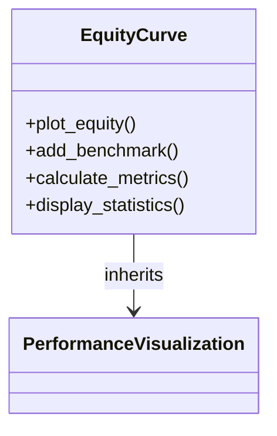

**Section sources**
- [drawplot/echarts_draw.py](file://hikyuu/draw/drawplot/echarts_draw.py#L1-L599)

### Drawdown Charts

Drawdown charts visualize the peak-to-trough decline in portfolio value, providing insights into the risk and volatility of a trading strategy. hikyuu's drawdown visualizations help users understand the potential losses and recovery periods associated with a strategy.

Key features of drawdown charts include:
- **Maximum drawdown**: Highlighting the largest peak-to-trough decline.
- **Drawdown duration**: Showing the length of time it takes to recover from drawdowns.
- **Recovery analysis**: Visualizing the path from peak to trough and back to new highs.
- **Stress testing**: Displaying drawdowns under different market conditions.

The drawdown visualization system calculates and displays key risk metrics, helping users assess the risk-adjusted performance of their strategies.

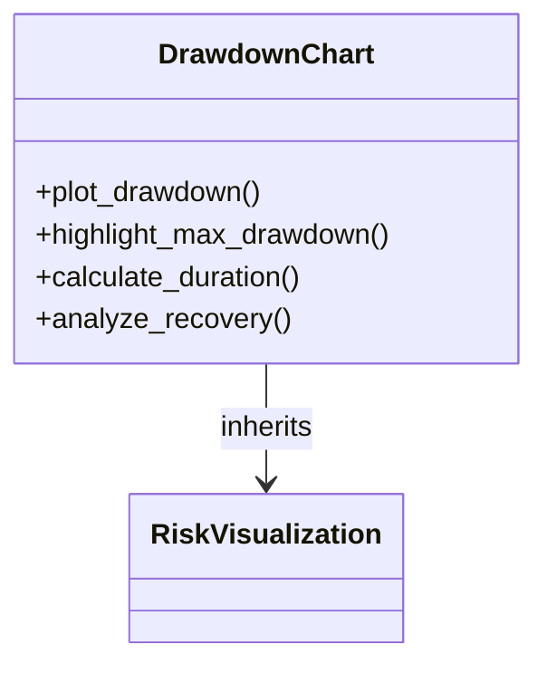

**Section sources**
- [drawplot/echarts_draw.py](file://hikyuu/draw/drawplot/echarts_draw.py#L1-L599)

### Trade Distribution Plots

Trade distribution plots visualize the characteristics of individual trades, providing insights into the win/loss ratio, trade size distribution, and other trade-level metrics. hikyuu's trade distribution visualizations help users understand the underlying mechanics of their strategies.

Key features of trade distribution plots include:
- **Win/loss ratio**: Showing the proportion of winning and losing trades.
- **Profit/loss distribution**: Histograms of trade profits and losses.
- **Trade duration**: Distribution of trade holding periods.
- **Risk/reward ratio**: Analysis of the relationship between potential gains and losses.

The trade distribution visualization system integrates with the trade management framework to extract detailed information about each trade and present it in an easily interpretable format.

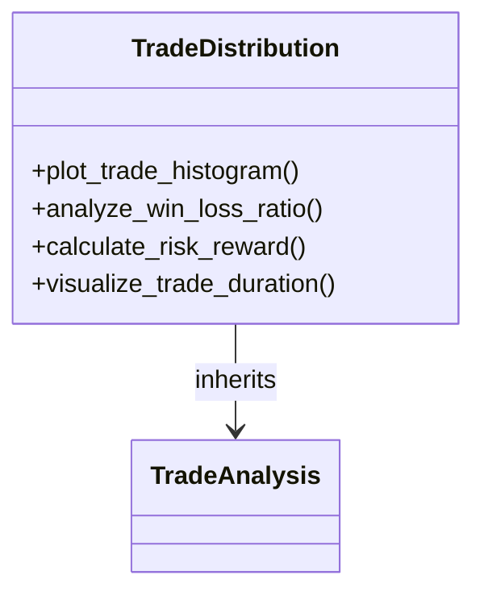

**Section sources**
- [drawplot/echarts_draw.py](file://hikyuu/draw/drawplot/echarts_draw.py#L1-L599)

## Public Interfaces

hikyuu provides a comprehensive set of public interfaces for visualization operations, designed to be intuitive and consistent across different chart types and backends.

### Core Visualization Functions

The core visualization functions provide the primary interface for creating financial charts. These functions are accessible through the draw module and support multiple backends.

Key functions include:
- **kplot()**: Creates candlestick plots for price data.
- **iplot()**: Plots technical indicators as line charts.
- **ibar()**: Plots technical indicators as bar charts.
- **sgplot()**: Visualizes trading signals on price charts.
- **sysplot()**: Plots system performance and trading activity.

These functions accept various parameters to customize the appearance and behavior of the charts, including colors, line styles, and axis formatting.

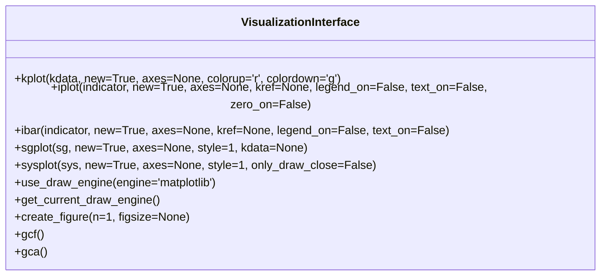

**Section sources**
- [drawplot/__init__.py](file://hikyuu/draw/drawplot/__init__.py#L1-L310)

### Backend Management

The backend management system allows users to select and configure the visualization backend. This system provides a consistent interface across different backends while allowing access to backend-specific features.

Key backend management functions include:
- **use_draw_engine()**: Sets the current visualization backend.
- **get_current_draw_engine()**: Returns the name of the current backend.
- **use_draw_with_matplotlib()**: Configures the system to use matplotlib.
- **use_draw_with_bokeh()**: Configures the system to use bokeh.
- **use_draw_with_echarts()**: Configures the system to use echarts.

The backend management system ensures that the same plotting functions work consistently across different backends, making it easy to switch between visualization options.

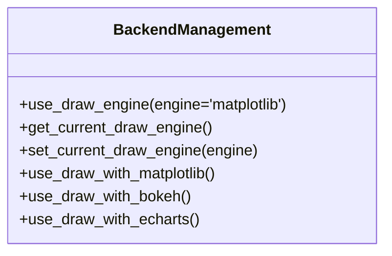

**Section sources**
- [drawplot/__init__.py](file://hikyuu/draw/drawplot/__init__.py#L1-L310)

### Figure and Axes Management

The figure and axes management system provides tools for creating and managing plotting areas. This system supports multiple subplots and complex chart layouts.

Key functions include:
- **create_figure()**: Creates a new figure with one or more subplots.
- **gcf()**: Returns the current figure.
- **gca()**: Returns the current axes.
- **show_gcf()**: Displays the current figure.
- **ax_set_locator_formatter()**: Configures date formatting for axes.
- **adjust_axes_show()**: Adjusts the display of multiple axes to prevent overlap.

These functions provide fine-grained control over the layout and appearance of charts, enabling the creation of complex visualizations with multiple data series and analytical components.

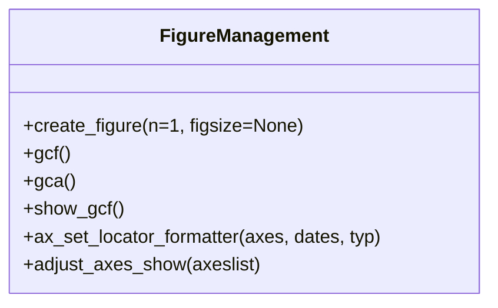

**Section sources**
- [drawplot/__init__.py](file://hikyuu/draw/drawplot/__init__.py#L1-L310)

## Conclusion

The visualization and analysis capabilities in hikyuu provide a comprehensive toolkit for financial data analysis, strategy development, and performance evaluation. The system supports multiple plotting backends including matplotlib, bokeh, and echarts, allowing users to choose the most appropriate tool for their needs. The library offers extensive support for creating various types of financial charts such as candlestick plots, indicator overlays, and performance curves. The integration with analysis tools enables effective strategy debugging and result interpretation. The different visualization options for backtesting results, including equity curves, drawdown charts, and trade distribution plots, provide comprehensive insights into strategy performance. The public interfaces for visualization operations are designed to be intuitive and consistent, with extensive customization options for experienced developers. Overall, the visualization system in hikyuu is a powerful tool for financial analysis and strategy development.