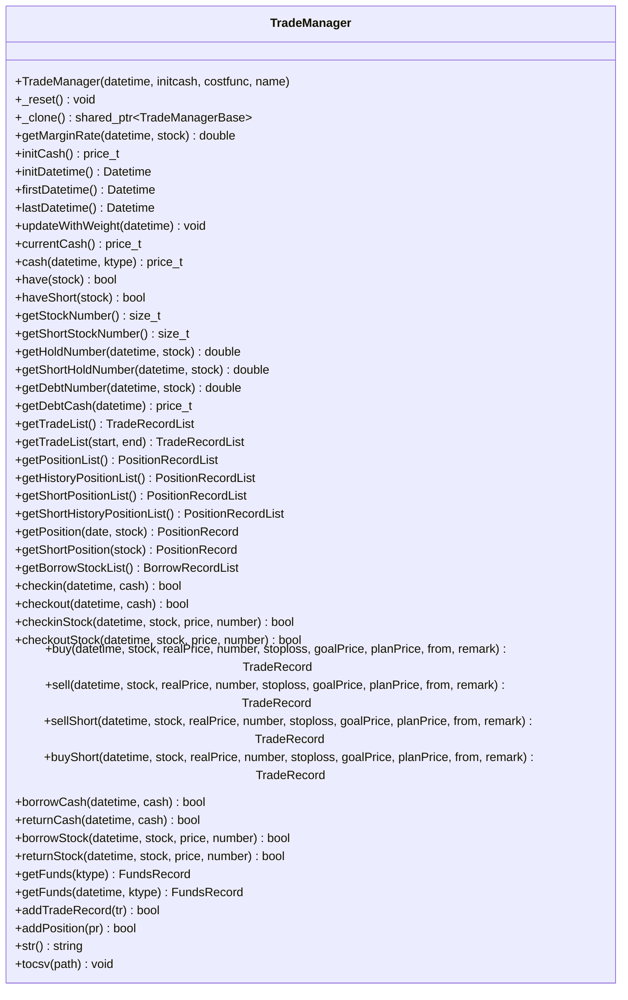
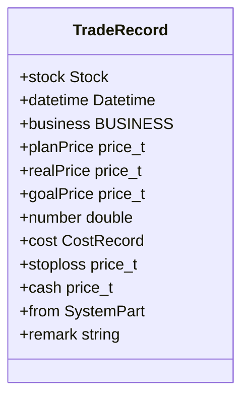
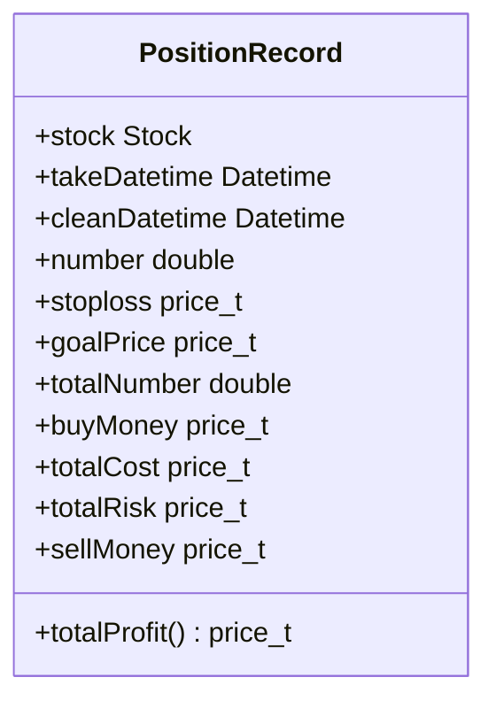
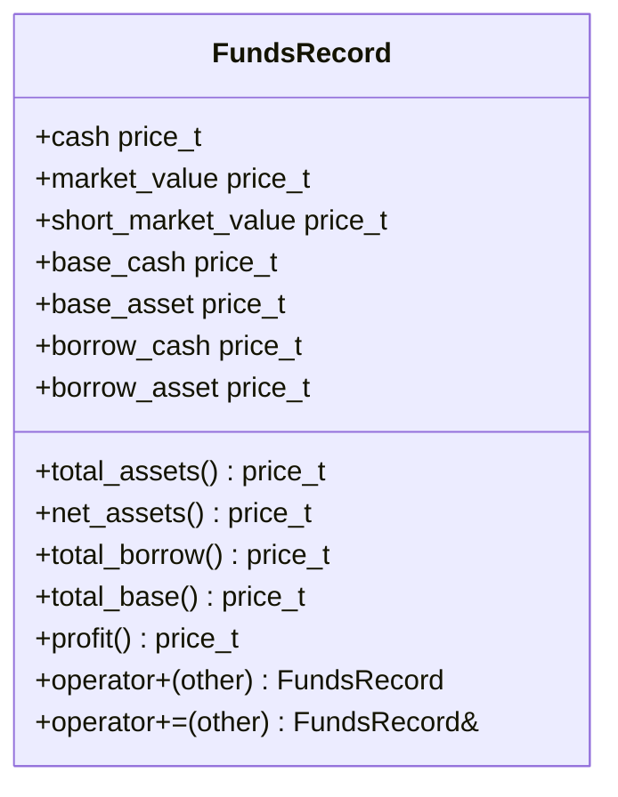
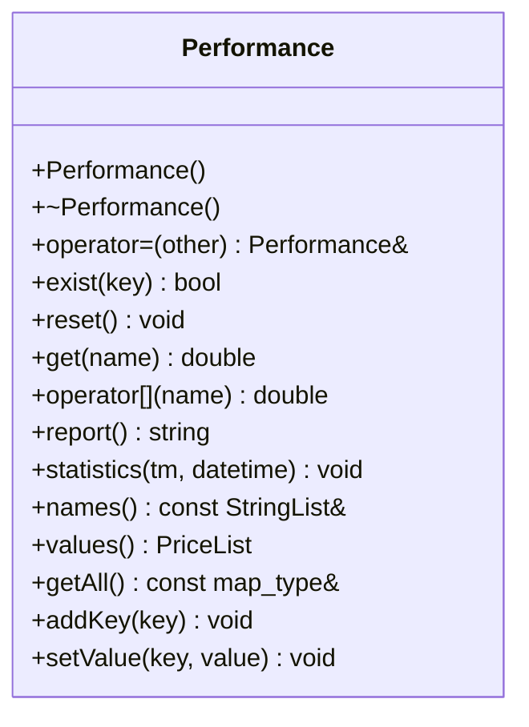
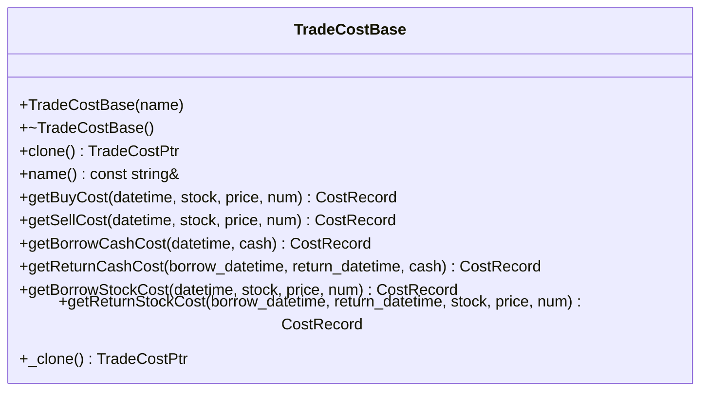
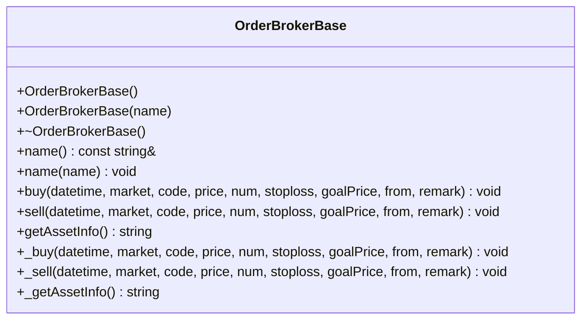
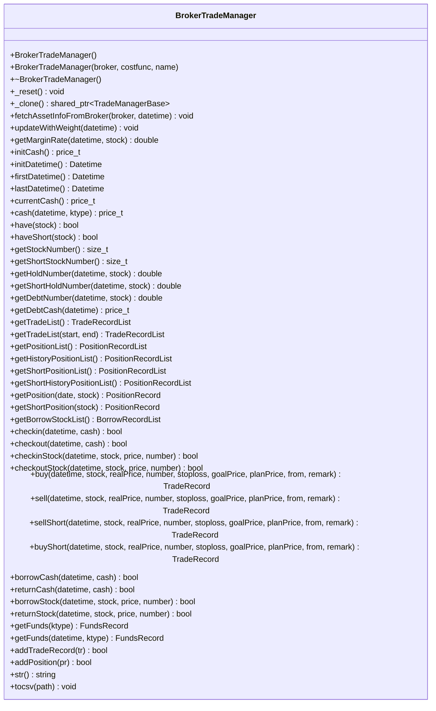

# 交易管理API

<cite>
**本文档引用的文件**
- [TradeManager.h](file://hikyuu_cpp/hikyuu/trade_manage/TradeManager.h)
- [TradeRecord.h](file://hikyuu_cpp/hikyuu/trade_manage/TradeRecord.h)
- [PositionRecord.h](file://hikyuu_cpp/hikyuu/trade_manage/PositionRecord.h)
- [FundsRecord.h](file://hikyuu_cpp/hikyuu/trade_manage/FundsRecord.h)
- [Performance.h](file://hikyuu_cpp/hikyuu/trade_manage/Performance.h)
- [TradeCostBase.h](file://hikyuu_cpp/hikyuu/trade_manage/TradeCostBase.h)
- [BrokerTradeManager.h](file://hikyuu_cpp/hikyuu/strategy/BrokerTradeManager.h)
- [OrderBrokerBase.h](file://hikyuu_cpp/hikyuu/trade_manage/OrderBrokerBase.h)
- [Performance.cpp](file://hikyuu_cpp/hikyuu/trade_manage/Performance.cpp)
</cite>

## 目录
1. [简介](#简介)
2. [核心组件](#核心组件)
3. [交易管理器（TradeManager）](#交易管理器trademanager)
4. [交易记录类（TradeRecord）](#交易记录类traderecord)
5. [持仓记录类（PositionRecord）](#持仓记录类positionrecord)
6. [资金记录类（FundsRecord）](#资金记录类fundsrecord)
7. [绩效评估（Performance）](#绩效评估performance)
8. [交易成本配置（TradeCost）](#交易成本配置tradecost)
9. [实盘交易与订单代理](#实盘交易与订单代理)
10. [回测与实盘模式切换](#回测与实盘模式切换)

## 简介
本API文档详细介绍了Hikyuu量化交易框架中的交易管理模块。该模块提供了完整的交易模拟、实盘对接、绩效评估和风险管理功能。核心组件包括交易管理器（TradeManager）、交易记录（TradeRecord）、持仓记录（PositionRecord）、资金记录（FundsRecord）和绩效评估（Performance）等类，支持从回测到实盘的完整交易流程。

## 核心组件
交易管理API的核心组件包括：
- **TradeManager**: 回测模拟账户交易管理模块，管理账户的交易记录及资金使用情况。
- **BrokerTradeManager**: 实盘交易管理模块，通过订单代理与实盘账户同步资产信息。
- **TradeRecord**: 交易记录类，存储每笔交易的详细信息。
- **PositionRecord**: 持仓记录类，管理当前和历史持仓信息。
- **FundsRecord**: 资金记录类，表示账户在特定时刻的资产详情。
- **Performance**: 绩效统计类，计算和评估交易系统的各项绩效指标。
- **TradeCost**: 交易成本算法基类，用于计算买入和卖出的成本。

**Section sources**
- [TradeManager.h](file://hikyuu_cpp/hikyuu/trade_manage/TradeManager.h)
- [BrokerTradeManager.h](file://hikyuu_cpp/hikyuu/strategy/BrokerTradeManager.h)

## 交易管理器（TradeManager）
TradeManager是回测模拟账户的核心管理类，负责管理账户的交易记录和资金使用情况。

### 公共方法


**Diagram sources**
- [TradeManager.h](file://hikyuu_cpp/hikyuu/trade_manage/TradeManager.h)

**Section sources**
- [TradeManager.h](file://hikyuu_cpp/hikyuu/trade_manage/TradeManager.h)

## 交易记录类（TradeRecord）
TradeRecord类用于存储每笔交易的详细信息，包括交易对象、时间、价格、数量和成本等。

### 公共属性


**Diagram sources**
- [TradeRecord.h](file://hikyuu_cpp/hikyuu/trade_manage/TradeRecord.h)

**Section sources**
- [TradeRecord.h](file://hikyuu_cpp/hikyuu/trade_manage/TradeRecord.h)

## 持仓记录类（PositionRecord）
PositionRecord类用于管理证券的持仓信息，包括建仓时间、持仓数量、止损价和累计成本等。

### 公共属性


**Diagram sources**
- [PositionRecord.h](file://hikyuu_cpp/hikyuu/trade_manage/PositionRecord.h)

**Section sources**
- [PositionRecord.h](file://hikyuu_cpp/hikyuu/trade_manage/PositionRecord.h)

## 资金记录类（FundsRecord）
FundsRecord类表示账户在特定时刻的资产详情，包括现金、市值、负债和净资产等。

### 公共属性和方法


**Diagram sources**
- [FundsRecord.h](file://hikyuu_cpp/hikyuu/trade_manage/FundsRecord.h)

**Section sources**
- [FundsRecord.h](file://hikyuu_cpp/hikyuu/trade_manage/FundsRecord.h)

## 绩效评估（Performance）
Performance类用于计算和评估交易系统的各项绩效指标。

### 公共方法


### 绩效指标
Performance类计算的绩效指标包括：

| 指标名称 | 说明 |
|---------|------|
| 帐户初始金额 | 账户初始资金 |
| 累计投入本金 | 累计存入的本金 |
| 累计投入资产 | 累计存入的资产价值 |
| 累计借入现金 | 当前借入的资金（负债） |
| 累计借入资产 | 当前借入的证券资产价值 |
| 累计红利 | 累计获得的分红 |
| 现金余额 | 当前现金余额 |
| 未平仓头寸净值 | 当前多头市值 |
| 当前总资产 | 现金 + 多头市值 + 借入资产 - 空头市值 |
| 已平仓交易总成本 | 已平仓交易的总成本 |
| 已平仓净利润总额 | 已平仓交易的净利润 |
| 单笔交易最大占用现金比例% | 单笔交易最大占用现金比例 |
| 交易平均占用现金比例% | 交易平均占用现金比例 |
| 未平仓帐户收益率% | 未平仓头寸的收益率 |
| 已平仓帐户收益率% | 已平仓交易的收益率 |
| 帐户年复合收益率% | 账户的年复合收益率 |
| 帐户平均年收益率% | 账户的平均年收益率 |
| 赢利交易赢利总额 | 赢利交易的总盈利 |
| 亏损交易亏损总额 | 亏损交易的总亏损 |
| 已平仓交易总数 | 已平仓的交易总数 |
| 赢利交易数 | 赢利交易的数量 |
| 亏损交易数 | 亏损交易的数量 |
| 赢利交易比例% | 赢利交易占总交易的比例 |
| 赢利期望值 | 每笔交易的期望盈利 |
| 赢利交易平均赢利 | 赢利交易的平均盈利 |
| 亏损交易平均亏损 | 亏损交易的平均亏损 |
| 平均赢利/平均亏损比例 | 平均赢利与平均亏损的比例 |
| 净赢利/亏损比例 | 净赢利与亏损的比例 |
| 最大单笔赢利 | 最大单笔交易的盈利 |
| 最大单笔盈利百分比% | 最大单笔盈利占投入资金的比例 |
| 最大单笔亏损 | 最大单笔交易的亏损 |
| 最大单笔亏损百分比% | 最大单笔亏损占投入资金的比例 |
| 赢利交易平均持仓时间 | 赢利交易的平均持仓时间 |
| 赢利交易最大持仓时间 | 赢利交易的最大持仓时间 |
| 亏损交易平均持仓时间 | 亏损交易的平均持仓时间 |
| 亏损交易最大持仓时间 | 亏损交易的最大持仓时间 |
| 空仓总时间 | 空仓的总时间 |
| 空仓时间/总时间% | 空仓时间占总时间的比例 |
| 平均空仓时间 | 平均空仓时间 |
| 最长空仓时间 | 最长的空仓时间 |
| 最大连续赢利笔数 | 最大连续赢利的交易笔数 |
| 最大连续亏损笔数 | 最大连续亏损的交易笔数 |
| 最大连续赢利金额 | 最大连续赢利的总金额 |
| 最大连续亏损金额 | 最大连续亏损的总金额 |
| R乘数期望值 | R乘数的期望值 |
| 交易机会频率/年 | 每年的交易机会频率 |
| 年度期望R乘数 | 年度期望的R乘数 |
| 赢利交易平均R乘数 | 赢利交易的平均R乘数 |
| 亏损交易平均R乘数 | 亏损交易的平均R乘数 |
| 最大单笔赢利R乘数 | 最大单笔赢利的R乘数 |
| 最大单笔亏损R乘数 | 最大单笔亏损的R乘数 |
| 最大连续赢利R乘数 | 最大连续赢利的R乘数之和 |
| 最大连续亏损R乘数 | 最大连续亏损的R乘数之和 |

**Diagram sources**
- [Performance.h](file://hikyuu_cpp/hikyuu/trade_manage/Performance.h)

**Section sources**
- [Performance.h](file://hikyuu_cpp/hikyuu/trade_manage/Performance.h)
- [Performance.cpp](file://hikyuu_cpp/hikyuu/trade_manage/Performance.cpp)

## 交易成本配置（TradeCost）
TradeCostBase是交易成本算法的基类，用于计算买入和卖出的成本。

### 公共方法


### 代码示例：配置交易成本
```python
# 创建零成本算法实例
cost_func = TC_Zero()

# 创建交易管理器并指定成本函数
my_tm = crtTM(init_cash=100000, cost_func=cost_func, name="MyTradeManager")
```

**Diagram sources**
- [TradeCostBase.h](file://hikyuu_cpp/hikyuu/trade_manage/TradeCostBase.h)

**Section sources**
- [TradeCostBase.h](file://hikyuu_cpp/hikyuu/trade_manage/TradeCostBase.h)

## 实盘交易与订单代理
通过BrokerTradeManager和OrderBrokerBase实现实盘交易功能。

### 订单代理基类（OrderBrokerBase）


### 实盘交易管理器（BrokerTradeManager）


### 代码示例：获取持仓信息和交易历史
```python
# 获取当前全部持仓记录
positions = my_tm.getPositionList()

# 获取全部交易记录
trades = my_tm.getTradeList()

# 获取指定日期范围内的交易记录
start_date = Datetime("2023-01-01")
end_date = Datetime("2023-12-31")
trades_in_period = my_tm.getTradeList(start_date, end_date)

# 获取当前资金详情
funds = my_tm.getFunds()
print(f"当前现金: {funds.cash}")
print(f"当前市值: {funds.market_value}")
print(f"当前总资产: {funds.total_assets()}")
```

**Diagram sources**
- [BrokerTradeManager.h](file://hikyuu_cpp/hikyuu/strategy/BrokerTradeManager.h)
- [OrderBrokerBase.h](file://hikyuu_cpp/hikyuu/trade_manage/OrderBrokerBase.h)

**Section sources**
- [BrokerTradeManager.h](file://hikyuu_cpp/hikyuu/strategy/BrokerTradeManager.h)
- [OrderBrokerBase.h](file://hikyuu_cpp/hikyuu/trade_manage/OrderBrokerBase.h)

## 回测与实盘模式切换
系统通过不同的交易管理器实现回测与实盘模式的切换。

### 回测模式
在回测模式下，使用TradeManager进行模拟交易：

```python
# 创建回测交易管理器
my_tm = crtTM(init_cash=100000, cost_func=TC_Zero(), name="Backtest")

# 运行回测
sys = SYS_Simple(tm=my_tm, sg=my_sg, mm=my_mm)
sys.run(stock, Query(-150))

# 获取绩效评估
per = Performance()
per.statistics(my_tm)
print(per.report())
```

### 实盘模式
在实盘模式下，使用BrokerTradeManager与实盘账户同步：

```python
# 创建订单代理
my_broker = crtOB(your_broker_instance, name="MyBroker")

# 创建实盘交易管理器
my_tm = crtBrokerTM(my_broker, cost_func=TC_Zero(), name="RealTrade")

# 同步实盘资产信息
my_tm.fetchAssetInfoFromBroker(my_broker)

# 执行实盘交易
# 交易指令会通过订单代理发送到实盘账户
```

### 模式切换机制
回测与实盘模式的切换主要通过替换交易管理器实现：
1. **回测模式**：使用TradeManager，完全模拟交易过程，不与外部系统交互。
2. **实盘模式**：使用BrokerTradeManager，通过订单代理与实盘账户通信，同步资产信息并执行交易。

两种模式使用相同的接口，只需替换交易管理器实例即可实现模式切换，保证了策略代码的复用性。

**Section sources**
- [TradeManager.h](file://hikyuu_cpp/hikyuu/trade_manage/TradeManager.h)
- [BrokerTradeManager.h](file://hikyuu_cpp/hikyuu/strategy/BrokerTradeManager.h)