# 交易系统核心API

<cite>
**本文档引用的文件**
- [trade_sys.py](file://hikyuu/trade_sys/trade_sys.py)
- [SYS_Simple.h](file://hikyuu_cpp/hikyuu/trade_sys/system/crt/SYS_Simple.h)
- [SYS_WalkForward.h](file://hikyuu_cpp/hikyuu/trade_sys/system/crt/SYS_WalkForward.h)
- [System.h](file://hikyuu_cpp/hikyuu/trade_sys/system/System.h)
- [System.cpp](file://hikyuu_cpp/hikyuu/trade_sys/system/System.cpp)
- [WalkForwardSystem.h](file://hikyuu_cpp/hikyuu/trade_sys/system/imp/WalkForwardSystem.h)
- [WalkForwardSystem.cpp](file://hikyuu_cpp/hikyuu/trade_sys/system/imp/WalkForwardSystem.cpp)
- [__init__.py](file://hikyuu/trade_sys/__init__.py)
</cite>

## 目录
1. [简介](#简介)
2. [交易系统核心组件](#交易系统核心组件)
3. [系统创建函数](#系统创建函数)
4. [系统组件详解](#系统组件详解)
5. [系统生命周期管理](#系统生命周期管理)
6. [多系统并行执行机制](#多系统并行执行机制)
7. [代码示例](#代码示例)

## 简介

交易系统核心API是Hikyuu量化框架的核心部分，提供了构建和管理交易策略的完整解决方案。该API允许用户通过组合不同的组件来创建复杂的交易系统，包括市场环境判断、信号生成、止损止盈、资金管理等。本文档详细介绍了交易系统核心API的使用方法，重点说明了`SYS_Simple`和`SYS_WalkForward`等交易系统创建函数，以及各组件的参数配置和使用场景。

**Section sources**
- [trade_sys.py](file://hikyuu/trade_sys/trade_sys.py#L1-L300)
- [System.h](file://hikyuu_cpp/hikyuu/trade_sys/system/System.h#L1-L200)

## 交易系统核心组件

交易系统由多个核心组件构成，每个组件负责特定的功能。这些组件通过组合和配置，形成完整的交易策略。核心组件包括：

- **市场环境(Environment)**：判断市场是否适合交易
- **系统条件(Condition)**：系统运行的前提条件
- **信号指示器(Signal)**：生成买入/卖出信号
- **止损策略(Stoploss)**：控制亏损的策略
- **止盈策略(TakeProfit)**：锁定利润的策略
- **盈利目标(ProfitGoal)**：设定盈利目标
- **资金管理(MoneyManager)**：管理资金分配
- **移滑价差(Slippage)**：处理交易中的滑点问题

这些组件通过`System`类进行组织和管理，形成一个完整的交易系统。

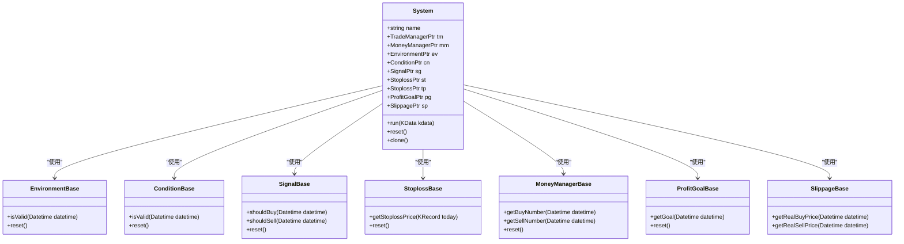

**Diagram sources**
- [System.h](file://hikyuu_cpp/hikyuu/trade_sys/system/System.h#L39-L200)
- [trade_sys.py](file://hikyuu/trade_sys/trade_sys.py#L4-L6)

**Section sources**
- [System.h](file://hikyuu_cpp/hikyuu/trade_sys/system/System.h#L1-L200)
- [trade_sys.py](file://hikyuu/trade_sys/trade_sys.py#L1-L300)

## 系统创建函数

### SYS_Simple

`SYS_Simple`是创建基础交易系统的函数，适用于简单的交易策略。它允许用户组合各种组件来构建交易系统。

```python
SYS_Simple(
    tm=TradeManagerPtr(), 
    mm=MoneyManagerPtr(), 
    ev=EnvironmentPtr(), 
    cn=ConditionPtr(), 
    sg=SignalPtr(), 
    st=StoplossPtr(), 
    tp=StoplossPtr(), 
    pg=ProfitGoalPtr(), 
    sp=SlippagePtr()
)
```

**参数说明：**
- `tm`：交易管理器，管理交易账户
- `mm`：资金管理器，管理资金分配
- `ev`：市场环境判断器，判断市场是否适合交易
- `cn`：系统条件判断器，系统运行的前提条件
- `sg`：信号指示器，生成买入/卖出信号
- `st`：止损策略，控制亏损
- `tp`：止盈策略，锁定利润
- `pg`：盈利目标策略，设定盈利目标
- `sp`：移滑价差算法，处理交易滑点

**系统参数：**
- `max_delay_count` [int | 3]：最大连续延迟交易请求的限制次数
- `delay_use_plan_number` [bool | true]：延迟操作时使用上一时刻计算的数量
- `support_borrow_cash` [bool | false]：现金不足时是否支持借入现金
- `support_borrow_stock` [bool | false]：无持仓时是否支持借入证券
- `ev_delay` [bool | true]：系统环境失效时是否延迟执行
- `cn_delay` [bool | true]：系统条件失效时是否延迟执行
- `sg_delay` [bool | true]：发出信号时是否延迟执行
- `sl_delay` [bool | true]：发出止损指令时是否延迟执行
- `tp_delay` [bool | true]：发出止盈指令时是否延迟执行
- `pg_delay` [bool | true]：发出盈利目标达成信号时是否延迟执行
- `tp_monotonic` [bool | true]：止盈是否单调递增
- `tp_delay_n` [int | 3]：止盈延迟判定生效时间
- `ignore_sell_sg` [bool | false]：是否忽略卖出信号

**使用场景：** 适用于基础的交易策略，如简单的均线交叉策略、RSI超买超卖策略等。

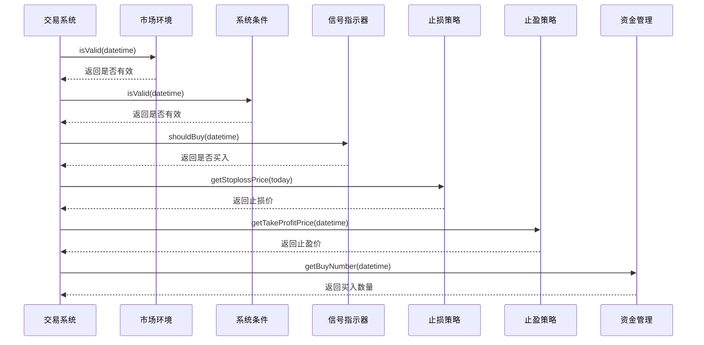

**Diagram sources**
- [SYS_Simple.h](file://hikyuu_cpp/hikyuu/trade_sys/system/crt/SYS_Simple.h#L41-L46)
- [System.h](file://hikyuu_cpp/hikyuu/trade_sys/system/System.h#L66-L69)

**Section sources**
- [SYS_Simple.h](file://hikyuu_cpp/hikyuu/trade_sys/system/crt/SYS_Simple.h#L1-L51)

### SYS_WalkForward

`SYS_WalkForward`是创建滚动优化交易系统的函数，适用于需要动态优化的复杂策略。它通过在历史数据上滚动评估不同候选系统的绩效，选择最优系统进行交易。

```python
SYS_WalkForward(
    candidate_sys_list, 
    tm=TradeManagerPtr(), 
    train_len=100, 
    test_len=20, 
    se=SE_PerformanceOptimal(), 
    train_tm=TradeManagerPtr()
)
```

**参数说明：**
- `candidate_sys_list`：候选系统列表，包含多个待评估的交易系统
- `tm`：主交易管理器，用于实际交易
- `train_len`：训练长度，用于评估系统绩效的数据长度
- `test_len`：测试长度，使用最优系统执行的数据长度
- `se`：选择器，用于选择最优系统，默认为按绩效最优选择
- `train_tm`：训练交易管理器，用于滚动评估时的交易账户

**使用场景：** 适用于需要动态优化的复杂策略，如参数优化、模型选择等。通过滚动评估，可以避免过拟合，提高策略的稳健性。

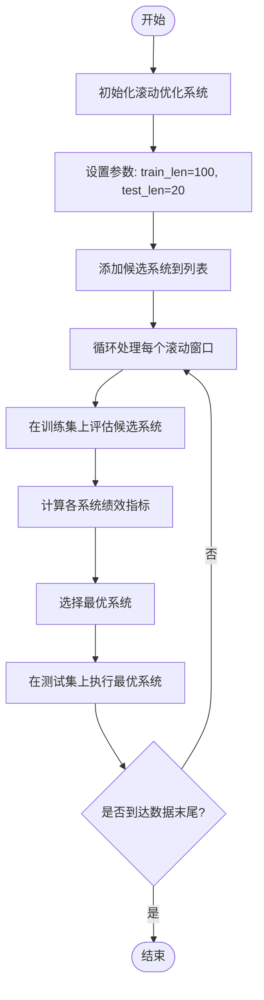

**Diagram sources**
- [SYS_WalkForward.h](file://hikyuu_cpp/hikyuu/trade_sys/system/crt/SYS_WalkForward.h#L15-L19)
- [WalkForwardSystem.h](file://hikyuu_cpp/hikyuu/trade_sys/system/imp/WalkForwardSystem.h#L19-L21)

**Section sources**
- [SYS_WalkForward.h](file://hikyuu_cpp/hikyuu/trade_sys/system/crt/SYS_WalkForward.h#L1-L21)
- [WalkForwardSystem.h](file://hikyuu_cpp/hikyuu/trade_sys/system/imp/WalkForwardSystem.h#L1-L69)

## 系统组件详解

### 市场环境(Environment)

市场环境组件用于判断当前市场是否适合交易。它通过分析市场指标来决定系统是否应该激活。

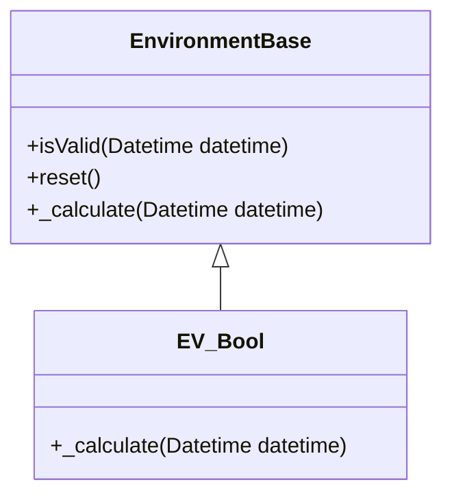

**Diagram sources**
- [System.h](file://hikyuu_cpp/hikyuu/trade_sys/system/System.h#L16-L21)

### 信号指示器(Signal)

信号指示器组件用于生成买入和卖出信号。它基于技术指标或其他分析方法来决定交易时机。

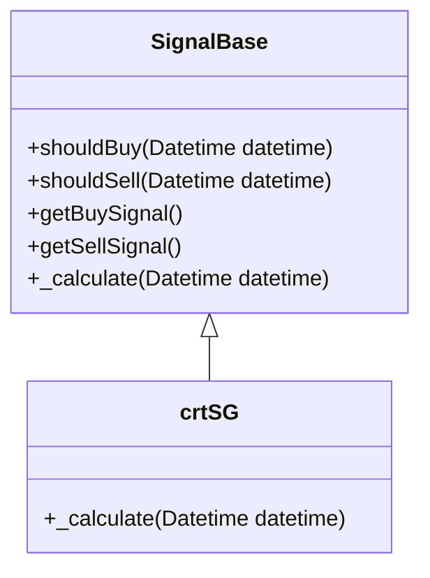

**Diagram sources**
- [trade_sys.py](file://hikyuu/trade_sys/trade_sys.py#L146-L157)

### 资金管理(MoneyManager)

资金管理组件用于决定每次交易的数量。它基于风险控制和资金分配策略来计算买入和卖出数量。

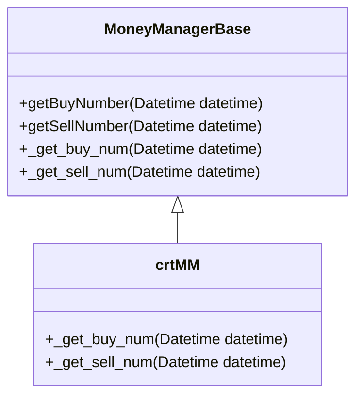

**Diagram sources**
- [trade_sys.py](file://hikyuu/trade_sys/trade_sys.py#L90-L112)

### 止损/止盈(Stoploss/TakeProfit)

止损和止盈组件用于控制风险和锁定利润。它们基于价格走势和预设规则来决定退出时机。

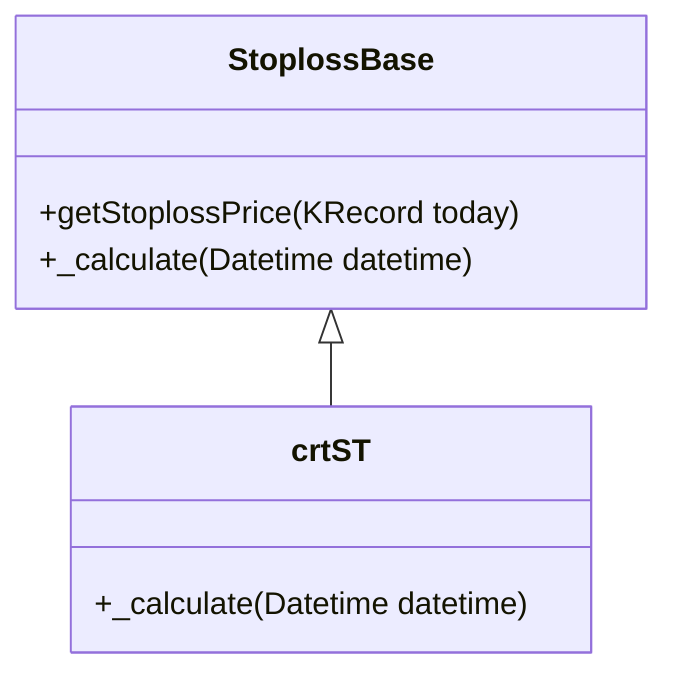

**Diagram sources**
- [trade_sys.py](file://hikyuu/trade_sys/trade_sys.py#L248-L261)

### 盈利目标(ProfitGoal)

盈利目标组件用于设定交易的盈利目标。当达到预设目标时，系统会考虑退出交易。

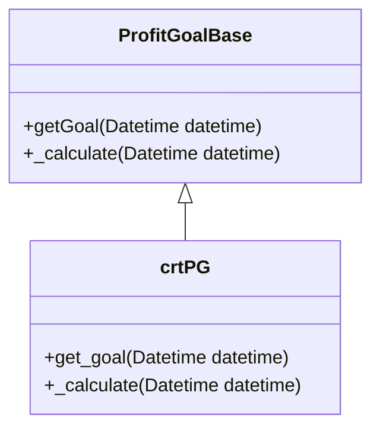

**Diagram sources**
- [trade_sys.py](file://hikyuu/trade_sys/trade_sys.py#L118-L140)

### 移滑价差(Slippage)

移滑价差组件用于处理交易中的滑点问题。它基于市场流动性和交易量来调整实际成交价格。

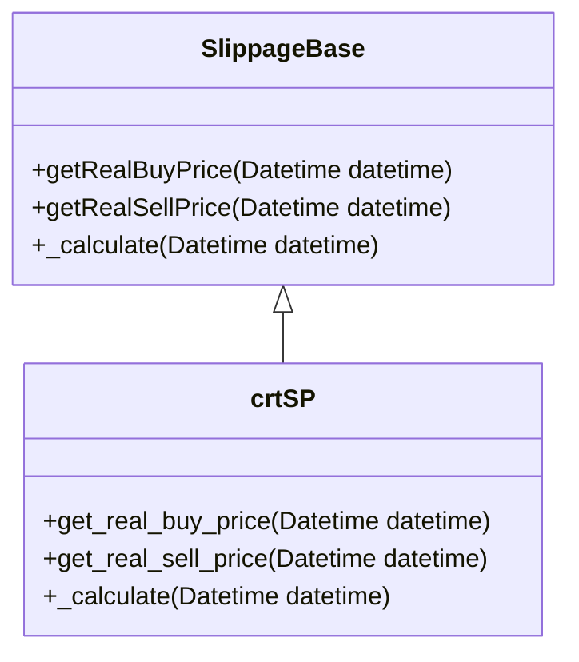

**Diagram sources**
- [trade_sys.py](file://hikyuu/trade_sys/trade_sys.py#L224-L242)

**Section sources**
- [trade_sys.py](file://hikyuu/trade_sys/trade_sys.py#L48-L280)

## 系统生命周期管理

交易系统的生命周期管理包括初始化、运行、复位和克隆等操作。这些操作确保系统能够正确地执行交易策略，并在需要时进行状态管理。

### 系统初始化

系统初始化通过构造函数完成，可以指定各个组件和系统参数。

```python
# 创建简单交易系统
system = SYS_Simple(
    tm=trade_manager,
    mm=money_manager,
    ev=environment,
    cn=condition,
    sg=signal,
    st=stoploss,
    tp=takeprofit,
    pg=profit_goal,
    sp=slippage
)
```

### 系统运行

系统运行通过`run`方法执行，可以指定交易对象和查询条件。

```python
# 运行交易系统
system.run(kdata, reset=True, resetAll=False)
```

### 系统复位

系统复位用于重置系统状态，准备下一次运行。

```python
# 复位系统
system.reset()

# 强制复位所有组件
system.forceResetAll()
```

### 系统克隆

系统克隆用于创建系统的副本，包括所有组件的副本。

```python
# 克隆系统
cloned_system = system.clone()
```

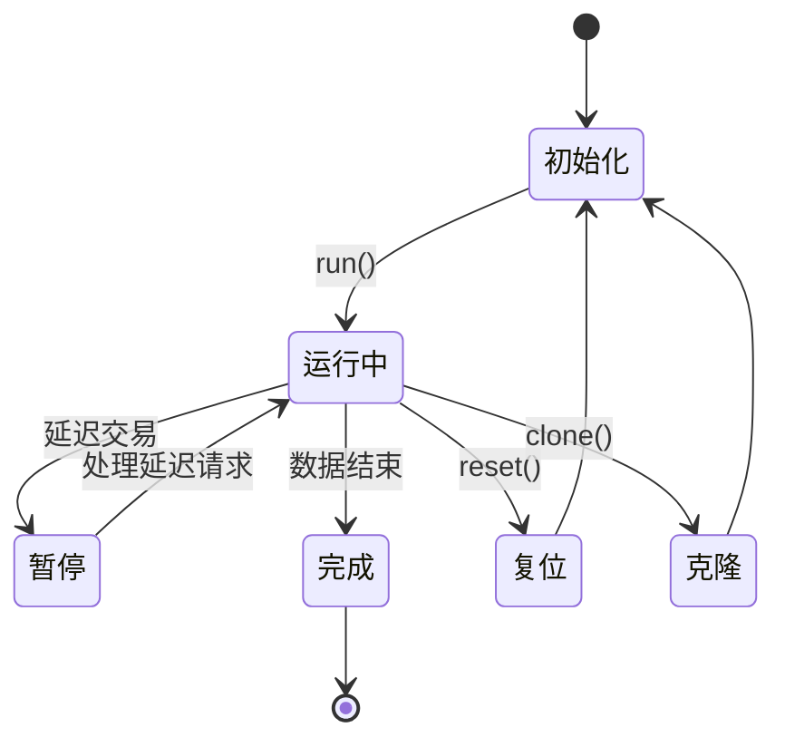

**Diagram sources**
- [System.h](file://hikyuu_cpp/hikyuu/trade_sys/system/System.h#L168-L178)
- [System.cpp](file://hikyuu_cpp/hikyuu/trade_sys/system/System.cpp#L166-L185)

**Section sources**
- [System.h](file://hikyuu_cpp/hikyuu/trade_sys/system/System.h#L168-L178)
- [System.cpp](file://hikyuu_cpp/hikyuu/trade_sys/system/System.cpp#L166-L185)

## 多系统并行执行机制

`SYS_WalkForward`实现了多系统并行执行机制，通过滚动评估选择最优系统。该机制的核心是选择器(Selector)和候选系统列表。

### 滚动优化流程

1. 将历史数据划分为多个滚动窗口
2. 在每个窗口的训练集上评估所有候选系统
3. 选择绩效最优的系统
4. 在测试集上执行选中的系统
5. 移动到下一个滚动窗口，重复上述过程

### 选择器(Selector)

选择器负责在候选系统中选择最优系统。默认选择器`SE_PerformanceOptimal`根据绩效指标选择最优系统。

```python
# 创建性能最优选择器
selector = SE_PerformanceOptimal(key="年化收益率", mode=0)  # mode=0表示最大值，mode=1表示最小值
```

### 并行执行

系统支持并行执行，可以通过设置参数`parallel=True`来启用并行计算，提高评估效率。

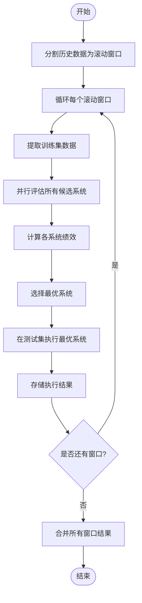

**Diagram sources**
- [WalkForwardSystem.cpp](file://hikyuu_cpp/hikyuu/trade_sys/system/imp/WalkForwardSystem.cpp#L157-L195)
- [PerformanceOptimalSelector.cpp](file://hikyuu_cpp/hikyuu/trade_sys/selector/imp/optimal/PerformanceOptimalSelector.cpp#L180-L214)

**Section sources**
- [WalkForwardSystem.cpp](file://hikyuu_cpp/hikyuu/trade_sys/system/imp/WalkForwardSystem.cpp#L40-L69)
- [PerformanceOptimalSelector.cpp](file://hikyuu_cpp/hikyuu/trade_sys/selector/imp/optimal/PerformanceOptimalSelector.cpp#L180-L214)

## 代码示例

以下是一个完整的交易系统构建和运行示例：

```python
from hikyuu import *
from hikyuu.trade_sys import *

# 创建交易管理器
tm = crtTM(init_cash=1000000, init_date=Datetime(20180101))

# 创建信号指示器（简单均线交叉）
ma10 = MA(CLOSE(), n=10)
ma20 = MA(CLOSE(), n=20)
sg = crtSG(lambda: CROSS(ma10, ma20), name="MA_CROSS")

# 创建止损策略（固定百分比止损）
st = crtST(lambda: 0.95 * CLOSE(), name="FIXED_STOPLOSS")

# 创建资金管理（固定比例）
mm = crtMM(lambda: 0.1 * tm.get_current_cash() / CLOSE(), name="FIXED_RATIO")

# 创建简单交易系统
system = SYS_Simple(tm=tm, sg=sg, st=st, mm=mm, name="Simple_MA_System")

# 获取股票数据
stock = sm['SH600000']
kquery = KQuery(-250)
kdata = stock.get_kdata(kquery)

# 运行交易系统
system.run(kdata)

# 获取交易记录
trade_list = system.getTradeRecordList()

# 打印系统绩效
per = Performance()
per.statistics(tm)
print(per)
```

对于滚动优化系统：

```python
# 创建多个候选系统
systems = []
for fast_n in [5, 10, 15]:
    for slow_n in [20, 30, 40]:
        if fast_n >= slow_n:
            continue
        ma_fast = MA(CLOSE(), n=fast_n)
        ma_slow = MA(CLOSE(), n=slow_n)
        sg = crtSG(lambda: CROSS(ma_fast, ma_slow), name=f"MA_{fast_n}_{slow_n}")
        st = crtST(lambda: 0.95 * CLOSE(), name="FIXED_STOPLOSS")
        mm = crtMM(lambda: 0.1 * tm.get_current_cash() / CLOSE(), name="FIXED_RATIO")
        sys = SYS_Simple(tm=tm.clone(), sg=sg, st=st, mm=mm, name=f"MA_{fast_n}_{slow_n}")
        systems.append(sys)

# 创建滚动优化系统
walk_forward_sys = SYS_WalkForward(
    candidate_sys_list=systems,
    tm=tm,
    train_len=100,
    test_len=20,
    se=SE_PerformanceOptimal(key="年化收益率", mode=0)
)

# 运行滚动优化系统
walk_forward_sys.run(kdata)

# 获取最终交易记录
final_trade_list = walk_forward_sys.getTradeRecordList()

# 分析滚动优化过程
run_ranges = walk_forward_sys.m_run_ranges
for i, range_info in enumerate(run_ranges):
    print(f"第{i+1}轮: 训练期{range_info.start}-{range_info.run_start}, 测试期{range_info.run_start}-{range_info.end}")
```

**Section sources**
- [trade_sys.py](file://hikyuu/trade_sys/trade_sys.py#L1-L300)
- [System.h](file://hikyuu_cpp/hikyuu/trade_sys/system/System.h#L206-L214)
- [WalkForwardSystem.cpp](file://hikyuu_cpp/hikyuu/trade_sys/system/imp/WalkForwardSystem.cpp#L157-L195)