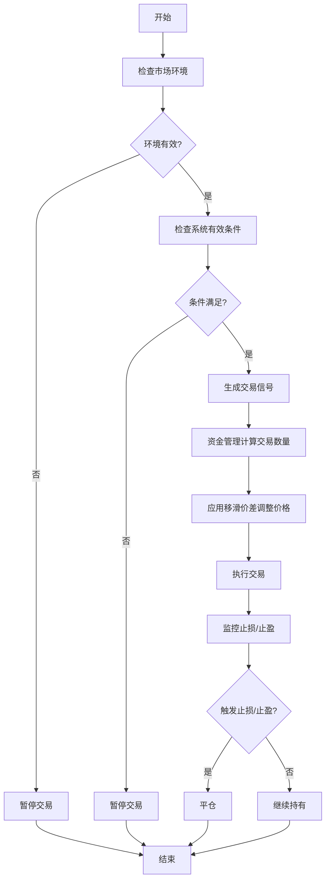
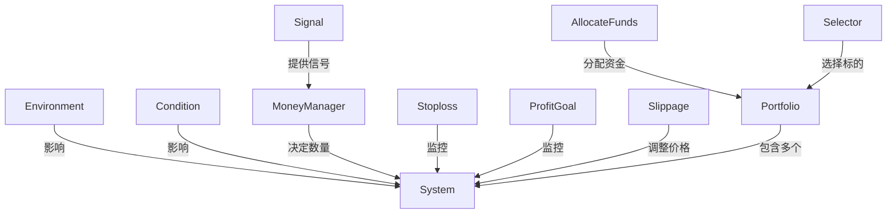

# 交易系统组件API

<cite>
**本文档引用的文件**  
- [__init__.py](file://hikyuu/trade_sys/__init__.py)
- [trade_sys.py](file://hikyuu/trade_sys/trade_sys.py)
- [System.cpp](file://hikyuu_cpp/hikyuu/trade_sys/system/System.cpp)
- [ConditionBase.cpp](file://hikyuu_cpp/hikyuu/trade_sys/condition/ConditionBase.cpp)
- [SignalBase.cpp](file://hikyuu_cpp/hikyuu/trade_sys/signal/SignalBase.cpp)
- [MoneyManagerBase.cpp](file://hikyuu_cpp/hikyuu/trade_sys/moneymanager/MoneyManagerBase.cpp)
- [StoplossBase.cpp](file://hikyuu_cpp/hikyuu/trade_sys/stoploss/StoplossBase.cpp)
- [ProfitGoalBase.cpp](file://hikyuu_cpp/hikyuu/trade_sys/profitgoal/ProfitGoalBase.cpp)
- [SlippageBase.cpp](file://hikyuu_cpp/hikyuu/trade_sys/slippage/SlippageBase.cpp)
- [SelectorBase.cpp](file://hikyuu_cpp/hikyuu/trade_sys/selector/SelectorBase.cpp)
- [EnvironmentBase.cpp](file://hikyuu_cpp/hikyuu/trade_sys/environment/EnvironmentBase.cpp)
- [AllocateFundsBase.cpp](file://hikyuu_cpp/hikyuu/trade_sys/allocatefunds/AllocateFundsBase.cpp)
- [MM_FixedCapital.h](file://hikyuu_cpp/hikyuu/trade_sys/moneymanager/crt/MM_FixedCapital.h)
- [CN_Bool.h](file://hikyuu_cpp/hikyuu/trade_sys/condition/crt/CN_Bool.h)
- [EV_Bool.h](file://hikyuu_cpp/hikyuu/trade_sys/environment/crt/EV_Bool.h)
- [AF_EqualWeight.h](file://hikyuu_cpp/hikyuu/trade_sys/allocatefunds/crt/AF_EqualWeight.h)
</cite>

## 目录
1. [简介](#简介)
2. [核心组件创建函数](#核心组件创建函数)
3. [交易系统构建](#交易系统构建)
4. [系统参数配置](#系统参数配置)
5. [执行流程与依赖关系](#执行流程与依赖关系)

## 简介
Hikyuu交易系统提供了一套完整的组件化架构，用于构建复杂的量化交易策略。系统由多个独立的组件构成，包括条件判断、信号生成、资金管理、止损止盈等。每个组件都可以通过特定的创建函数进行实例化，并通过参数配置来调整其行为。这些组件共同协作，形成一个完整的交易决策和执行系统。

**组件概述**
- **Condition (系统有效条件)**: 判断系统在特定时间是否有效的条件
- **Signal (信号指示器)**: 生成买入和卖出信号
- **MoneyManager (资金管理)**: 决定每次交易的数量
- **Stoploss (止损)**: 在亏损达到预设条件时平仓
- **ProfitGoal (盈利目标)**: 在盈利达到预设条件时平仓
- **Slippage (移滑价差)**: 处理实际成交价格与预期价格的偏差
- **AllocateFunds (资产分配)**: 在多个策略间分配资金
- **Selector (交易对象选择)**: 选择要交易的证券
- **Environment (市场环境)**: 判断整体市场环境

## 核心组件创建函数

### Condition (系统有效条件)
系统有效条件组件用于判断在特定时间点系统是否处于有效状态。

```python
def crtCN(func, params={}, name='crtCN'):
    """
    快速创建系统有效条件

    :param func: 系统有效条件函数
    :param {} params: 参数字典
    :param str name: 自定义名称
    :return: 自定义系统有效条件实例
    """
```

**参数说明**
- `func`: 条件判断函数，返回布尔值表示系统是否有效
- `params`: 参数字典，可包含自定义参数
- `name`: 组件名称

**使用场景**
当需要根据特定技术指标或市场条件来限制系统运行时间时使用，例如只有在均线多头排列时才允许交易。

**Section sources**
- [trade_sys.py](file://hikyuu/trade_sys/trade_sys.py#L51-L65)
- [ConditionBase.cpp](file://hikyuu_cpp/hikyuu/trade_sys/condition/ConditionBase.cpp#L27-L43)

### Signal (信号指示器)
信号指示器组件负责生成买入和卖出信号。

```python
def crtSG(func, params={}, name='crtSG'):
    """
    快速创建信号指示器

    :param func: 信号策略函数
    :param {} params: 参数字典
    :param str name: 自定义名称
    :return: 自定义信号指示器实例
    """
```

**参数说明**
- `func`: 信号生成函数，返回信号值
- `params`: 参数字典
- `name`: 组件名称

**使用场景**
用于实现各种技术分析策略，如均线交叉、MACD、RSI等信号生成策略。

**Section sources**
- [trade_sys.py](file://hikyuu/trade_sys/trade_sys.py#L146-L157)
- [SignalBase.cpp](file://hikyuu_cpp/hikyuu/trade_sys/signal/SignalBase.cpp#L27-L47)

### MoneyManager (资金管理)
资金管理组件决定每次交易的具体数量。

```python
def crtMM(get_buy_num, get_sell_num=None, params={}, name='crtMM', buy_notify=None, sell_notify=None):
    """
    快速创建资金管理策略

    :param get_buy_num: 买入数量接口
    :param get_sell_num: 卖出数量接口, 默认为 None(卖出全部)
    :param {} params: 参数字典
    :param str name: 自定义名称
    :param buy_notify: 接收买入交易记录通知
    :param sell_notify: 接收卖出交易记录通知
    :return: 自定义资金管理策略实例
    """
```

**参数说明**
- `get_buy_num`: 计算买入数量的函数
- `get_sell_num`: 计算卖出数量的函数
- `params`: 参数字典
- `name`: 组件名称
- `buy_notify`: 买入交易通知回调
- `sell_notify`: 卖出交易通知回调

**使用场景**
实现各种资金管理策略，如固定资金、固定比例、风险固定等资金管理方法。

**内置实现示例**
```cpp
/**
 * 固定资金管理策略
 * 公式: 买入数量 = 当前现金 / capital
 * @param capital
 * @return MoneyManagerPtr
 */
MoneyManagerPtr HKU_API MM_FixedCapital(double capital = 10000.00);
```

**Section sources**
- [trade_sys.py](file://hikyuu/trade_sys/trade_sys.py#L90-L112)
- [MoneyManagerBase.cpp](file://hikyuu_cpp/hikyuu/trade_sys/moneymanager/MoneyManagerBase.cpp#L27-L51)
- [MM_FixedCapital.h](file://hikyuu_cpp/hikyuu/trade_sys/moneymanager/crt/MM_FixedCapital.h#L16-L22)

### Stoploss (止损)
止损组件在亏损达到预设条件时触发平仓操作。

```python
def crtST(func, params={}, name='crtST'):
    """
    快速创建止损/止盈策略

    :param func: 止损/止盈策略函数
    :param {} params: 参数字典
    :param str name: 自定义名称
    :return: 止损/止盈策略实例
    """
```

**参数说明**
- `func`: 止损判断函数
- `params`: 参数字典
- `name`: 组件名称

**使用场景**
实现各种止损策略，如百分比止损、ATR止损、支撑阻力位止损等。

**Section sources**
- [trade_sys.py](file://hikyuu/trade_sys/trade_sys.py#L248-L261)
- [StoplossBase.cpp](file://hikyuu_cpp/hikyuu/trade_sys/stoploss/StoplossBase.cpp#L26-L39)

### ProfitGoal (盈利目标)
盈利目标组件在盈利达到预设条件时触发平仓操作。

```python
def crtPG(get_goal, calculate=None, params={}, name='crtPG', buy_notify=None, sell_notify=None):
    """
    快速创建盈利目标策略

    :param get_goal: 获取目标价格接口
    :param calculate: 内部计算接口（在指定交易标的时被调用）
    :param {} params: 参数字典
    :param str name: 自定义名称
    :param buy_notify: 接收买入交易记录通知
    :param sell_notify: 接收卖出交易记录通知
    :return: 盈利目标策略实例
    """
```

**参数说明**
- `get_goal`: 获取目标价格的函数
- `calculate`: 内部计算函数
- `params`: 参数字典
- `name`: 组件名称
- `buy_notify`: 买入通知回调
- `sell_notify`: 卖出通知回调

**使用场景**
实现各种止盈策略，如固定比例止盈、移动止盈、分批止盈等。

**Section sources**
- [trade_sys.py](file://hikyuu/trade_sys/trade_sys.py#L118-L140)
- [ProfitGoalBase.cpp](file://hikyuu_cpp/hikyuu/trade_sys/profitgoal/ProfitGoalBase.cpp#L26-L39)

### Slippage (移滑价差)
移滑价差组件处理实际成交价格与预期价格之间的偏差。

```python
def crtSP(get_real_buy_price, get_real_sell_price, params={}, name='crtSP', calculate=None):
    """
    快速创建移滑价差算法

    :param get_real_buy_price: 移滑价差算法接口计算实际买入价格
    :param get_real_sell_price: 移滑价差算法接口计算实际买入价格
    :param {} params: 参数字典
    :param str name: 自定义名称
    :param calculate: 预处理函数
    :return: 移滑价差算法实例
    """
```

**参数说明**
- `get_real_buy_price`: 计算实际买入价格的函数
- `get_real_sell_price`: 计算实际卖出价格的函数
- `params`: 参数字典
- `name`: 组件名称
- `calculate`: 预处理函数

**使用场景**
模拟实际交易中的滑点影响，提高回测的准确性。

**Section sources**
- [trade_sys.py](file://hikyuu/trade_sys/trade_sys.py#L224-L242)
- [SlippageBase.cpp](file://hikyuu_cpp/hikyuu/trade_sys/slippage/SlippageBase.cpp#L26-L39)

### AllocateFunds (资产分配)
资产分配组件负责在多个策略或资产之间分配资金。

```python
def crtAF(allocate_weight_func, params={}, name='crtAF'):
    """
    快速创建资产分配算法

    :param allocate_weight_func: 资产分配算法
    :param {} params: 参数字典
    :param str name: 自定义名称
    :return: 自定义资产分配算法实例
    """
```

**参数说明**
- `allocate_weight_func`: 资产分配算法函数
- `params`: 参数字典
- `name`: 组件名称

**使用场景**
在投资组合中实现等权重分配、风险平价分配等资产配置策略。

**内置实现示例**
```cpp
/**
 * @brief 等权重资产分配，对选中的资产进行等比例分配
 * @return AFPtr
 * @ingroup AllocateFunds
 */
AFPtr HKU_API AF_EqualWeight();
```

**Section sources**
- [trade_sys.py](file://hikyuu/trade_sys/trade_sys.py#L186-L199)
- [AllocateFundsBase.cpp](file://hikyuu_cpp/hikyuu/trade_sys/allocatefunds/AllocateFundsBase.cpp#L29-L70)
- [AF_EqualWeight.h](file://hikyuu_cpp/hikyuu/trade_sys/allocatefunds/crt/AF_EqualWeight.h#L16-L21)

### Selector (交易对象选择)
交易对象选择组件负责选择要交易的证券。

```python
def crtSE(calculate, get_selected, is_match_af=None, params={}, name='crtSE'):
    """
    快速创建交易对象选择算法

    :param calculate function: 计算函数
    :param get_selected_on_close function: 收盘时刻选择算法
    :param get_selected_on_open function: 开盘时刻选择算法
    :param {} params: 参数字典
    :param str name: 自定义名称
    :return: 自定义交易对象选择算法实例
    """
```

**参数说明**
- `calculate`: 计算函数
- `get_selected`: 选择算法函数
- `is_match_af`: 资产分配匹配函数
- `params`: 参数字典
- `name`: 组件名称

**使用场景**
实现选股策略，如基于财务指标、技术指标或机器学习模型的选股。

**Section sources**
- [trade_sys.py](file://hikyuu/trade_sys/trade_sys.py#L163-L180)
- [SelectorBase.cpp](file://hikyuu_cpp/hikyuu/trade_sys/selector/SelectorBase.cpp#L33-L52)

### Environment (市场环境)
市场环境组件判断整体市场环境是否适合交易。

```python
def crtEV(func, params={}, name='crtEV'):
    """
    快速创建市场环境判断策略

    :param func: 市场环境判断策略函数
    :param {} params: 参数字典
    :param str name: 自定义名称
    :return: 自定义市场环境判断策略实例
    """
```

**参数说明**
- `func`: 市场环境判断函数
- `params`: 参数字典
- `name`: 组件名称

**使用场景**
判断市场趋势、波动率等宏观环境因素，决定是否启动交易系统。

**内置实现示例**
```cpp
/**
 * 布尔信号指标市场环境
 * @param ind bool类型的指标，指标中相应位置>0则代表市场有效，否则无效
 * @param market 指定的市场，用于获取相应的交易日历
 * @return
 */
EVPtr HKU_API EV_Bool(const Indicator& ind, const string& market = "SH");
```

**Section sources**
- [trade_sys.py](file://hikyuu/trade_sys/trade_sys.py#L71-L84)
- [EnvironmentBase.cpp](file://hikyuu_cpp/hikyuu/trade_sys/environment/EnvironmentBase.cpp#L27-L43)
- [EV_Bool.h](file://hikyuu_cpp/hikyuu/trade_sys/environment/crt/EV_Bool.h#L16-L21)

## 交易系统构建

### 完整交易系统组合
通过组合各个组件可以构建一个完整的交易系统。

```python
# 创建各个组件
ev = crtEV(environment_func)  # 市场环境
cn = crtCN(condition_func)    # 系统有效条件
sg = crtSG(signal_func)       # 信号指示器
mm = crtMM(buy_func, sell_func)  # 资金管理
st = crtST(stoploss_func)     # 止损
pg = crtPG(profit_goal_func)  # 盈利目标
sp = crtSP(slippage_func)     # 移滑价差
af = crtAF(allocate_func)     # 资产分配
se = crtSE(selector_func)     # 交易对象选择

# 构建交易系统
system = System(ev, cn, sg, mm, st, pg, sp)
```

**组件依赖关系**
- 市场环境(Environment)和系统有效条件(Condition)作为系统运行的前提
- 信号指示器(Signal)生成交易信号
- 资金管理(MoneyManager)根据信号决定交易数量
- 止损(Stoploss)和盈利目标(ProfitGoal)监控持仓状态
- 移滑价差(Slippage)调整实际成交价格
- 资产分配(AllocateFunds)和交易对象选择(Selector)用于多资产组合管理

**Section sources**
- [trade_sys.py](file://hikyuu/trade_sys/trade_sys.py#L36-L45)
- [System.cpp](file://hikyuu_cpp/hikyuu/trade_sys/system/System.cpp#L44-L90)

## 系统参数配置

### 核心系统参数
交易系统支持多种参数配置，以调整其行为。

```python
# 系统参数配置
system.setParam("trace", False)                    # 是否跟踪执行过程
system.setParam("max_delay_count", 3)             # 最大延迟交易请求次数
system.setParam("buy_delay", True)                # 是否延迟到下一个bar开盘时买入
system.setParam("sell_delay", True)               # 是否延迟到下一个bar开盘时卖出
system.setParam("delay_use_current_price", True)  # 延迟操作时是否使用当前价格
system.setParam("tp_monotonic", True)             # 止赢单调递增
system.setParam("tp_delay_n", 1)                  # 止赢延迟判断天数
system.setParam("ignore_sell_sg", False)          # 是否忽略卖出信号
```

**参数说明**
- `trace`: 启用详细跟踪信息
- `max_delay_count`: 允许的最大延迟交易次数
- `buy_delay/sell_delay`: 交易是否延迟到下一个交易时段
- `delay_use_current_price`: 延迟交易时使用的价格基准
- `tp_monotonic`: 止盈价格是否单调递增
- `tp_delay_n`: 止盈判断的延迟天数
- `ignore_sell_sg`: 是否忽略信号指示器的卖出信号

**Section sources**
- [System.cpp](file://hikyuu_cpp/hikyuu/trade_sys/system/System.cpp#L94-L136)

### 组件共享策略
系统支持组件共享策略，控制组件在克隆和重置时的行为。

```python
# 组件共享策略
system.setParam("shared_tm", False)    # 交易管理器是否共享
system.setParam("shared_ev", True)     # 市场环境是否共享
system.setParam("shared_cn", False)    # 系统有效条件是否共享
system.setParam("shared_sg", False)    # 信号指示器是否共享
system.setParam("shared_mm", False)    # 资金管理是否共享
system.setParam("shared_st", False)    # 止损是否共享
system.setParam("shared_tp", False)    # 止赢是否共享
system.setParam("shared_pg", False)    # 盈利目标是否共享
system.setParam("shared_sp", False)    # 移滑价差是否共享
```

**使用场景**
在构建投资组合时，可以共享某些组件以减少计算开销，同时保持其他组件的独立性。

**Section sources**
- [System.cpp](file://hikyuu_cpp/hikyuu/trade_sys/system/System.cpp#L125-L135)

## 执行流程与依赖关系

### 组件执行顺序
交易系统的各个组件按照特定的顺序执行。



**Diagram sources**
- [System.cpp](file://hikyuu_cpp/hikyuu/trade_sys/system/System.cpp#L44-L90)
- [trade_sys.py](file://hikyuu/trade_sys/trade_sys.py#L36-L45)

### 组件间依赖关系
各个组件之间存在明确的依赖关系。



**Diagram sources**
- [System.cpp](file://hikyuu_cpp/hikyuu/trade_sys/system/System.cpp#L44-L90)
- [SelectorBase.cpp](file://hikyuu_cpp/hikyuu/trade_sys/selector/SelectorBase.cpp#L33-L52)
- [AllocateFundsBase.cpp](file://hikyuu_cpp/hikyuu/trade_sys/allocatefunds/AllocateFundsBase.cpp#L29-L70)

**Section sources**
- [System.cpp](file://hikyuu_cpp/hikyuu/trade_sys/system/System.cpp#L44-L90)
- [trade_sys.py](file://hikyuu/trade_sys/trade_sys.py#L36-L45)