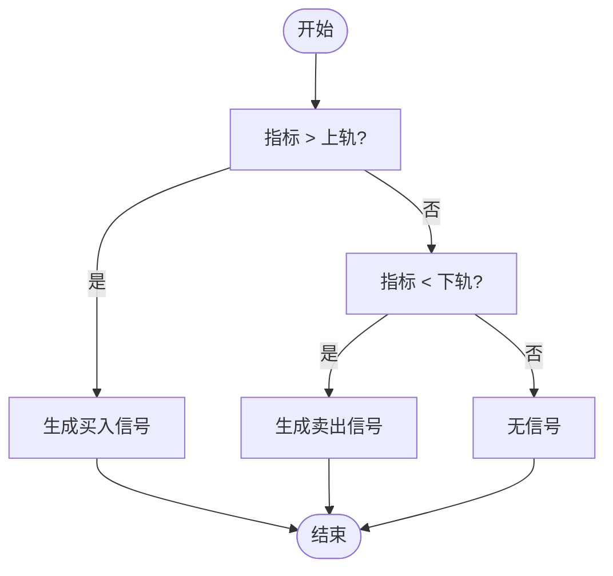
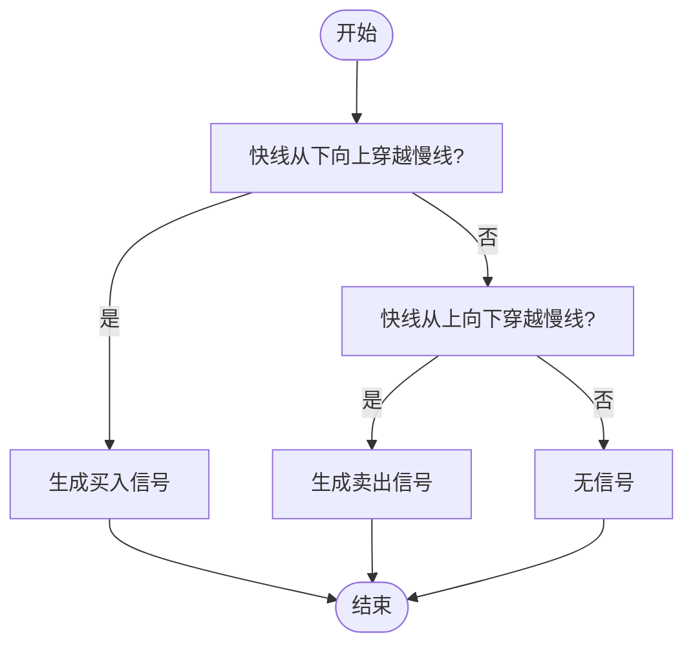
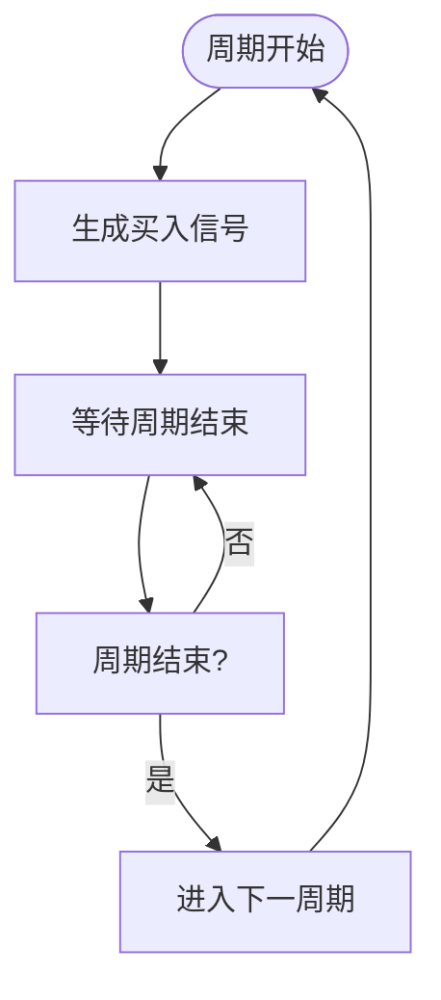
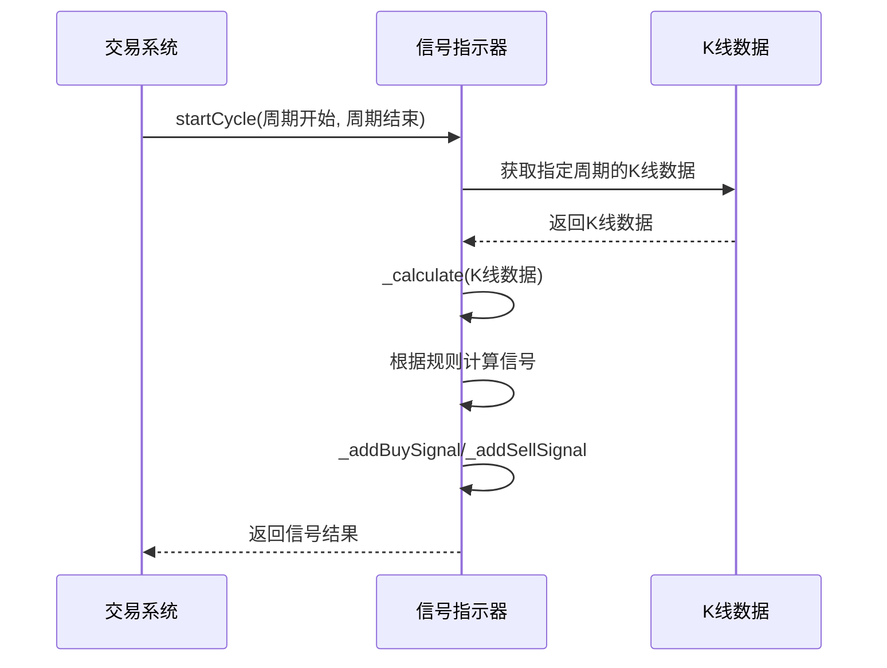

# 信号指示器组件API

<cite>
**本文档中引用的文件**  
- [SG_AllwaysBuy.h](file://hikyuu_cpp/hikyuu/trade_sys/signal/crt/SG_AllwaysBuy.h)
- [SG_Band.h](file://hikyuu_cpp/hikyuu/trade_sys/signal/crt/SG_Band.h)
- [SG_Cross.h](file://hikyuu_cpp/hikyuu/trade_sys/signal/crt/SG_Cross.h)
- [SG_CrossGold.h](file://hikyuu_cpp/hikyuu/trade_sys/signal/crt/SG_CrossGold.h)
- [SG_Cycle.h](file://hikyuu_cpp/hikyuu/trade_sys/signal/crt/SG_Cycle.h)
- [SG_Flex.h](file://hikyuu_cpp/hikyuu/trade_sys/signal/crt/SG_Flex.h)
- [SG_Logic.h](file://hikyuu_cpp/hikyuu/trade_sys/signal/crt/SG_Logic.h)
- [SG_Manual.h](file://hikyuu_cpp/hikyuu/trade_sys/signal/crt/SG_Manual.h)
- [SG_OneSide.h](file://hikyuu_cpp/hikyuu/trade_sys/signal/crt/SG_OneSide.h)
- [SG_Single.h](file://hikyuu_cpp/hikyuu/trade_sys/signal/crt/SG_Single.h)
- [SignalBase.cpp](file://hikyuu_cpp/hikyuu/trade_sys/signal/SignalBase.cpp)
</cite>

## 目录
1. [简介](#简介)
2. [核心信号组件](#核心信号组件)
3. [详细组件分析](#详细组件分析)
   - [SG_AllwaysBuy](#sg_allwaysbuy)
   - [SG_Band](#sg_band)
   - [SG_Cross](#sg_cross)
   - [SG_CrossGold](#sg_crossgold)
   - [SG_Cycle](#sg_cycle)
   - [SG_Flex](#sg_flex)
   - [SG_Logic](#sg_logic)
   - [SG_Manual](#sg_manual)
   - [SG_OneSide](#sg_oneside)
   - [SG_Single](#sg_single)
4. [信号组合与逻辑运算](#信号组合与逻辑运算)
5. [信号触发机制与执行流程](#信号触发机制与执行流程)
6. [信号延迟处理与过滤机制](#信号延迟处理与过滤机制)
7. [常见问题排查](#常见问题排查)
8. [结论](#结论)

## 简介
信号指示器组件（Signal）是Hikyuu量化交易系统中的核心模块之一，负责生成买入和卖出信号。本API参考文档系统性地介绍了所有信号创建函数，包括SG_AllwaysBuy、SG_Band、SG_Cross、SG_CrossGold、SG_Cycle、SG_Flex、SG_Logic、SG_Manual、SG_OneSide和SG_Single等。文档详细说明了每个构造函数的参数，如交叉阈值、带状区间、周期参数、逻辑运算符等，并解释了各组件的使用场景。此外，还提供了如何将信号组件与止损、资金管理等组件组合的代码示例，以及信号触发机制和在交易系统中的执行流程。

**Section sources**
- [SG_AllwaysBuy.h](file://hikyuu_cpp/hikyuu/trade_sys/signal/crt/SG_AllwaysBuy.h)
- [SG_Band.h](file://hikyuu_cpp/hikyuu/trade_sys/signal/crt/SG_Band.h)
- [SG_Cross.h](file://hikyuu_cpp/hikyuu/trade_sys/signal/crt/SG_Cross.h)

## 核心信号组件
信号指示器组件是交易策略的核心，它们基于技术指标和市场数据生成买入和卖出信号。每个信号组件都有特定的构造函数和参数，用于定义信号生成的逻辑。这些组件可以单独使用，也可以通过逻辑运算符组合使用，以实现复杂的交易策略。

**Section sources**
- [SG_CrossGold.h](file://hikyuu_cpp/hikyuu/trade_sys/signal/crt/SG_CrossGold.h)
- [SG_Cycle.h](file://hikyuu_cpp/hikyuu/trade_sys/signal/crt/SG_Cycle.h)
- [SG_Flex.h](file://hikyuu_cpp/hikyuu/trade_sys/signal/crt/SG_Flex.h)

## 详细组件分析

### SG_AllwaysBuy
SG_AllwaysBuy是一个简单的信号指示器，它始终生成买入信号。这个组件通常用于测试或基准比较，不考虑任何市场条件或技术指标。

**Section sources**
- [SG_AllwaysBuy.h](file://hikyuu_cpp/hikyuu/trade_sys/signal/crt/SG_AllwaysBuy.h)

### SG_Band
SG_Band是指标区间指示器，当指标超过上轨时生成买入信号，当指标低于下轨时生成卖出信号。它适用于RSI类具有绝对值区间的指标。

**参数说明：**
- `ind`：输入指标
- `lower`：下轨值或下轨指标
- `upper`：上轨值或上轨指标

**使用场景：** 布林带策略、RSI超买超卖策略

**Diagram sources**
- [SG_Band.h](file://hikyuu_cpp/hikyuu/trade_sys/signal/crt/SG_Band.h)
- [BandSignal.cpp](file://hikyuu_cpp/hikyuu/trade_sys/signal/imp/BandSignal.cpp)

### SG_Cross
SG_Cross是双线交叉指示器，当快线从下向上穿越慢线时生成买入信号，当快线从上向下穿越慢线时生成卖出信号。

**参数说明：**
- `fast`：快线指标
- `slow`：慢线指标

**使用场景：** 均线交叉策略、MACD策略

**Diagram sources**
- [SG_Cross.h](file://hikyuu_cpp/hikyuu/trade_sys/signal/crt/SG_Cross.h)
- [CrossSignal.cpp](file://hikyuu_cpp/hikyuu/trade_sys/signal/imp/CrossSignal.cpp)

### SG_CrossGold
SG_CrossGold是金叉指示器，当快线从下向上穿越慢线且两条线方向都向上时生成买入信号（金叉），当快线从上向下穿越慢线且两条线方向都向下时生成卖出信号（死叉）。

**参数说明：**
- `fast`：快线指标
- `slow`：慢线指标

**使用场景：** 确认趋势的交叉策略

**Section sources**
- [SG_CrossGold.h](file://hikyuu_cpp/hikyuu/trade_sys/signal/crt/SG_CrossGold.h)

### SG_Cycle
SG_Cycle是以PF调仓周期为买入信号的指示器。它在每个周期开始时生成买入信号。

**参数说明：**
- 无参数

**使用场景：** 定期调仓策略、组合再平衡

**Diagram sources**
- [SG_Cycle.h](file://hikyuu_cpp/hikyuu/trade_sys/signal/crt/SG_Cycle.h)
- [CycleSignal.cpp](file://hikyuu_cpp/hikyuu/trade_sys/signal/imp/CycleSignal.cpp)

### SG_Flex
SG_Flex是自交叉单线拐点指示器。它使用自身的EMA(slow_n)作为慢线，自身作为快线，当快线向上穿越慢线时生成买入信号，当快线向下穿越慢线时生成卖出信号。

**参数说明：**
- `op`：输入指标
- `slow_n`：慢线EMA周期

**使用场景：** 单线趋势跟踪策略

**Section sources**
- [SG_Flex.h](file://hikyuu_cpp/hikyuu/trade_sys/signal/crt/SG_Flex.h)

### SG_Logic
SG_Logic提供了一系列逻辑运算符重载和辅助函数，用于组合多个信号指示器。它支持加、减、乘、除、与、或等运算。

**主要函数：**
- `SG_Add`：信号相加
- `SG_Sub`：信号相减
- `SG_And`：信号与运算
- `SG_Or`：信号或运算

**使用场景：** 复合策略、多条件过滤

**Section sources**
- [SG_Logic.h](file://hikyuu_cpp/hikyuu/trade_sys/signal/crt/SG_Logic.h)

### SG_Manual
SG_Manual是仅能手动添加信号的指示器，用于测试或其他特殊用途。它不自动生成任何信号，需要通过外部方式手动添加。

**参数说明：**
- 无参数

**使用场景：** 策略测试、特殊信号注入

**Section sources**
- [SG_Manual.h](file://hikyuu_cpp/hikyuu/trade_sys/signal/crt/SG_Manual.h)

### SG_OneSide
SG_OneSide根据输入指标构建单边信号（只包含买入或卖出信号）。如果指标值大于0，则加入指定类型的信号。

**参数说明：**
- `ind`：指示指标
- `is_buy`：加入的是买入信号还是卖出信号

**辅助函数：**
- `SG_Buy`：生成单边买入信号
- `SG_Sell`：生成单边卖出信号

**使用场景：** 单向交易策略、事件驱动策略

**Section sources**
- [SG_OneSide.h](file://hikyuu_cpp/hikyuu/trade_sys/signal/crt/SG_OneSide.h)

### SG_Single
SG_Single是单线拐点信号指示器，使用《精明交易者》中给出的曲线拐点算法判断曲线趋势。

**参数说明：**
- `ind`：输入指标
- `filter_n`：N日周期（默认20）
- `filter_p`：过滤器百分比（默认0.1）

**使用场景：** 趋势跟踪策略、波动率过滤策略

**Section sources**
- [SG_Single.h](file://hikyuu_cpp/hikyuu/trade_sys/signal/crt/SG_Single.h)

## 信号组合与逻辑运算
信号组件可以通过逻辑运算符进行组合，以实现更复杂的交易策略。SG_Logic提供了多种组合方式：

- **加法运算 (`+`)**: 组合两个信号，交替执行
- **减法运算 (`-`)**: 从一个信号中减去另一个信号
- **与运算 (`&`)**: 两个信号同时满足条件时触发
- **或运算 (`|`)**: 任一信号满足条件时触发

**注意事项：** 由于SG的`alternate`参数默认为True，在使用如"sg1 + sg2 + sg3"的形式时，容易忽略sg1 + sg2的alternate属性。建议使用SG_Add(sg1, sg2, False) + sg3来避免alternate的问题。

**Section sources**
- [SG_Logic.h](file://hikyuu_cpp/hikyuu/trade_sys/signal/crt/SG_Logic.h)

## 信号触发机制与执行流程
信号指示器的执行流程如下：

1. 系统在每个交易周期开始时调用信号指示器的`_calculate`方法
2. `_calculate`方法根据K线数据和预设规则计算买入和卖出信号
3. 使用`_addBuySignal`和`_addSellSignal`方法添加信号
4. 交易系统根据生成的信号执行相应的买卖操作

信号可以通过`getBuySignal`和`getSellSignal`方法获取已生成的信号列表，通过`getBuyValue`和`getSellValue`方法获取特定时间点的信号值。

**Diagram sources**
- [SignalBase.cpp](file://hikyuu_cpp/hikyuu/trade_sys/signal/SignalBase.cpp)

## 信号延迟处理与过滤机制
为了提高信号质量，系统提供了多种延迟处理和过滤机制：

1. **周期过滤**：通过设置`cycle`参数，控制信号生成的频率
2. **交替执行**：通过`alternate`参数控制是否交替执行买入卖出操作
3. **数值过滤**：如SG_Single中的`filter_p`参数，用于过滤微小的价格波动
4. **时间过滤**：限制信号在特定时间段内有效

这些机制可以有效减少噪音信号，提高策略的稳定性和盈利能力。

**Section sources**
- [SignalBase.cpp](file://hikyuu_cpp/hikyuu/trade_sys/signal/SignalBase.cpp)

## 常见问题排查
在使用信号指示器组件时，可能会遇到以下常见问题：

1. **信号未按预期生成**：检查指标参数设置是否正确，确认K线数据是否完整
2. **频繁交易**：调整过滤参数，增加信号确认条件
3. **信号延迟**：检查系统时钟同步，确认数据更新频率
4. **内存泄漏**：确保信号对象正确释放，避免循环引用

建议在策略开发过程中使用SG_Manual进行测试，逐步验证信号逻辑的正确性。

**Section sources**
- [SignalBase.cpp](file://hikyuu_cpp/hikyuu/trade_sys/signal/SignalBase.cpp)

## 结论
信号指示器组件是Hikyuu量化交易系统的核心，提供了丰富的信号生成工具。通过合理选择和组合不同的信号组件，可以构建出适应各种市场环境的交易策略。在实际应用中，应根据具体的交易品种和市场特点，调整参数设置，并结合止损、资金管理等组件，形成完整的交易系统。