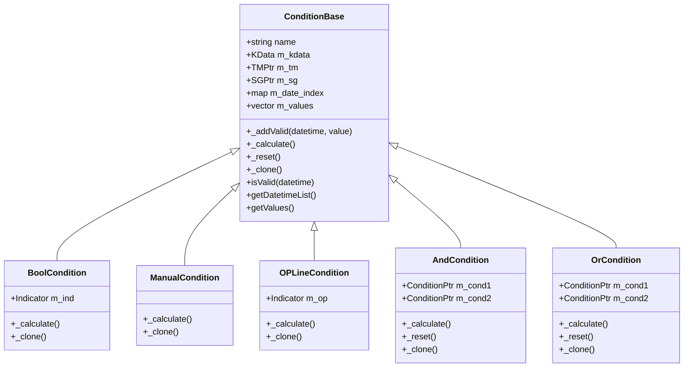

# 条件判断组件API

<cite>
**本文档中引用的文件**  
- [CN_Bool.h](file://hikyuu_cpp/hikyuu/trade_sys/condition/crt/CN_Bool.h)
- [CN_Logic.h](file://hikyuu_cpp/hikyuu/trade_sys/condition/crt/CN_Logic.h)
- [CN_Manual.h](file://hikyuu_cpp/hikyuu/trade_sys/condition/crt/CN_Manual.h)
- [CN_OPLine.h](file://hikyuu_cpp/hikyuu/trade_sys/condition/crt/CN_OPLine.h)
- [BoolCondition.cpp](file://hikyuu_cpp/hikyuu/trade_sys/condition/imp/BoolCondition.cpp)
- [ManualCondition.cpp](file://hikyuu_cpp/hikyuu/trade_sys/condition/imp/ManualCondition.cpp)
- [OPLineCondition.cpp](file://hikyuu_cpp/hikyuu/trade_sys/condition/imp/OPLineCondition.cpp)
- [AndCondition.cpp](file://hikyuu_cpp/hikyuu/trade_sys/condition/imp/logic/AndCondition.cpp)
- [OrCondition.cpp](file://hikyuu_cpp/hikyuu/trade_sys/condition/imp/logic/OrCondition.cpp)
- [ConditionBase.h](file://hikyuu_cpp/hikyuu/trade_sys/condition/ConditionBase.h)
- [_Condition.cpp](file://hikyuu_pywrap/trade_sys/_Condition.cpp)
- [Condition.py](file://hikyuu/test/Condition.py)
</cite>

## 目录
1. [简介](#简介)
2. [核心条件构造函数](#核心条件构造函数)
3. [条件评估逻辑与执行时机](#条件评估逻辑与执行时机)
4. [与交易系统的集成](#与交易系统的集成)
5. [性能优化建议](#性能优化建议)
6. [附录：条件组件类图](#附录：条件组件类图)

## 简介
条件判断组件（Condition）是Hikyuu量化交易系统中的关键模块，用于定义交易系统在何时有效。该组件通过评估市场数据、信号和其他因素，决定交易策略是否应该被激活。本文档详细介绍了CN_Bool、CN_Logic、CN_Manual和CN_OPLine等核心条件创建函数的API接口、参数说明、使用场景以及与其他系统组件的交互方式。

**条件判断组件的主要功能包括**：
- 基于指标值判断系统有效性
- 组合多个子条件形成复杂逻辑
- 手动指定有效时间段
- 根据权益曲线动态判断有效性

**Section sources**
- [ConditionBase.h](file://hikyuu_cpp/hikyuu/trade_sys/condition/ConditionBase.h#L19-L151)

## 核心条件构造函数

### CN_Bool
CN_Bool用于创建基于布尔指标的系统有效条件。当输入指标在某时间点的值大于0时，系统在该时间点有效。

**参数说明**：
- `ind`：类型为Indicator的布尔型指标，输入通常为K线数据。指标中值大于0的位置表示系统有效，否则无效。

**使用场景**：
适用于需要根据技术指标（如均线交叉、RSI超买超卖等）来判断系统是否激活的场景。例如，当短期均线向上穿越长期均线时，系统开始工作。

```cpp
CNPtr HKU_API CN_Bool(const Indicator& ind);
```

**Section sources**
- [CN_Bool.h](file://hikyuu_cpp/hikyuu/trade_sys/condition/crt/CN_Bool.h#L20)
- [BoolCondition.cpp](file://hikyuu_cpp/hikyuu/trade_sys/condition/imp/BoolCondition.cpp#L37-L38)

### CN_Logic
CN_Logic提供逻辑运算符重载，用于组合多个子条件。支持与（&）、或（|）、加（+）、减（-）、乘（*）、除（/）等操作。

**主要运算符**：
- `&`：两个条件相与，等效于交集
- `|`：两个条件相或，等效于并集
- `+`：同或操作
- `-`：差集操作
- `*`：同与操作
- `/`：除法操作

**使用场景**：
用于构建复杂的复合条件。例如，只有当价格突破布林带上轨**且**成交量放大时，系统才有效。

```cpp
HKU_API ConditionPtr operator&(const ConditionPtr& cond1, const ConditionPtr& cond2);
HKU_API ConditionPtr operator|(const ConditionPtr& cond1, const ConditionPtr& cond2);
```

**Section sources**
- [CN_Logic.h](file://hikyuu_cpp/hikyuu/trade_sys/condition/crt/CN_Logic.h#L20-L33)
- [AndCondition.cpp](file://hikyuu_cpp/hikyuu/trade_sys/condition/imp/logic/AndCondition.cpp#L69-L70)
- [OrCondition.cpp](file://hikyuu_cpp/hikyuu/trade_sys/condition/imp/logic/OrCondition.cpp#L97-L98)

### CN_Manual
CN_Manual创建一个只能手动添加有效性的条件组件，主要用于测试或其他特殊用途。

**参数说明**：
无参数，返回一个CNPtr类型的条件实例。

**使用场景**：
在策略开发和测试阶段，用于手动指定某些时间段为有效，便于验证策略逻辑。

```cpp
CNPtr HKU_API CN_Manual();
```

**Section sources**
- [CN_Manual.h](file://hikyuu_cpp/hikyuu/trade_sys/condition/crt/CN_Manual.h#L18)
- [ManualCondition.cpp](file://hikyuu_cpp/hikyuu/trade_sys/condition/imp/ManualCondition.cpp#L20-L21)

### CN_OPLine
CN_OPLine根据权益曲线与指定阈值的比较结果来判断系统有效性。当固定使用股票最小交易量进行交易计算出的权益曲线高于指定操作线（op）时，系统有效。

**参数说明**：
- `op`：类型为Indicator的操作线指标，用于与权益曲线比较。

**使用场景**：
适用于需要根据账户表现动态调整系统有效性的场景。例如，当账户权益低于某个止损线时，自动停止交易。

```cpp
CNPtr HKU_API CN_OPLine(const Indicator& op);
```

**Section sources**
- [CN_OPLine.h](file://hikyuu_cpp/hikyuu/trade_sys/condition/crt/CN_OPLine.h#L22)
- [OPLineCondition.cpp](file://hikyuu_cpp/hikyuu/trade_sys/condition/imp/OPLineCondition.cpp#L59-L60)

## 条件评估逻辑与执行时机

### 评估逻辑
条件组件的评估逻辑在`_calculate()`方法中实现。每个具体条件类都必须重写此方法，根据其特定逻辑计算系统有效性。

**通用评估流程**：
1. 设置交易对象（KData）、交易管理器（TM）和信号生成器（SG）
2. 遍历时间序列数据
3. 根据条件逻辑判断每个时间点的有效性
4. 使用`_addValid()`方法记录有效时间点

对于逻辑组合条件（如AndCondition、OrCondition），评估逻辑会递归调用子条件的`_calculate()`方法，然后根据逻辑运算规则合并结果。

**Section sources**
- [ConditionBase.h](file://hikyuu_cpp/hikyuu/trade_sys/condition/ConditionBase.h#L94-L95)
- [BoolCondition.cpp](file://hikyuu_cpp/hikyuu/trade_sys/condition/imp/BoolCondition.cpp#L26-L34)
- [AndCondition.cpp](file://hikyuu_cpp/hikyuu/trade_sys/condition/imp/logic/AndCondition.cpp#L30-L46)

### 执行时机
条件组件在交易系统运行时被调用，具体执行时机如下：
1. 系统初始化时，设置条件组件的交易对象、交易管理器和信号生成器
2. 调用`reset()`方法重置内部状态
3. 调用`_calculate()`方法进行条件评估
4. 评估结果用于控制信号生成器的执行

条件评估通常在每个交易周期开始时进行，确保只有在系统有效的周期内才会生成交易信号。

**Section sources**
- [ConditionBase.h](file://hikyuu_cpp/hikyuu/trade_sys/condition/ConditionBase.h#L46)
- [OPLineCondition.cpp](file://hikyuu_cpp/hikyuu/trade_sys/condition/imp/OPLineCondition.cpp#L31-L56)

## 与交易系统的集成

### 组件交互关系
条件判断组件与交易系统中的其他组件通过以下方式交互：


**交互说明**：
- **交易对象（KData）**：提供市场数据，作为条件评估的基础
- **交易管理器（TM）**：提供账户信息和交易记录，用于基于账户表现的条件判断
- **信号生成器（SG）**：条件评估结果决定是否执行信号生成逻辑

### 代码集成示例
以下是条件组件在Python中的使用示例：

```python
# 创建基于RSI指标的条件
rsi = RSI(n=14)
cond1 = CN_Bool(rsi < 30)  # RSI低于30时系统有效

# 创建基于价格突破的条件
ma5 = MA(CLOSE, 5)
ma20 = MA(CLOSE, 20)
cond2 = CN_Bool(CROSS(ma5, ma20))  # 均线金叉时系统有效

# 组合条件：RSI超卖且均线金叉
final_cond = cond1 & cond2

# 设置到交易系统
sys.set_condition(final_cond)
```

**Section sources**
- [_Condition.cpp](file://hikyuu_pywrap/trade_sys/_Condition.cpp#L111-L127)
- [Condition.py](file://hikyuu/test/Condition.py)

## 性能优化建议

### 减少重复计算
避免在条件评估中进行重复的指标计算。建议：
- 复用已计算的指标对象
- 使用缓存机制存储中间结果
- 预先计算静态条件

### 合理使用逻辑组合
逻辑组合条件会增加计算复杂度，建议：
- 尽量简化条件逻辑，避免过深的嵌套
- 将高频变化的条件放在逻辑运算的前面
- 使用`AndCondition`时，将更可能为假的条件放在前面以实现短路求值

### 内存管理
- 及时释放不再使用的条件对象
- 避免创建过多临时条件实例
- 使用`reset()`方法复用条件对象而非重新创建

### 批量处理
对于大量股票的条件评估，建议：
- 批量加载数据
- 并行处理不同股票的条件评估
- 使用向量化操作替代循环

**Section sources**
- [ConditionBase.h](file://hikyuu_cpp/hikyuu/trade_sys/condition/ConditionBase.h#L123)
- [BoolCondition.cpp](file://hikyuu_cpp/hikyuu/trade_sys/condition/imp/BoolCondition.cpp#L30-L34)

## 附录：条件组件类图



**Diagram sources**
- [ConditionBase.h](file://hikyuu_cpp/hikyuu/trade_sys/condition/ConditionBase.h)
- [BoolCondition.cpp](file://hikyuu_cpp/hikyuu/trade_sys/condition/imp/BoolCondition.cpp)
- [ManualCondition.cpp](file://hikyuu_cpp/hikyuu/trade_sys/condition/imp/ManualCondition.cpp)
- [OPLineCondition.cpp](file://hikyuu_cpp/hikyuu/trade_sys/condition/imp/OPLineCondition.cpp)
- [AndCondition.cpp](file://hikyuu_cpp/hikyuu/trade_sys/condition/imp/logic/AndCondition.cpp)
- [OrCondition.cpp](file://hikyuu_cpp/hikyuu/trade_sys/condition/imp/logic/OrCondition.cpp)

**Section sources**
- [ConditionBase.h](file://hikyuu_cpp/hikyuu/trade_sys/condition/ConditionBase.h#L24-L151)