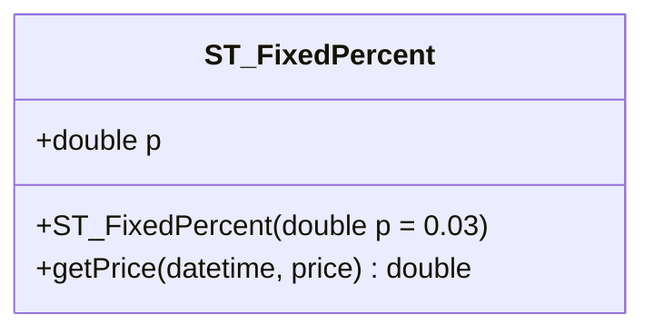
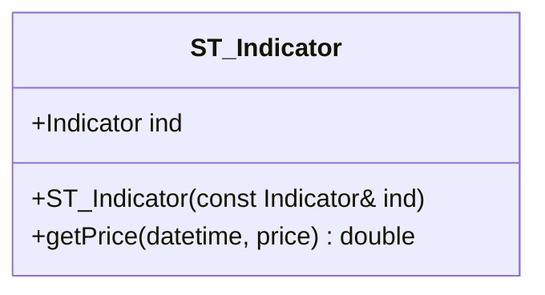
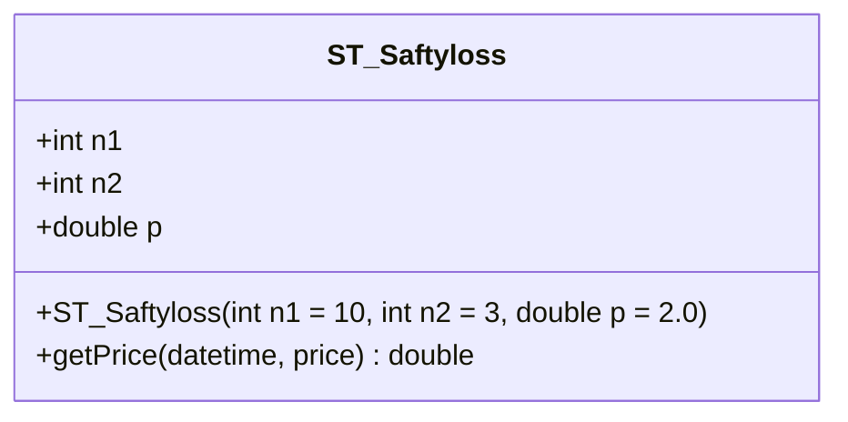
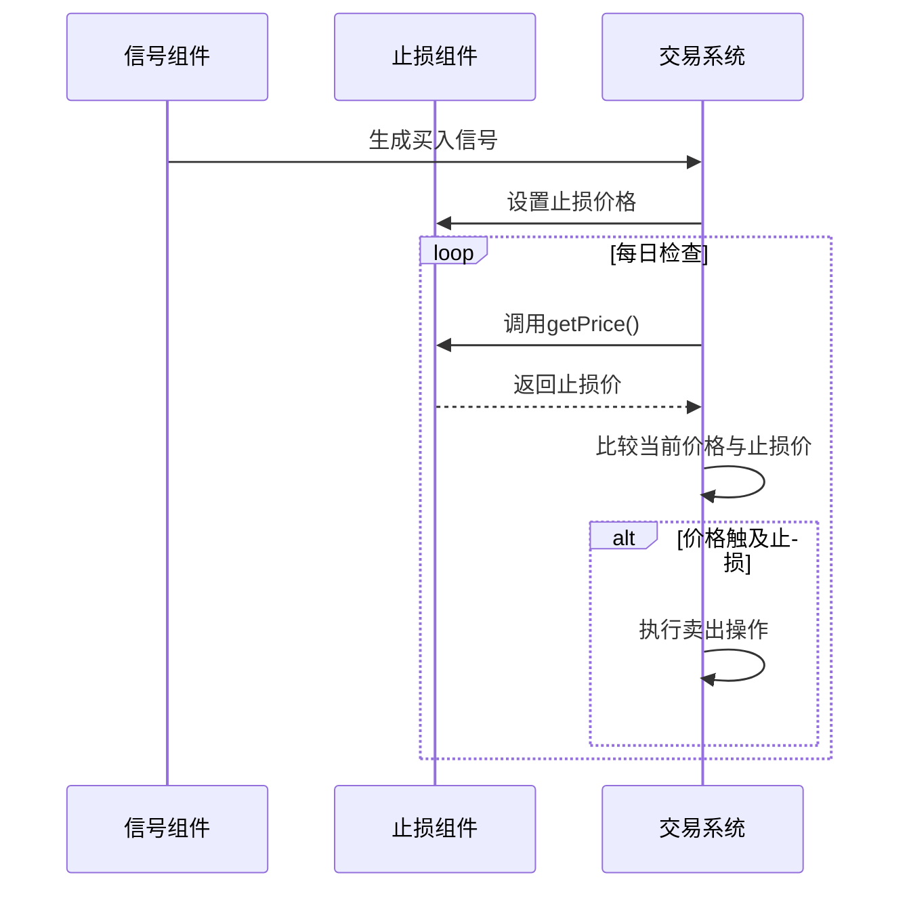

# 止损组件API

<cite>
**本文档中引用的文件**  
- [ST_FixedPercent.h](file://hikyuu_cpp/hikyuu/trade_sys/stoploss/crt/ST_FixedPercent.h)
- [ST_Indicator.h](file://hikyuu_cpp/hikyuu/trade_sys/stoploss/crt/ST_Indicator.h)
- [ST_Saftyloss.h](file://hikyuu_cpp/hikyuu/trade_sys/stoploss/crt/ST_Saftyloss.h)
- [ST_Saftyloss.cpp](file://hikyuu_cpp/hikyuu/trade_sys/stoploss/crt/ST_Saftyloss.cpp)
- [_Stoploss.cpp](file://hikyuu_pywrap/trade_sys/_Stoploss.cpp)
- [Stoploss.py](file://hikyuu/test/Stoploss.py)
</cite>

## 目录
1. [简介](#简介)
2. [核心止损函数](#核心止损函数)
3. [详细组件分析](#详细组件分析)
4. [集成与使用示例](#集成与使用示例)
5. [常见配置错误与处理](#常见配置错误与处理)

## 简介
止损组件（Stoploss）是交易系统中的关键模块，用于在价格不利变动时自动平仓以控制风险。本文档详细说明了Hikyuu框架中提供的主要止损策略构造函数，包括固定百分比止损、基于技术指标的动态止损以及安全地带止损等。这些策略可灵活集成到交易系统中，配合信号组件实现完整的交易逻辑。

## 核心止损函数
Hikyuu提供了多种止损策略创建函数，主要包含以下三类：

- **ST_FixedPercent**: 固定百分比止损
- **ST_Indicator**: 基于技术指标的止损
- **ST_Saftyloss**: 安全地带止损（基于亚历山大·艾尔德理论）

这些函数均返回`StoplossPtr`类型的止损策略实例，可在交易系统中直接使用。

**Section sources**
- [ST_FixedPercent.h](file://hikyuu_cpp/hikyuu/trade_sys/stoploss/crt/ST_FixedPercent.h)
- [ST_Indicator.h](file://hikyuu_cpp/hikyuu/trade_sys/stoploss/crt/ST_Indicator.h)
- [ST_Saftyloss.h](file://hikyuu_cpp/hikyuu/trade_sys/stoploss/crt/ST_Saftyloss.h)

## 详细组件分析

### ST_FixedPercent 固定百分比止损
该策略在价格低于买入价的指定百分比时触发止损。

**参数说明**：
- `p`: 止损百分比，取值范围(0,1]，默认值为0.03（即3%）

**使用场景**：适用于趋势跟踪策略中设置固定风险比例，简单直观，易于管理。

**Diagram sources**
- [ST_FixedPercent.h](file://hikyuu_cpp/hikyuu/trade_sys/stoploss/crt/ST_FixedPercent.h)

**Section sources**
- [ST_FixedPercent.h](file://hikyuu_cpp/hikyuu/trade_sys/stoploss/crt/ST_FixedPercent.h)

### ST_Indicator 基于技术指标的止损
该策略使用技术指标输出作为动态止损价格。

**参数说明**：
- `ind`: 技术指标实例，如EMA、ATR等

**使用示例**：`ST_Indicator(EMA(CLOSE(), n=10))`表示使用10日指数移动平均线作为止损线。

**使用场景**：适用于波动性较大的市场，可根据市场动态调整止损位置，避免被短期波动触发。

**Diagram sources**
- [ST_Indicator.h](file://hikyuu_cpp/hikyuu/trade_sys/stoploss/crt/ST_Indicator.h)

**Section sources**
- [ST_Indicator.h](file://hikyuu_cpp/hikyuu/trade_sys/stoploss/crt/ST_Indicator.h)

### ST_Saftyloss 安全地带止损
基于亚历山大·艾尔德《走进我的交易室》中的安全地带止损策略。

**参数说明**：
- `n1`: 计算平均噪音的回溯时间窗口，默认为10天
- `n2`: 对初步止损线取n2日内的最高值，默认为3天
- `p`: 噪音系数，默认为2.0

**计算逻辑**：
1. 在回溯周期内计算向下穿越的平均长度（噪音均值）
2. 用当日最低价减去（噪音均值×系数p）得到初步止损线
3. 对初步止损线取N日最高值以平滑波动

**使用场景**：适用于需要考虑市场噪音和波动性的策略，能有效避免因短期波动而过早止损。

**Diagram sources**
- [ST_Saftyloss.h](file://hikyuu_cpp/hikyuu/trade_sys/stoploss/crt/ST_Saftyloss.h)
- [ST_Saftyloss.cpp](file://hikyuu_cpp/hikyuu/trade_sys/stoploss/crt/ST_Saftyloss.cpp)

**Section sources**
- [ST_Saftyloss.h](file://hikyuu_cpp/hikyuu/trade_sys/stoploss/crt/ST_Saftyloss.h)
- [ST_Saftyloss.cpp](file://hikyuu_cpp/hikyuu/trade_sys/stoploss/crt/ST_Saftyloss.cpp)

## 集成与使用示例
止损组件通常与信号组件协同工作，在交易系统中按以下流程执行：

**执行时机**：通常在每个交易周期开始时检查是否触及止损条件。

**滑点处理**：实际成交价可能与止损价存在差异，建议在策略回测中考虑滑点因素。

**协同机制**：止损组件与信号组件、资金管理组件共同构成完整的交易系统。

**Diagram sources**
- [Stoploss.py](file://hikyuu/test/Stoploss.py)

**Section sources**
- [Stoploss.py](file://hikyuu/test/Stoploss.py)
- [_Stoploss.cpp](file://hikyuu_pywrap/trade_sys/_Stoploss.cpp)

## 常见配置错误与处理
1. **参数越界**：如ST_FixedPercent的p参数超出(0,1]范围
2. **数据不足**：ST_Saftyloss需要足够的历史数据来计算噪音均值
3. **指标冲突**：ST_Indicator使用的指标与主策略逻辑矛盾
4. **回测偏差**：未考虑滑点和交易成本导致回测结果过于乐观

建议在实盘前充分回测，并监控止损触发频率和效果。

**Section sources**
- [Stoploss.py](file://hikyuu/test/Stoploss.py)