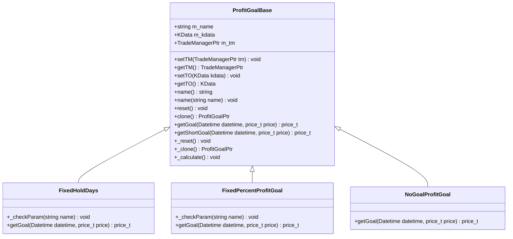
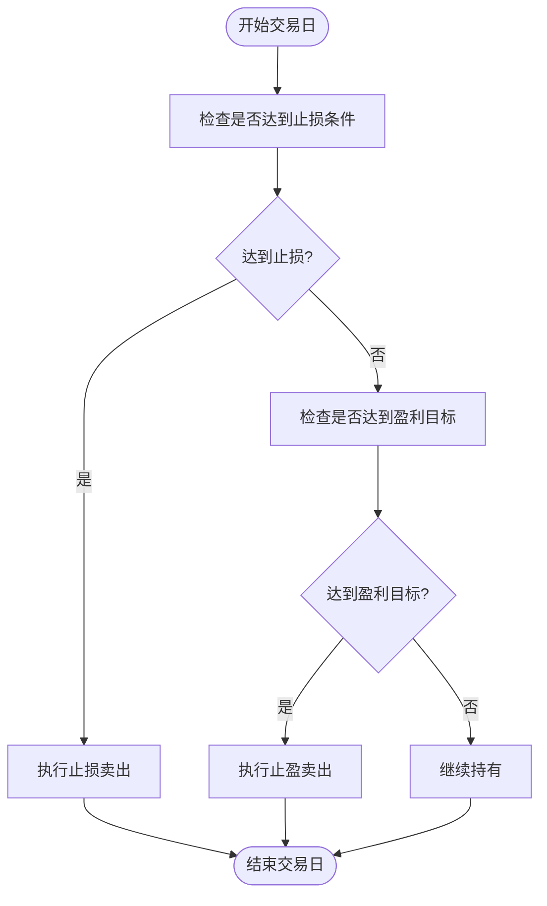
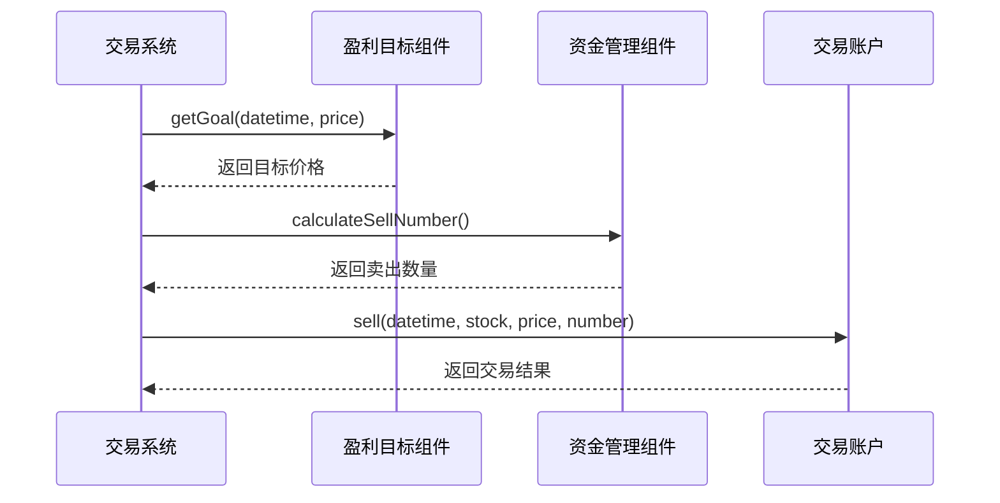

# 盈利目标组件API

<cite>
**本文档引用的文件**
- [ProfitGoalBase.h](file://hikyuu_cpp/hikyuu/trade_sys/profitgoal/ProfitGoalBase.h)
- [ProfitGoalBase.cpp](file://hikyuu_cpp/hikyuu/trade_sys/profitgoal/ProfitGoalBase.cpp)
- [PG_FixedHoldDays.h](file://hikyuu_cpp/hikyuu/trade_sys/profitgoal/crt/PG_FixedHoldDays.h)
- [FixedHoldDays.cpp](file://hikyuu_cpp/hikyuu/trade_sys/profitgoal/imp/FixedHoldDays.cpp)
- [PG_FixedPercent.h](file://hikyuu_cpp/hikyuu/trade_sys/profitgoal/crt/PG_FixedPercent.h)
- [FixedPercentProfitGoal.cpp](file://hikyuu_cpp/hikyuu/trade_sys/profitgoal/imp/FixedPercentProfitGoal.cpp)
- [PG_NoGoal.h](file://hikyuu_cpp/hikyuu/trade_sys/profitgoal/crt/PG_NoGoal.h)
- [NoGoalProfitGoal.cpp](file://hikyuu_cpp/hikyuu/trade_sys/profitgoal/imp/NoGoalProfitGoal.cpp)
- [_ProfitGoal.cpp](file://hikyuu_pywrap/trade_sys/_ProfitGoal.cpp)
- [ProfitGoal.py](file://hikyuu/test/ProfitGoal.py)
</cite>

## 目录
1. [简介](#简介)
2. [核心组件](#核心组件)
3. [盈利目标创建函数](#盈利目标创建函数)
4. [使用场景与组合策略](#使用场景与组合策略)
5. [目标检查频率与多目标处理](#目标检查频率与多目标处理)
6. [与资金管理的交互](#与资金管理的交互)
7. [结论](#结论)

## 简介
盈利目标组件（ProfitGoal）是Hikyuu量化交易系统中的关键组成部分，用于在交易前确定盈利目标。当市场价格达到预设的盈利目标时，系统将自动执行卖出操作。该组件提供了多种盈利目标策略，包括固定持有天数、固定盈利百分比和无盈利目标等，以满足不同的交易策略需求。

**Section sources**
- [ProfitGoalBase.h](file://hikyuu_cpp/hikyuu/trade_sys/profitgoal/ProfitGoalBase.h#L1-L194)

## 核心组件

盈利目标组件的核心是`ProfitGoalBase`基类，所有具体的盈利目标策略都继承自该基类。基类定义了盈利目标策略的基本接口和通用功能，包括设置交易账户、获取交易对象、复位操作和克隆操作等。



**Diagram sources**
- [ProfitGoalBase.h](file://hikyuu_cpp/hikyuu/trade_sys/profitgoal/ProfitGoalBase.h#L18-L158)
- [FixedHoldDays.cpp](file://hikyuu_cpp/hikyuu/trade_sys/profitgoal/imp/FixedHoldDays.cpp#L16-L45)
- [FixedPercentProfitGoal.cpp](file://hikyuu_cpp/hikyuu/trade_sys/profitgoal/imp/FixedPercentProfitGoal.cpp#L16-L42)
- [NoGoalProfitGoal.cpp](file://hikyuu_cpp/hikyuu/trade_sys/profitgoal/imp/NoGoalProfitGoal.cpp#L16-L22)

**Section sources**
- [ProfitGoalBase.h](file://hikyuu_cpp/hikyuu/trade_sys/profitgoal/ProfitGoalBase.h#L18-L158)
- [ProfitGoalBase.cpp](file://hikyuu_cpp/hikyuu/trade_sys/profitgoal/ProfitGoalBase.cpp#L26-L70)

## 盈利目标创建函数

### PG_FixedHoldDays
`PG_FixedHoldDays`函数用于创建固定持有天数的盈利目标策略。该策略允许用户指定一个最大持仓天数，当持仓时间达到该天数时，系统将自动卖出。

**参数说明：**
- `days`：允许持仓天数（按交易日计算），默认值为5天

**使用示例：**
```python
pg = PG_FixedHoldDays(10)  # 创建一个允许持有10个交易日的盈利目标策略
```

**Section sources**
- [PG_FixedHoldDays.h](file://hikyuu_cpp/hikyuu/trade_sys/profitgoal/crt/PG_FixedHoldDays.h#L16-L22)
- [FixedHoldDays.cpp](file://hikyuu_cpp/hikyuu/trade_sys/profitgoal/imp/FixedHoldDays.cpp#L29-L45)

### PG_FixedPercent
`PG_FixedPercent`函数用于创建固定盈利百分比的盈利目标策略。该策略允许用户指定一个盈利百分比，当价格达到买入价格乘以(1+p)时，系统将自动卖出。

**参数说明：**
- `p`：盈利百分比，默认值为0.2（即20%）

**使用示例：**
```python
pg = PG_FixedPercent(0.3)  # 创建一个目标盈利30%的盈利目标策略
```

**Section sources**
- [PG_FixedPercent.h](file://hikyuu_cpp/hikyuu/trade_sys/profitgoal/crt/PG_FixedPercent.h#L16-L21)
- [FixedPercentProfitGoal.cpp](file://hikyuu_cpp/hikyuu/trade_sys/profitgoal/imp/FixedPercentProfitGoal.cpp#L36-L42)

### PG_NoGoal
`PG_NoGoal`函数用于创建无盈利目标策略。该策略通常用于测试或对比，表示不设置任何盈利目标。

**参数说明：**
- 无参数

**使用示例：**
```python
pg = PG_NoGoal()  # 创建一个无盈利目标策略
```

**Section sources**
- [PG_NoGoal.h](file://hikyuu_cpp/hikyuu/trade_sys/profitgoal/crt/PG_NoGoal.h#L16-L20)
- [NoGoalProfitGoal.cpp](file://hikyuu_cpp/hikyuu/trade_sys/profitgoal/imp/NoGoalProfitGoal.cpp#L20-L22)

## 使用场景与组合策略

### 时间止盈
`PG_FixedHoldDays`策略适用于时间止盈场景。当投资者希望在特定时间内持有股票，无论盈亏都进行卖出时，可以使用此策略。例如，短线交易者可能希望在买入后5个交易日内卖出，以避免市场波动带来的风险。

### 利润止盈
`PG_FixedPercent`策略适用于利润止盈场景。当投资者希望在达到特定盈利目标时卖出股票，以锁定利润时，可以使用此策略。例如，价值投资者可能希望在股票上涨20%时卖出，以确保获得稳定收益。

### 组合使用示例
盈利目标组件可以与止损、信号组件组合使用，形成完整的交易策略。以下是一个组合使用的代码示例：

```python
# 创建信号组件
sg = SG_Fix(CList(1))  # 每日产生买入信号

# 创建止损组件
sl = SL_FixedPercent(0.1)  # 亏损10%时止损

# 创建盈利目标组件
pg = PG_FixedPercent(0.3)  # 盈利30%时止盈

# 创建交易系统
sys = SYS_Simple(tm, sg, sl, pg)

# 执行回测
result = sys.run()
```

**交易执行逻辑：**
1. 当买入信号产生时，系统执行买入操作
2. 每个交易日检查是否达到止损条件，若达到则执行卖出
3. 每个交易日检查是否达到盈利目标，若达到则执行卖出
4. 若未达到止损或盈利目标，则继续持有

**Section sources**
- [ProfitGoal.py](file://hikyuu/test/ProfitGoal.py#L58-L83)
- [_ProfitGoal.cpp](file://hikyuu_pywrap/trade_sys/_ProfitGoal.cpp#L109-L144)

## 目标检查频率与多目标处理

### 目标检查频率
盈利目标的检查频率与交易系统的运行频率一致。在每日回测中，系统会在每个交易日结束时检查是否达到盈利目标。在分钟级回测中，系统会在每个分钟数据点检查是否达到盈利目标。

### 多目标处理
系统支持同时设置多个盈利目标。当多个盈利目标策略同时存在时，只要任何一个目标被触发，系统就会执行卖出操作。例如，可以同时设置时间止盈和利润止盈，当达到任一条件时即卖出。



**Diagram sources**
- [FixedHoldDays.cpp](file://hikyuu_cpp/hikyuu/trade_sys/profitgoal/imp/FixedHoldDays.cpp#L29-L45)
- [FixedPercentProfitGoal.cpp](file://hikyuu_cpp/hikyuu/trade_sys/profitgoal/imp/FixedPercentProfitGoal.cpp#L36-L42)

**Section sources**
- [FixedHoldDays.cpp](file://hikyuu_cpp/hikyuu/trade_sys/profitgoal/imp/FixedHoldDays.cpp#L29-L45)
- [FixedPercentProfitGoal.cpp](file://hikyuu_cpp/hikyuu/trade_sys/profitgoal/imp/FixedPercentProfitGoal.cpp#L36-L42)

## 与资金管理的交互

盈利目标组件与资金管理组件（MoneyManager）紧密交互。当盈利目标被触发时，资金管理组件会根据当前的资金状况和风险控制策略，决定实际的卖出数量。



**Diagram sources**
- [ProfitGoalBase.h](file://hikyuu_cpp/hikyuu/trade_sys/profitgoal/ProfitGoalBase.h#L33-L36)
- [ProfitGoalBase.cpp](file://hikyuu_cpp/hikyuu/trade_sys/profitgoal/ProfitGoalBase.cpp#L62-L68)

**Section sources**
- [ProfitGoalBase.h](file://hikyuu_cpp/hikyuu/trade_sys/profitgoal/ProfitGoalBase.h#L33-L36)
- [ProfitGoalBase.cpp](file://hikyuu_cpp/hikyuu/trade_sys/profitgoal/ProfitGoalBase.cpp#L62-L68)

## 结论
盈利目标组件为Hikyuu量化交易系统提供了灵活的止盈机制。通过`PG_FixedHoldDays`、`PG_FixedPercent`和`PG_NoGoal`等函数，用户可以根据不同的交易策略需求，设置时间止盈、利润止盈或不设置止盈目标。这些组件可以与止损、信号和资金管理组件组合使用，形成完整的交易策略。系统在每个交易周期都会检查盈利目标，当目标达成时自动执行卖出操作，帮助投资者实现风险控制和收益锁定。