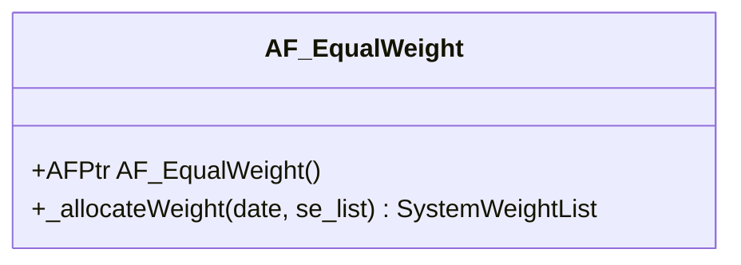
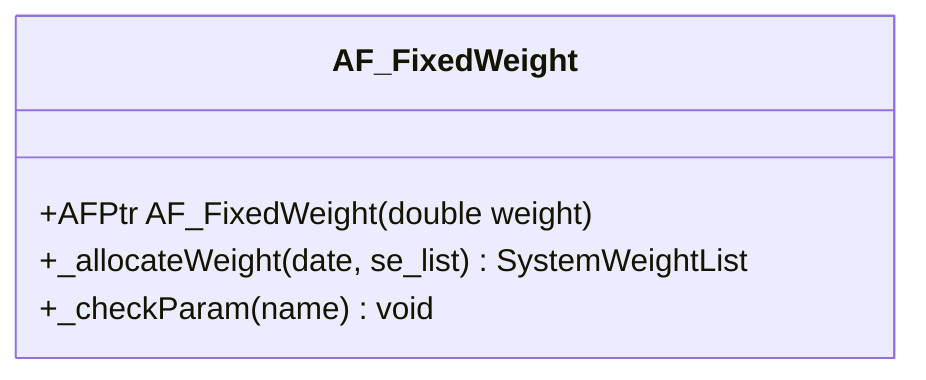
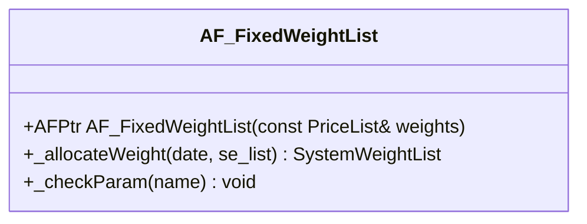
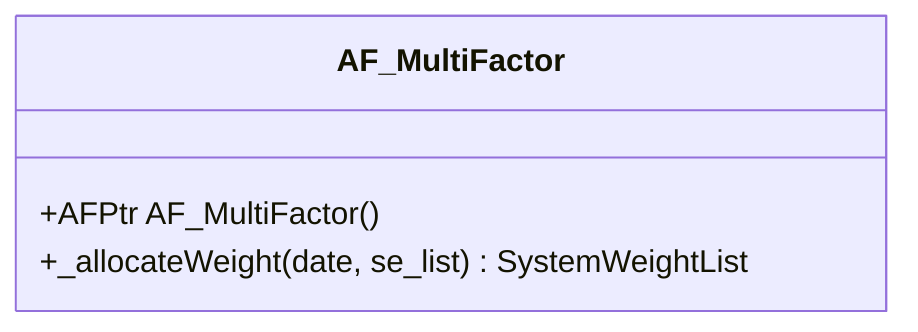
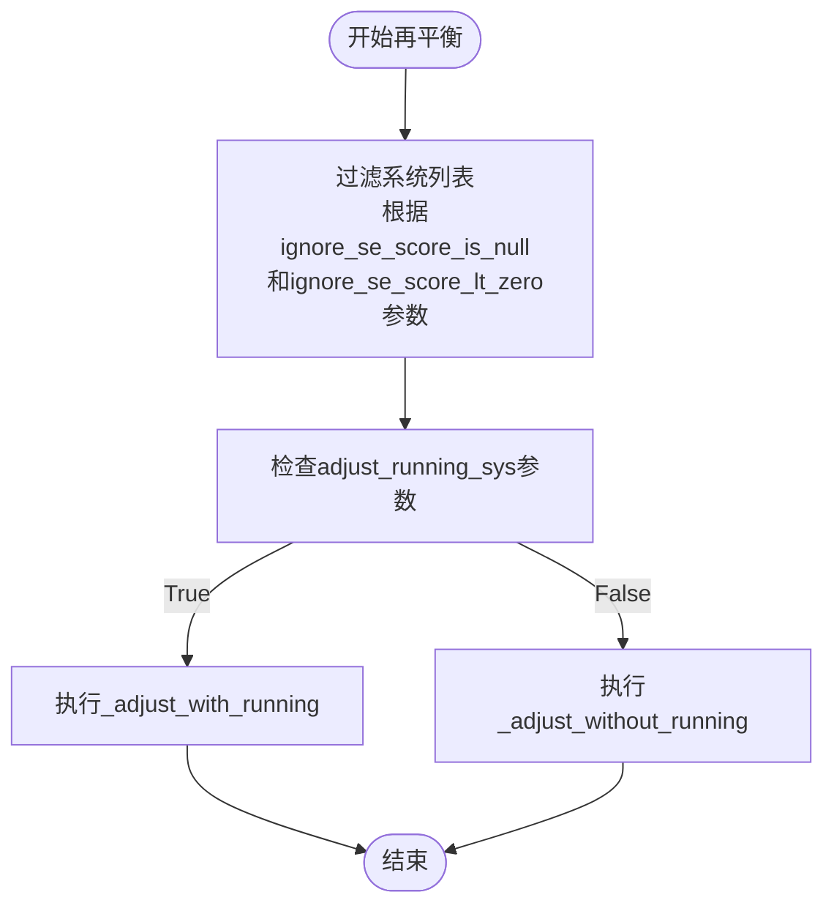
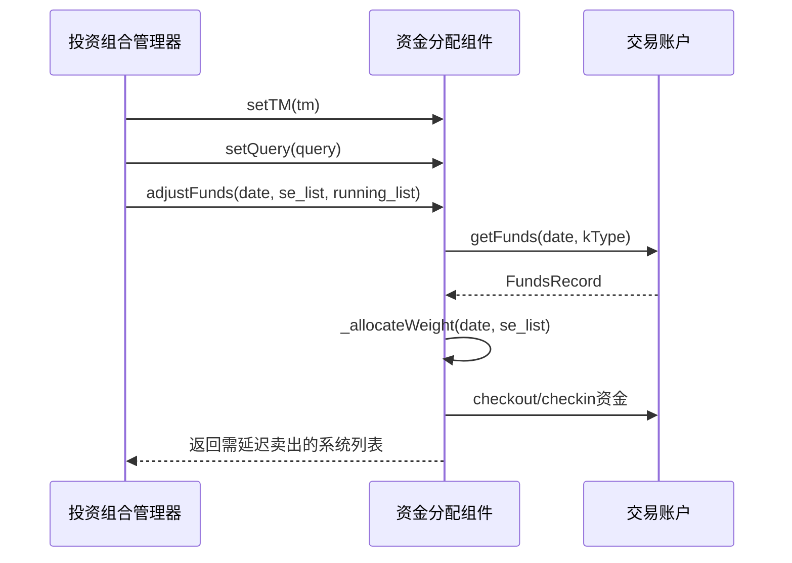

# 资金分配组件API

<cite>
**本文档引用的文件**
- [AF_EqualWeight.h](file://hikyuu_cpp/hikyuu/trade_sys/allocatefunds/crt/AF_EqualWeight.h)
- [AF_FixedWeight.h](file://hikyuu_cpp/hikyuu/trade_sys/allocatefunds/crt/AF_FixedWeight.h)
- [AF_FixedWeightList.h](file://hikyuu_cpp/hikyuu/trade_sys/allocatefunds/crt/AF_FixedWeightList.h)
- [AF_MultiFactor.h](file://hikyuu_cpp/hikyuu/trade_sys/allocatefunds/crt/AF_MultiFactor.h)
- [AllocateFundsBase.h](file://hikyuu_cpp/hikyuu/trade_sys/allocatefunds/AllocateFundsBase.h)
- [AllocateFundsBase.cpp](file://hikyuu_cpp/hikyuu/trade_sys/allocatefunds/AllocateFundsBase.cpp)
- [EqualWeightAllocateFunds.cpp](file://hikyuu_cpp/hikyuu/trade_sys/allocatefunds/imp/EqualWeightAllocateFunds.cpp)
- [FixedWeightAllocateFunds.cpp](file://hikyuu_cpp/hikyuu/trade_sys/allocatefunds/imp/FixedWeightAllocateFunds.cpp)
- [FixedWeightListAllocateFunds.cpp](file://hikyuu_cpp/hikyuu/trade_sys/allocatefunds/imp/FixedWeightListAllocateFunds.cpp)
- [MultiFactorAllocaterFunds.cpp](file://hikyuu_cpp/hikyuu/trade_sys/allocatefunds/imp/MultiFactorAllocaterFunds.cpp)
- [SystemWeight.h](file://hikyuu_cpp/hikyuu/trade_sys/selector/SystemWeight.h)
</cite>

## 目录
1. [简介](#简介)
2. [核心资金分配算法](#核心资金分配算法)
3. [权重计算逻辑](#权重计算逻辑)
4. [再平衡机制](#再平衡机制)
5. [性能优化](#性能优化)
6. [投资组合集成](#投资组合集成)
7. [使用场景](#使用场景)

## 简介
资金分配组件（AllocateFunds）是Hikyuu量化交易框架中的核心模块，负责在投资组合中对选中的资产进行权重分配。该组件提供了一系列预定义的资金分配算法，支持等权重、固定权重、固定权重列表和多因子动态权重等多种分配策略。这些算法通过标准化的接口与投资组合管理系统集成，实现了灵活的资金配置和再平衡功能。

**Section sources**
- [AllocateFundsBase.h](file://hikyuu_cpp/hikyuu/trade_sys/allocatefunds/AllocateFundsBase.h#L1-L235)

## 核心资金分配算法
资金分配组件提供了四种主要的资金分配创建函数，每种函数针对不同的投资策略需求。

### AF_EqualWeight
等权重资产分配算法，对所有选中的资产进行等比例分配。

**参数说明：**
- 无参数

**返回值：**
- AFPtr: 资金分配算法实例

**使用场景：**
- 适用于希望对所有选中资产进行均等配置的投资者
- 常用于分散化投资策略，降低单一资产风险



**Diagram sources**
- [AF_EqualWeight.h](file://hikyuu_cpp/hikyuu/trade_sys/allocatefunds/crt/AF_EqualWeight.h#L1-L25)
- [EqualWeightAllocateFunds.cpp](file://hikyuu_cpp/hikyuu/trade_sys/allocatefunds/imp/EqualWeightAllocateFunds.cpp#L1-L34)

**Section sources**
- [AF_EqualWeight.h](file://hikyuu_cpp/hikyuu/trade_sys/allocatefunds/crt/AF_EqualWeight.h#L1-L25)
- [EqualWeightAllocateFunds.cpp](file://hikyuu_cpp/hikyuu/trade_sys/allocatefunds/imp/EqualWeightAllocateFunds.cpp#L1-L34)

### AF_FixedWeight
固定比例资产分配算法，每个选中的资产都占总资产的固定比例。

**参数说明：**
- weight (double): 指定的资产比例，范围为(0, 1]，默认值为0.1

**返回值：**
- AFPtr: 资金分配算法实例

**使用场景：**
- 适用于希望为每个资产配置固定比例资金的策略
- 常用于风险平价或固定比例投资组合



**Diagram sources**
- [AF_FixedWeight.h](file://hikyuu_cpp/hikyuu/trade_sys/allocatefunds/crt/AF_FixedWeight.h#L1-L27)
- [FixedWeightAllocateFunds.cpp](file://hikyuu_cpp/hikyuu/trade_sys/allocatefunds/imp/FixedWeightAllocateFunds.cpp#L1-L52)

**Section sources**
- [AF_FixedWeight.h](file://hikyuu_cpp/hikyuu/trade_sys/allocatefunds/crt/AF_FixedWeight.h#L1-L27)
- [FixedWeightAllocateFunds.cpp](file://hikyuu_cpp/hikyuu/trade_sys/allocatefunds/imp/FixedWeightAllocateFunds.cpp#L1-L52)

### AF_FixedWeightList
固定比例列表资产分配算法，根据指定的权重列表为资产分配资金。

**参数说明：**
- weights (PriceList): 指定的资产比例列表

**返回值：**
- AFPtr: 资金分配算法实例

**使用场景：**
- 适用于需要精确控制每个资产权重的投资组合
- 常用于基于基本面分析或专家判断的权重配置



**Diagram sources**
- [AF_FixedWeightList.h](file://hikyuu_cpp/hikyuu/trade_sys/allocatefunds/crt/AF_FixedWeightList.h#L1-L23)
- [FixedWeightListAllocateFunds.cpp](file://hikyuu_cpp/hikyuu/trade_sys/allocatefunds/imp/FixedWeightListAllocateFunds.cpp#L1-L60)

**Section sources**
- [AF_FixedWeightList.h](file://hikyuu_cpp/hikyuu/trade_sys/allocatefunds/crt/AF_FixedWeightList.h#L1-L23)
- [FixedWeightListAllocateFunds.cpp](file://hikyuu_cpp/hikyuu/trade_sys/allocatefunds/imp/FixedWeightListAllocateFunds.cpp#L1-L60)

### AF_MultiFactor
多因子评分权重资产分配算法，直接以选择器（SE）返回的评分为权重。

**参数说明：**
- 无参数

**返回值：**
- AFPtr: 资金分配算法实例

**使用场景：**
- 适用于基于多因子模型的动态权重分配
- 常用于量化选股策略，根据因子得分动态调整仓位



**Diagram sources**
- [AF_MultiFactor.h](file://hikyuu_cpp/hikyuu/trade_sys/allocatefunds/crt/AF_MultiFactor.h#L1-L21)
- [MultiFactorAllocaterFunds.cpp](file://hikyuu_cpp/hikyuu/trade_sys/allocatefunds/imp/MultiFactorAllocaterFunds.cpp#L1-L25)

**Section sources**
- [AF_MultiFactor.h](file://hikyuu_cpp/hikyuu/trade_sys/allocatefunds/crt/AF_MultiFactor.h#L1-L21)
- [MultiFactorAllocaterFunds.cpp](file://hikyuu_cpp/hikyuu/trade_sys/allocatefunds/imp/MultiFactorAllocaterFunds.cpp#L1-L25)

## 权重计算逻辑
资金分配组件的权重计算基于SystemWeight数据结构，该结构包含系统实例和对应的权重值。

### SystemWeight结构
```mermaid
classDiagram
class SystemWeight {
+SystemPtr sys
+double weight{1.0}
+SystemWeight()
+SystemWeight(SystemPtr, double)
}
```

**Diagram sources**
- [SystemWeight.h](file://hikyuu_cpp/hikyuu/trade_sys/selector/SystemWeight.h#L1-L71)

**Section sources**
- [SystemWeight.h](file://hikyuu_cpp/hikyuu/trade_sys/selector/SystemWeight.h#L1-L71)

### 权重调整规则
资金分配组件在计算权重时遵循以下规则：
1. 所有权重分配都是针对总资产，而非剩余现金
2. 支持自动调整权重，将输入权重按比例归一化
3. 可选择是否过滤权重列表中的零值和NaN值
4. 支持保留一定比例的资产不参与重分配

## 再平衡机制
资金分配组件通过adjustFunds方法实现再平衡功能，该方法根据当前日期、选中的系统实例列表和正在运行的系统实例集合来调整资金分配。

### 再平衡流程


**Diagram sources**
- [AllocateFundsBase.cpp](file://hikyuu_cpp/hikyuu/trade_sys/allocatefunds/AllocateFundsBase.cpp#L110-L531)

**Section sources**
- [AllocateFundsBase.cpp](file://hikyuu_cpp/hikyuu/trade_sys/allocatefunds/AllocateFundsBase.cpp#L110-L531)

## 性能优化
资金分配组件在设计时考虑了性能优化，主要体现在以下几个方面：

1. **内存效率**：使用共享指针（shared_ptr）管理对象生命周期，避免内存泄漏
2. **计算效率**：在权重调整时使用预分配内存的vector，减少动态内存分配
3. **序列化支持**：通过Boost.Serialization支持对象序列化，便于状态保存和恢复
4. **参数检查**：在设置参数时进行有效性验证，避免运行时错误

## 投资组合集成
资金分配组件与投资组合管理系统紧密集成，通过标准接口进行交互。

### 集成示例


**Diagram sources**
- [AllocateFundsBase.h](file://hikyuu_cpp/hikyuu/trade_sys/allocatefunds/AllocateFundsBase.h#L52-L53)
- [AllocateFundsBase.cpp](file://hikyuu_cpp/hikyuu/trade_sys/allocatefunds/AllocateFundsBase.cpp#L110-L132)

**Section sources**
- [AllocateFundsBase.h](file://hikyuu_cpp/hikyuu/trade_sys/allocatefunds/AllocateFundsBase.h#L52-L53)
- [AllocateFundsBase.cpp](file://hikyuu_cpp/hikyuu/trade_sys/allocatefunds/AllocateFundsBase.cpp#L110-L132)

## 使用场景
资金分配组件适用于多种投资策略和应用场景：

### 等权重分配
- **适用策略**：分散化投资、指数跟踪
- **优势**：简单易懂，自动实现再平衡
- **示例**：构建一个包含10只股票的投资组合，每只股票分配10%的资金

### 固定权重分配
- **适用策略**：风险平价、固定比例配置
- **优势**：精确控制每个资产的风险暴露
- **示例**：为每个选中的资产分配5%的资金，无论选中多少资产

### 固定权重列表分配
- **适用策略**：基于基本面分析的配置、专家判断
- **优势**：完全控制权重分配
- **示例**：根据分析师评级，为不同股票分配不同的权重

### 多因子动态分配
- **适用策略**：量化选股、动量策略
- **优势**：根据市场信号动态调整仓位
- **示例**：基于价值、动量、质量等因子综合评分，评分越高分配的资金越多

**Section sources**
- [AF_EqualWeight.h](file://hikyuu_cpp/hikyuu/trade_sys/allocatefunds/crt/AF_EqualWeight.h#L1-L25)
- [AF_FixedWeight.h](file://hikyuu_cpp/hikyuu/trade_sys/allocatefunds/crt/AF_FixedWeight.h#L1-L27)
- [AF_FixedWeightList.h](file://hikyuu_cpp/hikyuu/trade_sys/allocatefunds/crt/AF_FixedWeightList.h#L1-L23)
- [AF_MultiFactor.h](file://hikyuu_cpp/hikyuu/trade_sys/allocatefunds/crt/AF_MultiFactor.h#L1-L21)