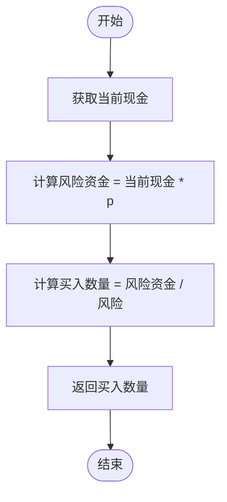
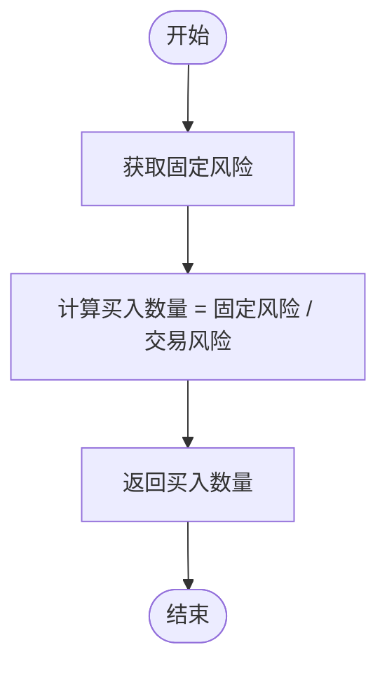
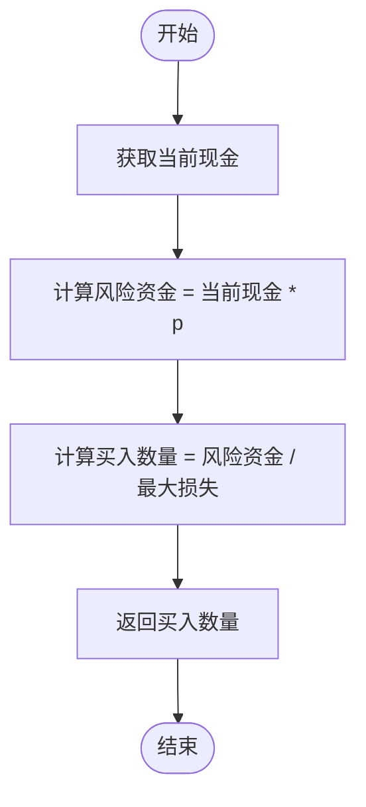
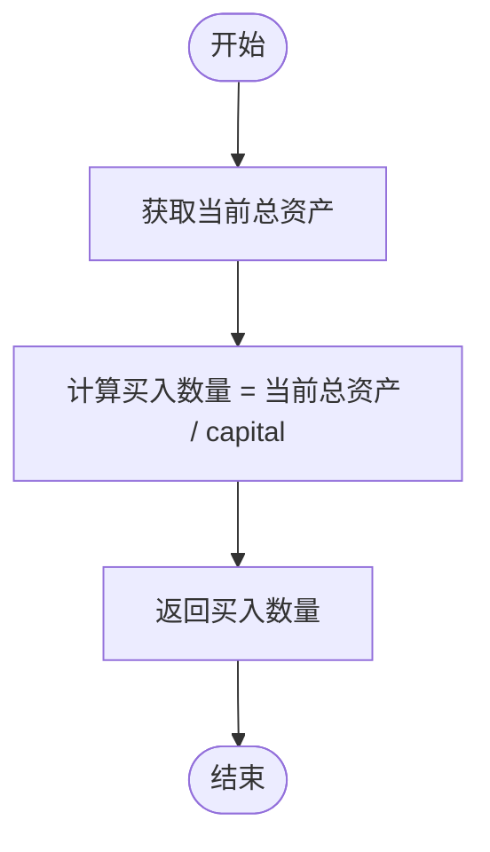
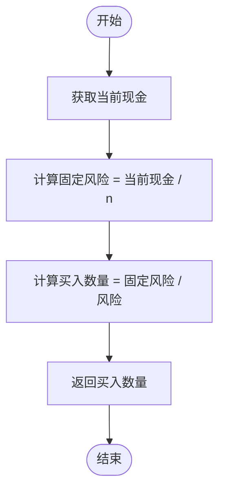

# 资金管理组件API

<cite>
**本文档引用的文件**  
- [FixedCapitalMoneyManager.cpp](file://hikyuu_cpp/hikyuu/trade_sys/moneymanager/imp/FixedCapitalMoneyManager.cpp)
- [FixedCountMoneyManager.cpp](file://hikyuu_cpp/hikyuu/trade_sys/moneymanager/imp/FixedCountMoneyManager.cpp)
- [FixedPercentMoneyManager.cpp](file://hikyuu_cpp/hikyuu/trade_sys/moneymanager/imp/FixedPercentMoneyManager.cpp)
- [FixedRiskMoneyManager.cpp](file://hikyuu_cpp/hikyuu/trade_sys/moneymanager/imp/FixedRiskMoneyManager.cpp)
- [WilliamsFixedRiskMoneyManager.cpp](file://hikyuu_cpp/hikyuu/trade_sys/moneymanager/imp/WilliamsFixedRiskMoneyManager.cpp)
- [FixedCapitalFundsMM.cpp](file://hikyuu_cpp/hikyuu/trade_sys/moneymanager/imp/FixedCapitalFundsMM.cpp)
- [FixedUnitsMoneyManager.cpp](file://hikyuu_cpp/hikyuu/trade_sys/moneymanager/imp/FixedUnitsMoneyManager.cpp)
- [MoneyManagerBase.h](file://hikyuu_cpp/hikyuu/trade_sys/moneymanager/MoneyManagerBase.h)
- [MM_FixedCapital.h](file://hikyuu_cpp/hikyuu/trade_sys/moneymanager/crt/MM_FixedCapital.h)
- [MM_FixedCount.h](file://hikyuu_cpp/hikyuu/trade_sys/moneymanager/crt/MM_FixedCount.h)
- [MM_FixedPercent.h](file://hikyuu_cpp/hikyuu/trade_sys/moneymanager/crt/MM_FixedPercent.h)
- [MM_FixedRisk.h](file://hikyuu_cpp/hikyuu/trade_sys/moneymanager/crt/MM_FixedRisk.h)
- [MM_WilliamsFixedRisk.h](file://hikyuu_cpp/hikyuu/trade_sys/moneymanager/crt/MM_WilliamsFixedRisk.h)
- [MM_FixedCapitalFunds.h](file://hikyuu_cpp/hikyuu/trade_sys/moneymanager/crt/MM_FixedCapitalFunds.h)
- [MM_FixedUnits.h](file://hikyuu_cpp/hikyuu/trade_sys/moneymanager/crt/MM_FixedUnits.h)
- [006-TradeManager.ipynb](file://hikyuu/examples/notebook/006-TradeManager.ipynb)
</cite>

## 目录
1. [简介](#简介)
2. [核心资金管理组件](#核心资金管理组件)
3. [详细组件分析](#详细组件分析)
4. [协同工作与代码示例](#协同工作与代码示例)
5. [资金分配算法与性能考量](#资金分配算法与性能考量)
6. [结论](#结论)

## 简介
资金管理组件（MoneyManager）是Hikyuu量化交易系统中的关键模块，负责在交易决策中计算可买入或卖出的交易数量。该组件通过不同的策略实现风险控制和资金分配，确保交易系统在不同市场条件下能够稳健运行。本文档详细介绍了所有可用的资金管理创建函数，包括MM_FixedCapital、MM_FixedCount、MM_FixedPercent、MM_FixedRisk和MM_WilliamsFixedRisk等，以及它们的参数、使用场景和协同工作方式。

**Section sources**
- [MoneyManagerBase.h](file://hikyuu_cpp/hikyuu/trade_sys/moneymanager/MoneyManagerBase.h)

## 核心资金管理组件
Hikyuu系统提供了多种资金管理策略，每种策略都有其特定的应用场景和计算逻辑。这些策略通过继承MoneyManagerBase基类实现，并通过特定的创建函数（如MM_FixedCapital）实例化。核心组件包括固定资本、固定股数、固定百分比、固定风险和威廉斯固定风险等策略，它们共同构成了灵活的资金管理体系。

**Section sources**
- [MoneyManagerBase.h](file://hikyuu_cpp/hikyuu/trade_sys/moneymanager/MoneyManagerBase.h)

## 详细组件分析

### MM_FixedCapital 分析
MM_FixedCapital 是一种固定资金管理策略，其核心思想是根据当前现金和预设的资本额来计算买入数量。该策略适用于希望保持固定资金投入的交易系统。


**Diagram sources**
- [FixedCapitalMoneyManager.cpp](file://hikyuu_cpp/hikyuu/trade_sys/moneymanager/imp/FixedCapitalMoneyManager.cpp)
- [MM_FixedCapital.h](file://hikyuu_cpp/hikyuu/trade_sys/moneymanager/crt/MM_FixedCapital.h)

**参数说明**
- `capital`: 固定资本额，用于计算买入数量的基准值，默认为10000.00。

**使用场景**
当交易者希望每次交易都使用固定比例的可用资金时，可以使用此策略。例如，设置capital为10000，则每次买入数量为当前现金除以10000。

**Section sources**
- [FixedCapitalMoneyManager.cpp](file://hikyuu_cpp/hikyuu/trade_sys/moneymanager/imp/FixedCapitalMoneyManager.cpp)
- [MM_FixedCapital.h](file://hikyuu_cpp/hikyuu/trade_sys/moneymanager/crt/MM_FixedCapital.h)

### MM_FixedCount 分析
MM_FixedCount 是一种固定交易数量资金管理策略，每次买入或卖出固定数量的交易对象。该策略主要用于测试和其他策略的比较。


**Diagram sources**
- [FixedCountMoneyManager.cpp](file://hikyuu_cpp/hikyuu/trade_sys/moneymanager/imp/FixedCountMoneyManager.cpp)
- [MM_FixedCount.h](file://hikyuu_cpp/hikyuu/trade_sys/moneymanager/crt/MM_FixedCount.h)

**参数说明**
- `n`: 每次买入的数量，默认为100。

**使用场景**
该策略主要用于回测和性能比较，因为它不考虑实际的资金状况，仅执行固定数量的交易。需要注意的是，该策略本身不符合现实交易逻辑，因为它不判断已有的持仓情况。

**Section sources**
- [FixedCountMoneyManager.cpp](file://hikyuu_cpp/hikyuu/trade_sys/moneymanager/imp/FixedCountMoneyManager.cpp)
- [MM_FixedCount.h](file://hikyuu_cpp/hikyuu/trade_sys/moneymanager/crt/MM_FixedCount.h)

### MM_FixedPercent 分析
MM_FixedPercent 是一种百分比风险模型，根据账户余额的百分比来分配资金。该策略参考了《通往财务自由之路》中的资金管理理念。



**Diagram sources**
- [FixedPercentMoneyManager.cpp](file://hikyuu_cpp/hikyuu/trade_sys/moneymanager/imp/FixedPercentMoneyManager.cpp)
- [MM_FixedPercent.h](file://hikyuu_cpp/hikyuu/trade_sys/moneymanager/crt/MM_FixedPercent.h)

**参数说明**
- `p`: 每笔交易总风险占总资产的百分比，如0.02表示总资产的2%。

**使用场景**
当交易者希望按账户比例分配资金时，可以使用此策略。例如，设置p为0.02，则每次交易的风险资金为当前现金的2%。

**Section sources**
- [FixedPercentMoneyManager.cpp](file://hikyuu_cpp/hikyuu/trade_sys/moneymanager/imp/FixedPercentMoneyManager.cpp)
- [MM_FixedPercent.h](file://hikyuu_cpp/hikyuu/trade_sys/moneymanager/crt/MM_FixedPercent.h)

### MM_FixedRisk 分析
MM_FixedRisk 是一种固定风险资金管理策略，对每笔交易限定一个预先确定的资金风险。该策略通过固定风险和交易风险的比值来计算买入数量。



**Diagram sources**
- [FixedRiskMoneyManager.cpp](file://hikyuu_cpp/hikyuu/trade_sys/moneymanager/imp/FixedRiskMoneyManager.cpp)
- [MM_FixedRisk.h](file://hikyuu_cpp/hikyuu/trade_sys/moneymanager/crt/MM_FixedRisk.h)

**参数说明**
- `risk`: 固定风险金额，如1000.00元。

**使用场景**
当交易者希望控制每笔交易的最大风险时，可以使用此策略。例如，设置risk为1000，则每次交易的最大风险为1000元。

**Section sources**
- [FixedRiskMoneyManager.cpp](file://hikyuu_cpp/hikyuu/trade_sys/moneymanager/imp/FixedRiskMoneyManager.cpp)
- [MM_FixedRisk.h](file://hikyuu_cpp/hikyuu/trade_sys/moneymanager/crt/MM_FixedRisk.h)

### MM_WilliamsFixedRisk 分析
MM_WilliamsFixedRisk 是一种威廉斯固定风险资金管理策略，结合了风险百分比和最大损失两个参数来计算买入数量。该策略由Larry Williams提出，强调风险控制的重要性。



**Diagram sources**
- [WilliamsFixedRiskMoneyManager.cpp](file://hikyuu_cpp/hikyuu/trade_sys/moneymanager/imp/WilliamsFixedRiskMoneyManager.cpp)
- [MM_WilliamsFixedRisk.h](file://hikyuu_cpp/hikyuu/trade_sys/moneymanager/crt/MM_WilliamsFixedRisk.h)

**参数说明**
- `p`: 风险百分比，表示账户余额中用于风险的资金比例。
- `max_loss`: 最大损失金额，表示单笔交易可能承受的最大亏损。

**使用场景**
当交易者希望同时控制风险比例和最大损失时，可以使用此策略。例如，设置p为0.1，max_loss为1000，则每次交易的风险资金为当前现金的10%，且单笔交易的最大损失不超过1000元。

**Section sources**
- [WilliamsFixedRiskMoneyManager.cpp](file://hikyuu_cpp/hikyuu/trade_sys/moneymanager/imp/WilliamsFixedRiskMoneyManager.cpp)
- [MM_WilliamsFixedRisk.h](file://hikyuu_cpp/hikyuu/trade_sys/moneymanager/crt/MM_WilliamsFixedRisk.h)

### MM_FixedCapitalFunds 分析
MM_FixedCapitalFunds 是一种固定资本资金管理策略，其计算基础是当前总资产而非现金。该策略适用于希望根据总资产进行资金分配的场景。



**Diagram sources**
- [FixedCapitalFundsMM.cpp](file://hikyuu_cpp/hikyuu/trade_sys/moneymanager/imp/FixedCapitalFundsMM.cpp)
- [MM_FixedCapitalFunds.h](file://hikyuu_cpp/hikyuu/trade_sys/moneymanager/crt/MM_FixedCapitalFunds.h)

**参数说明**
- `capital`: 固定资本额，用于计算买入数量的基准值，默认为10000.00。

**使用场景**
当交易者希望根据总资产而非现金进行资金分配时，可以使用此策略。例如，设置capital为10000，则每次买入数量为当前总资产除以10000。

**Section sources**
- [FixedCapitalFundsMM.cpp](file://hikyuu_cpp/hikyuu/trade_sys/moneymanager/imp/FixedCapitalFundsMM.cpp)
- [MM_FixedCapitalFunds.h](file://hikyuu_cpp/hikyuu/trade_sys/moneymanager/crt/MM_FixedCapitalFunds.h)

### MM_FixedUnits 分析
MM_FixedUnits 是一种固定单位资金管理策略，其计算逻辑基于当前现金、单位数和交易风险。该策略适用于希望将资金划分为固定单位进行管理的场景。



**Diagram sources**
- [FixedUnitsMoneyManager.cpp](file://hikyuu_cpp/hikyuu/trade_sys/moneymanager/imp/FixedUnitsMoneyManager.cpp)
- [MM_FixedUnits.h](file://hikyuu_cpp/hikyuu/trade_sys/moneymanager/crt/MM_FixedUnits.h)

**参数说明**
- `n`: 单位数，用于划分资金的基准值，默认为33。

**使用场景**
当交易者希望将资金划分为固定单位进行管理时，可以使用此策略。例如，设置n为33，则每次交易的风险资金为当前现金的1/33。

**Section sources**
- [FixedUnitsMoneyManager.cpp](file://hikyuu_cpp/hikyuu/trade_sys/moneymanager/imp/FixedUnitsMoneyManager.cpp)
- [MM_FixedUnits.h](file://hikyuu_cpp/hikyuu/trade_sys/moneymanager/crt/MM_FixedUnits.h)

## 协同工作与代码示例
资金管理组件通常与信号组件（Signal）和止损组件（Stoploss）协同工作，形成完整的交易系统。以下是一个使用MM_FixedCount的代码示例：

```python
# 创建模拟交易账户进行回测，初始资金30万
my_tm = crtTM(init_cash=300000, date=Datetime(201701010000))

# 创建信号指示器（以5日EMA为快线，5日EMA自身的10日EMA作为慢线，快线向上穿越慢线时买入，反之卖出）
my_sg = SG_Flex(EMA(C, n=5), slow_n=10)

# 固定每次买入1000股
my_mm = MM_FixedCount(1000)

# 创建交易系统并运行
sys = SYS_Simple(tm = my_tm, sg = my_sg, mm = my_mm)
sys.run(sm['sz000001'], Query(-150))
```

此示例展示了如何将资金管理组件与信号组件结合，形成一个简单的交易系统。在实际应用中，可以根据需要选择不同的资金管理策略，以适应不同的市场环境和交易目标。

**Section sources**
- [006-TradeManager.ipynb](file://hikyuu/examples/notebook/006-TradeManager.ipynb)

## 资金分配算法与性能考量
资金管理组件的核心是资金分配算法，其性能直接影响交易系统的整体表现。在设计和选择资金管理策略时，需要考虑以下几个方面：

1. **风险控制**：确保每笔交易的风险在可接受范围内，避免因单笔交易导致重大损失。
2. **资金利用率**：合理分配资金，提高资金的使用效率，避免资金闲置。
3. **适应性**：选择能够适应不同市场环境的资金管理策略，提高系统的鲁棒性。
4. **计算效率**：优化算法实现，减少计算开销，提高系统的响应速度。

在实际应用中，可以通过回测和实盘测试来评估不同资金管理策略的性能，并根据结果进行调整和优化。

## 结论
Hikyuu系统的资金管理组件提供了多种灵活的策略，能够满足不同交易需求。通过合理选择和配置这些策略，可以有效控制风险、提高资金利用率，并构建稳健的交易系统。在实际应用中，建议根据具体的交易目标和市场环境，选择最适合的资金管理策略，并通过持续的测试和优化来提升系统性能。