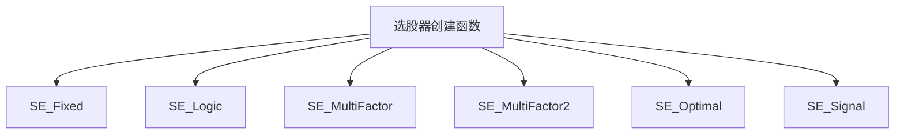
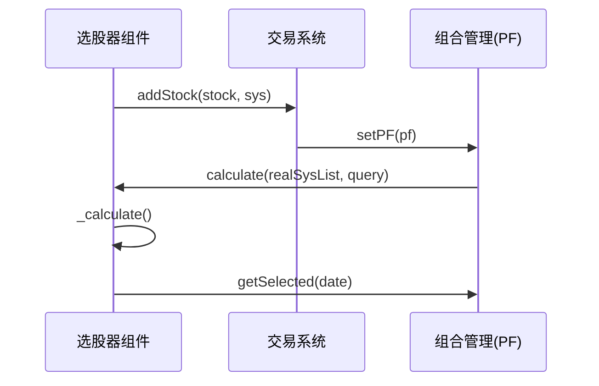

# 选股器组件API

<cite>
**本文档引用文件**  
- [SE_Fixed.h](file://hikyuu_cpp/hikyuu/trade_sys/selector/crt/SE_Fixed.h)
- [SE_Logic.h](file://hikyuu_cpp/hikyuu/trade_sys/selector/crt/SE_Logic.h)
- [SE_MultiFactor.h](file://hikyuu_cpp/hikyuu/trade_sys/selector/crt/SE_MultiFactor.h)
- [SE_MultiFactor2.h](file://hikyuu_cpp/hikyuu/trade_sys/selector/crt/SE_MultiFactor2.h)
- [SE_Optimal.h](file://hikyuu_cpp/hikyuu/trade_sys/selector/crt/SE_Optimal.h)
- [SE_Signal.h](file://hikyuu_cpp/hikyuu/trade_sys/selector/crt/SE_Signal.h)
- [SelectorBase.h](file://hikyuu_cpp/hikyuu/trade_sys/selector/SelectorBase.h)
- [SystemWeight.h](file://hikyuu_cpp/hikyuu/trade_sys/selector/SystemWeight.h)
- [_Selector.cpp](file://hikyuu_pywrap/trade_sys/_Selector.cpp)
</cite>

## 目录
1. [简介](#简介)
2. [核心选股器创建函数](#核心选股器创建函数)
3. [固定选股器（SE_Fixed）](#固定选股器se_fixed)
4. [逻辑选股器（SE_Logic）](#逻辑选股器se_logic)
5. [多因子选股器（SE_MultiFactor）](#多因子选股器se_multifactor)
6. [增强多因子选股器（SE_MultiFactor2）](#增强多因子选股器se_multifactor2)
7. [最优选股器（SE_Optimal）](#最优选股器se_optimal)
8. [信号选股器（SE_Signal）](#信号选股器se_signal)
9. [与交易系统集成](#与交易系统集成)
10. [选股频率与过滤机制](#选股频率与过滤机制)
11. [策略绩效影响](#策略绩效影响)

## 简介
选股器组件是Hikyuu量化交易系统中的核心模块，负责在指定时刻从备选标的中选择合适的交易系统。本API文档详细介绍了SE_Fixed、SE_Logic、SE_MultiFactor、SE_Optimal、SE_Signal等主要选股器的创建函数、参数说明、使用场景及集成方法。

**Section sources**
- [SelectorBase.h](file://hikyuu_cpp/hikyuu/trade_sys/selector/SelectorBase.h)

## 核心选股器创建函数
Hikyuu提供了多种选股器创建函数，每种函数针对不同的选股策略和使用场景。这些函数均返回SelectorPtr类型，可直接用于构建交易系统。

**Diagram sources**
- [SE_Fixed.h](file://hikyuu_cpp/hikyuu/trade_sys/selector/crt/SE_Fixed.h)
- [SE_Logic.h](file://hikyuu_cpp/hikyuu/trade_sys/selector/crt/SE_Logic.h)
- [SE_MultiFactor.h](file://hikyuu_cpp/hikyuu/trade_sys/selector/crt/SE_MultiFactor.h)
- [SE_MultiFactor2.h](file://hikyuu_cpp/hikyuu/trade_sys/selector/crt/SE_MultiFactor2.h)
- [SE_Optimal.h](file://hikyuu_cpp/hikyuu/trade_sys/selector/crt/SE_Optimal.h)
- [SE_Signal.h](file://hikyuu_cpp/hikyuu/trade_sys/selector/crt/SE_Signal.h)

## 固定选股器（SE_Fixed）
固定选股器用于始终选择指定的交易系统，适用于不需要动态调整持仓的策略。

### 参数说明
- **weight**: 固定权重，默认值为1.0
- **stock_list**: 指定的股票列表
- **sys**: 原型系统

### 使用场景
当策略需要长期持有特定股票组合时，使用SE_Fixed可以确保这些股票始终被选中。

**Section sources**
- [SE_Fixed.h](file://hikyuu_cpp/hikyuu/trade_sys/selector/crt/SE_Fixed.h)

## 逻辑选股器（SE_Logic）
逻辑选股器通过逻辑运算符组合多个选股器，实现复杂的选股逻辑。

### 参数说明
支持以下逻辑运算符：
- **+**: 逻辑或（并集）
- **-**: 减法运算
- **\***: 逻辑与（交集）
- **/**: 除法运算
- **&**: 逻辑与
- **|**: 逻辑或

### 使用场景
当需要组合多个选股条件时，如"同时满足价值和成长条件的股票"，可使用SE_Logic进行逻辑组合。

**Section sources**
- [SE_Logic.h](file://hikyuu_cpp/hikyuu/trade_sys/selector/crt/SE_Logic.h)

## 多因子选股器（SE_MultiFactor）
多因子选股器基于多因子评分模型选择股票，是量化投资中最常用的选股方法之一。

### 参数说明
- **mf**: 直接指定的多因子合成算法
- **topn**: 选取时间截面中前topn个系统
- **src_inds**: 原始因子公式列表
- **ic_n**: IC对应的N日收益率
- **ic_rolling_n**: IC滚动周期
- **ref_stk**: 参照对比证券，默认为sh000300沪深300指数
- **spearman**: 是否使用spearman计算相关系数
- **mode**: 因子合成算法名称，可选"MF_ICIRWeight"、"MF_ICWeight"、"MF_EqualWeight"

### 使用场景
SE_MultiFactor适用于基于多因子模型的选股策略，如价值、成长、动量等因子的综合评分选股。

**Section sources**
- [SE_MultiFactor.h](file://hikyuu_cpp/hikyuu/trade_sys/selector/crt/SE_MultiFactor.h)

## 增强多因子选股器（SE_MultiFactor2）
增强多因子选股器在SE_MultiFactor基础上增加了评分过滤功能，提供了更精细的控制。

### 参数说明
- **filter**: 评分记录过滤器，默认为SCFilter_IgnoreNan()

### 使用场景
当需要对多因子评分结果进行额外过滤时，如排除评分为空的股票，应使用SE_MultiFactor2。

**Section sources**
- [SE_MultiFactor2.h](file://hikyuu_cpp/hikyuu/trade_sys/selector/crt/SE_MultiFactor2.h)

## 最优选股器（SE_Optimal）
最优选股器基于绩效评估选择最优的交易系统，适用于需要动态优化的策略。

### 参数说明
- **SE_MaxFundsOptimal**: 账户资产最大寻优选择器
- **SE_PerformanceOptimal**: 使用Performance统计结果进行寻优的选择器
  - **key**: Performance统计项
  - **mode**: 0取最大值，1取最小值
- **SE_EvaluateOptimal**: 使用自定义评估函数进行寻优的选择器
  - **evaluate**: 评估函数，接收(sys, lastdate)参数，返回float数值

### 使用场景
SE_Optimal适用于需要根据历史绩效动态选择最优策略的场景，如策略轮动、参数优化等。

**Section sources**
- [SE_Optimal.h](file://hikyuu_cpp/hikyuu/trade_sys/selector/crt/SE_Optimal.h)

## 信号选股器（SE_Signal）
信号选股器仅依靠系统买入信号进行选中，适用于基于技术信号的交易策略。

### 参数说明
- **stock_list**: 股票列表
- **sys**: 原型系统

### 使用场景
当策略完全基于技术指标信号（如均线金叉、MACD金叉等）进行交易时，使用SE_Signal可以确保只有发出买入信号的股票被选中。

**Section sources**
- [SE_Signal.h](file://hikyuu_cpp/hikyuu/trade_sys/selector/crt/SE_Signal.h)

## 与交易系统集成
选股器组件需要与交易系统集成才能发挥作用。以下是集成的基本流程：

**Diagram sources**
- [SelectorBase.h](file://hikyuu_cpp/hikyuu/trade_sys/selector/SelectorBase.h)
- [_Selector.cpp](file://hikyuu_pywrap/trade_sys/_Selector.cpp)

## 选股频率与过滤机制
选股频率和过滤机制对策略绩效有重要影响。

### 选股频率
- **日频**: 每日收盘前进行选股
- **周频**: 每周最后一个交易日进行选股
- **月频**: 每月最后一个交易日进行选股

### 过滤机制
- **ScoresFilter**: 对多因子评分结果进行过滤
- **SCFilter_IgnoreNan**: 忽略评分为NaN的股票
- 自定义过滤器: 可根据特定条件实现自定义过滤

**Section sources**
- [SelectorBase.h](file://hikyuu_cpp/hikyuu/trade_sys/selector/SelectorBase.h)
- [SE_MultiFactor2.h](file://hikyuu_cpp/hikyuu/trade_sys/selector/crt/SE_MultiFactor2.h)

## 策略绩效影响
选股器的选择直接影响策略的最终绩效。

### 影响因素
- **选股逻辑**: 不同的选股逻辑会导致不同的持仓组合
- **选股频率**: 高频选股可能增加交易成本，低频选股可能错过市场机会
- **过滤机制**: 严格的过滤可能减少候选股票数量，宽松的过滤可能增加风险

### 优化建议
- 根据策略目标选择合适的选股器
- 通过回测验证不同选股参数的绩效表现
- 考虑交易成本对高频选股的影响

**Section sources**
- [SelectorBase.h](file://hikyuu_cpp/hikyuu/trade_sys/selector/SelectorBase.h)
- [SE_Optimal.h](file://hikyuu_cpp/hikyuu/trade_sys/selector/crt/SE_Optimal.h)