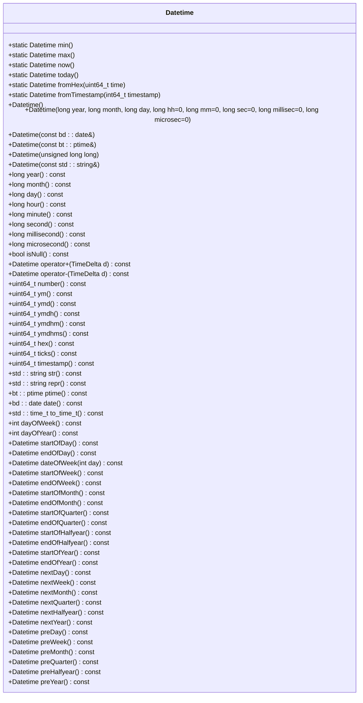
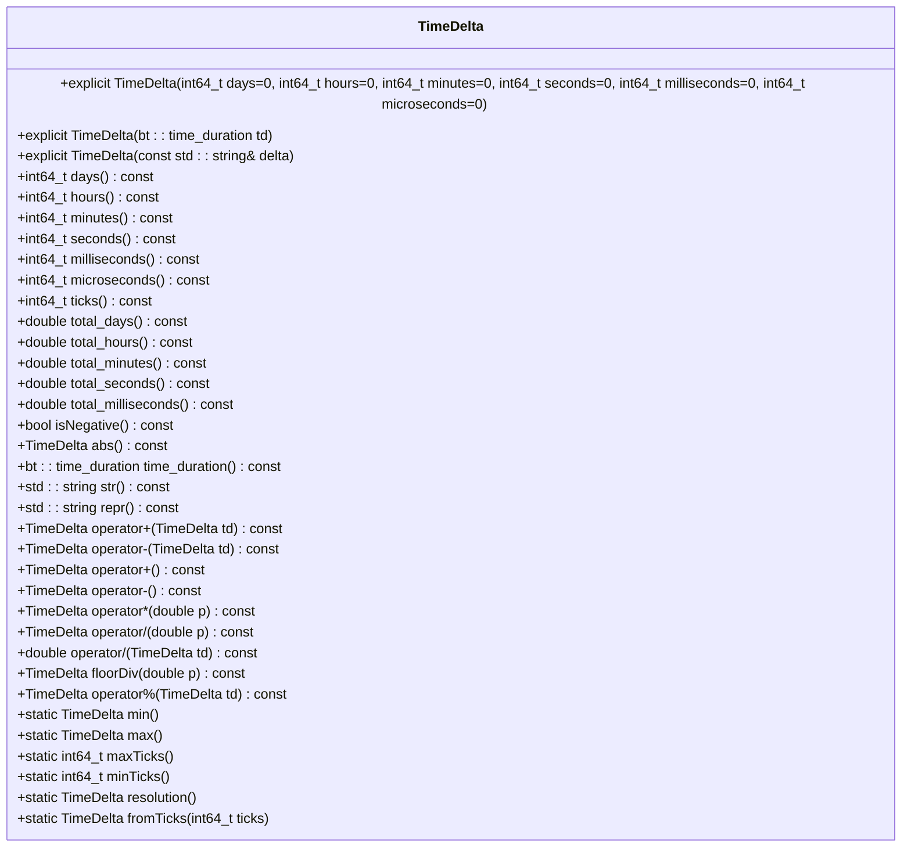
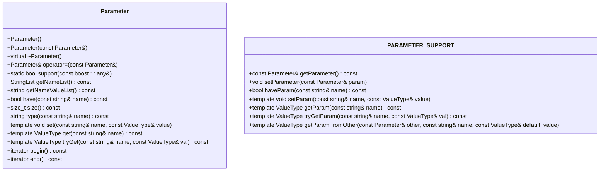
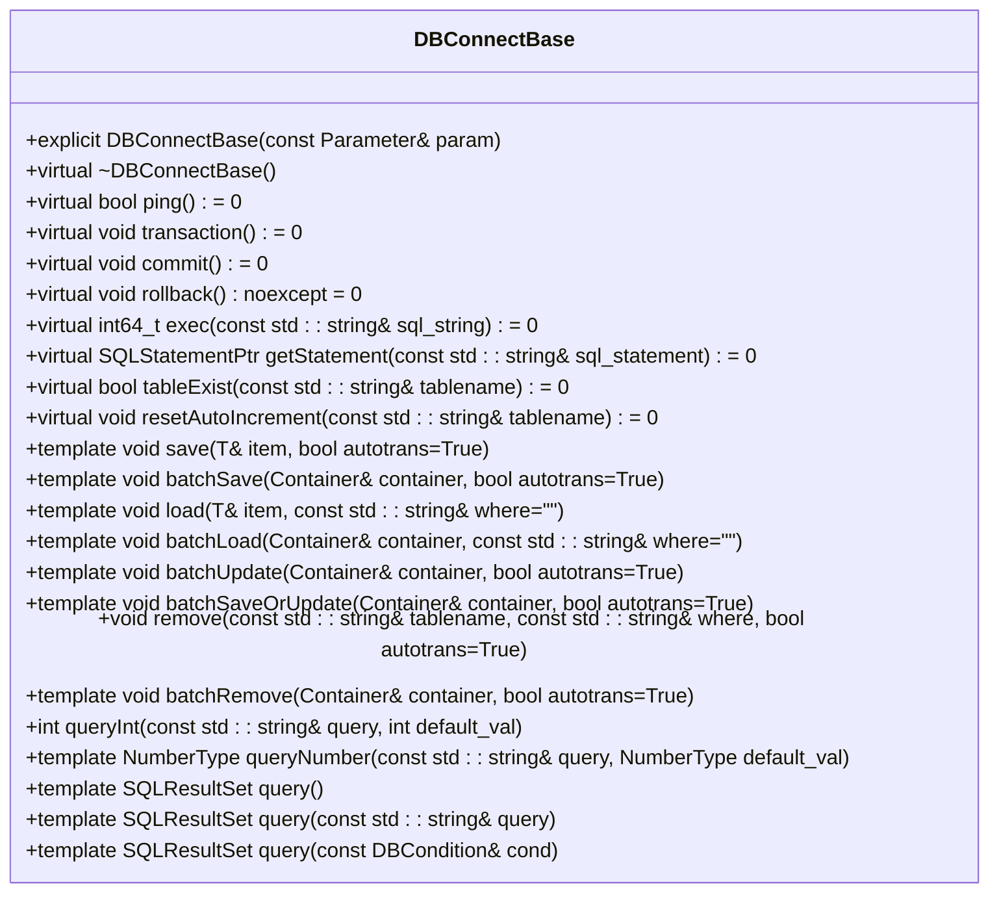
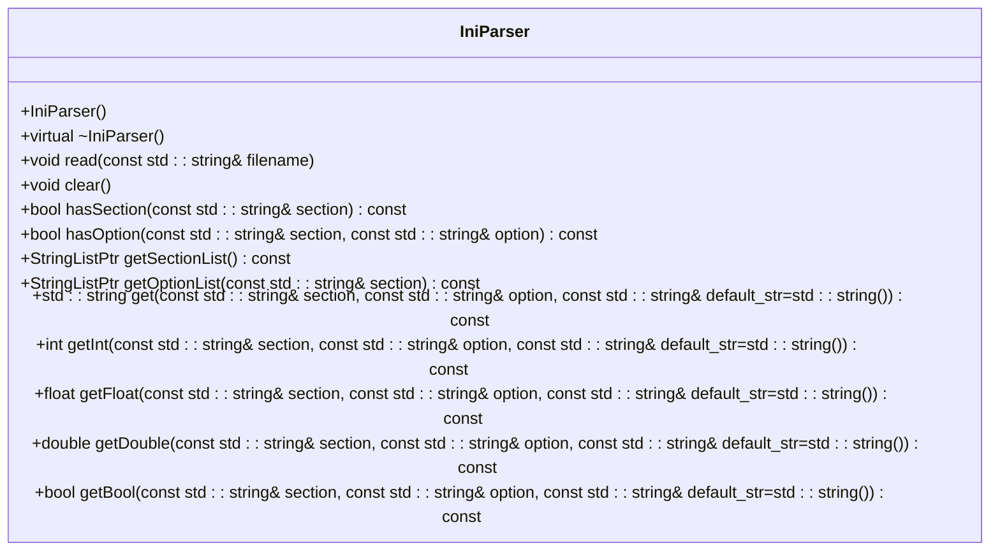
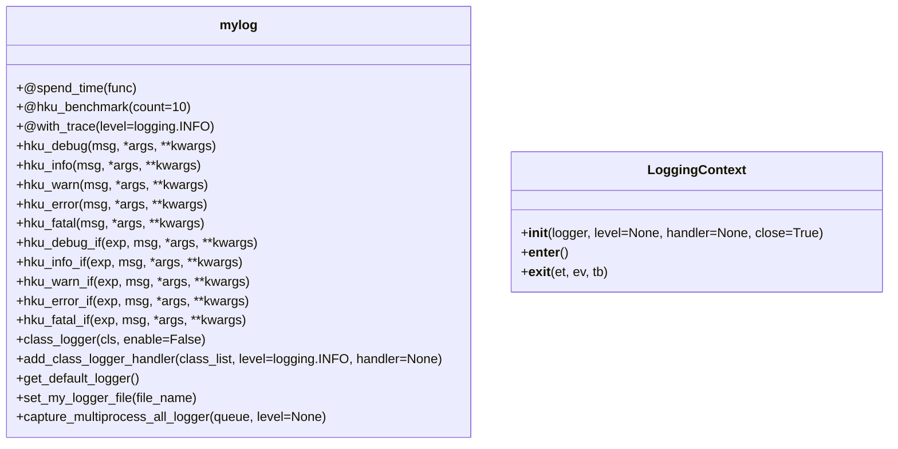

# 工具与辅助API

<cite>
**本文档中引用的文件**   
- [mylog.py](file://hikyuu/util/mylog.py)
- [Datetime.h](file://hikyuu_cpp/hikyuu/utilities/datetime/Datetime.h)
- [TimeDelta.h](file://hikyuu_cpp/hikyuu/utilities/datetime/TimeDelta.h)
- [Parameter.h](file://hikyuu_cpp/hikyuu/utilities/Parameter.h)
- [IniParser.h](file://hikyuu_cpp/hikyuu/utilities/ini_parser/IniParser.h)
- [DBConnectBase.h](file://hikyuu_cpp/hikyuu/utilities/db_connect/DBConnectBase.h)
</cite>

## 目录
1. [简介](#简介)
2. [日期时间处理工具](#日期时间处理工具)
3. [参数管理工具](#参数管理工具)
4. [数据库连接工具](#数据库连接工具)
5. [配置文件解析工具](#配置文件解析工具)
6. [日志记录工具](#日志记录工具)
7. [实际使用示例](#实际使用示例)

## 简介
本文档详细介绍了Hikyuu量化分析系统中的核心辅助工具与API，包括日期时间处理、参数管理、数据库连接、配置文件解析和日志记录等功能。这些工具为策略开发提供了基础支持，使开发者能够更高效地处理数据、管理配置和调试程序。

**Section sources**
- [mylog.py](file://hikyuu/util/mylog.py#L1-L292)
- [Datetime.h](file://hikyuu_cpp/hikyuu/utilities/datetime/Datetime.h#L1-L461)

## 日期时间处理工具

### Datetime类
Datetime类提供了完整的日期时间处理功能，支持从多种格式创建日期时间对象，并提供丰富的日期运算和格式化方法。

**核心功能：**
- **构造函数**：支持通过年月日时分秒、boost::gregorian::date、boost::posix_time::ptime、数字格式（YYYYMMDDhhmm）和字符串格式创建Datetime对象
- **静态方法**：
  - `min()`：返回可表示的最小日期（1400-01-01 00:00:00）
  - `max()`：返回可表示的最大日期（9999-12-31 00:00:00）
  - `now()`：返回本地计算机当前时刻
  - `today()`：返回本地计算机今日日期
  - `fromHex()`：从Oracle兼容的十六进制格式创建Datetime对象
  - `fromTimestamp()`：从微秒级别的时间戳创建Datetime对象
- **日期运算**：支持与TimeDelta对象进行加减运算
- **格式化方法**：
  - `str()`：转换为可读字符串格式
  - `repr()`：转换为Python风格的表示字符串
  - `number()`：返回YYYYMMDDhhmm格式的数字，便于比较
  - `ymd()`：返回YYYYMMDD格式的数字
- **日期范围方法**：
  - `startOfDay()`：返回当日起始时间（0点）
  - `endOfDay()`：返回当日结束时间（23:59:59）
  - `startOfWeek()`：返回周起始日期（周一）
  - `endOfWeek()`：返回周结束日期（周日）
  - `startOfMonth()`：返回月度起始日期
  - `endOfMonth()`：返回月末日期
  - `startOfYear()`：返回年度起始日期
  - `endOfYear()`：返回年度结束日期
  - `nextDay()`：返回下一自然日
  - `preDay()`：返回上一自然日



**Diagram sources**
- [Datetime.h](file://hikyuu_cpp/hikyuu/utilities/datetime/Datetime.h#L45-L311)

### TimeDelta类
TimeDelta类用于表示时间间隔，支持各种时间单位的计算和转换。

**核心功能：**
- **构造函数**：支持通过天数、小时数、分钟数、秒数、毫秒数和微秒数创建TimeDelta对象
- **获取方法**：
  - `days()`：获取规范化后的天数
  - `hours()`：获取规范化后的小时数[0,23]
  - `minutes()`：获取规范化后的分钟数[0,59]
  - `seconds()`：获取规范化后的秒数[0,59]
  - `milliseconds()`：获取规范化后的毫秒数[0,999]
  - `microseconds()`：获取规范化后的微秒数[0,999]
  - `ticks()`：获取总微秒数
- **转换方法**：
  - `total_days()`：返回带小数的总天数
  - `total_hours()`：返回带小数的总小时数
  - `total_minutes()`：返回带小数的总分钟数
  - `total_seconds()`：返回带小数的总秒数
  - `total_milliseconds()`：返回带小数的总毫秒数
- **运算符重载**：
  - `+`：两个时长相加
  - `-`：两个时长相减
  - `*`：时长乘以系数
  - `/`：时长除以系数
  - `%`：两个时长相除求余
- **静态方法**：
  - `min()`：获取能够表达的最小值
  - `max()`：获取能够表达的最大值
  - `resolution()`：获取表达精度（1微秒）
  - `fromTicks()`：从ticks创建TimeDelta对象

**便捷创建函数：**
- `Days(int64_t days)`：创建指定天数的TimeDelta
- `Hours(int64_t hours)`：创建指定小时数的TimeDelta
- `Minutes(int64_t mins)`：创建指定分钟数的TimeDelta
- `Seconds(int64_t secs)`：创建指定秒数的TimeDelta
- `Milliseconds(int64_t milliseconds)`：创建指定毫秒数的TimeDelta
- `Microseconds(int64_t microsecs)`：创建指定微秒数的TimeDelta



**Diagram sources**
- [TimeDelta.h](file://hikyuu_cpp/hikyuu/utilities/datetime/TimeDelta.h#L36-L263)

### 日期时间处理示例
```python
# 创建当前时间
now = Datetime.now()

# 创建指定日期
date = Datetime(2023, 12, 25)

# 从字符串创建
date_str = Datetime("2023-12-25 10:30:00")

# 日期加减运算
tomorrow = now + Days(1)
yesterday = now - Days(1)
one_hour_later = now + Hours(1)

# 获取日期范围
start_of_month = now.startOfMonth()
end_of_month = now.endOfMonth()

# 获取时间差
diff = tomorrow - now  # 返回TimeDelta对象
print(diff.days())  # 输出: 1
```

**Section sources**
- [Datetime.h](file://hikyuu_cpp/hikyuu/utilities/datetime/Datetime.h#L45-L461)
- [TimeDelta.h](file://hikyuu_cpp/hikyuu/utilities/datetime/TimeDelta.h#L36-L357)

## 参数管理工具

### Parameter类
Parameter类提供了一个通用的参数管理框架，支持多种数据类型的参数存储和检索。

**核心功能：**
- **参数类型支持**：
  - 基本类型：int、int64_t、bool、double
  - 字符串类型：string
  - Hikyuu特定类型：Stock、Block、KQuery、KData、PriceList、DatetimeList
- **核心方法**：
  - `set(name, value)`：设置参数值，已存在则修改，不存在则新增
  - `get(name)`：获取指定参数值，参数不存在或类型不匹配时抛出异常
  - `tryGet(name, default_val)`：尝试获取参数值，失败时返回默认值
  - `have(name)`：检查参数是否存在
  - `size()`：获取参数个数
  - `getNameList()`：获取所有参数名称列表
  - `getNameValueList()`：返回"name1=val1,name2=val2,..."格式的字符串
  - `type(name)`：获取指定参数的实际类型
- **比较操作**：
  - `==`：参数完全相等（名称、类型、值都相同）
  - `!=`：参数不相等
  - `<`：按名称值对字符串进行比较

**宏定义：**
- `PARAMETER_SUPPORT`：为类添加参数支持功能，自动生成以下方法：
  - `getParameter()`：获取参数对象
  - `setParameter(param)`：设置参数对象
  - `haveParam(name)`：检查参数是否存在
  - `setParam(name, value)`：设置参数值
  - `getParam(name)`：获取参数值
  - `tryGetParam(name, default_val)`：尝试获取参数值
- `PARAMETER_SUPPORT_WITH_CHECK`：带参数检查的参数支持，额外提供参数变化通知功能



**Diagram sources**
- [Parameter.h](file://hikyuu_cpp/hikyuu/utilities/Parameter.h#L106-L512)

### 参数管理使用示例
```python
# 创建参数对象
param = Parameter()

# 设置参数
param.set("n", 10)
param.set("threshold", 0.8)
param.set("enabled", True)
param.set("name", "strategy1")

# 获取参数
n = param.get("n")
threshold = param.get("threshold")
enabled = param.get("enabled")
name = param.get("name")

# 尝试获取参数（带默认值）
period = param.tryGet("period", 20)  # 如果period不存在，返回20

# 检查参数是否存在
if param.have("debug"):
    debug_mode = param.get("debug")

# 获取所有参数名称
names = param.getNameList()

# 在类中使用参数支持
class MyStrategy:
    PARAMETER_SUPPORT  # 添加参数支持
    
    def __init__(self):
        # 初始化参数
        self.setParam("n", 10)
        self.setParam("threshold", 0.8)
    
    def calculate(self):
        # 获取参数
        n = self.getParam("n")
        threshold = self.getParam("threshold")
        # ... 策略计算逻辑
```

**Section sources**
- [Parameter.h](file://hikyuu_cpp/hikyuu/utilities/Parameter.h#L106-L512)
- [Parameter.cpp](file://hikyuu_cpp/hikyuu/utilities/Parameter.cpp#L1-L252)

## 数据库连接工具

### DBConnectBase类
DBConnectBase是数据库连接的基类，提供了统一的数据库操作接口。

**核心功能：**
- **构造函数**：接受Parameter对象作为连接参数
- **连接管理**：
  - `ping()`：检查连接状态
  - `transaction()`：开始事务
  - `commit()`：提交事务
  - `rollback()`：回滚事务
- **SQL执行**：
  - `exec(sql_string)`：执行无返回结果的SQL语句
  - `getStatement(sql_statement)`：获取SQLStatement对象
- **表操作**：
  - `tableExist(tablename)`：检查表是否存在
  - `resetAutoIncrement(tablename)`：重置自增ID
- **数据操作模板方法**：
  - `save(item, autotrans=True)`：保存或更新单个记录
  - `batchSave(container, autotrans=True)`：批量保存记录
  - `load(item, where="")`：加载单个记录
  - `batchLoad(container, where="")`：批量加载记录
  - `batchUpdate(container, autotrans=True)`：批量更新记录
  - `batchSaveOrUpdate(container, autotrans=True)`：批量保存或更新记录
  - `remove(tablename, where, autotrans=True)`：删除记录
  - `batchRemove(container, autotrans=True)`：批量删除记录
- **查询方法**：
  - `queryInt(query, default_val)`：查询单个整数
  - `queryNumber(query, default_val)`：查询单个数值
  - `query<TableT, page_size>()`：分页查询



**Diagram sources**
- [DBConnectBase.h](file://hikyuu_cpp/hikyuu/utilities/db_connect/DBConnectBase.h#L28-L658)

### 具体数据库实现
- **MySQLConnect**：MySQL数据库连接实现
- **SQLiteConnect**：SQLite数据库连接实现

**连接参数：**
- MySQL连接需要提供：host、port、user、password、database等参数
- SQLite连接需要提供：db（数据库文件路径）参数

### 数据库操作示例
```python
# 创建参数对象
param = Parameter()
param.set("db", "data.db")  # SQLite数据库文件路径

# 创建数据库连接
driver = SQLiteConnect(param)

# 执行SQL语句
driver.exec("CREATE TABLE IF NOT EXISTS users (id INTEGER PRIMARY KEY, name TEXT, age INTEGER)")

# 插入数据
driver.exec("INSERT INTO users (name, age) VALUES ('Alice', 25)")

# 查询数据
result = driver.queryInt("SELECT COUNT(*) FROM users", 0)
print(f"用户总数: {result}")

# 使用分页查询
class User:
    TABLE_BIND(User, users, id, name, age)  # 绑定表结构
    
    def __init__(self):
        self.id = 0
        self.name = ""
        self.age = 0

# 批量加载数据
users = []
driver.batchLoad(users, "age > 18")

# 保存数据
user = User()
user.name = "Bob"
user.age = 30
driver.save(user)

# 批量保存
user_list = [user1, user2, user3]
driver.batchSave(user_list)
```

**Section sources**
- [DBConnectBase.h](file://hikyuu_cpp/hikyuu/utilities/db_connect/DBConnectBase.h#L28-L658)
- [DBConnect.h](file://hikyuu_cpp/hikyuu/utilities/db_connect/DBConnect.h#L1-L30)

## 配置文件解析工具

### IniParser类
IniParser类用于解析INI格式的配置文件，支持标准的INI文件格式。

**核心功能：**
- **文件操作**：
  - `read(filename)`：读取并解析指定的INI文件
  - `clear()`：清除已读入的信息
- **节（Section）操作**：
  - `hasSection(section)`：判断指定的节是否存在
  - `getSectionList()`：获取所有节的列表
- **选项（Option）操作**：
  - `hasOption(section, option)`：判断指定的选项是否存在
  - `getOptionList(section)`：获取指定节下的所有选项列表
  - `get(section, option, default_str)`：获取指定选项的字符串值
  - `getInt(section, option, default_str)`：获取指定选项的整数值
  - `getFloat(section, option, default_str)`：获取指定选项的浮点数值
  - `getDouble(section, option, default_str)`：获取指定选项的双精度浮点数值
  - `getBool(section, option, default_str)`：获取指定选项的布尔值

**INI文件格式：**
```
[section1]
; 第一段
key1 = value1
key2 = value2

[section2]
; 第二段
key1 = value1 ; 注释1
key2 = value2 ; 注释2
```

**注意事项：**
- 同一个节可以在不同位置定义，但如果包含同名的选项，则该选项的值为最后读入的值
- 对于配置信息分散在多个文件中的情况，可以通过多次调用read方法全部读入后统一处理
- 该类目前不支持复制操作



**Diagram sources**
- [IniParser.h](file://hikyuu_cpp/hikyuu/utilities/ini_parser/IniParser.h#L60-L100)
- [IniParser.cpp](file://hikyuu_cpp/hikyuu/utilities/ini_parser/IniParser.cpp#L1-L386)

### 配置文件解析示例
```python
# 创建IniParser对象
parser = IniParser()

# 读取配置文件
parser.read("config.ini")

# 检查节是否存在
if parser.hasSection("database"):
    print("数据库配置存在")

# 获取字符串值
host = parser.get("database", "host", "localhost")
database_name = parser.get("database", "name", "test")

# 获取整数值
port = parser.getInt("database", "port", 3306)

# 获取浮点数值
timeout = parser.getDouble("database", "timeout", 30.0)

# 获取布尔值
debug = parser.getBool("application", "debug", False)

# 获取所有节
sections = parser.getSectionList()
for section in sections:
    print(f"节: {section}")

# 获取指定节的所有选项
options = parser.getOptionList("database")
for option in options:
    value = parser.get("database", option)
    print(f"{option} = {value}")
```

**Section sources**
- [IniParser.h](file://hikyuu_cpp/hikyuu/utilities/ini_parser/IniParser.h#L60-L100)
- [IniParser.cpp](file://hikyuu_cpp/hikyuu/utilities/ini_parser/IniParser.cpp#L1-L386)

## 日志记录工具

### mylog模块
mylog模块提供了完整的日志记录功能，包括函数运行时间统计、日志级别控制和多进程日志处理。

**核心功能：**
- **装饰器函数**：
  - `spend_time(func)`：统计函数运行时间
  - `hku_benchmark(count=10)`：对函数进行基准测试
  - `with_trace(level=logging.INFO)`：跟踪函数运行
- **日志级别函数**：
  - `hku_debug(msg, *args, **kwargs)`：调试级别日志
  - `hku_info(msg, *args, **kwargs)`：信息级别日志
  - `hku_warn(msg, *args, **kwargs)`：警告级别日志
  - `hku_error(msg, *args, **kwargs)`：错误级别日志
  - `hku_fatal(msg, *args, **kwargs)`：致命错误级别日志
- **条件日志函数**：
  - `hku_debug_if(exp, msg, *args, **kwargs)`：条件调试日志
  - `hku_info_if(exp, msg, *args, **kwargs)`：条件信息日志
  - `hku_warn_if(exp, msg, *args, **kwargs)`：条件警告日志
  - `hku_error_if(exp, msg, *args, **kwargs)`：条件错误日志
  - `hku_fatal_if(exp, msg, *args, **kwargs)`：条件致命错误日志
- **类日志支持**：
  - `class_logger(cls, enable=False)`：为类添加日志支持
  - `add_class_logger_handler(class_list, level=logging.INFO, handler=None)`：为类列表添加日志处理器
- **工具函数**：
  - `get_default_logger()`：获取默认日志记录器
  - `set_my_logger_file(file_name)`：设置日志文件
  - `capture_multiprocess_all_logger(queue, level=None)`：捕获所有子进程的日志到指定队列

**日志格式：**
```
YYYY-MM-DD HH:MM:SS,mmm [LEVEL] message [logger_name::function_name]
```

**日志文件：**
- 默认日志文件位于用户主目录下的`.hikyuu/hikyuu_py.log`
- 使用RotatingFileHandler，最大文件大小10KB，保留3个备份



**Diagram sources**
- [mylog.py](file://hikyuu/util/mylog.py#L1-L292)

### 日志记录使用示例
```python
import mylog

# 使用spend_time装饰器统计函数运行时间
@mylog.spend_time
def calculate():
    # 模拟计算过程
    import time
    time.sleep(1)
    return "计算完成"

# 使用hku_benchmark进行基准测试
@mylog.hku_benchmark(count=5)
def benchmark_function():
    return sum(range(1000000))

# 记录不同级别的日志
mylog.hku_info("程序开始运行")
mylog.hku_debug("调试信息: 变量值 = {}", 123)
mylog.hku_warn("警告: 数据可能不完整")
mylog.hku_error("错误: 文件读取失败")
mylog.hku_fatal("致命错误: 系统无法继续运行")

# 条件日志记录
debug_mode = True
mylog.hku_debug_if(debug_mode, "调试模式已启用")

# 为类添加日志支持
class MyClass:
    def __init__(self):
        mylog.class_logger(self, 'debug')
    
    def process(self):
        self.logger.debug("开始处理")
        # 处理逻辑
        self.logger.info("处理完成")

# 临时改变日志级别
logger = mylog.get_default_logger()
with mylog.LoggingContext(logger, level=logging.DEBUG):
    mylog.hku_debug("这是一条调试信息")
# 离开上下文后，日志级别恢复原状
```

**Section sources**
- [mylog.py](file://hikyuu/util/mylog.py#L1-L292)

## 实际使用示例

### 策略开发中的工具使用
在策略开发中，这些工具可以组合使用，提高开发效率和代码质量。

```python
import mylog
from hikyuu import Datetime, Days, Parameter, IniParser

# 1. 配置文件解析
def load_config():
    """加载配置文件"""
    parser = IniParser()
    parser.read("strategy_config.ini")
    
    # 获取策略参数
    period = parser.getInt("strategy", "period", 20)
    threshold = parser.getDouble("strategy", "threshold", 0.8)
    debug = parser.getBool("strategy", "debug", False)
    
    # 创建参数对象
    param = Parameter()
    param.set("period", period)
    param.set("threshold", threshold)
    param.set("debug", debug)
    
    return param

# 2. 策略类实现
class MyStrategy:
    PARAMETER_SUPPORT  # 启用参数支持
    
    def __init__(self):
        # 初始化参数
        self.setParam("period", 20)
        self.setParam("threshold", 0.8)
        self.setParam("debug", False)
        
        # 启用类日志
        mylog.class_logger(self, 'debug' if self.getParam("debug") else 'info')
    
    @mylog.with_trace()
    def calculate(self, data):
        """计算策略信号"""
        period = self.getParam("period")
        threshold = self.getParam("threshold")
        
        # 记录调试信息
        self.logger.debug("计算周期: {}, 阈值: {}", period, threshold)
        
        # 策略计算逻辑
        if len(data) < period:
            return None
            
        # 计算移动平均
        ma = sum(data[-period:]) / period
        current_price = data[-1]
        
        # 生成信号
        if current_price > ma * (1 + threshold):
            signal = "BUY"
        elif current_price < ma * (1 - threshold):
            signal = "SELL"
        else:
            signal = "HOLD"
            
        self.logger.info("信号: {}, 当前价格: {}, 移动平均: {}", signal, current_price, ma)
        return signal

# 3. 主程序
@mylog.spend_time
def main():
    """主程序"""
    mylog.hku_info("策略程序开始运行")
    
    # 加载配置
    param = load_config()
    
    # 创建策略实例
    strategy = MyStrategy()
    strategy.setParameter(param)
    
    # 模拟数据
    data = [100, 102, 101, 105, 107, 110, 112, 115, 118, 120]
    
    # 计算信号
    signal = strategy.calculate(data)
    mylog.hku_info("最终信号: {}", signal)
    
    mylog.hku_info("策略程序运行结束")

if __name__ == "__main__":
    main()
```

### 配置文件示例 (strategy_config.ini)
```
[strategy]
; 策略参数配置
period = 10
threshold = 0.1
debug = true

[database]
; 数据库配置
host = localhost
port = 3306
name = stock_data
user = trader
password = secret

[logging]
; 日志配置
level = debug
file = strategy.log
```

### 日期时间处理示例
```python
# 日期时间处理在策略中的应用
def get_trading_dates(start_date, end_date):
    """获取交易日列表"""
    start = Datetime(start_date)
    end = Datetime(end_date)
    
    # 获取日期范围
    dates = []
    current = start
    while current <= end:
        # 排除周末（周六=6, 周日=0）
        if current.dayOfWeek() not in [0, 6]:
            dates.append(current)
        current = current.nextDay()
    
    return dates

# 使用示例
trading_days = get_trading_dates("2023-01-01", "2023-01-31")
for day in trading_days:
    print(day.str())
```

**Section sources**
- [mylog.py](file://hikyuu/util/mylog.py#L1-L292)
- [Datetime.h](file://hikyuu_cpp/hikyuu/utilities/datetime/Datetime.h#L45-L461)
- [Parameter.h](file://hikyuu_cpp/hikyuu/utilities/Parameter.h#L106-L512)
- [IniParser.h](file://hikyuu_cpp/hikyuu/utilities/ini_parser/IniParser.h#L60-L100)