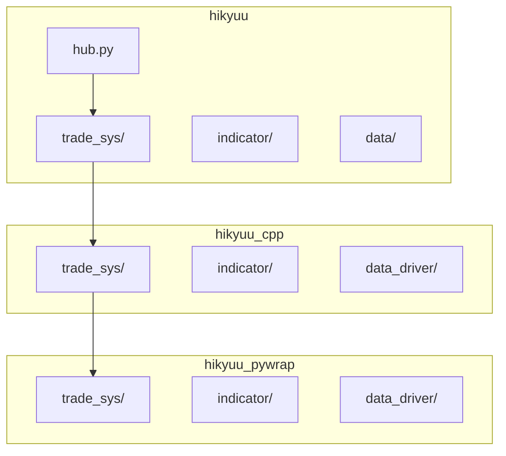
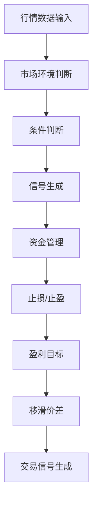
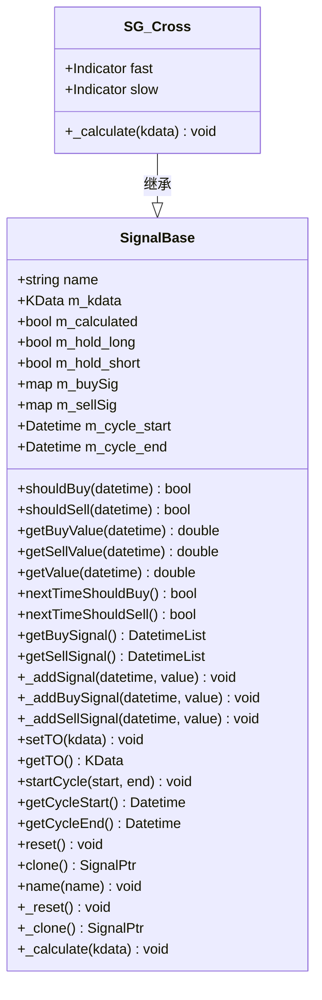
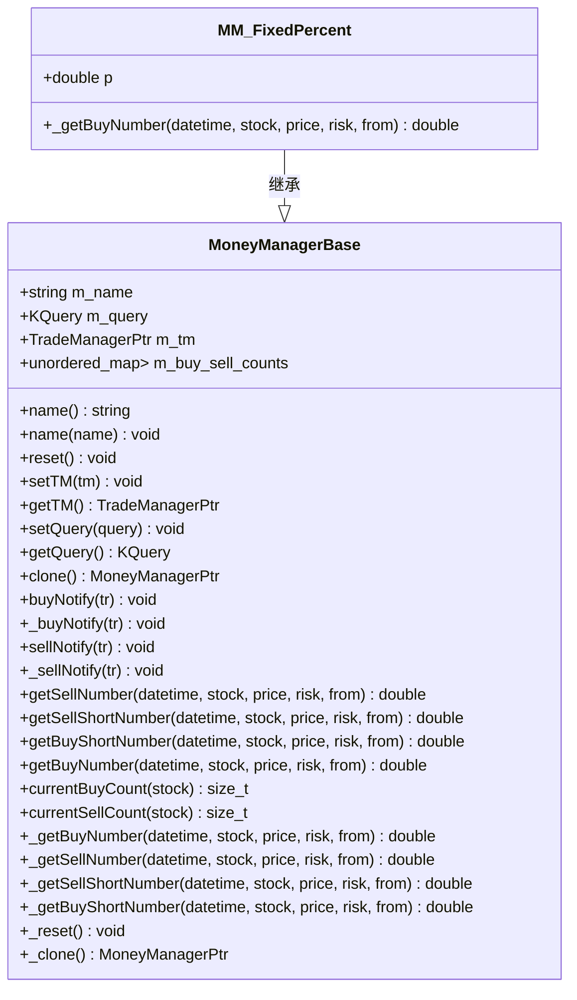
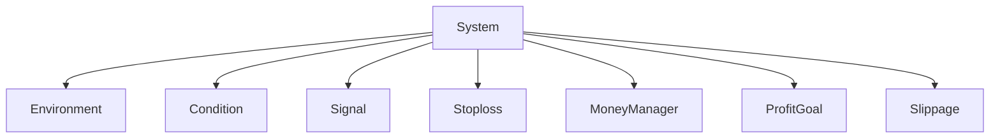

# 交易系统框架

<cite>
**本文档引用的文件**
- [hub.py](file://hikyuu/hub.py)
- [trade_sys.py](file://hikyuu/trade_sys/trade_sys.py)
- [System.cpp](file://hikyuu_cpp/hikyuu/trade_sys/system/System.cpp)
- [System.h](file://hikyuu_cpp/hikyuu/trade_sys/system/System.h)
- [SignalBase.h](file://hikyuu_cpp/hikyuu/trade_sys/signal/SignalBase.h)
- [MoneyManagerBase.h](file://hikyuu_cpp/hikyuu/trade_sys/moneymanager/MoneyManagerBase.h)
- [SG_Cross.h](file://hikyuu_cpp/hikyuu/trade_sys/signal/crt/SG_Cross.h)
- [MM_FixedPercent.h](file://hikyuu_cpp/hikyuu/trade_sys/moneymanager/crt/MM_FixedPercent.h)
</cite>

## 目录
1. [简介](#简介)
2. [项目结构](#项目结构)
3. [核心组件](#核心组件)
4. [架构概述](#架构概述)
5. [详细组件分析](#详细组件分析)
6. [依赖分析](#依赖分析)
7. [性能考虑](#性能考虑)
8. [故障排除指南](#故障排除指南)
9. [结论](#结论)
10. [附录](#附录)（如有必要）

## 简介
本文档系统性地文档化了Hikyuu交易系统框架的组件化架构。该框架将一个完整的交易策略分解为多个独立的部件，包括市场环境（Environment）、条件（Condition）、信号指示器（Signal）、止损/止盈（Stoploss）、资金管理（MoneyManager）、盈利目标（ProfitGoal）和移滑价差（Slippage）。每个部件都有明确的职责和接口设计，允许用户通过组合这些部件来构建复杂的交易系统。本文档详细解释了每个部件的职责、接口设计和内置实现（如SG_Cross, MM_FixedPercent），并说明了如何通过hub.py注册和管理自定义策略部件。此外，还提供了组合这些部件以构建复杂交易系统的代码示例，并解释了系统（System）的执行流程，从行情数据输入到交易信号生成的全过程。

## 项目结构
Hikyuu交易系统框架的项目结构清晰地组织了各个模块和组件。主要目录包括`hikyuu/`，其中包含了核心的交易系统逻辑，`hikyuu_cpp/`，其中包含了C++实现的核心组件，以及`hikyuu_pywrap/`，其中包含了Python包装器。`hikyuu/trade_sys/`目录下包含了交易系统的各个部件，如`condition/`、`environment/`、`moneymanager/`等。`hub.py`文件位于`hikyuu/`目录下，负责注册和管理自定义策略部件。



**图源**
- [hub.py](file://hikyuu/hub.py#L1-L772)
- [trade_sys.py](file://hikyuu/trade_sys/trade_sys.py#L1-L300)

**节源**
- [hub.py](file://hikyuu/hub.py#L1-L772)
- [trade_sys.py](file://hikyuu/trade_sys/trade_sys.py#L1-L300)

## 核心组件
Hikyuu交易系统框架的核心组件包括市场环境（Environment）、条件（Condition）、信号指示器（Signal）、止损/止盈（Stoploss）、资金管理（MoneyManager）、盈利目标（ProfitGoal）和移滑价差（Slippage）。每个组件都有明确的职责和接口设计，允许用户通过组合这些部件来构建复杂的交易系统。

**节源**
- [trade_sys.py](file://hikyuu/trade_sys/trade_sys.py#L1-L300)
- [System.h](file://hikyuu_cpp/hikyuu/trade_sys/system/System.h#L1-L667)

## 架构概述
Hikyuu交易系统框架采用组件化架构，将一个完整的交易策略分解为多个独立的部件。每个部件都有明确的职责和接口设计，允许用户通过组合这些部件来构建复杂的交易系统。系统（System）是整个框架的核心，负责协调各个部件的执行流程。系统从行情数据输入开始，依次经过市场环境判断、条件判断、信号生成、资金管理、止损/止盈、盈利目标和移滑价差等步骤，最终生成交易信号。



**图源**
- [System.cpp](file://hikyuu_cpp/hikyuu/trade_sys/system/System.cpp#L1-L1581)
- [System.h](file://hikyuu_cpp/hikyuu/trade_sys/system/System.h#L1-L667)

## 详细组件分析
### 市场环境（Environment）
市场环境部件负责判断当前市场是否适合交易。它通过分析市场数据来确定市场是否处于有效状态。如果市场环境无效，系统将不会进行任何交易操作。

**节源**
- [System.cpp](file://hikyuu_cpp/hikyuu/trade_sys/system/System.cpp#L511-L544)
- [System.h](file://hikyuu_cpp/hikyuu/trade_sys/system/System.h#L94-L95)

### 条件（Condition）
条件部件负责判断系统是否满足特定的交易条件。它通过分析市场数据来确定系统是否处于有效状态。如果系统条件无效，系统将不会进行任何交易操作。

**节源**
- [System.cpp](file://hikyuu_cpp/hikyuu/trade_sys/system/System.cpp#L546-L577)
- [System.h](file://hikyuu_cpp/hikyuu/trade_sys/system/System.h#L96-L97)

### 信号指示器（Signal）
信号指示器部件负责生成买入和卖出信号。它通过分析市场数据来确定何时买入或卖出。信号指示器的实现包括SG_Cross，它在快线从下向上穿越慢线时生成买入信号，在快线从上向下穿越慢线时生成卖出信号。



**图源**
- [SignalBase.h](file://hikyuu_cpp/hikyuu/trade_sys/signal/SignalBase.h#L1-L295)
- [SG_Cross.h](file://hikyuu_cpp/hikyuu/trade_sys/signal/crt/SG_Cross.h#L1-L29)

**节源**
- [SignalBase.h](file://hikyuu_cpp/hikyuu/trade_sys/signal/SignalBase.h#L1-L295)
- [SG_Cross.h](file://hikyuu_cpp/hikyuu/trade_sys/signal/crt/SG_Cross.h#L1-L29)

### 止损/止盈（Stoploss）
止损/止盈部件负责在市场不利时自动卖出，以限制损失。它通过分析市场数据来确定何时止损或止盈。

**节源**
- [System.cpp](file://hikyuu_cpp/hikyuu/trade_sys/system/System.cpp#L612-L665)
- [System.h](file://hikyuu_cpp/hikyuu/trade_sys/system/System.h#L102-L103)

### 资金管理（MoneyManager）
资金管理部件负责管理交易资金。它通过分析市场数据来确定可买入或卖出的数量。MM_FixedPercent是资金管理的一个内置实现，它根据总资产的百分比来确定每笔交易的风险。



**图源**
- [MoneyManagerBase.h](file://hikyuu_cpp/hikyuu/trade_sys/moneymanager/MoneyManagerBase.h#L1-L249)
- [MM_FixedPercent.h](file://hikyuu_cpp/hikyuu/trade_sys/moneymanager/crt/MM_FixedPercent.h#L1-L28)

**节源**
- [MoneyManagerBase.h](file://hikyuu_cpp/hikyuu/trade_sys/moneymanager/MoneyManagerBase.h#L1-L249)
- [MM_FixedPercent.h](file://hikyuu_cpp/hikyuu/trade_sys/moneymanager/crt/MM_FixedPercent.h#L1-L28)

### 盈利目标（ProfitGoal）
盈利目标部件负责在市场有利时自动卖出，以实现盈利目标。它通过分析市场数据来确定何时达到盈利目标。

**节源**
- [System.cpp](file://hikyuu_cpp/hikyuu/trade_sys/system/System.cpp#L612-L665)
- [System.h](file://hikyuu_cpp/hikyuu/trade_sys/system/System.h#L108-L109)

### 移滑价差（Slippage）
移滑价差部件负责处理交易中的价差问题。它通过分析市场数据来确定实际的买入和卖出价格。

**节源**
- [System.cpp](file://hikyuu_cpp/hikyuu/trade_sys/system/System.cpp#L284-L287)
- [System.h](file://hikyuu_cpp/hikyuu/trade_sys/system/System.h#L111-L112)

## 依赖分析
Hikyuu交易系统框架的各个部件之间存在明确的依赖关系。系统（System）依赖于市场环境（Environment）、条件（Condition）、信号指示器（Signal）、止损/止盈（Stoploss）、资金管理（MoneyManager）、盈利目标（ProfitGoal）和移滑价差（Slippage）等部件。每个部件都有明确的接口设计，允许用户通过组合这些部件来构建复杂的交易系统。



**图源**
- [System.h](file://hikyuu_cpp/hikyuu/trade_sys/system/System.h#L39-L44)
- [System.cpp](file://hikyuu_cpp/hikyuu/trade_sys/system/System.cpp#L68-L81)

**节源**
- [System.h](file://hikyuu_cpp/hikyuu/trade_sys/system/System.h#L39-L44)
- [System.cpp](file://hikyuu_cpp/hikyuu/trade_sys/system/System.cpp#L68-L81)

## 性能考虑
Hikyuu交易系统框架在设计时考虑了性能问题。系统通过缓存和复用机制来提高执行效率。例如，系统在执行过程中会缓存市场数据，避免重复计算。此外，系统还支持并行处理，允许用户在多线程环境中运行多个交易策略。

## 故障排除指南
在使用Hikyuu交易系统框架时，可能会遇到一些常见问题。例如，如果系统无法生成交易信号，可能是由于市场环境或条件判断失败。此时，可以检查市场环境和条件部件的配置，确保它们正确地判断市场状态。如果系统无法执行交易，可能是由于资金管理或移滑价差部件的问题。此时，可以检查资金管理和移滑价差部件的配置，确保它们正确地计算交易数量和价格。

**节源**
- [System.cpp](file://hikyuu_cpp/hikyuu/trade_sys/system/System.cpp#L402-L443)
- [System.h](file://hikyuu_cpp/hikyuu/trade_sys/system/System.h#L214-L215)

## 结论
Hikyuu交易系统框架提供了一个灵活且强大的组件化架构，允许用户通过组合多个独立的部件来构建复杂的交易系统。每个部件都有明确的职责和接口设计，使得用户可以轻松地定制和扩展交易策略。通过hub.py注册和管理自定义策略部件，用户可以方便地管理和复用交易策略。系统（System）的执行流程从行情数据输入开始，依次经过市场环境判断、条件判断、信号生成、资金管理、止损/止盈、盈利目标和移滑价差等步骤，最终生成交易信号。这种设计使得Hikyuu交易系统框架成为一个高效且可靠的交易系统开发平台。

## 附录
### 代码示例
以下是一个使用Hikyuu交易系统框架构建复杂交易系统的代码示例：

```python
from hikyuu import *
from hikyuu.trade_sys import crtSG, crtMM

# 创建信号指示器
sg = crtSG(SG_Cross, fast=MA(CLOSE, 5), slow=MA(CLOSE, 10))

# 创建资金管理策略
mm = crtMM(MM_FixedPercent, p=0.02)

# 创建交易系统
sys = System(tm=tm, mm=mm, ev=ev, cn=cn, sg=sg, st=st, tp=tp, pg=pg, sp=sp, name="MySystem")

# 运行交易系统
sys.run(stock, query)
```

**节源**
- [trade_sys.py](file://hikyuu/trade_sys/trade_sys.py#L146-L157)
- [hub.py](file://hikyuu/hub.py#L646-L653)