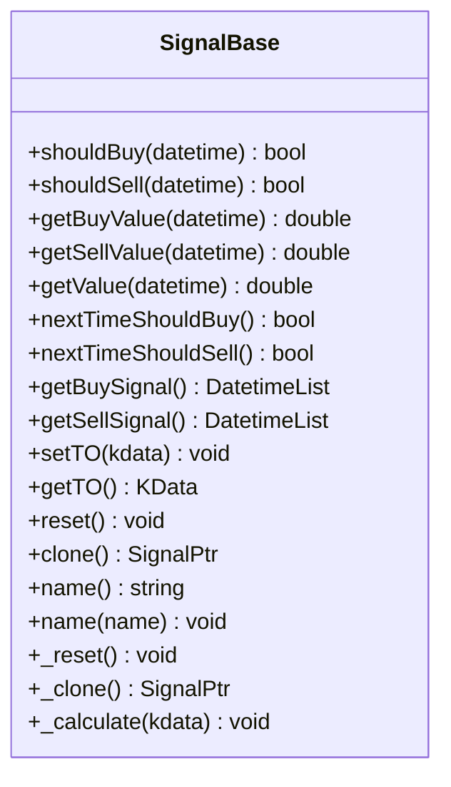
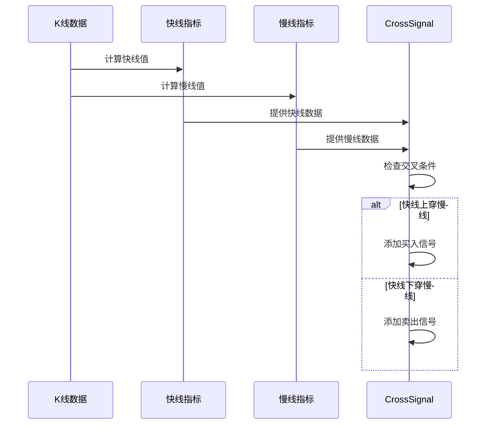
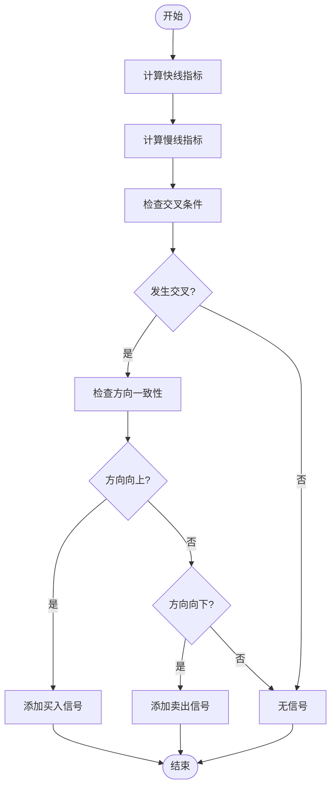
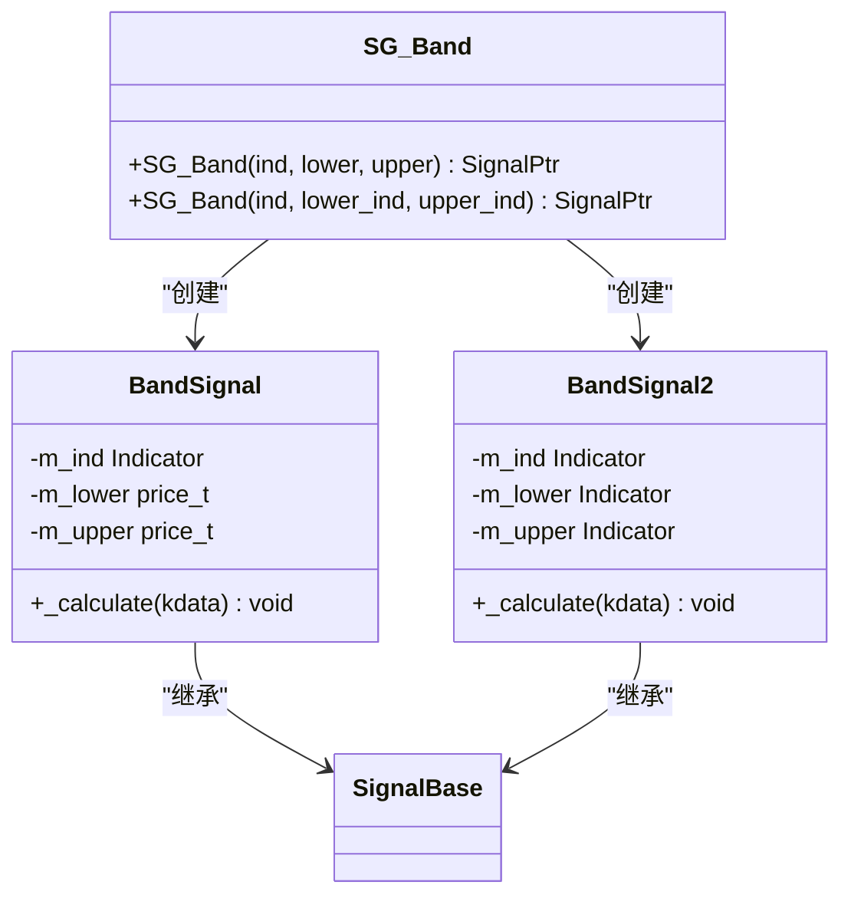
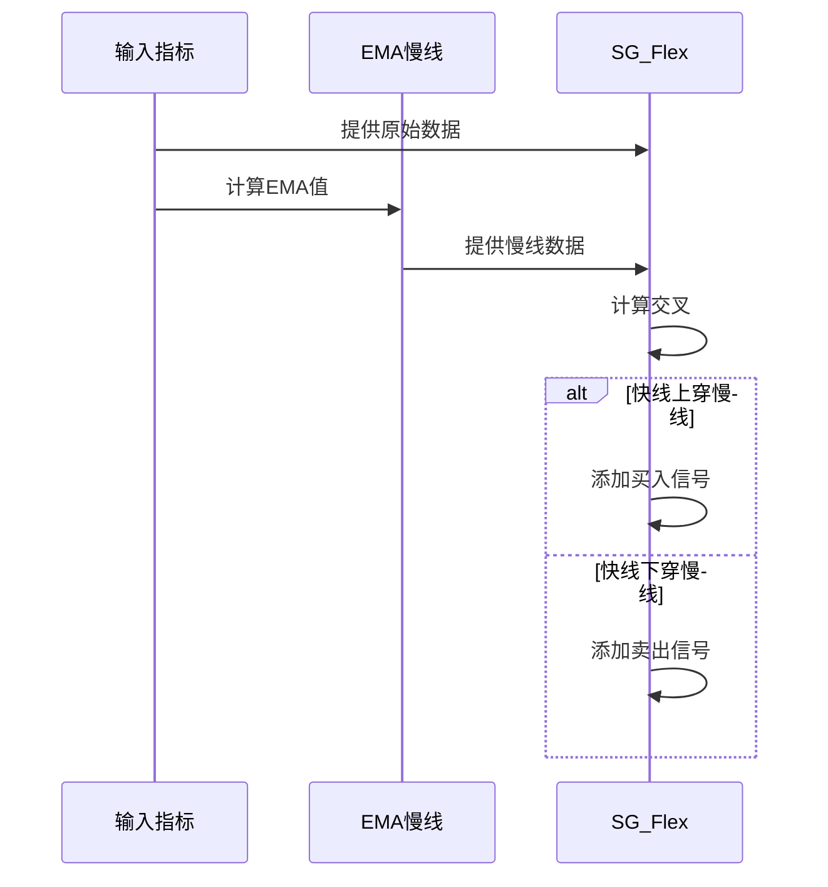
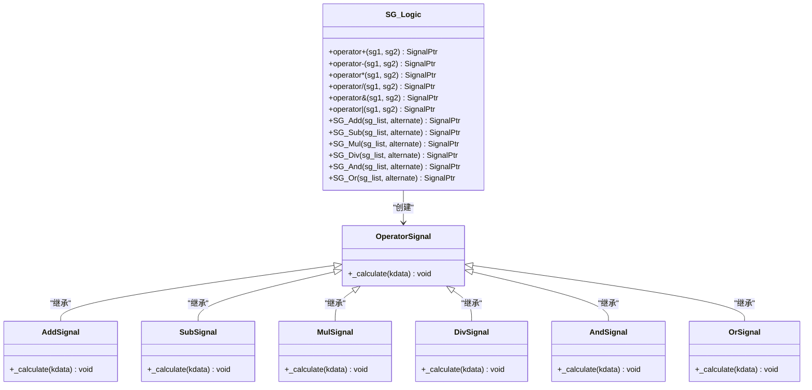
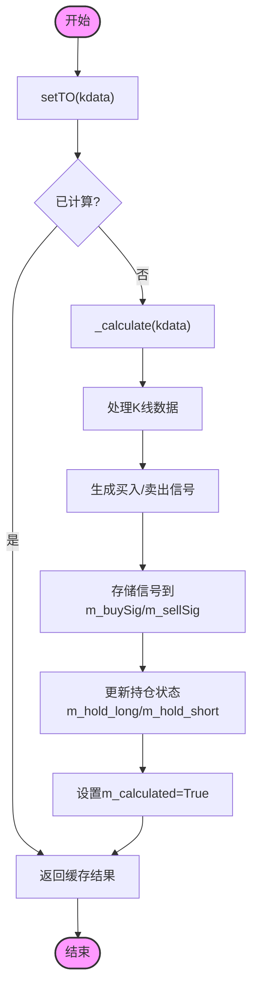

# 信号指示器

<cite>
**本文档引用的文件**  
- [SignalBase.h](file://hikyuu_cpp/hikyuu/trade_sys/signal/SignalBase.h)
- [SignalBase.cpp](file://hikyuu_cpp/hikyuu/trade_sys/signal/SignalBase.cpp)
- [SG_Cross.h](file://hikyuu_cpp/hikyuu/trade_sys/signal/crt/SG_Cross.h)
- [CrossSignal.cpp](file://hikyuu_cpp/hikyuu/trade_sys/signal/imp/CrossSignal.cpp)
- [SG_CrossGold.h](file://hikyuu_cpp/hikyuu/trade_sys/signal/crt/SG_CrossGold.h)
- [CrossGoldSignal.cpp](file://hikyuu_cpp/hikyuu/trade_sys/signal/imp/CrossGoldSignal.cpp)
- [SG_Flex.h](file://hikyuu_cpp/hikyuu/trade_sys/signal/crt/SG_Flex.h)
- [SG_Flex.cpp](file://hikyuu_cpp/hikyuu/trade_sys/signal/crt/SG_Flex.cpp)
- [SG_Band.h](file://hikyuu_cpp/hikyuu/trade_sys/signal/crt/SG_Band.h)
- [BandSignal.cpp](file://hikyuu_cpp/hikyuu/trade_sys/signal/imp/BandSignal.cpp)
- [BandSignal2.cpp](file://hikyuu_cpp/hikyuu/trade_sys/signal/imp/BandSignal2.cpp)
- [SG_Logic.h](file://hikyuu_cpp/hikyuu/trade_sys/signal/crt/SG_Logic.h)
- [hub.py](file://hikyuu/hub.py)
- [Turtle_SG.py](file://hikyuu/examples/Turtle_SG.py)
</cite>

## 目录
1. [引言](#引言)
2. [核心职责](#核心职责)
3. [基类设计](#基类设计)
4. [关键实现](#关键实现)
5. [使用示例](#使用示例)
6. [信号生成流程](#信号生成流程)
7. [结论](#结论)

## 引言
信号指示器模块是交易系统的核心决策引擎，负责根据市场数据生成具体的买入/卖出信号。该模块通过分析K线数据和各种技术指标，为交易系统提供明确的交易指令。信号指示器的设计基于面向对象原则，通过基类定义统一接口，各类具体实现则针对不同的交易策略逻辑。

## 核心职责
信号指示器作为交易系统的核心决策引擎，主要承担以下职责：
- 接收K线数据作为输入
- 根据预设的交易策略算法分析市场数据
- 生成明确的买入/卖出交易信号
- 管理交易状态和持仓情况
- 支持多种信号组合和逻辑运算
- 提供信号查询和验证接口

这些职责使得信号指示器成为连接市场数据分析和实际交易执行的关键桥梁，确保交易决策的自动化和一致性。

**信号指示器的核心职责**
- 作为交易系统的核心决策引擎
- 分析K线数据并生成具体的买入/卖出信号
- 支持多种技术分析策略的实现
- 提供统一的信号管理和查询接口
- 支持信号的组合与逻辑运算

## 基类设计
信号指示器模块的核心是`SignalBase`基类，它定义了所有信号指示器的通用接口和基础功能。该基类采用C++实现，通过继承机制为各类具体信号指示器提供统一的框架。

### 接口设计
`SignalBase`基类提供了以下主要接口：



**图示来源**
- [SignalBase.h](file://hikyuu_cpp/hikyuu/trade_sys/signal/SignalBase.h#L20-L131)

### 核心方法
基类中的核心方法包括：

1. **信号判断方法**：`shouldBuy`和`shouldSell`用于判断指定时刻是否可以进行买入或卖出操作。
2. **信号值获取方法**：`getBuyValue`和`getSellValue`返回指定时刻的信号数值。
3. **交易对象管理**：`setTO`和`getTO`用于设置和获取K线数据。
4. **复位和克隆**：`reset`和`clone`用于状态管理和对象复制。

### 内部状态
`SignalBase`维护了以下内部状态：
- `m_name`：信号指示器名称
- `m_kdata`：关联的K线数据
- `m_calculated`：计算状态标志
- `m_hold_long`和`m_hold_short`：多头和空头持仓状态
- `m_buySig`和`m_sellSig`：买入和卖出信号的日期映射

这些设计确保了信号指示器的可扩展性和一致性，为各类具体实现提供了坚实的基础。

**基类设计来源**
- [SignalBase.h](file://hikyuu_cpp/hikyuu/trade_sys/signal/SignalBase.h#L20-L295)
- [SignalBase.cpp](file://hikyuu_cpp/hikyuu/trade_sys/signal/SignalBase.cpp#L1-L217)

## 关键实现
信号指示器模块提供了多种具体的实现，每种实现针对不同的交易策略逻辑。这些实现继承自`SignalBase`基类，并重写了核心的计算方法。

### SG_Cross（金叉死叉）
`SG_Cross`是最基础的双线交叉信号指示器，当快线从下向上穿越慢线时产生买入信号，当快线从上向下穿越慢线时产生卖出信号。



**图示来源**
- [SG_Cross.h](file://hikyuu_cpp/hikyuu/trade_sys/signal/crt/SG_Cross.h#L1-L28)
- [CrossSignal.cpp](file://hikyuu_cpp/hikyuu/trade_sys/signal/imp/CrossSignal.cpp#L1-L54)

### SG_CrossGold（金叉死叉增强版）
`SG_CrossGold`是`SG_Cross`的增强版本，不仅要求线的交叉，还要求交叉时两条线的方向一致。当快线从下向上穿越慢线且两条线都呈上升趋势时为金叉，产生买入信号；当快线从上向下穿越慢线且两条线都呈下降趋势时为死叉，产生卖出信号。



**图示来源**
- [SG_CrossGold.h](file://hikyuu_cpp/hikyuu/trade_sys/signal/crt/SG_CrossGold.h#L1-L29)
- [CrossGoldSignal.cpp](file://hikyuu_cpp/hikyuu/trade_sys/signal/imp/CrossGoldSignal.cpp#L1-L56)

### SG_Band（通道突破）
`SG_Band`是指标区间信号指示器，适用于有绝对值区间的指标如RSI。当指标值超过上轨时产生买入信号，当指标值低于下轨时产生卖出信号。

该实现有两种模式：
1. 固定阈值模式：使用固定的上下轨数值
2. 动态指标模式：使用其他指标作为上下轨



**图示来源**
- [SG_Band.h](file://hikyuu_cpp/hikyuu/trade_sys/signal/crt/SG_Band.h#L1-L37)
- [BandSignal.cpp](file://hikyuu_cpp/hikyuu/trade_sys/signal/imp/BandSignal.cpp#L1-L53)
- [BandSignal2.cpp](file://hikyuu_cpp/hikyuu/trade_sys/signal/imp/BandSignal2.cpp#L1-L63)

### SG_Flex（灵活规则）
`SG_Flex`是自交叉单线拐点信号指示器，使用自身的EMA作为慢线，自身作为快线。当快线向上穿越慢线时产生买入信号，当快线向下穿越慢线时产生卖出信号。



**图示来源**
- [SG_Flex.h](file://hikyuu_cpp/hikyuu/trade_sys/signal/crt/SG_Flex.h#L1-L29)
- [SG_Flex.cpp](file://hikyuu_cpp/hikyuu/trade_sys/signal/crt/SG_Flex.cpp#L1-L19)

### SG_Logic（逻辑组合）
`SG_Logic`提供信号的逻辑组合功能，支持多种运算符和组合函数，使得复杂的交易策略可以通过简单的信号组合实现。



**图示来源**
- [SG_Logic.h](file://hikyuu_cpp/hikyuu/trade_sys/signal/crt/SG_Logic.h#L1-L127)

## 使用示例
信号指示器模块提供了丰富的使用方式，包括内置信号指示器的直接使用和自定义信号指示器的注册。

### 内置信号指示器使用
以下示例展示了如何使用内置的信号指示器：

```python
from hikyuu import *

# 使用SG_Cross：5日MA上穿10日MA时买入
sg_cross = SG_Cross(MA(C, n=5), MA(C, n=10))

# 使用SG_Band：RSI超过70卖出，低于30买入
sg_band = SG_Band(RSI(n=14), 30, 70)

# 使用SG_Flex：自身与EMA交叉
sg_flex = SG_Flex(CLOSE(), 20)

# 信号组合：金叉且成交量放大
sg_combined = SG_And([SG_Cross(MA(C,5), MA(C,10)), VOL() > REF(VOL(), 1)], True)
```

**代码示例来源**
- [Turtle_SG.py](file://hikyuu/examples/Turtle_SG.py#L12)

### 自定义信号指示器注册
通过`hub.py`文件，用户可以注册自定义的信号指示器：

```python
from hikyuu import *
from hikyuu.util import SingletonType

class MyCustomSignal(SignalBase):
    def __init__(self):
        super().__init__("MyCustomSignal")
        self.param1 = 0
        self.param2 = 0
    
    def _calculate(self, kdata):
        # 自定义信号计算逻辑
        close = CLOSE()(kdata)
        ma = MA(C, n=20)(kdata)
        
        for i in range(1, len(close)):
            if close[i] > ma[i] and close[i-1] <= ma[i-1]:
                self._addBuySignal(kdata[i].datetime)
            elif close[i] < ma[i] and close[i-1] >= ma[i-1]:
                self._addSellSignal(kdata[i].datetime)

# 注册自定义信号指示器
def part():
    return MyCustomSignal()

# 在hub中注册
# add_local_hub('myhub', '/path/to/myhub')
```

**注册机制来源**
- [hub.py](file://hikyuu/hub.py#L1-L772)

## 信号生成流程
信号指示器接收K线数据并输出交易信号的完整流程如下：



**图示来源**
- [SignalBase.cpp](file://hikyuu_cpp/hikyuu/trade_sys/signal/SignalBase.cpp#L75-L89)
- [SignalBase.h](file://hikyuu_cpp/hikyuu/trade_sys/signal/SignalBase.h#L99-L105)

该流程的核心步骤包括：
1. 通过`setTO`方法接收K线数据
2. 检查是否已计算过相同数据，避免重复计算
3. 调用`_calculate`方法执行具体的信号计算逻辑
4. 使用`_addBuySignal`和`_addSellSignal`方法添加信号
5. 更新内部状态和持仓信息
6. 返回计算结果

整个流程确保了信号生成的高效性和一致性，同时通过缓存机制避免了不必要的重复计算。

## 结论
信号指示器模块作为交易系统的核心决策引擎，通过精心设计的基类和丰富的具体实现，为量化交易提供了强大而灵活的信号生成能力。`SignalBase`基类定义了统一的接口和基础功能，确保了各类信号指示器的一致性和可扩展性。各种具体的实现如`SG_Cross`、`SG_Band`、`SG_Flex`和`SG_Logic`覆盖了常见的技术分析策略，满足了多样化的交易需求。

通过`hub.py`提供的注册机制，用户可以轻松地扩展系统功能，添加自定义的信号指示器。这种模块化的设计使得系统既强大又灵活，能够适应不断变化的市场环境和交易策略需求。信号生成流程的优化设计确保了计算的高效性和结果的可靠性，为交易系统的稳定运行提供了坚实的基础。