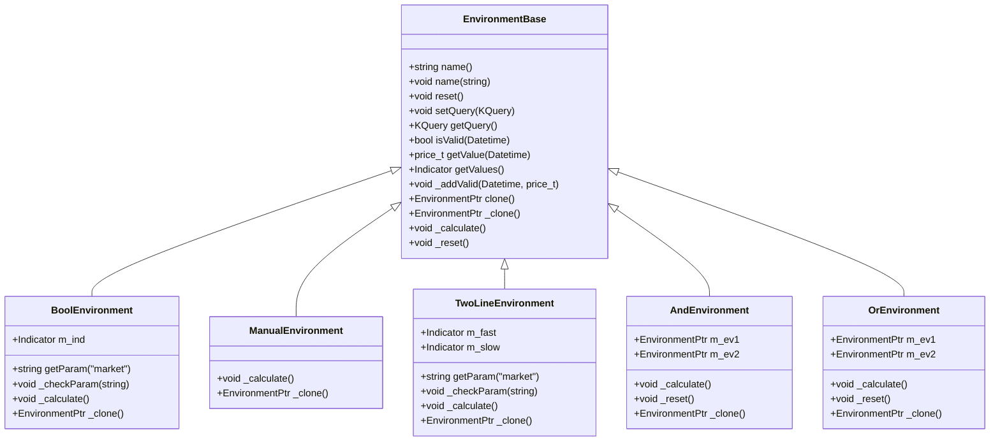
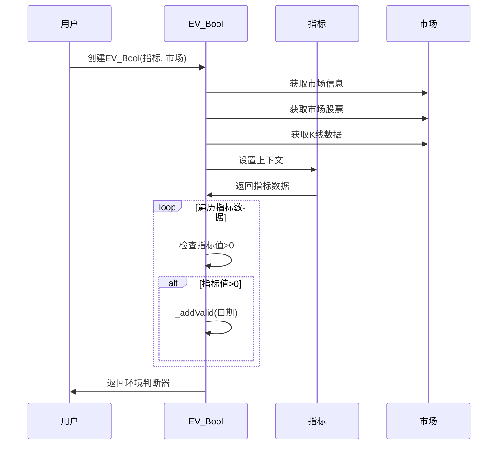
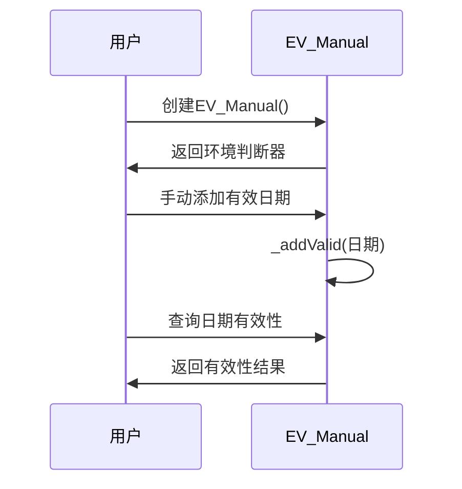
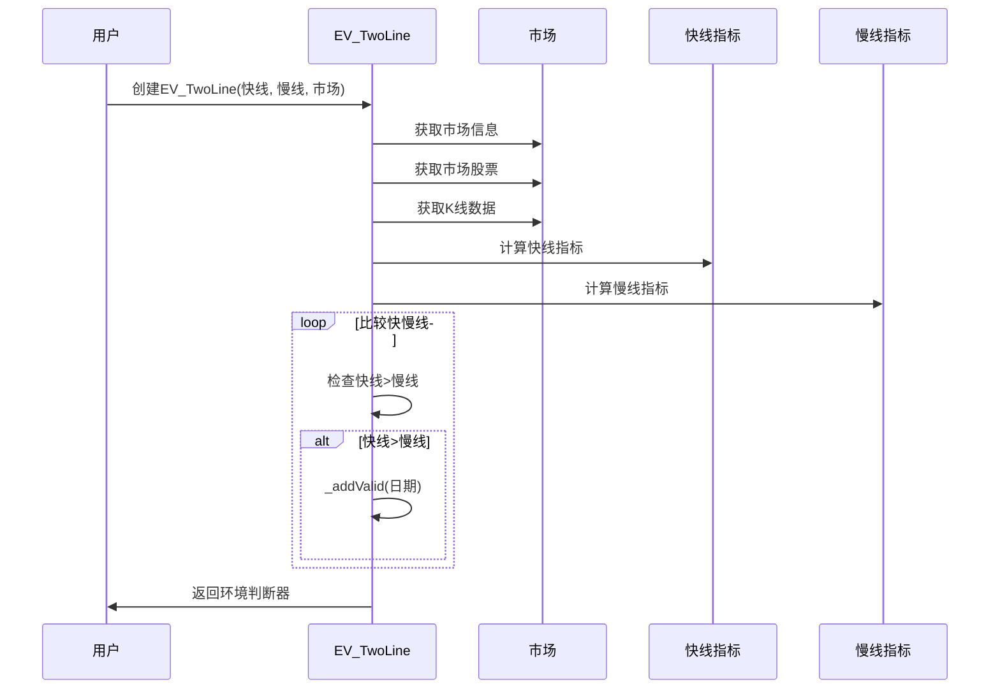
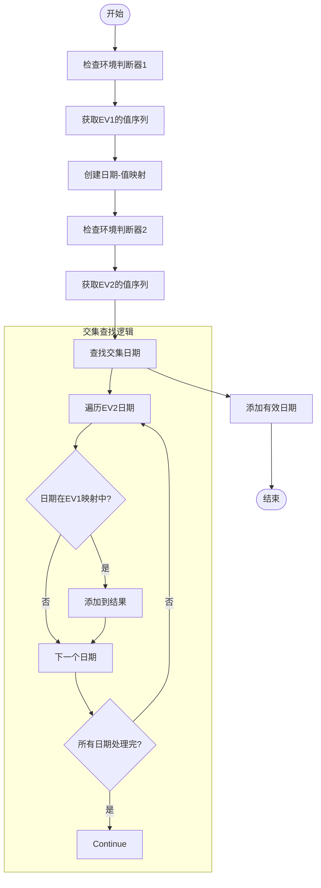
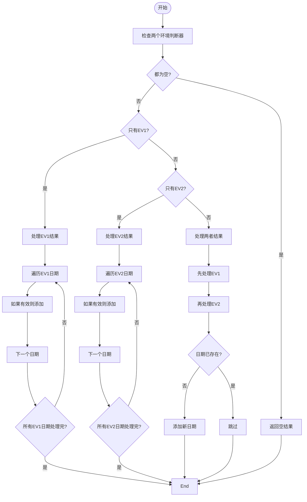
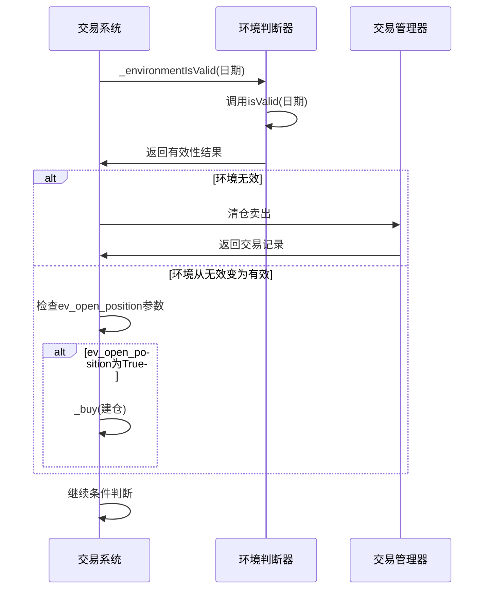

# 市场环境判断

<cite>
**本文档引用的文件**
- [EnvironmentBase.h](file://hikyuu_cpp/hikyuu/trade_sys/environment/EnvironmentBase.h)
- [EV_Bool.h](file://hikyuu_cpp/hikyuu/trade_sys/environment/crt/EV_Bool.h)
- [EV_Manual.h](file://hikyuu_cpp/hikyuu/trade_sys/environment/crt/EV_Manual.h)
- [EV_TwoLine.h](file://hikyuu_cpp/hikyuu/trade_sys/environment/crt/EV_TwoLine.h)
- [BoolEnvironment.cpp](file://hikyuu_cpp/hikyuu/trade_sys/environment/imp/BoolEnvironment.cpp)
- [ManualEnvironment.cpp](file://hikyuu_cpp/hikyuu/trade_sys/environment/imp/ManualEnvironment.cpp)
- [TwoLineEnvironment.cpp](file://hikyuu_cpp/hikyuu/trade_sys/environment/imp/TwoLineEnvironment.cpp)
- [AndEnvironment.cpp](file://hikyuu_cpp/hikyuu/trade_sys/environment/imp/logic/AndEnvironment.cpp)
- [OrEnvironment.cpp](file://hikyuu_cpp/hikyuu/trade_sys/environment/imp/logic/OrEnvironment.cpp)
- [trade_sys.py](file://hikyuu/trade_sys/trade_sys.py)
- [System.cpp](file://hikyuu_cpp/hikyuu/trade_sys/system/System.cpp)
</cite>

## 目录
1. [简介](#简介)
2. [核心组件](#核心组件)
3. [基类设计](#基类设计)
4. [具体实现](#具体实现)
5. [逻辑组合](#逻辑组合)
6. [Python使用示例](#python使用示例)
7. [与交易系统集成](#与交易系统集成)

## 简介
市场环境判断模块是Hikyuu量化交易系统中的顶层过滤器，用于基于宏观或市场指标（如指数趋势、波动率水平）来决定整个策略的激活状态。该模块通过判断市场环境的有效性，控制交易策略的执行，从而在不利市场条件下避免交易，提高系统的风险控制能力。

## 核心组件

市场环境判断模块的核心组件包括基类EnvironmentBase和多个具体实现类，如EV_Bool、EV_Logic、EV_Manual和EV_TwoLine。这些组件共同构成了一个灵活的市场环境判断框架，允许用户根据不同的市场条件配置相应的判断策略。

**核心功能特点：**
- 作为交易系统的顶层过滤器
- 基于宏观或市场指标进行判断
- 支持多种判断逻辑的组合
- 可配置的市场环境判断策略
- 与交易系统无缝集成

**组件关系：**
- EnvironmentBase：所有环境判断器的基类
- EV_Bool：基于布尔信号指标的环境判断
- EV_Manual：手动设置环境有效性的判断器
- EV_TwoLine：基于快慢线比较的环境判断
- EV_Logic：支持逻辑运算的环境判断组合器

**Section sources**
- [EnvironmentBase.h](file://hikyuu_cpp/hikyuu/trade_sys/environment/EnvironmentBase.h)
- [EV_Bool.h](file://hikyuu_cpp/hikyuu/trade_sys/environment/crt/EV_Bool.h)
- [EV_Manual.h](file://hikyuu_cpp/hikyuu/trade_sys/environment/crt/EV_Manual.h)
- [EV_TwoLine.h](file://hikyuu_cpp/hikyuu/trade_sys/environment/crt/EV_TwoLine.h)

## 基类设计

### EnvironmentBase 类

EnvironmentBase是所有市场环境判断器的抽象基类，定义了环境判断器的基本接口和公共功能。该基类不与特定的交易对象绑定，可以被多个系统共享使用。



**Diagram sources**
- [EnvironmentBase.h](file://hikyuu_cpp/hikyuu/trade_sys/environment/EnvironmentBase.h)
- [BoolEnvironment.cpp](file://hikyuu_cpp/hikyuu/trade_sys/environment/imp/BoolEnvironment.cpp)
- [ManualEnvironment.cpp](file://hikyuu_cpp/hikyuu/trade_sys/environment/imp/ManualEnvironment.cpp)
- [TwoLineEnvironment.cpp](file://hikyuu_cpp/hikyuu/trade_sys/environment/imp/TwoLineEnvironment.cpp)
- [AndEnvironment.cpp](file://hikyuu_cpp/hikyuu/trade_sys/environment/imp/logic/AndEnvironment.cpp)
- [OrEnvironment.cpp](file://hikyuu_cpp/hikyuu/trade_sys/environment/imp/logic/OrEnvironment.cpp)

### 主要成员函数

**公共接口：**
- `isValid(Datetime datetime)`：判断指定日期的外部环境是否有效
- `getValue(Datetime datetime)`：获取指定日期的环境判断值
- `getValues()`：以指标形式获取所有日期的环境判断值
- `setQuery(KQuery query)`：设置查询条件
- `clone()`：克隆环境判断器实例

**保护接口：**
- `_addValid(Datetime datetime, price_t value)`：在计算过程中添加有效日期
- `_calculate()`：子类必须实现的计算接口
- `_reset()`：子类可选实现的复位接口
- `_clone()`：子类必须实现的克隆接口

### 数据结构

EnvironmentBase使用以下数据结构来存储环境判断结果：
- `m_date_index`：日期到索引的映射表，用于快速查找
- `m_values`：存储每个有效日期的判断值
- `m_query`：查询条件，定义了环境判断的时间范围
- `m_name`：环境判断器的名称

这些数据结构共同支持高效的环境有效性查询和结果管理。

**Section sources**
- [EnvironmentBase.h](file://hikyuu_cpp/hikyuu/trade_sys/environment/EnvironmentBase.h#L102-L106)

## 具体实现

### EV_Bool 实现

EV_Bool环境判断器基于布尔信号指标进行判断，当指标值大于0时认为市场环境有效，否则无效。



**Diagram sources**
- [BoolEnvironment.cpp](file://hikyuu_cpp/hikyuu/trade_sys/environment/imp/BoolEnvironment.cpp#L39-L56)

### EV_Manual 实现

EV_Manual环境判断器仅能通过手工方式添加环境有效性，主要用于测试或其他特殊用途。



**Diagram sources**
- [ManualEnvironment.cpp](file://hikyuu_cpp/hikyuu/trade_sys/environment/imp/ManualEnvironment.cpp#L18)

### EV_TwoLine 实现

EV_TwoLine环境判断器通过比较市场指数的快线和慢线来判断市场环境，当快线大于慢线时认为市场有效。



**Diagram sources**
- [TwoLineEnvironment.cpp](file://hikyuu_cpp/hikyuu/trade_sys/environment/imp/TwoLineEnvironment.cpp#L44-L65)

## 逻辑组合

### 逻辑与（AND）组合

逻辑与组合通过AndEnvironment类实现，只有当两个环境判断器都有效时，组合结果才有效。



**Diagram sources**
- [AndEnvironment.cpp](file://hikyuu_cpp/hikyuu/trade_sys/environment/imp/logic/AndEnvironment.cpp#L30-L57)

### 逻辑或（OR）组合

逻辑或组合通过OrEnvironment类实现，只要有一个环境判断器有效，组合结果就有效。



**Diagram sources**
- [OrEnvironment.cpp](file://hikyuu_cpp/hikyuu/trade_sys/environment/imp/logic/OrEnvironment.cpp#L30-L90)

## Python使用示例

### 创建基本环境判断器

```python
from hikyuu import *
from hikyuu.trade_sys import crtEV

# 创建基于布尔指标的环境判断器
def bool_ev_func(self):
    ind = self.get_stock().get_kdata(Datetime(20200101), Datetime(20231231))
    # 这里可以添加任何布尔判断逻辑
    return ind.close > ind.ma(20)

ev_bool = crtEV(bool_ev_func, name='MyBoolEV')

# 创建手动环境判断器
ev_manual = EV_Manual()

# 创建双线环境判断器
ev_two_line = EV_TwoLine(MA(n=5), MA(n=20), market='SH')
```

### 逻辑组合示例

```python
# 逻辑与组合
ev_and = ev_bool & ev_two_line

# 逻辑或组合
ev_or = ev_bool | ev_manual

# 复杂组合
ev_complex = (ev_bool & ev_two_line) | ev_manual
```

### 参数配置

```python
# 配置市场参数
ev_two_line.set_param('market', 'SZ')

# 获取参数
market = ev_two_line.get_param('market')
```

**Section sources**
- [trade_sys.py](file://hikyuu/trade_sys/trade_sys.py#L48-L84)
- [EV_Bool.h](file://hikyuu_cpp/hikyuu/trade_sys/environment/crt/EV_Bool.h)
- [EV_Manual.h](file://hikyuu_cpp/hikyuu/trade_sys/environment/crt/EV_Manual.h)
- [EV_TwoLine.h](file://hikyuu_cpp/hikyuu/trade_sys/environment/crt/EV_TwoLine.h)

## 与交易系统集成

### 系统集成流程



**Diagram sources**
- [System.cpp](file://hikyuu_cpp/hikyuu/trade_sys/system/System.cpp#L516-L549)

### 集成参数

交易系统通过以下参数控制环境判断器的行为：

| 参数名称 | 类型 | 默认值 | 说明 |
|---------|------|--------|------|
| delay | bool | True | 是否延迟到下一个bar开盘时交易 |
| delay_use_current_price | bool | True | 延迟操作时是否使用当前价格 |
| max_delay_count | int | 3 | 连续延迟交易的限制次数 |
| ev_open_position | bool | False | 是否使用环境判断进行初始建仓 |
| cn_open_position | bool | False | 是否使用条件判断进行初始建仓 |

### 集成代码示例

```python
# 创建交易系统并集成环境判断器
system = System(
    trade_manager=tm,
    money_manager=mm,
    environment=ev_complex,  # 使用复杂的环境判断组合
    condition=cn,
    signal=sg,
    stoploss=sl,
    stopprofit=sp,
    profit_goal=pg,
    slippage=sg
)

# 设置环境判断参数
system.set_param('ev_open_position', True)  # 允许环境判断器进行初始建仓

# 运行系统
result = system.run()
```

**Section sources**
- [System.cpp](file://hikyuu_cpp/hikyuu/trade_sys/system/System.cpp#L516-L549)
- [System.cpp](file://hikyuu_cpp/hikyuu/trade_sys/system/System.h#L608-L638)
- [trade_sys.py](file://hikyuu/trade_sys/trade_sys.py#L48-L84)