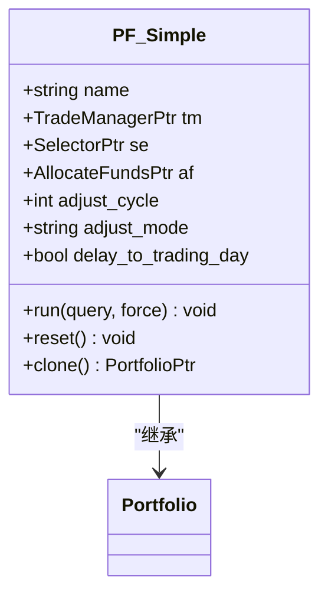
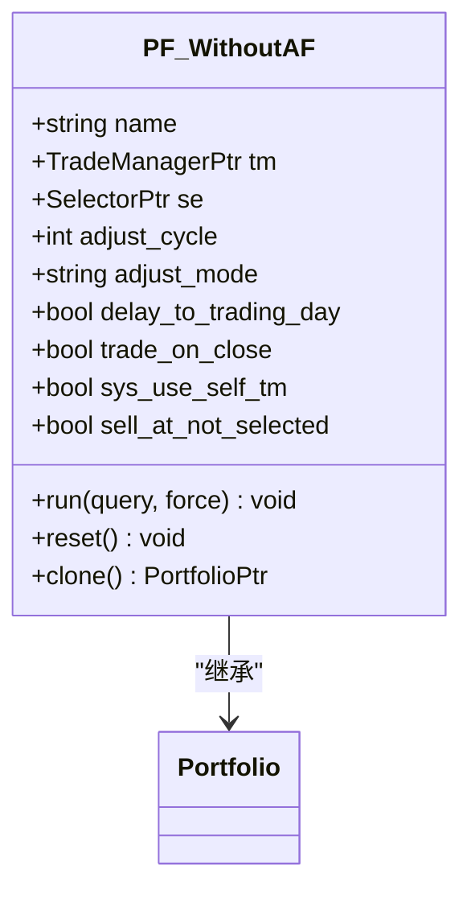

# 投资组合策略

<cite>
**本文档引用的文件**   
- [Portfolio.h](file://hikyuu_cpp/hikyuu/trade_sys/portfolio/Portfolio.h)
- [PF_Simple.h](file://hikyuu_cpp/hikyuu/trade_sys/portfolio/crt/PF_Simple.h)
- [PF_WithoutAF.h](file://hikyuu_cpp/hikyuu/trade_sys/portfolio/crt/PF_WithoutAF.h)
- [Portfolio.cpp](file://hikyuu_cpp/hikyuu/trade_sys/portfolio/Portfolio.cpp)
- [010-Portfolio.ipynb](file://hikyuu/examples/notebook/010-Portfolio.ipynb)
</cite>

## 目录
1. [引言](#引言)
2. [投资组合基类](#投资组合基类)
3. [内置投资组合实现](#内置投资组合实现)
4. [子系统协调与资金分配](#子系统协调与资金分配)
5. [结论](#结论)

## 引言
投资组合策略是Hikyuu量化交易框架中的核心组件，用于管理多个子策略或多个交易品种的组合。通过投资组合策略，可以实现更高级的资金分配和风险分散，从而优化整体投资表现。本文档详细阐述了投资组合策略的架构、核心组件及其工作机制。

## 投资组合基类

投资组合基类（Portfolio）是所有投资组合策略的基类，负责管理多个子系统的交易请求和资金分配。该类提供了运行投资组合、设置查询条件、获取账户信息等核心功能。

**Section sources**
- [Portfolio.h](file://hikyuu_cpp/hikyuu/trade_sys/portfolio/Portfolio.h#L21-L266)
- [Portfolio.cpp](file://hikyuu_cpp/hikyuu/trade_sys/portfolio/Portfolio.cpp#L1-L500)

## 内置投资组合实现

Hikyuu框架提供了两种内置的投资组合实现：PF_Simple（简单组合）和PF_WithoutAF（无资金分配）。这些实现基于投资组合基类，针对不同的应用场景提供了灵活的配置选项。

### PF_Simple（简单组合）

PF_Simple是一种多标的、单系统策略的投资组合实现。它通过指定交易账户、系统选择器和资金分配算法来创建投资组合。调仓模式（adjust_mode）决定了调仓的周期和频率。

**Diagram sources **
- [PF_Simple.h](file://hikyuu_cpp/hikyuu/trade_sys/portfolio/crt/PF_Simple.h#L40-L43)

### PF_WithoutAF（无资金分配）

PF_WithoutAF是一种无资金分配算法的投资组合实现。它仅支持全部在开盘时买卖或全部在收盘时买卖。该实现通过指定交易账户、系统选择器和调仓周期来创建投资组合。

**Diagram sources **
- [PF_WithoutAF.h](file://hikyuu_cpp/hikyuu/trade_sys/portfolio/crt/PF_WithoutAF.h#L43-L46)

## 子系统协调与资金分配

投资组合策略通过协调其内部各个子系统的交易请求和资金分配来实现整体优化。资金分配算法（AllocateFunds）负责决定如何在选定的系统中进行资金分配，而系统选择器（Selector）则负责在每日选定交易系统。

### 资金分配算法

资金分配算法（AllocateFunds）是投资组合策略中的关键组件，它决定了如何在选定的系统中分配资金。Hikyuu框架提供了多种资金分配算法，如等比例分配（AF_EqualWeight）和固定权重分配（AF_FixedWeight）。

### 系统选择器

系统选择器（Selector）负责在每日选定交易系统。Hikyuu框架提供了多种系统选择器，如固定选择器（SE_Fixed）和基于信号的选择器（SE_Signal）。这些选择器可以根据不同的策略需求进行配置。

**Section sources**
- [Portfolio.h](file://hikyuu_cpp/hikyuu/trade_sys/portfolio/Portfolio.h#L78-L82)
- [010-Portfolio.ipynb](file://hikyuu/examples/notebook/010-Portfolio.ipynb#L50-L100)

## 结论
投资组合策略是Hikyuu量化交易框架中的重要组成部分，通过管理多个子策略或多个交易品种的组合，实现了更高级的资金分配和风险分散。PF_Simple和PF_WithoutAF等内置实现为用户提供了灵活的配置选项，使得投资组合策略能够适应不同的应用场景。通过协调子系统的交易请求和资金分配，投资组合策略能够优化整体投资表现，提高投资效率。