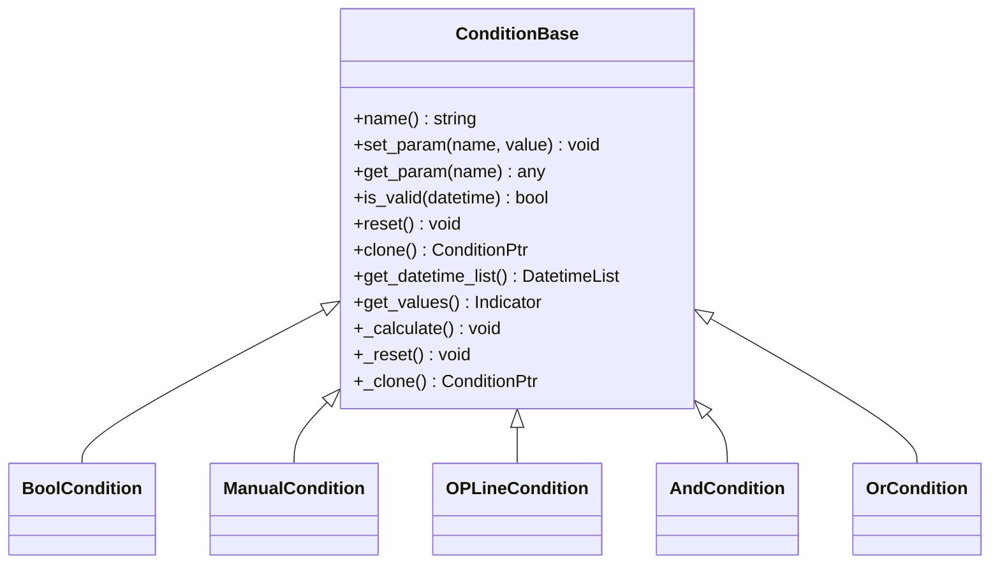
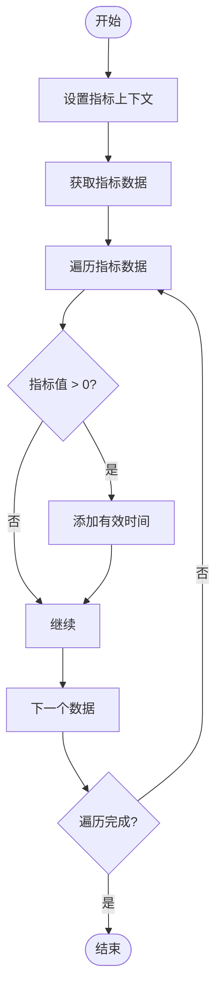
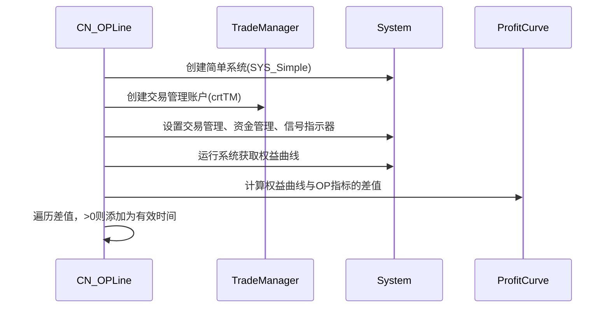
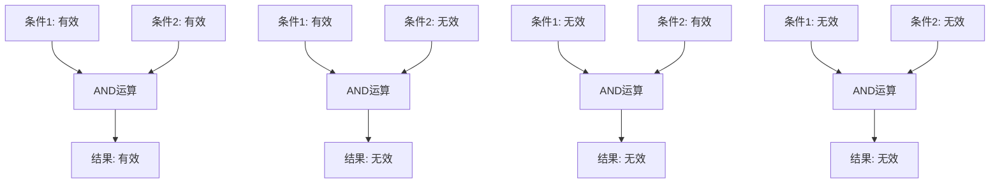
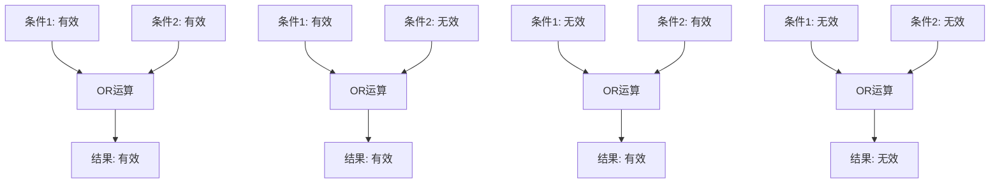

# 条件策略

<cite>
**本文档中引用的文件**   
- [Condition.py](file://hikyuu/test/Condition.py)
- [ConditionBase.h](file://hikyuu_cpp/hikyuu/trade_sys/condition/ConditionBase.h)
- [_Condition.cpp](file://hikyuu_pywrap/trade_sys/_Condition.cpp)
- [CN_Bool.h](file://hikyuu_cpp/hikyuu/trade_sys/condition/crt/CN_Bool.h)
- [CN_Logic.h](file://hikyuu_cpp/hikyuu/trade_sys/condition/crt/CN_Logic.h)
- [CN_Manual.h](file://hikyuu_cpp/hikyuu/trade_sys/condition/crt/CN_Manual.h)
- [CN_OPLine.h](file://hikyuu_cpp/hikyuu/trade_sys/condition/crt/CN_OPLine.h)
- [BoolCondition.cpp](file://hikyuu_cpp/hikyuu/trade_sys/condition/imp/BoolCondition.cpp)
- [ManualCondition.cpp](file://hikyuu_cpp/hikyuu/trade_sys/condition/imp/ManualCondition.cpp)
- [OPLineCondition.cpp](file://hikyuu_cpp/hikyuu/trade_sys/condition/imp/OPLineCondition.cpp)
- [AndCondition.cpp](file://hikyuu_cpp/hikyuu/trade_sys/condition/imp/logic/AndCondition.cpp)
- [OrCondition.cpp](file://hikyuu_cpp/hikyuu/trade_sys/condition/imp/logic/OrCondition.cpp)
</cite>

## 目录
1. [引言](#引言)
2. [条件策略概述](#条件策略概述)
3. [ConditionBase基类](#conditionbase基类)
4. [内置条件实现](#内置条件实现)
   - [CN_Bool](#cn_bool)
   - [CN_Manual](#cn_manual)
   - [CN_OPLine](#cn_opline)
   - [逻辑条件（AND/OR）](#逻辑条件andor)
5. [Python中的使用示例](#python中的使用示例)
6. [结论](#结论)

## 引言
条件策略模块是Hikyuu量化交易系统中的核心组件之一，负责控制系统在特定时间是否有效。与信号指示器（Signal）不同，条件策略不生成交易信号，而是用于组合多个信号指示器，通过逻辑运算构建复杂的策略组合。本文档将详细阐述条件策略模块的设计、实现和使用方法。

**条件策略与信号指示器的区别**：
- **信号指示器（Signal）**：生成具体的买入/卖出信号
- **条件策略（Condition）**：控制策略系统在何时有效，用于组合信号而非生成信号

## 条件策略概述
条件策略作为系统内子策略的组合逻辑控制器，其主要功能是确定交易系统在特定时间点是否有效。一个有效的条件策略可以包含多个子条件，通过逻辑运算（如AND、OR）进行组合，从而构建复杂的策略逻辑。

条件策略的核心特点：
- **组合性**：能够将多个简单条件组合成复杂条件
- **逻辑性**：支持布尔逻辑运算（与、或、非等）
- **可扩展性**：通过继承ConditionBase基类可自定义新的条件类型
- **时序性**：基于时间序列数据进行有效性判断

## ConditionBase基类
`ConditionBase`是所有条件策略的基类，定义了条件策略的基本接口和功能。该基类提供了条件策略所需的核心方法和属性。

### 核心方法


**图示来源**
- [ConditionBase.h](file://hikyuu_cpp/hikyuu/trade_sys/condition/ConditionBase.h#L24-L100)
- [_Condition.cpp](file://hikyuu_pywrap/trade_sys/_Condition.cpp#L31-L130)

### 主要属性和方法说明
- **name**: 条件策略的名称
- **set_param/get_param**: 参数设置和获取接口
- **is_valid**: 判断指定时间系统是否有效
- **reset**: 复位操作，重置内部状态
- **clone**: 克隆操作，用于复制条件策略实例
- **get_datetime_list**: 获取系统有效的日期列表
- **get_values**: 以指标形式获取实际值
- **_calculate**: 【必须重载】子类计算接口
- **_reset**: 【可选重载】子类复位接口
- **_clone**: 【必须重载】子类克隆接口

**节来源**
- [ConditionBase.h](file://hikyuu_cpp/hikyuu/trade_sys/condition/ConditionBase.h#L24-L100)
- [_Condition.cpp](file://hikyuu_pywrap/trade_sys/_Condition.cpp#L31-L130)

## 内置条件实现
Hikyuu提供了多种内置的条件策略实现，每种实现都有其特定的应用场景。

### CN_Bool
`CN_Bool`是基于布尔信号指标的系统有效条件，当指标值大于0时系统有效，否则无效。

#### 实现原理


**图示来源**
- [CN_Bool.h](file://hikyuu_cpp/hikyuu/trade_sys/condition/crt/CN_Bool.h#L15-L20)
- [BoolCondition.cpp](file://hikyuu_cpp/hikyuu/trade_sys/condition/imp/BoolCondition.cpp#L26-L34)

#### 使用场景
- 将技术指标转换为系统有效条件
- 基于简单规则的系统有效性判断
- 作为复杂条件组合的基础组件

**节来源**
- [CN_Bool.h](file://hikyuu_cpp/hikyuu/trade_sys/condition/crt/CN_Bool.h#L15-L20)
- [BoolCondition.cpp](file://hikyuu_cpp/hikyuu/trade_sys/condition/imp/BoolCondition.cpp#L16-L39)

### CN_Manual
`CN_Manual`是仅能手工添加有效性的条件策略，主要用于测试或其他特殊用途。

#### 特点
- 不进行任何自动计算
- 通过手动方式添加有效时间
- 适用于需要精确控制有效时间的场景

#### 使用场景
- 策略测试和验证
- 特殊事件驱动的系统有效性控制
- 调试和开发过程中的临时条件

**节来源**
- [CN_Manual.h](file://hikyuu_cpp/hikyuu/trade_sys/condition/crt/CN_Manual.h#L14-L18)
- [ManualCondition.cpp](file://hikyuu_cpp/hikyuu/trade_sys/condition/imp/ManualCondition.cpp#L16-L22)

### CN_OPLine
`CN_OPLine`基于权益曲线与指定指标的比较来判断系统有效性，当权益曲线高于指定指标时系统有效。

#### 实现原理


**图示来源**
- [CN_OPLine.h](file://hikyuu_cpp/hikyuu/trade_sys/condition/crt/CN_OPLine.h#L17-L22)
- [OPLineCondition.cpp](file://hikyuu_cpp/hikyuu/trade_sys/condition/imp/OPLineCondition.cpp#L31-L56)

#### 使用场景
- 基于资金曲线的系统有效性控制
- 风险控制和止损策略
- 动态调整系统有效性的高级策略

**节来源**
- [CN_OPLine.h](file://hikyuu_cpp/hikyuu/trade_sys/condition/crt/CN_OPLine.h#L17-L22)
- [OPLineCondition.cpp](file://hikyuu_cpp/hikyuu/trade_sys/condition/imp/OPLineCondition.cpp#L21-L61)

### 逻辑条件（AND/OR）
逻辑条件是构建复杂策略组合的核心，通过AND（与）和OR（或）运算符将多个条件策略组合在一起。

#### AND条件（与运算）
`AndCondition`实现了两个条件策略的逻辑与运算，只有当两个条件都有效时，组合条件才有效。



**图示来源**
- [CN_Logic.h](file://hikyuu_cpp/hikyuu/trade_sys/condition/crt/CN_Logic.h#L14-L20)
- [AndCondition.cpp](file://hikyuu_cpp/hikyuu/trade_sys/condition/imp/logic/AndCondition.cpp#L30-L46)

#### OR条件（或运算）
`OrCondition`实现了两个条件策略的逻辑或运算，只要有一个条件有效，组合条件就有效。



**图示来源**
- [CN_Logic.h](file://hikyuu_cpp/hikyuu/trade_sys/condition/crt/CN_Logic.h#L22-L28)
- [OrCondition.cpp](file://hikyuu_cpp/hikyuu/trade_sys/condition/imp/logic/OrCondition.cpp#L30-L73)

#### 逻辑条件的实现细节
- **运算符重载**：通过重载`&`和`|`运算符实现AND和OR操作
- **短路优化**：在OR运算中，如果第一个条件有效，则无需计算第二个条件
- **状态同步**：确保子条件的交易管理、信号指示器和交易对象与父条件同步
- **复位机制**：递归调用子条件的复位方法，确保状态一致性

**节来源**
- [CN_Logic.h](file://hikyuu_cpp/hikyuu/trade_sys/condition/crt/CN_Logic.h#L14-L34)
- [AndCondition.cpp](file://hikyuu_cpp/hikyuu/trade_sys/condition/imp/logic/AndCondition.cpp#L16-L70)
- [OrCondition.cpp](file://hikyuu_cpp/hikyuu/trade_sys/condition/imp/logic/OrCondition.cpp#L16-L97)

## Python中的使用示例
以下是在Python中定义和使用条件策略的实例，展示如何将多个信号指示器通过条件进行逻辑连接。

### 基本条件创建
```python
# 创建基于RSI指标的条件
rsi = indicator.RSI(n=14)
cn_rsi = CN_Bool(rsi < 30)  # RSI低于30时系统有效

# 创建基于均线的条件
ma5 = indicator.MA(n=5)
ma20 = indicator.MA(n=20)
cn_ma = CN_Bool(ma5 > ma20)  # 5日均线在20日均线上方时系统有效
```

### 逻辑条件组合
```python
# 使用AND运算符组合条件
cn_combined = cn_rsi & cn_ma  # RSI低于30且5日均线上穿20日均线时系统有效

# 使用OR运算符组合条件
cn_alternative = cn_rsi | cn_ma  # RSI低于30或5日均线上穿20日均线时系统有效

# 复杂条件组合
cn_complex = (cn_rsi & cn_ma) | CN_Manual()  # 复合条件或手动条件
```

### 完整策略示例
```python
def create_strategy():
    # 创建信号指示器
    signal_buy = SG_Single()
    signal_buy.set_param("buy_filter", indicator.CROSSOVER(MA(5), MA(20)))
    
    # 创建条件策略
    # 条件1: 市场处于上升趋势
    trend_condition = CN_Bool(indicator.MA(20) > indicator.MA(60))
    
    # 条件2: 波动率适中
    volatility_condition = CN_Bool(indicator.ATR(14) < 2.0)
    
    # 组合条件：上升趋势且波动率适中
    combined_condition = trend_condition & volatility_condition
    
    # 创建系统
    sys = SYS_Simple()
    sys.set_sg(signal_buy)
    sys.set_cn(combined_condition)
    
    return sys
```

**节来源**
- [Condition.py](file://hikyuu/test/Condition.py#L16-L34)
- [_Condition.cpp](file://hikyuu_pywrap/trade_sys/_Condition.cpp#L111-L127)

## 结论
条件策略模块作为Hikyuu量化交易系统的重要组成部分，提供了强大的策略组合能力。通过`ConditionBase`基类和多种内置实现，用户可以灵活地构建复杂的策略逻辑。

关键要点总结：
1. **角色定位**：条件策略是系统内子策略的组合逻辑控制器，用于控制策略系统的有效性
2. **与信号指示器的区别**：条件策略用于组合信号，而非生成信号
3. **核心基类**：`ConditionBase`提供了条件策略的基本接口和功能
4. **内置实现**：包括`CN_Bool`、`CN_Manual`、`CN_OPLine`等多种实用的条件类型
5. **逻辑组合**：通过AND/OR等逻辑运算符可以构建复杂的策略组合
6. **Python接口**：提供了简洁易用的Python接口，支持运算符重载和链式调用

通过合理使用条件策略模块，可以构建出更加智能和稳健的量化交易系统，有效提升策略的适应性和风险控制能力。