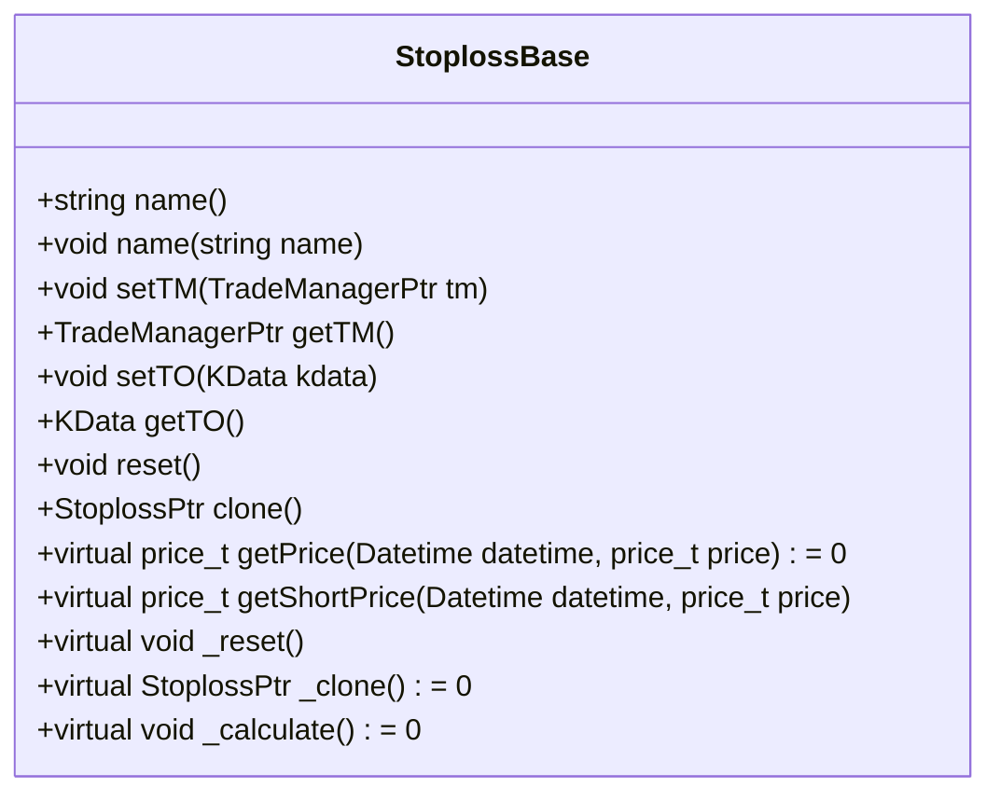
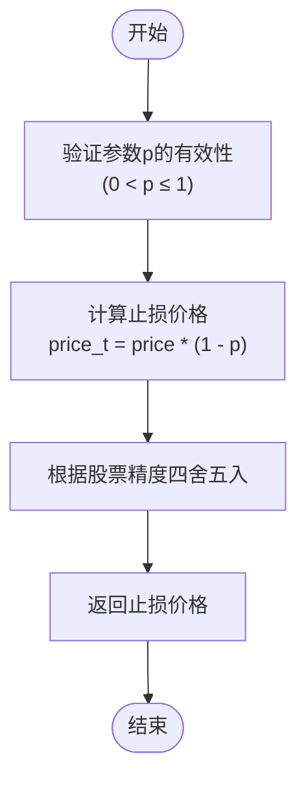
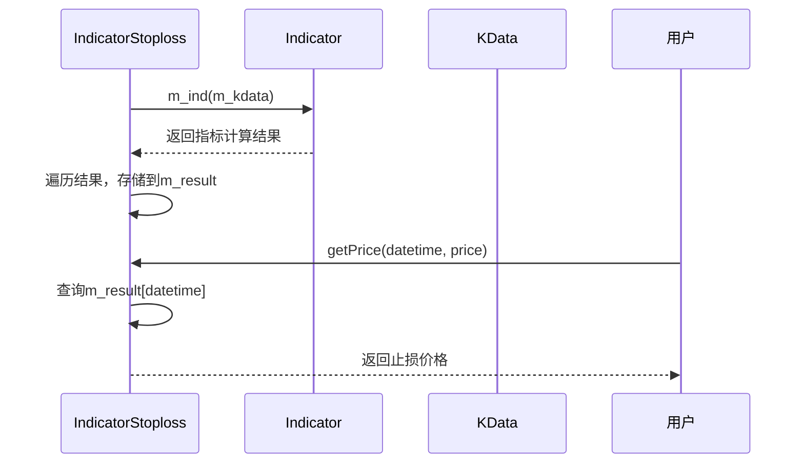
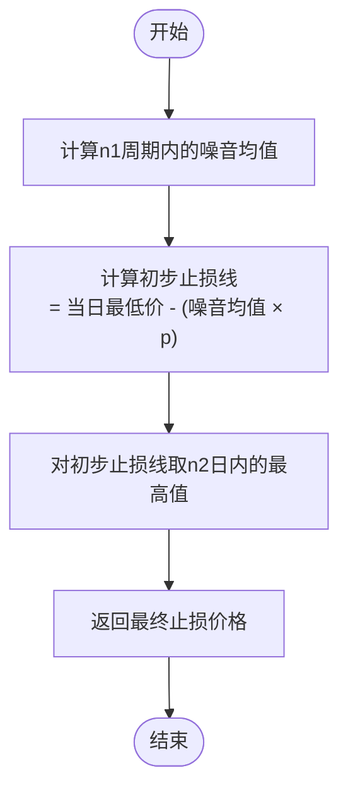

# 止损/止盈策略

<cite>
**本文档引用的文件**
- [StoplossBase.h](file://hikyuu_cpp/hikyuu/trade_sys/stoploss/StoplossBase.h)
- [FixedPercentStoploss.h](file://hikyuu_cpp/hikyuu/trade_sys/stoploss/imp/FixedPercentStoploss.h)
- [FixedPercentStoploss.cpp](file://hikyuu_cpp/hikyuu/trade_sys/stoploss/imp/FixedPercentStoploss.cpp)
- [IndicatorStoploss.h](file://hikyuu_cpp/hikyuu/trade_sys/stoploss/imp/IndicatorStoploss.h)
- [IndicatorStoploss.cpp](file://hikyuu_cpp/hikyuu/trade_sys/stoploss/imp/IndicatorStoploss.cpp)
- [ST_Saftyloss.h](file://hikyuu_cpp/hikyuu/trade_sys/stoploss/crt/ST_Saftyloss.h)
- [ST_Saftyloss.cpp](file://hikyuu_cpp/hikyuu/trade_sys/stoploss/crt/ST_Saftyloss.cpp)
- [SAFTYLOSS.h](file://hikyuu_cpp/hikyuu/indicator/crt/SAFTYLOSS.h)
- [ISaftyLoss.h](file://hikyuu_cpp/hikyuu/indicator/imp/ISaftyLoss.h)
- [ISaftyLoss.cpp](file://hikyuu_cpp/hikyuu/indicator/imp/ISaftyLoss.cpp)
- [Stoploss.py](file://hikyuu/test/Stoploss.py)
- [_Stoploss.cpp](file://hikyuu_pywrap/trade_sys/_Stoploss.cpp)
</cite>

## 目录
1. [引言](#引言)
2. [止损/止盈策略概述](#止损止盈策略概述)
3. [StoplossBase基类详解](#stoplossbase基类详解)
4. [具体止损策略实现](#具体止损策略实现)
5. [策略配置与应用示例](#策略配置与应用示例)
6. [与交易系统集成](#与交易系统集成)
7. [总结](#总结)

## 引言
止损/止盈策略是量化交易系统中至关重要的风险管理工具，用于控制交易风险和锁定利润。本文档详细阐述Hikyuu交易框架中实现的多种止损/止盈策略，包括其触发机制、适用场景以及与交易系统的集成方式。

## 止损/止盈策略概述
在Hikyuu框架中，止损/止盈策略（Stoploss）是交易系统的重要组成部分，其主要作用是在交易执行前向系统提供预期的止损价格。当市场价格达到预设的止损或止盈条件时，系统将自动执行卖出操作，从而有效控制潜在亏损并锁定已实现的利润。

Hikyuu提供了多种内置的止损/止盈策略，主要包括：
- **ST_FixedPercent**：固定百分比止损策略
- **ST_Indicator**：基于技术指标的止损策略
- **ST_Saftyloss**：安全线止损策略

这些策略均继承自统一的基类`StoplossBase`，遵循相同的接口规范，确保了策略的可扩展性和一致性。

## StoplossBase基类详解
`StoplossBase`是所有止损/止盈策略的抽象基类，定义了策略所需的核心接口和通用功能。

### 核心接口
`StoplossBase`类定义了以下关键的虚函数接口：



**类来源**
- [StoplossBase.h](file://hikyuu_cpp/hikyuu/trade_sys/stoploss/StoplossBase.h#L23-L205)

**核心方法说明：**
- `getPrice(datetime, price)`：获取本次预期交易（买入）时的计划止损价格。这是必须由子类实现的纯虚函数。
- `getShortPrice(datetime, price)`：获取卖空交易时的计划止损价格，默认实现与`getPrice`相同。
- `reset()`：复位操作，用于重置策略状态。
- `clone()`：克隆操作，用于创建策略实例的副本。

### 基类功能
`StoplossBase`不仅定义了接口，还提供了以下通用功能：
- **名称管理**：通过`name()`和`name(string)`方法获取和设置策略名称。
- **交易管理器设置**：通过`setTM()`和`getTM()`方法与交易管理器（TradeManager）关联。
- **交易对象设置**：通过`setTO()`和`getTO()`方法设置和获取交易对象（KData）。
- **参数支持**：继承自`PARAMETER_SUPPORT_WITH_CHECK`宏，支持参数化配置和参数校验。

**节来源**
- [StoplossBase.h](file://hikyuu_cpp/hikyuu/trade_sys/stoploss/StoplossBase.h#L18-L205)

## 具体止损策略实现
Hikyuu框架实现了多种具体的止损策略，每种策略都有其独特的触发机制和适用场景。

### ST_FixedPercent（固定百分比止损）
固定百分比止损策略是最简单直接的止损方法，当价格低于买入价格的某一预设百分比时触发止损。

#### 实现机制
该策略通过`FixedPercentStoploss`类实现，其核心逻辑如下：
1. 在构造函数中设置默认参数`p=0.03`（即3%）。
2. `getPrice`方法计算止损价：`买入价 × (1 - p)`。
3. 使用`roundEx`函数根据股票的精度要求对结果进行四舍五入。



**图来源**
- [FixedPercentStoploss.cpp](file://hikyuu_cpp/hikyuu/trade_sys/stoploss/imp/FixedPercentStoploss.cpp#L29-L33)

**节来源**
- [FixedPercentStoploss.h](file://hikyuu_cpp/hikyuu/trade_sys/stoploss/imp/FixedPercentStoploss.h#L16-L31)
- [FixedPercentStoploss.cpp](file://hikyuu_cpp/hikyuu/trade_sys/stoploss/imp/FixedPercentStoploss.cpp#L1-L44)

#### 适用场景
- 适用于风险偏好较低的投资者，希望在亏损达到一定比例时立即退出。
- 适合波动性较小的市场环境，避免因短期波动而频繁触发止损。
- 作为基础止损策略，常与其他技术分析方法结合使用。

### ST_Indicator（基于技术指标的止损）
基于技术指标的止损策略使用技术分析指标的值作为动态止损价格，能够更好地适应市场变化。

#### 实现机制
该策略通过`IndicatorStoploss`类实现，其核心逻辑如下：
1. 接收一个技术指标（Indicator）作为输入参数。
2. 在`_calculate`方法中，将指标应用于交易数据（KData），计算出每个时间点的指标值。
3. 将计算结果存储在`m_result`映射表中，以时间戳为键，指标值为值。
4. `getPrice`方法根据查询时间从`m_result`中返回对应的止损价格。



**图来源**
- [IndicatorStoploss.cpp](file://hikyuu_cpp/hikyuu/trade_sys/stoploss/imp/IndicatorStoploss.cpp#L39-L47)

**节来源**
- [IndicatorStoploss.h](file://hikyuu_cpp/hikyuu/trade_sys/stoploss/imp/IndicatorStoploss.h#L17-L50)
- [IndicatorStoploss.cpp](file://hikyuu_cpp/hikyuu/trade_sys/stoploss/imp/IndicatorStoploss.cpp#L1-L54)

#### 适用场景
- 适用于趋势跟踪策略，使用移动平均线（如EMA）作为动态止损线。
- 可以结合多种技术指标，如布林带下轨、支撑位等，实现更智能的止损。
- 适合波动性较大的市场环境，止损线能随价格波动而调整。

### ST_Saftyloss（安全线止损）
安全线止损策略源自亚历山大·艾尔德的《走进我的交易室》，通过计算市场"噪音"来确定动态止损线。

#### 实现机制
该策略实际上是`ST_Indicator`的一个特例，使用`SAFTYLOSS`技术指标作为其核心计算方法。

**SAFTYLOSS指标计算步骤：**
1. **计算噪音均值**：在回溯周期`n1`内，计算所有向下穿越（当日最低价低于前一日最低价）的幅度总和，然后除以穿越次数。
2. **计算初步止损线**：用当日最低价减去（前日噪音均值 × 噪音系数`p`）。
3. **平滑处理**：对初步止损线取`n2`日内的最高值，以抵消波动并保证止损线上移。



**图来源**
- [ISaftyLoss.cpp](file://hikyuu_cpp/hikyuu/indicator/imp/ISaftyLoss.cpp#L50-L89)

**节来源**
- [ST_Saftyloss.h](file://hikyuu_cpp/hikyuu/trade_sys/stoploss/crt/ST_Saftyloss.h#L16-L38)
- [ST_Saftyloss.cpp](file://hikyuu_cpp/hikyuu/trade_sys/stoploss/crt/ST_Saftyloss.cpp#L1-L20)
- [SAFTYLOSS.h](file://hikyuu_cpp/hikyuu/indicator/crt/SAFTYLOSS.h#L36-L60)
- [ISaftyLoss.h](file://hikyuu_cpp/hikyuu/indicator/imp/ISaftyLoss.h#L1-L44)
- [ISaftyLoss.cpp](file://hikyuu_cpp/hikyuu/indicator/imp/ISaftyLoss.cpp#L1-L89)

#### 适用场景
- 适用于趋势交易，能够有效过滤市场噪音，避免因短期波动而过早止损。
- 特别适合在震荡市中使用，止损线会随着市场波动性自动调整。
- 与动量策略结合使用效果更佳，能够在趋势延续时保持持仓，在趋势反转时及时退出。

## 策略配置与应用示例
在Hikyuu中，可以通过简洁的API创建和配置各种止损/止盈策略。

### Python代码示例
```python
# 创建固定百分比止损策略（5%止损）
st_fixed = ST_FixedPercent(0.05)

# 创建基于10日EMA的止损策略
st_indicator = ST_Indicator(EMA(CLOSE(), n=10))

# 创建安全线止损策略（默认参数）
st_saftyloss = ST_Saftyloss()

# 创建安全线止损策略（自定义参数）
st_saftyloss_custom = ST_Saftyloss(n1=15, n2=5, p=1.5)
```

### C++代码示例
```cpp
// 创建固定百分比止损策略
StoplossPtr st_fixed = ST_FixedPercent(0.05);

// 创建基于10日EMA的止损策略
StoplossPtr st_indicator = ST_Indicator(EMA(CLOSE(), 10));

// 创建安全线止损策略
StoplossPtr st_saftyloss = ST_Saftyloss(10, 3, 2.0);
```

这些策略实例可以直接集成到交易系统中，作为风险管理模块的一部分。

**节来源**
- [_Stoploss.cpp](file://hikyuu_pywrap/trade_sys/_Stoploss.cpp#L80-L131)

## 与交易系统集成
止损/止盈策略在Hikyuu交易系统中的集成流程如下：

1. **策略创建**：用户通过工厂函数（如`ST_FixedPercent`）创建具体的止损策略实例。
2. **参数配置**：设置策略的名称、参数等属性。
3. **系统集成**：将策略实例与交易系统关联，通常在构建交易系统时指定。
4. **执行过程**：
   - 交易系统在每次交易决策前调用策略的`getPrice`方法。
   - 策略根据当前市场数据和预设规则计算并返回计划止损价格。
   - 交易系统将该价格作为本次交易的止损条件。
   - 当市场价格触及止损条件时，系统自动执行卖出操作。

这种设计实现了策略与执行系统的解耦，使得用户可以轻松地替换或组合不同的止损策略，而无需修改核心交易逻辑。

**节来源**
- [StoplossBase.h](file://hikyuu_cpp/hikyuu/trade_sys/stoploss/StoplossBase.h#L57-L78)
- [Stoploss.py](file://hikyuu/test/Stoploss.py#L1-L86)

## 总结
Hikyuu框架提供了强大而灵活的止损/止盈策略体系，通过`StoplossBase`基类和多种具体实现，为量化交易提供了全面的风险管理工具。

- **StoplossBase**：提供了统一的接口和基础功能，确保了策略的一致性和可扩展性。
- **ST_FixedPercent**：简单直接，适合风险厌恶型投资者。
- **ST_Indicator**：灵活多变，可以结合各种技术指标实现智能止损。
- **ST_Saftyloss**：基于市场噪音理论，能够有效过滤短期波动，适合趋势交易。

这些策略不仅可以在交易前确定计划止损价，还可以通过与交易系统的紧密集成，实现自动化风险控制，帮助投资者在复杂的市场环境中更好地管理风险和锁定利润。